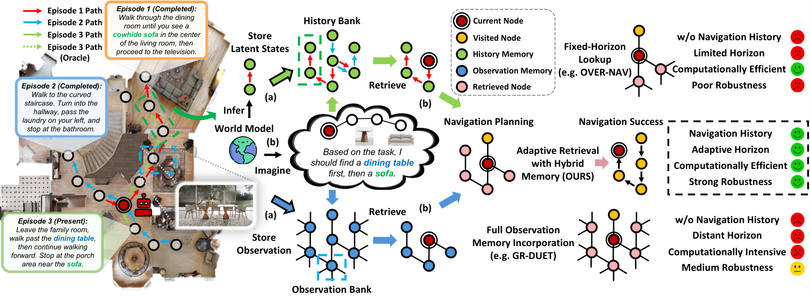
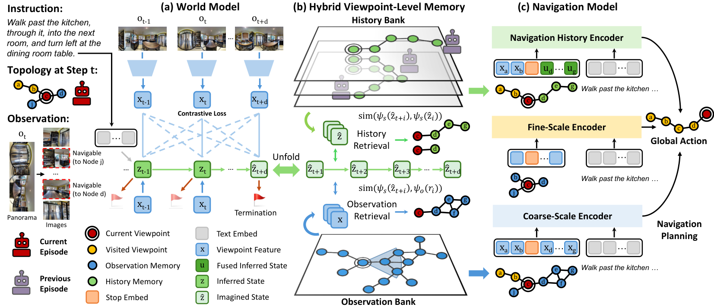
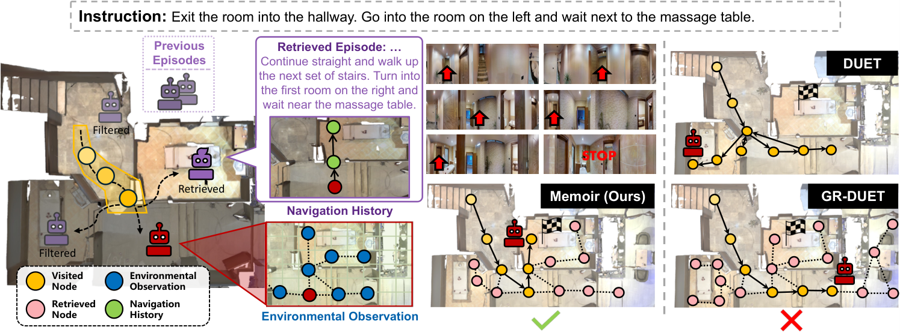
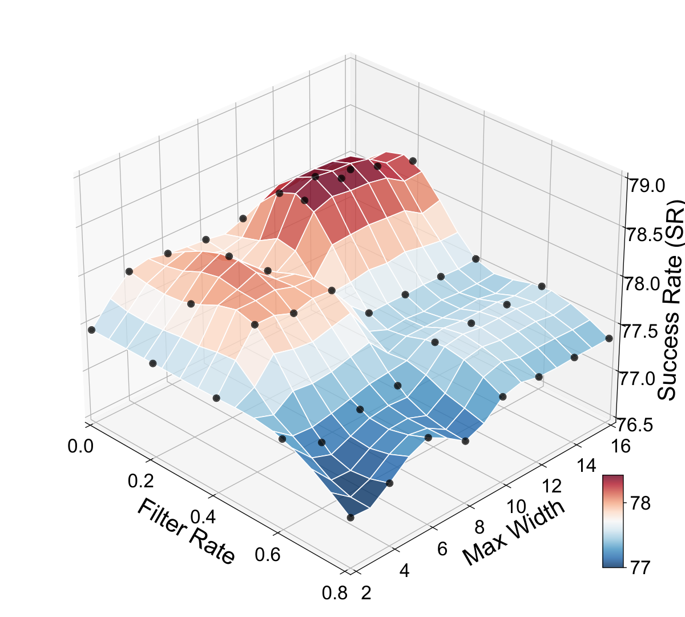
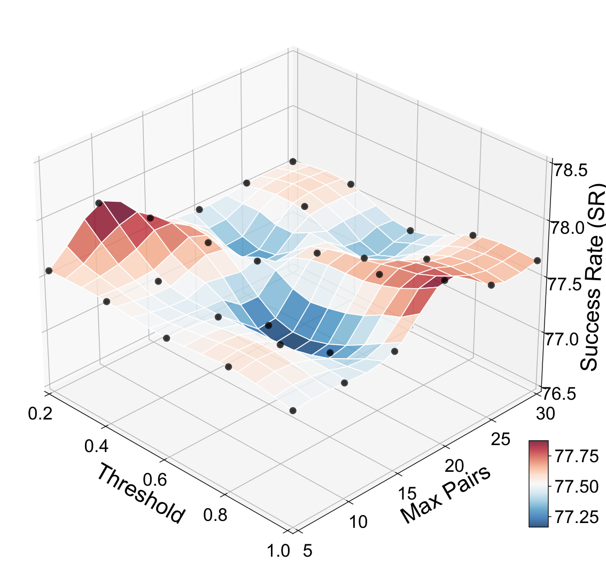
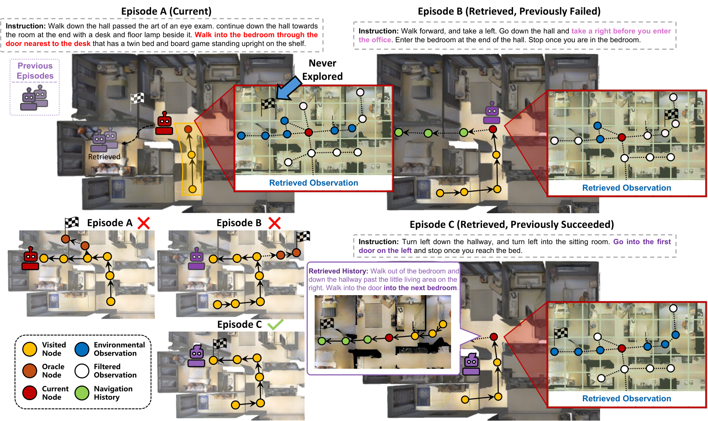

# Dream to Recall: Imagination-Guided Experience Retrieval for Memory-Persistent Vision-and-Language Navigation

> Dream to Recall: Imagination-Guided Experience Retrieval for Memory-Persistent Vision-and-Language Navigation — Xu et al. (2026). Source: https://arxiv.org/abs/2510.08553v2. License: CC-BY-4.0 (https://creativecommons.org/licenses/by/4.0/). Chinese translations and figure/table extraction are adaptations; no author endorsement is implied.

## 论文信息

**Original:**

Vision-and-Language Navigation (VLN) requires agents to follow natural language instructions through environments, with memory-persistent variants demanding progressive improvement through accumulated experience. Existing approaches for memory-persistent VLN face critical limitations: they lack effective memory access mechanisms, instead relying on entire memory incorporation or fixed-horizon lookup, and predominantly store only environmental observations while neglecting navigation behavioral patterns that encode valuable decision-making strategies. We present Memoir, which employs imagination as a retrieval mechanism grounded by explicit memory: a world model imagines future navigation states as queries to selectively retrieve relevant environmental observations and behavioral histories. The approach comprises: 1) a language-conditioned world model that imagines future states serving dual purposes: encoding experiences for storage and generating retrieval queries; 2) Hybrid Viewpoint-Level Memory that anchors both observations and behavioral patterns to viewpoints, enabling hybrid retrieval; and 3) an experience-augmented navigation model that integrates retrieved knowledge through specialized encoders. Extensive evaluation across diverse memory-persistent VLN benchmarks with 10 distinct testing scenarios demonstrates Memoir’s effectiveness: significant improvements across all scenarios, with 5.4% SPL gains on IR2R over the best memory-persistent baseline, accompanied by 8.3× training speedup and 74% inference memory reduction. The results validate that predictive retrieval of both environmental and behavioral memories enables more effective navigation, with analysis indicating substantial headroom (73.3% vs 93.4% upper bound) for this imagination-guided paradigm.

**中文:**

视觉语言导航（VLN）要求智能体按照自然语言指令穿行环境；在记忆持续保留的设置下，智能体还需要通过经验积累逐步改善表现。现有记忆持续型 VLN 方法存在两项关键局限：访问记忆时缺少有效机制，要么使用全部记忆，要么只查询固定范围；保存的也主要是环境观测，忽略了包含重要决策策略的导航行为模式。我们提出 Memoir，以显式记忆为依据，将想象作为检索机制：世界模型预测未来导航状态，再以这些状态为查询，有选择地检索相关环境观测和行为历史。方法包括：(1) 以语言为条件的世界模型，预测未来状态，既用于将经验编码后存储，也用于生成检索查询；(2) 混合视点级记忆，将观测与行为模式绑定到具体视点，支持混合检索；(3) 经验增强导航模型，通过专门编码器整合检索知识。我们在多种记忆持续型 VLN 基准、共 10 个不同测试场景上广泛评估，所有场景均显著提升。在 IR2R 上，SPL 比最佳记忆持续型基线提高 5.4%，训练速度达到其 8.3 倍，推理内存占用减少 74%。结果验证了同时预测性检索环境和行为记忆的有效性；分析也表明，该想象引导范式仍有明显提升空间，当前结果为 73.3%，理想上界为 93.4%。

## 引言

**Original:**

Vision-and-Language Navigation (VLN) [1] represents a cornerstone challenge in embodied AI, requiring agents to interpret natural language instructions and navigate through environments to reach specified goals. The fundamental episodic nature of traditional VLN tasks [1, 2, 3], where agents operate independently across episodes without retaining experiential knowledge, limits their capacity for progressive improvement and environmental adaptation, constraining real-world applicability where sustained operation is essential. This limitation has motivated the development of memory-persistent navigation tasks [4, 5, 6] that evaluate agents’ ability to accumulate and leverage experience across multiple navigation episodes. These tasks more accurately reflect practical application scenarios where robotic agents must continuously improve their navigation capabilities through environmental familiarity and learned behavioral patterns.

**中文:**

视觉语言导航（VLN）[1] 是具身智能的基础挑战，要求智能体理解自然语言指令，并在环境中导航至指定目标。传统 VLN [1, 2, 3] 以相互独立的回合运行，回合之间不保留经验知识，因而限制了逐步改进和环境适应，也限制了它在需要持续运行的真实场景中的应用。为此，记忆持续型导航任务 [4, 5, 6] 被提出，用于评估智能体能否跨多个导航回合积累并利用经验。这更符合实际需求：机器人应通过熟悉环境和学习行为模式，不断提高导航能力。

**Original:**

Fig. 1: Overview of Memoir’s workflow for experience retrieval via imagination. (a) In previous episodes (1 and 2), the agent populates the history bank with latent states encoded by the world model, and fills the observation bank with observations. (b) In the current episode (3), the agent utilizes world model imagination to generate retrieval queries and retrieves memory from both memory banks at each viewpoint for navigation planning. Compared with GR-DUET [6] that incorporates all retained observation memory and OVER-NAV [7] that only applies fixed-horizon lookup, our approach adaptively retrieves both observation and histories for navigation planning through imagination.

**中文:**

图 1：Memoir 通过想象检索经验的流程。(a) 在此前的第 1、2 个回合中，智能体将世界模型编码的隐状态存入历史库，将观测存入观测库。(b) 当前第 3 个回合中，智能体用世界模型想象未来状态以生成查询，并在每个视点从两个记忆库检索内容，辅助导航规划。GR-DUET [6] 使用所有保留的观测记忆，OVER-NAV [7] 只在固定范围内查找；我们则通过想象，自适应检索观测和行为历史。

**Original:**

Recent advances in memory-persistent VLN have primarily focused on long-term memory mechanisms for progressive scene knowledge accumulation. Early approaches employed strategies such as episodic history stacking [5], but simply extending history suffers from redundancy-induced performance degradation. Subsequent work [8] addressed this by augmenting visual representations with broader spatial horizons rather than incorporating navigation histories, while OVER-NAV [7] leverages open-vocabulary detection to construct multimodal topological graphs that strengthen keyword-observation correspondence. Most recently, GR-DUET [6] enhanced the DUET architecture [9] with retained topological observation memory, achieving strong performance in VLN scene adaptation.

**中文:**

记忆持续型 VLN 的近期进展主要关注长期记忆，以逐步积累场景知识。早期采用跨回合堆叠历史等策略 [5]，但单纯延长历史会因冗余造成性能下降。后续工作 [8] 扩大视觉表示所覆盖的空间范围，而不加入导航历史；OVER-NAV [7] 利用开放词汇检测构建多模态拓扑图，加强关键词与观测之间的对应。最新的 GR-DUET [6] 在 DUET [9] 中保留拓扑观测记忆，取得较好的 VLN 场景适应表现。

**Original:**

Despite these advances, existing approaches exhibit two critical limitations. First, current approaches lack effective memory access mechanisms, instead relying on either complete memory incorporation (leading to irrelevant information integration and computational overhead) or fixed-horizon spatial lookup (risking valuable experience loss). Second, navigation behavioral histories contain valuable decision-making patterns regarding how agents interpreted instructions and selected actions across different scenarios. However, existing memory-persistent VLN methods either ignore them entirely or, when attempted [5], fail to effectively leverage this information.

**中文:**

尽管如此，现有方法仍有两项关键局限。第一，缺少有效的记忆访问机制：使用全部记忆会引入无关信息并增加计算开销，只查固定空间范围又可能漏掉重要经验。第二，导航行为历史记录了智能体在不同场景中如何理解指令、选择动作，包含有价值的决策模式；但现有记忆持续型方法要么完全忽略这类历史，要么虽有尝试 [5]，却未能有效利用。

**Original:**

How can agents effectively determine which memories to access in order to leverage navigation experiences? Human navigators naturally engage in mental imagination of navigation routes [10] and future travel events [11], consulting experiences to finalize decisions based on mental simulations [12], highlighting that imagination serves as a query mechanism—agents can predict where they might navigate and retrieve relevant past experiences matching those predicted states. This paradigm differs from traditional imagine-planning approaches [13] that generate trajectories in isolation; instead, imagination is grounded by querying explicit long-term memory, ensuring retrieved experiences directly inform decision-making while avoiding hallucination. To this end, we propose Model-based Hybrid Viewpoint-Level Memory for Experience Retrieval (Memoir), an agent that employs predictive world modeling for memory retrieval at viewpoint granularity. Our approach addresses the aforementioned limitations through a unified framework. First, adaptive retrieval is grounded by using imagined future states as queries to selectively access verified experiences, avoiding both complete memory incorporation and fixed-horizon lookup. Second, behavioral pattern preservation is enabled by encoding navigation histories into latent states that capture decision-making strategies with viewpoint-level anchoring. Figure 1 illustrates Memoir’s workflow from memory storage to retrieval.

**中文:**

智能体应如何决定访问哪些记忆，才能利用好导航经验？人类导航时会在脑中想象路线 [10] 和未来行程 [11]，再参照经验，根据心理模拟做出决定 [12]。这提示想象可以充当查询机制：先预测自己可能走到哪里，再检索与预测状态相符的历史经验。传统想象规划方法 [13] 独立生成轨迹；这里则通过查询显式长期记忆，让想象得到经验依据，直接为决策提供信息并避免幻觉。为此，我们提出基于模型的混合视点级经验检索记忆（Model-based Hybrid Viewpoint-Level Memory for Experience Retrieval，Memoir），利用预测世界模型在视点粒度检索记忆。统一框架从两方面解决前述局限：以想象的未来状态为查询，选择性访问已验证经验，摆脱全部并入或固定范围查找；同时，将导航历史编码为隐状态并绑定到视点，保存其中的决策模式。图 1 展示了从存储到检索的流程。

**Original:**

Realizing this imagination-guided paradigm requires addressing three challenges: how to generate predictive queries, what to store and retrieve, and how to integrate retrieved knowledge for navigation. Memoir tackles these through a unified framework. 1) A language-conditioned world model learns to imagine future navigation states conditioned on instructions. These imagined states serve dual purposes: encoding current experience into latent representations for storage, and generating queries to retrieve similar past experiences. 2) Hybrid Viewpoint-Level Memory (HVM) maintains this accumulated knowledge by anchoring both environmental observations and behavioral patterns to viewpoints, enabling retrieval of not just what agents saw, but how they navigated. 3) The navigation model then processes current observations alongside retrieved experiences through specialized encoders to make informed decisions. This enables adaptive memory access that preserves strategic knowledge across episodes.

**中文:**

实现想象引导检索，需要回答三个问题：如何生成预测查询、存取什么内容，以及如何将检索知识用于导航。Memoir 用统一框架解决：(1) 语言条件世界模型根据指令学习预测未来导航状态，既将当前经验编码成隐表示以供存储，也生成查询以检索相似历史经验；(2) 混合视点级记忆（HVM）把环境观测和行为模式绑定到视点，不仅能检索“看到过什么”，也能检索“当时怎样导航”；(3) 导航模型通过专门编码器处理当前观测和检索经验，再做决策。由此实现自适应访问记忆，并跨回合保留策略知识。

**Original:**

We implement Memoir on various VLN methods, validating its effectiveness across memory-persistent benchmarks with 10 distinctive testing scenarios. Memoir demonstrates consistent improvements, achieving 5.4% improvement in SPL on IR2R [5], accompanied by 8.3× training speedup and 74% inference memory reduction. We also reveal substantial headroom (73.3% vs 93.4% upper bound) for this paradigm and illuminate future directions. Our key contributions include:

**中文:**

我们将 Memoir 应用到多种 VLN 方法，在包含 10 种不同测试场景的记忆持续型基准上验证其有效性。Memoir 持续改善表现，IR2R [5] 上 SPL 提升 5.4%，训练速度达到 8.3 倍，推理内存占用减少 74%。分析还揭示出明显提升空间：当前 73.3%，理想上界 93.4%，并指出了未来方向。主要贡献如下：

**Original:**

A Novel Paradigm of Imagination-Guided Retrieval: We propose a paradigm shift from passive memory accumulation to active, predictive retrieval. Unlike traditional methods that rely on full incorporation or fixed-horizon lookup, we utilize a language-conditioned world model to imagine future states as dynamic queries. This approach grounds imagination in verified experience, enabling the adaptive filtering of both environmental observations and behavioral histories based on navigation intent.

**中文:**

想象引导检索的新范式：从被动积累记忆转向主动、预测性的检索。语言条件世界模型预测未来状态，将其作为动态查询，让想象有已验证经验作为依据，并根据导航意图自适应筛选环境观测与行为历史，不再依赖全部记忆或固定范围查询。

**Original:**

Hybrid Viewpoint-Level Memory Architecture: We introduce a unified memory architecture that anchors both environmental observations and behavioral decision patterns encoded by the world model to specific viewpoints. This allows the agent to leverage historical navigation strategies alongside visual context, a dimension largely neglected in prior DUET-style architectures.

**中文:**

混合视点级记忆架构：把环境观测和世界模型编码的行为决策模式统一绑定到具体视点，使智能体同时利用历史导航策略与视觉情境；此前 DUET 类架构基本忽略了历史行为这一维度。

**Original:**

Efficient and Robust Navigation System: We develop Memoir, which integrates specific VLN architectural innovations including a Navigation-History Encoder. Extensive evaluations demonstrate consistent improvements with significant efficiency benefits, while oracle analysis reveals substantial headroom, illuminating promising directions for advancing this paradigm.

**中文:**

高效、稳健的导航系统：Memoir 整合了导航历史编码器等 VLN 架构设计。广泛评估显示，系统持续改善表现并明显提高效率；理想条件分析揭示出较大提升空间，为推进这一范式指出研究方向。

## 相关工作

**Original:**

Vision-and-Language Navigation (VLN) [1, 3, 2] requires agents to follow natural language instructions while navigating toward target destinations. Single-episode VLN research has evolved through data augmentation approaches from speaker models [14, 15, 16] to synthetic data [17, 18] using Large Language Models (LLMs), and memory architectures progressing from historical representations [19, 20] to structured spatial systems, particularly topological observation memory [21, 9] which has been widely adopted. However, these single-episode approaches cannot accumulate knowledge across episodes. Memory-persistent VLN benchmarks [5, 6] address real-world requirements where agents should operate continuously and improve through accumulated experience. TourHAMT [5] extends historical memory by stacking complete navigation sequences, but suffers performance degradation from excessive redundancy. ESceme [8] enhances environmental observations with broader spatial contexts, while OVER-NAV [7] constructs omni-graphs with fixed-distance retrieval. MAP-CMA [5] builds global semantic maps augmented with fixed-horizon egocentric perception. GR-DUET [6] retains complete topological memory, achieving performance gains at computational cost. These approaches share fundamental limitations: reliance on complete memory incorporation or fixed-horizon lookup, and exclusive focus on environmental observations while neglecting navigation behavioral patterns that encode decision-making strategies across contexts. Our work addresses these limitations through imagination-guided memory retrieval that selectively accesses both environmental and behavioral histories.

**中文:**

视觉语言导航（VLN）[1, 3, 2] 要求智能体遵循自然语言指令，移动至目标位置。单回合 VLN 的数据增强已从指令生成模型 [14, 15, 16] 发展到使用大语言模型合成数据 [17, 18]；记忆架构则从历史表示 [19, 20] 发展为结构化空间系统，尤其是广泛采用的拓扑观测记忆 [21, 9]。但这些方法不能跨回合积累知识。记忆持续型 VLN 基准 [5, 6] 面向持续运行、通过经验改进的实际需求。TourHAMT [5] 堆叠完整导航序列扩展历史，冗余过多却会损害性能。ESceme [8] 用更广空间情境增强环境观测，OVER-NAV [7] 构建 omni-graph 并按固定距离检索，MAP-CMA [5] 构建全局语义地图并补充固定范围的第一视角感知，GR-DUET [6] 则保留完整拓扑记忆，以额外计算换取性能。它们共同的局限是依赖全部记忆或固定范围查询，并主要关注环境观测，忽略跨情境决策策略所蕴含的导航行为模式。我们通过想象引导检索，选择性访问环境与行为历史，解决这些问题。

**Original:**

Memory mechanisms in navigation systems encompass two primary types that serve complementary roles in spatial reasoning. Navigation history memory captures temporal decision-making patterns and behavioral context through sequence representations [22, 19] or natural language expression [23, 24], preserving how agents make decisions across different scenarios. Environmental observation memory preserves spatial information through structured representations such as occupancy maps [25, 26], semantic maps [27, 28], bird’s-eye view representations [29, 30], and topological memory [31, 32, 33], maintaining spatial layouts and visual features for scene understanding. In memory-persistent scenarios where agents must accumulate knowledge across diverse experiences, current approaches [5, 6] treat these information sources separately. Environmental observations alone cannot encode the behavioral reasoning underlying navigation decisions, while navigation histories without spatial anchoring cannot disambiguate similar patterns across different environments. This separation limits knowledge transfer across navigation scenarios, motivating our unified memory that leverages both spatial and temporal historical information.

**中文:**

导航记忆主要有两类，在空间推理中相互补充。导航历史记忆通过序列表示 [22, 19] 或自然语言表达 [23, 24] 保存时间顺序中的决策模式与行为情境，记录智能体在不同场景中如何决策。环境观测记忆则借助占据地图 [25, 26]、语义地图 [27, 28]、鸟瞰表示 [29, 30] 和拓扑记忆 [31, 32, 33] 等结构，保存空间布局与视觉特征以理解场景。记忆持续型场景需要从多样经验中积累知识，但现有方法 [5, 6] 分别处理这两类信息。仅有观测无法表示导航决策背后的行为推理，而没有空间定位的导航历史，也难以区分不同环境中外观相似的行为模式。这种分离限制了跨导航场景的知识迁移，因此我们用统一记忆共同利用历史空间和时间信息。

**Original:**

Predictive world models have demonstrated significant impact in reinforcement learning through POMDP solutions via latent dynamics modeling [34, 35]. The Recurrent State-Space Model (RSSM) [34] represents the dominant architecture, with extensions to language conditioning [36] and large-scale pretraining [37]. Contrastive world models [38, 39] offer computational efficiency without observation reconstruction. In navigation domains, world models [40] serve diverse purposes: future observation synthesis for data augmentation [41, 42], trajectory planning through imagination [43, 44, 13, 45], and auxiliary task formulation [46, 47]. While effective, using world models as surrogate environments often suffer from compounding hallucination errors in complex tasks. A nascent alternative is using world models for memory access. MBEC [48] pioneered this direction in episodic control, but is limited to querying episodic buffers for policy optimization during training. Our approach advances this to a “Dream to Recall” paradigm by unifying world modeling with retrieval for navigation reasoning. This repurposes the world model from a simulator to a neural search engine, anchoring imagination to grounded, long-term navigation experience.

**中文:**

预测世界模型通过隐空间动力学建模求解 POMDP，在强化学习中发挥了重要作用 [34, 35]。循环状态空间模型（RSSM）[34] 是主要架构，后续扩展包括语言条件化 [36] 和大规模预训练 [37]。对比式世界模型 [38, 39] 无须重建观测，因此计算更高效。导航中的世界模型 [40] 用途多样，包括合成未来观测进行数据增强 [41, 42]、通过想象规划轨迹 [43, 44, 13, 45]，以及构造辅助任务 [46, 47]。但把世界模型当作替代环境，在复杂任务中容易累积幻觉误差。新出现的另一种做法是用世界模型访问记忆。MBEC [48] 在情景控制中开创了这一方向，但只在训练期间查询情景缓冲区以优化策略。我们进一步提出“Dream to Recall（通过想象唤回经验）”范式，将世界建模与导航推理中的检索结合，把世界模型从模拟器改作神经检索器，让想象关联到有实际依据的长期导航经验。

## 基础定义

**Original:**

Vision-and-Language Navigation (VLN) requires an agent to follow instructions and navigate towards a target. The environment is represented as a connectivity graph $\mathcal{G}=(\mathcal{V},\mathcal{E})$, where $\mathcal{V}$ denotes navigable viewpoints and $\mathcal{E}$ represents traversable edges connecting adjacent viewpoints.

**中文:**

VLN 要求智能体遵循指令导航至目标。环境表示为连通图 $\mathcal{G}=(\mathcal{V},\mathcal{E})$，其中 $\mathcal{V}$ 为可导航视点，$\mathcal{E}$ 为连接相邻视点、可以通行的边。

**Original:**

Single-Episode VLN Formulation. In the traditional episodic setting, an agent receives a natural language instruction $\ell$ and is initialized at a starting viewpoint $v_{1}\in\mathcal{V}$. At each timestep $t$, the agent observes a panoramic observation $o_{t}=\{o_{t}^{(i)}\}_{i=1}^{36}$ comprising 36 directional views: 12 horizontal viewing angles, each captured at three elevation levels (upward, horizontal, downward). The agent’s action space at viewpoint $v_{t}$ includes navigation to any neighboring viewpoint $v_{j}\in\mathcal{N}(v_{t})$ and a terminal stop action, where $\mathcal{N}(v_{t})=\{v_{j}\in\mathcal{V}:(v_{t},v_{j})\in\mathcal{E}\}$ denotes the set of adjacent viewpoints. The episode terminates when the agent executes a stop action or reaches a maximum step limit $T_{\max}$.

**中文:**

单回合 VLN 定义。智能体接收自然语言指令 $\ell$，从 $v_{1}\in\mathcal{V}$ 出发。每个时间步 $t$，获得全景观测 $o_{t}=\{o_{t}^{(i)}\}_{i=1}^{36}$，包含 36 个方向视图：12 个水平方向，每个方向各有向上、水平、向下三个俯仰角。位于 $v_{t}$ 时，智能体可移动到任意相邻视点 $v_{j}\in\mathcal{N}(v_{t})$，也可以执行终止用的 stop 动作；邻接集合定义为 $\mathcal{N}(v_{t})=\{v_{j}\in\mathcal{V}:(v_{t},v_{j})\in\mathcal{E}\}$。执行 stop 或达到最大步数 $T_{\max}$ 时，该回合结束。

**Original:**

Memory-Persistent VLN Formulation. While traditional VLN effectively evaluates basic instruction-following capabilities, it fails to capture the requirements of progressive improvement during persistent operation. Memory-persistent VLN addresses this limitation by introducing a persistent memory bank $\mathcal{M}=\{(\ell^{(k)},\mathcal{G}^{(k)},\mathcal{O}^{(k)},\mathcal{A}^{(k)})\}_{k=1}^{N}$ that accumulates experiential knowledge across multiple episodes, where for $k$-th episode, $\ell^{(k)}$ is the instruction, $\mathcal{G}^{(k)}=(\mathcal{V}^{(k)},\mathcal{E}^{(k)})$ is the observed subgraph after $k$ episodes, $\mathcal{O}^{(k)}=\{o_{t}^{(k)}\}_{t=1}^{T^{(k)}}$ and $\mathcal{A}^{(k)}=\{a_{t}^{(k)}\}_{t=1}^{T^{(k)}}$ records observations and actions respectively. The bank $\mathcal{M}$ is incrementally updated in each episode and serves as a persistent repository for decisions, enabling progressive performance improvement through accumulated environmental familiarity and learned behavioral patterns.

**中文:**

记忆持续型 VLN 定义。传统 VLN 可以评估基本指令遵循能力，却不能反映持续运行中逐步改进的要求。为此引入持久记忆库 $\mathcal{M}=\{(\ell^{(k)},\mathcal{G}^{(k)},\mathcal{O}^{(k)},\mathcal{A}^{(k)})\}_{k=1}^{N}$，跨多个回合积累经验。对第 $k$ 个回合，$\ell^{(k)}$ 为指令，$\mathcal{G}^{(k)}=(\mathcal{V}^{(k)},\mathcal{E}^{(k)})$ 是经历 $k$ 个回合后观察到的子图，$\mathcal{O}^{(k)}=\{o_{t}^{(k)}\}_{t=1}^{T^{(k)}}$ 和 $\mathcal{A}^{(k)}=\{a_{t}^{(k)}\}_{t=1}^{T^{(k)}}$ 分别记录观测和动作。$\mathcal{M}$ 每回合增量更新，为后续决策长期保存信息，使智能体能通过熟悉环境和学习行为模式逐步改善表现。

**Original:**

Fig. 2: Details of imagination-guided experience retrieval. (a) The world model learns state-observation compatibility through contrastive training (top). During navigation, it infers the current state from observations and instruction, then recursively imagines future states (bottom). (b) Imagined trajectories enable dual retrieval: histories via state sequence similarity matching, and observations via topological searching based on state-observation compatibility. (c) Three specialized encoders process retrieved navigation histories, local observations, and retrieved observations respectively to determine the final action.

**中文:**

图 2：想象引导经验检索的细节。(a) 世界模型通过对比训练学习状态与观测的匹配程度（上）；导航时根据观测和指令推断当前状态，再递归预测未来状态（下）。(b) 想象轨迹用于两种检索：以状态序列相似度匹配历史，以状态—观测匹配程度引导拓扑搜索来检索观测。(c) 三个专门编码器分别处理检索到的导航历史、局部观测和检索观测，最终确定动作。

**Original:**

DUET [9] enables topological navigation through topological mapping and global action planning.

**中文:**

DUET [9] 通过拓扑建图和全局动作规划实现导航。

**Original:**

Topological Mapping. The agent maintains an incrementally constructed topological representation $\mathcal{G}_{t}=(\mathcal{V}_{t},\mathcal{E}_{t})$ of the explored environment, where $\mathcal{G}_{t}\subseteq\mathcal{G}$ represents the observed subset after $t$ navigation steps. The viewpoint set $\mathcal{V}_{t}$ is partitioned into three categories: visited viewpoints, frontier viewpoints (observable but unvisited neighbors), and the current viewpoint. At each timestep $t$, the topological graph is updated by incorporating the current viewpoint $v_{t}$ and its navigable neighbors $\mathcal{N}(v_{t})$ into $\mathcal{V}_{t-1}$, with corresponding edge updates to $\mathcal{E}_{t-1}$. Visual representations $r_{t}=\{r_{t}^{(i)}\}_{i=1}^{36}$ are computed through an observation encoder applied to $o_{t}$. The visual representation of the current viewpoint $x_{t}$ is obtained via average pooling of $r_{t}$, while each unvisited neighboring viewpoint $v_{j}\in\mathcal{N}(v_{t})$ is represented by its corresponding directional embedding $r_{t}^{(i_{j})}$ where $i_{j}$ denotes the view index oriented toward $v_{j}$. For viewpoints observed from multiple locations, embeddings are averaged to maintain consistency.

**中文:**

拓扑建图。智能体逐步构建已探索环境的拓扑表示 $\mathcal{G}_{t}=(\mathcal{V}_{t},\mathcal{E}_{t})$，其中 $\mathcal{G}_{t}\subseteq\mathcal{G}$ 表示导航 $t$ 步后观察到的子图。$\mathcal{V}_{t}$ 分为已访问视点、可观测但尚未访问的相邻前沿视点，以及当前视点。每个时间步 $t$，把当前视点 $v_{t}$ 及可通行邻居 $\mathcal{N}(v_{t})$ 加入 $\mathcal{V}_{t-1}$，并相应更新边集合 $\mathcal{E}_{t-1}$。观测编码器处理 $o_{t}$，得到视觉表示 $r_{t}=\{r_{t}^{(i)}\}_{i=1}^{36}$。当前视点特征 $x_{t}$ 由 $r_{t}$ 平均池化得到；尚未访问的邻居 $v_{j}\in\mathcal{N}(v_{t})$ 则用朝向它的方向特征 $r_{t}^{(i_{j})}$ 表示，$i_{j}$ 是指向 $v_{j}$ 的视图索引。一个视点若从多个位置被观测到，就对这些嵌入取平均，以保持表示一致。

**Original:**

Global Action Planning. DUET combines coarse-scale planning over the topological graph with fine-scale planning over immediate neighbors. The instruction $\ell$ is processed through a transformer to obtain textual representations $\hat{\ell}$. For coarse-scale planning, node representations $x_{j}$ for viewpoints $v_{j}\in\mathcal{V}_{t}$ are augmented with a special stop token $x_{0}$. The coarse-scale encoder processes the instruction embedding $\hat{\ell}$ and viewpoint representations $X=[x_{0},x_{1},\ldots,x_{|\mathcal{V}_{t}|}]$ through cross-modal attention and Graph-Aware Self-Attention (GASA):

**中文:**

全局动作规划。DUET 结合拓扑图上的粗尺度规划与直接邻居上的细尺度规划。指令 $\ell$ 经 Transformer 得到文本表示 $\hat{\ell}$。粗尺度分支为各视点 $v_{j}\in\mathcal{V}_{t}$ 的节点表示 $x_{j}$ 添加特殊 stop 标记 $x_{0}$，形成 $X=[x_{0},x_{1},\ldots,x_{|\mathcal{V}_{t}|}]$；然后与 $\hat{\ell}$ 一起输入编码器，经跨模态注意力和图感知自注意力（GASA）处理：

**Original:**

$$
\text{GASA}(X)=\text{Softmax}\left(\frac{XW_{q}(XW_{k})^{T}}{\sqrt{d}}+M\right)XW_{v},
$$

 (1)

**中文:**

公式（符号保持不变）：

$$
\text{GASA}(X)=\text{Softmax}\left(\frac{XW_{q}(XW_{k})^{T}}{\sqrt{d}}+M\right)XW_{v},
$$

 (1)

**Original:**

where the distance encoding matrix $M=EW_{e}+b_{e}$ incorporates the pairwise distance matrix $E$. For fine-scale planning, the fine-scale encoder processes the instruction $\hat{\ell}$ and panoramic features $r_{t}$ to generate action scores for immediate neighbors $\mathcal{N}(v_{t})$. The final navigation decision combines both scales through learned dynamic weighting, producing action scores for each candidate viewpoint.

**中文:**

其中，距离编码矩阵 $M=EW_{e}+b_{e}$ 融入两两距离矩阵 $E$。细尺度分支处理指令 $\hat{\ell}$ 和全景特征 $r_{t}$，为直接邻居 $\mathcal{N}(v_{t})$ 计算动作分数。最后通过学习得到的动态权重融合两个尺度，为每个候选视点生成导航动作分数。

**Original:**

World models provide latent representations of environment dynamics, enabling efficient inference about future states. Given an observation sequence $(o_{1},o_{2},\ldots,o_{T})$, the world model operates on latent states $z_{t}$ that capture environmental dynamics. The joint distribution factorizes as:

**中文:**

世界模型以隐表示描述环境动力学，支持高效预测未来状态。给定观测序列 $(o_{1},o_{2},\ldots,o_{T})$，模型在捕捉环境变化的隐状态 $z_{t}$ 上运算，联合分布可分解为：

**Original:**

$$
p(o,z)=\prod_{t=1}^{T}p(z_{t}\midz_{t-1})p(o_{t}\midz_{t}).
$$

 (2)

**中文:**

公式（符号保持不变）：

$$
p(o,z)=\prod_{t=1}^{T}p(z_{t}\midz_{t-1})p(o_{t}\midz_{t}).
$$

 (2)

**Original:**

To maximize the observation likelihood $p(o_{1:T})$, the model introduces a variational posterior $q(z_{1:T}|o_{1:T})$ and derive the evidence lower bound (ELBO) [49]:

**中文:**

为最大化观测似然 $p(o_{1:T})$，模型引入变分后验 $q(z_{1:T}|o_{1:T})$，得到证据下界（ELBO）[49]：

**Original:**

$\displaystyle\ln p(o)$ $\displaystyle\geq\sum_{t=1}^{T}\Big(\mathbb{\mathbb{E}}_{q(z_{t}\mido_{\leq t})}[\underbrace{\ln p(o_{t}\midz_{t})}_{\mathcal{J}_{\mathrm{RECOVER}}}]$ (3) $\displaystyle-\mathbb{\mathbb{E}}_{q(z_{t-1}|o_{\leq t})}[\underbrace{\mathrm{\operatorname{KL}}[q(z_{t}\mido_{\leq t})\;\|\;p(z_{t}\midz_{t-1})]}_{\mathcal{J}_{\mathrm{KL}}}]\Big).$

**中文:**

公式（符号保持不变）：

$\displaystyle\ln p(o)$ $\displaystyle\geq\sum_{t=1}^{T}\Big(\mathbb{\mathbb{E}}_{q(z_{t}\mido_{\leq t})}[\underbrace{\ln p(o_{t}\midz_{t})}_{\mathcal{J}_{\mathrm{RECOVER}}}]$ (3) $\displaystyle-\mathbb{\mathbb{E}}_{q(z_{t-1}|o_{\leq t})}[\underbrace{\mathrm{\operatorname{KL}}[q(z_{t}\mido_{\leq t})\;\|\;p(z_{t}\midz_{t-1})]}_{\mathcal{J}_{\mathrm{KL}}}]\Big).$

**Original:**

To empower the model with discriminative power while avoiding pixel-level reconstruction, the term $\mathcal{J}_{\mathrm{RECOVER}}$ is replaced with a contrastive objective [35, 39]. Following the information-theoretic derivation, we can lower-bound $\mathcal{J}_{\mathrm{RECOVER}}$ using noise-contrastive estimation (NCE) [50]:

**中文:**

为学习判别能力，同时避免逐像素重建，我们用对比目标 [35, 39] 替代 $\mathcal{J}_{\mathrm{RECOVER}}$。根据信息论推导，可通过噪声对比估计（NCE）[50] 为 $\mathcal{J}_{\mathrm{RECOVER}}$ 构造下界：

**Original:**

$\displaystyle\mathcal{J}_{\mathrm{RECOVER}}$ $\displaystyle\geq\mathbb{\mathbb{E}}_{q(z_{t}\mid\cdot)}\bigg[\ln p(z_{t}\mido_{t})-\ln\sum_{o^{\prime}\in\mathcal{D}}p(z_{t}\mido^{\prime})\bigg]$ (4) $\displaystyle=\mathcal{J}_{\mathrm{NCE}},$

**中文:**

公式（符号保持不变）：

$\displaystyle\mathcal{J}_{\mathrm{RECOVER}}$ $\displaystyle\geq\mathbb{\mathbb{E}}_{q(z_{t}\mid\cdot)}\bigg[\ln p(z_{t}\mido_{t})-\ln\sum_{o^{\prime}\in\mathcal{D}}p(z_{t}\mido^{\prime})\bigg]$ (4) $\displaystyle=\mathcal{J}_{\mathrm{NCE}},$

**Original:**

where $\mathcal{D}$ represents a mini-batch of negative samples. This contrastive objective trains the model to distinguish between correct state-observation pairs $(z_{t},o_{t})$ and incorrect pairs $(z_{t},o^{\prime})$, effectively learning representations that capture environmental detail without explicit reconstruction.

**中文:**

其中，$\mathcal{D}$ 是一个小批量负样本集合。对比目标让模型区分正确配对 $(z_{t},o_{t})$ 和错误配对 $(z_{t},o^{\prime})$，从而无须显式重建，也能学到保留环境细节的表示。

## Memoir

**Original:**

This section presents Memoir, a memory-persistent VLN agent that employs world model imagination for adaptive experience retrieval. As illustrated in Figure 2, our approach comprises three components: a language-conditioned contrastive world model that encodes histories and imagines future states as retrieval queries, a Hybrid Viewpoint-Level Memory (HVM) that stores both environmental observations and navigation histories for retrieval, and an experience-augmented navigation model integrating retrieved knowledge for navigation planning. To facilitate reading, we list the crucial notations in Memoir in Table I.

**中文:**

本节介绍 Memoir，一种用世界模型想象来实现自适应经验检索的记忆持续型 VLN 智能体。如图 2 所示，系统包括：编码历史并预测未来状态查询的语言条件对比世界模型；保存环境观测和导航历史的混合视点级记忆（HVM）；以及将检索知识用于规划的经验增强导航模型。关键符号见表 I。

**Original:**

**TABLE I: Key notation summary.**

| Notation | Description |
| --- | --- |
| $\mathcal{G}_{t}=(\mathcal{V}_{t},\mathcal{E}_{t})$ | Episodic graph at step $t$ (viewpoints, edges) |
| $\mathcal{G}^{(k)}=(\mathcal{V}^{(k)},\mathcal{E}^{(k)})$ | Persistent graph accumulated over $k$ episodes |
| $\ell$, $\hat{\ell}$ | Natural language instruction & embedding |
| $o_{t}=\{o_{t}^{(i)}\}_{i=1}^{36}$, $r_{t}=\{r_{t}^{(i)}\}_{i=1}^{36}$ | Panoramic observation & features (36 views) |
| $x_{t}=\text{AvgPool}(r_{t})$ | Viewpoint feature via average pooling |
| $\gamma_{t}$, $\epsilon$ | Reward signal (distance to goal), stop threshold |
| $z_{t}$, $\hat{z}_{t}$ | Inferred state & imagined state |
| $\psi_{s}$, $\psi_{o}$ | State & observation embedding functions |
| $\tau_{t}=\{\hat{z}_{t+i}\}_{i=1}^{H_{t}}$ | Imagined trajectory with horizon $H_{t}$ |
| $D$ | Overshooting dist. and max imagination horizon |
| $\mathcal{M}_{o}=(\mathcal{V}_{o},\mathcal{X}_{o})$ | Observation bank (viewpoints, features) |
| $\mathcal{M}_{h}=(\mathcal{V}_{h},\mathcal{Z}_{h},\mathcal{T}_{h})$ | History bank (viewpoints, states, trajectories) |
| $c_{i,j}$, $c_{i}$ | Compatibility scores for retrieval |
| $W$, $P$ | Max width for obs. & max patterns for history |
| $\rho_{o}$, $\gamma_{o}$ | Filter rate & decay factor for obs. retrieval |
| $\theta_{h}$, $\gamma_{h}$ | Base threshold & decay factor for history retrieval |
| $\sigma_{c}$, $\sigma_{f}$, $\sigma_{h}$ | Fusion weights for navigation model encoders |
| $s_{j}^{(c)}$, $s_{j}^{(f)}$, $s_{j}^{(h)}$ | Action scores (coarse, fine, history) |

**中文:**

**表 I：关键符号汇总。**

| 符号 | 含义 |
| --- | --- |
| $\mathcal{G}_{t}=(\mathcal{V}_{t},\mathcal{E}_{t})$ | 第 $t$ 步的回合内图（视点、边） |
| $\mathcal{G}^{(k)}=(\mathcal{V}^{(k)},\mathcal{E}^{(k)})$ | 累积 $k$ 个回合得到的持久图 |
| $\ell$, $\hat{\ell}$ | 自然语言指令及其嵌入 |
| $o_{t}=\{o_{t}^{(i)}\}_{i=1}^{36}$, $r_{t}=\{r_{t}^{(i)}\}_{i=1}^{36}$ | 全景观测及特征（36 个视图） |
| $x_{t}=\text{AvgPool}(r_{t})$ | 平均池化得到的视点特征 |
| $\gamma_{t}$, $\epsilon$ | 奖励信号（距目标距离）及停止阈值 |
| $z_{t}$, $\hat{z}_{t}$ | 推断状态与想象状态 |
| $\psi_{s}$, $\psi_{o}$ | 状态与观测的嵌入函数 |
| $\tau_{t}=\{\hat{z}_{t+i}\}_{i=1}^{H_{t}}$ | 预测范围为 $H_{t}$ 的想象轨迹 |
| $D$ | overshooting 距离及最大想象范围 |
| $\mathcal{M}_{o}=(\mathcal{V}_{o},\mathcal{X}_{o})$ | 观测库（视点、特征） |
| $\mathcal{M}_{h}=(\mathcal{V}_{h},\mathcal{Z}_{h},\mathcal{T}_{h})$ | 历史库（视点、状态、轨迹） |
| $c_{i,j}$, $c_{i}$ | 检索匹配分数 |
| $W$, $P$ | 观测检索最大宽度及历史检索最大模式数 |
| $\rho_{o}$, $\gamma_{o}$ | 观测检索过滤率及衰减因子 |
| $\theta_{h}$, $\gamma_{h}$ | 历史检索初始阈值及衰减因子 |
| $\sigma_{c}$, $\sigma_{f}$, $\sigma_{h}$ | 导航模型各编码器的融合权重 |
| $s_{j}^{(c)}$, $s_{j}^{(f)}$, $s_{j}^{(h)}$ | 粗尺度、细尺度及历史分支的动作分数 |

**Original:**

To adapt the basic contrastive world model that focuses solely on environmental dynamics [35] for VLN task, our approach explicitly incorporates instruction conditioning to leverage the strong prior knowledge inherent in VLN tasks. We extend the standard ELBO formulation by incorporating instruction $\ell$ and reward signal $\gamma_{t}$ (indicating distance to goal):

**中文:**

基础对比世界模型只关注环境动力学 [35]。为将其用于 VLN，我们显式加入指令条件，利用导航任务本身的强先验。将指令 $\ell$ 和表示距目标距离的奖励信号 $\gamma_{t}$ 纳入标准 ELBO：

**Original:**

$\displaystyle\ln p(o,\gamma\mid\ell)$ $\displaystyle\geq\sum_{t=1}^{T}\Big(\mathbb{\mathbb{E}}_{q(z_{t}\mido_{\leq t},\ell)}[\underbrace{\ln p(\gamma_{t}\midz_{t})}_{\mathcal{J}_{\mathrm{REWARD}}}]$ (5) $\displaystyle+$ $\displaystyle\mathbb{\mathbb{E}}_{q(z_{t}\mido_{\leq t},\ell)}[\underbrace{\ln p(z_{t}\mido_{t})-\ln\sum_{o^{\prime}\in\mathcal{D}}p(z_{t}\mido^{\prime})}_{\mathcal{J}_{\mathrm{NCE}}}]$ $\displaystyle-$ $\displaystyle\mathbb{\mathbb{E}}_{q(z_{t-1}|o_{\leq t},\ell)}[\underbrace{\mathrm{\operatorname{KL}}[q(z_{t}\mido_{\leq t},\ell)\;\|\;p(z_{t}\midz_{t-1})]}_{\mathcal{J}_{\mathrm{KL}}}]\Big),$

**中文:**

公式（符号保持不变）：

$\displaystyle\ln p(o,\gamma\mid\ell)$ $\displaystyle\geq\sum_{t=1}^{T}\Big(\mathbb{\mathbb{E}}_{q(z_{t}\mido_{\leq t},\ell)}[\underbrace{\ln p(\gamma_{t}\midz_{t})}_{\mathcal{J}_{\mathrm{REWARD}}}]$ (5) $\displaystyle+$ $\displaystyle\mathbb{\mathbb{E}}_{q(z_{t}\mido_{\leq t},\ell)}[\underbrace{\ln p(z_{t}\mido_{t})-\ln\sum_{o^{\prime}\in\mathcal{D}}p(z_{t}\mido^{\prime})}_{\mathcal{J}_{\mathrm{NCE}}}]$ $\displaystyle-$ $\displaystyle\mathbb{\mathbb{E}}_{q(z_{t-1}|o_{\leq t},\ell)}[\underbrace{\mathrm{\operatorname{KL}}[q(z_{t}\mido_{\leq t},\ell)\;\|\;p(z_{t}\midz_{t-1})]}_{\mathcal{J}_{\mathrm{KL}}}]\Big),$

**Original:**

where $\mathcal{J}_{\text{REWARD}}$ encourages accurate goal proximity prediction for imagination termination. The negative sample set $\mathcal{D}$ comprises observations from different timesteps and episodes within each training batch. The contrastive term $\mathcal{J}_{\text{NCE}}$ is implemented through a learnable function that measures compatibility between latent states and visual observations:

**中文:**

其中，$\mathcal{J}_{\text{REWARD}}$ 促使模型准确预测与目标的距离，用于决定何时停止想象。负样本集 $\mathcal{D}$ 包括同一训练批次中不同时间步、不同回合的观测。对比项 $\mathcal{J}_{\text{NCE}}$ 通过一个可学习函数实现，衡量隐状态与视觉观测的匹配程度：

**Original:**

$\displaystyle f($ $\displaystyle z_{t},o_{t})=\frac{1}{\zeta}\operatorname{sim}(\psi_{s}(z_{t}),\psi_{o}(x_{t}))$ (6) $\displaystyle p(z_{t}\mido_{t})\propto\exp(f(z_{t},o_{t})),$

**中文:**

公式（符号保持不变）：

$\displaystyle f($ $\displaystyle z_{t},o_{t})=\frac{1}{\zeta}\operatorname{sim}(\psi_{s}(z_{t}),\psi_{o}(x_{t}))$ (6) $\displaystyle p(z_{t}\mido_{t})\propto\exp(f(z_{t},o_{t})),$

**Original:**

where $x_{t}$ represents the visual feature extracted through DUET’s observation encoder via averge pooling, $\psi_{s}$ and $\psi_{o}$ are learned embedding functions that map states and observations to a shared embedding space, $\text{sim}(a,b)=\frac{a^{\top}b}{\|a\|\|b\|}$ denotes cosine similarity, and $\zeta$ denotes temperature parameter. This formulation enables principled assessment of compatibility between imagined states and observations stored in long-term memory, providing a foundation for similarity-based memory retrieval.

**中文:**

其中，$x_{t}$ 是 DUET 观测编码器通过平均池化得到的视觉特征；可学习嵌入函数 $\psi_{s}$ 和 $\psi_{o}$ 将状态与观测映射到共同空间；$\text{sim}(a,b)=\frac{a^{\top}b}{\|a\|\|b\|}$ 是余弦相似度，$\zeta$ 为温度参数。这一形式为比较想象状态与长期记忆中的观测提供了明确依据，是后续相似度检索的基础。

**Original:**

To improve the model’s long-horizon predictive capability and enhance memory retrieval quality, we extend the ELBO formulation with multi-step overshooting. The $d$-step overshooting objective encourages accurate prediction over extended horizons:

**中文:**

为增强长时域预测并改善检索质量，我们在 ELBO 中加入多步 overshooting（跨多步预测约束）。$d$ 步目标鼓励模型在更远的预测范围内保持准确：

**Original:**

$\displaystyle\mathcal{J}^{(d)}=\sum_{t=1}^{T}\Big(\mathbb{\mathbb{E}}_{p(z_{t}\midz_{t-d+1})q(z_{t-d+1}\mid\cdot)}[\underbrace{\ln p(\gamma_{t}\midz_{t})}_{\mathcal{J}_{\mathrm{REWARD}}}]+$ (7) $\displaystyle\mathbb{\mathbb{E}}_{p(z_{t}\midz_{t-d+1})q(z_{t-d+1}\mid\cdot)}[\underbrace{\ln p(z_{t}\mido_{t})-\ln\sum_{o^{\prime}}p(z_{t}\mido^{\prime})}_{\mathcal{J}_{\mathrm{NCE}}}]-$ $\displaystyle\mathbb{\mathbb{E}}_{p(z_{t-1}\midz_{t-d})q(z_{t-d}\mid\cdot)}[\underbrace{\mathrm{\operatorname{KL}}[q(z_{t}\mido_{\leq t},\ell)\;\|\;p(z_{t}\midz_{t-1})]}_{\mathcal{J}_{\mathrm{KL}}}]\Big).$

**中文:**

公式（符号保持不变）：

$\displaystyle\mathcal{J}^{(d)}=\sum_{t=1}^{T}\Big(\mathbb{\mathbb{E}}_{p(z_{t}\midz_{t-d+1})q(z_{t-d+1}\mid\cdot)}[\underbrace{\ln p(\gamma_{t}\midz_{t})}_{\mathcal{J}_{\mathrm{REWARD}}}]+$ (7) $\displaystyle\mathbb{\mathbb{E}}_{p(z_{t}\midz_{t-d+1})q(z_{t-d+1}\mid\cdot)}[\underbrace{\ln p(z_{t}\mido_{t})-\ln\sum_{o^{\prime}}p(z_{t}\mido^{\prime})}_{\mathcal{J}_{\mathrm{NCE}}}]-$ $\displaystyle\mathbb{\mathbb{E}}_{p(z_{t-1}\midz_{t-d})q(z_{t-d}\mid\cdot)}[\underbrace{\mathrm{\operatorname{KL}}[q(z_{t}\mido_{\leq t},\ell)\;\|\;p(z_{t}\midz_{t-1})]}_{\mathcal{J}_{\mathrm{KL}}}]\Big).$

**Original:**

With maximum overshooting distance $D$, the final optimization objective becomes:

**中文:**

设最大 overshooting 距离为 $D$，最终优化目标为：

**Original:**

$$
\mathcal{J}=\mathcal{J}^{(1)}+\frac{1}{D-1}\sum_{d=2}^{D}\mathcal{J}^{(d)}.
$$

 (8)

**中文:**

公式（符号保持不变）：

$$
\mathcal{J}=\mathcal{J}^{(1)}+\frac{1}{D-1}\sum_{d=2}^{D}\mathcal{J}^{(d)}.
$$

 (8)

**Original:**

To efficiently optimize the objective in Equation 8, we adopt the Recurrent State-Space Model (RSSM) architecture [34], comprising four components:

**中文:**

为高效优化公式 8，采用循环状态空间模型（RSSM）架构 [34]，包含四个部分：

**Original:**

$\displaystyle\text{Inference Model:}$ $\displaystyle z_{t}\sim q(z_{t}\midz_{t-1},o_{t},\ell)$ (9) $\displaystyle\text{Transition Model:}$ $\displaystyle\hat{z}_{t}\sim p(z_{t}\midz_{t-1})$ $\displaystyle\text{Compatibility Model:}$ $\displaystyle p(z_{t}\mido_{t})\propto\exp(f(z_{t},o_{t}))$ $\displaystyle\text{Reward Model:}$ $\displaystyle\hat{\gamma_{t}}\sim p(\gamma_{t}\midz_{t}),$

**中文:**

公式（符号保持不变）：

$\displaystyle\text{Inference Model:}$ $\displaystyle z_{t}\sim q(z_{t}\midz_{t-1},o_{t},\ell)$ (9) $\displaystyle\text{Transition Model:}$ $\displaystyle\hat{z}_{t}\sim p(z_{t}\midz_{t-1})$ $\displaystyle\text{Compatibility Model:}$ $\displaystyle p(z_{t}\mido_{t})\propto\exp(f(z_{t},o_{t}))$ $\displaystyle\text{Reward Model:}$ $\displaystyle\hat{\gamma_{t}}\sim p(\gamma_{t}\midz_{t}),$

**Original:**

where in practice the inference model takes $x_{t}$ as input for observation, and $\hat{\ell}$ as input for instruction. The inference model encodes navigation histories into representations for storage, and the transition model generates imagined future states that facilitate similarity-based memory retrieval.

**中文:**

实际实现中，推断模型的观测输入为 $x_{t}$，指令输入为 $\hat{\ell}$。推断模型将导航历史编码为可保存的表示，转移模型则生成想象的未来状态，供相似度检索使用。

**Original:**

Having established how our world model imagines and infers states, we now describe how the imagined states query long-term memory. We introduce a dual-bank memory architecture that maintains both environmental observations and navigation behavioral histories at viewpoint granularity. HVM comprises two complementary banks organized around a persistent graph $\mathcal{G}^{(k)}=(\mathcal{V}^{(k)},\mathcal{E}^{(k)})$ accumulated over $k$ episodes:

**中文:**

介绍世界模型如何推断与想象状态后，下面说明如何用想象状态查询长期记忆。我们采用双记忆库架构，在视点粒度同时保存环境观测和导航行为历史。HVM 的两个互补记忆库围绕经历 $k$ 个回合积累的持久图 $\mathcal{G}^{(k)}=(\mathcal{V}^{(k)},\mathcal{E}^{(k)})$ 组织：

**Original:**

Observation Bank: $\mathcal{M}_{o}=(\mathcal{V}_{o},\mathcal{X}_{o})$, where $\mathcal{V}_{o}=\{v_{j}\}$ represents the set of recorded viewpoints and $\mathcal{X}_{o}=\{x_{j}\}_{j=1}^{|\mathcal{V}_{o}|}$ contains corresponding viewpoint features extracted by DUET’s observation encoder.

**中文:**

观测库：$\mathcal{M}_{o}=(\mathcal{V}_{o},\mathcal{X}_{o})$，其中 $\mathcal{V}_{o}=\{v_{j}\}$ 是已记录视点集合，$\mathcal{X}_{o}=\{x_{j}\}_{j=1}^{|\mathcal{V}_{o}|}$ 保存 DUET 观测编码器提取的对应视点特征。

**Original:**

History Bank: $\mathcal{M}_{h}=(\mathcal{V}_{h},\mathcal{Z}_{h},\mathcal{T}_{h})$, where $\mathcal{V}_{h}=\{v_{j}\}$ denotes viewpoints with recorded navigation histories, $\mathcal{Z}_{h}=\{\{z_{j}^{(k)}\}_{k=1}^{N_{j}}\}_{j=1}^{|\mathcal{V}_{h}|}$ stores inferred agent states from past episodes, and $\mathcal{T}_{h}=\{\{\tau_{j}^{(k)}\}_{k=1}^{N_{j}}\}_{j=1}^{|\mathcal{V}_{h}|}$ contains corresponding imagined trajectory sequences, where $N_{j}$ denotes the number of historical visits to viewpoint $v_{j}$.

**中文:**

历史库：$\mathcal{M}_{h}=(\mathcal{V}_{h},\mathcal{Z}_{h},\mathcal{T}_{h})$。其中，$\mathcal{V}_{h}=\{v_{j}\}$ 是记录了导航历史的视点集合；$\mathcal{Z}_{h}=\{\{z_{j}^{(k)}\}_{k=1}^{N_{j}}\}_{j=1}^{|\mathcal{V}_{h}|}$ 保存历史回合中推断出的智能体状态；$\mathcal{T}_{h}=\{\{\tau_{j}^{(k)}\}_{k=1}^{N_{j}}\}_{j=1}^{|\mathcal{V}_{h}|}$ 保存对应的想象轨迹序列；$N_{j}$ 是过去访问视点 $v_{j}$ 的次数。

**Original:**

At each timestep $t$, both memory banks are updated based on $v_{t}$: $\mathcal{M}_{o}$ receives the viewpoint feature $x_{t}$ extracted from observation $o_{t}$, while $\mathcal{M}_{h}$ stores the inferred state $z_{t}$ from the inference model and the imagined trajectory $\tau_{t}=\{\hat{z}_{t+i}\}_{i=1}^{H_{t}}$ generated by the transition model in Equation 9. $H_{t}$ represents the imagination horizon, terminating when the predicted distance $\hat{\gamma}_{t+i}$ falls below threshold $\epsilon$ or reaches maximum horizon $D$.

**中文:**

每个时间步 $t$，两个记忆库都按当前视点 $v_{t}$ 更新：$\mathcal{M}_{o}$ 接收从观测 $o_{t}$ 提取的视点特征 $x_{t}$；$\mathcal{M}_{h}$ 保存推断模型生成的 $z_{t}$，以及公式 9 转移模型生成的想象轨迹 $\tau_{t}=\{\hat{z}_{t+i}\}_{i=1}^{H_{t}}$。$H_{t}$ 为想象长度：预测距离 $\hat{\gamma}_{t+i}$ 低于阈值 $\epsilon$，或达到最大范围 $D$ 时停止。

**Original:**

Environmental Observation Retrieval. Given an imagined trajectory $\tau_{t}=\{\hat{z}_{t+i}\}_{i=1}^{H_{t}}$ at viewpoint $v_{t}$, we retrieve observations through topology-guided searching via state-observation compatibility. For imagined state $\hat{z}_{t+i}$ and stored feature $x_{j}$ at viewpoint $v_{j}$ from $\mathcal{M}_{o}$, we compute a compatibility score:

**中文:**

环境观测检索。当前位于 $v_{t}$，给定想象轨迹 $\tau_{t}=\{\hat{z}_{t+i}\}_{i=1}^{H_{t}}$，我们根据状态—观测匹配程度进行拓扑引导搜索。对于想象状态 $\hat{z}_{t+i}$，以及观测库 $\mathcal{M}_{o}$ 中视点 $v_{j}$ 的特征 $x_{j}$，匹配分数为：

**Original:**

$$
c_{i,j}=\frac{1}{2}(\operatorname{sim}(\psi_{s}(\hat{z}_{t+i}),\psi_{o}(x_{j}))+1).
$$

 (10)

**中文:**

公式（符号保持不变）：

$$
c_{i,j}=\frac{1}{2}(\operatorname{sim}(\psi_{s}(\hat{z}_{t+i}),\psi_{o}(x_{j}))+1).
$$

 (10)

**Original:**

This scoring mechanism directly leverages the contrastive objective from Equation 6, ensuring consistency between training and retrieval. For each imagination step $i$ and corresponding neighborhood order, the algorithm identifies all viewpoints in the $i$-th order neighborhood $\mathcal{N}_{i}(v_{t})=\{v\in\mathcal{V}^{(k)}:d(v_{t},v)=i\}$ and computes compatibility scores using Equation 10. Percentile-based filtering retains the top $(1-\rho_{o}\cdot\gamma_{o}^{i-1})$ fraction of viewpoints ranked by score, followed by selecting the top-$W$ viewpoints from the retained set. Finally, shortest paths from $v_{t}$ to all selected viewpoints are added to the episodic graph $\mathcal{G}_{t}$. The complete procedure is detailed in Algorithm 1.

**中文:**

该评分直接使用公式 6 学得的对比目标，使训练与检索保持一致。对每个想象步 $i$，检索相应的 $i$ 阶邻域 $\mathcal{N}_{i}(v_{t})=\{v\in\mathcal{V}^{(k)}:d(v_{t},v)=i\}$ 中所有视点，并用公式 10 计算匹配分数。按分位数过滤，保留分数最高的 $(1-\rho_{o}\cdot\gamma_{o}^{i-1})$ 比例，再从中选出前 $W$ 个视点。最后，将从 $v_{t}$ 到每个入选视点的最短路径加入当前回合图 $\mathcal{G}_{t}$。完整流程见算法 1。

**Original:**

Algorithm 1 Environmental Observation Retrieval

Input :

$W$

Max Width

$\rho_{o}$

Filter Rate

$\gamma_{o}$

Decay Factor

$\mathcal{G}^{(k)}$

Persistent Graph

$v_{t}$

Current Viewpoint

$\tau_{t}$

Imagined States

$\mathcal{M}_{o}$

Observation Bank

$\mathcal{G}_{t}$

Episodic Graph

1. Initialize retrieval set $\mathcal{R}\leftarrow\emptyset$

2. for $i\leftarrow 1$ to $|\tau_{t}|$ do

3. Initialize $\mathcal{R}_{\text{tmp}}\leftarrow\emptyset$

4. Get $i$-th order neighbors $\mathcal{N}_{i}(v_{t})$ from $\mathcal{G}^{(k)}$

5. for each viewpoint $v_{n}\in\mathcal{N}_{i}(v_{t})$ do

6. Extract imagined state $\hat{z}_{t+i}$ from $\tau_{t}$

7. Compute compatibility $c_{i,n}$ via Equation 10

8. Add $(v_{n},c_{i,n})$ to $\mathcal{R}_{\text{tmp}}$

9. Sort $\mathcal{R}_{\text{tmp}}$ by score $c_{i,n}$ in descending order

10. Retain top $(1-\rho_{o}\cdot\gamma_{o}^{i-1})$ fraction of $\mathcal{R}_{\text{tmp}}$

11. Keep top $W$ nodes in $\mathcal{R}_{\text{tmp}}$

12. for each $(v_{n},c_{i,n})\in\mathcal{R}_{\text{tmp}}$ do

13. Find shortest path $P_{t,n}$ from $v_{t}$ to $v_{n}$ in $\mathcal{G}^{(k)}$

14. Add path viewpoints: $\mathcal{R}\leftarrow\mathcal{R}\cup P_{t,n}$

15. for each viewpoint $v_{n}\in\mathcal{R}$ do

16. Retrieve feature $x_{n}$ from $\mathcal{M}_{o}$ for viewpoint $v_{n}$

17. Retrieve edges $E_{n}$ from $\mathcal{G}^{(k)}$ for $v_{n}$

18. Update episodic graph: $\mathcal{G}_{t}.\text{update}(v_{n},E_{n})$

19. Store feature $x_{n}$ for viewpoint $v_{n}$

20. return updated episodic graph $\mathcal{G}_{t}$

**中文:**

算法 1：环境观测检索

输入：$W$（最大宽度）、$\rho_{o}$（过滤率）、$\gamma_{o}$（衰减因子）、$\mathcal{G}^{(k)}$（持久图）、$v_{t}$（当前视点）、$\tau_{t}$（想象状态序列）、$\mathcal{M}_{o}$（观测库）、$\mathcal{G}_{t}$（当前回合图）。

1. 初始化检索集合 $\mathcal{R}\leftarrow\emptyset$。
2. 对 $i\leftarrow 1$ 到 $|\tau_{t}|$ 循环：
3. 初始化临时集合 $\mathcal{R}_{\text{tmp}}\leftarrow\emptyset$。
4. 从 $\mathcal{G}^{(k)}$ 取得 $i$ 阶邻居 $\mathcal{N}_{i}(v_{t})$。
5. 对每个视点 $v_{n}\in\mathcal{N}_{i}(v_{t})$：
6. 从 $\tau_{t}$ 取出想象状态 $\hat{z}_{t+i}$。
7. 用公式 10 计算匹配分数 $c_{i,n}$。
8. 将 $(v_{n},c_{i,n})$ 加入 $\mathcal{R}_{\text{tmp}}$。
9. 按 $c_{i,n}$ 降序排列 $\mathcal{R}_{\text{tmp}}$。
10. 保留 $\mathcal{R}_{\text{tmp}}$ 中分数最高的 $(1-\rho_{o}\cdot\gamma_{o}^{i-1})$ 比例。
11. 在 $\mathcal{R}_{\text{tmp}}$ 中最多保留前 $W$ 个节点。
12. 对每个 $(v_{n},c_{i,n})\in\mathcal{R}_{\text{tmp}}$：
13. 在 $\mathcal{G}^{(k)}$ 中寻找从 $v_{t}$ 到 $v_{n}$ 的最短路径 $P_{t,n}$。
14. 加入路径上的视点：$\mathcal{R}\leftarrow\mathcal{R}\cup P_{t,n}$。
15. 对每个视点 $v_{n}\in\mathcal{R}$：
16. 从 $\mathcal{M}_{o}$ 检索该视点的特征 $x_{n}$。
17. 从 $\mathcal{G}^{(k)}$ 检索 $v_{n}$ 的边 $E_{n}$。
18. 更新回合图：$\mathcal{G}_{t}.\text{update}(v_{n},E_{n})$。
19. 为 $v_{n}$ 保存特征 $x_{n}$。
20. 返回更新后的回合图 $\mathcal{G}_{t}$。

**Original:**

Navigation History Retrieval. History retrieval identifies stored historical navigation patterns that exhibit similar imagined trajectories to the current agent’s imagination. This process leverages the insight that agents with similar future expectations likely share comparable strategies and should benefit from each other’s experiences. For a stored trajectory $\tau^{\prime}=\{\hat{z}^{\prime}_{i}\}_{i=1}^{H^{\prime}}$ at viewpoint $v_{t}$ from the history bank $\mathcal{M}_{h}$, we perform sequential similarity matching based on imagined trajectory $\tau_{t}=\{\hat{z}_{t+i}\}_{i=1}^{H_{t}}$. The compatibility between imagined states at step $i$ is computed as:

**中文:**

导航历史检索。系统查找那些想象轨迹与当前想象相似的历史导航模式。直觉是：对未来有相似预期的智能体，可能采用相近策略，因此能从彼此经验中受益。对于历史库 $\mathcal{M}_{h}$ 在当前视点 $v_{t}$ 保存的轨迹 $\tau^{\prime}=\{\hat{z}^{\prime}_{i}\}_{i=1}^{H^{\prime}}$，以当前想象轨迹 $\tau_{t}=\{\hat{z}_{t+i}\}_{i=1}^{H_{t}}$ 逐步比较相似度。第 $i$ 步的匹配分数为：

**Original:**

$$
c_{i}=\frac{1}{2}(\operatorname{sim}(\psi_{s}(\hat{z}_{t+i}),\psi_{s}(\hat{z}^{\prime}_{i}))+1).
$$

 (11)

**中文:**

公式（符号保持不变）：

$$
c_{i}=\frac{1}{2}(\operatorname{sim}(\psi_{s}(\hat{z}_{t+i}),\psi_{s}(\hat{z}^{\prime}_{i}))+1).
$$

 (11)

**Original:**

For each imagination step $i$ in trajectory, we continue matching until either reaching the minimum of the two trajectory lengths, or encountering a compatibility score below the step-dependent threshold $\theta_{h}\cdot\gamma_{h}^{i-1}$. The compatibility scores up to the matching termination are stored as $\mathcal{C}$.

**中文:**

沿轨迹的想象步 $i$ 逐步匹配，直到到达两条轨迹中较短者的末尾，或遇到分数低于随步数变化的阈值 $\theta_{h}\cdot\gamma_{h}^{i-1}$。匹配终止前的分数记录为 $\mathcal{C}$。

**Original:**

We rank stored trajectories using a two-stage criterion: matching length (longer matches preferred), and the minimum compatibility score among matched steps. The top-$P$ trajectory patterns are selected. For each selected pattern, we retrieve the subsequent $|\mathcal{C}|$ viewpoints and their associated inferred states $\{z^{\prime}_{i},v_{i}\}_{i=1}^{|\mathcal{C}|}$, incorporating the corresponding subgraph structure into $\mathcal{G}_{t}$ along with state representations and compatibility scores. The complete procedure is outlined in Algorithm 2.

**中文:**

历史轨迹按两级标准排序：先优先选择匹配更长的轨迹，再比较匹配步骤中的最低分数，取前 $P$ 个轨迹模式。每个入选模式提供后续 $|\mathcal{C}|$ 个视点及其推断状态 $\{z^{\prime}_{i},v_{i}\}_{i=1}^{|\mathcal{C}|}$；对应子图结构、状态表示和匹配分数一起加入 $\mathcal{G}_{t}$。详见算法 2。

**Original:**

Algorithm 2 Navigation History Retrieval

Input :

$P$

Max Patterns

$\theta_{h}$

Threshold

$\gamma_{h}$

Decay Factor

$\mathcal{G}^{(k)}$

Persistent Graph

$v_{t}$

Current Viewpoint

$\tau_{t}$

Imagined States

$\mathcal{M}_{h}$

History Bank

$\mathcal{G}_{t}$

Episodic Graph

1. Retrieve all patterns $Q$ from $\mathcal{M}_{h}$ for viewpoint $v_{t}$

2. for each $(z^{\prime},\tau^{\prime})\in Q$ do

3. Initialize $L\leftarrow\min(|\tau_{t}|,|\tau^{\prime}|)$, scores $\mathcal{C}\leftarrow\emptyset$

4. for $i\leftarrow 1$ to $L$ do

5. Get imagined state $\hat{z}_{t+i}$, $\hat{z}^{\prime}_{i}$ from $\tau_{t}$, $\tau^{\prime}$

6. Compute compatibility $c_{i}$ via Equation 11

7. if $c_{i}<\theta_{h}\cdot\gamma_{h}^{i-1}$ then

8. break

9. Append score: $\mathcal{C}\leftarrow\mathcal{C}\cup\{c_{i}\}$

10. Store pattern with score: $(z^{\prime},\tau^{\prime},\mathcal{C})\in Q$

11. Sort $Q$ in descending order (by length and score)

12. Retain top $P$ patterns as $Q$

13. for each $(z^{\prime},\tau^{\prime},\mathcal{C})\in Q$ do

14. Trace subsequent trajectory from $\mathcal{M}_{h}$: $\{z^{\prime}_{i},v_{i}\}_{i=1}^{|\mathcal{C}|}$

15. for $i\leftarrow 1$ to $|\mathcal{C}|$ do

16. Retrieve feature $x_{i}$ from $\mathcal{M}_{o}$ for viewpoint $v_{i}$

17. Retrieve edges $E_{i}$ from $\mathcal{G}^{(k)}$ for $v_{i}$

18. Update episodic graph: $\mathcal{G}_{t}.\text{update}(v_{i},E_{i})$

19. Store state $z^{\prime}_{i}$, score $c_{i}$ and $x_{i}$ for viewpoint $v_{i}$

20. return updated episode graph $\mathcal{G}_{t}$

**中文:**

算法 2：导航历史检索

输入：$P$（最大模式数）、$\theta_{h}$（阈值）、$\gamma_{h}$（衰减因子）、$\mathcal{G}^{(k)}$（持久图）、$v_{t}$（当前视点）、$\tau_{t}$（想象状态序列）、$\mathcal{M}_{h}$（历史库）、$\mathcal{G}_{t}$（当前回合图）。

1. 从 $\mathcal{M}_{h}$ 检索当前视点 $v_{t}$ 的全部模式 $Q$。
2. 对每个 $(z^{\prime},\tau^{\prime})\in Q$：
3. 初始化 $L\leftarrow\min(|\tau_{t}|,|\tau^{\prime}|)$，分数集合 $\mathcal{C}\leftarrow\emptyset$。
4. 对 $i\leftarrow 1$ 到 $L$ 循环：
5. 分别从 $\tau_{t}$、$\tau^{\prime}$ 取得想象状态 $\hat{z}_{t+i}$、$\hat{z}^{\prime}_{i}$。
6. 用公式 11 计算匹配分数 $c_{i}$。
7. 若 $c_{i}<\theta_{h}\cdot\gamma_{h}^{i-1}$：
8. 退出内层循环。
9. 追加分数：$\mathcal{C}\leftarrow\mathcal{C}\cup\{c_{i}\}$。
10. 将带分数的模式 $(z^{\prime},\tau^{\prime},\mathcal{C})$ 存回 $Q$。
11. 按匹配长度与分数降序排列 $Q$。
12. 保留前 $P$ 个模式作为 $Q$。
13. 对每个 $(z^{\prime},\tau^{\prime},\mathcal{C})\in Q$：
14. 从 $\mathcal{M}_{h}$ 追踪后续轨迹 $\{z^{\prime}_{i},v_{i}\}_{i=1}^{|\mathcal{C}|}$。
15. 对 $i\leftarrow 1$ 到 $|\mathcal{C}|$ 循环：
16. 从 $\mathcal{M}_{o}$ 取出视点 $v_{i}$ 的特征 $x_{i}$。
17. 从 $\mathcal{G}^{(k)}$ 取出 $v_{i}$ 的边 $E_{i}$。
18. 更新回合图：$\mathcal{G}_{t}.\text{update}(v_{i},E_{i})$。
19. 为 $v_{i}$ 保存状态 $z^{\prime}_{i}$、分数 $c_{i}$ 及特征 $x_{i}$。
20. 返回更新后的回合图 $\mathcal{G}_{t}$。

**Original:**

At each timestep $t$, the agent imagines future states $\tau_{t}$ and retrieve environmental observation and navigation history according to $v_{t}$. The retrieved information is then integrated into the episodic topological graph $\mathcal{G}_{t}$ maintained by topological mapping. Now, we extend DUET [9] with specialized processing encoders that integrate retrieved experiential knowledge into navigation decisions. Our model processes these retrieved information through dedicated encoders: global observations, local observations and navigation behavioral patterns. The navigation model comprises three branches:

**中文:**

每个时间步 $t$，智能体生成未来状态轨迹 $\tau_{t}$，根据所在视点 $v_{t}$ 检索环境观测与导航历史，并把结果整合到拓扑建图维护的当前回合图 $\mathcal{G}_{t}$ 中。我们扩展 DUET [9]，加入专门编码器，将这些经验融入决策。模型分别处理全局观测、局部观测和导航行为模式，形成三个分支：

**Original:**

Coarse-Scale Encoder. The coarse-scale encoder incorporates retrieved observations by expanding viewpoint representations $X$ with an additional type—retrieved viewpoints. The full viewpoint representations $X=[x_{0},x_{1},\ldots,x_{|\mathcal{V}_{t}|}]$ containing retrieved observations are processed through the coarse-scale encoder for $\hat{X}$. Global action scores are computed as $s_{j}^{(c)}=\text{FFN}(\hat{x}_{j})$ for viewpoint $v_{j}$, providing high-level navigation preferences.

**中文:**

粗尺度编码器。在视点表示 $X$ 中增加“检索得到的视点”类型，将检索观测纳入完整表示 $X=[x_{0},x_{1},\ldots,x_{|\mathcal{V}_{t}|}]$，经粗尺度编码器得到 $\hat{X}$。每个视点 $v_{j}$ 的全局动作分数为 $s_{j}^{(c)}=\text{FFN}(\hat{x}_{j})$，表示高层导航偏好。

**Original:**

Fine-Scale Encoder. The fine-scale encoder processes immediate panoramic feature $r_{t}$ for $\hat{r}_{t}$. Local action scores $s_{j}^{(f)}=\text{FFN}(\hat{r}_{t}^{(i_{j})})$ are computed for each neighbor $v_{j}\in\mathcal{N}(v_{t})$ and converted to the global action space:

**中文:**

细尺度编码器。处理当前全景特征 $r_{t}$，得到 $\hat{r}_{t}$，为每个邻居 $v_{j}\in\mathcal{N}(v_{t})$ 计算局部动作分数 $s_{j}^{(f)}=\text{FFN}(\hat{r}_{t}^{(i_{j})})$，再映射到全局动作空间：

**Original:**

$$
s_{j}^{(f^{\prime})}=\begin{cases}s_{\text{back}},&\text{if }v_{j}\in\mathcal{V}_{t}\setminus\mathcal{N}(v_{t})\\
s_{j}^{(f)},&\text{otherwise},\end{cases}
$$

 (12)

**中文:**

公式（符号保持不变）：

$$
s_{j}^{(f^{\prime})}=\begin{cases}s_{\text{back}},&\text{if }v_{j}\in\mathcal{V}_{t}\setminus\mathcal{N}(v_{t})\\
s_{j}^{(f)},&\text{otherwise},\end{cases}
$$

 (12)

**Original:**

where $i_{j}$ denotes the view index oriented toward $v_{j}$ and $s_{\text{back}}$ aggregates scores for all visited neighbors of viewpoint $v_{t}$ to encourage backtracking when necessary.

**中文:**

其中，$i_{j}$ 是朝向 $v_{j}$ 的视图索引，$s_{\text{back}}$ 汇总当前视点 $v_{t}$ 所有已访问邻居的分数，使系统在需要时能够回溯。

**Original:**

Navigation-History Encoder. The navigation-history encoder processes retrieved behavioral patterns by fusing historical states with current viewpoint representations. The node set $\mathcal{V}_{h}$ includes all viewpoints processed by this branch, comprising both currently visited locations and nodes retrieved from the history bank. For each viewpoint $v_{j}\in\mathcal{V}_{h}$ with retrieved states $Z_{j}=[z^{\prime(1)}_{j},z^{\prime(2)}_{j},\ldots,z^{\prime(N_{j})}_{j}]$ and compatibility scores $C_{j}=[c^{(1)}_{j},c^{(2)}_{j},\ldots,c^{(N_{j})}_{j}]$, where $N_{j}$ denotes the number of retrieved states at $v_{j}$, we compute:

**中文:**

导航历史编码器。将历史状态与当前视点表示融合，处理检索到的行为模式。节点集合 $\mathcal{V}_{h}$ 包含该分支处理的全部视点，既有当前已访问位置，也有从历史库检索的节点。对每个 $v_{j}\in\mathcal{V}_{h}$，检索状态为 $Z_{j}=[z^{\prime(1)}_{j},z^{\prime(2)}_{j},\ldots,z^{\prime(N_{j})}_{j}]$，匹配分数为 $C_{j}=[c^{(1)}_{j},c^{(2)}_{j},\ldots,c^{(N_{j})}_{j}]$，其中 $N_{j}$ 是在 $v_{j}$ 检索到的状态数。计算如下：

**Original:**

$$
u_{j}=\left(\operatorname{softmax}\left(\frac{C_{j}}{\zeta}\right)\right)^{\top}Z_{j}+x_{j}.
$$

 (13)

**中文:**

公式（符号保持不变）：

$$
u_{j}=\left(\operatorname{softmax}\left(\frac{C_{j}}{\zeta}\right)\right)^{\top}Z_{j}+x_{j}.
$$

 (13)

**Original:**

For visited nodes without retrieved historical states, we simply use the observation $u_{j}=x_{j}$. The fused state representations $U=[u_{1},u_{2},\ldots,u_{|\mathcal{V}_{h}|}]$ are processed through a transformer to produce history-informed action scores $s_{i}^{(h)}$, which are then mapped to the global action space:

**中文:**

对已访问但没有检索历史状态的节点，直接使用观测，即 $u_{j}=x_{j}$。融合表示 $U=[u_{1},u_{2},\ldots,u_{|\mathcal{V}_{h}|}]$ 经 Transformer 生成基于历史的动作分数 $s_{i}^{(h)}$，再映射到全局动作空间：

**Original:**

$$
s_{i}^{(h^{\prime})}=\begin{cases}s_{0},&\text{if }v_{i}\in\mathcal{V}_{t}\setminus\mathcal{V}_{h}\\
s_{i}^{(h)},&\text{otherwise}.\end{cases}
$$

 (14)

**中文:**

公式（符号保持不变）：

$$
s_{i}^{(h^{\prime})}=\begin{cases}s_{0},&\text{if }v_{i}\in\mathcal{V}_{t}\setminus\mathcal{V}_{h}\\
s_{i}^{(h)},&\text{otherwise}.\end{cases}
$$

 (14)

**Original:**

Dynamic Fusion. We implement a learned dynamic fusion mechanism that automatically balances contributions from the three branches based on current situational factors. The fusion weights are computed through:

**中文:**

动态融合。我们学习一个融合机制，根据当前情境自动平衡三个分支的贡献，权重计算如下：

**Original:**

$$
[\sigma_{f},\sigma_{c},\sigma_{h}]=\text{Softmax}(\text{FFN}([\hat{r}_{0};\hat{x}_{0};\hat{u}_{0}])),
$$

 (15)

**中文:**

公式（符号保持不变）：

$$
[\sigma_{f},\sigma_{c},\sigma_{h}]=\text{Softmax}(\text{FFN}([\hat{r}_{0};\hat{x}_{0};\hat{u}_{0}])),
$$

 (15)

**Original:**

where $\hat{r}_{0}$, $\hat{x}_{0}$, and $\hat{u}_{0}$ represent the encoded stop token representations from fine-scale, coarse-scale, and navigation-history encoders respectively, and $[;]$ denotes concatenation. The final navigation scores integrate all three branches:

**中文:**

其中，$\hat{r}_{0}$、$\hat{x}_{0}$ 和 $\hat{u}_{0}$ 分别是细尺度、粗尺度和导航历史编码器输出的 stop 标记表示，$[;]$ 表示拼接。最终分数融合三个分支：

**Original:**

$\displaystyle s_{j}=\sigma_{f}s_{j}^{(f^{\prime})}+\sigma_{c}s_{j}^{(c)}+\sigma_{h}s_{j}^{(h^{\prime})}.$ (16)

**中文:**

公式（符号保持不变）：

$\displaystyle s_{j}=\sigma_{f}s_{j}^{(f^{\prime})}+\sigma_{c}s_{j}^{(c)}+\sigma_{h}s_{j}^{(h^{\prime})}.$ (16)

**Original:**

As presented in Algorithm 3, Memoir realizes imagination-guided memory retrieval by generating imagined trajectories as queries to adaptively access relevant observations and behavioral histories from persistent memory. The navigation model integrates retrieved experiences, enabling informed decisions grounded by historical evidence while continuously updating memory banks for progressive improvement across episodes.

**中文:**

算法 3 展示完整流程：Memoir 将想象轨迹作为查询，自适应访问持久记忆中的相关观测与行为历史。导航模型整合检索经验，让决策有历史证据可依，同时持续更新记忆库，使性能能够跨回合逐步改善。

**Original:**

Algorithm 3 Memoir Navigation Loop

Input :

$T_{\max}$

Max Step limit

$D$

Imagination Horizon

$\epsilon$

Stop threshold

$\mathcal{M}_{o}$

Observation Bank

$\mathcal{M}_{h}$

History Bank

$\mathcal{G}^{(k)}$

Persistent Graph

1. Initialize episodic graph $\mathcal{G}_{0}\leftarrow\emptyset$

2. Receive initial observation $o_{1}$, viewpoint $v_{1}$

3. for step $t=1$ to $T_{\max}$ do

4. Update topological graphs $\mathcal{G}_{t}$ and $\mathcal{G}^{(k)}$

5. Infer current state $z_{t}\sim q(z_{t}\midz_{t-1},o_{t},\ell)$

6. Initialize imagined trajectory $\tau_{t}\leftarrow\emptyset$

7. for $i=1$ to $D$ do

8. Imagine next state $\hat{z}_{t+i}\sim p(z_{t+i}\midz_{t+i-1})$

9. Predict reward $\hat{\gamma}_{t+i}\sim p(\gamma_{t+i}\midz_{t+i})$

10. Update trajectory $\tau_{t}\leftarrow\tau_{t}\cup\{\hat{z}_{t+i}\}$

11. if $\hat{\gamma}_{t+i}<\epsilon$ then

12. break

13. $\mathcal{G}_{t}\leftarrow$ ObsRetrieval($\mathcal{M}_{o},v_{t},\tau_{t},\mathcal{G}_{t},\mathcal{G}^{(k)}$) // Algorithm 1

14. $\mathcal{G}_{t}\leftarrow$ HistoryRetrieval($\mathcal{M}_{h},v_{t},\tau_{t},\mathcal{G}_{t},\mathcal{G}^{(k)}$) // Algorithm 2

15. Extract viewpoint feature $x_{t}$ from $o_{t}$

16. $\mathcal{M}_{o}.\text{add}(v_{t},x_{t})$

17. $\mathcal{M}_{h}.\text{add}(v_{t},z_{t},\tau_{t})$

18. Compute score $s_{j}$ for each candidate node $v_{j}$

19. Select action $a_{t}\leftarrow\argmax_{j}s_{j}$

20. if $a_{t}=\text{stop}$ then

21. break

22. Receive $o_{t+1}$, $v_{t+1}\leftarrow\text{env.step}(a_{t})$

**中文:**

算法 3：Memoir 导航循环

输入：$T_{\max}$（最大步数）、$D$（想象范围）、$\epsilon$（停止阈值）、$\mathcal{M}_{o}$（观测库）、$\mathcal{M}_{h}$（历史库）、$\mathcal{G}^{(k)}$（持久图）。

1. 初始化回合图 $\mathcal{G}_{0}\leftarrow\emptyset$。
2. 接收初始观测 $o_{1}$ 和视点 $v_{1}$。
3. 对步骤 $t=1$ 到 $T_{\max}$ 循环：
4. 更新拓扑图 $\mathcal{G}_{t}$ 和 $\mathcal{G}^{(k)}$。
5. 推断当前状态 $z_{t}\sim q(z_{t}\midz_{t-1},o_{t},\ell)$。
6. 初始化想象轨迹 $\tau_{t}\leftarrow\emptyset$。
7. 对 $i=1$ 到 $D$ 循环：
8. 想象下一个状态 $\hat{z}_{t+i}\sim p(z_{t+i}\midz_{t+i-1})$。
9. 预测奖励 $\hat{\gamma}_{t+i}\sim p(\gamma_{t+i}\midz_{t+i})$。
10. 更新轨迹 $\tau_{t}\leftarrow\tau_{t}\cup\{\hat{z}_{t+i}\}$。
11. 若 $\hat{\gamma}_{t+i}<\epsilon$：
12. 退出想象循环。
13. $\mathcal{G}_{t}\leftarrow$ ObsRetrieval($\mathcal{M}_{o},v_{t},\tau_{t},\mathcal{G}_{t},\mathcal{G}^{(k)}$)，即算法 1。
14. $\mathcal{G}_{t}\leftarrow$ HistoryRetrieval($\mathcal{M}_{h},v_{t},\tau_{t},\mathcal{G}_{t},\mathcal{G}^{(k)}$)，即算法 2。
15. 从 $o_{t}$ 提取视点特征 $x_{t}$。
16. $\mathcal{M}_{o}.\text{add}(v_{t},x_{t})$。
17. $\mathcal{M}_{h}.\text{add}(v_{t},z_{t},\tau_{t})$。
18. 为每个候选节点 $v_{j}$ 计算分数 $s_{j}$。
19. 选择动作 $a_{t}\leftarrow\argmax_{j}s_{j}$。
20. 若 $a_{t}=\text{stop}$：
21. 退出导航循环。
22. 接收 $o_{t+1}$、$v_{t+1}\leftarrow\text{env.step}(a_{t})$。

## 实验

**Original:**

Datasets. We evaluate Memoir on two established memory-persistent VLN benchmarks that provide complementary evaluation perspectives. Iterative Room-to-Room (IR2R) [5] extends the foundational Room-to-Room (R2R) dataset [1] to multi-episode scenarios through structured tours, containing 183 training tours with an average length of 76.6 episodes. The validation splits comprise seen environments (159 tours, average 6.4 episodes) and unseen environments (33 tours, average 71.2 episodes). General Scene Adaptation (GSA-R2R) [6] incorporates 150 Habitat-Matterport3D (HM3D) scenes [51] with 600 paths per scene, providing 90,000 total episodes across 10 evaluation scenarios covering residential and non-residential environments with various instruction types including basic navigational instructions, scene-specific instructions, and user-personalized instructions.

**中文:**

数据集。我们使用两个成熟的记忆持续型 VLN 基准，提供互补评估视角。Iterative Room-to-Room（IR2R）[5] 以结构化 tour（连续导航行程）将 Room-to-Room（R2R）[1] 扩展到多回合设置：训练集含 183 个 tour，平均每个 76.6 回合；已见验证集含 159 个 tour，平均 6.4 回合；未见验证集含 33 个 tour，平均 71.2 回合。General Scene Adaptation（GSA-R2R）[6] 包含 150 个 Habitat-Matterport3D（HM3D）场景 [51]，每场景 600 条路径，总计 90,000 个回合，覆盖住宅与非住宅环境的 10 种评估场景，指令包括基本导航、场景特定和用户个性化等类型。

**Original:**

Implementation Details. We implement Memoir on three foundational models: DUET [9] and ScaleVLN [16] representing traditional VLN models, and GR-DUET [6] representing the memory-persistent approaches. All models utilize pretrained weights from their respective pretraining phases without task-specific fine-tuning. For rigorous comparison, we retrain all baseline models with identical hyperparameters and experimental conditions, including synchronized episode ordering in GSA-R2R. Our world model implementation employs two architectural variants: GRU and Transformer. Both variants utilize textual embeddings and share the observation encoder with the navigation model. Joint pretraining of the world model and navigation model is conducted on R2R and augmented trajectories [15] for 5,000 iterations with batch size 32 and learning rate 5e-5, followed by imitation learning at learning rate 1e-5. All results are reported over 3 separate runs.

**中文:**

实现细节。我们在三种基础模型上实现 Memoir：传统 VLN 模型 DUET [9]、ScaleVLN [16]，以及记忆持续型方法 GR-DUET [6]。各模型从相应预训练阶段的权重开始，不采用任务专用微调权重。为严格比较，所有基线在相同超参数和实验条件下重新训练，GSA-R2R 的回合顺序也保持一致。世界模型分别采用 GRU 和 Transformer 两种架构，都使用文本嵌入，并与导航模型共享观测编码器。世界模型与导航模型在 R2R 及增强轨迹 [15] 上联合预训练 5,000 次迭代，批量为 32，学习率 5e-5；随后以 1e-5 进行模仿学习。所有结果来自 3 次独立运行。

**Original:**

Evaluation Metrics. We employ standard VLN metrics [52] for navigation performance evaluation. To quantify the effectiveness of long-term memory retrieval, we introduce four complementary metrics that evaluate both observation retrieval and history retrieval quality. The metrics include:

**中文:**

评价指标。导航表现采用标准 VLN 指标 [52]；另外引入四个互补指标，分别衡量长期记忆中观测检索和历史检索的质量。具体如下：

**Original:**

Trajectory Length (TL): predicted path length in meters.

**中文:**

轨迹长度（TL）：预测路径的长度，单位米。

**Original:**

Navigation Error (NE): distance between agent’s final position to target in meters.

**中文:**

导航误差（NE）：智能体最终位置到目标的距离，单位米。

**Original:**

Success Rate (SR): the percentage of final positions less than 3 meters away from the target location.

**中文:**

成功率（SR）：最终位置距目标小于 3 米的任务比例。

**Original:**

Success Rate penalized by Path Length (SPL): SR normalized by the ratio between the length of the shortest path and the predicted path.

**中文:**

路径长度惩罚成功率（SPL）：根据最短路径长度与预测路径长度的比例，对 SR 进行归一化。

**Original:**

Normalized Dynamic Time Warping (nDTW): dynamic time warping normalized between predicted and expert paths.

**中文:**

归一化动态时间规整（nDTW）：衡量预测路径与专家路径之间经归一化的动态时间规整相似程度。

**Original:**

Tour-normalized Dynamic Time Warping (T-nDTW): the overall navigation consistency across complete tours.

**中文:**

tour 归一化动态时间规整（T-nDTW）：衡量整个连续导航行程的整体一致性。

**Original:**

Observation Accuracy (OA): the precision of retrieved observations from the observation bank $\mathcal{M}_{o}$ across the episode:

**中文:**

观测准确率（OA）：整个回合中，从观测库 $\mathcal{M}_{o}$ 检索的观测有多少是相关的，即检索精确率：

**Original:**

$$
\text{OA}=\frac{|\bigcup_{t=1}^{T}(\mathcal{R}_{t}\cap\mathcal{V}_{\text{gt},t}^{o})|}{|\bigcup_{t=1}^{T}\mathcal{R}_{t}|},
$$

 (17)

**中文:**

公式（符号保持不变）：

$$
\text{OA}=\frac{|\bigcup_{t=1}^{T}(\mathcal{R}_{t}\cap\mathcal{V}_{\text{gt},t}^{o})|}{|\bigcup_{t=1}^{T}\mathcal{R}_{t}|},
$$

 (17)

**Original:**

where $\mathcal{R}_{t}$ denotes viewpoints retrieved from $\mathcal{M}_{o}$ at timestep $t$ (as detailed in Algorithm 1), and $\mathcal{V}_{\text{gt},t}^{o}$ represents the ground truth viewpoints on the teacher trajectory within $D$ steps that exist in the observation bank, where $\mathcal{V}_{o}$ denotes all viewpoints stored in $\mathcal{M}_{o}$ and $T$ is episode length.

**中文:**

其中，$\mathcal{R}_{t}$ 是时间步 $t$ 从 $\mathcal{M}_{o}$ 检索到的视点，详见算法 1；$\mathcal{V}_{\text{gt},t}^{o}$ 是教师轨迹后续 $D$ 步内、且已存在于观测库中的真实目标视点；$\mathcal{V}_{o}$ 为 $\mathcal{M}_{o}$ 保存的全部视点，$T$ 为回合长度。

**Original:**

Observation Recall (OR): the coverage of relevant environmental observations across the episode:

**中文:**

观测召回率（OR）：整个回合中，相关环境观测被检索到的覆盖比例：

**Original:**

$$
\text{OR}=\frac{|\bigcup_{t=1}^{T}(\mathcal{R}_{t}\cap\mathcal{V}_{\text{gt},t}^{o})|}{|\bigcup_{t=1}^{T}\mathcal{V}_{\text{gt},t}^{o}|}.
$$

 (18)

**中文:**

公式（符号保持不变）：

$$
\text{OR}=\frac{|\bigcup_{t=1}^{T}(\mathcal{R}_{t}\cap\mathcal{V}_{\text{gt},t}^{o})|}{|\bigcup_{t=1}^{T}\mathcal{V}_{\text{gt},t}^{o}|}.
$$

 (18)

**Original:**

History Accuracy (HA): the precision of retrieved navigation patterns from the history bank $\mathcal{M}_{h}$ across the episode:

**中文:**

历史准确率（HA）：整个回合中，从历史库 $\mathcal{M}_{h}$ 检索的导航模式的精确率：

**Original:**

$$
\text{HA}=\frac{\sum_{t=1}^{T}\sum_{j=1}^{|Q_{t}|}|\mathcal{V}_{\text{traj},t,j}^{h}\cap\mathcal{V}_{\text{gt},t,j}^{h}|}{\sum_{t=1}^{T}\sum_{j=1}^{|Q_{t}|}|\mathcal{V}_{\text{traj},t,j}^{h}|},
$$

 (19)

**中文:**

公式（符号保持不变）：

$$
\text{HA}=\frac{\sum_{t=1}^{T}\sum_{j=1}^{|Q_{t}|}|\mathcal{V}_{\text{traj},t,j}^{h}\cap\mathcal{V}_{\text{gt},t,j}^{h}|}{\sum_{t=1}^{T}\sum_{j=1}^{|Q_{t}|}|\mathcal{V}_{\text{traj},t,j}^{h}|},
$$

 (19)

**Original:**

where $|Q_{t}|$ denotes the number of retrieved navigation history patterns at timestep $t$ (as detailed in Algorithm 2), and $\mathcal{V}_{\text{traj},t,j}^{h}=\{v_{1}^{(j)},v_{2}^{(j)},\ldots,v_{|\mathcal{C}_{j}|}^{(j)}\}$ represents the sequence of viewpoints in the $j$-th retrieved navigation history trajectory, and $\mathcal{V}_{\text{gt},t,j}^{h}$ represents the viewpoints on the teacher trajectory that exist in the original history trajectory.

**中文:**

其中，$|Q_{t}|$ 是时间步 $t$ 检索到的导航历史模式数，见算法 2；$\mathcal{V}_{\text{traj},t,j}^{h}=\{v_{1}^{(j)},v_{2}^{(j)},\ldots,v_{|\mathcal{C}_{j}|}^{(j)}\}$ 是第 $j$ 条检索历史轨迹的视点序列；$\mathcal{V}_{\text{gt},t,j}^{h}$ 则是教师轨迹上、同时存在于原历史轨迹中的视点。

**Original:**

History Recall (HR): the coverage of relevant navigation patterns across the episode:

**中文:**

历史召回率（HR）：整个回合中，相关导航模式被检索到的覆盖比例：

**Original:**

$$
\text{HR}=\frac{\sum_{t=1}^{T}\sum_{j=1}^{|Q_{t}|}|\mathcal{V}_{\text{traj},t,j}^{h}\cap\mathcal{V}_{\text{gt},t,j}^{h}|}{\sum_{t=1}^{T}\sum_{j=1}^{|Q_{t}|}|\mathcal{V}_{\text{gt},t,j}^{h}|}.
$$

 (20)

**中文:**

公式（符号保持不变）：

$$
\text{HR}=\frac{\sum_{t=1}^{T}\sum_{j=1}^{|Q_{t}|}|\mathcal{V}_{\text{traj},t,j}^{h}\cap\mathcal{V}_{\text{gt},t,j}^{h}|}{\sum_{t=1}^{T}\sum_{j=1}^{|Q_{t}|}|\mathcal{V}_{\text{gt},t,j}^{h}|}.
$$

 (20)

**Original:**

**TABLE II: Comparison of navigation performance between Memoir and various VLN methods on the IR2R benchmark.**

| Methods | ph | th | phi | iw | Val Seen · TL $\downarrow$ | Val Seen · NE $\downarrow$ | Val Seen · nDTW $\uparrow$ | Val Seen · SR $\uparrow$ | Val Seen · SPL $\uparrow$ | Val Seen · t-nDTW $\uparrow$ | Val Unseen · TL $\downarrow$ | Val Unseen · NE $\downarrow$ | Val Unseen · nDTW $\uparrow$ | Val Unseen · SR $\uparrow$ | Val Unseen · SPL $\uparrow$ | Val Unseen · t-nDTW $\uparrow$ |
| --- | --- | --- | --- | --- | --- | --- | --- | --- | --- | --- | --- | --- | --- | --- | --- | --- |
| HAMT [20] |  |  |  |  | 10.1 $\pm$0.1 | 4.2 $\pm$0.1 | 71 $\pm$1 | 63 $\pm$1 | 61 $\pm$1 | 58 $\pm$1 | 09.4 $\pm$0.1 | 4.7 $\pm$0.0 | 66 $\pm$0 | 56 $\pm$0 | 54 $\pm$0 | 50 $\pm$0 |
| TourHAMT [5] | ✓ | ✓ | ✓ | ✓ | 09.4 $\pm$0.4 | 5.8 $\pm$0.1 | 59 $\pm$0 | 45 $\pm$1 | 43 $\pm$1 | 45 $\pm$0 | 10.0 $\pm$0.2 | 6.2 $\pm$0.1 | 52 $\pm$0 | 39 $\pm$1 | 36 $\pm$0 | 32 $\pm$1 |
|  | ✓ | ✓ | ✓ |  | 10.5 $\pm$0.3 | 6.0 $\pm$0.2 | 58 $\pm$1 | 45 $\pm$2 | 43 $\pm$2 | 42 $\pm$1 | 10.9 $\pm$0.2 | 6.8 $\pm$0.2 | 51 $\pm$1 | 38 $\pm$1 | 34 $\pm$1 | 31 $\pm$1 |
|  | ✓ | ✓ |  |  | 10.6 $\pm$0.3 | 6.0 $\pm$0.1 | 58 $\pm$1 | 45 $\pm$1 | 42 $\pm$1 | 42 $\pm$1 | 10.3 $\pm$0.3 | 6.7 $\pm$0.2 | 50 $\pm$1 | 38 $\pm$1 | 34 $\pm$1 | 29 $\pm$1 |
|  | ✓ |  |  |  | 10.9 $\pm$0.3 | 6.1 $\pm$0.1 | 58 $\pm$1 | 45 $\pm$1 | 42 $\pm$1 | 41 $\pm$0 | 11.0 $\pm$0.6 | 6.7 $\pm$0.1 | 51 $\pm$0 | 38 $\pm$0 | 34 $\pm$0 | 28 $\pm$1 |
| OVER-NAV [7] |  |  |  |  | 9.9 $\pm$0.1 | 3.7 $\pm$0.1 | 73 $\pm$1 | 65 $\pm$1 | 63 $\pm$1 | 62 $\pm$0 | 09.4 $\pm$0.1 | 4.1 $\pm$0.1 | 69 $\pm$0 | 60 $\pm$1 | 57 $\pm$0 | 55 $\pm$1 |

**Comparison with Traditional VLN Models:**

| Methods | ph | th | phi | iw | Val Seen · TL $\downarrow$ | Val Seen · NE $\downarrow$ | Val Seen · nDTW $\uparrow$ | Val Seen · SR $\uparrow$ | Val Seen · SPL $\uparrow$ | Val Seen · t-nDTW $\uparrow$ | Val Unseen · TL $\downarrow$ | Val Unseen · NE $\downarrow$ | Val Unseen · nDTW $\uparrow$ | Val Unseen · SR $\uparrow$ | Val Unseen · SPL $\uparrow$ | Val Unseen · t-nDTW $\uparrow$ |
| --- | --- | --- | --- | --- | --- | --- | --- | --- | --- | --- | --- | --- | --- | --- | --- | --- |

**VLN models pretrained with default protocol:**

| Methods | ph | th | phi | iw | Val Seen · TL $\downarrow$ | Val Seen · NE $\downarrow$ | Val Seen · nDTW $\uparrow$ | Val Seen · SR $\uparrow$ | Val Seen · SPL $\uparrow$ | Val Seen · t-nDTW $\uparrow$ | Val Unseen · TL $\downarrow$ | Val Unseen · NE $\downarrow$ | Val Unseen · nDTW $\uparrow$ | Val Unseen · SR $\uparrow$ | Val Unseen · SPL $\uparrow$ | Val Unseen · t-nDTW $\uparrow$ |
| --- | --- | --- | --- | --- | --- | --- | --- | --- | --- | --- | --- | --- | --- | --- | --- | --- |
| DUET [9] |  |  |  |  | 12.5 $\pm$0.4 | 2.2 $\pm$0.1 | 79.8 $\pm$1.1 | 79.8 $\pm$0.7 | 74.5 $\pm$0.9 | 69.1 $\pm$1.7 | 14.4 $\pm$0.1 | 3.5 $\pm$0.0 | 65.0 $\pm$0.1 | 69.2 $\pm$0.3 | 58.0 $\pm$0.1 | 47.0 $\pm$0.8 |
| +Memoir (w/o retrieval) |  |  |  |  | 11.2 $\pm$0.0 | 2.3 $\pm$0.0 | 81.2 $\pm$0.0 | 79.4 $\pm$0.4 | 75.8 $\pm$0.8 | 72.3 $\pm$0.3 | 12.1 $\pm$0.2 | 3.4 $\pm$0.0 | 69.3 $\pm$0.8 | 70.8 $\pm$0.5 | 62.2 $\pm$0.9 | 52.1 $\pm$1.2 |
| +Memoir (Ours) |  |  |  |  | 11.5 $\pm$0.1 | 2.6 $\pm$0.2 | 78.9 $\pm$0.9 | 77.1 $\pm$0.5 | 72.8 $\pm$0.5 | 68.0 $\pm$0.8 | 11.0 $\pm$0.0 | 2.8 $\pm$0.1 | 75.2 $\pm$0.0 | 75.4 $\pm$0.2 | 69.1 $\pm$0.3 | 58.8 $\pm$0.4 |

**VLN models pretrained with environmental augmentation:**

| Methods | ph | th | phi | iw | Val Seen · TL $\downarrow$ | Val Seen · NE $\downarrow$ | Val Seen · nDTW $\uparrow$ | Val Seen · SR $\uparrow$ | Val Seen · SPL $\uparrow$ | Val Seen · t-nDTW $\uparrow$ | Val Unseen · TL $\downarrow$ | Val Unseen · NE $\downarrow$ | Val Unseen · nDTW $\uparrow$ | Val Unseen · SR $\uparrow$ | Val Unseen · SPL $\uparrow$ | Val Unseen · t-nDTW $\uparrow$ |
| --- | --- | --- | --- | --- | --- | --- | --- | --- | --- | --- | --- | --- | --- | --- | --- | --- |
| ScaleVLN [16] |  |  |  |  | 12.8 $\pm$0.0 | 2.2 $\pm$0.0 | 79.6 $\pm$0.4 | 79.5 $\pm$0.5 | 74.1 $\pm$0.6 | 67.0 $\pm$0.2 | 13.5 $\pm$0.0 | 2.7 $\pm$0.0 | 71.6 $\pm$0.1 | 76.2 $\pm$0.1 | 66.5 $\pm$0.2 | 53.4 $\pm$0.2 |
| +Memoir (w/o retrieval) |  |  |  |  | 12.4 $\pm$0.1 | 2.4 $\pm$0.1 | 79.2 $\pm$0.4 | 79.1 $\pm$0.5 | 74.1 $\pm$0.2 | 67.4 $\pm$1.8 | 12.6 $\pm$0.2 | 2.6 $\pm$0.1 | 74.5 $\pm$0.7 | 76.8 $\pm$0.3 | 69.1 $\pm$0.3 | 56.3 $\pm$2.7 |
| +Memoir (Ours) |  |  |  |  | 11.6 $\pm$0.2 | 2.5 $\pm$0.1 | 78.7 $\pm$0.1 | 76.1 $\pm$0.5 | 72.3 $\pm$0.1 | 67.1 $\pm$0.0 | 10.9 $\pm$0.2 | 2.6 $\pm$0.0 | 77.2 $\pm$0.6 | 77.4 $\pm$0.2 | 72.1 $\pm$0.4 | 62.2 $\pm$0.6 |

**Comparison with Memory-Persistent VLN Models:**

| Methods | ph | th | phi | iw | Val Seen · TL $\downarrow$ | Val Seen · NE $\downarrow$ | Val Seen · nDTW $\uparrow$ | Val Seen · SR $\uparrow$ | Val Seen · SPL $\uparrow$ | Val Seen · t-nDTW $\uparrow$ | Val Unseen · TL $\downarrow$ | Val Unseen · NE $\downarrow$ | Val Unseen · nDTW $\uparrow$ | Val Unseen · SR $\uparrow$ | Val Unseen · SPL $\uparrow$ | Val Unseen · t-nDTW $\uparrow$ |
| --- | --- | --- | --- | --- | --- | --- | --- | --- | --- | --- | --- | --- | --- | --- | --- | --- |

**VLN models pretrained with full navigation graph:**

| Methods | ph | th | phi | iw | Val Seen · TL $\downarrow$ | Val Seen · NE $\downarrow$ | Val Seen · nDTW $\uparrow$ | Val Seen · SR $\uparrow$ | Val Seen · SPL $\uparrow$ | Val Seen · t-nDTW $\uparrow$ | Val Unseen · TL $\downarrow$ | Val Unseen · NE $\downarrow$ | Val Unseen · nDTW $\uparrow$ | Val Unseen · SR $\uparrow$ | Val Unseen · SPL $\uparrow$ | Val Unseen · t-nDTW $\uparrow$ |
| --- | --- | --- | --- | --- | --- | --- | --- | --- | --- | --- | --- | --- | --- | --- | --- | --- |
| GR-DUET [6] |  |  |  |  | 12.5 $\pm$0.7 | 4.3 $\pm$0.2 | 65.2 $\pm$0.7 | 61.1 $\pm$1.4 | 55.1 $\pm$0.1 | 49.0 $\pm$0.5 | 11.0 $\pm$0.2 | 3.1 $\pm$0.0 | 74.5 $\pm$0.5 | 72.7 $\pm$0.5 | 67.9 $\pm$0.1 | 54.8 $\pm$0.1 |
| +Memoir (w/o retrieval) |  |  |  |  | 12.9 $\pm$0.1 | 2.8 $\pm$0.1 | 75.6 $\pm$0.0 | 76.7 $\pm$0.8 | 70.1 $\pm$0.3 | 63.9 $\pm$0.7 | 12.5 $\pm$0.3 | 3.2$\pm$0.1 | 70.3 $\pm$0.1 | 72.7 $\pm$0.5 | 64.0 $\pm$0.0 | 52.0 $\pm$0.5 |
| +Memoir (Ours) |  |  |  |  | 11.8 $\pm$0.4 | 3.0 $\pm$0.0 | 74.1 $\pm$0.3 | 72.2 $\pm$0.2 | 66.7 $\pm$0.5 | 61.9 $\pm$0.3 | 10.2 $\pm$0.2 | 2.5 $\pm$0.0 | 79.2 $\pm$0.2 | 77.6 $\pm$0.5 | 73.3 $\pm$0.1 | 66.9 $\pm$0.7 |

**中文:**

**表 II：IR2R 上 Memoir 与不同 VLN 方法的导航表现。**

| 方法 | ph | th | phi | iw | 已见验证集 · TL $\downarrow$ | 已见验证集 · NE $\downarrow$ | 已见验证集 · nDTW $\uparrow$ | 已见验证集 · SR $\uparrow$ | 已见验证集 · SPL $\uparrow$ | 已见验证集 · t-nDTW $\uparrow$ | 未见验证集 · TL $\downarrow$ | 未见验证集 · NE $\downarrow$ | 未见验证集 · nDTW $\uparrow$ | 未见验证集 · SR $\uparrow$ | 未见验证集 · SPL $\uparrow$ | 未见验证集 · t-nDTW $\uparrow$ |
| --- | --- | --- | --- | --- | --- | --- | --- | --- | --- | --- | --- | --- | --- | --- | --- | --- |
| HAMT [20] |  |  |  |  | 10.1 $\pm$0.1 | 4.2 $\pm$0.1 | 71 $\pm$1 | 63 $\pm$1 | 61 $\pm$1 | 58 $\pm$1 | 09.4 $\pm$0.1 | 4.7 $\pm$0.0 | 66 $\pm$0 | 56 $\pm$0 | 54 $\pm$0 | 50 $\pm$0 |
| TourHAMT [5] | ✓ | ✓ | ✓ | ✓ | 09.4 $\pm$0.4 | 5.8 $\pm$0.1 | 59 $\pm$0 | 45 $\pm$1 | 43 $\pm$1 | 45 $\pm$0 | 10.0 $\pm$0.2 | 6.2 $\pm$0.1 | 52 $\pm$0 | 39 $\pm$1 | 36 $\pm$0 | 32 $\pm$1 |
|  | ✓ | ✓ | ✓ |  | 10.5 $\pm$0.3 | 6.0 $\pm$0.2 | 58 $\pm$1 | 45 $\pm$2 | 43 $\pm$2 | 42 $\pm$1 | 10.9 $\pm$0.2 | 6.8 $\pm$0.2 | 51 $\pm$1 | 38 $\pm$1 | 34 $\pm$1 | 31 $\pm$1 |
|  | ✓ | ✓ |  |  | 10.6 $\pm$0.3 | 6.0 $\pm$0.1 | 58 $\pm$1 | 45 $\pm$1 | 42 $\pm$1 | 42 $\pm$1 | 10.3 $\pm$0.3 | 6.7 $\pm$0.2 | 50 $\pm$1 | 38 $\pm$1 | 34 $\pm$1 | 29 $\pm$1 |
|  | ✓ |  |  |  | 10.9 $\pm$0.3 | 6.1 $\pm$0.1 | 58 $\pm$1 | 45 $\pm$1 | 42 $\pm$1 | 41 $\pm$0 | 11.0 $\pm$0.6 | 6.7 $\pm$0.1 | 51 $\pm$0 | 38 $\pm$0 | 34 $\pm$0 | 28 $\pm$1 |
| OVER-NAV [7] |  |  |  |  | 9.9 $\pm$0.1 | 3.7 $\pm$0.1 | 73 $\pm$1 | 65 $\pm$1 | 63 $\pm$1 | 62 $\pm$0 | 09.4 $\pm$0.1 | 4.1 $\pm$0.1 | 69 $\pm$0 | 60 $\pm$1 | 57 $\pm$0 | 55 $\pm$1 |

**与传统 VLN 模型比较**

| 方法 | ph | th | phi | iw | 已见验证集 · TL $\downarrow$ | 已见验证集 · NE $\downarrow$ | 已见验证集 · nDTW $\uparrow$ | 已见验证集 · SR $\uparrow$ | 已见验证集 · SPL $\uparrow$ | 已见验证集 · t-nDTW $\uparrow$ | 未见验证集 · TL $\downarrow$ | 未见验证集 · NE $\downarrow$ | 未见验证集 · nDTW $\uparrow$ | 未见验证集 · SR $\uparrow$ | 未见验证集 · SPL $\uparrow$ | 未见验证集 · t-nDTW $\uparrow$ |
| --- | --- | --- | --- | --- | --- | --- | --- | --- | --- | --- | --- | --- | --- | --- | --- | --- |

**按默认协议预训练的 VLN 模型**

| 方法 | ph | th | phi | iw | 已见验证集 · TL $\downarrow$ | 已见验证集 · NE $\downarrow$ | 已见验证集 · nDTW $\uparrow$ | 已见验证集 · SR $\uparrow$ | 已见验证集 · SPL $\uparrow$ | 已见验证集 · t-nDTW $\uparrow$ | 未见验证集 · TL $\downarrow$ | 未见验证集 · NE $\downarrow$ | 未见验证集 · nDTW $\uparrow$ | 未见验证集 · SR $\uparrow$ | 未见验证集 · SPL $\uparrow$ | 未见验证集 · t-nDTW $\uparrow$ |
| --- | --- | --- | --- | --- | --- | --- | --- | --- | --- | --- | --- | --- | --- | --- | --- | --- |
| DUET [9] |  |  |  |  | 12.5 $\pm$0.4 | 2.2 $\pm$0.1 | 79.8 $\pm$1.1 | 79.8 $\pm$0.7 | 74.5 $\pm$0.9 | 69.1 $\pm$1.7 | 14.4 $\pm$0.1 | 3.5 $\pm$0.0 | 65.0 $\pm$0.1 | 69.2 $\pm$0.3 | 58.0 $\pm$0.1 | 47.0 $\pm$0.8 |
| +Memoir（无检索） |  |  |  |  | 11.2 $\pm$0.0 | 2.3 $\pm$0.0 | 81.2 $\pm$0.0 | 79.4 $\pm$0.4 | 75.8 $\pm$0.8 | 72.3 $\pm$0.3 | 12.1 $\pm$0.2 | 3.4 $\pm$0.0 | 69.3 $\pm$0.8 | 70.8 $\pm$0.5 | 62.2 $\pm$0.9 | 52.1 $\pm$1.2 |
| +Memoir（本文） |  |  |  |  | 11.5 $\pm$0.1 | 2.6 $\pm$0.2 | 78.9 $\pm$0.9 | 77.1 $\pm$0.5 | 72.8 $\pm$0.5 | 68.0 $\pm$0.8 | 11.0 $\pm$0.0 | 2.8 $\pm$0.1 | 75.2 $\pm$0.0 | 75.4 $\pm$0.2 | 69.1 $\pm$0.3 | 58.8 $\pm$0.4 |

**采用环境增强预训练的 VLN 模型**

| 方法 | ph | th | phi | iw | 已见验证集 · TL $\downarrow$ | 已见验证集 · NE $\downarrow$ | 已见验证集 · nDTW $\uparrow$ | 已见验证集 · SR $\uparrow$ | 已见验证集 · SPL $\uparrow$ | 已见验证集 · t-nDTW $\uparrow$ | 未见验证集 · TL $\downarrow$ | 未见验证集 · NE $\downarrow$ | 未见验证集 · nDTW $\uparrow$ | 未见验证集 · SR $\uparrow$ | 未见验证集 · SPL $\uparrow$ | 未见验证集 · t-nDTW $\uparrow$ |
| --- | --- | --- | --- | --- | --- | --- | --- | --- | --- | --- | --- | --- | --- | --- | --- | --- |
| ScaleVLN [16] |  |  |  |  | 12.8 $\pm$0.0 | 2.2 $\pm$0.0 | 79.6 $\pm$0.4 | 79.5 $\pm$0.5 | 74.1 $\pm$0.6 | 67.0 $\pm$0.2 | 13.5 $\pm$0.0 | 2.7 $\pm$0.0 | 71.6 $\pm$0.1 | 76.2 $\pm$0.1 | 66.5 $\pm$0.2 | 53.4 $\pm$0.2 |
| +Memoir（无检索） |  |  |  |  | 12.4 $\pm$0.1 | 2.4 $\pm$0.1 | 79.2 $\pm$0.4 | 79.1 $\pm$0.5 | 74.1 $\pm$0.2 | 67.4 $\pm$1.8 | 12.6 $\pm$0.2 | 2.6 $\pm$0.1 | 74.5 $\pm$0.7 | 76.8 $\pm$0.3 | 69.1 $\pm$0.3 | 56.3 $\pm$2.7 |
| +Memoir（本文） |  |  |  |  | 11.6 $\pm$0.2 | 2.5 $\pm$0.1 | 78.7 $\pm$0.1 | 76.1 $\pm$0.5 | 72.3 $\pm$0.1 | 67.1 $\pm$0.0 | 10.9 $\pm$0.2 | 2.6 $\pm$0.0 | 77.2 $\pm$0.6 | 77.4 $\pm$0.2 | 72.1 $\pm$0.4 | 62.2 $\pm$0.6 |

**与记忆持续型 VLN 模型比较**

| 方法 | ph | th | phi | iw | 已见验证集 · TL $\downarrow$ | 已见验证集 · NE $\downarrow$ | 已见验证集 · nDTW $\uparrow$ | 已见验证集 · SR $\uparrow$ | 已见验证集 · SPL $\uparrow$ | 已见验证集 · t-nDTW $\uparrow$ | 未见验证集 · TL $\downarrow$ | 未见验证集 · NE $\downarrow$ | 未见验证集 · nDTW $\uparrow$ | 未见验证集 · SR $\uparrow$ | 未见验证集 · SPL $\uparrow$ | 未见验证集 · t-nDTW $\uparrow$ |
| --- | --- | --- | --- | --- | --- | --- | --- | --- | --- | --- | --- | --- | --- | --- | --- | --- |

**使用完整导航图预训练的 VLN 模型**

| 方法 | ph | th | phi | iw | 已见验证集 · TL $\downarrow$ | 已见验证集 · NE $\downarrow$ | 已见验证集 · nDTW $\uparrow$ | 已见验证集 · SR $\uparrow$ | 已见验证集 · SPL $\uparrow$ | 已见验证集 · t-nDTW $\uparrow$ | 未见验证集 · TL $\downarrow$ | 未见验证集 · NE $\downarrow$ | 未见验证集 · nDTW $\uparrow$ | 未见验证集 · SR $\uparrow$ | 未见验证集 · SPL $\uparrow$ | 未见验证集 · t-nDTW $\uparrow$ |
| --- | --- | --- | --- | --- | --- | --- | --- | --- | --- | --- | --- | --- | --- | --- | --- | --- |
| GR-DUET [6] |  |  |  |  | 12.5 $\pm$0.7 | 4.3 $\pm$0.2 | 65.2 $\pm$0.7 | 61.1 $\pm$1.4 | 55.1 $\pm$0.1 | 49.0 $\pm$0.5 | 11.0 $\pm$0.2 | 3.1 $\pm$0.0 | 74.5 $\pm$0.5 | 72.7 $\pm$0.5 | 67.9 $\pm$0.1 | 54.8 $\pm$0.1 |
| +Memoir（无检索） |  |  |  |  | 12.9 $\pm$0.1 | 2.8 $\pm$0.1 | 75.6 $\pm$0.0 | 76.7 $\pm$0.8 | 70.1 $\pm$0.3 | 63.9 $\pm$0.7 | 12.5 $\pm$0.3 | 3.2$\pm$0.1 | 70.3 $\pm$0.1 | 72.7 $\pm$0.5 | 64.0 $\pm$0.0 | 52.0 $\pm$0.5 |
| +Memoir（本文） |  |  |  |  | 11.8 $\pm$0.4 | 3.0 $\pm$0.0 | 74.1 $\pm$0.3 | 72.2 $\pm$0.2 | 66.7 $\pm$0.5 | 61.9 $\pm$0.3 | 10.2 $\pm$0.2 | 2.5 $\pm$0.0 | 79.2 $\pm$0.2 | 77.6 $\pm$0.5 | 73.3 $\pm$0.1 | 66.9 $\pm$0.7 |

**Original:**

**TABLE III: Comprehensive comparison of navigation performance on the GSA-R2R benchmark.**

| Methods | User Instructions · Residential · SR $\uparrow$ | User Instructions · Residential · SPL $\uparrow$ | Scene Instructions · Non-Residential · SR $\uparrow$ | Scene Instructions · Non-Residential · SPL $\uparrow$ | Scene Instructions · Non-Residential · nDTW $\uparrow$ | Basic Instructions · Residential · SR $\uparrow$ | Basic Instructions · Residential · SPL $\uparrow$ | Basic Instructions · Residential · nDTW $\uparrow$ | Basic Instructions | Basic Instructions · Non-Residential · SR $\uparrow$ | Basic Instructions · Non-Residential · SPL $\uparrow$ | Basic Instructions · Non-Residential · nDTW $\uparrow$ |
| --- | --- | --- | --- | --- | --- | --- | --- | --- | --- | --- | --- | --- |
| TourHAMT [5] | 14.7 | 12.0 | 9.7 $\pm$0.1 | 8.0 $\pm$0.1 | 32.3 $\pm$0.1 | 14.9 $\pm$0.1 | 12.2 $\pm$0.1 | 34.7 $\pm$0.1 |  | 11.0 $\pm$0.2 | 8.6 $\pm$0.2 | 32.2 $\pm$0.1 |
| OVER-NAV [7] | 20.4 | 16.1 | 16.7 $\pm$0.4 | 12.6 $\pm$0.2 | 34.6 $\pm$0.3 | 22.3 $\pm$0.3 | 16.8 $\pm$0.2 | 37.1 $\pm$0.1 |  | 16.6 $\pm$0.2 | 13.0 $\pm$0.1 | 35.0 $\pm$0.2 |
| DUET [9] | 54.6 | 44.9 | 39.6 | 30.1 | 40.9 | 57.7 | 47.0 | 55.6 |  | 48.1 | 37.3 | 45.9 |
| +MLM [15] | 55.2 | 45.2 | 39.8 $\pm$0.1 | 30.5 $\pm$0.1 | 41.1 $\pm$0.1 | 57.9 $\pm$0.2 | 47.3 $\pm$0.1 | 55.9 $\pm$0.2 |  | 48.3 $\pm$0.5 | 38.8 $\pm$0.5 | 48.4 $\pm$0.3 |
| +MRC [15] | 54.5 | 44.8 | 39.7 $\pm$0.1 | 30.2 $\pm$0.1 | 40.9 $\pm$0.1 | 57.7 $\pm$0.1 | 47.0 $\pm$0.1 | 55.6 $\pm$0.1 |  | 48.1 $\pm$0.1 | 37.3 $\pm$0.1 | 45.9 $\pm$0.1 |
| +BT [53] | 59.0 | 55.7 | 41.2 $\pm$1.5 | 38.2 $\pm$1.2 | 51.3 $\pm$1.2 | 61.3 $\pm$0.6 | 57.7 $\pm$0.3 | 70.1 $\pm$0.5 |  | 49.5 $\pm$0.8 | 46.0 $\pm$0.8 | 59.4 $\pm$0.9 |
| +TENT [54] | 53.8 | 42.3 | 40.6 $\pm$0.2 | 28.9 $\pm$0.2 | 38.9 $\pm$0.2 | 57.2 $\pm$0.4 | 44.2 $\pm$0.4 | 52.9 $\pm$0.1 |  | 46.5 $\pm$0.4 | 33.7 $\pm$0.2 | 42.6 $\pm$0.3 |
| +SAR [55] | 53.7 | 41.9 | 41.4 $\pm$0.6 | 29.1 $\pm$0.3 | 39.0 $\pm$0.3 | 57.6 $\pm$0.2 | 44.6 $\pm$0.2 | 53.0 $\pm$0.2 |  | 44.6 $\pm$1.5 | 31.5 $\pm$1.6 | 40.6 $\pm$1.3 |

**VLN models pretrained with full navigation graph:**

| Methods | User Instructions · Residential · SR $\uparrow$ | User Instructions · Residential · SPL $\uparrow$ | Scene Instructions · Non-Residential · SR $\uparrow$ | Scene Instructions · Non-Residential · SPL $\uparrow$ | Scene Instructions · Non-Residential · nDTW $\uparrow$ | Basic Instructions · Residential · SR $\uparrow$ | Basic Instructions · Residential · SPL $\uparrow$ | Basic Instructions · Residential · nDTW $\uparrow$ | Basic Instructions | Basic Instructions · Non-Residential · SR $\uparrow$ | Basic Instructions · Non-Residential · SPL $\uparrow$ | Basic Instructions · Non-Residential · nDTW $\uparrow$ |
| --- | --- | --- | --- | --- | --- | --- | --- | --- | --- | --- | --- | --- |
| GR-DUET [6] | 64.8 | 59.6 | 48.1 $\pm$0.1 | 42.8 $\pm$0.1 | 53.7 $\pm$0.1 | 69.3 $\pm$0.2 | 64.3 $\pm$0.1 | 71.4 $\pm$0.1 |  | 56.6 $\pm$0.1 | 51.5 $\pm$0.1 | 61.0 $\pm$0.1 |
| GR-DUET* [6] | 63.8 | 59.8 | 47.1 $\pm$0.5 | 42.2 $\pm$0.8 | 54.1 $\pm$0.6 | 67.6 $\pm$0.5 | 63.6 $\pm$0.6 | 71.9 $\pm$0.5 |  | 55.3 $\pm$0.2 | 50.4 $\pm$0.3 | 60.8 $\pm$0.4 |
| +Memoir (w/o retrieval) | 59.6 | 50.1 | 43.3 $\pm$0.2 | 34.1 $\pm$1.7 | 44.2 $\pm$3.1 | 63.0 $\pm$0.3 | 52.9 $\pm$0.3 | 61.0 $\pm$0.5 |  | 51.6 $\pm$0.8 | 40.8 $\pm$0.1 | 49.6 $\pm$0.0 |
| +Memoir (Ours) | 66.1 | 61.3 | 50.2 $\pm$0.3 | 44.8 $\pm$0.4 | 56.2 $\pm$0.6 | 69.8 $\pm$0.2 | 64.9 $\pm$0.4 | 73.3 $\pm$0.2 |  | 57.7 $\pm$0.1 | 52.0 $\pm$0.1 | 61.9 $\pm$0.4 |

**中文:**

**表 III：GSA-R2R 上的完整导航表现比较。**

| 方法 | 用户指令 · 住宅 · SR $\uparrow$ | 用户指令 · 住宅 · SPL $\uparrow$ | 场景指令 · 非住宅 · SR $\uparrow$ | 场景指令 · 非住宅 · SPL $\uparrow$ | 场景指令 · 非住宅 · nDTW $\uparrow$ | 基础指令 · 住宅 · SR $\uparrow$ | 基础指令 · 住宅 · SPL $\uparrow$ | 基础指令 · 住宅 · nDTW $\uparrow$ | 基础指令 | 基础指令 · 非住宅 · SR $\uparrow$ | 基础指令 · 非住宅 · SPL $\uparrow$ | 基础指令 · 非住宅 · nDTW $\uparrow$ |
| --- | --- | --- | --- | --- | --- | --- | --- | --- | --- | --- | --- | --- |
| TourHAMT [5] | 14.7 | 12.0 | 9.7 $\pm$0.1 | 8.0 $\pm$0.1 | 32.3 $\pm$0.1 | 14.9 $\pm$0.1 | 12.2 $\pm$0.1 | 34.7 $\pm$0.1 |  | 11.0 $\pm$0.2 | 8.6 $\pm$0.2 | 32.2 $\pm$0.1 |
| OVER-NAV [7] | 20.4 | 16.1 | 16.7 $\pm$0.4 | 12.6 $\pm$0.2 | 34.6 $\pm$0.3 | 22.3 $\pm$0.3 | 16.8 $\pm$0.2 | 37.1 $\pm$0.1 |  | 16.6 $\pm$0.2 | 13.0 $\pm$0.1 | 35.0 $\pm$0.2 |
| DUET [9] | 54.6 | 44.9 | 39.6 | 30.1 | 40.9 | 57.7 | 47.0 | 55.6 |  | 48.1 | 37.3 | 45.9 |
| +MLM [15] | 55.2 | 45.2 | 39.8 $\pm$0.1 | 30.5 $\pm$0.1 | 41.1 $\pm$0.1 | 57.9 $\pm$0.2 | 47.3 $\pm$0.1 | 55.9 $\pm$0.2 |  | 48.3 $\pm$0.5 | 38.8 $\pm$0.5 | 48.4 $\pm$0.3 |
| +MRC [15] | 54.5 | 44.8 | 39.7 $\pm$0.1 | 30.2 $\pm$0.1 | 40.9 $\pm$0.1 | 57.7 $\pm$0.1 | 47.0 $\pm$0.1 | 55.6 $\pm$0.1 |  | 48.1 $\pm$0.1 | 37.3 $\pm$0.1 | 45.9 $\pm$0.1 |
| +BT [53] | 59.0 | 55.7 | 41.2 $\pm$1.5 | 38.2 $\pm$1.2 | 51.3 $\pm$1.2 | 61.3 $\pm$0.6 | 57.7 $\pm$0.3 | 70.1 $\pm$0.5 |  | 49.5 $\pm$0.8 | 46.0 $\pm$0.8 | 59.4 $\pm$0.9 |
| +TENT [54] | 53.8 | 42.3 | 40.6 $\pm$0.2 | 28.9 $\pm$0.2 | 38.9 $\pm$0.2 | 57.2 $\pm$0.4 | 44.2 $\pm$0.4 | 52.9 $\pm$0.1 |  | 46.5 $\pm$0.4 | 33.7 $\pm$0.2 | 42.6 $\pm$0.3 |
| +SAR [55] | 53.7 | 41.9 | 41.4 $\pm$0.6 | 29.1 $\pm$0.3 | 39.0 $\pm$0.3 | 57.6 $\pm$0.2 | 44.6 $\pm$0.2 | 53.0 $\pm$0.2 |  | 44.6 $\pm$1.5 | 31.5 $\pm$1.6 | 40.6 $\pm$1.3 |

**使用完整导航图预训练的 VLN 模型**

| 方法 | 用户指令 · 住宅 · SR $\uparrow$ | 用户指令 · 住宅 · SPL $\uparrow$ | 场景指令 · 非住宅 · SR $\uparrow$ | 场景指令 · 非住宅 · SPL $\uparrow$ | 场景指令 · 非住宅 · nDTW $\uparrow$ | 基础指令 · 住宅 · SR $\uparrow$ | 基础指令 · 住宅 · SPL $\uparrow$ | 基础指令 · 住宅 · nDTW $\uparrow$ | 基础指令 | 基础指令 · 非住宅 · SR $\uparrow$ | 基础指令 · 非住宅 · SPL $\uparrow$ | 基础指令 · 非住宅 · nDTW $\uparrow$ |
| --- | --- | --- | --- | --- | --- | --- | --- | --- | --- | --- | --- | --- |
| GR-DUET [6] | 64.8 | 59.6 | 48.1 $\pm$0.1 | 42.8 $\pm$0.1 | 53.7 $\pm$0.1 | 69.3 $\pm$0.2 | 64.3 $\pm$0.1 | 71.4 $\pm$0.1 |  | 56.6 $\pm$0.1 | 51.5 $\pm$0.1 | 61.0 $\pm$0.1 |
| GR-DUET* [6] | 63.8 | 59.8 | 47.1 $\pm$0.5 | 42.2 $\pm$0.8 | 54.1 $\pm$0.6 | 67.6 $\pm$0.5 | 63.6 $\pm$0.6 | 71.9 $\pm$0.5 |  | 55.3 $\pm$0.2 | 50.4 $\pm$0.3 | 60.8 $\pm$0.4 |
| +Memoir（无检索） | 59.6 | 50.1 | 43.3 $\pm$0.2 | 34.1 $\pm$1.7 | 44.2 $\pm$3.1 | 63.0 $\pm$0.3 | 52.9 $\pm$0.3 | 61.0 $\pm$0.5 |  | 51.6 $\pm$0.8 | 40.8 $\pm$0.1 | 49.6 $\pm$0.0 |
| +Memoir（本文） | 66.1 | 61.3 | 50.2 $\pm$0.3 | 44.8 $\pm$0.4 | 56.2 $\pm$0.6 | 69.8 $\pm$0.2 | 64.9 $\pm$0.4 | 73.3 $\pm$0.2 |  | 57.7 $\pm$0.1 | 52.0 $\pm$0.1 | 61.9 $\pm$0.4 |

**Original:**

Table II presents a comparison of Memoir against both traditional and memory-persistent methods on the IR2R benchmark. When applied to traditional VLN models, Memoir demonstrates substantial performance improvements: 11.1% SPL enhancement for DUET-based implementations and 5.6% for ScaleVLN-based implementations on unseen scenarios. These results prove that incorporating retrieved information from long-term memory serves as an effective prior for robust navigation decisions, even for models not originally designed for memory persistence. To disentangle the sources of improvement, we also explicitly analyze a w/o Retrieval variant that benefits from training techniques like joint world model pretraining but lacks the active retrieval loop. Though this architectural baseline yields improvements on unseen environments, the complete Memoir framework further elevates performance, quantifying the substantial gain from the imagination-guided retrieval mechanism. When compared against memory-persistent approaches, Memoir significantly outperforms GR-DUET, achieving 5.4% improvement in SPL on unseen scenarios (73.3% versus 67.9%) and 11.6% improvement on seen scenarios. This superior performance validates our hypothesis that incorporating complete memory information introduces excessive noise that degrades navigation decisions and reduces flexibility in scenarios with limited experience availability. Our adaptive retrieval approach effectively addresses these limitations.

**中文:**

表 II 比较了 IR2R 上 Memoir 与传统及记忆持续型方法的表现。应用于传统模型时，未见场景中的 SPL 分别比 DUET 提高 11.1%、比 ScaleVLN 提高 5.6%。这证明，即使基础模型原本不支持持久记忆，从长期记忆检索的信息也能提供有效先验，改善导航决策。为区分收益来源，我们还分析无检索版本：它保留联合世界模型预训练等训练技术，但去掉主动检索循环。该架构基线在未见环境中已有改善，完整 Memoir 仍进一步提升，从而量化了想象引导检索的额外贡献。与记忆持续型 GR-DUET 相比，Memoir 在未见场景的 SPL 提高 5.4%，从 67.9% 到 73.3%，在已见场景提高 11.6%。这些结果支持如下假设：使用完整记忆会引入过多噪声，影响决策，并在可用经验较少时降低灵活性；自适应检索有效缓解了这些问题。

**Original:**

Fig. 3: Comparison of navigation performance (SPL) on various user instruction tasks from the GSA-R2R benchmark.

**中文:**

图 3：GSA-R2R 中不同用户指令任务上的导航 SPL 比较。

**Original:**

Discussion. While achieving exceptional performance on unseen scenarios, memory-persistent variants often exhibit reduced performance on seen scenarios compared to their traditional counterparts. For instance, DUET achieves 74.5% SPL compared to GR-DUET’s 55.1% on seen environments, with our method experiencing approximately 3% SPL degradation. This phenomenon stems from: (1) difference in tour lengths between validation splits, seen tours average only 6.4 episodes compared to 71.2 episodes in unseen tours, limiting accumulated experience; (2) regularization effects where long-term memory integration prevents overfitting to training environments by encouraging broader contextual reasoning rather than environmental detail memorization. Memoir substantially reduces this performance gap compared to GR-DUET, demonstrating more balanced memory utilization.

**中文:**

讨论。记忆持续型方法在未见场景中表现出色，但在已见场景中往往低于对应传统模型。例如，已见环境中 DUET 的 SPL 为 74.5%，GR-DUET 为 55.1%，我们的方法也约下降 3%。作者将其归因于：(1) 验证集 tour 长度不同，已见平均仅 6.4 回合，未见平均 71.2 回合，因此前者积累经验较少；(2) 长期记忆产生正则化作用，鼓励依据更广情境推理，而不是记住训练环境细节，从而避免过拟合。相比 GR-DUET，Memoir 明显缩小了这一差距，记忆利用更加均衡。

**Original:**

Tables III summarize Memoir’s performance across diverse scene adaptation scenarios. The user instructions taxonomy encompasses five tasks featuring distinct instruction styles. The performance comparison, presented in Table III and Figure 3, demonstrates that our method consistently outperforms the GR-DUET baseline by 2.3% in SR and 2.5% in SPL on average. The scene instructions taxonomy and basic instructions taxonomy evaluate performance across different environmental characteristics and instruction expressions. Memoir consistently outperforms both adaptation-based and memory-based methods, achieving an average 2.4% SR increase and 1.6% SPL improvement compared to GR-DUET across eight distinct testing scenarios with aligned experimental configurations. The improvements demonstrate that hybrid memory provides critical context absent in traditional approaches: by accessing past episodes where agents successfully processed similar expressions and executed corresponding actions, Memoir learns from historical patterns that GR-DUET’s observation memory cannot capture.

**中文:**

表 III 汇总不同场景适应设置的表现。用户指令组包含五种风格不同的任务，表 III 和图 3 显示，Memoir 相比 GR-DUET 平均 SR 提高 2.3%、SPL 提高 2.5%。场景指令组与基础指令组则考察不同环境特征和表达形式。对齐实验配置后，Memoir 在八个不同测试场景中持续优于适应类和记忆类方法，相比 GR-DUET 平均 SR 提高 2.4%、SPL 提高 1.6%。这些结果说明，混合记忆提供了传统方法缺失的关键情境：它能访问过去成功理解类似表达并执行相应动作的回合，学习 GR-DUET 单纯观测记忆无法保存的行为模式。

**Original:**

Discussion. Memoir consistently outperforms GR-DUET, though with smaller margins than on IR2R. This reduced improvement stems from memory density differences, with GSA-R2R accumulating 600 episodes on average, increasing the topological completeness for GR-DUET.

**中文:**

讨论。Memoir 仍持续优于 GR-DUET，但优势比 IR2R 小。这与记忆密度有关：GSA-R2R 平均积累 600 个回合，使 GR-DUET 获得更完整的拓扑图。

**Original:**

Fig. 4: Visualization of Memoir’s memory retrieval from environmental observation bank and navigation history bank as well as the panoramic trajectory visualization. We compare the navigation result between DUET, GR-DUET and ours. The goal location is indicated by checkered flag.

**中文:**

图 4：Memoir 从环境观测库和导航历史库检索记忆的过程，以及全景轨迹示意。比较 DUET、GR-DUET 和本文方法的导航结果，方格旗标出目标位置。

**Original:**

**TABLE IV: Computational efficiency comparison (batch size = 4).**

| Methods | Training · Memory $\downarrow$ | Training · Latency $\downarrow$ | Inference · Memory $\downarrow$ | Inference · Latency $\downarrow$ |
| --- | --- | --- | --- | --- |
| DUET [9] | 7.2 GB | 0.15s | 2.2 GB | 0.13s |
| GR-DUET [6] | 29.4 GB | 4.39s | 9.9 GB | 0.25s |
| Memoir (Ours) | 13.1 GB (-55%) | 0.53s (-88%) | 2.6 GB (-74%) | 0.31s (+28%) |

**中文:**

**表 IV：计算效率比较（批量大小 = 4）。**

| 方法 | 训练 · 内存占用 $\downarrow$ | 训练 · 延迟 $\downarrow$ | 推理 · 内存占用 $\downarrow$ | 推理 · 延迟 $\downarrow$ |
| --- | --- | --- | --- | --- |
| DUET [9] | 7.2 GB | 0.15s | 2.2 GB | 0.13s |
| GR-DUET [6] | 29.4 GB | 4.39s | 9.9 GB | 0.25s |
| Memoir（本文） | 13.1 GB (-55%) | 0.53s (-88%) | 2.6 GB (-74%) | 0.31s (+28%) |

**Original:**

Fig. 5: Averaged inference latency breakdown in navigation as the imagination horizon ($D$) increases. (batch size=1)

**中文:**

图 5：想象范围 $D$ 增大时，各部分平均推理延迟的变化，批量大小为 1。

**Original:**

Figure 4 demonstrates memory retrieval effectiveness in challenging scenarios where DUET and GR-DUET fail. Given the task of locating a “massage table” with two potential candidates barely visible from the hallway, the DUET agent incorrectly approaches the wrong target without observing the actual target, while the GR-DUET agent becomes confused among numerous candidate locations and produces incorrect decisions. Our model succeeds through the combination of observation retrieval, which identifies promising paths toward relevant locations while controlling redundancy, and history retrieval, which matches similar past episodes targeting “massage room” objectives, prompting the agent to the destination.

**中文:**

图 4 展示了 DUET 和 GR-DUET 失败、Memoir 成功的困难案例。任务要求找到“按摩床”，从走廊只能隐约看到两个候选目标。DUET 没有观察到真正目标，就走向了错误位置；GR-DUET 则被大量候选位置干扰，做出错误选择。我们的模型同时利用两种检索：观测检索在控制冗余的同时发现通往相关位置的可能路径，历史检索找到此前以“按摩室”为目标的相似回合，共同引导智能体到达终点。

**Original:**

(a) Cum. SR v.s. Episode Count.

**中文:**

(a) 累积 SR 随回合数量的变化。

**Original:**

Computational Efficiency. Table IV demonstrates Memoir’s computational advantages over the memory-persistent baseline. While DUET operates with minimal memory overhead, GR-DUET’s complete memory retention strategy dramatically increases resource requirements (29.4GB training, 9.9GB inference) due to processing all accumulated observations simultaneously. Our retrieval mechanism achieves substantial efficiency gains: 55% reduction in training memory and 88% reduction in training latency, representing an 8.3× speedup. During inference, memory usage decreases by 74%, approaching DUET’s efficiency while maintaining memory-persistent capabilities. To further investigate the inference overhead, we analyze the latency scalability in Figure 5. The slight increase in total inference latency (0.31s vs 0.25s) is primarily driven by the imagination process, which scales linearly with the lookahead horizon ($D$). Crucially, the retrieval latency remains remarkably low (approximately 16ms even at $D=5$) and exhibits sub-linear growth relative to the total time. With a total latency consistently under 170ms per step across horizons, Memoir establishes itself as an approach to achieve both SOTA performance and practical real-time feasibility for resource-constrained deployment.

**中文:**

计算效率。表 IV 展示了 Memoir 相比记忆持续型基线的优势。DUET 的内存开销较低，而 GR-DUET 同时处理全部累积观测，使训练内存达到 29.4GB、推理内存达到 9.9GB。我们的检索机制将训练内存减少 55%、训练延迟降低 88%，即速度达到 8.3 倍；推理内存减少 74%，在保留持久记忆能力的同时接近 DUET 的资源效率。图 5 进一步分析推理开销：总延迟从 0.25s 略增至 0.31s，主要来自随前瞻范围 $D$ 线性增长的想象过程；检索本身仍很快，即使 $D=5$ 时也约为 16ms，相对总耗时呈次线性增长。不同范围下每步总延迟始终低于 170ms，表明 Memoir 在取得先进性能的同时，也具备资源受限场景中的实时部署可行性。

**Original:**

**TABLE V: Ablation of components for memory retrieval.**

| Observation · Strategy ($\mathcal{M}_{o}$) | History · Strategy ($\mathcal{M}_{h}$) | IR2R Val Unseen · TL $\downarrow$ | IR2R Val Unseen · NE $\downarrow$ | IR2R Val Unseen · SR $\uparrow$ | IR2R Val Unseen · SPL $\uparrow$ | IR2R Val Unseen · nDTW $\uparrow$ | IR2R Val Unseen · OR $\uparrow$ | IR2R Val Unseen · OA $\uparrow$ | IR2R Val Unseen · HR $\uparrow$ | IR2R Val Unseen · HA $\uparrow$ |
| --- | --- | --- | --- | --- | --- | --- | --- | --- | --- | --- |

**The upper-bound of long-term memory retrieval**

| Observation · Strategy ($\mathcal{M}_{o}$) | History · Strategy ($\mathcal{M}_{h}$) | IR2R Val Unseen · TL $\downarrow$ | IR2R Val Unseen · NE $\downarrow$ | IR2R Val Unseen · SR $\uparrow$ | IR2R Val Unseen · SPL $\uparrow$ | IR2R Val Unseen · nDTW $\uparrow$ | IR2R Val Unseen · OR $\uparrow$ | IR2R Val Unseen · OA $\uparrow$ | IR2R Val Unseen · HR $\uparrow$ | IR2R Val Unseen · HA $\uparrow$ |
| --- | --- | --- | --- | --- | --- | --- | --- | --- | --- | --- |
| Oracle | Oracle | 9.77 | 0.51 | 95.44 | 93.40 | 93.68 | 100 | 100 | 100 | 100 |
| None | None | 12.24 | 2.81 | 72.33 | 63.97 | 70.35 | 0.0 | 0.0 | 0.0 | 0.0 |
| Full | Full | 10.44 | 2.86 | 74.67 | 69.98 | 76.29 | 100 | 9.81 | 100 | 19.33 |
| Random | Random | 10.97 | 2.76 | 75.82 | 70.34 | 76.03 | 59.05 | 21.31 | 36.65 | 22.11 |
| Random | Imagination | 10.80 | 2.61 | 76.63 | 71.03 | 76.98 | 58.83 | 21.72 | 98.36 | 22.40 |
| Imagination | Random | 10.77 | 2.58 | 76.63 | 71.70 | 78.08 | 97.05 | 23.33 | 36.24 | 21.94 |
| Imagination | Instruction | 10.28 | 2.59 | 77.01 | 72.82 | 79.43 | 97.77 | 22.04 | 97.92 | 21.82 |
| Imagination | State | 10.11 | 2.67 | 76.54 | 72.85 | 79.16 | 97.13 | 23.19 | 81.86 | 23.49 |
| Imagination | Imagination | 10.32 | 2.53 | 78.03 | 73.46 | 79.46 | 96.49 | 24.58 | 96.52 | 24.21 |

**中文:**

**表 V：记忆检索组件消融。**

| 观测 · 策略（$\mathcal{M}_{o}$） | 历史 · 策略（$\mathcal{M}_{h}$） | IR2R 未见验证集 · TL $\downarrow$ | IR2R 未见验证集 · NE $\downarrow$ | IR2R 未见验证集 · SR $\uparrow$ | IR2R 未见验证集 · SPL $\uparrow$ | IR2R 未见验证集 · nDTW $\uparrow$ | IR2R 未见验证集 · OR $\uparrow$ | IR2R 未见验证集 · OA $\uparrow$ | IR2R 未见验证集 · HR $\uparrow$ | IR2R 未见验证集 · HA $\uparrow$ |
| --- | --- | --- | --- | --- | --- | --- | --- | --- | --- | --- |

**长期记忆检索的理想上界**

| 观测 · 策略（$\mathcal{M}_{o}$） | 历史 · 策略（$\mathcal{M}_{h}$） | IR2R 未见验证集 · TL $\downarrow$ | IR2R 未见验证集 · NE $\downarrow$ | IR2R 未见验证集 · SR $\uparrow$ | IR2R 未见验证集 · SPL $\uparrow$ | IR2R 未见验证集 · nDTW $\uparrow$ | IR2R 未见验证集 · OR $\uparrow$ | IR2R 未见验证集 · OA $\uparrow$ | IR2R 未见验证集 · HR $\uparrow$ | IR2R 未见验证集 · HA $\uparrow$ |
| --- | --- | --- | --- | --- | --- | --- | --- | --- | --- | --- |
| Oracle（理想检索） | Oracle（理想检索） | 9.77 | 0.51 | 95.44 | 93.40 | 93.68 | 100 | 100 | 100 | 100 |
| 不使用 | 不使用 | 12.24 | 2.81 | 72.33 | 63.97 | 70.35 | 0.0 | 0.0 | 0.0 | 0.0 |
| 全部纳入 | 全部纳入 | 10.44 | 2.86 | 74.67 | 69.98 | 76.29 | 100 | 9.81 | 100 | 19.33 |
| 随机检索 | 随机检索 | 10.97 | 2.76 | 75.82 | 70.34 | 76.03 | 59.05 | 21.31 | 36.65 | 22.11 |
| 随机检索 | 想象检索 | 10.80 | 2.61 | 76.63 | 71.03 | 76.98 | 58.83 | 21.72 | 98.36 | 22.40 |
| 想象检索 | 随机检索 | 10.77 | 2.58 | 76.63 | 71.70 | 78.08 | 97.05 | 23.33 | 36.24 | 21.94 |
| 想象检索 | 指令检索 | 10.28 | 2.59 | 77.01 | 72.82 | 79.43 | 97.77 | 22.04 | 97.92 | 21.82 |
| 想象检索 | 状态 | 10.11 | 2.67 | 76.54 | 72.85 | 79.16 | 97.13 | 23.19 | 81.86 | 23.49 |
| 想象检索 | 想象检索 | 10.32 | 2.53 | 78.03 | 73.46 | 79.46 | 96.49 | 24.58 | 96.52 | 24.21 |

**Original:**

**TABLE VI: Ablation of World Model Variants.**

**(a) Impact of Backbone Architecture (Fixed $D=5$)**

| Backbone | Overshoot | SR $\uparrow$ | SPL $\uparrow$ | OR $\uparrow$ | OA $\uparrow$ | HR $\uparrow$ | HA $\uparrow$ |
| --- | --- | --- | --- | --- | --- | --- | --- |
| GRU |  | 76.12 | 71.48 | 97.54 | 16.90 | 30.21 | 30.78 |
| GRU | ✓ | 76.71 | 72.30 | 96.21 | 18.60 | 98.24 | 21.65 |
| Transformer |  | 77.14 | 72.11 | 96.44 | 17.86 | 28.58 | 32.32 |
| Transformer | ✓ | 78.03 | 73.46 | 96.49 | 24.58 | 96.52 | 24.21 |

**(b) Impact of Imagination Horizon (Transformer-based)**

| Overshoot | Horizon ($D$) | SR $\uparrow$ | SPL $\uparrow$ | OR $\uparrow$ | OA $\uparrow$ | HR $\uparrow$ | HA $\uparrow$ |
| --- | --- | --- | --- | --- | --- | --- | --- |
|  | 1 | 73.44 | 67.24 | 31.25 | 40.33 | 26.26 | 30.74 |
|  | 3 | 75.18 | 70.21 | 76.71 | 26.05 | 29.11 | 32.29 |
|  | 5 | 77.14 | 72.11 | 96.44 | 17.86 | 28.58 | 32.32 |
| ✓ | 1 | 73.09 | 67.26 | 31.15 | 43.22 | 59.43 | 29.24 |
| ✓ | 3 | 76.63 | 71.99 | 77.04 | 28.48 | 93.40 | 25.06 |
| ✓ | 5 | 78.03 | 73.46 | 96.49 | 24.58 | 96.52 | 24.21 |

**中文:**

**表 VI：世界模型变体消融。**

**(a) 骨干架构的影响（固定 $D=5$）**

| 骨干架构 | overshooting | SR $\uparrow$ | SPL $\uparrow$ | OR $\uparrow$ | OA $\uparrow$ | HR $\uparrow$ | HA $\uparrow$ |
| --- | --- | --- | --- | --- | --- | --- | --- |
| GRU |  | 76.12 | 71.48 | 97.54 | 16.90 | 30.21 | 30.78 |
| GRU | ✓ | 76.71 | 72.30 | 96.21 | 18.60 | 98.24 | 21.65 |
| Transformer |  | 77.14 | 72.11 | 96.44 | 17.86 | 28.58 | 32.32 |
| Transformer | ✓ | 78.03 | 73.46 | 96.49 | 24.58 | 96.52 | 24.21 |

**(b) 想象范围的影响（基于 Transformer）**

| overshooting | 预测范围（$D$） | SR $\uparrow$ | SPL $\uparrow$ | OR $\uparrow$ | OA $\uparrow$ | HR $\uparrow$ | HA $\uparrow$ |
| --- | --- | --- | --- | --- | --- | --- | --- |
|  | 1 | 73.44 | 67.24 | 31.25 | 40.33 | 26.26 | 30.74 |
|  | 3 | 75.18 | 70.21 | 76.71 | 26.05 | 29.11 | 32.29 |
|  | 5 | 77.14 | 72.11 | 96.44 | 17.86 | 28.58 | 32.32 |
| ✓ | 1 | 73.09 | 67.26 | 31.15 | 43.22 | 59.43 | 29.24 |
| ✓ | 3 | 76.63 | 71.99 | 77.04 | 28.48 | 93.40 | 25.06 |
| ✓ | 5 | 78.03 | 73.46 | 96.49 | 24.58 | 96.52 | 24.21 |

**Original:**

Performance Scaling. We analyze performance scaling through both micro-level accumulation (Figure 6a and Figure 6b) and macro-level tour progression (Figure 6c and Figure 6d). At the micro-level, all variants exhibit identical initial performance, confirming architectural parity; however, Memoir immediately diverges with a steep upward trajectory above other variants. Crucially, although random retrieval approximates our SR through stochastic coverage, both random and non-retrieval variants consistently underperform in SPL with a widening gap. This confirms that our imagination-guided mechanism optimizes navigation efficiency, rather than merely benefiting goal discovery. On the macro-level, Memoir maintains a robust and constant lead over GR-DUET throughout the tour, demonstrating consistent long-term adaptability compared to the baseline’s suboptimal performance.

**中文:**

性能随经验规模的变化。我们分别考察微观的经验积累（图 6a、6b）和宏观 tour 进度（图 6c、6d）。微观上，各版本初始表现相同，说明架构可比；随后 Memoir 立即以更快上升速度领先。随机检索虽可通过随机覆盖取得接近的 SR，但它和无检索版本的 SPL 始终较低，差距不断扩大。这说明想象引导机制改善的是导航效率，而不只是更容易碰到目标。宏观上，Memoir 在整个 tour 中稳定领先 GR-DUET，体现出持续的长期适应能力。

**Original:**

**TABLE VII: Ablation of navigation history integration.**

| Hist Encoder | Embed Type | IR2R Val Unseen · SR $\uparrow$ | IR2R Val Unseen · SPL $\uparrow$ | IR2R Val Unseen · nDTW $\uparrow$ | IR2R Val Unseen · t-nDTW $\uparrow$ |
| --- | --- | --- | --- | --- | --- |
|  | VP + State | 76.59 | 72.35 | 78.60 | 65.57 |
| ✓ | VP | 76.54 | 71.48 | 78.24 | 65.66 |
| ✓ | State | 77.35 | 72.83 | 78.70 | 66.37 |
| ✓ | VP + State | 78.03 | 73.46 | 79.46 | 66.44 |

**中文:**

**表 VII：导航历史整合方式消融（IR2R 未见验证集）。**

| 历史编码器 | 嵌入类型 | IR2R 未见验证集 · SR $\uparrow$ | IR2R 未见验证集 · SPL $\uparrow$ | IR2R 未见验证集 · nDTW $\uparrow$ | IR2R 未见验证集 · t-nDTW $\uparrow$ |
| --- | --- | --- | --- | --- | --- |
|  | 视点 + 状态 | 76.59 | 72.35 | 78.60 | 65.57 |
| ✓ | 视点 | 76.54 | 71.48 | 78.24 | 65.66 |
| ✓ | 状态 | 77.35 | 72.83 | 78.70 | 66.37 |
| ✓ | 视点 + 状态 | 78.03 | 73.46 | 79.46 | 66.44 |

**Original:**

**TABLE VIII: Ablation of expert policies.**

| Expert Policy | IR2R Val Unseen · SR $\uparrow$ | IR2R Val Unseen · SPL $\uparrow$ | IR2R Val Unseen · nDTW $\uparrow$ | GSA Test-R-Basic · SR $\uparrow$ | GSA Test-R-Basic · SPL $\uparrow$ | GSA Test-R-Basic · nDTW $\uparrow$ |
| --- | --- | --- | --- | --- | --- | --- |
| SPL | 76.20 | 71.71 | 78.03 | 67.34 | 62.22 | 71.30 |
| +random sample | 78.03 | 73.46 | 79.46 | 69.64 | 64.91 | 73.29 |

**中文:**

**表 VIII：专家策略消融。**

| 专家策略 | IR2R 未见验证集 · SR $\uparrow$ | IR2R 未见验证集 · SPL $\uparrow$ | IR2R 未见验证集 · nDTW $\uparrow$ | GSA Test-R-Basic · SR $\uparrow$ | GSA Test-R-Basic · SPL $\uparrow$ | GSA Test-R-Basic · nDTW $\uparrow$ |
| --- | --- | --- | --- | --- | --- | --- |
| SPL | 76.20 | 71.71 | 78.03 | 67.34 | 62.22 | 71.30 |
| + 随机采样 | 78.03 | 73.46 | 79.46 | 69.64 | 64.91 | 73.29 |

**Original:**

Memory Retrieval. Table V presents results validating the effectiveness of memory components. The “oracle” variant directly incorporates memories leading to target locations, simulating ideal world model behavior with perfect retrieval capabilities, achieving 93.40% SPL on unseen environments. This highlights the necessity of retrieval and serves as a performance upper bound. The variant with both observation and history components disabled yields the lowest performance, followed by complete long-term memory incorporation. Random memory selection enhances navigation performance by 0.36% SPL. Instruction-based retrieval achieves high recall (97.92% HR) by matching global semantics but suffers from temporal misalignment, retrieving entire trajectories without localizing the specific segment relevant to current progress (21.82% HA). State-based retrieval improves precision (23.49% HA) but suffers from path dependency; because differences in past paths prevent the retrieval of spatially relevant experiences even if the future goal is identical (81.86% HR). In contrast, our imagination-based retrieval achieves optimal navigation performance (73.46% SPL) and retrieval accuracy (24.58% OA, 24.21% HA). By querying with the imagined latents, Memoir grounds retrieval in navigation intent, overcoming the noise of static instruction matching and the rigidity of historical state matching. The substantial gap relative to the ideal world model reveals current challenges in the world model’s ability to capture environmental dynamics accurately, suggesting benefits from future data scaling.

**中文:**

记忆检索。表 V 验证不同记忆组件的作用。Oracle 版本直接使用通往目标位置的记忆，模拟具备完美检索能力的理想世界模型，未见环境 SPL 为 93.40%，既凸显检索的重要性，也给出性能上界。禁用观测和历史两类记忆时表现最差，其次是使用全部长期记忆；随机选择记忆使 SPL 提升 0.36%。指令检索匹配全局语义，HR 达 97.92%，但会取回整条轨迹，无法定位与当前进度相符的片段，存在时间错位，HA 仅 21.82%。状态检索将 HA 提高到 23.49%，却受路径依赖影响：即使未来目标相同，过去路径不同也可能阻碍检索空间相关经验，HR 为 81.86%。想象检索则取得最佳导航 SPL 73.46%，观测和历史准确率分别为 24.58% OA、24.21% HA。以想象隐状态查询，使检索围绕导航意图展开，克服静态指令匹配的噪声和历史状态匹配的僵化。距理想世界模型仍有很大差距，说明准确建模环境动力学仍是挑战，扩大数据规模可能有所帮助。

**Original:**

World Model. Table VI(a) evaluates world model variants comparing GRU and Transformer architectures. Transformer variant outperforms GRU variant by 1.16% SPL, 7.68% observation retrieval accuracy (OA), and 2.56% history retrieval accuracy (HA) under 5-step overshooting distance. As illustrated in Table VI(b), retrieval effectiveness generally increases as the exploration horizon broadens, as recall improves for observations (OR) and histories (HR), enabling more informed navigation decisions. However, retrieval accuracy decreases due to increasing candidates in topological graphs with greater distances. The overshooting objective significantly enhances OA and HR, contributing to robust navigation performance (+1.36% SPL). These results validate that effective retrieval requires both powerful predictive models (Transformer over GRU) and grounded training (overshooting) to balance exploration breadth with query precision.

**中文:**

世界模型。表 VI(a) 比较 GRU 与 Transformer：在 5 步 overshooting 范围下，Transformer 的 SPL 高 1.16%，OA 高 7.68%，HA 高 2.56%。表 VI(b) 显示，探索范围扩大后，观测 OR 和历史 HR 通常提高，检索更有效，为导航提供更多依据；但拓扑距离更远时，候选也更多，准确率会下降。overshooting 目标明显改善 OA 和 HR，使 SPL 提高 +1.36%。这些结果说明，有效检索既需要更强预测模型，也需要多步预测训练，在探索广度和查询精度之间取得平衡。

**Original:**

**TABLE IX: Ablation of world model pretraining.**

| Pretrain | IR2R Val Unseen · SR $\uparrow$ | IR2R Val Unseen · SPL $\uparrow$ | IR2R Val Unseen · nDTW $\uparrow$ | GSA Test-R-Basic · SR $\uparrow$ | GSA Test-R-Basic · SPL $\uparrow$ | GSA Test-R-Basic · nDTW $\uparrow$ |
| --- | --- | --- | --- | --- | --- | --- |
|  | 74.93 | 71.55 | 78.12 | 64.62 | 61.52 | 71.30 |
| ✓ | 78.03 | 73.46 | 79.46 | 69.64 | 64.91 | 73.29 |

**中文:**

**表 IX：世界模型预训练消融。**

| 预训练 | IR2R 未见验证集 · SR $\uparrow$ | IR2R 未见验证集 · SPL $\uparrow$ | IR2R 未见验证集 · nDTW $\uparrow$ | GSA Test-R-Basic · SR $\uparrow$ | GSA Test-R-Basic · SPL $\uparrow$ | GSA Test-R-Basic · nDTW $\uparrow$ |
| --- | --- | --- | --- | --- | --- | --- |
|  | 74.93 | 71.55 | 78.12 | 64.62 | 61.52 | 71.30 |
| ✓ | 78.03 | 73.46 | 79.46 | 69.64 | 64.91 | 73.29 |

**Original:**

**TABLE X: Ablation of observation completion.**

| Neighbor obs | IR2R Val Unseen · SR $\uparrow$ | IR2R Val Unseen · SPL $\uparrow$ | IR2R Val Unseen · nDTW $\uparrow$ | GSA Test-R-Basic · SR $\uparrow$ | GSA Test-R-Basic · SPL $\uparrow$ | GSA Test-R-Basic · nDTW $\uparrow$ |
| --- | --- | --- | --- | --- | --- | --- |
| Partial | 77.05 | 72.15 | 78.22 | 68.35 | 63.90 | 72.89 |
| Completion | 78.03 | 73.46 | 79.46 | 69.64 | 64.91 | 73.29 |

**中文:**

**表 X：观测补全消融。**

| 邻居观测 | IR2R 未见验证集 · SR $\uparrow$ | IR2R 未见验证集 · SPL $\uparrow$ | IR2R 未见验证集 · nDTW $\uparrow$ | GSA Test-R-Basic · SR $\uparrow$ | GSA Test-R-Basic · SPL $\uparrow$ | GSA Test-R-Basic · nDTW $\uparrow$ |
| --- | --- | --- | --- | --- | --- | --- |
| 局部观测 | 77.05 | 72.15 | 78.22 | 68.35 | 63.90 | 72.89 |
| 补全观测 | 78.03 | 73.46 | 79.46 | 69.64 | 64.91 | 73.29 |

**Original:**

**TABLE XI: Ablation of neighborhood incorporation.**

| Retrieve | IR2R Val Unseen · SR $\uparrow$ | IR2R Val Unseen · SPL $\uparrow$ | IR2R Val Unseen · nDTW $\uparrow$ | GSA Test-R-Basic · SR $\uparrow$ | GSA Test-R-Basic · SPL $\uparrow$ | GSA Test-R-Basic · nDTW $\uparrow$ |
| --- | --- | --- | --- | --- | --- | --- |
| VP only | 76.46 | 70.91 | 77.45 | 67.44 | 63.02 | 71.83 |
| VP + neighbors | 78.03 | 73.46 | 79.46 | 69.64 | 64.91 | 73.29 |

**中文:**

**表 XI：纳入邻居视点的消融。**

| 检索范围 | IR2R 未见验证集 · SR $\uparrow$ | IR2R 未见验证集 · SPL $\uparrow$ | IR2R 未见验证集 · nDTW $\uparrow$ | GSA Test-R-Basic · SR $\uparrow$ | GSA Test-R-Basic · SPL $\uparrow$ | GSA Test-R-Basic · nDTW $\uparrow$ |
| --- | --- | --- | --- | --- | --- | --- |
| 仅视点 | 76.46 | 70.91 | 77.45 | 67.44 | 63.02 | 71.83 |
| 视点及邻居 | 78.03 | 73.46 | 79.46 | 69.64 | 64.91 | 73.29 |

**Original:**

(a) Param Search (Obs.)

**中文:**

(a) 观测检索的参数搜索。

**Original:**

(b) Param Search (Hist.)

**中文:**

(b) 历史检索的参数搜索。

**Original:**

History Integration. Table VII compares strategies for incorporating retrieved histories. Concatenating viewpoint features with state features in the dedicated encoder yields optimal performance, achieving 1.98% higher SPL than viewpoint features alone and 0.63% higher than state features alone. This indicates that state features carry crucial pattern information, while still benefiting from observation representation enhancement. Without incorporating history encoder, where historical representation is concatenated with coarse-scale encoder inputs, performance decreases by 1.11% SPL, demonstrating the necessity of separating duties across three distinct encoders.

**中文:**

历史整合。表 VII 比较不同融合策略。在专用编码器中结合视点特征与状态特征表现最好，SPL 比仅视点特征高 1.98%，比仅状态特征高 0.63%。这说明状态特征包含关键行为模式，观测表示还能进一步增强它。若移除历史编码器，改为把历史表示直接拼入粗尺度编码器输入，SPL 下降 1.11%，说明三个编码器各自分工是必要的。

**Original:**

Expert Policy Strategy. Table VIII compares training strategies when memory retrieval dynamically expands the available action space beyond immediate neighbors. Random sampling among multiple optimal paths during training (achieving 73.46% SPL) outperforms deterministic SPL-based expert selection (71.71% SPL) by providing better policy regularization and robustness to navigation choices.

**中文:**

专家策略。记忆检索会把动作空间扩展到直接邻居之外，表 VIII 比较这种情况下的训练方式。在多条最优路径中随机选择训练目标，SPL 达 73.46%，优于确定性地按 SPL 选择专家路径的 71.71%，因为随机采样改善了策略正则化及对不同导航选择的稳健性。

**Original:**

World Model Pretraining. Table IX demonstrates the importance of proper world model initialization. Pretraining the world model components on navigation trajectories before joint training improves performance by 1.91% SPL on IR2R and 3.39% SPL on GSA-R2R, indicating that randomly initialized world models provide poor retrieval signals.

**中文:**

世界模型预训练。表 IX 表明初始化很重要。联合训练前先用导航轨迹预训练世界模型组件，可使 IR2R 的 SPL 提高 1.91%、GSA-R2R 提高 3.39%，说明随机初始化的世界模型提供的检索信号较差。

**Original:**

Fig. 8: Visualization of failure modes in imagination-guided memory retrieval. Episode A (current) retrieves experiences from Episodes B (previously failed) and C (previously succeeded) at a critical decision point. Key instruction differences are highlighted in bold.

**中文:**

图 8：想象引导记忆检索的失败模式。当前回合 A 在关键决策点检索到此前失败的回合 B 和成功的回合 C。指令中的关键差异以粗体标出。

**Original:**

Observation Completion. Table X demonstrates that completing partial observations at non-retrieved viewpoints using stored features from $\mathcal{M}_{o}$ significantly enhances environmental understanding. When a viewpoint in the episodic graph lacks complete visual information, retrieving its stored panoramic feature enables more informed decision-making.

**中文:**

观测补全。表 X 表明，对于未通过检索选中的视点，使用 $\mathcal{M}_{o}$ 中已存特征补全其局部观测，也能明显改善环境理解。当当前回合图中的某个视点视觉信息不完整时，取出保存的全景特征可以为决策提供更充分依据。

**Original:**

Neighbor Incorporation. Table XI studies the retrieval strategy that incorporates adjacent viewpoints of retrieved nodes during observation retrieval. Including immediate neighbors provides richer spatial context about connectivity and surrounding environment, enabling the coarse-scale encoder to make better-informed planning decisions. This approach improves SPL by 2.55% and 1.89% on respective benchmark.

**中文:**

加入邻居。表 XI 考察在观测检索时，同时纳入检索节点相邻视点的策略。直接邻居提供了更丰富的连通性和周边环境信息，使粗尺度编码器更好地规划；两个基准的 SPL 分别提高 2.55% 和 1.89%。

**Original:**

Parameter Study. Figure 7 analyzes the impact of key retrieval hyperparameters. For observation retrieval, SR improves with reduced filter rates and increased search width, peaking at $\rho_{o}=0.2$ and $W=12$ before degrading as excessive context introduces noise. This indicates incorporating a broader range of viewpoint observations facilitates more informed navigation decisions. For navigation history retrieval, the model prioritizes precision over recall, achieving optimal performance at $\theta_{h}=0.2$ with $P=10$. A secondary optimum occurs at threshold $\theta_{h}=1.0$ and max patterns $P=20$ (decay factor $\gamma_{h}=0.8$), where highly restrictive similarity thresholds compensate through increased pattern acceptance.

**中文:**

参数分析。图 7 考察关键检索超参数。观测检索中，降低过滤率、增加搜索宽度通常提高 SR，在 $\rho_{o}=0.2$、$W=12$ 时达到峰值；之后上下文过多引入噪声，性能下降。这说明适度扩大视点观测范围有助于决策。历史检索更重视精确率而非召回率，在 $\theta_{h}=0.2$、$P=10$ 时最佳。另一处次优峰值位于 $\theta_{h}=1.0$、$P=20$，衰减因子 $\gamma_{h}=0.8$；严格相似度阈值通过允许更多模式得到补偿。

**Original:**

Figure 8 presents a scenario where Memoir fails despite functioning as designed. In Episode A, the agent must navigate to a bedroom absent from previous episodes. Observation retrieval identifies two distracting bedroom entrances as candidates, while history retrieval surfaces Episodes B (failed) and C (succeeded), both targeting a different bedroom.

**中文:**

图 8 展示一个系统按设计运行却仍失败的场景。回合 A 要前往此前回合未出现过的卧室。观测检索找到了两个具有干扰性的卧室入口，历史检索则返回回合 B（失败）和 C（成功），但它们指向的是其他卧室。

**Original:**

Retrieval Limitations. The retrieved observations prefer incorporating abundant promising candidates as discovered in Figure 7(a), highlighting both bedroom entrances as semantically relevant but failing to discriminate the critical spatial feature—“nearest to the desk.” Retrieved histories similarly cannot distinguish Episodes B and C despite different goals. In Episode B, premature imagination termination after one step limits retrieval to only the nearest entrances, preventing correct target discovery. These failures reveal world model deficiencies in predictive retrieval for both memory types.

**中文:**

检索局限。如图 7(a) 所示，观测检索倾向于纳入较多有希望的候选，因此将两个卧室入口都视为语义相关，却没能区分“离书桌最近”这一关键空间特征。历史检索同样无法区分目标不同的 B 与 C。回合 B 中，想象仅一步就过早结束，检索只覆盖最近入口，无法发现正确目标。这些失败暴露了世界模型在两类记忆预测检索中的不足。

**Original:**

Exploration-Exploitation Trade-off. Episode A fails when both retrieval types converge on the same incorrect location. The agent prioritizes high-similarity histories as discovered in Figure 7(b), defaulting to exploitation over exploration even when retrieval fails to cover the true goal. It also fails to distinguish task outcomes, treating Episodes B and C equally rather than learning from success. This highlights a new challenge: determining when accumulated experience should be trusted versus when novel alternatives warrant investigation.

**中文:**

探索与利用的权衡。回合 A 中，两类检索共同指向同一错误位置，导致失败。智能体像图 7(b) 所示那样偏好高相似度历史，即使检索没有覆盖真正目标，也优先利用已有经验而非探索。它还无法区分成败，对 B 与 C 一视同仁，未能从成功结果中学习。这提出了新问题：何时应信任积累经验，何时应探索新的选择？

**Original:**

Future Work. These failure modes suggest two potential research directions for advancing imagination-guided memory retrieval. First, enhanced world modeling capability through larger-scale pretraining and explicit spatial relationship modeling could address both retrieval inaccuracies in distinguishing spatially distinct targets and premature imagination horizons that affect retrieval scope. Second, confidence-aware retrieval to determine when retrieved experience should be trusted, requiring retrieval confidence estimation to dynamically balance exploitation against exploration and serve as a learned filter for memory maintenance to mitigate redundancy. The performance gap between our method (73.46% SPL) and the oracle retrieval upper bound (93.40% SPL in Table V) demonstrates significant room for improvement in these directions.

**中文:**

未来方向。这些失败提示两条研究路线。第一，通过更大规模预训练和显式空间关系建模增强世界模型，既提高不同空间目标之间的区分能力，也减少过早结束想象所造成的范围不足。第二，引入考虑置信度的检索，判断经验何时可信：估计检索置信度，动态平衡利用与探索，并将其作为可学习过滤机制维护记忆、减少冗余。当前 73.46% SPL 与表 V 中 Oracle 的 93.40% 相差明显，说明两条方向仍有较大改进空间。

## 结论

**Original:**

This work introduces Memoir, a memory-persistent VLN agent employing predictive world modeling for adaptive experience retrieval. Unlike traditional imagine-planning that generates trajectories in isolation, we ground imagination with explicit memory through a language-conditioned world model, Hybrid Viewpoint-Level Memory (HVM) storing observations and behavioral patterns, and an experience-augmented navigation model. Extensive experiments demonstrate 5.4% SPL improvement on IR2R with 8.3× training speedup and 74% inference memory reduction, validating that predictive retrieval of both environmental and behavioral memories enables more effective navigation. The oracle retrieval performance (93.4% SPL) demonstrates the potential of imagination-guided retrieval. Future work should explore enhanced world modeling and confidence-aware exploration mechanisms to narrow this gap, establishing a principled framework connecting predictive simulation with explicit memory for embodied AI.

**中文:**

本文提出记忆持续型 VLN 智能体 Memoir，通过预测世界模型自适应检索经验。系统结合语言条件世界模型、保存观测与行为模式的混合视点级记忆（HVM），以及经验增强导航模型，让想象与显式记忆相连。广泛实验表明，IR2R 的 SPL 提高 5.4%，训练速度达到 8.3 倍，推理内存减少 74%，验证了同时预测性检索环境和行为记忆的效果。Oracle 检索的 93.4% SPL 展现了该范式潜力。未来可通过增强世界模型和引入置信度感知探索来缩小差距，为具身智能建立连接预测模拟与显式记忆的系统框架。

## 参考文献

**Original:**

[1] P. Anderson et al. (2018) Vision-and-language navigation: interpreting visually-grounded navigation instructions in real environments. In CVPR, pp. 3674–3683. Cited by: §I, §II-A, §V-A.

**中文:**

[1] P. Anderson et al. (2018) Vision-and-language navigation: interpreting visually-grounded navigation instructions in real environments. In CVPR, pp. 3674–3683. Cited by: §I, §II-A, §V-A.

**Original:**

[2] Y. Qi et al. (2020) Reverie: remote embodied visual referring expression in real indoor environments. In CVPR, pp. 9982–9991. Cited by: §I, §II-A.

**中文:**

[2] Y. Qi et al. (2020) Reverie: remote embodied visual referring expression in real indoor environments. In CVPR, pp. 9982–9991. Cited by: §I, §II-A.

**Original:**

[3] A. Ku, P. Anderson, R. Patel, E. Ie, and J. Baldridge (2020) Room-across-room: multilingual vision-and-language navigation with dense spatiotemporal grounding. In EMNLP, pp. 4392–4412. Cited by: §I, §II-A.

**中文:**

[3] A. Ku, P. Anderson, R. Patel, E. Ie, and J. Baldridge (2020) Room-across-room: multilingual vision-and-language navigation with dense spatiotemporal grounding. In EMNLP, pp. 4392–4412. Cited by: §I, §II-A.

**Original:**

[4] S. Wani, S. Patel, U. Jain, A. Chang, and M. Savva (2020) Multion: benchmarking semantic map memory using multi-object navigation. In NeurIPS, Vol. 33, pp. 9700–9712. Cited by: §I.

**中文:**

[4] S. Wani, S. Patel, U. Jain, A. Chang, and M. Savva (2020) Multion: benchmarking semantic map memory using multi-object navigation. In NeurIPS, Vol. 33, pp. 9700–9712. Cited by: §I.

**Original:**

[5] J. Krantz et al. (2023) Iterative vision-and-language navigation. In CVPR, pp. 14921–14930. Cited by: §I, §I, §I, §I, §II-A, §II-B, §V-A, TABLE II, TABLE III.

**中文:**

[5] J. Krantz et al. (2023) Iterative vision-and-language navigation. In CVPR, pp. 14921–14930. Cited by: §I, §I, §I, §I, §II-A, §II-B, §V-A, TABLE II, TABLE III.

**Original:**

[6] H. Hong, Y. Qiao, S. Wang, J. Liu, and Q. Wu (2025) General scene adaptation for vision-and-language navigation. In ICLR, Cited by: Fig. 1, §I, §I, §II-A, §II-B, §V-A, §V-A, TABLE II, TABLE III, TABLE III, TABLE IV.

**中文:**

[6] H. Hong, Y. Qiao, S. Wang, J. Liu, and Q. Wu (2025) General scene adaptation for vision-and-language navigation. In ICLR, Cited by: Fig. 1, §I, §I, §II-A, §II-B, §V-A, §V-A, TABLE II, TABLE III, TABLE III, TABLE IV.

**Original:**

[7] G. Zhao, G. Li, W. Chen, and Y. Yu (2024) OVER-nav: elevating iterative vision-and-language navigation with open-vocabulary detection and structured representation. In CVPR, pp. 16296–16306. Cited by: Fig. 1, §I, §II-A, TABLE II, TABLE III.

**中文:**

[7] G. Zhao, G. Li, W. Chen, and Y. Yu (2024) OVER-nav: elevating iterative vision-and-language navigation with open-vocabulary detection and structured representation. In CVPR, pp. 16296–16306. Cited by: Fig. 1, §I, §II-A, TABLE II, TABLE III.

**Original:**

[8] Q. Zheng, D. Liu, C. Wang, J. Zhang, D. Wang, and D. Tao (2024) Esceme: vision-and-language navigation with episodic scene memory. IJCV, pp. 1–21. Cited by: §I, §II-A.

**中文:**

[8] Q. Zheng, D. Liu, C. Wang, J. Zhang, D. Wang, and D. Tao (2024) Esceme: vision-and-language navigation with episodic scene memory. IJCV, pp. 1–21. Cited by: §I, §II-A.

**Original:**

[9] S. Chen, P. Guhur, M. Tapaswi, C. Schmid, and I. Laptev (2022) Think global, act local: dual-scale graph transformer for vision-and-language navigation. In CVPR, pp. 16537–16547. Cited by: §I, §II-A, §III-B, §IV-C, §V-A, TABLE II, TABLE III, TABLE IV.

**中文:**

[9] S. Chen, P. Guhur, M. Tapaswi, C. Schmid, and I. Laptev (2022) Think global, act local: dual-scale graph transformer for vision-and-language navigation. In CVPR, pp. 16537–16547. Cited by: §I, §II-A, §III-B, §IV-C, §V-A, TABLE II, TABLE III, TABLE IV.

**Original:**

[10] M. Seeber et al. (2025) Human neural dynamics of real-world and imagined navigation. Nat. Hum. Behav. 9 (4), pp. 781–793. Cited by: §I.

**中文:**

[10] M. Seeber et al. (2025) Human neural dynamics of real-world and imagined navigation. Nat. Hum. Behav. 9 (4), pp. 781–793. Cited by: §I.

**Original:**

[11] M. Karl, F. Kock, B. W. Ritchie, and J. Gauss (2021) Affective forecasting and travel decision-making: an investigation in times of a pandemic. Ann. Tour. Res. 87, pp. 103139. Cited by: §I.

**中文:**

[11] M. Karl, F. Kock, B. W. Ritchie, and J. Gauss (2021) Affective forecasting and travel decision-making: an investigation in times of a pandemic. Ann. Tour. Res. 87, pp. 103139. Cited by: §I.

**Original:**

[12] Y. W. Li and L. C. Wan (2025) Inspiring tourists’ imagination: how and when human presence in photographs enhances travel mental simulation and destination attractiveness. Tour. Manag. 106, pp. 104969. Cited by: §I.

**中文:**

[12] Y. W. Li and L. C. Wan (2025) Inspiring tourists’ imagination: how and when human presence in photographs enhances travel mental simulation and destination attractiveness. Tour. Manag. 106, pp. 104969. Cited by: §I.

**Original:**

[13] H. Wang, W. Liang, L. Van Gool, and W. Wang (2023) Dreamwalker: mental planning for continuous vision-language navigation. In ICCV, pp. 10873–10883. Cited by: §I, §II-C.

**中文:**

[13] H. Wang, W. Liang, L. Van Gool, and W. Wang (2023) Dreamwalker: mental planning for continuous vision-language navigation. In ICCV, pp. 10873–10883. Cited by: §I, §II-C.

**Original:**

[14] D. Fried et al. (2018) Speaker-follower models for vision-and-language navigation. In NeurIPS, Vol. 31. Cited by: §II-A.

**中文:**

[14] D. Fried et al. (2018) Speaker-follower models for vision-and-language navigation. In NeurIPS, Vol. 31. Cited by: §II-A.

**Original:**

[15] W. Hao, C. Li, X. Li, L. Carin, and J. Gao (2020) Towards learning a generic agent for vision-and-language navigation via pre-training. In CVPR, pp. 13137–13146. Cited by: §II-A, §V-A, TABLE III, TABLE III.

**中文:**

[15] W. Hao, C. Li, X. Li, L. Carin, and J. Gao (2020) Towards learning a generic agent for vision-and-language navigation via pre-training. In CVPR, pp. 13137–13146. Cited by: §II-A, §V-A, TABLE III, TABLE III.

**Original:**

[16] Z. Wang et al. (2023) Scaling data generation in vision-and-language navigation. In ICCV, pp. 12009–12020. Cited by: §II-A, §V-A, TABLE II.

**中文:**

[16] Z. Wang et al. (2023) Scaling data generation in vision-and-language navigation. In ICCV, pp. 12009–12020. Cited by: §II-A, §V-A, TABLE II.

**Original:**

[17] J. Zhang et al. (2024) Navid: video-based vlm plans the next step for vision-and-language navigation. In RSS, Cited by: §II-A.

**中文:**

[17] J. Zhang et al. (2024) Navid: video-based vlm plans the next step for vision-and-language navigation. In RSS, Cited by: §II-A.

**Original:**

[18] Y. Xu, Y. Pan, Z. Liu, and H. Wang (2025) Flame: learning to navigate with multimodal llm in urban environments. In AAAI, Vol. 39, pp. 9005–9013. Cited by: §II-A.

**中文:**

[18] Y. Xu, Y. Pan, Z. Liu, and H. Wang (2025) Flame: learning to navigate with multimodal llm in urban environments. In AAAI, Vol. 39, pp. 9005–9013. Cited by: §II-A.

**Original:**

[19] Y. Hong, Q. Wu, Y. Qi, C. Rodriguez-Opazo, and S. Gould (2021) Vln bert: a recurrent vision-and-language bert for navigation. In CVPR, pp. 1643–1653. Cited by: §II-A, §II-B.

**中文:**

[19] Y. Hong, Q. Wu, Y. Qi, C. Rodriguez-Opazo, and S. Gould (2021) Vln bert: a recurrent vision-and-language bert for navigation. In CVPR, pp. 1643–1653. Cited by: §II-A, §II-B.

**Original:**

[20] S. Chen, P. Guhur, C. Schmid, and I. Laptev (2021) History aware multimodal transformer for vision-and-language navigation. In NeurIPS, Vol. 34, pp. 5834–5847. Cited by: §II-A, TABLE II.

**中文:**

[20] S. Chen, P. Guhur, C. Schmid, and I. Laptev (2021) History aware multimodal transformer for vision-and-language navigation. In NeurIPS, Vol. 34, pp. 5834–5847. Cited by: §II-A, TABLE II.

**Original:**

[21] H. Wang, W. Wang, W. Liang, C. Xiong, and J. Shen (2021) Structured scene memory for vision-language navigation. In CVPR, pp. 8455–8464. Cited by: §II-A.

**中文:**

[21] H. Wang, W. Wang, W. Liang, C. Xiong, and J. Shen (2021) Structured scene memory for vision-language navigation. In CVPR, pp. 8455–8464. Cited by: §II-A.

**Original:**

[22] E. Parisotto and R. Salakhutdinov (2018) Neural map: structured memory for deep reinforcement learning. In ICLR, Cited by: §II-B.

**中文:**

[22] E. Parisotto and R. Salakhutdinov (2018) Neural map: structured memory for deep reinforcement learning. In ICLR, Cited by: §II-B.

**Original:**

[23] X. Dong et al. (2025) SE-vln: a self-evolving vision-language navigation framework based on multimodal large language models. arXiv preprint arXiv:2507.13152. Cited by: §II-B.

**中文:**

[23] X. Dong et al. (2025) SE-vln: a self-evolving vision-language navigation framework based on multimodal large language models. arXiv preprint arXiv:2507.13152. Cited by: §II-B.

**Original:**

[24] C. Wang, S. Wei, and J. Qi (2026) MatchNav: llm-based enhanced description and instruction matching in vision-and-language navigation. Inf. Fusion 125, pp. 103444. Cited by: §II-B.

**中文:**

[24] C. Wang, S. Wei, and J. Qi (2026) MatchNav: llm-based enhanced description and instruction matching in vision-and-language navigation. Inf. Fusion 125, pp. 103444. Cited by: §II-B.

**Original:**

[25] J. F. Henriques and A. Vedaldi (2018) Mapnet: an allocentric spatial memory for mapping environments. In CVPR, pp. 8476–8484. Cited by: §II-B.

**中文:**

[25] J. F. Henriques and A. Vedaldi (2018) Mapnet: an allocentric spatial memory for mapping environments. In CVPR, pp. 8476–8484. Cited by: §II-B.

**Original:**

[26] S. K. Ramakrishnan, Z. Al-Halah, and K. Grauman (2020) Occupancy anticipation for efficient exploration and navigation. In ECCV, pp. 400–418. Cited by: §II-B.

**中文:**

[26] S. K. Ramakrishnan, Z. Al-Halah, and K. Grauman (2020) Occupancy anticipation for efficient exploration and navigation. In ECCV, pp. 400–418. Cited by: §II-B.

**Original:**

[27] V. Cartillier, Z. Ren, N. Jain, S. Lee, I. Essa, and D. Batra (2021) Semantic mapnet: building allocentric semantic maps and representations from egocentric views. In AAAI, Vol. 35, pp. 964–972. Cited by: §II-B.

**中文:**

[27] V. Cartillier, Z. Ren, N. Jain, S. Lee, I. Essa, and D. Batra (2021) Semantic mapnet: building allocentric semantic maps and representations from egocentric views. In AAAI, Vol. 35, pp. 964–972. Cited by: §II-B.

**Original:**

[28] C. Huang, O. Mees, A. Zeng, and W. Burgard (2023) Visual language maps for robot navigation. In ICRA, pp. 10608–10615. Cited by: §II-B.

**中文:**

[28] C. Huang, O. Mees, A. Zeng, and W. Burgard (2023) Visual language maps for robot navigation. In ICRA, pp. 10608–10615. Cited by: §II-B.

**Original:**

[29] Z. Teng et al. (2024) 360BEV: panoramic semantic mapping for indoor bird’s-eye view. In WACV, pp. 373–382. Cited by: §II-B.

**中文:**

[29] Z. Teng et al. (2024) 360BEV: panoramic semantic mapping for indoor bird’s-eye view. In WACV, pp. 373–382. Cited by: §II-B.

**Original:**

[30] R. Liu, X. Wang, W. Wang, and Y. Yang (2023) Bird’s-eye-view scene graph for vision-language navigation. In ICCV, pp. 10968–10980. Cited by: §II-B.

**中文:**

[30] R. Liu, X. Wang, W. Wang, and Y. Yang (2023) Bird’s-eye-view scene graph for vision-language navigation. In ICCV, pp. 10968–10980. Cited by: §II-B.

**Original:**

[31] D. S. Chaplot, R. Salakhutdinov, A. Gupta, and S. Gupta (2020) Neural topological slam for visual navigation. In CVPR, pp. 12875–12884. Cited by: §II-B.

**中文:**

[31] D. S. Chaplot, R. Salakhutdinov, A. Gupta, and S. Gupta (2020) Neural topological slam for visual navigation. In CVPR, pp. 12875–12884. Cited by: §II-B.

**Original:**

[32] N. Kim, O. Kwon, H. Yoo, Y. Choi, J. Park, and S. Oh (2023) Topological semantic graph memory for image-goal navigation. In CoRL, pp. 393–402. Cited by: §II-B.

**中文:**

[32] N. Kim, O. Kwon, H. Yoo, Y. Choi, J. Park, and S. Oh (2023) Topological semantic graph memory for image-goal navigation. In CoRL, pp. 393–402. Cited by: §II-B.

**Original:**

[33] A. Werby, C. Huang, M. Büchner, A. Valada, and W. Burgard (2024) Hierarchical open-vocabulary 3d scene graphs for language-grounded robot navigation. In RSS, Cited by: §II-B.

**中文:**

[33] A. Werby, C. Huang, M. Büchner, A. Valada, and W. Burgard (2024) Hierarchical open-vocabulary 3d scene graphs for language-grounded robot navigation. In RSS, Cited by: §II-B.

**Original:**

[34] D. Hafner et al. (2019) Learning latent dynamics for planning from pixels. In ICML, pp. 2555–2565. Cited by: §II-C, §IV-A.

**中文:**

[34] D. Hafner et al. (2019) Learning latent dynamics for planning from pixels. In ICML, pp. 2555–2565. Cited by: §II-C, §IV-A.

**Original:**

[35] D. Hafner, T. Lillicrap, J. Ba, and M. Norouzi (2020) Dream to control: learning behaviors by latent imagination. In ICLR, Cited by: §II-C, §III-C, §IV-A.

**中文:**

[35] D. Hafner, T. Lillicrap, J. Ba, and M. Norouzi (2020) Dream to control: learning behaviors by latent imagination. In ICLR, Cited by: §II-C, §III-C, §IV-A.

**Original:**

[36] J. Lin et al. (2024) Learning to model the world with language. In ICML, Vol. 235, pp. 29992–30017. Cited by: §II-C.

**中文:**

[36] J. Lin et al. (2024) Learning to model the world with language. In ICML, Vol. 235, pp. 29992–30017. Cited by: §II-C.

**Original:**

[37] J. Wu, H. Ma, C. Deng, and M. Long (2024) Pre-training contextualized world models with in-the-wild videos for reinforcement learning. In NeurIPS, Vol. 36. Cited by: §II-C.

**中文:**

[37] J. Wu, H. Ma, C. Deng, and M. Long (2024) Pre-training contextualized world models with in-the-wild videos for reinforcement learning. In NeurIPS, Vol. 36. Cited by: §II-C.

**Original:**

[38] X. Ma, S. Chen, D. Hsu, and W. S. Lee (2021) Contrastive variational reinforcement learning for complex observations. In CoRL, pp. 959–972. Cited by: §II-C.

**中文:**

[38] X. Ma, S. Chen, D. Hsu, and W. S. Lee (2021) Contrastive variational reinforcement learning for complex observations. In CoRL, pp. 959–972. Cited by: §II-C.

**Original:**

[39] M. Okada and T. Taniguchi (2021) Dreaming: model-based reinforcement learning by latent imagination without reconstruction. In ICRA, pp. 4209–4215. Cited by: §II-C, §III-C.

**中文:**

[39] M. Okada and T. Taniguchi (2021) Dreaming: model-based reinforcement learning by latent imagination without reconstruction. In ICRA, pp. 4209–4215. Cited by: §II-C, §III-C.

**Original:**

[40] A. Bar, G. Zhou, D. Tran, T. Darrell, and Y. LeCun (2025) Navigation world models. In CVPR, pp. 15791–15801. Cited by: §II-C.

**中文:**

[40] A. Bar, G. Zhou, D. Tran, T. Darrell, and Y. LeCun (2025) Navigation world models. In CVPR, pp. 15791–15801. Cited by: §II-C.

**Original:**

[41] J. Li and M. Bansal (2023) Panogen: text-conditioned panoramic environment generation for vision-and-language navigation. In NeurIPS, Vol. 36, pp. 21878–21894. Cited by: §II-C.

**中文:**

[41] J. Li and M. Bansal (2023) Panogen: text-conditioned panoramic environment generation for vision-and-language navigation. In NeurIPS, Vol. 36, pp. 21878–21894. Cited by: §II-C.

**Original:**

[42] X. Yao, J. Gao, and C. Xu (2025) NavMorph: a self-evolving world model for vision-and-language navigation in continuous environments. arXiv preprint arXiv:2506.23468. Cited by: §II-C.

**中文:**

[42] X. Yao, J. Gao, and C. Xu (2025) NavMorph: a self-evolving world model for vision-and-language navigation in continuous environments. arXiv preprint arXiv:2506.23468. Cited by: §II-C.

**Original:**

[43] J. Y. Koh, H. Lee, Y. Yang, J. Baldridge, and P. Anderson (2021) Pathdreamer: a world model for indoor navigation. In ICCV, pp. 14738–14748. Cited by: §II-C.

**中文:**

[43] J. Y. Koh, H. Lee, Y. Yang, J. Baldridge, and P. Anderson (2021) Pathdreamer: a world model for indoor navigation. In ICCV, pp. 14738–14748. Cited by: §II-C.

**Original:**

[44] G. Georgakis, K. Schmeckpeper, K. Wanchoo, S. Dan, E. Miltsakaki, D. Roth, and K. Daniilidis (2022) Cross-modal map learning for vision and language navigation. In CVPR, pp. 15460–15470. Cited by: §II-C.

**中文:**

[44] G. Georgakis, K. Schmeckpeper, K. Wanchoo, S. Dan, E. Miltsakaki, D. Roth, and K. Daniilidis (2022) Cross-modal map learning for vision and language navigation. In CVPR, pp. 15460–15470. Cited by: §II-C.

**Original:**

[45] Y. Pan, Y. Xu, Z. Liu, and H. Wang (2025) Planning from imagination: episodic simulation and episodic memory for vision-and-language navigation. In AAAI, Vol. 39, pp. 6345–6353. Cited by: §II-C.

**中文:**

[45] Y. Pan, Y. Xu, Z. Liu, and H. Wang (2025) Planning from imagination: episodic simulation and episodic memory for vision-and-language navigation. In AAAI, Vol. 39, pp. 6345–6353. Cited by: §II-C.

**Original:**

[46] J. Li and M. Bansal (2023) Improving vision-and-language navigation by generating future-view image semantics. In CVPR, pp. 10803–10812. Cited by: §II-C.

**中文:**

[46] J. Li and M. Bansal (2023) Improving vision-and-language navigation by generating future-view image semantics. In CVPR, pp. 10803–10812. Cited by: §II-C.

**Original:**

[47] S. Wang et al. (2025) MonoDream: monocular vision-language navigation with panoramic dreaming. arXiv preprint arXiv:2508.02549. Cited by: §II-C.

**中文:**

[47] S. Wang et al. (2025) MonoDream: monocular vision-language navigation with panoramic dreaming. arXiv preprint arXiv:2508.02549. Cited by: §II-C.

**Original:**

[48] H. Le, T. Karimpanal George, M. Abdolshah, T. Tran, and S. Venkatesh (2021) Model-based episodic memory induces dynamic hybrid controls. In NeurIPS, Vol. 34, pp. 30313–30325. Cited by: §II-C.

**中文:**

[48] H. Le, T. Karimpanal George, M. Abdolshah, T. Tran, and S. Venkatesh (2021) Model-based episodic memory induces dynamic hybrid controls. In NeurIPS, Vol. 34, pp. 30313–30325. Cited by: §II-C.

**Original:**

[49] D. P. Kingma and M. Welling (2013) Auto-encoding variational bayes. In ICLR, Cited by: §III-C.

**中文:**

[49] D. P. Kingma and M. Welling (2013) Auto-encoding variational bayes. In ICLR, Cited by: §III-C.

**Original:**

[50] A. v. d. Oord, Y. Li, and O. Vinyals (2018) Representation learning with contrastive predictive coding. arXiv preprint arXiv:1807.03748. Cited by: §III-C.

**中文:**

[50] A. v. d. Oord, Y. Li, and O. Vinyals (2018) Representation learning with contrastive predictive coding. arXiv preprint arXiv:1807.03748. Cited by: §III-C.

**Original:**

[51] S. K. Ramakrishnan et al. (2021) Habitat-matterport 3d dataset (hm3d): 1000 large-scale 3d environments for embodied ai. In NeurIPS D&B, Cited by: §V-A.

**中文:**

[51] S. K. Ramakrishnan et al. (2021) Habitat-matterport 3d dataset (hm3d): 1000 large-scale 3d environments for embodied ai. In NeurIPS D&B, Cited by: §V-A.

**Original:**

[52] P. Anderson et al. (2018) On evaluation of embodied navigation agents. arXiv preprint arXiv:1807.06757. Cited by: §V-A.

**中文:**

[52] P. Anderson et al. (2018) On evaluation of embodied navigation agents. arXiv preprint arXiv:1807.06757. Cited by: §V-A.

**Original:**

[53] H. Wang, W. Wang, T. Shu, W. Liang, and J. Shen (2020) Active visual information gathering for vision-language navigation. In ECCV, pp. 307–322. Cited by: TABLE III.

**中文:**

[53] H. Wang, W. Wang, T. Shu, W. Liang, and J. Shen (2020) Active visual information gathering for vision-language navigation. In ECCV, pp. 307–322. Cited by: TABLE III.

**Original:**

[54] D. Wang, E. Shelhamer, S. Liu, B. Olshausen, and T. Darrell (2021) Tent: fully test-time adaptation by entropy minimization. In ICLR, Cited by: TABLE III.

**中文:**

[54] D. Wang, E. Shelhamer, S. Liu, B. Olshausen, and T. Darrell (2021) Tent: fully test-time adaptation by entropy minimization. In ICLR, Cited by: TABLE III.

**Original:**

[55] S. Niu et al. (2023) Towards stable test-time adaptation in dynamic wild world. In ICLR, Cited by: TABLE III.

**中文:**

[55] S. Niu et al. (2023) Towards stable test-time adaptation in dynamic wild world. In ICLR, Cited by: TABLE III.

## 作者简介

**Original:**

Yunzhe Xu received the bachelor’s degree in software engineering from Harbin Institute of Technology in 2022. He is currently pursuing the Ph.D. degree in computer science and technology with Shanghai Jiao Tong University. His research interests include embodied navigation system, robotic learning and large language model agents.

**中文:**

Yunzhe Xu 于 2022 年获得 Harbin Institute of Technology 软件工程学士学位，目前在 Shanghai Jiao Tong University 攻读计算机科学与技术博士学位。研究兴趣包括具身导航系统、机器人学习和大语言模型智能体。

**Original:**

Yiyuan Pan received the bachelor’s degree in automation from Shanghai Jiao Tong University in 2025. His research focuses on multimodal learning, reinforcement learning and robotic learning. He has published papers in top-tier AI conferences, including AAAI and NeurIPS.

**中文:**

Yiyuan Pan 于 2025 年获得 Shanghai Jiao Tong University 自动化学士学位。研究重点是多模态学习、强化学习和机器人学习，已在 AAAI、NeurIPS 等顶级 AI 会议发表论文。

**Original:**

Zhe Liu received the Ph.D. degree in control technology and control engineering from Shanghai Jiao Tong University, Shanghai, China, in 2016. From 2017 to 2020, he was a Post-Doctoral Fellow with the Department of Mechanical and Automation Engineering, The Chinese University of Hong Kong, Hong Kong. From 2020 to 2022, he was a Research Associate with the Department of Computer Science and Technology, University of Cambridge, Cambridge, U.K. From 2022 to 2025, he has been an Associate Professor with the AI institute, Shanghai Jiao Tong University, where he is currently an Associate Professor with the Department of Automation. His current research interests include multi-robot cooperation and autonomous driving system.

**中文:**

Zhe Liu 于 2016 年在中国上海的 Shanghai Jiao Tong University 获得控制技术与控制工程博士学位。2017 至 2020 年在香港 The Chinese University of Hong Kong 机械与自动化工程系任博士后研究员；2020 至 2022 年在英国 University of Cambridge 计算机科学与技术系任 Research Associate。2022 至 2025 年任 Shanghai Jiao Tong University AI Institute 副教授，目前任该校自动化系副教授。研究兴趣包括多机器人协作和自动驾驶系统。

## 《Dream to Recall：以想象引导经验检索的记忆持续型视觉语言导航》补充材料

**Original:**

To validate the efficiency of Memoir, we analyze the time complexity of its three core components: World Model Imagination, Observation Retrieval, and History Retrieval. Let $D$ denote the lookahead horizon (number of imagination steps), $\Lambda$ the maximum spatial density (node count) of a reachable neighborhood shell in the persistent graph, $F$ the feature dimension of state embeddings, and $P$ the number of candidate patterns in the experience memory.

**中文:**

为验证效率，我们分析三个核心部分的时间复杂度：世界模型想象、观测检索和历史检索。$D$ 为前瞻范围，即想象步数；$\Lambda$ 为持久图中某一可达跳数邻域的最大空间密度，即节点数；$F$ 为状态嵌入维度；$P$ 为经验记忆中的候选模式数。

**Original:**

World Model Imagination. The world model generates future states in an autoregressive manner. Utilizing a GRU or a Transformer-based architecture with cached attention keys/values, the inference cost per step is dominated by weight projection layers ($\approx F^{2}$) and remains constant with respect to the sequence length. Consequently, the total time complexity for imagining $D$ steps scales linearly:

**中文:**

世界模型想象。未来状态以自回归方式生成。采用 GRU，或缓存注意力键值的 Transformer 时，每步推理成本主要来自权重投影层，约为 $\approx F^{2}$，相对于序列长度保持不变。因此，想象 $D$ 步的总时间复杂度线性增长：

**Original:**

$$
T_{img}\approx\mathcal{O}(D\cdot F^{2}).
$$

 (1)

**中文:**

公式（符号保持不变）：

$$
T_{img}\approx\mathcal{O}(D\cdot F^{2}).
$$

 (1)

**Original:**

Observation Retrieval Standard graph search algorithms on abstract graphs typically suffer from exponential complexity $\mathcal{O}(B^{D})$, where $B$ is the branching factor. However, navigation graphs $\mathcal{G}^{(k)}$ in VLN are topological discretizations of 2D physical environments. In such planar embeddings, the number of nodes at hop-distance $i$, denoted as the shell size $|\mathcal{N}_{i}(v_{t})|$, grows polynomially rather than exponentially. For short planning horizons ($D\leq 5$), we can bound the search space by a spatial density constant $\Lambda=\max_{i\leq D}|\mathcal{N}_{i}(v_{t})|$, which represents the maximum number of navigable nodes in the local geometry (e.g., a room or corridor section). The retrieval algorithm computes compatibility scores for nodes within these shells:

**中文:**

观测检索。抽象图上的标准搜索通常具有 $\mathcal{O}(B^{D})$ 的指数复杂度，$B$ 为分支因子。但 VLN 导航图 $\mathcal{G}^{(k)}$ 是二维物理环境的拓扑离散化。在这种平面嵌入中，距离 $i$ 跳的节点数，即邻域层大小 $|\mathcal{N}_{i}(v_{t})|$，按多项式而非指数增长。对于短预测范围 $D\leq 5$，用空间密度常数 $\Lambda=\max_{i\leq D}|\mathcal{N}_{i}(v_{t})|$ 即可限制搜索空间；它表示房间或一段走廊等局部几何区域中的最大可导航节点数。算法计算这些邻域层内各节点的匹配分数：

**Original:**

$$
T_{obs}=\sum_{i=1}^{D}|\mathcal{N}_{i}(v_{t})|\cdot F\leq D\cdot\Lambda\cdot F.
$$

 (2)

**中文:**

公式（符号保持不变）：

$$
T_{obs}=\sum_{i=1}^{D}|\mathcal{N}_{i}(v_{t})|\cdot F\leq D\cdot\Lambda\cdot F.
$$

 (2)

**Original:**

Thus, the complexity scales linearly, $\mathcal{O}(D\cdot\Lambda\cdot F)$. This linear scaling holds because the algorithm exploits the spatial sparsity of the indoor environment, avoiding the combinatorial explosion of unconstrained graph search.

**中文:**

因此，复杂度为线性的 $\mathcal{O}(D\cdot\Lambda\cdot F)$。这一线性关系来自对室内环境空间稀疏性的利用，避免了无约束图搜索的组合爆炸。

**Original:**

History Retrieval. Retrieving relevant experiences involves calculating the similarity between the imagined trajectory sequence (length $D$) and the candidate trajectories stored in memory. This sequence-to-sequence matching requires $\mathcal{O}(D)$ operations per memory candidate:

**中文:**

历史检索。需要比较长度为 $D$ 的想象状态序列与记忆中候选轨迹的相似度。每个候选的序列匹配需要 $\mathcal{O}(D)$ 次操作：

**Original:**

$$
T_{his}=\mathcal{O}(P\cdot D\cdot F).
$$

 (3)

**中文:**

公式（符号保持不变）：

$$
T_{his}=\mathcal{O}(P\cdot D\cdot F).
$$

 (3)

**Original:**

While this term depends on the memory size $P$, it remains linear with respect to the planning horizon $D$.

**中文:**

这一项虽然依赖记忆规模 $P$，但对规划范围 $D$ 仍是线性的。

**Original:**

Total Complexity. Summing the components for Imagination, Observation Retrieval, and History Retrieval, the overall inference complexity is:

**中文:**

总复杂度。将想象、观测检索和历史检索相加，总推理复杂度为：

**Original:**

$$
T_{total}=\mathcal{O}\left(D\cdot(F^{2}+\Lambda\cdot F+P\cdot F)\right).
$$

 (4)

**中文:**

公式（符号保持不变）：

$$
T_{total}=\mathcal{O}\left(D\cdot(F^{2}+\Lambda\cdot F+P\cdot F)\right).
$$

 (4)

**Original:**

The term $D$ remains a linear factor, confirming the efficiency of the proposed imagination-guided retrieval mechanism.

**中文:**

$D$ 始终只作为线性因子出现，验证了想象引导检索机制的效率。

**Original:**

Our world model factorizes the latent dynamics through four interconnected components. We first describe the latent state structure, then detail how each component operates.

**中文:**

世界模型通过四个相互连接的组件表示隐空间动力学。下面先介绍隐状态结构，再说明各组件如何工作。

**Original:**

The world model maintains a latent state $z_{t}=[s_{t};h_{t}]$ comprising two components:

**中文:**

世界模型的隐状态为 $z_{t}=[s_{t};h_{t}]$，包含两部分：

**Original:**

Deterministic State $h_{t}\in\mathbb{R}^{d_{h}}$: Captures temporal dependencies and sequential patterns through recurrent processing. This component maintains a deterministic trajectory conditioned on language, enabling consistent imagination across time steps.

**中文:**

确定性状态 $h_{t}\in\mathbb{R}^{d_{h}}$：通过循环处理捕捉时间依赖和序列模式，保存以语言为条件的确定性轨迹，使不同时间步的想象保持一致。

**Original:**

Stochastic State $s_{t}\in\mathbb{R}^{d_{s}}$: Models environmental uncertainty and observation variability through a continuous Gaussian distribution $s_{t}\sim\mathcal{N}(\mu_{t},\sigma_{t}^{2})$. We use $d_{s}=96$ for both variants.

**中文:**

随机状态 $s_{t}\in\mathbb{R}^{d_{s}}$：通过连续高斯分布 $s_{t}\sim\mathcal{N}(\mu_{t},\sigma_{t}^{2})$ 表示环境不确定性和观测变化。两种架构均采用 $d_{s}=96$。

**Original:**

The complete state $z_{t}$ combines deterministic temporal structure with stochastic observation-grounded information.

**中文:**

完整状态 $z_{t}$ 将确定性的时间结构，与依据观测推断的随机信息结合。

**Original:**

The deterministic state $h_{t}$ is computed differently in GRU and Transformer variants:

**中文:**

GRU 和 Transformer 对确定性状态 $h_{t}$ 的计算方式不同：

**Original:**

GRU Variant ($d_{h}=4000$): Uses GRU-based recurrence:

**中文:**

GRU 版本（$d_{h}=4000$）采用 GRU 递归更新：

**Original:**

$\displaystyle h_{t}$ $\displaystyle=\text{GRU}(s_{t-1},h_{t-1}):\mathbb{R}^{96}\times\mathbb{R}^{4000}\rightarrow\mathbb{R}^{4000}$ (5)

**中文:**

公式（符号保持不变）：

$\displaystyle h_{t}$ $\displaystyle=\text{GRU}(s_{t-1},h_{t-1}):\mathbb{R}^{96}\times\mathbb{R}^{4000}\rightarrow\mathbb{R}^{4000}$ (5)

**Original:**

Transformer Variant ($d_{h}=672$): Uses Transformer decoder with language cross-attention:

**中文:**

Transformer 版本（$d_{h}=672$）采用对语言执行交叉注意力的 Transformer 解码器：

**Original:**

$\displaystyle z_{t-1}$ $\displaystyle=[s_{t-1};h_{t-1}]\in\mathbb{R}^{768}$ (6) $\displaystyle h_{t}$ $\displaystyle=\text{T5Decoder}(z_{t-1},\text{cross\_attn}=\hat{\ell}):\mathbb{R}^{768}\rightarrow\mathbb{R}^{768}$

**中文:**

公式（符号保持不变）：

$\displaystyle z_{t-1}$ $\displaystyle=[s_{t-1};h_{t-1}]\in\mathbb{R}^{768}$ (6) $\displaystyle h_{t}$ $\displaystyle=\text{T5Decoder}(z_{t-1},\text{cross\_attn}=\hat{\ell}):\mathbb{R}^{768}\rightarrow\mathbb{R}^{768}$

**Original:**

Initialization: At $t=1$, both variants initialize $h_{0}$ from the language [CLS] token:

**中文:**

初始化：当 $t=1$ 时，两种架构都根据语言 [CLS] 标记初始化 $h_{0}$：

**Original:**

$$
h_{0}=\text{MLP}(\hat{\ell}_{\text{[CLS]}}):\mathbb{R}^{768}\rightarrow\mathbb{R}^{d_{h}}
$$

 (7)

**中文:**

公式（符号保持不变）：

$$
h_{0}=\text{MLP}(\hat{\ell}_{\text{[CLS]}}):\mathbb{R}^{768}\rightarrow\mathbb{R}^{d_{h}}
$$

 (7)

**Original:**

Given the deterministic state $h_{t}$, the stochastic component is computed through two distinct pathways:

**中文:**

给定确定性状态 $h_{t}$，随机状态可通过两条不同路径计算：

**Original:**

Transition Model $p(z_{t}|z_{t-1})$ - Prior Distribution:

**中文:**

转移模型 $p(z_{t}|z_{t-1})$：先验分布。

**Original:**

This model predicts the stochastic state purely from temporal dynamics, used during imagination when no observation is available.

**中文:**

该模型仅依据时间动力学预测随机状态，用于想象阶段没有真实观测时的状态生成。

**Original:**

For GRU:

**中文:**

GRU 版本：

**Original:**

$\displaystyle[\mu_{t}^{\text{prior}};\log\sigma_{t}^{\text{prior}}]=\text{MLP}(h_{t}):\mathbb{R}^{4000}\rightarrow\mathbb{R}^{192}$ (8) $\displaystyle s_{t}^{\text{prior}}$ $\displaystyle\sim\mathcal{N}(\mu_{t}^{\text{prior}},(\sigma_{t}^{\text{prior}})^{2})$

**中文:**

公式（已依据 PDF 补回 HTML 漏掉的左侧参数）：

$\displaystyle[\mu_{t}^{\text{prior}};\log\sigma_{t}^{\text{prior}}]=\text{MLP}(h_{t}):\mathbb{R}^{4000}\rightarrow\mathbb{R}^{192}$ (8) $\displaystyle s_{t}^{\text{prior}}$ $\displaystyle\sim\mathcal{N}(\mu_{t}^{\text{prior}},(\sigma_{t}^{\text{prior}})^{2})$

**Original:**

For Transformer:

**中文:**

Transformer 版本：

**Original:**

$\displaystyle[\mu_{t}^{\text{prior}};\log\sigma_{t}^{\text{prior}}]=\text{MLP}(h_{t}):\mathbb{R}^{672}\rightarrow\mathbb{R}^{192}$ (9) $\displaystyle s_{t}^{\text{prior}}$ $\displaystyle\sim\mathcal{N}(\mu_{t}^{\text{prior}},(\sigma_{t}^{\text{prior}})^{2})$

**中文:**

公式（已依据 PDF 补回 HTML 漏掉的左侧参数）：

$\displaystyle[\mu_{t}^{\text{prior}};\log\sigma_{t}^{\text{prior}}]=\text{MLP}(h_{t}):\mathbb{R}^{672}\rightarrow\mathbb{R}^{192}$ (9) $\displaystyle s_{t}^{\text{prior}}$ $\displaystyle\sim\mathcal{N}(\mu_{t}^{\text{prior}},(\sigma_{t}^{\text{prior}})^{2})$

**Original:**

Inference Model $q(z_{t}|o_{\leq t},\ell)$ - Posterior Distribution:

**中文:**

推断模型 $q(z_{t}|o_{\leq t},\ell)$：后验分布。

**Original:**

This model infers the stochastic state from actual observations, grounding the world model in perception during training and state inference.

**中文:**

该模型依据真实观测推断随机状态，使训练与状态推断中的世界模型获得感知依据。

**Original:**

For GRU:

**中文:**

GRU 版本：

**Original:**

$\displaystyle[\mu_{t}^{\text{post}};\log\sigma_{t}^{\text{post}}]=\text{Linear}(\text{MLP}([x_{t};h_{t}])):\mathbb{R}^{(768+4000)}\rightarrow\mathbb{R}^{192}$ (10) $\displaystyle s_{t}^{\text{post}}$ $\displaystyle\sim\mathcal{N}(\mu_{t}^{\text{post}},(\sigma_{t}^{\text{post}})^{2})$

**中文:**

公式（已依据 PDF 补回 HTML 漏掉的左侧参数）：

$\displaystyle[\mu_{t}^{\text{post}};\log\sigma_{t}^{\text{post}}]=\text{Linear}(\text{MLP}([x_{t};h_{t}])):\mathbb{R}^{(768+4000)}\rightarrow\mathbb{R}^{192}$ (10) $\displaystyle s_{t}^{\text{post}}$ $\displaystyle\sim\mathcal{N}(\mu_{t}^{\text{post}},(\sigma_{t}^{\text{post}})^{2})$

**Original:**

For Transformer:

**中文:**

Transformer 版本：

**Original:**

$\displaystyle[\mu_{t}^{\text{post}};\log\sigma_{t}^{\text{post}}]=\text{MLP}([x_{t};h_{t}]):\mathbb{R}^{(768+672)}\rightarrow\mathbb{R}^{192}$ (11) $\displaystyle s_{t}^{\text{post}}$ $\displaystyle\sim\mathcal{N}(\mu_{t}^{\text{post}},(\sigma_{t}^{\text{post}})^{2})$

**中文:**

公式（已依据 PDF 补回 HTML 漏掉的左侧参数）：

$\displaystyle[\mu_{t}^{\text{post}};\log\sigma_{t}^{\text{post}}]=\text{MLP}([x_{t};h_{t}]):\mathbb{R}^{(768+672)}\rightarrow\mathbb{R}^{192}$ (11) $\displaystyle s_{t}^{\text{post}}$ $\displaystyle\sim\mathcal{N}(\mu_{t}^{\text{post}},(\sigma_{t}^{\text{post}})^{2})$

**Original:**

where $x_{t}\in\mathbb{R}^{768}$ is the observation embedding from the 2-layer observation encoder (hidden dim 768, 12 heads).

**中文:**

其中，$x_{t}\in\mathbb{R}^{768}$ 为 2 层观测编码器产生的嵌入；编码器隐藏维度为 768，含 12 个注意力头。

**Original:**

This model enables memory retrieval by measuring state-observation similarity (Eq. 6):

**中文:**

该模型通过衡量状态与观测的相似度支持记忆检索，见公式 6：

**Original:**

$\displaystyle e_{s}$ $\displaystyle=\psi_{s}(z_{t}):\mathbb{R}^{(d_{s}+d_{h})}\rightarrow\mathbb{R}^{256}$ (12) $\displaystyle e_{o}$ $\displaystyle=\psi_{o}(x_{t}):\mathbb{R}^{768}\rightarrow\mathbb{R}^{256}$ $\displaystyle f(z_{t},o_{t})$ $\displaystyle=\frac{1}{\zeta}\frac{e_{s}^{\top}e_{o}}{\|e_{s}\|\|e_{o}\|},\quad p(z_{t}|o_{t})\propto\exp(f(z_{t},o_{t}))$

**中文:**

公式（符号保持不变）：

$\displaystyle e_{s}$ $\displaystyle=\psi_{s}(z_{t}):\mathbb{R}^{(d_{s}+d_{h})}\rightarrow\mathbb{R}^{256}$ (12) $\displaystyle e_{o}$ $\displaystyle=\psi_{o}(x_{t}):\mathbb{R}^{768}\rightarrow\mathbb{R}^{256}$ $\displaystyle f(z_{t},o_{t})$ $\displaystyle=\frac{1}{\zeta}\frac{e_{s}^{\top}e_{o}}{\|e_{s}\|\|e_{o}\|},\quad p(z_{t}|o_{t})\propto\exp(f(z_{t},o_{t}))$

**Original:**

Both projection networks $\psi_{s}$ and $\psi_{o}$ are 2-layer MLPs (512→256→256) with ReLU activations. Temperature $\zeta=0.05$ controls the sharpness of the compatibility distribution.

**中文:**

投影网络 $\psi_{s}$ 和 $\psi_{o}$ 都是采用 ReLU 激活的 2 层 MLP，维度为 512→256→256。温度 $\zeta=0.05$ 控制匹配分布的尖锐程度。

**Original:**

Predicts normalized distance to goal for imagination termination:

**中文:**

预测归一化的目标距离，用于决定想象何时结束：

**Original:**

$$
\hat{\gamma}_{t}=\text{MLP}(z_{t}):\mathbb{R}^{(d_{s}+d_{h})}\rightarrow\mathbb{R}
$$

 (13)

**中文:**

公式（符号保持不变）：

$$
\hat{\gamma}_{t}=\text{MLP}(z_{t}):\mathbb{R}^{(d_{s}+d_{h})}\rightarrow\mathbb{R}
$$

 (13)

**Original:**

The 3-layer MLP uses dimensions $(d_{s}+d_{h})\rightarrow 256\rightarrow 128\rightarrow 1$ with ReLU activations. Imagination stops when $\hat{\gamma}_{t+i}<\epsilon=0.15$ or reaches horizon $D=5$.

**中文:**

该 3 层 MLP 的维度为 $(d_{s}+d_{h})\rightarrow 256\rightarrow 128\rightarrow 1$，采用 ReLU 激活。当 $\hat{\gamma}_{t+i}<\epsilon=0.15$，或达到范围 $D=5$ 时停止想象。

**Original:**

Text Encoder: 9-layer BERT-style Transformer ($d_{\text{model}}=768$, $n_{\text{heads}}=12$) processes instruction $\ell$ to produce $\hat{\ell}\in\mathbb{R}^{L\times 768}$ for both world model and navigation model.

**中文:**

文本编码器：9 层 BERT 式 Transformer，$d_{\text{model}}=768$、$n_{\text{heads}}=12$。将指令 $\ell$ 编码为 $\hat{\ell}\in\mathbb{R}^{L\times 768}$，供世界模型和导航模型共同使用。

**Original:**

Observation Encoder: 2-layer Transformer ($d_{\text{model}}=768$, $n_{\text{heads}}=12$) shared across components, extracting viewpoint features $x_{t}\in\mathbb{R}^{768}$ from panoramic observations via average pooling.

**中文:**

观测编码器：各组件共享的 2 层 Transformer，$d_{\text{model}}=768$、$n_{\text{heads}}=12$，通过全景观测的平均池化提取视点特征 $x_{t}\in\mathbb{R}^{768}$。

**Original:**

The navigation model integrates three information sources:

**中文:**

导航模型整合三类信息：

**Original:**

Coarse-Scale Encoder: 4-layer cross-modal Transformer ($d_{\text{model}}=768$, $n_{\text{heads}}=12$) processes retrieved observations with the global topological graph.

**中文:**

粗尺度编码器：4 层跨模态 Transformer，$d_{\text{model}}=768$、$n_{\text{heads}}=12$，结合全局拓扑图处理检索观测。

**Original:**

Fine-Scale Encoder: 4-layer Transformer ($d_{\text{model}}=768$, $n_{\text{heads}}=12$) processes immediate panoramic features $r_{t}$ for local navigation decisions.

**中文:**

细尺度编码器：4 层 Transformer，$d_{\text{model}}=768$、$n_{\text{heads}}=12$，处理当前全景特征 $r_{t}$，进行局部导航决策。

**Original:**

Navigation-History Encoder: 4-layer Transformer ($d_{\text{model}}=768$, $n_{\text{heads}}=12$) processes retrieved histories $u_{t}$ for global navigation decisions.

**中文:**

导航历史编码器：4 层 Transformer，$d_{\text{model}}=768$、$n_{\text{heads}}=12$，处理检索历史 $u_{t}$，支持全局导航决策。

**Original:**

Dataset: R2R training split + PREVALENT augmented trajectories

**中文:**

数据：R2R 训练集，加上 PREVALENT 增强轨迹。

**Original:**

Iterations: 5,000, Batch size: 32

**中文:**

迭代 5,000 次，批量大小 32。

**Original:**

Optimizer: AdamW (lr=5e-5, weight decay=0.01)

**中文:**

优化器 AdamW，学习率 lr=5e-5，权重衰减 0.01。

**Original:**

Temperature: $\zeta=0.05$, Feature dropout: 0.4

**中文:**

温度 $\zeta=0.05$，特征 dropout 比率为 0.4。

**Original:**

IR2R: 10,000 iterations, batch size 8, lr=1e-5 (observation encoder frozen), feature dropout 0.3. Observation retrieval: $\rho_{o}=0.0$, $W=2$, $\gamma_{o}=1.0$. History retrieval: $\theta_{h}=0.6$, $P=10$, $\gamma_{h}=0.8$. Checkpoint is selected based on SR + SPL.

**中文:**

IR2R：迭代 10,000 次，批量 8，学习率 lr=1e-5，冻结观测编码器，特征 dropout 为 0.3。观测检索参数：$\rho_{o}=0.0$、$W=2$、$\gamma_{o}=1.0$；历史检索参数：$\theta_{h}=0.6$、$P=10$、$\gamma_{h}=0.8$。根据 SR + SPL 选择检查点。

**Original:**

GSA-R2R: 40,000 iterations, batch size 4, lr=1e-5 (observation encoder frozen), feature dropout 0.4. Observation retrieval: $\rho_{o}=0.5$, $W=16$, $\gamma_{o}=1.0$. History retrieval: $\theta_{h}=0.6$, $P=50$, $\gamma_{h}=0.7$. Checkpoint is selected based on SR + SPL.

**中文:**

GSA-R2R：迭代 40,000 次，批量 4，学习率 lr=1e-5，冻结观测编码器，特征 dropout 为 0.4。观测检索参数：$\rho_{o}=0.5$、$W=16$、$\gamma_{o}=1.0$；历史检索参数：$\theta_{h}=0.6$、$P=50$、$\gamma_{h}=0.7$。根据 SR + SPL 选择检查点。

**Original:**

We maximize the joint log-likelihood:

**中文:**

我们最大化联合对数似然：

**Original:**

$\displaystyle\ln p(o_{1:T},\gamma_{1:T}\mid\ell)$ $\displaystyle=\ln\mathbb{\mathbb{E}}_{p(s_{1:T}\mido_{1:T},\ell)}\bigg[\prod_{t=1}^{T}p(o_{t},\gamma_{t}\mids_{t})\bigg]$ (14) $\displaystyle=\ln\mathbb{\mathbb{E}}_{q(s_{1:T}\mido_{1:T},\ell)}\bigg[\prod_{t=1}^{T}\frac{p(o_{t},\gamma_{t}\mids_{t})p(s_{t}\mids_{t-1})}{q(s_{t}\mido_{\leq t},\ell)}\bigg]$ $\displaystyle\geq\mathbb{\mathbb{E}}_{q(s_{1:T}\mido_{1:T},\ell)}\bigg[\ln\prod_{t=1}^{T}\frac{p(o_{t}\mids_{t})p(\gamma_{t}\mids_{t})p(s_{t}\mids_{t-1})}{q(s_{t}\mido_{\leq t},\ell)}\bigg]$ $\displaystyle=\mathbb{\mathbb{E}}_{q(s_{1:T}\mido_{1:T},\ell)}\bigg[\sum_{t=1}^{T}\ln p(o_{t}\mids_{t})+\ln p(\gamma_{t}\mids_{t})+\frac{p(s_{t}\mids_{t-1})}{q(s_{t}\mido_{\leq t},\ell)}\bigg]$ $\displaystyle=\sum_{t=1}^{T}\Big(\mathbb{\mathbb{E}}_{q(s_{t}\mido_{\leq t},\ell)}[\ln p(o_{t}\mids_{t})+\ln p(\gamma_{t}\mids_{t})]-\mathbb{\mathbb{E}}_{q(s_{t-1}|o_{\leq t-1},\ell)}[\mathrm{\operatorname{KL}}[q(s_{t}\mido_{\leq t})\;\|\;p(s_{t}|s_{t-1})]]\Big).$

**中文:**

公式（符号保持不变）：

$\displaystyle\ln p(o_{1:T},\gamma_{1:T}\mid\ell)$ $\displaystyle=\ln\mathbb{\mathbb{E}}_{p(s_{1:T}\mido_{1:T},\ell)}\bigg[\prod_{t=1}^{T}p(o_{t},\gamma_{t}\mids_{t})\bigg]$ (14) $\displaystyle=\ln\mathbb{\mathbb{E}}_{q(s_{1:T}\mido_{1:T},\ell)}\bigg[\prod_{t=1}^{T}\frac{p(o_{t},\gamma_{t}\mids_{t})p(s_{t}\mids_{t-1})}{q(s_{t}\mido_{\leq t},\ell)}\bigg]$ $\displaystyle\geq\mathbb{\mathbb{E}}_{q(s_{1:T}\mido_{1:T},\ell)}\bigg[\ln\prod_{t=1}^{T}\frac{p(o_{t}\mids_{t})p(\gamma_{t}\mids_{t})p(s_{t}\mids_{t-1})}{q(s_{t}\mido_{\leq t},\ell)}\bigg]$ $\displaystyle=\mathbb{\mathbb{E}}_{q(s_{1:T}\mido_{1:T},\ell)}\bigg[\sum_{t=1}^{T}\ln p(o_{t}\mids_{t})+\ln p(\gamma_{t}\mids_{t})+\frac{p(s_{t}\mids_{t-1})}{q(s_{t}\mido_{\leq t},\ell)}\bigg]$ $\displaystyle=\sum_{t=1}^{T}\Big(\mathbb{\mathbb{E}}_{q(s_{t}\mido_{\leq t},\ell)}[\ln p(o_{t}\mids_{t})+\ln p(\gamma_{t}\mids_{t})]-\mathbb{\mathbb{E}}_{q(s_{t-1}|o_{\leq t-1},\ell)}[\mathrm{\operatorname{KL}}[q(s_{t}\mido_{\leq t})\;\|\;p(s_{t}|s_{t-1})]]\Big).$

**Original:**

This decomposes into observation reconstruction $\mathcal{J}_{\text{RECOVER}}$, reward prediction $\mathcal{J}_{\text{REWARD}}$, and dynamics regularization $\mathcal{J}_{\text{KL}}$.

**中文:**

该目标分解为观测重建 $\mathcal{J}_{\text{RECOVER}}$、奖励预测 $\mathcal{J}_{\text{REWARD}}$ 和动力学正则项 $\mathcal{J}_{\text{KL}}$。

**Original:**

We replace expensive reconstruction with contrastive learning:

**中文:**

用对比学习替代开销较大的观测重建：

**Original:**

$\displaystyle\mathbb{\mathbb{E}}[\ln p(o_{t}\mids_{t})+\ln p(\gamma_{t}\mids_{t})]$ $\displaystyle\stackrel{{\scriptstyle+}}{{=}}\mathbb{\mathbb{E}}[\ln p(o_{t}\mids_{t})-\ln p(o_{t})+\ln p(\gamma_{t}\mids_{t})]$ (15) $\displaystyle=\mathbb{\mathbb{E}}[\ln p(s_{t}\mido_{t})-\ln p(s_{t})+\ln p(\gamma_{t}\mids_{t})]$ $\displaystyle\geq\mathbb{\mathbb{E}}\bigg[\ln p(s_{t}\mido_{t})-\ln\sum_{o^{\prime}}p(s_{t}\mido^{\prime})+\ln p(\gamma_{t}\mids_{t})\bigg].$

**中文:**

公式（符号保持不变）：

$\displaystyle\mathbb{\mathbb{E}}[\ln p(o_{t}\mids_{t})+\ln p(\gamma_{t}\mids_{t})]$ $\displaystyle\stackrel{{\scriptstyle+}}{{=}}\mathbb{\mathbb{E}}[\ln p(o_{t}\mids_{t})-\ln p(o_{t})+\ln p(\gamma_{t}\mids_{t})]$ (15) $\displaystyle=\mathbb{\mathbb{E}}[\ln p(s_{t}\mido_{t})-\ln p(s_{t})+\ln p(\gamma_{t}\mids_{t})]$ $\displaystyle\geq\mathbb{\mathbb{E}}\bigg[\ln p(s_{t}\mido_{t})-\ln\sum_{o^{\prime}}p(s_{t}\mido^{\prime})+\ln p(\gamma_{t}\mids_{t})\bigg].$

**Original:**

The negative samples $\mathcal{D}$ include observations from different timesteps and episodes within each batch.

**中文:**

负样本集合 $\mathcal{D}$ 包含同一批次中不同时间步和回合的观测。

**Original:**

For $d$-step overshooting:

**中文:**

对于 $d$ 步 overshooting：

**Original:**

$\displaystyle\ln p(o_{1:T},\gamma_{1:T}\mid\ell)$ $\displaystyle=\ln\mathbb{\mathbb{E}}_{p(s_{1:T}\mido_{1:T},\ell)}\bigg[\prod_{t=1}^{T}p(o_{t},\gamma_{t}\mids_{t})\bigg]$ (16) $\displaystyle\geq\mathbb{\mathbb{E}}_{q(s_{1:T}\mido_{1:T},\ell)}\bigg[\ln\prod_{t=1}^{T}\frac{p(o_{t}\mids_{t-d+1})p(\gamma_{t}\mids_{t-d+1})p(s_{t}\mids_{t-d})}{q(s_{t}\mido_{\leq t},\ell)}\bigg]$ $\displaystyle=\mathbb{\mathbb{E}}\bigg[\sum_{t=1}^{T}\ln p(o_{t}\mids_{t-d+1})+\ln p(\gamma_{t}\mids_{t-d+1})+\ln p(s_{t}\mids_{t-d})-\ln q(s_{t}\mido_{\leq t},\ell)\bigg]$ $\displaystyle=\mathbb{\mathbb{E}}\bigg[\sum_{t=1}^{T}\ln\mathbb{\mathbb{E}}_{p(s_{t}\mids_{t-d+1})}[p(o_{t}\mids_{t})p(\gamma_{t}\mids_{t})]+\ln\mathbb{\mathbb{E}}_{p(s_{t-1}\mids_{t-d})}[p(s_{t}\mids_{t-1})]-\ln q(s_{t}\mido_{\leq t},\ell)\bigg]$ $\displaystyle\geq\mathbb{\mathbb{E}}\bigg[\sum_{t=1}^{T}\mathbb{\mathbb{E}}_{p(s_{t}\mids_{t-d+1})}[\ln p(o_{t}\mids_{t})+\ln p(\gamma_{t}\mids_{t})]+\mathbb{\mathbb{E}}_{p(s_{t-1}\mids_{t-d})}[\ln p(s_{t}\mids_{t-1})]-\ln q(s_{t}\mido_{\leq t},\ell)\bigg]$ $\displaystyle=\sum_{t=1}^{T}\Big(\mathbb{\mathbb{E}}_{p(s_{t}\mids_{t-d+1})q(s_{t-d+1}\mido_{\leq t-d+1},\ell)}[\ln p(o_{t}\mids_{t})+\ln p(\gamma_{t}\mids_{t})]$ $\displaystyle-\mathbb{\mathbb{E}}_{p(s_{t-1}\mids_{t-d})q(s_{t-d}\mido_{\leq t-d},\ell)}[\mathrm{\operatorname{KL}}[q(s_{t}\mido_{\leq t},\ell)\;\|\;p(s_{t}\mids_{t-1})]]\Big)$ $\displaystyle\geq\sum_{t=1}^{T}\Big(\mathbb{\mathbb{E}}_{p(s_{t}\mids_{t-d+1})q(s_{t-d+1}\mido_{\leq t-d+1},\ell)}[\ln p(s_{t}\mido_{t})-\ln\sum_{o^{\prime}}p(s_{t}\mido^{\prime})+\ln p(\gamma_{t}\mids_{t})]$ $\displaystyle-\mathbb{\mathbb{E}}_{p(s_{t-1}\mids_{t-d})q(s_{t-d}\mido_{\leq t-d},\ell)}[\mathrm{\operatorname{KL}}[q(s_{t}\mido_{\leq t},\ell)\;\|\;p(s_{t}\mids_{t-1})]]\Big).$

**中文:**

公式（符号保持不变）：

$\displaystyle\ln p(o_{1:T},\gamma_{1:T}\mid\ell)$ $\displaystyle=\ln\mathbb{\mathbb{E}}_{p(s_{1:T}\mido_{1:T},\ell)}\bigg[\prod_{t=1}^{T}p(o_{t},\gamma_{t}\mids_{t})\bigg]$ (16) $\displaystyle\geq\mathbb{\mathbb{E}}_{q(s_{1:T}\mido_{1:T},\ell)}\bigg[\ln\prod_{t=1}^{T}\frac{p(o_{t}\mids_{t-d+1})p(\gamma_{t}\mids_{t-d+1})p(s_{t}\mids_{t-d})}{q(s_{t}\mido_{\leq t},\ell)}\bigg]$ $\displaystyle=\mathbb{\mathbb{E}}\bigg[\sum_{t=1}^{T}\ln p(o_{t}\mids_{t-d+1})+\ln p(\gamma_{t}\mids_{t-d+1})+\ln p(s_{t}\mids_{t-d})-\ln q(s_{t}\mido_{\leq t},\ell)\bigg]$ $\displaystyle=\mathbb{\mathbb{E}}\bigg[\sum_{t=1}^{T}\ln\mathbb{\mathbb{E}}_{p(s_{t}\mids_{t-d+1})}[p(o_{t}\mids_{t})p(\gamma_{t}\mids_{t})]+\ln\mathbb{\mathbb{E}}_{p(s_{t-1}\mids_{t-d})}[p(s_{t}\mids_{t-1})]-\ln q(s_{t}\mido_{\leq t},\ell)\bigg]$ $\displaystyle\geq\mathbb{\mathbb{E}}\bigg[\sum_{t=1}^{T}\mathbb{\mathbb{E}}_{p(s_{t}\mids_{t-d+1})}[\ln p(o_{t}\mids_{t})+\ln p(\gamma_{t}\mids_{t})]+\mathbb{\mathbb{E}}_{p(s_{t-1}\mids_{t-d})}[\ln p(s_{t}\mids_{t-1})]-\ln q(s_{t}\mido_{\leq t},\ell)\bigg]$ $\displaystyle=\sum_{t=1}^{T}\Big(\mathbb{\mathbb{E}}_{p(s_{t}\mids_{t-d+1})q(s_{t-d+1}\mido_{\leq t-d+1},\ell)}[\ln p(o_{t}\mids_{t})+\ln p(\gamma_{t}\mids_{t})]$ $\displaystyle-\mathbb{\mathbb{E}}_{p(s_{t-1}\mids_{t-d})q(s_{t-d}\mido_{\leq t-d},\ell)}[\mathrm{\operatorname{KL}}[q(s_{t}\mido_{\leq t},\ell)\;\|\;p(s_{t}\mids_{t-1})]]\Big)$ $\displaystyle\geq\sum_{t=1}^{T}\Big(\mathbb{\mathbb{E}}_{p(s_{t}\mids_{t-d+1})q(s_{t-d+1}\mido_{\leq t-d+1},\ell)}[\ln p(s_{t}\mido_{t})-\ln\sum_{o^{\prime}}p(s_{t}\mido^{\prime})+\ln p(\gamma_{t}\mids_{t})]$ $\displaystyle-\mathbb{\mathbb{E}}_{p(s_{t-1}\mids_{t-d})q(s_{t-d}\mido_{\leq t-d},\ell)}[\mathrm{\operatorname{KL}}[q(s_{t}\mido_{\leq t},\ell)\;\|\;p(s_{t}\mids_{t-1})]]\Big).$

**Original:**

This encourages accurate long-horizon prediction, critical for imagination-guided retrieval.

**中文:**

这促使模型进行准确的长时域预测，对想象引导检索十分重要。

**Original:**

**TABLE I: The performance of our method on IR2R-CE.**

| Methods | Val Seen · TL $\downarrow$ | Val Seen · NE $\downarrow$ | Val Seen · OS $\uparrow$ | Val Seen · nDTW $\uparrow$ | Val Seen · SR $\uparrow$ | Val Seen · SPL $\uparrow$ | Val Unseen · TL $\downarrow$ | Val Unseen · NE $\downarrow$ | Val Unseen · OS $\uparrow$ | Val Unseen · nDTW $\uparrow$ | Val Unseen · SR $\uparrow$ | Val Unseen · SPL $\uparrow$ |
| --- | --- | --- | --- | --- | --- | --- | --- | --- | --- | --- | --- | --- |

**Map-based Methods:**

| Methods | Val Seen · TL $\downarrow$ | Val Seen · NE $\downarrow$ | Val Seen · OS $\uparrow$ | Val Seen · nDTW $\uparrow$ | Val Seen · SR $\uparrow$ | Val Seen · SPL $\uparrow$ | Val Unseen · TL $\downarrow$ | Val Unseen · NE $\downarrow$ | Val Unseen · OS $\uparrow$ | Val Unseen · nDTW $\uparrow$ | Val Unseen · SR $\uparrow$ | Val Unseen · SPL $\uparrow$ |
| --- | --- | --- | --- | --- | --- | --- | --- | --- | --- | --- | --- | --- |
| CMA | 7.8 | 8.8 | 27 | 42 | 18 | 17 | 7.5 | 8.8 | 26 | 44 | 19 | 18 |
| TourCMA | 8.0 | 8.2 | 30 | 44 | 20 | 19 | 7.8 | 9.0 | 26 | 42 | 18 | 17 |
| PoolCMA | 7.2 | 9.1 | 24 | 41 | 17 | 16 | 7.3 | 9.0 | 23 | 42 | 16 | 15 |
| PoolEndCMA | 7.6 | 8.9 | 27 | 42 | 18 | 17 | 6.9 | 8.7 | 25 | 44 | 18 | 16 |
| MAP-CMA | 9.4 | 6.4 | 48 | 56 | 39 | 36 | 8.5 | 6.8 | 44 | 54 | 35 | 32 |
| OVER-NAV | 9.5 | 5.8 | 49 | 59 | 39 | 36 | 8.8 | 6.5 | 45 | 56 | 35 | 33 |

**Graph-based Methods:**

| Methods | Val Seen · TL $\downarrow$ | Val Seen · NE $\downarrow$ | Val Seen · OS $\uparrow$ | Val Seen · nDTW $\uparrow$ | Val Seen · SR $\uparrow$ | Val Seen · SPL $\uparrow$ | Val Unseen · TL $\downarrow$ | Val Unseen · NE $\downarrow$ | Val Unseen · OS $\uparrow$ | Val Unseen · nDTW $\uparrow$ | Val Unseen · SR $\uparrow$ | Val Unseen · SPL $\uparrow$ |
| --- | --- | --- | --- | --- | --- | --- | --- | --- | --- | --- | --- | --- |
| DUET* | 10.5 | 5.0 | 60.9 | 64.7 | 51.8 | 46.6 | 10.6 | 5.8 | 52.7 | 58.2 | 44.1 | 37.5 |
| GR-DUET* | 7.7 | 7.4 | 32.4 | 44.7 | 24.8 | 21.1 | 8.3 | 7.4 | 30.4 | 44.1 | 23.7 | 18.6 |
| Memoir (Ours) | 11.1 | 5.2 | 59.3 | 51.1 | 51.1 | 45.7 | 12.4 | 6.2 | 57.1 | 49.2 | 45.6 | 39.6 |

**中文:**

**附录表 I：IR2R-CE 上的表现。**

| 方法 | 已见验证集 · TL $\downarrow$ | 已见验证集 · NE $\downarrow$ | 已见验证集 · OS $\uparrow$ | 已见验证集 · nDTW $\uparrow$ | 已见验证集 · SR $\uparrow$ | 已见验证集 · SPL $\uparrow$ | 未见验证集 · TL $\downarrow$ | 未见验证集 · NE $\downarrow$ | 未见验证集 · OS $\uparrow$ | 未见验证集 · nDTW $\uparrow$ | 未见验证集 · SR $\uparrow$ | 未见验证集 · SPL $\uparrow$ |
| --- | --- | --- | --- | --- | --- | --- | --- | --- | --- | --- | --- | --- |

**基于地图的方法**

| 方法 | 已见验证集 · TL $\downarrow$ | 已见验证集 · NE $\downarrow$ | 已见验证集 · OS $\uparrow$ | 已见验证集 · nDTW $\uparrow$ | 已见验证集 · SR $\uparrow$ | 已见验证集 · SPL $\uparrow$ | 未见验证集 · TL $\downarrow$ | 未见验证集 · NE $\downarrow$ | 未见验证集 · OS $\uparrow$ | 未见验证集 · nDTW $\uparrow$ | 未见验证集 · SR $\uparrow$ | 未见验证集 · SPL $\uparrow$ |
| --- | --- | --- | --- | --- | --- | --- | --- | --- | --- | --- | --- | --- |
| CMA | 7.8 | 8.8 | 27 | 42 | 18 | 17 | 7.5 | 8.8 | 26 | 44 | 19 | 18 |
| TourCMA | 8.0 | 8.2 | 30 | 44 | 20 | 19 | 7.8 | 9.0 | 26 | 42 | 18 | 17 |
| PoolCMA | 7.2 | 9.1 | 24 | 41 | 17 | 16 | 7.3 | 9.0 | 23 | 42 | 16 | 15 |
| PoolEndCMA | 7.6 | 8.9 | 27 | 42 | 18 | 17 | 6.9 | 8.7 | 25 | 44 | 18 | 16 |
| MAP-CMA | 9.4 | 6.4 | 48 | 56 | 39 | 36 | 8.5 | 6.8 | 44 | 54 | 35 | 32 |
| OVER-NAV | 9.5 | 5.8 | 49 | 59 | 39 | 36 | 8.8 | 6.5 | 45 | 56 | 35 | 33 |

**基于图的方法**

| 方法 | 已见验证集 · TL $\downarrow$ | 已见验证集 · NE $\downarrow$ | 已见验证集 · OS $\uparrow$ | 已见验证集 · nDTW $\uparrow$ | 已见验证集 · SR $\uparrow$ | 已见验证集 · SPL $\uparrow$ | 未见验证集 · TL $\downarrow$ | 未见验证集 · NE $\downarrow$ | 未见验证集 · OS $\uparrow$ | 未见验证集 · nDTW $\uparrow$ | 未见验证集 · SR $\uparrow$ | 未见验证集 · SPL $\uparrow$ |
| --- | --- | --- | --- | --- | --- | --- | --- | --- | --- | --- | --- | --- |
| DUET* | 10.5 | 5.0 | 60.9 | 64.7 | 51.8 | 46.6 | 10.6 | 5.8 | 52.7 | 58.2 | 44.1 | 37.5 |
| GR-DUET* | 7.7 | 7.4 | 32.4 | 44.7 | 24.8 | 21.1 | 8.3 | 7.4 | 30.4 | 44.1 | 23.7 | 18.6 |
| Memoir（本文） | 11.1 | 5.2 | 59.3 | 51.1 | 51.1 | 45.7 | 12.4 | 6.2 | 57.1 | 49.2 | 45.6 | 39.6 |

**Original:**

We further evaluate Memoir on the continuous IR2R-CE benchmark using the standard discrete-to-continuous transfer protocol. As shown in Table I, Memoir demonstrates robust generalization, achieving state-of-the-art performance (45.6% SR, 39.6% SPL) and significantly outperforming the memory-persistent baseline GR-DUET (23.7% SR). This performance gap highlights Memoir’s ability to handle candidate explosion in continuous environments, where the waypoint predictor generates numerous noisy candidates; unlike GR-DUET which indiscriminately incorporates these into memory, Memoir’s imagination-guided retrieval effectively filters noise to identify task-relevant waypoints. However, we observe a slight trade-off in path fidelity (lower nDTW compared to single-episode DUET), which stems from the lack of a ground-truth geodesic graph for perfect teacher signal generation during memory updates. This suggests that while retrieval improves goal success, the alignment of retrieved paths with optimal trajectories remains a challenge, warranting future optimization in constructing more accurate persistent topological graphs for continuous spaces.

**中文:**

我们进一步按标准的离散到连续迁移协议，在连续环境基准 IR2R-CE 上评估。附录表 I 显示，Memoir 泛化较稳健，达到 45.6% SR、39.6% SPL，显著超过记忆持续型 GR-DUET 的 23.7% SR。连续环境中，航点预测器产生大量带噪候选，造成候选数量膨胀；GR-DUET 将这些候选全部存入记忆，Memoir 则用想象检索过滤噪声，识别任务相关航点。但路径保真度有所损失：nDTW 低于单回合 DUET。作者将其归因于缺少真实测地线图，无法在记忆更新时生成完美教师信号。这说明检索虽提高目标成功率，检索路径与最优轨迹的对齐仍是挑战；未来需要为连续空间构建更准确的持久拓扑图。

**Original:**

Fig. 1: Visualization of future observation prediction accuracy across different model variants. Given the current state, models must identify the correct future observation from candidate observations at varying imagination horizon.

**中文:**

附录图 1：不同模型版本预测未来观测的准确率。给定当前状态，模型需在不同想象范围的候选观测中识别正确的未来观测。

**Original:**

To further analyze our language-conditioned world model’s capability in modeling dynamics, we conduct experiments to evaluate the quality of the compatibility measure between imagined states and observations. For each time step, the world model simulates a trajectory, and the model is tasked with classifying the subsequent observation from a set of distractors. These distractors include observations from other time steps and observations from neighboring nodes along the ground truth trajectory, accumulating with approximately 25 distractors per step for a trajectory.

**中文:**

为进一步分析语言条件世界模型的动力学建模能力，我们评估想象状态与观测匹配分数的质量。每个时间步，世界模型模拟一条轨迹，再从一组干扰候选中识别后续真实观测。干扰项来自其他时间步和真实轨迹相邻节点的观测，每步约累积 25 个干扰候选。

**Original:**

Figure 1 compares different model variants on future observation prediction across 5,000 training steps. We observe that including the overshooting objective significantly improves prediction accuracy over the non-overshooting variants, as validated for both model architectures. This indicates a more robust capability in retrieving episodic memory. Conversely, the model optimized with the single-step variational bound yields poor performance in observation prediction. This stems from the inadequate approximation between the transition model and the inference model, as the compatibility measurement is predominantly conducted between inferred states and observations. By extending the bound to a multi-step, we achieve better observation discrimination, which aids in successful memory retrieval.

**中文:**

附录图 1 比较不同模型在 5,000 步训练中的未来观测预测。两种架构均表明，加入 overshooting 目标可明显提高预测准确率，说明其情景记忆检索能力更稳健。仅优化单步变分界的模型预测较差，因为转移模型与推断模型近似得不够好，而匹配训练主要发生在推断状态和观测之间。将目标扩展到多步后，观测区分能力改善，有助于成功检索记忆。

**Original:**

Due to space constraints in the main manuscript, aggregated performance metrics were presented for the General Scene Adaptation (GSA-R2R) benchmark. In this section, we provide the granular evaluation results broken down by instruction taxonomy and environmental categories.

**中文:**

正文受篇幅限制，只报告 GSA-R2R 的汇总指标。本节按指令类型与环境类别提供更细的评估结果。

**Original:**

We report the comprehensive performance comparisons in the following tables:

**中文:**

以下各表给出完整比较：

**Original:**

User Instructions (Table II): Evaluates adaptation to diverse user personas in residential environments.

**中文:**

用户指令（表 II）：考察住宅环境中对不同用户角色风格的适应。

**Original:**

Scene Instructions (Table III): Assesses performance on descriptions emphasizing scene-based spatial reasoning in non-residential environments.

**中文:**

场景指令（表 III）：考察非住宅环境中强调场景空间推理的描述。

**Original:**

Basic Instructions (Table IV): Focuses on standard directional navigational commands fundamental to VLN tasks across residential and non-residential environments.

**中文:**

基础指令（表 IV）：考察住宅和非住宅环境中的标准方向性导航命令，这是 VLN 的基本任务形式。

**Original:**

Consistent with the main results, Memoir demonstrates superior performance across these fine-grained splits, validating that the imagination-guided retrieval mechanism offers robust generalization not only across environmental domains but also across varied linguistic styles.

**中文:**

与正文结果一致，Memoir 在这些细分设置上均表现更强，验证了想象引导检索不仅能够跨环境泛化，也能适应不同语言风格。

**Original:**

**TABLE II: Comparison of navigation performance on the GSA-R2R benchmark with user instructions.**

| Methods | Child · SR $\uparrow$ | Child · SPL $\uparrow$ | Keith · SR $\uparrow$ | Keith · SPL $\uparrow$ | Moira · SR $\uparrow$ | Moira · SPL $\uparrow$ | Rachel · SR $\uparrow$ | Rachel · SPL $\uparrow$ | Sheldon · SR $\uparrow$ | Sheldon · SPL $\uparrow$ |
| --- | --- | --- | --- | --- | --- | --- | --- | --- | --- | --- |
| TourHAMT | 14.6 $\pm$0.2 | 12.0 $\pm$0.2 | 15.1 $\pm$0.2 | 12.3 $\pm$0.1 | 13.9 $\pm$0.1 | 11.3 $\pm$0.1 | 15.3 $\pm$0.1 | 12.5 $\pm$0.1 | 14.4 $\pm$0.1 | 11.8 $\pm$0.1 |
| OVER-NAV | 20.9 $\pm$0.1 | 16.1 $\pm$0.2 | 20.5 $\pm$0.1 | 16.4 $\pm$0.1 | 19.5 $\pm$0.2 | 15.4 $\pm$0.2 | 20.6 $\pm$0.3 | 16.2 $\pm$0.2 | 20.5 $\pm$0.1 | 16.2 $\pm$0.1 |
| DUET | 54.3 | 44.1 | 56.0 | 46.3 | 52.3 | 43.3 | 56.3 | 46.4 | 54.0 | 44.4 |
| +MLM | 54.5 $\pm$0.2 | 44.7 $\pm$0.2 | 56.4 $\pm$0.3 | 46.8 $\pm$0.3 | 53.8 $\pm$0.3 | 43.6 $\pm$0.4 | 56.8 $\pm$0.5 | 46.6 $\pm$0.6 | 54.5 $\pm$0.4 | 44.2 $\pm$0.3 |
| +MRC | 54.4 $\pm$0.2 | 44.2 $\pm$0.1 | 56.0 $\pm$0.1 | 46.3 $\pm$0.1 | 52.3 $\pm$0.2 | 43.3 $\pm$0.1 | 56.0 $\pm$0.1 | 46.2 $\pm$0.2 | 53.7 $\pm$0.2 | 44.2 $\pm$0.4 |
| +BT | 57.5 $\pm$0.7 | 54.0 $\pm$0.9 | 61.2 $\pm$0.3 | 57.9 $\pm$0.1 | 57.3 $\pm$0.5 | 54.0 $\pm$0.6 | 61.6 $\pm$0.8 | 58.1 $\pm$0.7 | 57.6 $\pm$0.5 | 54.3 $\pm$0.5 |
| +TENT | 54.3 $\pm$0.2 | 41.7 $\pm$0.1 | 55.4 $\pm$0.2 | 43.8 $\pm$0.2 | 51.7 $\pm$0.2 | 41.0 $\pm$0.1 | 55.0 $\pm$0.2 | 43.2 $\pm$0.2 | 53.0 $\pm$0.2 | 41.9 $\pm$0.1 |
| +SAR | 54.5 $\pm$0.5 | 41.5 $\pm$0.4 | 54.9 $\pm$0.3 | 43.1 $\pm$0.2 | 51.0 $\pm$0.4 | 40.3 $\pm$0.6 | 55.3 $\pm$0.5 | 43.0 $\pm$0.6 | 52.9 $\pm$0.2 | 41.4 $\pm$0.4 |

**VLN models pretrained with full navigation graph:**

| Methods | Child · SR $\uparrow$ | Child · SPL $\uparrow$ | Keith · SR $\uparrow$ | Keith · SPL $\uparrow$ | Moira · SR $\uparrow$ | Moira · SPL $\uparrow$ | Rachel · SR $\uparrow$ | Rachel · SPL $\uparrow$ | Sheldon · SR $\uparrow$ | Sheldon · SPL $\uparrow$ |
| --- | --- | --- | --- | --- | --- | --- | --- | --- | --- | --- |
| GR-DUET | 65.2 $\pm$0.1 | 59.7 $\pm$0.1 | 66.7 $\pm$0.1 | 62.0 $\pm$0.1 | 60.9 $\pm$0.2 | 56.2 $\pm$0.2 | 67.1 $\pm$0.1 | 62.2 $\pm$0.1 | 63.9 $\pm$0.1 | 58.9 $\pm$0.1 |
| GR-DUET* | 64.9 $\pm$0.5 | 60.5 $\pm$0.4 | 65.1 $\pm$0.3 | 61.4 $\pm$0.4 | 60.5 $\pm$0.3 | 56.6 $\pm$0.2 | 65.7 $\pm$0.5 | 61.7 $\pm$0.4 | 63.0 $\pm$0.4 | 59.0 $\pm$0.4 |
| +Memoir | 60.0 $\pm$0.4 | 49.2 $\pm$2.3 | 61.5 $\pm$0.1 | 52.5 $\pm$0.1 | 56.5 $\pm$0.2 | 47.5 $\pm$1.2 | 61.3 $\pm$0.4 | 52.1 $\pm$0.1 | 58.5 $\pm$0.5 | 49.1 $\pm$1.0 |
| +Memoir (Ours) | 66.5 $\pm$0.5 | 61.3 $\pm$0.5 | 68.0 $\pm$0.1 | 63.6 $\pm$0.2 | 62.5 $\pm$0.3 | 57.5 $\pm$0.4 | 68.2 $\pm$0.1 | 63.6 $\pm$0.3 | 65.3 $\pm$0.1 | 60.4 $\pm$0.3 |

**中文:**

**附录表 II：GSA-R2R 用户指令下的导航表现。**

| 方法 | Child · SR $\uparrow$ | Child · SPL $\uparrow$ | Keith · SR $\uparrow$ | Keith · SPL $\uparrow$ | Moira · SR $\uparrow$ | Moira · SPL $\uparrow$ | Rachel · SR $\uparrow$ | Rachel · SPL $\uparrow$ | Sheldon · SR $\uparrow$ | Sheldon · SPL $\uparrow$ |
| --- | --- | --- | --- | --- | --- | --- | --- | --- | --- | --- |
| TourHAMT | 14.6 $\pm$0.2 | 12.0 $\pm$0.2 | 15.1 $\pm$0.2 | 12.3 $\pm$0.1 | 13.9 $\pm$0.1 | 11.3 $\pm$0.1 | 15.3 $\pm$0.1 | 12.5 $\pm$0.1 | 14.4 $\pm$0.1 | 11.8 $\pm$0.1 |
| OVER-NAV | 20.9 $\pm$0.1 | 16.1 $\pm$0.2 | 20.5 $\pm$0.1 | 16.4 $\pm$0.1 | 19.5 $\pm$0.2 | 15.4 $\pm$0.2 | 20.6 $\pm$0.3 | 16.2 $\pm$0.2 | 20.5 $\pm$0.1 | 16.2 $\pm$0.1 |
| DUET | 54.3 | 44.1 | 56.0 | 46.3 | 52.3 | 43.3 | 56.3 | 46.4 | 54.0 | 44.4 |
| +MLM | 54.5 $\pm$0.2 | 44.7 $\pm$0.2 | 56.4 $\pm$0.3 | 46.8 $\pm$0.3 | 53.8 $\pm$0.3 | 43.6 $\pm$0.4 | 56.8 $\pm$0.5 | 46.6 $\pm$0.6 | 54.5 $\pm$0.4 | 44.2 $\pm$0.3 |
| +MRC | 54.4 $\pm$0.2 | 44.2 $\pm$0.1 | 56.0 $\pm$0.1 | 46.3 $\pm$0.1 | 52.3 $\pm$0.2 | 43.3 $\pm$0.1 | 56.0 $\pm$0.1 | 46.2 $\pm$0.2 | 53.7 $\pm$0.2 | 44.2 $\pm$0.4 |
| +BT | 57.5 $\pm$0.7 | 54.0 $\pm$0.9 | 61.2 $\pm$0.3 | 57.9 $\pm$0.1 | 57.3 $\pm$0.5 | 54.0 $\pm$0.6 | 61.6 $\pm$0.8 | 58.1 $\pm$0.7 | 57.6 $\pm$0.5 | 54.3 $\pm$0.5 |
| +TENT | 54.3 $\pm$0.2 | 41.7 $\pm$0.1 | 55.4 $\pm$0.2 | 43.8 $\pm$0.2 | 51.7 $\pm$0.2 | 41.0 $\pm$0.1 | 55.0 $\pm$0.2 | 43.2 $\pm$0.2 | 53.0 $\pm$0.2 | 41.9 $\pm$0.1 |
| +SAR | 54.5 $\pm$0.5 | 41.5 $\pm$0.4 | 54.9 $\pm$0.3 | 43.1 $\pm$0.2 | 51.0 $\pm$0.4 | 40.3 $\pm$0.6 | 55.3 $\pm$0.5 | 43.0 $\pm$0.6 | 52.9 $\pm$0.2 | 41.4 $\pm$0.4 |

**使用完整导航图预训练的 VLN 模型**

| 方法 | Child · SR $\uparrow$ | Child · SPL $\uparrow$ | Keith · SR $\uparrow$ | Keith · SPL $\uparrow$ | Moira · SR $\uparrow$ | Moira · SPL $\uparrow$ | Rachel · SR $\uparrow$ | Rachel · SPL $\uparrow$ | Sheldon · SR $\uparrow$ | Sheldon · SPL $\uparrow$ |
| --- | --- | --- | --- | --- | --- | --- | --- | --- | --- | --- |
| GR-DUET | 65.2 $\pm$0.1 | 59.7 $\pm$0.1 | 66.7 $\pm$0.1 | 62.0 $\pm$0.1 | 60.9 $\pm$0.2 | 56.2 $\pm$0.2 | 67.1 $\pm$0.1 | 62.2 $\pm$0.1 | 63.9 $\pm$0.1 | 58.9 $\pm$0.1 |
| GR-DUET* | 64.9 $\pm$0.5 | 60.5 $\pm$0.4 | 65.1 $\pm$0.3 | 61.4 $\pm$0.4 | 60.5 $\pm$0.3 | 56.6 $\pm$0.2 | 65.7 $\pm$0.5 | 61.7 $\pm$0.4 | 63.0 $\pm$0.4 | 59.0 $\pm$0.4 |
| +Memoir | 60.0 $\pm$0.4 | 49.2 $\pm$2.3 | 61.5 $\pm$0.1 | 52.5 $\pm$0.1 | 56.5 $\pm$0.2 | 47.5 $\pm$1.2 | 61.3 $\pm$0.4 | 52.1 $\pm$0.1 | 58.5 $\pm$0.5 | 49.1 $\pm$1.0 |
| +Memoir（本文） | 66.5 $\pm$0.5 | 61.3 $\pm$0.5 | 68.0 $\pm$0.1 | 63.6 $\pm$0.2 | 62.5 $\pm$0.3 | 57.5 $\pm$0.4 | 68.2 $\pm$0.1 | 63.6 $\pm$0.3 | 65.3 $\pm$0.1 | 60.4 $\pm$0.3 |

**Original:**

**TABLE III: Comparison of navigation performance on the GSA-R2R benchmark with scene instructions.**

| Methods | Test-Non-Residential-Scene · TL $\downarrow$ | Test-Non-Residential-Scene · NE $\downarrow$ | Test-Non-Residential-Scene · SR $\uparrow$ | Test-Non-Residential-Scene · SPL $\uparrow$ | Test-Non-Residential-Scene · nDTW $\uparrow$ |
| --- | --- | --- | --- | --- | --- |
| TourHAMT | 7.3 $\pm$0.1 | 8.1 $\pm$0.1 | 9.7 $\pm$0.1 | 8.0 $\pm$0.1 | 32.3 $\pm$0.1 |
| OVER-NAV | 11.8 $\pm$0.1 | 7.6 $\pm$0.2 | 16.7 $\pm$0.4 | 12.6 $\pm$0.2 | 34.6 $\pm$0.3 |
| DUET | 14.9 | 6.4 | 39.6 | 30.1 | 40.9 |
| +MLM | 14.3 $\pm$0.1 | 6.5 $\pm$0.1 | 39.8 $\pm$0.1 | 30.5 $\pm$0.1 | 41.1 $\pm$0.1 |
| +MRC | 14.9 $\pm$0.1 | 6.4 $\pm$0.1 | 39.7 $\pm$0.1 | 30.2 $\pm$0.1 | 40.9 $\pm$0.1 |
| +BT | 8.4 $\pm$0.0 | 6.3 $\pm$0.2 | 41.2 $\pm$1.5 | 38.2 $\pm$1.2 | 51.3 $\pm$1.2 |
| +TENT | 16.4 $\pm$0.1 | 6.3 $\pm$0.1 | 40.6 $\pm$0.2 | 28.9 $\pm$0.2 | 38.9 $\pm$0.2 |
| +SAR | 16.3 $\pm$0.5 | 6.0 $\pm$0.2 | 41.4 $\pm$0.6 | 29.1 $\pm$0.3 | 39.0 $\pm$0.3 |

**VLN models pretrained with full navigation graph:**

| Methods | Test-Non-Residential-Scene · TL $\downarrow$ | Test-Non-Residential-Scene · NE $\downarrow$ | Test-Non-Residential-Scene · SR $\uparrow$ | Test-Non-Residential-Scene · SPL $\uparrow$ | Test-Non-Residential-Scene · nDTW $\uparrow$ |
| --- | --- | --- | --- | --- | --- |
| GR-DUET | 10.1 $\pm$0.0 | 5.5 $\pm$0.0 | 48.1 $\pm$0.1 | 42.8 $\pm$0.1 | 53.7 $\pm$0.1 |
| GR-DUET* | 9.9 $\pm$0.3 | 5.5 $\pm$0.0 | 47.1 $\pm$0.5 | 42.2 $\pm$0.8 | 54.1 $\pm$0.6 |
| +Memoir | 13.5 $\pm$1.5 | 6.2 $\pm$0.1 | 43.3 $\pm$0.2 | 34.1 $\pm$1.7 | 44.2 $\pm$3.1 |
| +Memoir (Ours) | 10.3 $\pm$0.4 | 5.1 $\pm$0.0 | 50.2 $\pm$0.3 | 44.8 $\pm$0.4 | 56.2 $\pm$0.6 |

**中文:**

**附录表 III：GSA-R2R 场景指令下的导航表现。**

| 方法 | Test-Non-Residential-Scene · TL $\downarrow$ | Test-Non-Residential-Scene · NE $\downarrow$ | Test-Non-Residential-Scene · SR $\uparrow$ | Test-Non-Residential-Scene · SPL $\uparrow$ | Test-Non-Residential-Scene · nDTW $\uparrow$ |
| --- | --- | --- | --- | --- | --- |
| TourHAMT | 7.3 $\pm$0.1 | 8.1 $\pm$0.1 | 9.7 $\pm$0.1 | 8.0 $\pm$0.1 | 32.3 $\pm$0.1 |
| OVER-NAV | 11.8 $\pm$0.1 | 7.6 $\pm$0.2 | 16.7 $\pm$0.4 | 12.6 $\pm$0.2 | 34.6 $\pm$0.3 |
| DUET | 14.9 | 6.4 | 39.6 | 30.1 | 40.9 |
| +MLM | 14.3 $\pm$0.1 | 6.5 $\pm$0.1 | 39.8 $\pm$0.1 | 30.5 $\pm$0.1 | 41.1 $\pm$0.1 |
| +MRC | 14.9 $\pm$0.1 | 6.4 $\pm$0.1 | 39.7 $\pm$0.1 | 30.2 $\pm$0.1 | 40.9 $\pm$0.1 |
| +BT | 8.4 $\pm$0.0 | 6.3 $\pm$0.2 | 41.2 $\pm$1.5 | 38.2 $\pm$1.2 | 51.3 $\pm$1.2 |
| +TENT | 16.4 $\pm$0.1 | 6.3 $\pm$0.1 | 40.6 $\pm$0.2 | 28.9 $\pm$0.2 | 38.9 $\pm$0.2 |
| +SAR | 16.3 $\pm$0.5 | 6.0 $\pm$0.2 | 41.4 $\pm$0.6 | 29.1 $\pm$0.3 | 39.0 $\pm$0.3 |

**使用完整导航图预训练的 VLN 模型**

| 方法 | Test-Non-Residential-Scene · TL $\downarrow$ | Test-Non-Residential-Scene · NE $\downarrow$ | Test-Non-Residential-Scene · SR $\uparrow$ | Test-Non-Residential-Scene · SPL $\uparrow$ | Test-Non-Residential-Scene · nDTW $\uparrow$ |
| --- | --- | --- | --- | --- | --- |
| GR-DUET | 10.1 $\pm$0.0 | 5.5 $\pm$0.0 | 48.1 $\pm$0.1 | 42.8 $\pm$0.1 | 53.7 $\pm$0.1 |
| GR-DUET* | 9.9 $\pm$0.3 | 5.5 $\pm$0.0 | 47.1 $\pm$0.5 | 42.2 $\pm$0.8 | 54.1 $\pm$0.6 |
| +Memoir | 13.5 $\pm$1.5 | 6.2 $\pm$0.1 | 43.3 $\pm$0.2 | 34.1 $\pm$1.7 | 44.2 $\pm$3.1 |
| +Memoir（本文） | 10.3 $\pm$0.4 | 5.1 $\pm$0.0 | 50.2 $\pm$0.3 | 44.8 $\pm$0.4 | 56.2 $\pm$0.6 |

**Original:**

**TABLE IV: Comparison of navigation performance on the GSA-R2R benchmark with basic instructions.**

| Methods | Test-Residential-Basic · TL $\downarrow$ | Test-Residential-Basic · NE $\downarrow$ | Test-Residential-Basic · SR $\uparrow$ | Test-Residential-Basic · SPL $\uparrow$ | Test-Residential-Basic · nDTW $\uparrow$ | Test-Non-Residential-Basic · TL $\downarrow$ | Test-Non-Residential-Basic · NE $\downarrow$ | Test-Non-Residential-Basic · SR $\uparrow$ | Test-Non-Residential-Basic · SPL $\uparrow$ | Test-Non-Residential-Basic · nDTW $\uparrow$ |
| --- | --- | --- | --- | --- | --- | --- | --- | --- | --- | --- |
| TourHAMT | 11.6 $\pm$0.1 | 7.4 $\pm$0.1 | 14.9 $\pm$0.1 | 12.2 $\pm$0.1 | 34.7 $\pm$0.1 | 9.4 $\pm$0.1 | 7.7 $\pm$0.1 | 11.0 $\pm$0.2 | 8.6 $\pm$0.2 | 32.2 $\pm$0.1 |
| OVER-NAV | 14.1 $\pm$0.1 | 6.7 $\pm$0.0 | 22.3 $\pm$0.3 | 16.8 $\pm$0.2 | 37.1 $\pm$0.1 | 11.4 $\pm$0.1 | 7.1 $\pm$0.1 | 16.6 $\pm$0.2 | 13.0 $\pm$0.1 | 35.0 $\pm$0.2 |
| DUET | 13.1 | 4.2 | 57.7 | 47.0 | 55.6 | 14.8 | 5.3 | 48.1 | 37.3 | 45.9 |
| +MLM | 13.1 $\pm$0.1 | 4.1 $\pm$0.1 | 57.9 $\pm$0.2 | 47.3 $\pm$0.1 | 55.9 $\pm$0.2 | 13.1 $\pm$0.2 | 5.3 $\pm$0.1 | 48.3 $\pm$0.5 | 38.8 $\pm$0.5 | 48.4 $\pm$0.3 |
| +MRC | 13.1 $\pm$0.1 | 4.2 $\pm$0.1 | 57.7 $\pm$0.1 | 47.0 $\pm$0.1 | 55.6 $\pm$0.1 | 14.7 $\pm$0.1 | 5.3 $\pm$0.1 | 48.1 $\pm$0.1 | 37.3 $\pm$0.1 | 45.9 $\pm$0.1 |
| +BT | 8.0 $\pm$0.1 | 3.8 $\pm$0.1 | 61.3 $\pm$0.6 | 57.7 $\pm$0.3 | 70.1 $\pm$0.5 | 7.9 $\pm$0.0 | 5.2 $\pm$0.1 | 49.5 $\pm$0.8 | 46.0 $\pm$0.8 | 59.4 $\pm$0.9 |
| +TENT | 14.6 $\pm$0.0 | 4.2 $\pm$0.0 | 57.2 $\pm$0.4 | 44.2 $\pm$0.4 | 52.9 $\pm$0.1 | 16.2 $\pm$0.1 | 5.4 $\pm$0.1 | 46.5 $\pm$0.4 | 33.7 $\pm$0.2 | 42.6 $\pm$0.3 |
| +SAR | 13.8 $\pm$0.8 | 4.0 $\pm$0.1 | 57.6 $\pm$0.2 | 44.6 $\pm$0.2 | 53.0 $\pm$0.2 | 16.5 $\pm$0.0 | 5.4 $\pm$0.0 | 44.6 $\pm$1.5 | 31.5 $\pm$1.6 | 40.6 $\pm$1.3 |

**VLN models pretrained with full navigation graph:**

| Methods | Test-Residential-Basic · TL $\downarrow$ | Test-Residential-Basic · NE $\downarrow$ | Test-Residential-Basic · SR $\uparrow$ | Test-Residential-Basic · SPL $\uparrow$ | Test-Residential-Basic · nDTW $\uparrow$ | Test-Non-Residential-Basic · TL $\downarrow$ | Test-Non-Residential-Basic · NE $\downarrow$ | Test-Non-Residential-Basic · SR $\uparrow$ | Test-Non-Residential-Basic · SPL $\uparrow$ | Test-Non-Residential-Basic · nDTW $\uparrow$ |
| --- | --- | --- | --- | --- | --- | --- | --- | --- | --- | --- |
| GR-DUET | 9.4 $\pm$0.0 | 3.1 $\pm$0.0 | 69.3 $\pm$0.2 | 64.3 $\pm$0.1 | 71.4 $\pm$0.1 | 8.9 $\pm$0.0 | 4.4 $\pm$0.0 | 56.6 $\pm$0.1 | 51.5 $\pm$0.1 | 61.0 $\pm$0.1 |
| GR-DUET* | 8.6 $\pm$0.2 | 3.2 $\pm$0.1 | 67.6 $\pm$0.5 | 63.6 $\pm$0.6 | 71.9 $\pm$0.5 | 8.7 $\pm$0.4 | 4.4 $\pm$0.0 | 55.3 $\pm$0.2 | 50.4 $\pm$0.3 | 60.8 $\pm$0.4 |
| +Memoir | 11.7 $\pm$0.1 | 3.7 $\pm$0.0 | 63.0 $\pm$0.3 | 52.9 $\pm$0.3 | 61.0 $\pm$0.5 | 12.6 $\pm$0.3 | 4.9 $\pm$0.1 | 51.6 $\pm$0.8 | 40.8 $\pm$0.1 | 49.6 $\pm$0.0 |
| +Memoir (Ours) | 9.3 $\pm$0.0 | 3.0 $\pm$0.0 | 69.8 $\pm$0.2 | 64.9 $\pm$0.4 | 73.3 $\pm$0.2 | 9.3 $\pm$0.2 | 4.2 $\pm$0.0 | 57.7 $\pm$0.1 | 52.0 $\pm$0.1 | 61.9 $\pm$0.4 |

**中文:**

**附录表 IV：GSA-R2R 基础指令下的导航表现。**

| 方法 | Test-Residential-Basic · TL $\downarrow$ | Test-Residential-Basic · NE $\downarrow$ | Test-Residential-Basic · SR $\uparrow$ | Test-Residential-Basic · SPL $\uparrow$ | Test-Residential-Basic · nDTW $\uparrow$ | Test-Non-Residential-Basic · TL $\downarrow$ | Test-Non-Residential-Basic · NE $\downarrow$ | Test-Non-Residential-Basic · SR $\uparrow$ | Test-Non-Residential-Basic · SPL $\uparrow$ | Test-Non-Residential-Basic · nDTW $\uparrow$ |
| --- | --- | --- | --- | --- | --- | --- | --- | --- | --- | --- |
| TourHAMT | 11.6 $\pm$0.1 | 7.4 $\pm$0.1 | 14.9 $\pm$0.1 | 12.2 $\pm$0.1 | 34.7 $\pm$0.1 | 9.4 $\pm$0.1 | 7.7 $\pm$0.1 | 11.0 $\pm$0.2 | 8.6 $\pm$0.2 | 32.2 $\pm$0.1 |
| OVER-NAV | 14.1 $\pm$0.1 | 6.7 $\pm$0.0 | 22.3 $\pm$0.3 | 16.8 $\pm$0.2 | 37.1 $\pm$0.1 | 11.4 $\pm$0.1 | 7.1 $\pm$0.1 | 16.6 $\pm$0.2 | 13.0 $\pm$0.1 | 35.0 $\pm$0.2 |
| DUET | 13.1 | 4.2 | 57.7 | 47.0 | 55.6 | 14.8 | 5.3 | 48.1 | 37.3 | 45.9 |
| +MLM | 13.1 $\pm$0.1 | 4.1 $\pm$0.1 | 57.9 $\pm$0.2 | 47.3 $\pm$0.1 | 55.9 $\pm$0.2 | 13.1 $\pm$0.2 | 5.3 $\pm$0.1 | 48.3 $\pm$0.5 | 38.8 $\pm$0.5 | 48.4 $\pm$0.3 |
| +MRC | 13.1 $\pm$0.1 | 4.2 $\pm$0.1 | 57.7 $\pm$0.1 | 47.0 $\pm$0.1 | 55.6 $\pm$0.1 | 14.7 $\pm$0.1 | 5.3 $\pm$0.1 | 48.1 $\pm$0.1 | 37.3 $\pm$0.1 | 45.9 $\pm$0.1 |
| +BT | 8.0 $\pm$0.1 | 3.8 $\pm$0.1 | 61.3 $\pm$0.6 | 57.7 $\pm$0.3 | 70.1 $\pm$0.5 | 7.9 $\pm$0.0 | 5.2 $\pm$0.1 | 49.5 $\pm$0.8 | 46.0 $\pm$0.8 | 59.4 $\pm$0.9 |
| +TENT | 14.6 $\pm$0.0 | 4.2 $\pm$0.0 | 57.2 $\pm$0.4 | 44.2 $\pm$0.4 | 52.9 $\pm$0.1 | 16.2 $\pm$0.1 | 5.4 $\pm$0.1 | 46.5 $\pm$0.4 | 33.7 $\pm$0.2 | 42.6 $\pm$0.3 |
| +SAR | 13.8 $\pm$0.8 | 4.0 $\pm$0.1 | 57.6 $\pm$0.2 | 44.6 $\pm$0.2 | 53.0 $\pm$0.2 | 16.5 $\pm$0.0 | 5.4 $\pm$0.0 | 44.6 $\pm$1.5 | 31.5 $\pm$1.6 | 40.6 $\pm$1.3 |

**使用完整导航图预训练的 VLN 模型**

| 方法 | Test-Residential-Basic · TL $\downarrow$ | Test-Residential-Basic · NE $\downarrow$ | Test-Residential-Basic · SR $\uparrow$ | Test-Residential-Basic · SPL $\uparrow$ | Test-Residential-Basic · nDTW $\uparrow$ | Test-Non-Residential-Basic · TL $\downarrow$ | Test-Non-Residential-Basic · NE $\downarrow$ | Test-Non-Residential-Basic · SR $\uparrow$ | Test-Non-Residential-Basic · SPL $\uparrow$ | Test-Non-Residential-Basic · nDTW $\uparrow$ |
| --- | --- | --- | --- | --- | --- | --- | --- | --- | --- | --- |
| GR-DUET | 9.4 $\pm$0.0 | 3.1 $\pm$0.0 | 69.3 $\pm$0.2 | 64.3 $\pm$0.1 | 71.4 $\pm$0.1 | 8.9 $\pm$0.0 | 4.4 $\pm$0.0 | 56.6 $\pm$0.1 | 51.5 $\pm$0.1 | 61.0 $\pm$0.1 |
| GR-DUET* | 8.6 $\pm$0.2 | 3.2 $\pm$0.1 | 67.6 $\pm$0.5 | 63.6 $\pm$0.6 | 71.9 $\pm$0.5 | 8.7 $\pm$0.4 | 4.4 $\pm$0.0 | 55.3 $\pm$0.2 | 50.4 $\pm$0.3 | 60.8 $\pm$0.4 |
| +Memoir | 11.7 $\pm$0.1 | 3.7 $\pm$0.0 | 63.0 $\pm$0.3 | 52.9 $\pm$0.3 | 61.0 $\pm$0.5 | 12.6 $\pm$0.3 | 4.9 $\pm$0.1 | 51.6 $\pm$0.8 | 40.8 $\pm$0.1 | 49.6 $\pm$0.0 |
| +Memoir（本文） | 9.3 $\pm$0.0 | 3.0 $\pm$0.0 | 69.8 $\pm$0.2 | 64.9 $\pm$0.4 | 73.3 $\pm$0.2 | 9.3 $\pm$0.2 | 4.2 $\pm$0.0 | 57.7 $\pm$0.1 | 52.0 $\pm$0.1 | 61.9 $\pm$0.4 |
