# OpenWAM: An Open, Modular Exploration Towards Systematic World-Action Model Pretraining

> OpenWAM: An Open, Modular Exploration Towards Systematic World-Action Model Pretraining — Yuran Wang et al. (2026). Source: https://arxiv.org/abs/2609.07398v1. License: CC-BY-4.0 (https://creativecommons.org/licenses/by/4.0/). Chinese translations and figure/table extraction are adaptations; no author endorsement is implied.

## 摘要

**Original:**

Abstract

**中文:**

摘要

**Original:**

World–Action Models inherit world knowledge from video-generative priors, and channel it into executable control signals through embodied experience. Existing systems, however, are monolithic: the generative backbone, visual representation, architecture, information flow, inference procedure, and training data are tightly coupled, obscuring which design choices matter and why. We introduce `OpenWAM`, an open research stack that turns world–action pretraining into a controlled experimental program. `OpenWAM-Infra` factorizes the WAM design space into composable modules with unified training, inference, deployment, and evaluation. On this substrate, `OpenWAM-Study` examines three questions through controlled experiments: what to inherit, how world and action learning interact, and how their synergy scales; and distills three principles: upstream knowledge transfers through a sufficiently capable generative backbone and a compact, information-rich latent space; world–action synergy requires dedicated action capacity, explicit world-to-action information flow, and synchronized joint denoising; and embodied pretraining principally improves out-of-domain generalization, with one-stage co-training over egocentric and robot data integrating world coverage and action grounding. Composing these principles, we build `OpenWAM-`$\alpha$, an open WAM pretrained on roughly 6,400 hours of egocentric human and robot data and evaluated across simulation and real-world benchmarks. Across the eight simulation benchmarks and the real-robot experiments, which together span embodiments from single-arm and bimanual manipulation to dexterous hands, OpenWAM-$\alpha$ delivers consistently excellent performance, sustaining its top-tier standing from simulation to the physical world. We release the full stack, including infrastructure, evaluation protocols, pretrained models, and data recipes, to facilitate future research.

**中文:**

世界—动作模型从视频生成先验中继承世界知识，再通过具身经验将这些知识转化为可执行的控制信号。然而，现有系统往往是紧密耦合的整体：生成骨干、视觉表示、架构、信息流、推理过程与训练数据相互绑定，难以看清哪些设计选择重要、又为何重要。本文提出开放研究体系 OpenWAM，将世界—动作预训练转化为可以开展受控实验的研究过程。OpenWAM-Infra 将 WAM 设计空间拆分为可组合模块，并统一训练、推理、部署和评测。在此基础上，OpenWAM-Study 通过受控实验研究三个问题：应继承什么知识、世界学习与动作学习如何相互作用，以及这种协同如何扩展；由此提炼出三条原则。第一，上游知识通过能力足够强的生成骨干，以及紧凑、信息丰富的潜在空间实现迁移。第二，世界—动作协同需要专门的动作容量、明确的世界到动作信息流，以及同步联合去噪。第三，具身预训练主要改善分布外泛化，而第一人称数据与机器人数据的一阶段联合训练能够兼顾世界知识覆盖和可执行动作学习。综合这些原则，本文构建开放 WAM OpenWAM-$\alpha$，使用约 6,400 小时的人类第一人称及机器人数据预训练，并在仿真与真实环境基准上评测。八个仿真基准和真实机器人实验共同覆盖从单臂、双臂操作到灵巧手的多种机器人形态；OpenWAM-$\alpha$ 持续取得出色表现，从仿真到物理世界均保持第一梯队水平。作者公开完整体系，包括基础设施、评测协议、预训练模型和数据方案，以支持后续研究。

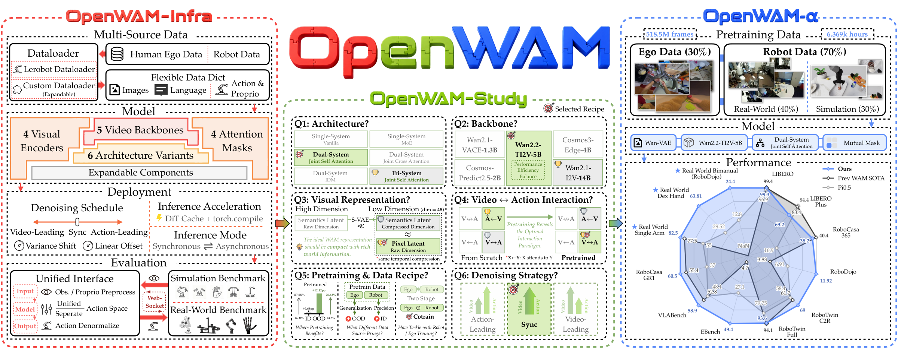

**Original:**

Figure 1. **Overview of `OpenWAM`.** **OpenWAM-Infra** (*left*) factorizes world–action modeling into composable modules with unified training, deployment, and evaluation; **OpenWAM-Study** (*middle*) resolves the design space through controlled questions and distills a pretraining recipe; **OpenWAM-$\alpha$** (*right*), pretrained on 518.5M frames of egocentric and robot data, sustains top-tier performance from simulation to the real world.

**中文:**

图 1：**OpenWAM 总览。** **OpenWAM-Infra**（左）将世界—动作建模拆分为可组合模块，并统一训练、部署与评测；**OpenWAM-Study**（中）通过受控问题研究设计空间，提炼预训练方案；**OpenWAM-$\alpha$**（右）在 518.5M 帧第一人称及机器人数据上预训练，从仿真到真实环境均保持第一梯队表现。

## 引言

**Original:**

Introduction

**中文:**

引言

**Original:**

“Knowledge is the beginning of action, action is the completion of knowledge.”

**中文:**

“知是行之始，行是知之成。”

**Original:**

— Yang-ming Wang, “Instructions for Practical Living”  (Wang, 1963)

**中文:**

——王阳明，《传习录》(Wang, 1963)

**Original:**

Intelligence requires more than recognizing the world: an embodied agent must anticipate how the world changes and act to bring about desired changes. Modern vision and vision–language models have learned rich semantic representations from large-scale image–text data (Radford et al., 2021; Caron et al., 2021; Tong et al., 2024). Video generation models go one step further by learning to synthesize how visual worlds may evolve over time (Ho et al., 2022; Brooks et al., 2024). An embodied system, however, must learn not only *what can happen in the world*, but also *what actions it can take to make it happen*.

**中文:**

智能不只是认识世界：具身智能体还必须预见世界如何变化，并采取动作实现期望的变化。现代视觉模型与视觉语言模型已从大规模图文数据中学到丰富的语义表示 (Radford et al., 2021; Caron et al., 2021; Tong et al., 2024)。视频生成模型更进一步，学习合成视觉世界随时间演变的可能过程 (Ho et al., 2022; Brooks et al., 2024)。然而，具身系统不仅要学会*世界中可能发生什么*，还要学会*自己可以采取什么动作，让这些事情发生*。

**Original:**

This distinction exposes a fundamental data asymmetry in embodied learning. Videos of the changing world are abundant, whereas robot trajectories with executable action labels remain comparatively scarce (Ye et al., 2026d). Earlier approaches such as ACT (Zhao et al., 2023) and Diffusion Policy (Chi et al., 2025) largely learn visual regularities and control together solely from robot demonstrations. More recently, Vision–Language–Action (VLA) models (Brohan et al., 2023; Kim et al., 2024; Black et al., 2024) instead inherit semantic and linguistic knowledge from pretrained vision–language models. World–Action Models (WAMs) (Pai et al., 2025; Ye et al., 2026c; Li et al., 2026b) offer a different warm start: they inherit a generative prior over visual dynamics from video generation pretraining and adapt it through embodied experience. Because video generation is explicitly trained to model temporal evolution, it provides a direct starting point for learning how actions interact with physical change. In this sense, a WAM *inherits world knowledge from video generation priors, then learns how to take actions in this world through embodied experience*.

**中文:**

这一区别揭示了具身学习中根本性的数据不对称：展现世界变化的视频十分丰富，带有可执行动作标签的机器人轨迹却相对稀缺 (Ye et al., 2026d)。ACT (Zhao et al., 2023)、Diffusion Policy (Chi et al., 2025) 等早期方法，主要只依靠机器人示范联合学习视觉规律与控制。近期的视觉—语言—动作模型（VLA）(Brohan et al., 2023; Kim et al., 2024; Black et al., 2024) 则从预训练视觉语言模型继承语义与语言知识。世界—动作模型（WAM）(Pai et al., 2025; Ye et al., 2026c; Li et al., 2026b) 提供另一种起点：从视频生成预训练继承视觉动力学的生成先验，再通过具身经验加以适配。由于视频生成明确以时间演变为建模目标，它为学习动作与物理变化如何相互作用提供了直接起点。从这个意义上说，WAM *先从视频生成先验继承世界知识，再通过具身经验学习如何在这个世界中行动*。

**Original:**

The promise of a WAM, however, lies not merely in initializing a policy with a video model or attaching an action head to a video generator. Its central hypothesis is that world prediction and action generation can be learned in *synergy*: world modeling supplies structured knowledge of states, dynamics, and possible futures that can inform action, while action learning focuses the model on changes that matter for control. However, realizing this synergy is nontrivial. Useful knowledge may reside in different parts of an upstream video model; nominally joint world and action prediction may still lack an effective information path; and a design that fits one training domain may fail to retain its advantage across new scenes or embodiments. These challenges lead to three central questions:

**中文:**

WAM 的潜力并不只是用视频模型初始化策略，或给视频生成器加上动作头。其核心假设是世界预测与动作生成能够*协同学习*：世界建模提供状态、动力学及可能未来的结构化知识，帮助生成动作；动作学习则让模型聚焦于控制所关心的变化。但实现这种协同并不简单。有用知识可能分布在上游视频模型的不同部分；名义上的世界与动作联合预测，仍可能缺少有效信息通路；在一个训练域内有效的设计，也可能无法在新场景或新机器人形态下保持优势。这些挑战引出三个核心问题：

**Original:**

**Question 1:** **What world knowledge should a WAM inherit?**

**中文:**

**问题 1：WAM 应当继承哪些世界知识？**

**Original:**

**Question 2:** **How can we create synergy between world and action learning?**

**中文:**

**问题 2：如何让世界学习与动作学习产生协同？**

**Original:**

**Question 3:** **How can this synergy be scaled across domains?**

**中文:**

**问题 3：如何将这种协同扩展到不同领域？**

**Original:**

Answering these questions is difficult with existing monolithic systems, where the generative backbone, visual representation, model architecture, information flow, inference procedure, and composition of training data are often tightly coupled (Kim et al., 2026b; Bi et al., 2026; Zhang et al., 2026b). We therefore introduce **OpenWAM**, an open research stack for systematically developing World–Action Models. **OpenWAM-Infra** factorizes the WAM design space into modular components, while providing unified training, inference, deployment, and evaluation across domains and embodiments (Section 3). This modularity turns world–action modeling from a collection of coupled implementation choices into a controlled experimental program.

**中文:**

现有系统通常将生成骨干、视觉表示、模型架构、信息流、推理过程及训练数据组成紧密耦合，因此难以回答上述问题 (Kim et al., 2026b; Bi et al., 2026; Zhang et al., 2026b)。为此，本文提出 **OpenWAM**，一个用于系统开发世界—动作模型的开放研究体系。**OpenWAM-Infra** 将 WAM 设计空间拆分为模块化组件，同时提供跨领域、跨机器人形态的统一训练、推理、部署和评测流程（第 3 节）。这种模块化使世界—动作建模不再只是一组相互绑定的实现选择，而能通过受控实验系统研究。

**Original:**

Building on this framework, **OpenWAM-Study** investigates the design principles underlying World–Action Models (Section 4). Our study produces three main findings. First, upstream world knowledge transfers most effectively through a sufficiently capable generative backbone and a compact, information-rich visual latent space. Second, world–action synergy does not emerge from parameter count or joint prediction alone. It is best fostered with sufficient action-specific capacity, explicit world-to-action information flow, and a joint test-time denoising schedule. Third, embodied pretraining primarily improves out-of-domain generalization rather than in-domain fitting: human egocentric video broadens world coverage, robot trajectories provide executable action knowledge, and their joint training offers the strongest practical integration strategy in our experiments. Together, these findings suggest a practical recipe from *inheriting world knowledge*, to *enabling world–action synergy*, to *scaling that synergy across domains*.

**中文:**

在这一框架上，**OpenWAM-Study** 探索世界—动作模型背后的设计原则（第 4 节），得到三项主要发现。第一，通过能力足够强的生成骨干，以及紧凑、信息丰富的视觉潜在空间，上游世界知识能最有效地迁移。第二，仅增加参数量或联合预测，并不会自然产生世界—动作协同；充足的动作专属容量、明确的世界到动作信息流，以及测试时联合去噪安排，最有利于形成协同。第三，具身预训练主要改善分布外泛化，而非域内拟合：人类第一人称视频扩大世界知识覆盖，机器人轨迹提供可执行动作知识；在本文实验中，联合训练是整合二者最有效的实用策略。这些发现共同形成一套实践方案：从*继承世界知识*，到*建立世界—动作协同*，再到*将协同扩展至不同领域*。

**Original:**

Finally, we compose the resulting design principles into **OpenWAM-$\alpha$**, an open pretrained World–Action Model (Section 5). Pretrained on 518M frames ($\approx$6,400 hours) of egocentric human and robot data through a unified 80-D action space, OpenWAM-$\alpha$ demonstrates that the recipe distilled from controlled settings remains effective when scaled across heterogeneous data, domains, and embodiments. It delivers consistently strong results on eight simulation benchmarks covering five embodiment categories, and preserves this standing in real-robot experiments on single-arm, bimanual, and dexterous-hand platforms. Beyond the scores themselves, these large-scale evaluations also distill further insights into the design and scaling behavior of embodied foundation models. To let the community reproduce and extend these findings, we release alongside the model the full stack: the infrastructure, evaluation protocols, pretrained weights, and data recipes.

**中文:**

最后，本文将这些设计原则整合为开放预训练世界—动作模型 **OpenWAM-$\alpha$**（第 5 节）。它通过统一的 80 维动作空间，在 518M 帧（$\approx$6,400 小时）的人类第一人称及机器人数据上预训练，OpenWAM-$\alpha$ 表明受控设置中提炼的方案扩展到异构数据、领域和机器人形态后仍然有效。它在覆盖五类机器人形态的八个仿真基准上持续表现良好，并在单臂、双臂和灵巧手平台的真实实验中保持这一水平。除了分数本身，大规模评测还为具身基础模型的设计和规模扩展规律提供进一步认识。为支持复现和扩展，作者随模型一起公开完整体系，包括基础设施、评测协议、预训练权重及数据方案。

**Original:**

In summary, our major contributions are as follows:

**中文:**

本文主要贡献如下：

**Original:**

**OpenWAM-Infra: a Modular Infrastructure for World–Action Modeling.** It factorizes model, representation, training, inference, deployment, and evaluation choices, enabling controlled comparison across WAM designs and embodiments (Section 3).

**中文:**

**OpenWAM-Infra：世界—动作建模的模块化基础设施。** 它将模型、表示、训练、推理、部署和评测选择拆分开来，支持跨 WAM 设计与机器人形态的受控比较（第 3 节）。

**Original:**

**OpenWAM-Study: Design Principles for World–Action Synergy.** Through controlled studies of upstream priors, architectural capacity, information flow, denoising, and multi-domain pretraining, we identify how world knowledge can interact productively with action learning (Section 4).

**中文:**

**OpenWAM-Study：世界—动作协同的设计原则。** 通过对上游先验、架构容量、信息流、去噪和多领域预训练进行受控研究，识别世界知识如何有效地与动作学习相互作用（第 4 节）。

**Original:**

**OpenWAM-$\alpha$: a Pretrained World–Action Model.** It instantiates and scales the derived principles into an open model for evaluating generalization and efficiency across domains and embodiments (Section 5).

**中文:**

**OpenWAM-$\alpha$：预训练世界—动作模型。** 它将上述原则实现并扩展为开放模型，用于评估跨领域、跨机器人形态的泛化与效率（第 5 节）。

## 相关工作

**Original:**

Related Work

**中文:**

相关工作

**Original:**

World–Action Models.

**中文:**

世界—动作模型

**Original:**

World models (LeCun et al., 2022; Ha & Schmidhuber, 2018) learn predictive structure from observations and have long supported control through planning (Zhou et al., 2024; Maes et al., 2026; Huang et al., 2026), model-based reinforcement learning (Hafner et al., 2019; M. Moerland et al., 2023), and policy evaluation (Huang et al., 2025; Wang et al., 2026b). World–Action Models (WAMs) (Ye et al., 2026c; Pai et al., 2025; Li et al., 2026b) more directly connect this predictive capacity to executable behavior by serving as a policy model. Whereas VLA models (Brohan et al., 2023; Kim et al., 2024; Black et al., 2024) primarily inherit semantic and linguistic knowledge from vision–language pretraining (Beyer et al., 2024; Bai et al., 2025), WAMs initialize from video-generative priors so that action learning begins with a model with rich visual dynamical priors (Wan et al., 2025; Ali et al., 2025). Yet existing systems remain largely *monolithic*, where changes in model architecture, training procedure, data recipe, and sampling schedule are often coupled. Consequently, it remains unclear which components transfer world knowledge, which interactions create world–action synergy, and which benefits persist across domains. **OpenWAM** exposes these coupled choices as controlled variables and organizes them around precisely these three questions.

**中文:**

世界模型 (LeCun et al., 2022; Ha & Schmidhuber, 2018) 从观测中学习用于预测的结构，长期以来通过规划 (Zhou et al., 2024; Maes et al., 2026; Huang et al., 2026)、基于模型的强化学习 (Hafner et al., 2019; M. Moerland et al., 2023) 和策略评估 (Huang et al., 2025; Wang et al., 2026b) 支持控制。世界—动作模型（WAM）(Ye et al., 2026c; Pai et al., 2025; Li et al., 2026b) 直接作为策略模型，将这种预测能力更直接地连接到可执行行为。VLA (Brohan et al., 2023; Kim et al., 2024; Black et al., 2024) 主要从视觉语言预训练继承语义与语言知识 (Beyer et al., 2024; Bai et al., 2025)；WAM 则从视频生成先验初始化，让动作学习从具有丰富视觉动力学先验的模型起步 (Wan et al., 2025; Ali et al., 2025)。但现有系统大多仍是*紧密耦合的整体*，架构、训练过程、数据方案和采样安排的改变往往相互绑定。因此，究竟哪些组件迁移世界知识、哪些交互产生世界—动作协同，以及哪些收益能跨领域保留，仍不清楚。**OpenWAM** 将这些相互耦合的选择显式设为受控变量，围绕这三个问题组织研究。

**Original:**

Open Research Ecosystems for Generalist Robot Policy Learning.

**中文:**

通用机器人策略学习的开放研究生态

**Original:**

Open models and codebases have made generalist robot learning increasingly accessible. OpenVLA (Kim et al., 2024) established an open-weight pretrained baseline, while StarVLA (Community, 2026) provides a modular and performant platform for varied design choices. StarVLA-$\alpha$ (Ye et al., 2026b) complements this breadth with a pretrained model of minimalist design, and XPolicyLab (Community et al., 2026) contributes a unified standard and open ecosystem for policy evaluation and deployment. These efforts have significantly reduced development complexity in the VLA research community; however, in the WAM community, such open research ecosystems remain largely absent. A modular system in this realm accompanied by a strong pretrained model would help democratize research, as well as serve as a principled foundation for understanding and scaling world–action model pretraining.

**中文:**

开放模型和代码库让通用机器人学习越来越容易开展。OpenVLA (Kim et al., 2024) 建立了开放权重的预训练基线；StarVLA (Community, 2026) 提供高性能模块化平台，支持多样设计选择；StarVLA-$\alpha$ (Ye et al., 2026b) 则以极简设计的预训练模型补充这一广泛支持；XPolicyLab (Community et al., 2026) 提供策略评估与部署的统一标准和开放生态。这些工作显著降低了 VLA 社区的开发复杂度，但 WAM 社区仍普遍缺少这样的开放研究生态。如果能提供配有强预训练模型的模块化系统，不仅能降低参与研究的门槛，也能为理解和扩展世界—动作模型预训练建立有原则依据的基础。

**Original:**

Towards a Scientific Understanding of Model Design.

**中文:**

以科学方法理解模型设计

**Original:**

A growing line of work treats model design as an empirical science (Allen-Zhu, 2026; Karras et al., 2022; McKinzie et al., 2024; Liu et al., 2022; Wen et al., 2026): decomposing a complex system into controlled variables, testing the mechanisms behind observed gains, deriving a recipe, and validating whether it survives scale. In multimodal learning, Cambrian-1 (Tong et al., 2024) and Beyond Language Modeling (Tong et al., 2026) systematically study visual representations, modality-specific capacity, data composition, and unified pretraining; Towards Physics of Multimodal Pretraining (Han et al., 2026) further isolates knowledge flow, synergy versus competition, and the timing of modality unification. In robot learning, analyses around Action Chunking (Simchowitz et al., 2025; Zhang et al., 2025b; Lazzati et al., 2026) and Generative Control Policies (Pan et al., 2026) have substantially reshaped the community’s understanding of these topics. At the data and system level, Large Behavior Models (Barreiros et al., 2026), LBM co-train (Lin et al., 2026a), StarVLA-$\alpha$ (Ye et al., 2026b), and OpenHLM (Hu et al., 2026) similarly use controlled comparisons to study multitask transfer, heterogeneous supervision, action design, and embodiment interfaces. **OpenWAM** brings this methodology to WAMs: **OpenWAM-Infra** builds the substrate for controlled experiments, **OpenWAM-Study** turns them into controlled scientific questions about inheritance, synergy, and scaling, and **OpenWAM-$\alpha$** scales the resulting recipe under heterogeneous multi-domain pretraining.

**中文:**

越来越多研究将模型设计视为一门实证科学 (Allen-Zhu, 2026; Karras et al., 2022; McKinzie et al., 2024; Liu et al., 2022; Wen et al., 2026)：把复杂系统拆成受控变量，检验性能增益背后的机制，归纳设计方案，再验证其扩大规模后是否仍然有效。多模态学习中，Cambrian-1 (Tong et al., 2024) 和 Beyond Language Modeling (Tong et al., 2026) 系统研究视觉表示、模态专属容量、数据组成和统一预训练；Towards Physics of Multimodal Pretraining (Han et al., 2026) 进一步区分知识流动、协同与竞争，以及统一不同模态的时机。机器人学习中，围绕 Action Chunking (Simchowitz et al., 2025; Zhang et al., 2025b; Lazzati et al., 2026) 和 Generative Control Policies (Pan et al., 2026) 的分析，已显著改变社区对这些问题的理解。在数据与系统层面，Large Behavior Models (Barreiros et al., 2026)、LBM co-train (Lin et al., 2026a)、StarVLA-$\alpha$ (Ye et al., 2026b)、OpenHLM (Hu et al., 2026) 也通过受控比较研究多任务迁移、异构监督、动作设计和机器人形态接口。**OpenWAM** 将这一方法论引入 WAM：**OpenWAM-Infra** 为受控实验提供基础，**OpenWAM-Study** 将其组织为知识继承、协同与规模扩展等科学问题，**OpenWAM-$\alpha$** 则通过异构多领域预训练扩大所归纳方案的规模。

## 可组合基础设施

**Original:**

OpenWAM-Infra: A Modular Infrastructure for World–Action Modeling

**中文:**

OpenWAM-Infra：世界—动作建模的模块化基础设施

**Original:**

Most existing world–action models differ substantially in architecture and infrastructure implementation, with no shared standard; since each system is built around a single model design, its model, training, serving, and evaluation components are likewise organized idiosyncratically and are often tightly coupled. This brings two problems: 1) such codebases are difficult for users to extend or build upon, and 2) the coupling among components allows modules to interfere with one another, confounding the conclusions drawn from controlled comparisons. **OpenWAM-Infra** addresses both problems by factoring world–action modeling into four decoupled components with explicit interfaces: a *composable model* assembled from interchangeable encoders, stream backbones, and visibility attention masks (Section 3.1); a *training runtime* that trains every such model with one trainer (Section 3.2); a *deployment runtime* that serves every resulting checkpoint through one policy server (Section 3.3); and an *evaluation protocol* through which every benchmark reaches that server (Section 3.4). These components are either mutually independent or related by strict one-way dependencies, which keeps the codebase straightforward to extend, insulates modules from mutual interference, and further provides the substrate on which **OpenWAM-Study** (Section 4) conducts controlled experiments and **OpenWAM-$\alpha$** (Section 5) is instantiated at scale.

**中文:**

现有世界—动作模型的架构与基础设施实现往往差异很大，缺少共同标准。每套系统围绕单一模型设计构建，因此模型、训练、服务和评测组件的组织方式各异，且常紧密耦合。这带来两个问题：1）用户难以扩展代码库或在其上继续开发；2）组件耦合使模块互相干扰，混淆受控比较得到的结论。**OpenWAM-Infra** 将世界—动作建模拆成四个接口明确、相互解耦的部分：由可互换编码器、流骨干和可见性注意力掩码构成的*可组合模型*（3.1 节）；用同一个训练器训练所有这类模型的*训练运行环境*（3.2 节）；通过同一策略服务器提供所有所得检查点的*部署运行环境*（3.3 节）；让各基准连接到该服务器的*评测协议*（3.4 节）。这些组件或相互独立，或只有严格的单向依赖，使代码库易于扩展，并隔离模块间的相互干扰。它们也为 **OpenWAM-Study** 的受控实验（第 4 节）和 **OpenWAM-$\alpha$** 的规模化实现（第 5 节）提供基础。

**Original:**

Composable Model

**中文:**

可组合模型

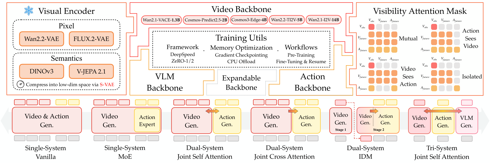

**Original:**

Figure 2. **OpenWAM Model Infra.** *Top*: the three classes of interchangeable modules: the visual encoder $\mathcal{E}$ (left); the stream backbones $\mathcal{S}$ (middle); and the visibility attention mask $\mathcal{M}$ (right). The central Training Utils panel summarizes the utilities of the training runtime (Section 3.2). *Bottom*: the composition rule $C$ assembles the modules into six architecture variants across the Single-System, Dual-System, and Tri-System families.

**中文:**

图 2：**OpenWAM 模型基础设施。** 上方展示三类可互换模块：视觉编码器 $\mathcal{E}$（左）、流骨干 $\mathcal{S}$（中）、可见性注意力掩码 $\mathcal{M}$（右）。中央 Training Utils 面板概括训练运行环境提供的工具（3.2 节）。下方的组合规则 $C$ 将模块组合为六种架构变体，分属单系统、双系统和三系统家族。

**Original:**

As shown in Figure 2, OpenWAM-Infra organizes a World–Action Model (WAM) as three classes of interchangeable modules that a composition rule $C$ assembles into a concrete **architecture**, written $C(\mathcal{E},\mathcal{S},\mathcal{M})$:

**中文:**

如图 2，OpenWAM-Infra 将世界—动作模型组织为三类可互换模块，由组合规则 $C$ 装配成具体**架构**，记为 $C(\mathcal{E},\mathcal{S},\mathcal{M})$：

**Original:**

**Visual Encoder** $\mathcal{E}$: It maps observations into the latent sequences the world stream predicts;

**中文:**

**视觉编码器** $\mathcal{E}$：将观测映射为世界流要预测的潜在序列；

**Original:**

**Stream Backbones** $\mathcal{S}$: It processes the model’s token streams: a world stream $\mathcal{W}$, an action stream $\mathcal{A}$, optionally an understanding stream $\mathcal{U}$, and any further streams a design may introduce; distinct streams may share a single backbone;

**中文:**

**流骨干** $\mathcal{S}$：处理模型的 token 流，包括世界流 $\mathcal{W}$、动作流 $\mathcal{A}$、可选的理解流 $\mathcal{U}$，以及设计中可能增加的其他流；不同流可以共享同一个骨干；

**Original:**

**Visibility Attention Mask** $\mathcal{M}$: It specifies the attention relations among streams and tokens, i.e. which tokens may attend to which, both within and across streams.

**中文:**

**可见性注意力掩码** $\mathcal{M}$：规定流与 token 之间的注意力关系，即哪些 token 能关注哪些 token，既包括流内，也包括跨流关系。

**Original:**

Visual Encoder.

**中文:**

视觉编码器

**Original:**

The encoder $\mathcal{E}$ maps observations into the latent sequence the world stream predicts and is always kept frozen; different encoders capture different information in their latents and in turn induce different world-stream behavior. In most cases, a video backbone is accompanied by a natively matched encoder, in which case the pretrained parameters of the base DiT are reused directly, retaining the full benefit of pretraining. Beyond this default, OpenWAM-Infra additionally supports pluggable encoders: swapping $\mathcal{E}$ alters the latent representation to be predicted, and the base DiT can further be re-initialized to exclude the influence of pretrained parameters. Currently, OpenWAM-Infra provides two reconstructive encoders, trained on pixel-reconstruction objectives: Wan2.2-VAE  (Wan et al., 2025) and FLUX.2-VAE  (Black Forest Labs, 2025), and two representation encoders (Zheng et al., 2026a): DINOv3  (Siméoni et al., 2025) and V-JEPA 2.1  (Mur-Labadia et al., 2026), along with an optional S-VAE (Zhang et al., 2025a) module that compresses the latent dimension. These capabilities together support the study of visual representations in Section 4.1.2.

**中文:**

编码器 $\mathcal{E}$ 将观测映射为世界流要预测的潜在序列，并始终冻结。不同编码器在潜在表示中保留的信息不同，因而会产生不同的世界流行为。通常，视频骨干配有原生匹配的编码器，此时可直接复用基础 DiT 的预训练参数，完整保留预训练收益。除这一默认方式外，OpenWAM-Infra 还支持可插拔编码器：替换 $\mathcal{E}$ 会改变待预测的潜在表示，也可进一步重新初始化基础 DiT，以排除预训练参数的影响。目前提供两种以像素重建为目标训练的重建型编码器 Wan2.2-VAE (Wan et al., 2025)、FLUX.2-VAE (Black Forest Labs, 2025)，两种表示型编码器 (Zheng et al., 2026a) DINOv3 (Siméoni et al., 2025)、V-JEPA 2.1 (Mur-Labadia et al., 2026)，以及可选的 S-VAE (Zhang et al., 2025a) 模块来压缩潜在维度。这些功能共同支持 4.1.2 节的视觉表示研究。

**Original:**

Stream Backbones.

**中文:**

流骨干

**Original:**

The backbones in $\mathcal{S}$ are laid out in and around the central panel of Figure 2. The *video backbone* ($\mathcal{W}$) predicts the temporal evolution of future world visual states, while the *action backbone* ($\mathcal{A}$) predicts the upcoming action chunk  (Zhao et al., 2023); together they form the world–action core of the model. The optional *VLM backbone* ($\mathcal{U}$) supplements this core with semantic understanding of the current observation. Beyond these, the backbone roster is itself **expandable**: further backbones can be registered to execute any additional streams a design may introduce. Regardless of type, every backbone executes through one code contract that decomposes its forward pass into three stages:

**中文:**

$\mathcal{S}$ 中的骨干位于图 2 中央面板及其周围。*视频骨干*（$\mathcal{W}$）预测未来世界视觉状态的时间演变，*动作骨干*（$\mathcal{A}$）预测接下来的动作块 (Zhao et al., 2023)，二者组成模型的世界—动作核心。可选的 *VLM 骨干*（$\mathcal{U}$）补充对当前观测的语义理解。除此以外，骨干集合本身也**可以扩展**：可注册更多骨干，运行设计中新引入的流。无论何种骨干，都遵循同一代码接口，将前向计算拆成三个阶段：

**Original:**

`prepare`, invoked once before the stack, which embeds the inputs into the initial token state;

**中文:**

prepare：在整个层堆栈之前调用一次，将输入嵌入初始 token 状态；

**Original:**

`per-layer block step`, invoked once per layer, which advances this state through one transformer layer;

**中文:**

per-layer block step：每层调用一次，让当前状态经过一层 Transformer 更新；

**Original:**

`finalize`, invoked once after the stack, which maps the final state to the stream’s prediction.

**中文:**

finalize：在整个层堆栈之后调用一次，将最终状态映射为该流的预测。

**Original:**

Each layer may further split its block step into a `pre-attention` half, which emits the layer’s queries, keys, and values, and a `post-attention` half, which consumes the attention output, so that the attention between the two halves can be computed jointly across streams.

**中文:**

每层还可以将块计算拆为两部分：pre-attention 产生该层的查询、键和值；post-attention 接收注意力输出。这样，两部分之间的注意力就能够跨流联合计算。

**Original:**

For the video backbone, OpenWAM-Infra supports five pretrained video generation models with increasing model parameters, namely Wan2.1-VACE-1.3B, Cosmos-Predict2.5-2B, Cosmos3-Edge-4B, Wan2.2-TI2V-5B, and Wan2.1-I2V-14B  (Wan et al., 2025; Ali et al., 2025). For VLM backbones, OpenWAM-Infra currently supports only the Qwen3-VL family  (Bai et al., 2025). For the action backbone, OpenWAM-Infra offers two options: a separate set of parameters residing in ActionDiT, or a shared video backbone in which action tokens join the video token sequence and are processed jointly.

**中文:**

视频骨干支持参数规模依次增大的五个预训练视频生成模型：Wan2.1-VACE-1.3B、Cosmos-Predict2.5-2B、Cosmos3-Edge-4B、Wan2.2-TI2V-5B、Wan2.1-I2V-14B (Wan et al., 2025; Ali et al., 2025)。VLM 骨干目前仅支持 Qwen3-VL 系列 (Bai et al., 2025)。动作骨干有两个选项：使用 ActionDiT 中独立的一组参数；或共享视频骨干，将动作 token 加入视频 token 序列，一起处理。

**Original:**

Visibility Attention Mask.

**中文:**

可见性注意力掩码

**Original:**

The mask $\mathcal{M}$ governs the information flow with the mixed self-attention through which streams interact: it factorizes into intra-modality and cross-modality blocks, granting attention where tokens reinforce one another and withholding it where their mutual influence must be isolated. Over the video and action modalities, this factorization reads

**中文:**

掩码 $\mathcal{M}$ 通过流之间交互所用的混合自注意力控制信息流。它可以拆成模态内部与跨模态的分块：需要 token 相互增强时允许注意力，需要隔离相互影响时则禁止。对于视频与动作两种模态，这一分解写为：

**Original:**

$$
\mathcal{M}=
\begin{pmatrix}
\mathcal{M}_{V\leftarrow V} & \mathcal{M}_{V\leftarrow A}\\
\mathcal{M}_{A\leftarrow V} & \mathcal{M}_{A\leftarrow A}
\end{pmatrix},
$$

**中文:**

$$
\mathcal{M}=
\begin{pmatrix}
\mathcal{M}_{V\leftarrow V} & \mathcal{M}_{V\leftarrow A}\\
\mathcal{M}_{A\leftarrow V} & \mathcal{M}_{A\leftarrow A}
\end{pmatrix},
$$

**Original:**

where the block $\mathcal{M}_{X\leftarrow Y}$ specifies whether tokens of modality $X$ may attend to tokens of modality $Y$. OpenWAM-Infra fixes the two intra-modality blocks: $\mathcal{M}_{V\leftarrow V}$ adopts *first-frame causal* attention, in which noisy frames attend to one another and to the clean first frame while the clean frame attends only to itself, shielding clean conditioning from noise; $\mathcal{M}_{A\leftarrow A}$ adopts *bidirectional* attention, in which the noisy action tokens of a chunk are mutually visible so that the predicted actions inform one another. The two cross-modality blocks then define the four attention mask modes that OpenWAM-Infra supports, as drawn in the right panel of Figure 2: *mutual* enables both $\mathcal{M}_{A\leftarrow V}$ and $\mathcal{M}_{V\leftarrow A}$, so the two modalities attend to each other; *action-sees-video* enables only $\mathcal{M}_{A\leftarrow V}$, letting actions read the predicted world while leaving video generation undisturbed; *video-sees-action* enables only $\mathcal{M}_{V\leftarrow A}$, the reverse; and *isolated* disables both, denoising the two modalities independently. Building on this native support, Section 4.2.2 later compares these modes under controlled settings.

**中文:**

其中，$\mathcal{M}_{X\leftarrow Y}$ 规定模态 $X$ 的 token 能否关注模态 $Y$ 的 token。OpenWAM-Infra 固定两种模态内部的掩码：$\mathcal{M}_{V\leftarrow V}$ 使用*首帧因果*注意力，带噪帧可以关注彼此及干净首帧，干净首帧只关注自身，以避免噪声污染干净条件；$\mathcal{M}_{A\leftarrow A}$ 使用*双向*注意力，同一动作块内的带噪动作 token 相互可见，让预测动作彼此提供信息。两个跨模态分块定义四种受支持的注意力掩码模式，如图 2 右侧所示：*mutual* 同时启用 $\mathcal{M}_{A\leftarrow V}$ 和 $\mathcal{M}_{V\leftarrow A}$，两模态相互关注；*action-sees-video* 只启用 $\mathcal{M}_{A\leftarrow V}$，让动作读取预测世界，同时不干扰视频生成；*video-sees-action* 只启用 $\mathcal{M}_{V\leftarrow A}$，信息方向相反；*isolated* 禁用两个跨模态分块，使两模态独立去噪。在这一原生支持基础上，4.2.2 节将受控比较这些模式。

**Original:**

Architectures.

**中文:**

架构

**Original:**

The composition rule $C$ specifies where and how information crosses streams, and it does so purely through the execution contract above: it sequences the **prepare**, **per-layer block**, and **finalize** stages of the participating backbones and, when interaction must occur inside attention, splits the block step into its **pre-attention** and **post-attention** halves to substitute the attention computation itself, never modifying backbone internals. Composition rules therefore carry no parameters of their own; all learned capacity resides in the stream backbones. A concrete architecture is a choice $C(\mathcal{E},\mathcal{S},\mathcal{M})$; the designs currently supported fall into three families, laid out left to right in the bottom row of Figure 2.

**中文:**

组合规则 $C$ 规定信息在何处、以何种方式跨流传递，而且完全通过上述执行接口实现：它安排各骨干的 **prepare**、**per-layer block** 和 **finalize** 阶段；需要在注意力内部交互时，将块计算拆成 **pre-attention** 和 **post-attention** 两部分，替换其中的注意力计算，而不修改骨干内部实现。因此，组合规则本身没有参数，所有可学习容量都位于流骨干中。一个具体架构就是一种 $C(\mathcal{E},\mathcal{S},\mathcal{M})$ 组合选择。目前支持的设计分为三类，在图 2 下方从左到右排列。

**Original:**

**Single-System.** This family comprises only the video backbone: the action backbone takes the shared form and injects its tokens into the video sequence, so one transformer processes both modalities with most parameters shared; representative systems include Cosmos Policy  (Kim et al., 2026b) and DreamZero  (Ye et al., 2026c). OpenWAM-Infra provides two variants, differing in modality-specific capacity:

- *Vanilla* processes video, action, and proprioceptive tokens as one sequence through the same attention and dense feed-forward blocks, providing no modality-specific capacity.
- *MoE* retains the shared sequence and self-attention but hard-routes action tokens to a dedicated feed-forward expert while video tokens follow the default path, adding modality-specific capacity without separating the streams  (Mu & Lin, 2025).

**中文:**

**单系统。** 这一类只有视频骨干：动作骨干采用共享形式，将动作 token 插入视频序列，由同一个 Transformer 处理两种模态，大部分参数共享；代表系统包括 Cosmos Policy (Kim et al., 2026b) 和 DreamZero (Ye et al., 2026c)。OpenWAM-Infra 提供两种变体，区别在于模态专属容量：

- *Vanilla* 将视频、动作和本体状态 token 合为一个序列，通过相同注意力及稠密前馈模块处理，没有模态专属容量。
- *MoE* 保留共享序列与自注意力，但将动作 token 硬路由到专属前馈专家，视频 token 则走默认路径，在不分离流的情况下增加模态专属容量 (Mu & Lin, 2025)。

**Original:**

**Dual-System.** This family comprises an independent video backbone and action backbone, the latter a dedicated ActionDiT: the two streams hold separate sets of parameters and are connected through self- or cross-attention; representative systems include Fast-WAM  (Yuan et al., 2026b) and LingBot-VA  (Li et al., 2026b). OpenWAM-Infra provides three variants, differing in how the two streams communicate:

- *Joint self-attention* merges the hidden states of the two streams into a joint sequence at designated bridge layers, allowing bidirectional token-level interaction before the states return to their streams.
- *Joint cross-attention* lets the action stream query video features through video-to-action cross-attention at the bridge layers, trained end-to-end so that action-learning gradients update the video stream; optionally, gradients are detached at the video features to isolate action learning from video parameter updates.
- *IDM* formulates the action module as an inverse-dynamics model conditioned on video features, trained with teacher-forced video states and run in two inference stages: the video trajectory is generated first and the actions are predicted from it.

**中文:**

**双系统。** 这一类包含独立的视频骨干和动作骨干，后者是专属 ActionDiT。两条流分别拥有自己的参数，通过自注意力或交叉注意力连接；代表系统包括 Fast-WAM (Yuan et al., 2026b) 和 LingBot-VA (Li et al., 2026b)。OpenWAM-Infra 提供三种变体，区别在于双流如何通信：

- *联合自注意力*：在指定桥接层将双流隐藏状态合为一个联合序列，进行双向 token 级交互，再将状态送回各自流。
- *联合交叉注意力*：在桥接层通过视频到动作的交叉注意力，让动作流查询视频特征。端到端训练使动作学习梯度能更新视频流；也可选择在视频特征处截断梯度，将动作学习与视频参数更新隔离。
- *IDM*：将动作模块建模为以视频特征为条件的逆动力学模型，训练时使用教师强制的视频状态，推理分两阶段：先生成视频轨迹，再由视频轨迹预测动作。

**Original:**

**Tri-System.** This family extends the dual layout with a VLM backbone, in which a frozen vision–language model feeds a separate trainable understanding stream; representative systems include Motus  (Bi et al., 2026). OpenWAM-Infra provides a single variant:

- *Joint self-attention* extends the joint sequence to all three streams, which exchange information while retaining stream-specific parameters; the understanding stream joins as a read-only tail that the other streams may attend to while it attends only to itself.

**中文:**

**三系统。** 在双系统基础上加入 VLM 骨干，由冻结视觉语言模型向另一条可训练理解流提供输入；代表系统包括 Motus (Bi et al., 2026)。OpenWAM-Infra 提供一种变体：

- *联合自注意力*：将联合序列扩展到三条流，各流交换信息，同时保留专属参数。理解流以只读尾部的形式加入：其他流可以关注它，它只关注自身。

**Original:**

Within each architecture $C(\mathcal{E},\mathcal{S},\mathcal{M})$, every module (the visual encoder, the stream backbones, and the visibility attention mask) is instantiated from a registry, orthogonally to the composition rule: every combination is assembled from configuration, and neither the trainer nor the policy server is aware of which architecture is running.

**中文:**

在每种架构 $C(\mathcal{E},\mathcal{S},\mathcal{M})$ 中，视觉编码器、流骨干、可见性注意力掩码均从注册表实例化，其选择与组合规则相互独立。所有组合都通过配置装配，训练器和策略服务器均无需知道具体运行的是哪种架构。

**Original:**

Training Runtime

**中文:**

训练运行环境

**Original:**

Training Formulation.

**中文:**

训练形式化

**Original:**

OpenWAM-Infra trains every architecture under one trainer, against one sample contract and one joint flow-matching objective. The trainer never inspects architecture internals: it asks the selected architecture to prepare its own inputs and run its own forward pass, then optimizes the objective on the resulting predictions. Define a sample as $(\ell,\,\mathbf{o}_{1:T},\,\mathbf{a}_{1:H},\,\mathbf{q},\,\mathbf{m})$, a language instruction, a video window, an action chunk, an optional proprioceptive state, and a per-dimension validity mask. During input preparation, the architecture’s visual encoder $\mathcal{E}$ encodes $\mathbf{o}_{1:T}$ into latents $\mathbf{z}$, and $\ell$, optionally joined by $\mathbf{q}$, becomes the context $\mathbf{c}$. Throughout the paper, $t=0$ denotes pure noise and $t=1$ clean data. Each stream is noised to its own timestep, $t_v$ for video and $t_a$ for actions, yielding the interpolants $\mathbf{z}^{t_v}=t_v\,\mathbf{z}+(1-t_v)\,\boldsymbol{\epsilon}_v$ and $\mathbf{a}^{t_a}=t_a\,\mathbf{a}+(1-t_a)\,\boldsymbol{\epsilon}_a$ with Gaussian noise $\boldsymbol{\epsilon}_v,\boldsymbol{\epsilon}_a$; one joint forward pass of the architecture $(\hat{\mathbf{v}}_z,\hat{\mathbf{v}}_a)=\mathbf{v}_\theta\big(\mathbf{z}^{t_v},\mathbf{a}^{t_a},t_v,t_a,\mathbf{c}\big)$ predicts both velocities, and the objective takes the form

**中文:**

OpenWAM-Infra 用同一个训练器、统一样本接口和联合流匹配目标训练所有架构。训练器不检查架构内部，而是让所选架构自行准备输入、完成前向计算，再根据预测优化目标。一个样本定义为 $(\ell,\,\mathbf{o}_{1:T},\,\mathbf{a}_{1:H},\,\mathbf{q},\,\mathbf{m})$，依次表示语言指令、视频窗口、动作块、可选本体状态及逐维有效性掩码。准备输入时，视觉编码器 $\mathcal{E}$ 将 $\mathbf{o}_{1:T}$ 编码为潜变量 $\mathbf{z}$，$\ell$ 以及可选的 $\mathbf{q}$ 组成上下文 $\mathbf{c}$。全文中，$t=0$ 表示纯噪声，$t=1$ 表示干净数据。每条流按自己的时间步加噪，视频为 $t_v$，动作为 $t_a$，得到插值状态 $\mathbf{z}^{t_v}=t_v\,\mathbf{z}+(1-t_v)\,\boldsymbol{\epsilon}_v$ 和 $\mathbf{a}^{t_a}=t_a\,\mathbf{a}+(1-t_a)\,\boldsymbol{\epsilon}_a$，其中 $\boldsymbol{\epsilon}_v,\boldsymbol{\epsilon}_a$ 为高斯噪声。架构通过一次联合前向计算 $(\hat{\mathbf{v}}_z,\hat{\mathbf{v}}_a)=\mathbf{v}_\theta\big(\mathbf{z}^{t_v},\mathbf{a}^{t_a},t_v,t_a,\mathbf{c}\big)$，同时预测两种速度，目标函数为：

**Original:**

$$
\mathcal{L}
=\lambda_v\,\mathbb{E}_{t_v,\epsilon_v}\!\Big[w(t_v)\,\big\lVert \hat{\mathbf{v}}_z-(\mathbf{z}-\boldsymbol{\epsilon}_v)\big\rVert_2^2\Big]
+\lambda_a\,\mathbb{E}_{t_a,\epsilon_a}\!\Big[w(t_a)\,\big\lVert \mathbf{m}\odot\big(\hat{\mathbf{v}}_a-(\mathbf{a}-\boldsymbol{\epsilon}_a)\big)\big\rVert_2^2\Big],
$$

**中文:**

$$
\mathcal{L}
=\lambda_v\,\mathbb{E}_{t_v,\epsilon_v}\!\Big[w(t_v)\,\big\lVert \hat{\mathbf{v}}_z-(\mathbf{z}-\boldsymbol{\epsilon}_v)\big\rVert_2^2\Big]
+\lambda_a\,\mathbb{E}_{t_a,\epsilon_a}\!\Big[w(t_a)\,\big\lVert \mathbf{m}\odot\big(\hat{\mathbf{v}}_a-(\mathbf{a}-\boldsymbol{\epsilon}_a)\big)\big\rVert_2^2\Big],
$$

**Original:**

where $\lambda_v,\lambda_a$ and $w(\cdot)$ weight the streams and the timesteps, while the validity mask $\mathbf{m}$ restricts the action term to the coordinates an embodiment actually populates, and clean conditioning frames are excluded from the video term. Because $t_v$ and $t_a$ are sampled *independently*, training covers the entire $(t_v,t_a)$ noise plane; any inference schedule, whether it denoises the two streams synchronously at a shared timestep or asynchronously with one stream leading the other, traces a path through this plane and thus remains in-distribution.

**中文:**

其中，$\lambda_v,\lambda_a$ 和 $w(\cdot)$ 分别对流和时间步加权；有效性掩码 $\mathbf{m}$ 使动作损失只计算该机器人形态实际使用的坐标，干净条件帧则不计入视频损失。由于 $t_v$ 与 $t_a$ *独立*采样，训练覆盖整个 $(t_v,t_a)$ 噪声平面。任何推理调度，无论在相同时间步同步去噪，还是让某条流领先另一条而异步去噪，都对应这个平面中的一条路径，因此仍处于训练分布内。

**Original:**

Training Utilities.

**中文:**

训练工具

**Original:**

As shown in the Training Utils panel at the center of Figure 2, three core utilities support OpenWAM-Infra training:

**中文:**

图 2 中央 Training Utils 面板展示了支持 OpenWAM-Infra 训练的三类核心工具：

**Original:**

**Framework.** OpenWAM-Infra integrates DeepSpeed ZeRO (stage 1 or 2) through Accelerate and supports mixed precision (bf16 by default), gradient accumulation, and gradient clipping; a single entry point scales from single-GPU runs to multi-node jobs.

**中文:**

**框架。** 通过 Accelerate 集成 DeepSpeed ZeRO（阶段 1 或 2），支持混合精度（默认 bf16）、梯度累积和梯度裁剪；同一入口可以从单 GPU 运行扩展到多节点任务。

**Original:**

**Memory optimization.** To reduce memory consumption, OpenWAM-Infra provides gradient checkpointing, with optional CPU offload of the checkpointed activations, and optimizer-state offload to CPU.

**中文:**

**显存优化。** 提供梯度检查点，可选择将检查点对应的激活卸载到 CPU，也支持将优化器状态卸载到 CPU，以降低显存占用。

**Original:**

**Workflows.** OpenWAM-Infra supports three training workflows. *Pretraining* starts a fresh run. *Fine-tuning* starts a new run initialized from a previous checkpoint: the architecture is rebuilt from the checkpoint’s own record, the new configuration is layered on top, and the identity of the modules the weights belong to is protected from override. *Resume* continues the same run exactly: the full optimizer and scheduler state is restored, training re-enters the data stream at the recorded position, and the run refuses to continue if the dataset’s normalization statistics diverge from those recorded with the run.

**中文:**

**工作流。** 支持三种训练工作流。*预训练*启动一次全新运行。*微调*启动新运行，但从已有检查点初始化：先依据检查点自身记录重建架构，再叠加新配置，并禁止覆盖权重所对应模块的身份。*恢复训练*则精确延续同一次运行：恢复完整优化器和调度器状态，从记录位置重新进入数据流；如果数据集归一化统计量与运行时记录不一致，系统拒绝继续。

**Original:**

Self-Contained Checkpoints.

**中文:**

自包含检查点

**Original:**

A self-contained checkpoint comprises three parts: the model weights, the fully resolved configuration with every module’s reconstruction specification (and artifacts such as tokenizers) merged in, and the action-normalization statistics. Fine-tuning, resume, and deployment all rebuild the architecture from this record before loading parameters; at deployment, a missing normalization record is a hard error. An evaluation therefore cannot silently change the encoder, the action layout, or the scaling of a trained model, and the checkpoint is exactly what the deployment runtime serves.

**中文:**

自包含检查点由三部分构成：模型权重；完整解析后的配置，其中合入每个模块的重建规范及 tokenizer 等产物；动作归一化统计量。微调、恢复训练和部署都先根据这些记录重建架构，再加载参数；部署时缺少归一化记录会直接报错。这样，评测不能在未察觉的情况下改变已训练模型的编码器、动作布局或数值缩放；部署运行环境提供服务的内容，正是该检查点。

**Original:**

Deployment Runtime

**中文:**

部署运行环境

**Original:**

Every checkpoint is served by one policy server, which rebuilds the architecture from its self-contained record and keeps two choices orthogonal: when inference runs (the inference mode) and how the two streams are denoised (the denoising schedule). Figure 3 illustrates the two choices in panels (a) and (b), respectively.

**中文:**

各检查点都通过同一种策略服务器提供服务。服务器依据自包含记录重建架构，并将两个选择相互独立地处理：何时运行推理，即推理模式；以及如何对两条流去噪，即去噪调度。图 3 的 (a)、(b) 分别展示这两类选择。

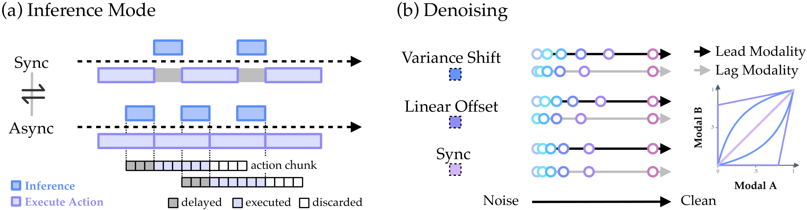

**Original:**

Figure 3. **Inference modes and denoising schedules of the deployment runtime.** (a) Illustration of the synchronous and asynchronous inference modes. (b) Illustration of the three denoising schedules (variance shift, linear offset, and sync); five denoising steps are drawn for illustration, and circles of the same color denote the timesteps that the two modalities reach at the same denoising step.

**中文:**

图 3：**部署运行环境的推理模式与去噪调度。** (a) 同步和异步推理模式示意。(b) 三种去噪调度示意：方差偏移、线性偏移和同步。图中以五个去噪步骤为例，同色圆圈表示两种模态在同一个去噪步骤达到的各自时间点。

**Original:**

Inference Modes.

**中文:**

推理模式

**Original:**

OpenWAM-Infra provides two inference modes over a common buffer mechanism (Figure 3(a)): each inference produces an action chunk that is buffered, and the server pops one action per request. Under *synchronous* inference, the server blocks on a fresh inference whenever the buffer empties, so execution stalls for the inference latency. Under *asynchronous* inference, let $H$ denote the length of the predicted chunk, $n\le H$ the inference horizon, and $d<n$ the lead threshold in steps, defaulting to $n/2$. Once only $d$ buffered actions remain, a single background worker prefetches the next chunk while those actions keep executing. The adopted chunk then splits, in order, into a *delayed* prefix of $d$ actions, already covered by the previous buffer while inference ran and therefore skipped; an *executed* window of the next $n$ actions, which becomes the new buffer; and a *discarded* tail of the remaining $\max\{H-d-n,\,0\}$ actions. The two modes are indistinguishable to the client: every request is one observation in, one action out.

**中文:**

OpenWAM-Infra 在共同的缓冲机制上提供两种推理模式（图 3(a)）：每次推理生成一个动作块并放入缓冲区，服务器每次请求取出一个动作。*同步*推理中，一旦缓冲区耗尽，服务器就等待新推理完成，因而执行会停顿一个推理延迟。*异步*推理中，令 $H$ 为预测动作块长度，$n\le H$ 为推理时域，$d<n$ 为以步数表示的提前触发阈值，默认 $n/2$。缓冲区只剩 $d$ 个动作时，由单个后台工作进程预取下一动作块，剩余动作同时继续执行。新动作块依次分为三部分：*延迟*前缀的 $d$ 个动作，其对应时间已在推理期间由旧缓冲区覆盖，因此跳过；接下来的 $n$ 个动作构成*执行*窗口，进入新缓冲区；其余 $\max\{H-d-n,\,0\}$ 个动作构成*丢弃*尾部。客户端无需区分两种模式：每次请求都输入一个观测、获得一个动作。

**Original:**

Denoising Schedules.

**中文:**

去噪调度

**Original:**

A denoising schedule is a path $\tau=\{(t_v^i,t_a^i)\}_{i=0}^{N}$ through the joint noise plane, with $t=0$ pure noise and $t=1$ clean data as in Section 3.2; Figure 3(b) draws the three schedules that OpenWAM-Infra supports. Under the *sync* schedule, both streams advance in lockstep along the diagonal: each step performs one joint forward pass and a coupled Euler update in which each stream moves by its own timestep increment; the video latents $\mathbf{z}$ follow $\mathbf{z}^{t_v^{i+1}}=\mathbf{z}^{t_v^i}+(t_v^{i+1}-t_v^i)\,\hat{\mathbf{v}}_z$, and the action chunk $\mathbf{a}$ follows $\mathbf{a}^{t_a^{i+1}}=\mathbf{a}^{t_a^i}+(t_a^{i+1}-t_a^i)\,\hat{\mathbf{v}}_a$. Asynchronous schedules let one stream lead through two composable families  (Baade et al., 2026),

**中文:**

去噪调度是联合噪声平面中的一条路径 $\tau=\{(t_v^i,t_a^i)\}_{i=0}^{N}$；与 3.2 节一致，$t=0$ 为纯噪声，$t=1$ 为干净数据。图 3(b) 展示 OpenWAM-Infra 支持的三种调度。*sync* 调度让双流沿对角线同步前进：每步进行一次联合前向计算，再作耦合欧拉更新，各流按自身时间步增量推进。视频潜变量 $\mathbf{z}$ 按 $\mathbf{z}^{t_v^{i+1}}=\mathbf{z}^{t_v^i}+(t_v^{i+1}-t_v^i)\,\hat{\mathbf{v}}_z$ 更新，动作块 $\mathbf{a}$ 按 $\mathbf{a}^{t_a^{i+1}}=\mathbf{a}^{t_a^i}+(t_a^{i+1}-t_a^i)\,\hat{\mathbf{v}}_a$ 更新。异步调度通过两个可组合函数族让其中一条流领先 (Baade et al., 2026)：

**Original:**

$$
f_{\alpha}(s)=\frac{\alpha s}{1+(\alpha-1)s},
\qquad
h_{o}(s)=\max\!\left\{\frac{s-o}{1-o},\,0\right\},
$$

**中文:**

$$
f_{\alpha}(s)=\frac{\alpha s}{1+(\alpha-1)s},
\qquad
h_{o}(s)=\max\!\left\{\frac{s-o}{1-o},\,0\right\},
$$

**Original:**

where $s=i/N$ denotes global progress, the *variance shift* curve $f_{\alpha}$ lifts the leading stream above the diagonal for $\alpha>1$ so that it reaches clean data earlier, and the *linear offset* $h_{o}$ holds the lagging stream at pure noise until global progress exceeds $o$. Assigning the lead to the world stream or to the action stream yields the *video-lead* and *action-lead* regimes, and $(\alpha,o)=(1,0)$ recovers the synchronized diagonal exactly: synchronous serving is a special case rather than a separate code path, and every asynchronous run has an aligned baseline. Because training samples the two timesteps independently (Section 3.2), every such path stays in-distribution. Independently of the schedule shape, each stream’s timestep warp is a backbone property stored in the checkpoint and reused at inference, so the training and serving noise grids cannot drift.

**中文:**

其中，$s=i/N$ 表示全局进度。*方差偏移*曲线 $f_{\alpha}$ 在 $\alpha>1$ 时将领先流推到对角线上方，使其更早接近干净数据；*线性偏移* $h_{o}$ 则让落后流保持纯噪声，直到全局进度超过 $o$。由世界流或动作流领先，分别形成 *video-lead* 和 *action-lead* 模式；$(\alpha,o)=(1,0)$ 则精确恢复同步对角线。因此，同步服务是这一机制的特例，而非独立代码路径，每种异步运行都有可对齐的基线。由于训练独立采样两种时间步（3.2 节），这些路径均保持在训练分布内。除调度曲线形状外，各流的时间步扭曲变换属于骨干属性，保存在检查点中并在推理时复用，因而训练与服务采用的噪声网格不会偏移。

**Original:**

Acceleration.

**中文:**

加速

**Original:**

OpenWAM-Infra provides four serving-side accelerations, each independently configurable.

**中文:**

OpenWAM-Infra 提供四种服务端加速方式，每种都可独立配置。

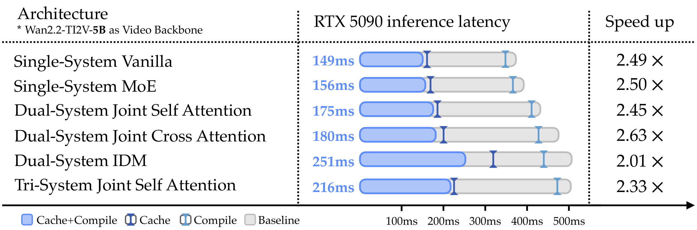

**Original:**

Figure 4. **Serving latency across architectures.** Inference latency with Wan2.2-TI2V-5B as the video backbone on an RTX 5090. The prompt-embedding cache and video-decode skip are enabled by default; the figure ablates compilation and the DiT velocity cache.

**中文:**

图 4：**不同架构的服务延迟。** 在 RTX 5090 上，以 Wan2.2-TI2V-5B 为视频骨干测量推理延迟。默认开启提示嵌入缓存及跳过视频解码，图中消融编译与 DiT 速度缓存。

**Original:**

• **Prompt-embedding cache**: a server-lifetime cache maps each prompt to its text-encoder embeddings, removing the text encoder from the per-request path.

**中文:**

• **提示嵌入缓存**：在服务器生命周期内缓存每条提示对应的文本编码器嵌入，使每次请求无需再运行文本编码器。

**Original:**

• **Video-decode skip**: control consumes actions rather than pixels, so the serving path can skip VAE video decoding entirely.

**中文:**

• **跳过视频解码**：控制使用动作而非像素，因此提供服务时可以完全跳过 VAE 视频解码。

**Original:**

• **Compilation**: each architecture registers a fixed-shape `torch.compile` path for its inner joint denoising loop, replayed under CUDA graphs to eliminate per-layer launch overhead; the first request carries the compilation warmup.

**中文:**

• **编译**：每种架构为内部联合去噪循环注册固定形状的 torch.compile 路径，并通过 CUDA graphs 重放，消除逐层启动开销；首次请求承担编译预热。

**Original:**

• **DiT velocity cache**: when the recent velocity predictions of *both* streams are similarity-stable (cosine similarity above a threshold), the next joint forward pass is skipped and the cached velocities are integrated instead, with a bounded number of consecutive skips, following the cross-step reuse of Ye et al. (2026c).

**中文:**

• **DiT 速度缓存**：当*两条*流近期的速度预测均在相似度上稳定，即余弦相似度高于阈值时，跳过下一次联合前向计算，改用缓存速度积分，并限制连续跳过次数。这沿用了文献 Ye et al. (2026c) 的跨步复用方式。

**Original:**

With Wan2.2-TI2V-5B as the video backbone, Figure 4 illustrates the resulting inference speedups across the different architectures.

**中文:**

图 4 以 Wan2.2-TI2V-5B 为视频骨干，展示这些加速方式在不同架构上的推理收益。

**Original:**

Evaluation Protocol

**中文:**

评测协议

**Original:**

OpenWAM-Infra evaluates trained checkpoints through the policy server of Section 3.3: each benchmark connects as a client, sends observations, and executes the actions returned by the server, as shown in Figure 5.

**中文:**

OpenWAM-Infra 通过 3.3 节的策略服务器评测训练所得检查点：每个基准作为客户端连接，发送观测并执行服务器返回的动作，如图 5。

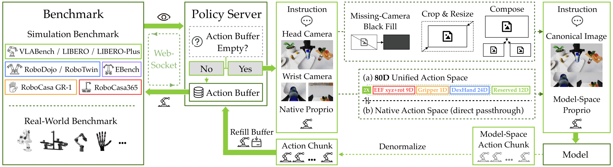

**Original:**

Figure 5. **Evaluation protocol of OpenWAM-Infra.** Benchmarks connect to the policy server as thin clients over WebSocket. The server canonicalizes each observation, maps the proprioceptive state into the model-side action representation (the 80-D unified action space or the benchmark’s native action space), and denormalizes the predicted action chunk back to native physical units before returning actions.

**中文:**

图 5：**OpenWAM-Infra 评测协议。** 基准作为轻量客户端，通过 WebSocket 连接策略服务器。服务器将观测转为统一格式，把本体状态映射到模型侧动作表示——80 维统一动作空间或基准原生动作空间——并在返回动作前，将预测动作块反归一化为原生物理单位。

**Original:**

Client–Server Pipeline.

**中文:**

客户端—服务器流程

**Original:**

Benchmarks reach the deployment runtime as thin clients over one persistent WebSocket connection and import nothing from the model or training stack. At control step $k$, the client sends an observation $(\mathbf{o}_k,\,\ell,\,\mathbf{q}_k)$: up to three camera views $\mathbf{o}_k$, with the head view required and the wrist views optional; the language instruction $\ell$; and optionally the raw robot state $\mathbf{q}_k$. The response is a single action $\mathbf{a}_k$ in the robot’s native physical units. Every model-facing conversion runs server-side, driven by the self-contained checkpoint of Section 3.2: as laid out in Figure 5, the views are cropped, resized, and composed into the canonical image layout the checkpoint was trained on, with missing cameras filled by black frames, and $\mathbf{q}_k$ is normalized and mapped into the model-side action representation defined below. Inference under the serving stack of Section 3.3 then yields a model-space action chunk $\hat{\mathbf{a}}_{1:H}$, which is mapped back and denormalized into native units before it refills the action buffer from which the server answers requests; normalized values therefore never reach a robot. Between episodes, a single reset request clears all per-episode executor state.

**中文:**

基准通过一条持久 WebSocket 连接，以轻量客户端接入部署运行环境，不导入模型或训练体系中的任何组件。在控制步 $k$，客户端发送观测 $(\mathbf{o}_k,\,\ell,\,\mathbf{q}_k)$：最多三个相机视图 $\mathbf{o}_k$，其中头部视图必需、腕部视图可选；语言指令 $\ell$；以及可选的原始机器人状态 $\mathbf{q}_k$。响应是按机器人原生物理单位表示的单个动作 $\mathbf{a}_k$。所有面向模型的转换都在服务器端进行，由 3.2 节的自包含检查点决定。如图 5，视图经过裁剪、缩放和组合，形成检查点训练时采用的标准图像布局，缺少相机时以黑帧补齐；$\mathbf{q}_k$ 则归一化并映射到下文定义的模型侧动作表示。随后，3.3 节的服务系统完成推理，得到模型空间中的动作块 $\hat{\mathbf{a}}_{1:H}$，再映射回原生表示并反归一化为物理单位，填充服务器逐次响应请求的动作缓冲区。因此，归一化值绝不会直接送给机器人。每个回合之间，只需一次重置请求，就会清除执行器全部回合内状态。

**Original:**

Benchmark Suite.

**中文:**

基准集合

**Original:**

OpenWAM-Infra currently integrates eight simulation benchmarks: LIBERO and LIBERO-Plus  (Liu et al., 2023; Fei et al., 2025), VLABench  (Zhang et al., 2024), RoboTwin2.0  (Chen et al., 2025), RoboDojo  (Chen et al., 2026b), RoboCasa365  (Nasiriany et al., 2026), RoboCasa-GR1  (NVIDIA et al., 2025; Nasiriany et al., 2024), and EBench  (Gao et al., 2026), together spanning single-arm and bimanual tabletop manipulation, dexterous-hand humanoid control, and mobile manipulation. Because the protocol exchanges only images, text, and action vectors, real-robot platforms connect through exactly the same interface as the simulators. Each bundled adapter reproduces the observation preprocessing of its benchmark’s training reader, so evaluation-time views match the training distribution; integrating a new benchmark amounts to writing such an adapter, leaving the model and both runtimes untouched.

**中文:**

OpenWAM-Infra 目前集成八个仿真基准：LIBERO 与 LIBERO-Plus (Liu et al., 2023; Fei et al., 2025)、VLABench (Zhang et al., 2024)、RoboTwin2.0 (Chen et al., 2025)、RoboDojo (Chen et al., 2026b)、RoboCasa365 (Nasiriany et al., 2026)、RoboCasa-GR1 (NVIDIA et al., 2025; Nasiriany et al., 2024) 和 EBench (Gao et al., 2026)，共同覆盖单臂及双臂桌面操作、带灵巧手的人形机器人控制，以及移动操作。协议只交换图像、文本与动作向量，因此真实机器人平台可以使用与模拟器完全相同的接口。每个随框架提供的适配器都复现相应基准训练数据读取器的观测预处理，确保评测视图与训练分布一致。接入新基准只需编写这样的适配器，模型、训练及部署运行环境均无需修改。

**Original:**

Action Space Definition.

**中文:**

动作空间定义

**Original:**

Actions cross this pipeline in one of two representations (Figure 5). By default, every benchmark keeps its *native* action space — RoboTwin2.0, for instance, is served in either a 14-D joint space or a 20-D bimanual end-effector space, and LIBERO in a 10-D end-effector space — so a checkpoint trained on a single benchmark passes actions straight through. Training one model across embodiments, however, requires a single action head over bodies whose native layouts differ in both width and semantics. OpenWAM-Infra therefore also defines a *unified action space* $\mathbf{u}\in\mathbb{R}^{80}$ with fixed slot semantics: two mirrored 34-D arm blocks, each comprising the end-effector position (3), a 6D rotation (6), the gripper (1), and a dexterous hand (24), followed by 12 reserved slots for embodiment-specific channels such as the mobile bases of EBench and RoboCasa365. Since the slot semantics are fixed, the structure that embodiments share lands on the same coordinates. Each dataset declares an index map $\pi$ from its native dimensions into these slots, with normalization applied *before* scattering and inverted *after* gathering,

**中文:**

动作在这一流程中采用两种表示之一（图 5）。默认保留各基准的*原生*动作空间，例如 RoboTwin2.0 使用 14 维关节空间或 20 维双臂末端空间，LIBERO 使用 10 维末端空间；因此，只在单一基准训练的检查点可以直接传递动作。但要用一个模型跨机器人形态训练，就需要同一个动作头处理宽度与语义都不同的本体动作布局。为此，OpenWAM-Infra 还定义固定槽位语义的*统一动作空间* $\mathbf{u}\in\mathbb{R}^{80}$：先是两个互相镜像的 34 维机械臂块，每块包含末端位置（3）、6D 旋转（6）、夹爪（1）和灵巧手（24）；随后是 12 个预留槽位，用于机器人形态专属通道，例如 EBench、RoboCasa365 的移动底盘。槽位语义固定，使不同机器人共有的结构落在相同坐标上。各数据集声明索引映射 $\pi$，将原生维度映射到这些槽位；先归一化再散射写入，读取时先聚集再反归一化：

**Original:**

$$
\mathbf{u}=\mathrm{Scatter}_{\pi}\big(\mathrm{Norm}(\mathbf{a})\big),
\qquad
\mathbf{a}=\mathrm{Norm}^{-1}\big(\mathrm{Gather}_{\pi}(\mathbf{u})\big),
$$

**中文:**

$$
\mathbf{u}=\mathrm{Scatter}_{\pi}\big(\mathrm{Norm}(\mathbf{a})\big),
\qquad
\mathbf{a}=\mathrm{Norm}^{-1}\big(\mathrm{Gather}_{\pi}(\mathbf{u})\big),
$$

**Original:**

and incoming proprioception traverses the same map in the forward direction. The validity mask $\mathbf{m}$ of Equation 2 marks exactly the mapped slots, so unmapped coordinates receive no gradient during training and remain on their analytic noise path at inference.

**中文:**

输入本体状态也沿同一映射的正向路径转换。公式 2 的有效性掩码 $\mathbf{m}$ 精确标记被映射的槽位，因此未映射坐标在训练中不接收梯度，推理时保持在其解析噪声路径上。

## 设计原则研究

**Original:**

OpenWAM-Study: Design Principles for World–Action Models

**中文:**

OpenWAM-Study：世界—动作模型的设计原则

**Original:**

Overview of OpenWAM-Study.

**中文:**

OpenWAM-Study 总览

**Original:**

Building on the substrate of **OpenWAM-Infra**, we systematically analyze design principles for world–action models through controlled experiments. In this section, we first study how WAMs should inherit upstream world priors in Section 4.1, then understand how to build synergy between the world priors and action learning in Section 4.2, and finally test which design choices generalize to cross-domain embodied pretraining in Section 4.3.

**中文:**

基于 **OpenWAM-Infra**，本文通过受控实验系统分析世界—动作模型的设计原则。本节先在 4.1 节研究 WAM 应如何继承上游世界先验，再于 4.2 节考察如何建立世界先验与动作学习之间的协同，最后在 4.3 节测试哪些设计选择能够泛化到跨领域具身预训练。

**Original:**

Evaluation Protocol.

**中文:**

评测协议

**Original:**

In this section, we use **RoboTwin2.0**  (Chen et al., 2025), a widely-adopted bi-manual manipulation benchmark spanning over 50 tasks, as our evaluation environment. In our experiments, we evaluate under two settings: (1) **In-Domain Performance (RoboTwin2.0-Full)**: Following Bi et al. (2026), we train our model with an entire multi-task data corpus of 2,500 demonstrations collected in clean scenes and 25,000 demonstrations collected under heavy scene randomization, and evaluate under clean and randomized environments separately. (2) **Out-of-Domain Generalization (RoboTwin2.0-Clean2Random)**: Following Yuan et al. (2026a), we train our model on clean data only and evaluate under clean and randomized environments separately. Since the training mixture has never seen randomized scene configurations, it serves as a proxy for evaluating the models’ generalization capabilities to novel scenes. We use success rate as our metric.

**中文:**

本节使用广泛采用、包含 50 多项双臂操作任务的 **RoboTwin2.0** (Chen et al., 2025) 作为评测环境。实验分两种设置：（1）**域内表现（RoboTwin2.0-Full）**：遵循文献 Bi et al. (2026)，使用完整多任务数据训练，包括整洁场景的 2,500 条示范和强场景随机化条件下的 25,000 条示范，再分别在整洁、随机化环境评测。（2）**分布外泛化（RoboTwin2.0-Clean2Random）**：遵循文献 Yuan et al. (2026a)，只用整洁数据训练，再分别在整洁、随机化环境评测。训练混合数据从未包含随机化场景配置，因此这一设置用于近似评估对新场景的泛化能力。指标采用成功率。

**Original:**

Inheriting Upstream World Knowledge

**中文:**

继承上游世界知识

**Original:**

In this section, we focus on the following question:

**中文:**

本节聚焦以下问题：

**Original:**

**Question 1:** What world knowledge should WAMs inherit, and how is it best inherited?

**中文:**

**问题 1：WAM 应继承哪些世界知识，怎样继承最有效？**

**Original:**

World knowledge can be inherited largely through two channels: generative world priors and visual representation priors. Generative world priors refer to the visual and dynamical knowledge embedded in the video generation backbone, whereas visual representation priors refer to the representation space induced by vision encoders (Radford et al., 2021; Caron et al., 2021; Wan et al., 2025).

**中文:**

世界知识主要通过两个渠道继承：生成式世界先验与视觉表示先验。前者指视频生成骨干中包含的视觉与动力学知识；后者指视觉编码器形成的表示空间 (Radford et al., 2021; Caron et al., 2021; Wan et al., 2025)。

**Original:**

Generative World Priors

**中文:**

生成式世界先验

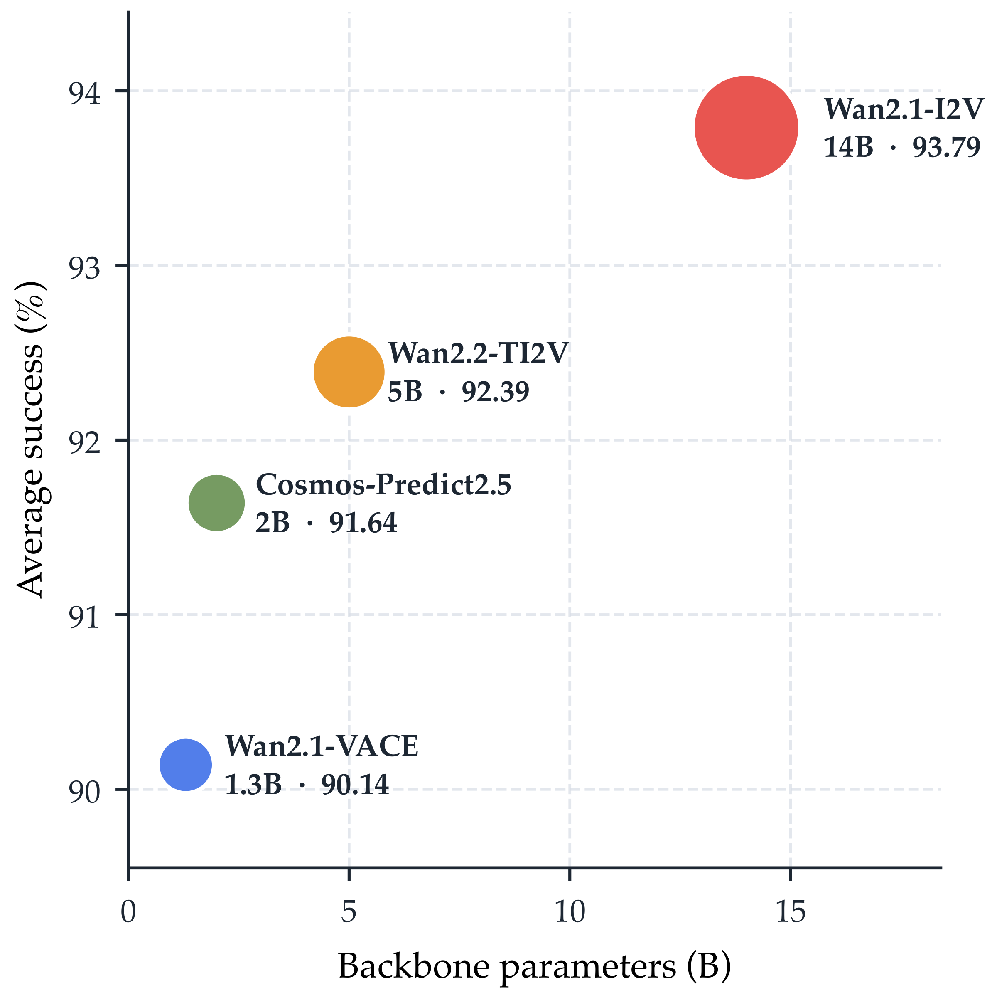

**Original:**

Figure 6. **WAM Performance with Different Video Backbone Size.** With increasing video generation backbone size, performance of the resulting WAM consistently improves.

**中文:**

图 6：**不同视频骨干规模下的 WAM 表现。** 随视频生成骨干规模增大，所得 WAM 的性能持续提高。

**Original:**

To understand whether and to what extent generative world priors facilitate WAM performance, we compare four video generation backbones with variable parameter counts: Wan2.1-VACE-1.3B (Wan et al., 2025), Cosmos-Predict2.5-2B (Ali et al., 2025), Wan2.2-TI2V-5B (Wan et al., 2025), and Wan2.1-I2V-14B (Wan et al., 2025). We instantiate our World–Action Model with a Dual-System architecture consisting of a video generation module and an action generation module connected with joint self-attention, in which the video generation module parameters are copied from the pretrained video generation model. Results are evaluated on RoboTwin2.0-Full.

**中文:**

为考察生成式世界先验是否改善 WAM 表现、又能改善多少，本文比较四个参数量不同的视频生成骨干：Wan2.1-VACE-1.3B (Wan et al., 2025)、Cosmos-Predict2.5-2B (Ali et al., 2025)、Wan2.2-TI2V-5B (Wan et al., 2025)、Wan2.1-I2V-14B (Wan et al., 2025)。世界—动作模型采用双系统架构，由联合自注意力连接视频生成模块与动作生成模块，视频模块参数从预训练视频生成模型复制。结果在 RoboTwin2.0-Full 上评估。

**Original:**

Across the four tested backbones, the average success rate of the resulting WAM improves consistently with video generation backbones of increasing capacity (Figure 6). Wan2.1-I2V-14B performs best, while Wan2.2-TI2V-5B trails it by only 1.40 points, even though the former has nearly **3x** the parameter count. Balancing performance against training and deployment efficiency across the four backbones, we ultimately adopt the 5B model as the default for the remaining controlled studies. Since these backbones also differ in architecture, pretraining data, and objective, this comparison establishes backbone choice as a consequential design variable without attributing the entire gain to parameter count alone. The 5B default also keeps subsequent action-side ablations tractable while holding the inherited world prior fixed.

**中文:**

四个测试骨干中，视频生成骨干容量越大，所得 WAM 平均成功率持续提高（图 6）。Wan2.1-I2V-14B 最好，但参数量接近 Wan2.2-TI2V-5B 的 **3 倍**，优势却只有 1.40 个百分点。综合性能及训练、部署效率，后续受控研究采用 5B 为默认模型。这些骨干还存在架构、预训练数据和目标差异，因此该比较说明骨干选择是重要设计变量，不能将全部增益只归因于参数量。固定 5B 世界先验，也让后续动作侧消融在计算上更易实施。

**Original:**

Visual Representation Priors

**中文:**

视觉表示先验

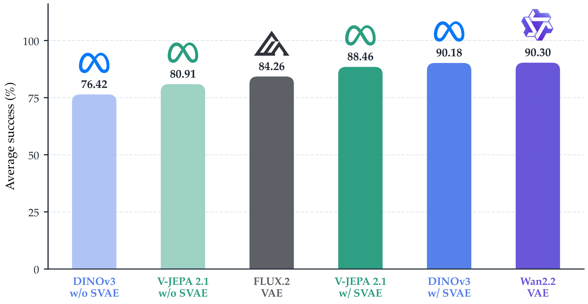

**Original:**

Figure 7. **Visual representation priors.** We consider building WAMs with both reconstructive and representation encoders, and include a variant of representation encoders with S-VAE (Zhang et al., 2025a), an adapter that converts high-dimensional latents produced by representation encoders into low-dimensional vectors suitable for DiT processing.

**中文:**

图 7：**视觉表示先验。** 本文分别使用重建型与表示型编码器构建 WAM，并为表示型编码器增加一个搭配 S-VAE (Zhang et al., 2025a) 的变体。S-VAE 是适配器，将表示型编码器产生的高维潜变量转换为适合 DiT 处理的低维向量。

**Original:**

Another important source of world knowledge comes from the latent representation space induced by vision encoders. Broadly speaking, these encoders fall into two categories: (1) **Reconstructive Encoders**: the objective of these encoders is compression, trained solely with pixel-reconstruction; (2) **Representation Encoders**: grounded by self-supervised or multimodal representation learning, these encoders learn semantically structured visual features that provide a basis for visual understanding. Motivated by recent advances in generative and world modeling with representation encoders (Zheng et al., 2026a; Singh et al., 2026; Zhou et al., 2024; Jha et al., 2026; Lyu et al., 2026), we question the design of latent space in the context of world–action models.

**中文:**

另一项重要世界知识来源，是视觉编码器形成的潜在表示空间。大致有两类编码器：（1）**重建型编码器**：目标是压缩，仅通过像素重建训练；（2）**表示型编码器**：基于自监督或多模态表示学习，学到具有语义结构的视觉特征，为视觉理解提供基础。受近期使用表示型编码器进行生成与世界建模的进展启发 (Zheng et al., 2026a; Singh et al., 2026; Zhou et al., 2024; Jha et al., 2026; Lyu et al., 2026)，本文重新考察世界—动作模型的潜在空间设计。

**Original:**

In this set of experiments, we choose representative encoders from both categories. For Reconstructive Encoders, we use Wan2.2-VAE (Wan et al., 2025), a state-of-the-art video encoder with a 4x temporal compression rate, and FLUX.2-VAE (Black Forest Labs, 2025), an advanced image encoder yielding highly performant image generation models built on its latent space. For Representation Encoders, we use DINOv3 (Siméoni et al., 2025), the newest generation of DINO (Caron et al., 2021), a classical vision encoder learned through self-supervised learning; and V-JEPA 2.1 (Mur-Labadia et al., 2026), a dense feature encoder based on joint embedding predictive architectures (LeCun et al., 2022). To isolate the performance gain from visual representations alone, we inherit the model architecture of Wan2.2-TI2V-5B, but randomly initialize its model weights. For a fair comparison, we apply the same 4x temporal compression as Wan2.2-VAE to FLUX.2-VAE, DINOv3, and V-JEPA 2.1: since none of these encoders natively performs temporal compression, we impose the 4x downsampling by averaging the features of every four consecutive frames.

**中文:**

这组实验从两类编码器中各选代表。重建型采用 Wan2.2-VAE (Wan et al., 2025)——具有 4 倍时间压缩率的先进视频编码器——以及 FLUX.2-VAE (Black Forest Labs, 2025)，后者是先进图像编码器，建立在其潜在空间上的图像生成模型表现优秀。表示型采用 DINOv3 (Siméoni et al., 2025)，即经典自监督视觉编码器 DINO (Caron et al., 2021) 的最新一代，以及 V-JEPA 2.1 (Mur-Labadia et al., 2026)，后者是基于联合嵌入预测架构 (LeCun et al., 2022) 的稠密特征编码器。为只考察视觉表示带来的收益，本文沿用 Wan2.2-TI2V-5B 架构，但随机初始化权重。为公平比较，对 FLUX.2-VAE、DINOv3、V-JEPA 2.1 施加与 Wan2.2-VAE 相同的 4 倍时间压缩；它们本身不做时间压缩，因此通过将每四个连续帧的特征取平均，实现 4 倍下采样。

**Original:**

Since modern Diffusion Transformer architectures (Peebles & Xie, 2023) are optimized mostly for reconstructive encoders, naive adoption of representation encoders, which produces high-dimensional latents (e.g., 768-D features for DINOv3 and 1024-D for V-JEPA 2.1), can lead to poor performance due to architectural incompatibility (Zheng et al., 2026a). Following Jha et al. (2026), we include a variant for representation encoders, where we train an S-VAE (Zhang et al., 2025a) adapter that converts the high-dimensional features produced by representation encoders to lower-dimensional vectors (48-D in this experiment, matching the latent dimension of Wan2.2-VAE).

**中文:**

现代扩散 Transformer 架构 (Peebles & Xie, 2023) 主要针对重建型编码器优化。表示型编码器产生高维潜变量，例如 DINOv3 的 768 维特征、V-JEPA 2.1 的 1024 维特征，直接使用可能因架构不兼容而表现较差 (Zheng et al., 2026a)。遵循文献 Jha et al. (2026)，本文为表示型编码器增加一个变体：训练 S-VAE (Zhang et al., 2025a) 适配器，将高维特征转换为低维向量。本实验采用 48 维，与 Wan2.2-VAE 潜在维度一致。

**Original:**

As shown in Figure 7, representation encoders can yield performance on par with or stronger than reconstructive encoders for world–action modeling with the help of S-VAEs. Specifically, while naive adoption of representation encoders yields worse performance than models trained with the reconstructive encoder FLUX.2-VAE, with dimension contraction using S-VAE, the representation encoders’ contracted variants (DINOv3 w/ SVAE, V-JEPA 2.1 w/ SVAE) significantly outperform FLUX.2-VAE. DINOv3 w/ SVAE achieves nearly on-par performance with Wan2.2-VAE, and we attribute the remaining slim margin to two native advantages of Wan2.2-VAE: it is a reconstructive encoder specifically suited to the video backbone architecture, and its temporal compression is learned natively by the encoder rather than imposed through frame averaging.

**中文:**

图 7 表明，在 S-VAE 帮助下，表示型编码器在世界—动作建模中可以达到与重建型相当、甚至更强的表现。具体而言，直接采用表示型编码器时，性能低于使用重建型 FLUX.2-VAE 的模型；经 S-VAE 收缩维度后，DINOv3 w/ SVAE、V-JEPA 2.1 w/ SVAE 两种变体明显优于 FLUX.2-VAE。DINOv3 w/ SVAE 几乎追平 Wan2.2-VAE；作者将剩余的小差距归因于后者两个原生优势：作为重建型编码器，它更适配该视频骨干架构；其时间压缩由编码器原生学得，而非额外用帧平均施加。

**Original:**

Taken together, what determines the quality of a WAM latent space is not the categorical divide between reconstructive and representation encoders, but the operational properties of the latents themselves: compactness (in both the temporal and the token dimension) and rich world information. Priors in representation encoders can thus be inherited to build highly performant WAMs with the help of **temporal compression** and **dimension contraction**. We also encourage active research into building representation encoders with native temporal compression, which in turn may lead to even better prior inheritance.

**中文:**

这些结果说明，决定 WAM 潜在空间质量的，不是重建型与表示型这一类别区分，而是潜变量本身的实际属性：在时间与 token 维度上都足够紧凑，同时包含丰富世界信息。因此，借助**时间压缩**与**维度收缩**，也能继承表示型编码器的先验，构建高性能 WAM。作者也鼓励研究原生支持时间压缩的表示型编码器，这可能带来更好的先验继承。

**Original:**

**Finding 1:** A WAM inherits upstream world knowledge most effectively through a sufficiently capable generative backbone and a compact, information-rich visual representation space. Reconstructive encoders are not the only option; representation encoders with dimension compression are also performant.

**中文:**

**发现 1：** WAM 通过能力足够强的生成骨干，以及紧凑、信息丰富的视觉表示空间，最有效地继承上游世界知识。重建型编码器并非唯一选择；经过维度压缩的表示型编码器同样有效。

**Original:**

Building Synergy between World and Action Learning

**中文:**

建立世界学习与动作学习的协同

**Original:**

Inheriting the right priors is not enough; a world–action model needs to build synergy between world and action learning. This requires three decisions at different levels of the system: where action-specific capacity lives, which cross-modal information paths are available during training, and whether inference preserves the noise-state relationship on which those paths were learned.

**中文:**

继承合适先验还不够，世界—动作模型还需建立世界学习与动作学习的协同。这涉及三个不同系统层级的决定：动作专属容量放在哪里，训练时开放哪些跨模态信息通路，以及推理是否保持这些通路学习时所对应的噪声状态关系。

**Original:**

**Question 2:** How should inherited world knowledge interact with action learning?

**中文:**

**问题 2：继承的世界知识应如何与动作学习相互作用？**

**Original:**

Architectural Capacity

**中文:**

架构容量

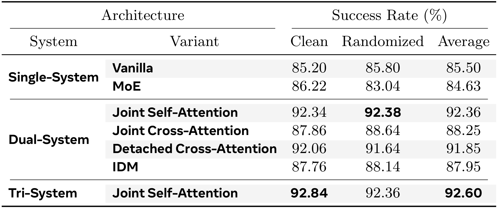

**Original:**

Table 1. **Architecture Ablation.** Averaged success rates (%) on RoboTwin2.0-Full. Bold denotes best values.

| Architecture | Architecture | Success Rate (%) | Success Rate (%) | Success Rate (%) |
| --- | --- | --- | --- | --- |
| System | Variant | Clean | Randomized | Average |
| **Single-System** | **Vanilla** | 85.20 | 85.80 | 85.50 |
| **Single-System** | **MoE** | 86.22 | 83.04 | 84.63 |
| **Dual-System** | **Joint Self-Attention** | 92.34 | **92.38** | 92.36 |
| **Dual-System** | **Joint Cross-Attention** | 87.86 | 88.64 | 88.25 |
| **Dual-System** | **Detached Cross-Attention** | 92.06 | 91.64 | 91.85 |
| **Dual-System** | **IDM** | 87.76 | 88.14 | 87.95 |
| **Tri-System** | **Joint Self-Attention** | **92.84** | 92.36 | **92.60** |

**中文:**

表 1：**架构消融。** RoboTwin2.0-Full 上的平均成功率（%），粗体表示最佳值。

| 系统 | 变体 | 整洁场景成功率（%） | 随机场景成功率（%） | 平均成功率（%） |
| --- | --- | --- | --- | --- |
| **单系统** | **Vanilla** | 85.20 | 85.80 | 85.50 |
| **单系统** | **MoE** | 86.22 | 83.04 | 84.63 |
| **双系统** | **联合自注意力** | 92.34 | **92.38** | 92.36 |
| **双系统** | **联合交叉注意力** | 87.86 | 88.64 | 88.25 |
| **双系统** | **截断梯度的交叉注意力** | 92.06 | 91.64 | 91.85 |
| **双系统** | **IDM** | 87.76 | 88.14 | 87.95 |
| **三系统** | **联合自注意力** | **92.84** | 92.36 | **92.60** |

**Original:**

A central question in world–action modeling is how much action-specific capacity a WAM requires and how strongly its video and action streams should be separated. The three architecture families of Section 3.1 span precisely this capacity axis, and we evaluate all six of their variants, instantiating joint cross-attention both end-to-end and with gradients detached at the video features, yielding seven baselines (Table 1).

**中文:**

世界—动作建模的核心问题之一是：WAM 需要多少动作专属容量，视频与动作两流应分离到什么程度。3.1 节的三类架构恰好覆盖这一容量维度。本文评估全部六种变体，并将联合交叉注意力分别实现为端到端训练和在视频特征处截断梯度的版本，共得到七个基线（表 1）。

**Original:**

Results.

**中文:**

结果

**Original:**

As shown in Table 1, with increasing architecture capacity, performance from single- to dual- and tri-system continuously improves. Joint self-attention is the strongest dual-system variant, while the tri-system model achieves the best overall performance. Balancing performance with architectural complexity, and isolating the interaction between world knowledge and action learning from the potential influence of the VLM’s understanding features, we therefore adopt dual-system joint self-attention for the remaining experiments, so that the subsequent findings reflect this interaction alone.

**中文:**

表 1 显示，随着架构容量增加，从单系统到双系统、三系统，性能持续提高。联合自注意力是最强双系统变体，三系统模型则总体最佳。为平衡性能与架构复杂度，并排除 VLM 理解特征可能对世界知识—动作学习交互产生的影响，后续实验采用双系统联合自注意力，使后续发现只反映这种交互本身。

**Original:**

Training-Time Information Flow

**中文:**

训练时信息流

**Original:**

The architectural comparison selects joint self-attention as the interface between the world and action streams, but joint attention alone does not specify which information flow creates the best synergy. We compare four information flow strategies at training time, controlled by attention masking: **Isolated**, with no cross-stream communication; **Video Sees Action**, which exposes action features to the world stream; **Action Sees Video**, which exposes world features to the action stream; and **Mutual**, which enables both directions.

**中文:**

架构比较选定联合自注意力作为世界流与动作流的接口，但联合注意力本身没有说明哪种信息流最有利于协同。本文通过注意力掩码控制并比较四种训练信息流：**Isolated** 禁止跨流通信；**Video Sees Action** 向世界流开放动作特征；**Action Sees Video** 向动作流开放世界特征；**Mutual** 同时开放两个方向。

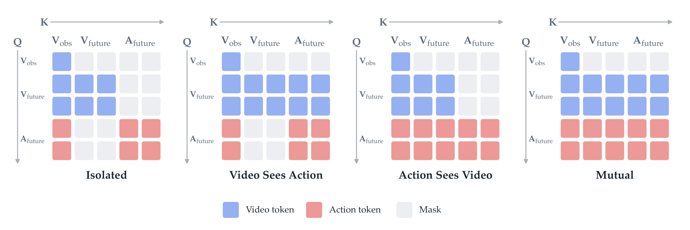

**Original:**

Figure 8. **Attention Masking Strategies.** We control cross-modality information flow at training time via attention masking.

**中文:**

图 8：**注意力掩码策略。** 本文通过注意力掩码控制训练时的跨模态信息流。

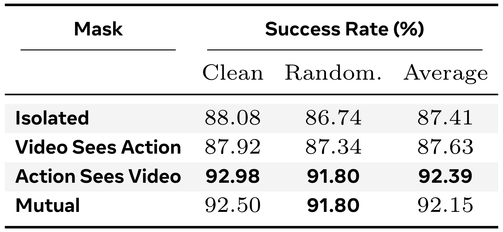

**Original:**

Table 2. **Action learning requires access to world information.** Success rates (%) on RoboTwin2.0-Full.

| **Mask** | **Success Rate (%)** | **Success Rate (%)** | **Success Rate (%)** |
| --- | --- | --- | --- |
|  | Clean | Random. | Average |
| **Isolated** | 88.08 | 86.74 | 87.41 |
| **Video Sees Action** | 87.92 | 87.34 | 87.63 |
| **Action Sees Video** | **92.98** | **91.80** | **92.39** |
| **Mutual** | 92.50 | **91.80** | 92.15 |

**中文:**

表 2：**动作学习需要访问世界信息。** RoboTwin2.0-Full 上的成功率（%）。

| **掩码** | **整洁场景成功率（%）** | **随机场景成功率（%）** | **平均成功率（%）** |
| --- | --- | --- | --- |
| **Isolated（相互隔离）** | 88.08 | 86.74 | 87.41 |
| **Video Sees Action（视频看动作）** | 87.92 | 87.34 | 87.63 |
| **Action Sees Video（动作看视频）** | **92.98** | **91.80** | **92.39** |
| **Mutual（相互可见）** | 92.50 | **91.80** | 92.15 |

**Original:**

The comparison separates cleanly according to whether the action stream can access world features (Figure 8, Table 2). Isolated and video-sees-action masks underperform by roughly five points, whereas action-sees-video and mutual visibility both retain strong performance. World-to-action flow is therefore necessary in this setting. By contrast, adding the reverse action-to-world path changes the from-scratch result only marginally, leaving action-sees-video and mutual visibility as two viable masks to revisit after pretraining.

**中文:**

比较结果按动作流能否访问世界特征清晰分开（图 8、表 2）。Isolated 和 video-sees-action 约低五个百分点，action-sees-video 与 mutual 则都保持较好表现。因此，在这一设置下，世界到动作的信息流是必要的。相比之下，再开放反向的动作到世界通路，对从头训练结果只有很小影响。因此，action-sees-video 与 mutual 都是可行掩码，值得在预训练之后再次比较。

**Original:**

Inference-Time Information Flow

**中文:**

推理时信息流

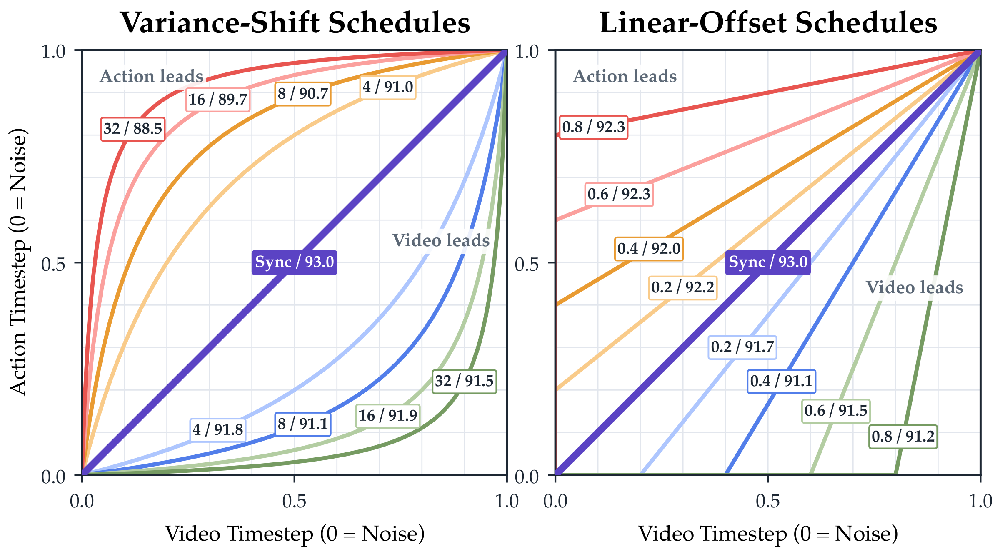

**Original:**

Figure 9. **Inference-time Information Flow via Denoising Schedule.** Each curve traces action denoising progress against video denoising progress. Curves above/below the diagonal denoise action/video first, respectively.

**中文:**

图 9：**通过去噪调度控制推理时信息流。** 每条曲线描绘动作去噪进度随视频去噪进度的变化。对角线上方和下方的曲线，分别让动作和视频先去噪。

**Original:**

Training-time attention masking implements *full masking*, while the inference-time denoising schedule provides a softer information gate, i.e. *partial masking*. For this ablation, we fix mutual visibility and train the video and action streams with independently sampled noise levels, covering a two-dimensional space of joint noise states.

**中文:**

训练时注意力掩码实现*完全屏蔽*；推理时去噪调度则提供较软的信息门控，即*部分屏蔽*。这项消融固定双向可见性，训练时独立采样视频与动作的噪声水平，覆盖二维联合噪声状态空间。

**Original:**

We instantiate the schedule abstraction of Section 3.3: synchronized denoising follows the diagonal $(t_v^i,t_a^i)=(s_i,s_i)$, while the variance-shift and linear-offset families of Equation 3 let either stream lead  (Baade et al., 2026). We evaluate $\alpha\in\{4,8,16,32\}$ and $o\in\{0.2,0.4,0.6,0.8\}$ in both leading directions.

**中文:**

本文采用 3.3 节的调度形式：同步去噪沿对角线 $(t_v^i,t_a^i)=(s_i,s_i)$ 前进，公式 3 的方差偏移与线性偏移函数族则允许任一流领先 (Baade et al., 2026)。两个领先方向都评估 $\alpha\in\{4,8,16,32\}$ 与 $o\in\{0.2,0.4,0.6,0.8\}$。

**Original:**

Results.

**中文:**

结果

**Original:**

Synchronized denoising performs best, and no asynchronous schedule improves performance, regardless of which stream leads or how relative progress is parameterized (Figure 9). With variance-shift schedules, video-leading outperforms action-leading schedules, whereas with linear-offset schedules, action-leading outperforms video-leading schedules. This suggests that while explicit video-to-action information flow is necessary at training time, enforcing such priors through the inference-time denoising schedule does not yield gains, supporting the representation learning hypothesis of world–action modeling (Yuan et al., 2026b) as opposed to an implicit planning-then-IDM schedule at test time (Ye et al., 2026c).

**中文:**

同步去噪最好；无论哪条流领先，或怎样参数化相对进度，异步调度都没有改善表现（图 9）。采用方差偏移时，视频领先优于动作领先；采用线性偏移时，动作领先反而优于视频领先。这提示，虽然训练时必须有明确的视频到动作信息流，但在推理去噪安排中强制施加这类先后关系并无收益。结果支持世界—动作建模的表示学习假设 (Yuan et al., 2026b)，而不支持测试时隐式“先规划、再运行 IDM”的安排 (Ye et al., 2026c)。

**Original:**

**Finding 2:** World–action synergy requires explicit world-to-action information flow during training, and synchronized joint denoising at inference. We carry forward dual-system joint self-attention with synchronized denoising and defer the close choice between one-way and mutual visibility to pretraining.

**中文:**

**发现 2：** 世界—动作协同需要训练时明确的世界到动作信息流，以及推理时同步联合去噪。后续采用双系统联合自注意力和同步去噪；单向与双向可见性差距较小，留到预训练阶段再决定。

**Original:**

Consolidating Knowledge Across Domains

**中文:**

整合不同领域的知识

**Original:**

The preceding studies identify which world priors to inherit and how world and action streams should interact. However, strong single-domain performance alone does not establish transferable world–action knowledge: the model may simply fit the visual and action distribution of the target tasks, a distinction that cross-domain pretraining sharpens. Robot trajectories provide executable action supervision but limited visual coverage, whereas egocentric video offers broader visual diversity but lacks robot action labels. We therefore ask where pretraining gains arise, how these two sources should be combined, and whether the information-flow choice identified from scratch remains valid after pretraining.

**中文:**

前面的研究识别了应继承哪些世界先验，以及世界流与动作流如何交互。但单一领域表现较好，还不能说明模型获得了可迁移的世界—动作知识：它可能只是拟合目标任务的视觉与动作分布，跨领域预训练能更清楚地区分这两种情况。机器人轨迹提供可执行动作监督，但视觉覆盖有限；第一人称视频提供更广的视觉多样性，却没有机器人动作标签。因此，本文研究预训练收益来自何处、两种数据应如何结合，以及从头训练时找到的信息流选择在预训练后是否仍成立。

**Original:**

**Question 3:** How can world–action knowledge be consolidated and transferred across domains?

**中文:**

**问题 3：如何跨领域整合并迁移世界—动作知识？**

**Original:**

Problem Setup and Evaluation Protocol

**中文:**

问题设置与评测协议

**Original:**

Controlled Transfer Protocol.

**中文:**

受控迁移协议

**Original:**

All runs keep the backbones, optimization budget, and inference procedure fixed — the dual-system joint self-attention architecture with synchronized denoising selected above — and vary only whether and how the model is pretrained with embodiment data; the information-flow mask is revisited in the final ablation. Two complementary protocols serve the evaluation: **RoboTwin2.0-Clean2Random** fine-tunes on Clean and evaluates Clean as in-domain (ID) and Randomized as out-of-domain (OOD), exposing transfer; **RoboTwin2.0-Full** fine-tunes on the full RoboTwin2.0 training set and reports the mean success rate over both conditions.

**中文:**

所有运行固定骨干、优化预算和推理流程，即前文选定的双系统联合自注意力架构及同步去噪，只改变是否使用具身数据预训练，以及如何预训练；最后一项消融再考察信息流掩码。评测采用两个互补协议：**RoboTwin2.0-Clean2Random** 在 Clean 上微调，把 Clean 视作域内（ID）、Randomized 视作分布外（OOD）评估，以呈现迁移能力；**RoboTwin2.0-Full** 在完整 RoboTwin2.0 训练集上微调，报告两种条件的平均成功率。

**Original:**

Embodied Pretraining Data Mixture.

**中文:**

具身预训练数据组合

**Original:**

We compare supervised fine-tuning from scratch with three pretraining strategies under an identical 600-hour data budget, drawing egocentric human video from EgoDex  (Hoque et al., 2025) and real-robot manipulation trajectories from RoboCOIN  (Wu et al., 2025). *Robot-only* spends the full 600-hour budget on robot data; the two mixed variants combine 350 hours of egocentric data with 250 hours of robot data, either in two stages (*ego then robot*) or jointly in one stage (*ego + robot co-train*). All four variants then undergo identical downstream fine-tuning.

**中文:**

在相同的 600 小时数据预算下，本文比较从头进行监督微调，以及三种预训练策略。人类第一人称视频来自 EgoDex (Hoque et al., 2025)，真实机器人操作轨迹来自 RoboCOIN (Wu et al., 2025)。*Robot-only* 将全部 600 小时用于机器人数据；两种混合策略都使用 350 小时第一人称数据和 250 小时机器人数据，一种分为两阶段，*先 ego、后 robot*；另一种在单阶段联合训练，即 *ego + robot co-train*。随后，四种变体进行完全相同的下游微调。

**Original:**

Embodied Pretraining Primarily Expands OOD Generalization

**中文:**

具身预训练主要增强分布外泛化

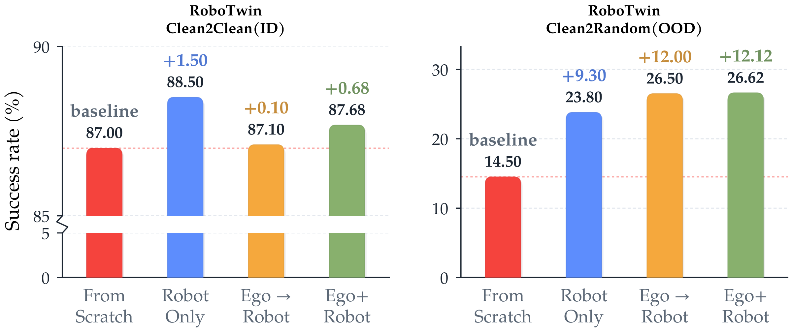

**Original:**

Figure 10. **Embodied Pretraining Primarily Improves OOD Generalization.** Success rates on RoboTwin2.0-Clean2Random, ordered from lower to higher performance within each evaluation setting.

**中文:**

图 10：**具身预训练主要改善分布外泛化。** RoboTwin2.0-Clean2Random 成功率；每种评测条件内按性能从低到高排序。

**Original:**

Pretraining Primarily Improves OOD Generalization.

**中文:**

预训练主要改善分布外泛化

**Original:**

As shown in Figure 10, embodied pretraining yields modest gains for in-domain performance, but yields strong performance gains in OOD evaluation. Embodied pretraining therefore contributes mainly knowledge that transfers beyond the downstream training distribution, rather than better fitting an already saturated ID benchmark.

**中文:**

图 10 显示，具身预训练对域内表现的增益有限，却明显改善分布外评测表现。因此，它主要提供能够迁移到下游训练分布之外的知识，而非更好拟合一个已趋于饱和的域内基准。

**Original:**

Robot and Egocentric Data Contribute Different Strengths.

**中文:**

机器人数据与第一人称数据各有优势

**Original:**

Robot-only pretraining yields the strongest ID performance, while both mixed strategies generalize better OOD. This trade-off is consistent with the insight of robot trajectories strengthening executable action grounding and egocentric video broadening the visual and interaction distribution.

**中文:**

只用机器人数据预训练，域内表现最强；两种混合策略则具有更好的分布外泛化。这种权衡符合如下认识：机器人轨迹加强可执行动作能力，第一人称视频扩展视觉和交互分布。

**Original:**

Absorbing Egocentric Videos: Sequential versus Co-Training.

**中文:**

吸收第一人称视频：顺序训练与联合训练

**Original:**

Sequential training and one-stage co-training performance are nearly matched in both in-domain and OOD evaluation, indicating that using both sources matters more than their precise ordering. Co-training is marginally strongest overall and removes the extra curriculum transition, so we adopt it as the practical default.

**中文:**

顺序训练与一阶段联合训练，在域内及分布外评测中表现几乎相同，说明同时使用两种来源比精确安排先后顺序更重要。联合训练总体略好，也省去了额外的训练阶段切换，因此作为实践默认方案。

**Original:**

Pretraining Changes the Preferred Information Flow

**中文:**

预训练改变了最合适的信息流

**Original:**

The from-scratch ablation establishes that the action stream must see the world stream, but leaves one-way and mutual visibility nearly tied. We repeat this comparison after cross-domain pretraining under both RoboTwin2.0-Clean2Random and RoboTwin2.0-Full.

**中文:**

从头训练的消融确认，动作流必须能看到世界流，但单向与双向可见性几乎持平。跨领域预训练后，本文在 RoboTwin2.0-Clean2Random 和 RoboTwin2.0-Full 两种协议下重新比较。

**Original:**

Mutual Visibility Becomes Preferable with Embodied Pretraining.

**中文:**

具身预训练后，双向可见性更有利

**Original:**

Without embodied pretraining, RoboTwin2.0-Full slightly favors one-way visibility; after pretraining, however, the same protocol favors Mutual. RoboTwin2.0-Clean2Random shows the same reversal in both ID and OOD, with comparable gains across the two splits (Figure 11). The reversal is therefore neither an artifact of domain shift nor of the evaluation protocol: pretraining turns the world–action interaction into a genuinely bidirectional exchange, in which the predicted future frames provide visual guidance for action generation, while the predicted actions in turn inform the synthesis of the manipulator’s motion in those frames. Without embodied pretraining, data scarcity likely prevents the two streams from reliably establishing such correspondences; the far more abundant pretraining data closes this gap, and Mutual accordingly realizes its advantage once embodied pretraining is in place. We carry Mutual into the final recipe.

**中文:**

不做具身预训练时，RoboTwin2.0-Full 略偏好单向可见性；预训练后，同一协议更偏好 Mutual。RoboTwin2.0-Clean2Random 的域内与分布外评测也出现同样反转，两个划分的收益相近（图 11）。因此，反转并非域偏移或评测协议造成的表象：预训练使世界—动作交互成为真正的双向交换，预测未来帧为动作生成提供视觉指导，预测动作又帮助合成这些帧中的机械臂运动。没有具身预训练时，数据稀缺可能让双流无法可靠建立这类对应关系；更丰富的预训练数据弥合了差距，Mutual 因而在具身预训练后显现优势。最终方案采用 Mutual。

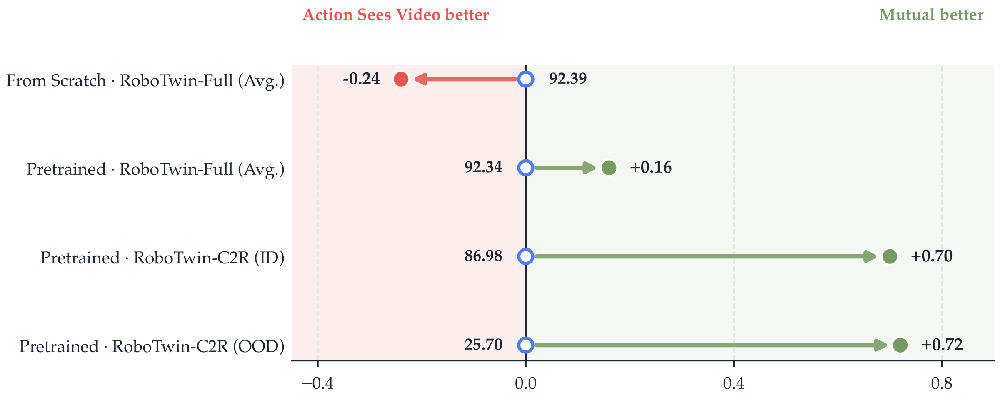

**Original:**

Figure 11. **Pretraining Changes the Preferred Information Flow.** Central markers give the absolute success rate of Action Sees Video; arrows terminate at the matched Mutual result, with horizontal displacement reporting $\text{Mutual}-\text{Action Sees Video}$ in percentage points. Green and red denote gains and drops, respectively.

**中文:**

图 11：**预训练改变了最合适的信息流。** 中心标记表示 Action Sees Video 的绝对成功率，箭头终点对应匹配条件下的 Mutual 结果；水平位移表示 $\text{Mutual}-\text{Action Sees Video}$，单位为百分点。绿色和红色分别表示提升与下降。

**Original:**

**Finding 3:** Embodied pretraining primarily expands OOD generalization. Robot trajectories preserve action grounding, egocentric video broadens transfer, and one-stage co-training integrates both effectively. At pretrained scale, mutual world–action visibility is consistently preferred.

**中文:**

**发现 3：** 具身预训练主要增强分布外泛化。机器人轨迹保留可执行动作能力，第一人称视频拓展迁移，一阶段联合训练有效整合二者。达到预训练规模后，双向世界—动作可见性始终更优。

**Original:**

Concluding Remarks

**中文:**

小结

**Original:**

The three questions turn inherited world knowledge into a concrete model design: not a list of individually best hyperparameters, but a sequence in which each decision is tested under the conditions created by the previous one. The next section composes these defaults into **OpenWAM-**$\boldsymbol{\alpha}$ and asks whether they survive full-scale heterogeneous pretraining.

**中文:**

这三个问题将继承的世界知识落实为具体模型设计：它不是把每个单独最优的超参数罗列起来，而是形成一串决策，每一步都在前一步建立的条件下接受检验。下一节将这些默认选择组合为 **OpenWAM-**$\boldsymbol{\alpha}$，考察它们在完整规模的异构预训练中是否仍然成立。

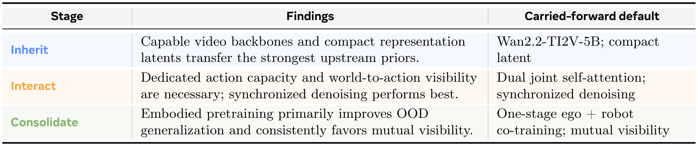

**Original:**

Table 3. **The recipe accumulated by OpenWAM-Study.** Each evidence-backed choice becomes the default for OpenWAM-$\alpha$.

| **Stage** | **Findings** | **Carried-forward default** |
| --- | --- | --- |
| **Inherit** | Capable video backbones and compact representation latents transfer the strongest upstream priors. | Wan2.2-TI2V-5B; compact latent |
| **Interact** | Dedicated action capacity and world-to-action visibility are necessary; synchronized denoising performs best. | Dual joint self-attention; synchronized denoising |
| **Consolidate** | Embodied pretraining primarily improves OOD generalization and consistently favors mutual visibility. | One-stage ego + robot co-training; mutual visibility |

**中文:**

表 3：**OpenWAM-Study 逐步形成的方案。** 每项有证据支持的选择，都成为 OpenWAM-$\alpha$ 的默认配置。

| **阶段** | **发现** | **后续采用的默认配置** |
| --- | --- | --- |
| **继承** | 能力强的视频骨干与紧凑的表示潜变量，能够迁移最强的上游先验。 | Wan2.2-TI2V-5B；紧凑潜变量 |
| **交互** | 专属动作容量与世界到动作可见性是必要条件；同步去噪表现最好。 | 双系统联合自注意力；同步去噪 |
| **整合** | 具身预训练主要改善分布外泛化，并始终更偏好双向可见性。 | 一阶段第一人称 + 机器人数据联合训练；双向可见性 |

## OpenWAM-α：从原则到模型

**Original:**

OpenWAM-$\alpha$: From Principles to a Pretrained Model

**中文:**

OpenWAM-$\alpha$：从设计原则到预训练模型

**Original:**

**Overview of OpenWAM-$\alpha$.** Motivated by the design principles and empirical insights uncovered through OpenWAM-Study, we instantiate these findings at scale in OpenWAM-$\alpha$, an open foundation world–action model for systematically investigating the capabilities and scaling behavior of world–action models across diverse robotic tasks. In Section 5.1, we specify the final architecture, training recipe, and deployment scheme of OpenWAM-$\alpha$ under the guidance of the insights established in Section 4. Section 5.2 then details the pretraining data configuration together with the associated data curation and cleaning pipeline. Finally, Section 5.3 evaluates OpenWAM-$\alpha$ across a diverse set of simulation benchmarks, with analyses of its performance and the key empirical findings revealed by these evaluations, and Section 5.4 further evaluates it on real-world tasks.

**中文:**

**OpenWAM-$\alpha$ 概述。** 基于 OpenWAM-Study 得出的设计原则与实验发现，我们将这些结论扩大到更大规模，构建了开放的基础世界—动作模型 OpenWAM-$\alpha$，用于系统研究世界—动作模型在不同机器人任务上的能力和规模扩展规律。第 5.1 节依据第 4 节的结论，说明 OpenWAM-$\alpha$ 的最终架构、训练方案和部署方式；第 5.2 节介绍预训练数据配置及相应的筛选、清洗流程；第 5.3 节在多种仿真基准上评估 OpenWAM-$\alpha$，分析模型表现及评估揭示的关键发现；第 5.4 节进一步考察真实环境任务。

**Original:**

OpenWAM-$\alpha$ Architecture, Training, and Deployment

**中文:**

OpenWAM-$\alpha$ 的架构、训练与部署

**Original:**

As shown in Figure 12, the design principles distilled from **OpenWAM-Study** determine the configuration of OpenWAM-$\alpha$ across its architecture, training, and deployment stages. The following paragraphs elaborate on each stage in turn.

**中文:**

如图 12 所示，**OpenWAM-Study** 提炼出的原则决定了 OpenWAM-$\alpha$ 在架构、训练和部署各阶段的配置。下面依次展开介绍。

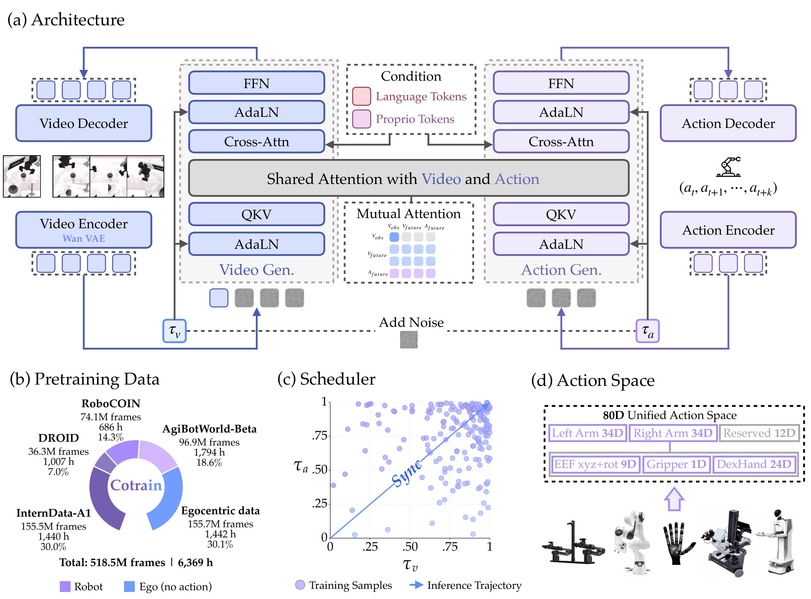

**Original:**

Figure 12. **Overview of OpenWAM-$\alpha$.** (a) The dual-system architecture: a video-generation DiT and an ActionDiT jointly denoise the future frames and the action chunk through shared attention under the mutual visibility mask, each conditioned on language and proprioception via cross-attention and carrying its own noise timestep. (b) The pretraining mixture: 518.5M frames (6,369 hours) of egocentric and robot data, co-trained in one stage. (c) Timestep sampling: training covers the full joint noise plane, while inference follows the synchronized diagonal. (d) The 80-D unified action space with fixed slot semantics shared across embodiments.

**中文:**

图 12：**OpenWAM-$\alpha$ 总览。** (a) 双系统架构：视频生成 DiT 和 ActionDiT 在双向可见性掩码下，通过共享注意力联合去噪未来帧与动作块；两者各自通过交叉注意力接收语言和本体状态条件，并使用各自的噪声时间步。(b) 预训练数据混合：518.5M 帧、共 6,369 小时的第一视角人类数据和机器人数据，在同一阶段联合训练。(c) 时间步采样：训练覆盖完整的联合噪声平面，推理沿同步对角线进行。(d) 80 维统一动作空间，在不同机器人形态之间共享固定的槽位语义。

**Original:**

Architecture

**中文:**

架构

**Original:**

**OpenWAM-$\alpha$** adopts the architecture that **OpenWAM-Study** converges to (Table 3), assembled from the modules of Section 3.1 as the composition $C(\mathcal{E},\mathcal{S},\mathcal{M})$: the frozen Wan2.2-VAE as the visual encoder $\mathcal{E}$; the pretrained Wan2.2-TI2V-5B DiT  (Wan et al., 2025) executing the world stream and a dedicated 1B-parameter ActionDiT executing the action stream, coupled through joint self-attention, as the stream backbones $\mathcal{S}=\{\mathcal{W},\mathcal{A}\}$; and the *mutual* mode with first-frame-causal intra-video attention as the visibility mask $\mathcal{M}$. Conditioned on the current observation $\mathbf{o}_1$ (all camera views tiled into one canvas), the language instruction $\ell$, and the proprioceptive state $\mathbf{q}\in\mathbb{R}^{80}$ expressed in the unified action space, OpenWAM-$\alpha$ jointly denoises the future frames $\mathbf{o}_{2:T}$ of a $T$-frame video window $\mathbf{o}_{1:T}$ in latent space, together with a continuous action chunk $\mathbf{a}=\mathbf{a}_{1:H}\in\mathbb{R}^{H\times80}$  (Zhao et al., 2023) (Figure 12a).

**中文:**

**OpenWAM-$\alpha$** 采用 **OpenWAM-Study** 最终确定的架构（表 3），由第 3.1 节模块按 $C(\mathcal{E},\mathcal{S},\mathcal{M})$ 组合而成：冻结的 Wan2.2-VAE 作为视觉编码器 $\mathcal{E}$；预训练 Wan2.2-TI2V-5B DiT (Wan et al., 2025) 负责世界流，专用的 1B 参数 ActionDiT 负责动作流，二者通过联合自注意力耦合，构成流骨干 $\mathcal{S}=\{\mathcal{W},\mathcal{A}\}$；可见性掩码 $\mathcal{M}$ 则采用 *mutual* 双向可见模式，并在视频内部使用首帧因果注意力。给定当前观测 $\mathbf{o}_1$（所有相机视图拼到同一画布）、语言指令 $\ell$，以及用统一动作空间表示的本体状态 $\mathbf{q}\in\mathbb{R}^{80}$，OpenWAM-$\alpha$ 在隐空间中联合去噪两项输出：$T$ 帧视频窗口 $\mathbf{o}_{1:T}$ 中的未来帧 $\mathbf{o}_{2:T}$，以及连续动作块 $\mathbf{a}=\mathbf{a}_{1:H}\in\mathbb{R}^{H\times80}$ (Zhao et al., 2023)，见图 12a。

**Original:**

**Tokenization and Context.** The frozen Wan2.2-VAE encodes $\mathbf{o}_{1:T}$ causally – the first frame alone, subsequent frames in groups of four – into $T'=1+(T-1)/4$ latent frames $\mathbf{z}$, so the first latent frame remains a clean anchor of the present. A $(1,2,2)$ patch embedding flattens the latent video into world-stream tokens of width 3072 carrying 3D RoPE over the (frame, height, width) grid; each of the $H$ noised action steps is linearly embedded into one action-stream token of width 1024 carrying 1D RoPE over the chunk index. The frozen umT5 encoder maps $\ell$ into a 4096-dimensional context, a linear projection appends $\mathbf{q}$ as one additional context token, and both streams consume the resulting context $\mathbf{c}$ through their own per-block cross-attention.

**中文:**

**词元化与上下文。** 冻结的 Wan2.2-VAE 对 $\mathbf{o}_{1:T}$ 进行因果编码：首帧单独编码，后续每四帧一组，得到 $T'=1+(T-1)/4$ 个隐空间帧 $\mathbf{z}$，因此首个隐帧始终作为表示当前时刻的无噪声锚点。大小为 $(1,2,2)$ 的 patch 嵌入将隐空间视频展开为维度 3072 的世界流词元，在“帧、高、宽”网格上使用3D RoPE；$H$ 个加噪动作步则各自经线性嵌入变为一个维度 1024 的动作流词元，沿动作块索引使用1D RoPE。冻结的 umT5 编码器将 $\ell$ 映射为 4096 维上下文，线性投影再把 $\mathbf{q}$ 作为额外一个上下文词元加入其中。两个流通过各自每层的交叉注意力读取最终上下文 $\mathbf{c}$。

**Original:**

**Stream Bridging and Prediction.** All 30 paired layers of the two backbones act as bridge layers, where stream-owned projections map the two residual widths into a shared attention space of 24 heads $\times$ 128 dimensions; under the configured $\mathcal{M}$, the two streams read each other freely while the clean first-frame rows attend to neither noised future frames nor actions. AdaLN injects each stream’s own denoising timestep – $t_v$ token-wise into the world stream, with first-frame tokens pinned to the clean endpoint $t_v=1$, and $t_a$ into the action stream – and linear heads decode both final states into velocities, realizing the joint forward pass of Section 3.2 at any joint noise state $(t_v,t_a)$; how training and inference each cover this plane is specified in Section 5.1.2, Section 5.1.3.

**中文:**

**流间连接与预测。** 两个骨干的全部 30 对层都用作连接层。每个流各自的投影将不同维度的残差表示映射到共享注意力空间，其规模为 24 个头 $\times$ 128 维。在配置的 $\mathcal{M}$ 下，两个流能够自由相互读取，但无噪声首帧对应的注意力查询行既不关注加噪未来帧，也不关注动作。AdaLN 注入各流自身的去噪时间步：世界流按词元注入 $t_v$，其中首帧词元固定在无噪声端点 $t_v=1$；动作流则注入 $t_a$。线性输出头将两流最终状态解码为速度，从而在任意联合噪声状态 $(t_v,t_a)$ 下实现第 3.2 节的联合前向计算。训练与推理如何覆盖这一平面，分别见第 5.1.2、5.1.3 节。

**Original:**

Training

**中文:**

训练

**Original:**

**Co-Training Setup.** Following the one-stage co-training strategy identified in Section 4.3, OpenWAM-$\alpha$ is trained end to end in a single stage on the ego + robot mixture of Section 5.2. The video DiT (initialized from the pretrained Wan2.2-TI2V-5B weights), the ActionDiT, and the proprioception encoder are all updated; only the umT5 text encoder and the Wan2.2-VAE remain frozen.

**中文:**

**联合训练设置。** 沿用第 4.3 节确定的单阶段联合训练策略，OpenWAM-$\alpha$ 在第 5.2 节的第一视角人类与机器人混合数据上，进行单阶段端到端训练。视频 DiT 从预训练 Wan2.2-TI2V-5B 权重初始化，与 ActionDiT、本体状态编码器一起更新；只有 umT5 文本编码器和 Wan2.2-VAE 保持冻结。

**Original:**

**Unified Action Supervision.** Heterogeneous embodiments meet in the unified action space of Section 3.4: an 80-dimensional vector with fixed slot semantics, comprising two mirrored 34-D arm blocks – end-effector position (3), 6D rotation (6), gripper (1), and dexterous hand (24) – followed by 12 slots reserved for embodiment-specific channels (Figure 12d). Each dataset scatters its native action and state into these slots, the validity mask $\mathbf{m}$ of Equation 2 confines action supervision to the populated coordinates, and the robot state at the start of the window supplies the proprioception token in $\mathbf{c}$.

**中文:**

**统一动作监督。** 不同机器人形态通过第 3.4 节的统一动作空间对齐：80 维向量采用固定槽位语义，包括两个对称的 34 维机械臂区块，每个区块含末端位置 3 维、6D 旋转 6 维、夹爪 1 维和灵巧手 24 维；末尾另保留 12 个槽位，用于各形态特有的通道，见图 12d。每个数据集把自身原生动作和状态映射到这些槽位，公式 2 的有效性掩码 $\mathbf{m}$ 将动作监督限制在实际填充的坐标上；窗口起点的机器人状态则生成上下文 $\mathbf{c}$ 中的本体状态词元。

**Original:**

**Objective and Timestep Sampling.** OpenWAM-$\alpha$ is trained with the joint flow-matching objective of Equation 2  (Black et al., 2024), instantiated with $\lambda_v=\lambda_a=1$ and a bell-shaped timestep weight $w(\cdot)$ peaked at intermediate noise levels. The per-stream timesteps are drawn independently as $t_v=1-f_{\rho}(u_v)$ and $t_a=1-f_{\rho}(u_a)$ with $u_v,u_a\sim\mathcal{U}[0, 1]$, where the timestep warp $f_{\rho}$ of Equation 3 is applied identically to both streams with $\rho=5$ to bias sampling toward high noise (Figure 12c).

**中文:**

**目标函数与时间步采样。** OpenWAM-$\alpha$ 使用公式 2 的联合流匹配目标训练 (Black et al., 2024)，取 $\lambda_v=\lambda_a=1$，时间步权重 $w(\cdot)$ 呈钟形，在中等噪声水平达到峰值。两流时间步独立采样：$t_v=1-f_{\rho}(u_v)$、$t_a=1-f_{\rho}(u_a)$，其中 $u_v,u_a\sim\mathcal{U}[0, 1]$。两流使用相同的公式 3 时间步变换 $f_{\rho}$，令 $\rho=5$，使采样偏向高噪声区域，见图 12c。

**Original:**

Deployment

**中文:**

部署

**Original:**

**Synchronized Denoising.** At test time, OpenWAM-$\alpha$ follows the synchronized schedule selected in Section 4.2.3: both streams advance in lockstep along the diagonal of the joint noise plane, realized on the training warp as $t^i=1-f_{\rho}(1-i/N)$ with $\rho=5$ and $N=10$ steps, so neither stream leads. Denoising starts from Gaussian noise – with the first latent frame clamped to the encoding of the current observation and re-pinned after every step – and each step performs one joint forward pass and the coupled Euler update of Section 3.3, so the action chunk is refined against progressively cleaner world features, and vice versa, at all 30 bridge layers. The finished chunk returns to each robot’s native action space through the inverse map of Equation 4.

**中文:**

**同步去噪。** 测试时，OpenWAM-$\alpha$ 采用第 4.2.3 节选定的同步调度：两流沿联合噪声平面的对角线同步推进，不存在某一流领先。具体沿用训练中的时间变换，设 $t^i=1-f_{\rho}(1-i/N)$，$\rho=5$，共 $N=10$ 步。去噪从高斯噪声开始，但首个隐帧始终固定为当前观测的编码，并在每一步后重新固定。每步执行一次联合前向计算，再按第 3.3 节进行耦合 Euler 更新，因此全部 30 个连接层中的动作块都依据逐渐更清晰的世界特征来修正，世界特征也反过来接受动作信息。完成的动作块再通过公式 4 的逆映射，转换回各机器人的原生动作空间。

**Original:**

**Inference Mode.** All benchmark evaluations that follow, in simulation and in the real world alike, use synchronous inference: whenever the action buffer empties, execution pauses until the model predicts a fresh chunk from the current observation, and the robot then executes that chunk exactly as predicted. The reported results therefore reflect the model’s own performance in the most direct way.

**中文:**

**推理模式。** 后续全部仿真和真实环境基准都采用同步推理：每当动作缓冲区耗尽，机器人暂停执行，直到模型根据当前观测预测出新的动作块，再严格按照预测结果执行。因此，所报告的结果最直接地反映模型自身的表现。

**Original:**

**Inference Acceleration.** OpenWAM-$\alpha$ is served through the acceleration stack of Section 3.3: the joint denoising loop is compiled into a fixed-shape graph replayed under CUDA graphs, stable velocity predictions are reused across adjacent steps, prompt embeddings are cached, and no VAE decode runs in the control path. The $N$-step loop completes in roughly $170$ ms per chunk on an RTX 5090, well within real-time control budgets.

**中文:**

**推理加速。** OpenWAM-$\alpha$ 使用第 3.3 节的加速方案部署：将联合去噪循环编译为固定形状计算图，通过 CUDA graphs 重放；在相邻步骤之间复用稳定的速度预测；缓存提示嵌入；控制路径中不进行 VAE 解码。在 RTX 5090 上，$N$ 步循环每个动作块约需 $170$ ms，满足实时控制的时间预算。

**Original:**

Multi-Domain Pretraining Data and Curation

**中文:**

多领域预训练数据与筛选

**Original:**

OpenWAM-$\alpha$ is pretrained on multi-domain data drawn from five sources spanning three data types: egocentric human data, real-world robot data, and synthetic robot data. From a raw pool of 1.33B frames ($\approx$14,300 hours), we construct a training set of 518M frames ($\approx$6,400 hours) through curation and per-source subsampling (Table 4). This section describes how the mixture is composed (Section 5.2.1) and how each source is cleaned (Section 5.2.2). We further provide the pretraining-stage hyperparameter configuration and other relevant details in Section B.

**中文:**

OpenWAM-$\alpha$ 的多领域预训练数据来自五个来源，覆盖第一视角人类数据、真实机器人数据和合成机器人数据三类。原始数据池为 1.33B 帧（$\approx$14,300 小时），经过筛选与按来源子采样，得到 518M 帧（$\approx$6,400 小时）的训练集，见表 4。本节分别介绍混合数据的构成（第 5.2.1 节）和各来源的清洗方式（第 5.2.2 节）。预训练超参数及其他细节另见第 B 节。

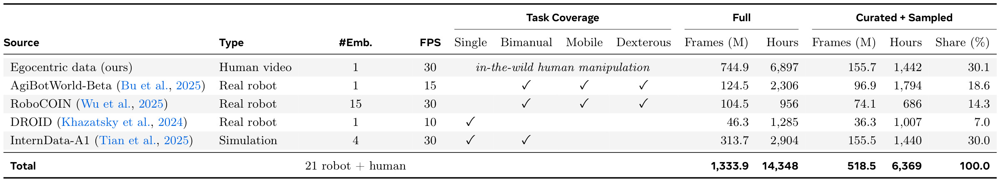

**Original:**

Table 4. **The OpenWAM-$\alpha$ pretraining data.** *#Emb.* counts each source’s distinct embodiments. *Task Coverage* marks the manipulation settings each source spans. *Full* reports each source’s raw size before processing, while *Curated + Sampled* reports the data actually used for training, after cleaning (Section 5.2.2) and per-source whole-episode subsampling (Section 5.2.1); *Share* is each source’s actual per-epoch sample share under proportional sampling.

|  |  |  |  | **Task Coverage** | **Task Coverage** | **Task Coverage** | **Task Coverage** | **Full** | **Full** | **Curated + Sampled** | **Curated + Sampled** | **Curated + Sampled** |
| --- | --- | --- | --- | --- | --- | --- | --- | --- | --- | --- | --- | --- |
| **Source** | **Type** | **#Emb.** | **FPS** | Single | Bimanual | Mobile | Dexterous | Frames (M) | Hours | Frames (M) | Hours | Share (%) |
| Egocentric data (ours) | Human video | 1 | 30 | *in-the-wild human manipulation* | *in-the-wild human manipulation* | *in-the-wild human manipulation* | *in-the-wild human manipulation* | 744.9 | 6,897 | 155.7 | 1,442 | 30.1 |
| AgiBotWorld-Beta  (Bu et al., 2025) | Real robot | 1 | 15 |  | $\checkmark$ | $\checkmark$ | $\checkmark$ | 124.5 | 2,306 | 96.9 | 1,794 | 18.6 |
| RoboCOIN  (Wu et al., 2025) | Real robot | 15 | 30 |  | $\checkmark$ | $\checkmark$ | $\checkmark$ | 104.5 | 956 | 74.1 | 686 | 14.3 |
| DROID  (Khazatsky et al., 2024) | Real robot | 1 | 10 | $\checkmark$ |  |  |  | 46.3 | 1,285 | 36.3 | 1,007 | 7.0 |
| InternData-A1  (Tian et al., 2025) | Simulation | 4 | 30 | $\checkmark$ | $\checkmark$ |  |  | 313.7 | 2,904 | 155.5 | 1,440 | 30.0 |
| **Total** |  | 21 robot + human |  |  |  |  |  | **1,333.9** | **14,348** | **518.5** | **6,369** | **100.0** |

**中文:**

表 4：**OpenWAM-$\alpha$ 的预训练数据。** *#Emb.* 为各来源包含的不同机器人形态数量；*Task Coverage* 标示该来源覆盖的操作类型；*Full* 为处理前的原始数据规模；*Curated + Sampled* 为清洗（第 5.2.2 节）及各来源按完整回合子采样（第 5.2.1 节）后，实际用于训练的数据；*Share* 为按比例采样时，各来源在每轮中的实际样本占比。

|  |  |  |  | **任务覆盖** | **任务覆盖** | **任务覆盖** | **任务覆盖** | **原始数据** | **原始数据** | **清洗与采样后** | **清洗与采样后** | **清洗与采样后** |
| --- | --- | --- | --- | --- | --- | --- | --- | --- | --- | --- | --- | --- |
| **来源** | **类型** | **#Emb.** | **FPS** | 单臂 | 双臂 | 移动操作 | 灵巧操作 | 帧数（M） | 小时 | 帧数（M） | 小时 | 占比（%） |
| 第一视角人类数据（本文） | 人类视频 | 1 | 30 | *自然环境中的人类操作* | *自然环境中的人类操作* | *自然环境中的人类操作* | *自然环境中的人类操作* | 744.9 | 6,897 | 155.7 | 1,442 | 30.1 |
| AgiBotWorld-Beta  (Bu et al., 2025) | 真实机器人 | 1 | 15 |  | $\checkmark$ | $\checkmark$ | $\checkmark$ | 124.5 | 2,306 | 96.9 | 1,794 | 18.6 |
| RoboCOIN  (Wu et al., 2025) | 真实机器人 | 15 | 30 |  | $\checkmark$ | $\checkmark$ | $\checkmark$ | 104.5 | 956 | 74.1 | 686 | 14.3 |
| DROID  (Khazatsky et al., 2024) | 真实机器人 | 1 | 10 | $\checkmark$ |  |  |  | 46.3 | 1,285 | 36.3 | 1,007 | 7.0 |
| InternData-A1  (Tian et al., 2025) | 仿真 | 4 | 30 | $\checkmark$ | $\checkmark$ |  |  | 313.7 | 2,904 | 155.5 | 1,440 | 30.0 |
| **总计** |  | 21 种机器人形态 + 人类 |  |  |  |  |  | **1,333.9** | **14,348** | **518.5** | **6,369** | **100.0** |

**Original:**

Pretraining Data Mixture

**中文:**

预训练数据混合

**Original:**

**Data Composition.** Following the co-training recipe of Section 4.3, the mixture combines three complementary data types. Egocentric human data comes from a dataset we carefully constructed for manipulation-centric world modeling – 71.6K long-form first-person recordings of 0.25–6 minutes each, covering 3,006 everyday manipulation tasks; it supplies broad visual and interaction diversity but carries no robot action labels, so its action and proprioception channels remain fully masked and it supervises only the world stream. Real-world robot data (AgiBotWorld-Beta  (Bu et al., 2025), RoboCOIN  (Wu et al., 2025), and DROID  (Khazatsky et al., 2024)) grounds the action stream with executable trajectories across 17 physical platforms, while also providing the most faithful visual observations of robots interacting with the physical world. Synthetic robot data (InternData-A1  (Tian et al., 2025)) further broadens the coverage of robot data, encompassing a more comprehensive range of single-arm and bimanual manipulation skills under diverse environmental variations.

**中文:**

**数据构成。** 按第 4.3 节的联合训练方案，数据混合包含三类互补来源。第一视角人类数据是我们专为以操作为中心的世界建模整理的数据集：71.6K 段长时第一人称录像，每段 0.25–6 分钟，覆盖 3,006 种日常操作任务。它提供广泛的视觉与交互多样性，但没有机器人动作标签，因此动作和本体状态通道全部屏蔽，只监督世界流。真实机器人数据来自 AgiBotWorld-Beta (Bu et al., 2025)、RoboCOIN (Wu et al., 2025) 和 DROID (Khazatsky et al., 2024)，通过 17 种真实机器人平台上的可执行轨迹训练动作流，同时提供机器人与物理世界交互最真实的视觉观测。合成机器人数据 InternData-A1 (Tian et al., 2025) 进一步拓宽覆盖范围，在多样环境变化下提供更全面的单臂与双臂操作技能。

**Original:**

**Data Budget and Sampling.** Considering the compute resources and time cost of pretraining, each source is subsampled under a per-source hour budget. The budgets are derived from frame-based targets – the egocentric and synthetic sources each contribute 30% of the total training frames, and the remaining 40% is divided among the three real-robot sources in proportion to their curated valid-frame counts – so that sources with different native frame rates are balanced by the quantity of data the model actually consumes. Within each source, the hour budget is water-filled across its constituent sub-datasets, and whole episodes are subsampled from the curated pool under a fixed seed until the budget is met. Training then draws samples proportionally to the actual per-source counts, so every retained sample is visited exactly once per epoch.

**中文:**

**数据预算与采样。** 考虑预训练的算力和时间成本，我们为每个来源设置小时数预算并进行子采样。预算由帧数目标推得：第一视角人类和合成数据各占总训练帧数的 30%；其余 40% 根据三个真实机器人来源清洗后的有效帧数，按比例分配。这样，即使各来源的原始帧率不同，也能按模型实际消耗的数据量取得平衡。每个来源内部，用注水式分配将小时预算分配给各子数据集，再在固定随机种子下，从清洗后的数据池中按完整回合抽样，直到满足预算。训练时按各来源实际样本数量进行比例采样，因此每一轮都恰好访问一次全部保留样本。

**Original:**

Data Curation

**中文:**

数据清洗

**Original:**

Aggregating data across different sources and embodiments introduces heterogeneous defects in both the visual and the signal channel. Our cleaning protocol is informed by the data-cleaning pipeline of Qwen-RobotManip  (Yuan et al., 2026a), supplemented with rules for the failure modes we observe in the collected sources, and operates at two levels: vision-level cleaning shared by all sources, and signal-level cleaning specific to robot data.

**中文:**

跨来源、跨机器人形态汇集数据，会在视觉和信号通道中引入不同缺陷。我们的清洗协议参考 Qwen-RobotManip (Yuan et al., 2026a) 的流程，并针对实际收集数据中出现的失败模式补充规则。清洗分为两个层次：所有来源共有的视觉层面清洗，以及机器人数据特有的信号层面清洗。

**Original:**

**Vision-Level Cleaning.** All sources first pass a uniform visual-quality screen that removes undecodable video, frozen or duplicated frames, black, white, and solid-color frames, over- and under-exposure and exposure flicker, blurred frames, and abrupt visual jumps. Egocentric data further exhibits one failure mode of its own: segments in which the hands leave the field of view carry no manipulation signal and are removed; recordings with empty or invalid language annotations are likewise discarded.

**中文:**

**视觉层面清洗。** 所有来源先经过统一的视觉质量筛查，去除无法解码的视频、画面冻结或重复帧、黑帧、白帧及纯色帧、过曝与欠曝、曝光闪烁、模糊帧和突然的画面跳变。第一视角人类数据还有自身特有的问题：手离开视野的片段不包含操作信号，因此会被删除；语言标注为空或无效的录像也会丢弃。

**Original:**

**Signal-Level Cleaning.** Robot data additionally carries state and action channels, which are cleaned in four steps:

**中文:**

**信号层面清洗。** 机器人数据还含状态和动作通道，进一步经过四步清洗：

**Original:**

**Signal integrity.** An episode is discarded outright when its recorded end-effector state fails to track the commanded actions (amplitude ratio $\geq 3\times$ with per-axis correlation $<0.5$), or when video–signal misalignment affects more than 2% of frames.

**中文:**

**信号完整性。** 如果记录的末端状态无法跟随动作指令，表现为幅度比 $\geq 3\times$ 且逐轴相关系数 $<0.5$，则直接丢弃整个回合；视频与信号不同步的帧超过 2% 时，同样整段丢弃。

**Original:**

**State-first idle detection.** The state channel serves as the primary criterion for idle footage: leading and trailing segments whose state is static – detected with per-robot motion thresholds calibrated from the p99.5 of single-frame deltas, and confirmed when average end-effector translation and geodesic rotation rates fall below 2 cm/s and 5 $^\circ$/s – are trimmed, whereas mid-episode pauses are never cut, since cutting them would splice temporally non-adjacent frames. State discontinuities such as jerk and spike outliers are additionally screened with robust median–MAD thresholds.

**中文:**

**以状态为主的空闲片段检测。** 主要依据状态通道识别空闲画面。先根据各机器人单帧状态差分的 p99.5 标定运动阈值，检测开头和结尾状态静止的片段；再确认末端平均平移速度低于 2 cm/s、测地旋转速率低于 5 $^\circ$/s 后，将这些片段裁掉。回合中间的暂停始终保留，否则会把时间上不相邻的帧直接拼接起来。此外，还使用稳健的“中位数—MAD”阈值，筛查急动和尖峰等状态不连续异常。

**Original:**

**Visual cross-checking.** When the state does move, it is cross-checked against the visuals: apparent state motion under which every camera view remains visually static is attributed to sensor jitter and trimmed as well, whereas a genuinely moving arm observed by a frozen camera marks a capture defect and the episode is removed.

**中文:**

**视觉交叉核对。** 状态显示有运动时，还会与图像相互核验：如果状态看似在动，但所有相机画面均保持静止，则判断为传感器抖动，也进行裁剪；如果机械臂实际运动，而相机画面冻结，则判为采集缺陷，删除整个回合。

**Original:**

**Episode-level deletion.** An episode that loses more than 70% of its frames to the steps above, or whose video is frozen for 90% or more of its length, is dropped entirely.

**中文:**

**按回合删除。** 如果上述步骤删除了某个回合超过 70% 的帧，或者其视频有至少 90% 的时长处于冻结状态，则整段丢弃。

**Original:**

Simulation Benchmark Evaluation

**中文:**

仿真基准评估

**Original:**

Starting from the pretrained OpenWAM-$\alpha$ base model, we conduct supervised fine-tuning and evaluation on the eight simulation benchmarks integrated in OpenWAM-Infra (Section 3.4), spanning five embodiment categories:

**中文:**

从预训练的 OpenWAM-$\alpha$ 基础模型出发，我们在 OpenWAM-Infra 集成的八个仿真基准上进行监督微调和评估，见第 3.4 节。这些基准覆盖五类机器人形态：

**Original:**

**Single-arm**: LIBERO  (Liu et al., 2023), LIBERO-Plus  (Fei et al., 2025), and VLABench  (Zhang et al., 2024);

**中文:**

**单臂**：LIBERO (Liu et al., 2023)、LIBERO-Plus (Fei et al., 2025) 和 VLABench (Zhang et al., 2024)；

**Original:**

**Bimanual**: RoboTwin2.0  (Chen et al., 2025) and RoboDojo  (Chen et al., 2026b);

**中文:**

**双臂**：RoboTwin2.0 (Chen et al., 2025) 和 RoboDojo (Chen et al., 2026b)；

**Original:**

**Mobile single-arm**: RoboCasa365  (Nasiriany et al., 2026);

**中文:**

**移动单臂**：RoboCasa365 (Nasiriany et al., 2026)；

**Original:**

**Mobile bimanual**: EBench  (Gao et al., 2026);

**中文:**

**移动双臂**：EBench (Gao et al., 2026)；

**Original:**

**Dexterous-hand**: RoboCasa-GR1  (NVIDIA et al., 2025; Nasiriany et al., 2024).

**中文:**

**灵巧手**：RoboCasa-GR1 (NVIDIA et al., 2025; Nasiriany et al., 2024)。

**Original:**

For RoboTwin2.0, we evaluate two variants. **RoboTwin2.0-Full** fine-tunes on the mixture of clean and randomized data and then evaluates under both conditions, probing the model’s in-distribution (ID) capability; **RoboTwin2.0-Clean2Random** fine-tunes on clean data only and evaluates under both conditions, probing out-of-distribution (OOD) generalization.

**中文:**

RoboTwin2.0 采用两种评估设置。**RoboTwin2.0-Full** 在 clean 与 randomized 混合数据上微调，再分别于这两种条件下评估，用于考察分布内（ID）能力；**RoboTwin2.0-Clean2Random** 仅用 clean 数据微调，同样在两种条件下评估，用于考察分布外（OOD）泛化。

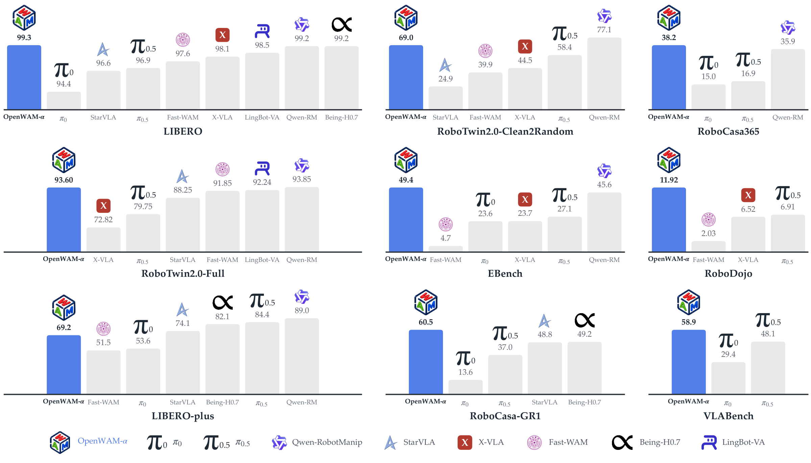

**Original:**

Figure 13. **Score comparison of OpenWAM-$\alpha$ against representative VLA and WAM baselines across the simulation benchmarks.** Within each panel, baselines are ordered by score, and every bar is labeled with its actual value.

**中文:**

图 13：**OpenWAM-$\alpha$ 与代表性 VLA、WAM 基线在各仿真基准上的得分比较。** 每个面板内按得分排列基线，每根柱均标注实际数值。

**Original:**

Figure 13 summarizes the scores of OpenWAM-$\alpha$ alongside representative VLA and WAM baselines on each benchmark, with every bar labeled by its actual score, giving a clear account of where the model stands. Figure 14 complements this view by pitting OpenWAM-$\alpha$ against the strongest VLAs and WAMs on every leaderboard, grouped by embodiment, so that the two paradigms can be compared directly. The detailed per-benchmark training and evaluation configurations, including hyperparameter settings and evaluation details, are provided in Section B.2. The per-benchmark tables behind both figures are reported in Section D. Through these scores, we seek to answer the two questions at the heart of this evaluation: **(1) how does OpenWAM-$\alpha$ perform, and (2) between VLA and WAM, which paradigm prevails?** The following two subsections address them in turn.

**中文:**

图 13 汇总 OpenWAM-$\alpha$ 与代表性 VLA、WAM 基线在各基准上的得分，每根柱都标出实际数值，清楚展示模型所处的位置。图 14 按机器人形态分组，将 OpenWAM-$\alpha$ 与各排行榜中最强的 VLA、WAM 直接比较，以进一步对照两种范式。各基准的详细训练与评估配置，包括超参数和评估细节，见第 B.2 节；两张图对应的完整结果表见第 D 节。通过这些分数，我们希望回答两个核心问题：**(1) OpenWAM-$\alpha$ 的表现如何？(2) VLA 与 WAM，哪种范式更有优势？** 下面两小节依次讨论。

**Original:**

How Does OpenWAM-$\alpha$ Perform?

**中文:**

OpenWAM-$\alpha$ 的表现如何？

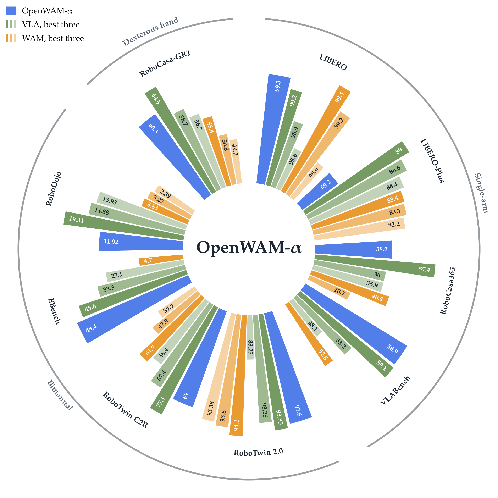

**Original:**

Figure 14. **OpenWAM-$\alpha$ against the best of each family, per benchmark**, grouped by embodiment.

**中文:**

图 14：**OpenWAM-$\alpha$ 与各基准上每类方法最佳模型的比较**，按机器人形态分组。

**Original:**

Across the majority of the benchmarks, OpenWAM-$\alpha$ delivers excellent performance:

**中文:**

在大多数基准上，OpenWAM-$\alpha$ 都表现出色：

**Original:**

On the single-arm benchmarks **LIBERO** and **VLABench**, the bimanual benchmark **RoboTwin2.0-Full**, the mobile single-arm benchmark **RoboCasa365**, and the dexterous-hand benchmark **RoboCasa-GR1**, OpenWAM-$\alpha$ sits firmly in the top tier, within a marginal gap of the best model.

**中文:**

在单臂基准 **LIBERO**、**VLABench**，双臂基准 **RoboTwin2.0-Full**，移动单臂基准 **RoboCasa365**，以及灵巧手基准 **RoboCasa-GR1** 上，OpenWAM-$\alpha$ 均处于第一梯队，与最佳模型仅有很小差距。

**Original:**

On the mobile bimanual benchmark **EBench**, OpenWAM-$\alpha$ sets the state of the art, leading the runner-up Qwen-RobotManip by roughly 4 points in both SR and Score.

**中文:**

在移动双臂基准 **EBench** 上，OpenWAM-$\alpha$ 取得当前最佳结果，SR 和 Score 均领先第二名 Qwen-RobotManip 约 4 分。

**Original:**

On the bimanual benchmarks **RoboTwin2.0-Clean2Random** and **RoboDojo**, a gap to the best models (which are VLAs) remains, yet OpenWAM-$\alpha$ is the strongest WAM on both leaderboards, ahead of the other WAMs by a clear margin.

**中文:**

在双臂基准 **RoboTwin2.0-Clean2Random** 和 **RoboDojo** 上，OpenWAM-$\alpha$ 与最佳模型仍有差距，而最佳模型均为 VLA；不过，它在这两个排行榜上都是最强 WAM，并明显领先其他 WAM。

**Original:**

The unexpected exception is the single-arm benchmark **LIBERO-Plus**, where the scores of OpenWAM-$\alpha$ fall markedly below its standing elsewhere, as shown in Table 5. The per-perturbation breakdown of **LIBERO-Plus** is telling: the losses concentrate under the *camera* and *noise* perturbations, with visible deficits under the *background* and *layout* perturbations as well. On the very same leaderboard, however, ABot-M0.5, ImageWAM, and Being-H0.7 — all WAMs themselves — perform strongly, with scores approaching the state of the art. We therefore compare OpenWAM-$\alpha$ against these models along two axes, pretraining data and architecture, to identify the underlying causes.

**中文:**

一个意外的例外是单臂基准 **LIBERO-Plus**：OpenWAM-$\alpha$ 在这里的表现明显弱于它在其他基准上的相对水平，见表 5。按扰动类型拆分后可以看到，损失主要集中在 *camera*（相机）和 *noise*（噪声）扰动，在 *background*（背景）和 *layout*（布局）扰动下也有明显不足。然而，同榜单上的 ABot-M0.5、ImageWAM 和 Being-H0.7 都属于 WAM，却表现很强，接近当前最佳结果。因此，我们从预训练数据和架构两个方面，将 OpenWAM-$\alpha$ 与这些模型比较，分析原因。

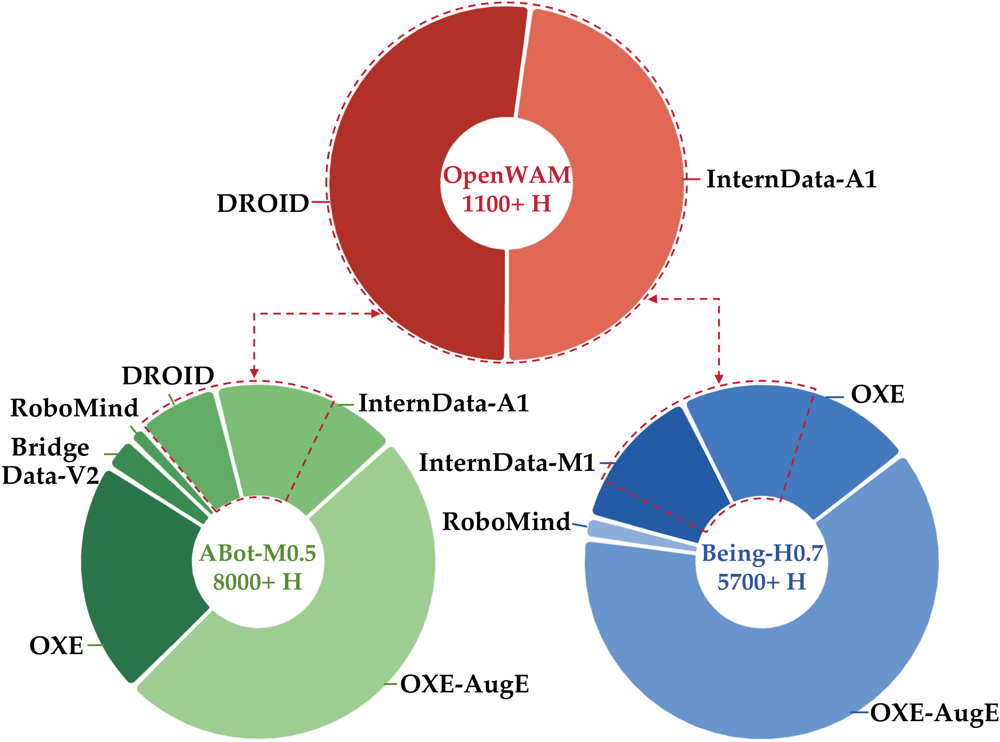

**Original:**

Figure 15. **Single-arm pretraining data of ABot-M0.5, Being-H0.7, and OpenWAM-$\alpha$.** The dashed lines indicate that the single-arm data of OpenWAM-$\alpha$ amounts to only a small fraction of what ABot-M0.5 and Being-H0.7 consume.

**中文:**

图 15：**ABot-M0.5、Being-H0.7 和 OpenWAM-$\alpha$ 的单臂预训练数据。** 虚线表明，OpenWAM-$\alpha$ 使用的单臂数据量，只相当于 ABot-M0.5 和 Being-H0.7 的一小部分。

**Original:**

**The Data Perspective.** Figure 15 contrasts the single-arm portion of the pretraining data of ABot-M0.5 and Being-H0.7 with that of OpenWAM-$\alpha$. Both baselines pretrain on far larger and more varied single-arm collections, spanning diverse embodiments, scenes, and camera viewpoints, so during pretraining they have already seen visual information and world knowledge close to the LIBERO-Plus test scenes — in viewpoint and noise as much as in background and layout. In contrast, the single-arm data of OpenWAM-$\alpha$ (Table 4) is far smaller in both volume and variety, drawing on only two sources: DROID, collected on a fixed single-arm platform with fixed camera viewpoints, and the single-arm portion of the synthetic InternData-A1. With such limited single-arm coverage, the model receives far less single-arm world knowledge, and its single-arm generalization suffers accordingly on the OOD perturbations of LIBERO-Plus. The converse also holds: the OpenWAM-$\alpha$ mixture is rich in egocentric, bimanual, and dexterous-hand data, and the model is correspondingly strong on the bimanual and dexterous-hand benchmarks.

**中文:**

**数据角度。** 图 15 比较 ABot-M0.5、Being-H0.7 与 OpenWAM-$\alpha$ 预训练数据中的单臂部分。前两个基线使用的单臂数据规模更大、类型更多，覆盖不同机器人形态、场景和相机视角。因此，在预训练时，它们已接触过与 LIBERO-Plus 测试场景接近的视觉信息和世界知识，不仅包括背景、布局，也包括视角和噪声条件。相比之下，OpenWAM-$\alpha$ 的单臂数据（表 4）在数量和多样性上都少得多，仅来自两个来源：在固定单臂平台、固定相机视角下采集的 DROID，以及合成数据 InternData-A1 的单臂部分。有限的覆盖使模型获得的单臂世界知识更少，因此在 LIBERO-Plus 的 OOD 扰动下，单臂泛化表现也更差。反过来也成立：OpenWAM-$\alpha$ 的第一视角人类、双臂和灵巧手数据较丰富，因此在双臂和灵巧手基准上表现较强。

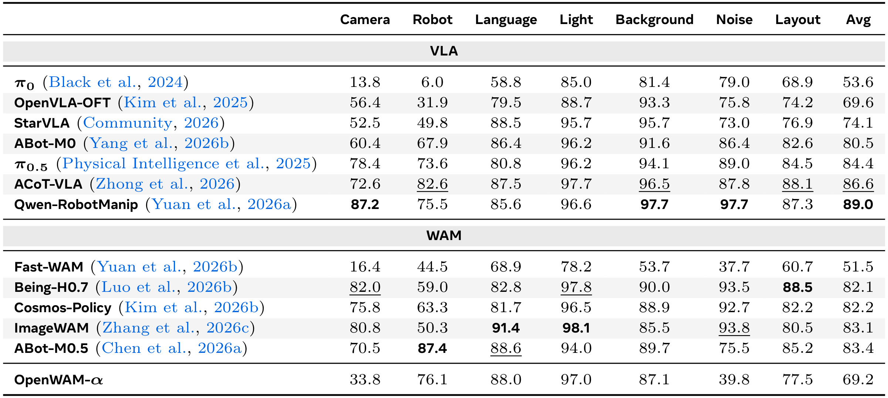

**Original:**

Table 5. **Evaluation Results on LIBERO-Plus.** Bold denotes best values, underline second best.

|  | **Camera** | **Robot** | **Language** | **Light** | **Background** | **Noise** | **Layout** | **Avg** |
| --- | --- | --- | --- | --- | --- | --- | --- | --- |
| ***VLA*** | ***VLA*** | ***VLA*** | ***VLA*** | ***VLA*** | ***VLA*** | ***VLA*** | ***VLA*** | ***VLA*** |
| **$\pi_0$**  (Black et al., 2024) | 13.8 | 6.0 | 58.8 | 85.0 | 81.4 | 79.0 | 68.9 | 53.6 |
| **OpenVLA-OFT**  (Kim et al., 2025) | 56.4 | 31.9 | 79.5 | 88.7 | 93.3 | 75.8 | 74.2 | 69.6 |
| **StarVLA**  (Community, 2026) | 52.5 | 49.8 | 88.5 | 95.7 | 95.7 | 73.0 | 76.9 | 74.1 |
| **ABot-M0**  (Yang et al., 2026b) | 60.4 | 67.9 | 86.4 | 96.2 | 91.6 | 86.4 | 82.6 | 80.5 |
| **$\pi_{0.5}$**  (Physical Intelligence et al., 2025) | 78.4 | 73.6 | 80.8 | 96.2 | 94.1 | 89.0 | 84.5 | 84.4 |
| **ACoT-VLA**  (Zhong et al., 2026) | 72.6 | 82.6 | 87.5 | 97.7 | 96.5 | 87.8 | 88.1 | 86.6 |
| **Qwen-RobotManip**  (Yuan et al., 2026a) | **87.2** | 75.5 | 85.6 | 96.6 | **97.7** | **97.7** | 87.3 | **89.0** |
| ***WAM*** | ***WAM*** | ***WAM*** | ***WAM*** | ***WAM*** | ***WAM*** | ***WAM*** | ***WAM*** | ***WAM*** |
| **Fast-WAM**  (Yuan et al., 2026b) | 16.4 | 44.5 | 68.9 | 78.2 | 53.7 | 37.7 | 60.7 | 51.5 |
| **Being-H0.7**  (Luo et al., 2026b) | 82.0 | 59.0 | 82.8 | 97.8 | 90.0 | 93.5 | **88.5** | 82.1 |
| **Cosmos-Policy**  (Kim et al., 2026b) | 75.8 | 63.3 | 81.7 | 96.5 | 88.9 | 92.7 | 82.2 | 82.2 |
| **ImageWAM**  (Zhang et al., 2026c) | 80.8 | 50.3 | **91.4** | **98.1** | 85.5 | 93.8 | 80.5 | 83.1 |
| **ABot-M0.5**  (Chen et al., 2026a) | 70.5 | **87.4** | 88.6 | 94.0 | 89.7 | 75.5 | 85.2 | 83.4 |
| **OpenWAM-$\alpha$** | 33.8 | 76.1 | 88.0 | 97.0 | 87.1 | 39.8 | 77.5 | 69.2 |

**中文:**

表 5：**LIBERO-Plus 评估结果。** 粗体表示最佳值，下划线表示次佳值。

|  | **相机** | **机器人** | **语言** | **光照** | **背景** | **噪声** | **布局** | **平均** |
| --- | --- | --- | --- | --- | --- | --- | --- | --- |
| ***VLA*** | ***VLA*** | ***VLA*** | ***VLA*** | ***VLA*** | ***VLA*** | ***VLA*** | ***VLA*** | ***VLA*** |
| **$\pi_0$**  (Black et al., 2024) | 13.8 | 6.0 | 58.8 | 85.0 | 81.4 | 79.0 | 68.9 | 53.6 |
| **OpenVLA-OFT**  (Kim et al., 2025) | 56.4 | 31.9 | 79.5 | 88.7 | 93.3 | 75.8 | 74.2 | 69.6 |
| **StarVLA**  (Community, 2026) | 52.5 | 49.8 | 88.5 | 95.7 | 95.7 | 73.0 | 76.9 | 74.1 |
| **ABot-M0**  (Yang et al., 2026b) | 60.4 | 67.9 | 86.4 | 96.2 | 91.6 | 86.4 | 82.6 | 80.5 |
| **$\pi_{0.5}$**  (Physical Intelligence et al., 2025) | 78.4 | 73.6 | 80.8 | 96.2 | 94.1 | 89.0 | 84.5 | 84.4 |
| **ACoT-VLA**  (Zhong et al., 2026) | 72.6 | 82.6 | 87.5 | 97.7 | 96.5 | 87.8 | 88.1 | 86.6 |
| **Qwen-RobotManip**  (Yuan et al., 2026a) | **87.2** | 75.5 | 85.6 | 96.6 | **97.7** | **97.7** | 87.3 | **89.0** |
| ***WAM*** | ***WAM*** | ***WAM*** | ***WAM*** | ***WAM*** | ***WAM*** | ***WAM*** | ***WAM*** | ***WAM*** |
| **Fast-WAM**  (Yuan et al., 2026b) | 16.4 | 44.5 | 68.9 | 78.2 | 53.7 | 37.7 | 60.7 | 51.5 |
| **Being-H0.7**  (Luo et al., 2026b) | 82.0 | 59.0 | 82.8 | 97.8 | 90.0 | 93.5 | **88.5** | 82.1 |
| **Cosmos-Policy**  (Kim et al., 2026b) | 75.8 | 63.3 | 81.7 | 96.5 | 88.9 | 92.7 | 82.2 | 82.2 |
| **ImageWAM**  (Zhang et al., 2026c) | 80.8 | 50.3 | **91.4** | **98.1** | 85.5 | 93.8 | 80.5 | 83.1 |
| **ABot-M0.5**  (Chen et al., 2026a) | 70.5 | **87.4** | 88.6 | 94.0 | 89.7 | 75.5 | 85.2 | 83.4 |
| **OpenWAM-$\alpha$** | 33.8 | 76.1 | 88.0 | 97.0 | 87.1 | 39.8 | 77.5 | 69.2 |

**Original:**

**The Architecture Perspective.** Fast-WAM, ABot-M0.5, and OpenWAM-$\alpha$ share one core prediction target — a pixel-level video of the future over a temporal horizon, with the intermediate latents produced by the reconstructive Wan2.2-VAE. On LIBERO-Plus, all three exhibit the same signature: the scores under the *camera* and *noise* perturbations fall clearly below those under the other perturbations, and only ABot-M0.5, backed by its pretraining data, recovers much of the loss relative to Fast-WAM and OpenWAM-$\alpha$. Pixel-level information is evidently acutely sensitive to camera and noise perturbations — an inherent limitation of pixel-level prediction architectures that only large-scale pretraining can compensate. Two further baselines corroborate this reading. ImageWAM, although not pretrained, remains conspicuously strong on LIBERO-Plus: its prediction target is also a pixel-level latent, but it predicts only a single future frame of the current observation — closer to an edit than a rollout — so no error accumulates across frames and the impact of future-pixel prediction on the camera and noise scores shrinks accordingly. Being-H0.7, in turn, encodes observations with V-JEPA 2.1: its intermediate latents remain temporal (several frames are encoded jointly), yet they are semantic-level features rather than pixel reconstructions, which makes the model markedly more robust to the camera and noise perturbations. Unlike LIBERO-Plus, the OOD designs of the other benchmarks impose no deliberate camera or noise disturbance, so OpenWAM-$\alpha$ remains highly competitive there; on LIBERO-Plus, the camera and noise disturbances compound the single-arm data deficit above, and the performance of OpenWAM-$\alpha$ inevitably degrades.

**中文:**

**架构角度。** Fast-WAM、ABot-M0.5 和 OpenWAM-$\alpha$ 共享一个核心预测目标：预测一定时间范围内的像素级未来视频，中间隐表示由重建式 Wan2.2-VAE 生成。在 LIBERO-Plus 上，三者呈现相同特征：*camera* 和 *noise* 扰动下的得分明显低于其他扰动；只有依靠预训练数据的 ABot-M0.5，相比 Fast-WAM 和 OpenWAM-$\alpha$ 弥补了较大部分损失。像素级信息显然对相机和噪声扰动十分敏感，这是像素级预测架构的固有限制，只有大规模预训练才能补偿。另两个基线进一步支持这一解释。ImageWAM 虽没有预训练，在 LIBERO-Plus 上仍很强：它同样预测像素级隐表示，但只根据当前观测预测一张未来图像，更接近图像编辑而非多步推演，因此不会跨帧累积误差，未来像素预测对相机与噪声成绩的影响也相应减小。Being-H0.7 使用 V-JEPA 2.1 编码观测，中间隐表示仍带时间信息，即多帧联合编码，但表示的是语义级特征而非像素重建，因此对相机和噪声扰动明显更稳健。其他基准的 OOD 设置没有像 LIBERO-Plus 那样刻意扰动相机或加入噪声，所以 OpenWAM-$\alpha$ 在那里仍很有竞争力；而 LIBERO-Plus 的这两类视觉扰动，与前述单臂数据不足叠加，导致 OpenWAM-$\alpha$ 性能下降。

**Original:**

**Takeaway 1:** How well an embodied model generalizes on a benchmark is ultimately determined by whether its pretraining mixture contains data close to the benchmark’s test conditions, in both embodiment and environment. Extending Section 4.3, the decisive ingredient of an embodied foundation model remains large-scale, diverse, scene-rich robot manipulation data, which at once covers the broad range of test scenarios a model may later encounter and supplies precise action / visual information grounded in the embodiment — the most direct route to stronger generalization.

**中文:**

**结论 1：** 具身模型在某个基准上的泛化表现，最终取决于其预训练混合数据在机器人形态和环境两方面，是否包含接近测试条件的数据。延续第 4.3 节的结论，具身基础模型的决定性要素仍是大规模、多样化、场景丰富的机器人操作数据：它既覆盖模型未来可能遇到的广泛测试场景，又提供与机器人形态对应的精确动作和视觉信息，是提升泛化最直接的途径。

**Original:**

**Takeaway 2:** Driven by large-scale data, WAMs that predict the future in a pixel latent space can achieve excellent performance, yet their robustness to visual disturbance is inherently limited. Echoing Section 4.1.2, a representation that is robust to environmental variation, information-rich, and sufficiently compact is still needed to push WAM performance further.

**中文:**

**结论 2：** 在大规模数据支持下，于像素隐空间预测未来的 WAM 可以取得优异表现，但对视觉扰动的稳健性仍受固有限制。与第 4.1.2 节相呼应，要继续提升 WAM，仍需要一种对环境变化稳健、信息丰富且足够紧凑的表示。

**Original:**

VLA versus WAM: Which Paradigm Prevails?

**中文:**

VLA 与 WAM：哪种范式更有优势？

**Original:**

Across all benchmarks (Figure 14), the VLA and WAM groups show no substantial gap in overall success rate, and each side places standout models at the top of leaderboards: ABot-M0.5 and OpenWAM-$\alpha$ among WAMs, Xiaomi-Robotics-1 and Qwen-RobotManip among VLAs. Since these models differ in pretraining data, architecture, and training configuration alike, neither paradigm can be declared superior outright. The fine-grained scores, however, reveal a consistent pattern: each paradigm holds an advantage region of its own (Figure 16).

**中文:**

综合全部基准（图 14），VLA 和 WAM 两类方法在整体成功率上没有明显差距，各自都有位居榜首的突出模型：WAM 包括 ABot-M0.5、OpenWAM-$\alpha$，VLA 包括 Xiaomi-Robotics-1、Qwen-RobotManip。这些模型的预训练数据、架构和训练配置都不同，因此不能直接宣布哪种范式更优。但细分结果呈现出一致规律：两种范式各有优势区域，见图 16。

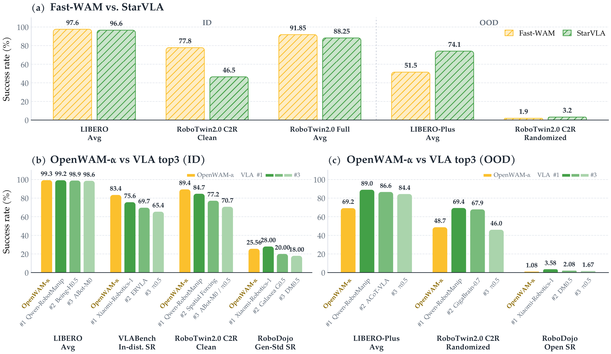

**Original:**

Figure 16. **ID and OOD comparisons between the two paradigms.** (a) Fast-WAM versus StarVLA, two models without embodied pretraining, on ID and OOD splits. (b) OpenWAM-$\alpha$ versus the three strongest VLAs on ID splits. (c) OpenWAM-$\alpha$ versus the three strongest VLAs on OOD splits.

**中文:**

图 16：**两种范式在 ID 和 OOD 上的比较。** (a) 没有具身预训练的 Fast-WAM 与 StarVLA，在分布内和分布外划分上的比较。(b) OpenWAM-$\alpha$ 与三个最强 VLA 在 ID 划分上的比较。(c) OpenWAM-$\alpha$ 与三个最强 VLA 在 OOD 划分上的比较。

**Original:**

**In Distribution, WAMs Fit Better.** The cleanest comparison is between StarVLA and Fast-WAM, two models without embodied pretraining (Figure 16a): on LIBERO, the Clean split of RoboTwin2.0-Clean2Random, and RoboTwin2.0-Full, the WAM attains visibly higher scores on these ID tasks, fitting the training distribution more effectively than its VLA counterpart. The pretrained models tell the same story from both directions (Figure 16b): OpenWAM-$\alpha$ leads the three strongest VLAs on LIBERO, the In-dist. split of VLABench, and the Clean split of RoboTwin2.0-Clean2Random, and stays within a small gap of the best on the Gen-Std split of RoboDojo — even though the pretraining data of these VLAs exceeds ours. This advantage traces back to the video-latent supervision in WAM training: whereas a VLA is optimized purely against action supervision, with no intermediate latent target, the video-latent term injects an additional source of information into parameter optimization, allowing a WAM to fit the training data more closely.

**中文:**

**分布内，WAM 拟合更好。** 最容易排除干扰的比较，是两个没有具身预训练的模型 StarVLA 和 Fast-WAM（图 16a）：在 LIBERO、RoboTwin2.0-Clean2Random 的 Clean 划分，以及 RoboTwin2.0-Full 这些 ID 任务上，WAM 得分明显更高，对训练分布的拟合优于对应 VLA。预训练模型的比较也支持同一结论（图 16b）：OpenWAM-$\alpha$ 在 LIBERO、VLABench 的 In-dist. 划分，以及 RoboTwin2.0-Clean2Random 的 Clean 划分上领先三个最强 VLA；在 RoboDojo 的 Gen-Std 划分上，与最佳结果的差距也很小，尽管这些 VLA 的预训练数据多于我们。该优势来自 WAM 训练中的视频隐表示监督：VLA 只依据动作监督优化，没有中间隐表示目标；WAM 的视频隐表示项则为参数优化额外注入信息，使模型更充分地拟合训练数据。

**Original:**

**Out of Distribution, VLAs Generalize Better.** The same StarVLA–Fast-WAM comparison reverses out of distribution (Figure 16a): on LIBERO-Plus the VLA leads by a wide margin, and even on the Randomized split of RoboTwin2.0-Clean2Random, where both models collapse, the ordering still favors the VLA. The pretrained models mirror the reversal (Figure 16c): on LIBERO-Plus, the Randomized split of RoboTwin2.0-Clean2Random, and the Open split of RoboDojo, OpenWAM-$\alpha$ trails the state-of-the-art VLAs by an evident margin. The mechanism is the flip side of the ID advantage: long-horizon future prediction adds a supervision signal that helps fitting, but under distribution shift the same long horizon means heavier error accumulation — a burden the action-only VLA never carries — so WAMs perform visibly below VLAs in unseen evaluation environments.

**中文:**

**分布外，VLA 泛化更好。** 同样的 StarVLA–Fast-WAM 比较，在 OOD 上出现反转（图 16a）：LIBERO-Plus 上 VLA 大幅领先；即使在两者都明显失效的 RoboTwin2.0-Clean2Random Randomized 划分上，VLA 仍更好。预训练模型同样如此（图 16c）：在 LIBERO-Plus、RoboTwin2.0-Clean2Random 的 Randomized 划分，以及 RoboDojo 的 Open 划分上，OpenWAM-$\alpha$ 明显落后于最先进的 VLA。其机制正是 ID 优势的另一面：长时域未来预测提供额外监督，有助于拟合；但分布变化时，较长预测范围也意味着更严重的误差累积，而只预测动作的 VLA 不承担这项负担，因此在未见评估环境中，WAM 明显弱于 VLA。

**Original:**

Crucially, both deficits are remediable by data. Whether it is the ID fitting deficit of VLAs or the OOD generalization deficit of WAMs, sufficiently rich pretraining data — covering complex environmental variation and carrying precise action annotation — lets either paradigm draw on the inherited priors to achieve both strong fitting and strong generalization at test time. Data therefore remains the first priority of model development. At the same time, VLAs and WAMs are both end-to-end models built on the same core information flow, from observation to action; how to combine the complementary strengths of the two paradigms, and thereby push the capability boundary of end-to-end models further, remains a question well worth pursuing.

**中文:**

关键在于，这两类不足都可以通过数据弥补。无论 VLA 的 ID 拟合不足，还是 WAM 的 OOD 泛化不足，只要预训练数据足够丰富，覆盖复杂环境变化并带有精确动作标注，两种范式都能利用预训练形成的先验，在测试时同时获得较强拟合与泛化能力。因此，数据仍是模型开发的首要因素。同时，VLA 与 WAM 都是端到端模型，共享从观测到动作这一核心信息流。如何结合两种范式的互补优势，继续拓展端到端模型的能力边界，仍值得深入研究。

**Original:**

**Takeaway 3:** Neither paradigm prevails outright: video-latent supervision gives WAMs the edge in in-distribution fitting, while VLAs generalize better out of distribution — and either deficit can be compensated by sufficiently large and diverse pretraining data. Combining the complementary strengths of the two end-to-end paradigms is a promising route to push the capability boundary further.

**中文:**

**结论 3：** 两种范式都没有全面胜出。视频隐表示监督使 WAM 在分布内拟合上占优，VLA 则在分布外泛化上更强；两者的不足都可以由规模足够大、足够多样的预训练数据补偿。结合两种端到端范式的互补优势，是进一步扩展能力边界的有前景方向。

**Original:**

Real-Robot Evaluation

**中文:**

真实机器人评估

**Original:**

To further examine OpenWAM-$\alpha$ beyond simulation and validate both its general capability and its generalization, we conduct comprehensive real-robot evaluations across three embodiments — single-arm, bimanual, and dexterous-hand — with the experimental setups shown in Figure 17. Specifically:

**中文:**

为将评估从仿真扩展到真实环境，同时验证 OpenWAM-$\alpha$ 的通用能力与泛化能力，我们在单臂、双臂和灵巧手三类机器人形态上开展全面评估，实验配置见图 17。具体如下：

**Original:**

**Single-arm experiments** are conducted on the Franka-Research-3 platform and cover three task families — stacking, pick-and-place, and hanging — probing the model’s basic and fine-grained manipulation capabilities. Performance is measured by task success rate (SR).

**中文:**

**单臂实验**采用 Franka-Research-3 平台，覆盖堆叠、抓放和悬挂三类任务，考察基本操作与精细操作能力。指标为任务成功率（SR）。

**Original:**

**Bimanual experiments** are conducted on the official RoboDojo real-robot platform, spanning three embodiments (ARX X5, Piper, and Piper X); following the RoboDojo task taxonomy, the evaluation covers generalization, precision, long-horizon, memory, and open tasks, assessing the model comprehensively. Performance is measured by SR and Progress Score.

**中文:**

**双臂实验**采用 RoboDojo 官方真实机器人平台，覆盖 ARX X5、Piper 和 Piper X 三种形态。按照 RoboDojo 的任务分类，评估包含泛化、精度、长时域、记忆和开放任务，对模型进行全面考察。指标为 SR 和 Progress Score（进度得分）。

**Original:**

**Dexterous-hand experiments** are conducted on a platform pairing the Wuji dexterous hand with the Tianji robotic arm — an embodiment and action space absent from the OpenWAM-$\alpha$ pretraining mixture — and cover bimanual-interactive, long-horizon, and fine manipulation tasks, probing how well the model adapts and generalizes to unseen embodiments and unseen action dimensions. Performance is measured by SR and Progress Score.

**中文:**

**灵巧手实验**使用 Wuji 灵巧手与 Tianji 机械臂组成的平台。该机器人形态及其动作空间都未出现在 OpenWAM-$\alpha$ 的预训练混合数据中。实验覆盖双臂交互、长时域和精细操作任务，考察模型对未见机器人形态及未见动作维度的适应和泛化。指标为 SR 和 Progress Score。

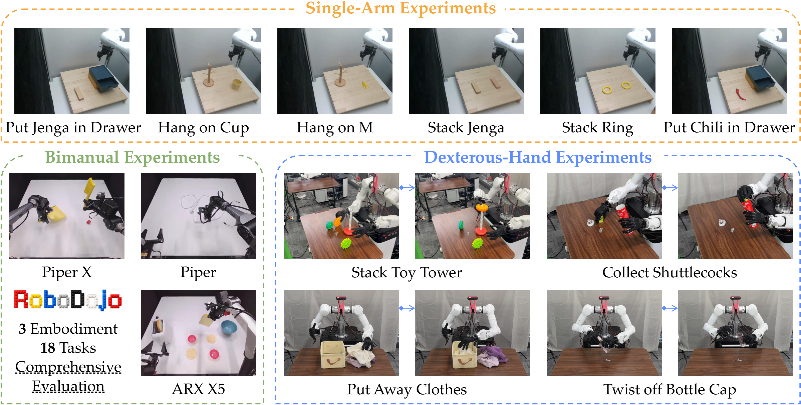

**Original:**

Figure 17. **Real-robot experimental setups across three embodiments.** *Top*: the six single-arm tasks on the Franka-Research-3 platform. *Bottom left*: the three bimanual embodiments of the RoboDojo real-world track (Piper X, Piper, and ARX X5), covering 18 tasks in total. *Bottom right*: the four dexterous-hand tasks on the Wuji-hand and Tianji-arm platform, each illustrated by key intermediate stages of its execution.

**中文:**

图 17：**三类机器人形态的真实实验配置。** 上方：Franka-Research-3 的六项单臂任务。左下：RoboDojo 真实环境赛道的 Piper X、Piper、ARX X5 三种双臂形态，共 18 项任务。右下：Wuji 灵巧手与 Tianji 机械臂平台的四项任务，以每项任务执行中的关键中间阶段展示。

**Original:**

The task setups and evaluation protocols of each embodiment are documented in Section C, and the SFT configurations used for these experiments are provided in Section B.2.

**中文:**

各形态的任务设置与评估协议见第 C 节，相应的监督微调（SFT）配置见第 B.2 节。

**Original:**

Table 6, Table 7, and Table 8 report the detailed scores of the single-arm, RoboDojo bimanual, and dexterous-hand experiments, respectively.

**中文:**

表 6、表 7 和表 8 分别报告单臂、RoboDojo 双臂和灵巧手实验的详细结果。

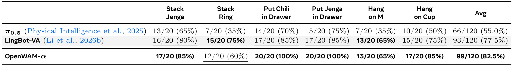

**Original:**

Table 6. **Evaluation Results on Single-Arm Real-Robot Tasks.** Bold denotes best values, underline second best.

|  | **Stack Jenga** | **Stack Ring** | **Put Chili in Drawer** | **Put Jenga in Drawer** | **Hang on M** | **Hang on Cup** | **Avg** |
| --- | --- | --- | --- | --- | --- | --- | --- |
| **$\pi_{0.5}$**  (Physical Intelligence et al., 2025) | 13/20 (65%) | 7/20 (35%) | 14/20 (70%) | 15/20 (75%) | 7/20 (35%) | 10/20 (50%) | 66/120 (55.0%) |
| **LingBot-VA**  (Li et al., 2026b) | 16/20 (80%) | **15/20 (75%)** | 17/20 (85%) | 17/20 (85%) | **13/20 (65%)** | 15/20 (75%) | 93/120 (77.5%) |
| **OpenWAM-$\alpha$** | **17/20 (85%)** | 12/20 (60%) | **20/20 (100%)** | **20/20 (100%)** | **13/20 (65%)** | **17/20 (85%)** | **99/120 (82.5%)** |

**中文:**

表 6：**真实机器人单臂任务评估结果。** 粗体表示最佳值，下划线表示次佳值。

|  | **堆叠 Jenga 积木** | **堆叠圆环** | **将辣椒放入抽屉** | **将 Jenga 积木放入抽屉** | **悬挂 M 形物体** | **悬挂杯子** | **平均** |
| --- | --- | --- | --- | --- | --- | --- | --- |
| **$\pi_{0.5}$**  (Physical Intelligence et al., 2025) | 13/20 (65%) | 7/20 (35%) | 14/20 (70%) | 15/20 (75%) | 7/20 (35%) | 10/20 (50%) | 66/120 (55.0%) |
| **LingBot-VA**  (Li et al., 2026b) | 16/20 (80%) | **15/20 (75%)** | 17/20 (85%) | 17/20 (85%) | **13/20 (65%)** | 15/20 (75%) | 93/120 (77.5%) |
| **OpenWAM-$\alpha$** | **17/20 (85%)** | 12/20 (60%) | **20/20 (100%)** | **20/20 (100%)** | **13/20 (65%)** | **17/20 (85%)** | **99/120 (82.5%)** |

**Original:**

On the single-arm platform (Table 6), OpenWAM-$\alpha$ clearly leads both LingBot-VA, a representative WAM, and $\pi_{0.5}$, a representative VLA, on the majority of tasks, and attains the best average success rate, providing initial evidence of its general and fine-grained manipulation capabilities. We then turn to RoboDojo-Real (Table 7), a real-robot benchmark that comprehensively evaluates generalist manipulation policies across three bimanual embodiments and a wide range of task dimensions. OpenWAM-$\alpha$ tops the leaderboard: it remains consistently strong across the embodiments and their tasks, and reaches the state of the art on the great majority of them, corroborating the generality and robustness of the model in the real world.

**中文:**

在单臂平台上（表 6），OpenWAM-$\alpha$ 在大多数任务中明显领先代表性 WAM LingBot-VA 和代表性 VLA $\pi_{0.5}$，并取得最高平均成功率，为其通用及精细操作能力提供初步证据。随后，我们考察 RoboDojo-Real（表 7），该真实机器人基准横跨三种双臂形态和广泛任务维度，全面评估通用操作策略。OpenWAM-$\alpha$ 位居榜首：不同形态及其任务上均保持较强表现，绝大多数任务达到当前最佳水平，进一步支持模型在真实环境中的通用性与稳健性。

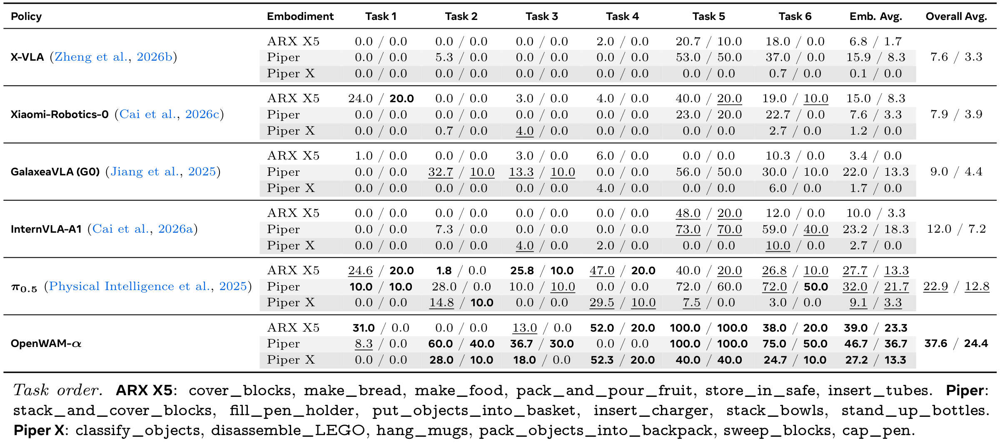

**Original:**

Table 7. **Evaluation Results on the Bimanual RoboDojo Real-World Track.** Each cell reports Score / SR (%). Bold denotes best values, underline second best. Rows are shaded by embodiment.

| **Policy** | **Embodiment** | **Task 1** | **Task 2** | **Task 3** | **Task 4** | **Task 5** | **Task 6** | **Emb. Avg.** | **Overall Avg.** |
| --- | --- | --- | --- | --- | --- | --- | --- | --- | --- |
|  | ARX X5 | 0.0 / 0.0 | 0.0 / 0.0 | 0.0 / 0.0 | 2.0 / 0.0 | 20.7 / 10.0 | 18.0 / 0.0 | 6.8 / 1.7 |  |
|  | Piper | 0.0 / 0.0 | 5.3 / 0.0 | 0.0 / 0.0 | 0.0 / 0.0 | 53.0 / 50.0 | 37.0 / 0.0 | 15.9 / 8.3 |  |
| **X-VLA**  (Zheng et al., 2026b) | Piper X | 0.0 / 0.0 | 0.0 / 0.0 | 0.0 / 0.0 | 0.0 / 0.0 | 0.0 / 0.0 | 0.7 / 0.0 | 0.1 / 0.0 | 7.6 / 3.3 |
|  | ARX X5 | 24.0 / **20.0** | 0.0 / 0.0 | 3.0 / 0.0 | 4.0 / 0.0 | 40.0 / 20.0 | 19.0 / 10.0 | 15.0 / 8.3 |  |
|  | Piper | 0.0 / 0.0 | 0.0 / 0.0 | 0.0 / 0.0 | 0.0 / 0.0 | 23.0 / 20.0 | 22.7 / 0.0 | 7.6 / 3.3 |  |
| **Xiaomi-Robotics-0**  (Cai et al., 2026c) | Piper X | 0.0 / 0.0 | 0.7 / 0.0 | 4.0 / 0.0 | 0.0 / 0.0 | 0.0 / 0.0 | 2.7 / 0.0 | 1.2 / 0.0 | 7.9 / 3.9 |
|  | ARX X5 | 1.0 / 0.0 | 0.0 / 0.0 | 3.0 / 0.0 | 6.0 / 0.0 | 0.0 / 0.0 | 10.3 / 0.0 | 3.4 / 0.0 |  |
|  | Piper | 0.0 / 0.0 | 32.7 / 10.0 | 13.3 / 10.0 | 0.0 / 0.0 | 56.0 / 50.0 | 30.0 / 10.0 | 22.0 / 13.3 |  |
| **GalaxeaVLA (G0)**  (Jiang et al., 2025) | Piper X | 0.0 / 0.0 | 0.0 / 0.0 | 0.0 / 0.0 | 4.0 / 0.0 | 0.0 / 0.0 | 6.0 / 0.0 | 1.7 / 0.0 | 9.0 / 4.4 |
|  | ARX X5 | 0.0 / 0.0 | 0.0 / 0.0 | 0.0 / 0.0 | 0.0 / 0.0 | 48.0 / 20.0 | 12.0 / 0.0 | 10.0 / 3.3 |  |
|  | Piper | 0.0 / 0.0 | 7.3 / 0.0 | 0.0 / 0.0 | 0.0 / 0.0 | 73.0 / 70.0 | 59.0 / 40.0 | 23.2 / 18.3 |  |
| **InternVLA-A1**  (Cai et al., 2026a) | Piper X | 0.0 / 0.0 | 0.0 / 0.0 | 4.0 / 0.0 | 2.0 / 0.0 | 0.0 / 0.0 | 10.0 / 0.0 | 2.7 / 0.0 | 12.0 / 7.2 |
|  | ARX X5 | 24.6 / **20.0** | **1.8** / 0.0 | **25.8** / **10.0** | 47.0 / **20.0** | 40.0 / 20.0 | 26.8 / 10.0 | 27.7 / 13.3 |  |
|  | Piper | **10.0** / **10.0** | 28.0 / 0.0 | 10.0 / 10.0 | 0.0 / 0.0 | 72.0 / 60.0 | 72.0 / **50.0** | 32.0 / 21.7 |  |
| **$\pi_{0.5}$**  (Physical Intelligence et al., 2025) | Piper X | 0.0 / 0.0 | 14.8 / **10.0** | 0.0 / 0.0 | 29.5 / 10.0 | 7.5 / 0.0 | 3.0 / 0.0 | 9.1 / 3.3 | 22.9 / 12.8 |
|  | ARX X5 | **31.0** / 0.0 | 0.0 / 0.0 | 13.0 / 0.0 | **52.0** / **20.0** | **100.0** / **100.0** | **38.0** / **20.0** | **39.0** / **23.3** |  |
|  | Piper | 8.3 / 0.0 | **60.0** / **40.0** | **36.7** / **30.0** | 0.0 / 0.0 | **100.0** / **100.0** | **75.0** / **50.0** | **46.7** / **36.7** |  |
| **OpenWAM-$\alpha$** | Piper X | 0.0 / 0.0 | **28.0** / **10.0** | **18.0** / 0.0 | **52.3** / **20.0** | **40.0** / **40.0** | **24.7** / **10.0** | **27.2** / **13.3** | **37.6** / **24.4** |

**中文:**

表 7：**RoboDojo 真实环境双臂赛道评估结果。** 每格报告 Score / SR（%）。粗体表示最佳值，下划线表示次佳值；不同机器人形态的行使用不同底色。

| **策略** | **机器人形态** | **任务 1** | **任务 2** | **任务 3** | **任务 4** | **任务 5** | **任务 6** | **该形态平均** | **总体平均** |
| --- | --- | --- | --- | --- | --- | --- | --- | --- | --- |
|  | ARX X5 | 0.0 / 0.0 | 0.0 / 0.0 | 0.0 / 0.0 | 2.0 / 0.0 | 20.7 / 10.0 | 18.0 / 0.0 | 6.8 / 1.7 |  |
|  | Piper | 0.0 / 0.0 | 5.3 / 0.0 | 0.0 / 0.0 | 0.0 / 0.0 | 53.0 / 50.0 | 37.0 / 0.0 | 15.9 / 8.3 |  |
| **X-VLA**  (Zheng et al., 2026b) | Piper X | 0.0 / 0.0 | 0.0 / 0.0 | 0.0 / 0.0 | 0.0 / 0.0 | 0.0 / 0.0 | 0.7 / 0.0 | 0.1 / 0.0 | 7.6 / 3.3 |
|  | ARX X5 | 24.0 / **20.0** | 0.0 / 0.0 | 3.0 / 0.0 | 4.0 / 0.0 | 40.0 / 20.0 | 19.0 / 10.0 | 15.0 / 8.3 |  |
|  | Piper | 0.0 / 0.0 | 0.0 / 0.0 | 0.0 / 0.0 | 0.0 / 0.0 | 23.0 / 20.0 | 22.7 / 0.0 | 7.6 / 3.3 |  |
| **Xiaomi-Robotics-0**  (Cai et al., 2026c) | Piper X | 0.0 / 0.0 | 0.7 / 0.0 | 4.0 / 0.0 | 0.0 / 0.0 | 0.0 / 0.0 | 2.7 / 0.0 | 1.2 / 0.0 | 7.9 / 3.9 |
|  | ARX X5 | 1.0 / 0.0 | 0.0 / 0.0 | 3.0 / 0.0 | 6.0 / 0.0 | 0.0 / 0.0 | 10.3 / 0.0 | 3.4 / 0.0 |  |
|  | Piper | 0.0 / 0.0 | 32.7 / 10.0 | 13.3 / 10.0 | 0.0 / 0.0 | 56.0 / 50.0 | 30.0 / 10.0 | 22.0 / 13.3 |  |
| **GalaxeaVLA (G0)**  (Jiang et al., 2025) | Piper X | 0.0 / 0.0 | 0.0 / 0.0 | 0.0 / 0.0 | 4.0 / 0.0 | 0.0 / 0.0 | 6.0 / 0.0 | 1.7 / 0.0 | 9.0 / 4.4 |
|  | ARX X5 | 0.0 / 0.0 | 0.0 / 0.0 | 0.0 / 0.0 | 0.0 / 0.0 | 48.0 / 20.0 | 12.0 / 0.0 | 10.0 / 3.3 |  |
|  | Piper | 0.0 / 0.0 | 7.3 / 0.0 | 0.0 / 0.0 | 0.0 / 0.0 | 73.0 / 70.0 | 59.0 / 40.0 | 23.2 / 18.3 |  |
| **InternVLA-A1**  (Cai et al., 2026a) | Piper X | 0.0 / 0.0 | 0.0 / 0.0 | 4.0 / 0.0 | 2.0 / 0.0 | 0.0 / 0.0 | 10.0 / 0.0 | 2.7 / 0.0 | 12.0 / 7.2 |
|  | ARX X5 | 24.6 / **20.0** | **1.8** / 0.0 | **25.8** / **10.0** | 47.0 / **20.0** | 40.0 / 20.0 | 26.8 / 10.0 | 27.7 / 13.3 |  |
|  | Piper | **10.0** / **10.0** | 28.0 / 0.0 | 10.0 / 10.0 | 0.0 / 0.0 | 72.0 / 60.0 | 72.0 / **50.0** | 32.0 / 21.7 |  |
| **$\pi_{0.5}$**  (Physical Intelligence et al., 2025) | Piper X | 0.0 / 0.0 | 14.8 / **10.0** | 0.0 / 0.0 | 29.5 / 10.0 | 7.5 / 0.0 | 3.0 / 0.0 | 9.1 / 3.3 | 22.9 / 12.8 |
|  | ARX X5 | **31.0** / 0.0 | 0.0 / 0.0 | 13.0 / 0.0 | **52.0** / **20.0** | **100.0** / **100.0** | **38.0** / **20.0** | **39.0** / **23.3** |  |
|  | Piper | 8.3 / 0.0 | **60.0** / **40.0** | **36.7** / **30.0** | 0.0 / 0.0 | **100.0** / **100.0** | **75.0** / **50.0** | **46.7** / **36.7** |  |
| **OpenWAM-$\alpha$** | Piper X | 0.0 / 0.0 | **28.0** / **10.0** | **18.0** / 0.0 | **52.3** / **20.0** | **40.0** / **40.0** | **24.7** / **10.0** | **27.2** / **13.3** | **37.6** / **24.4** |

**Original:**

*Task order.* **ARX X5**: `cover_blocks`, `make_bread`, `make_food`, `pack_and_pour_fruit`, `store_in_safe`, `insert_tubes`. **Piper**: `stack_and_cover_blocks`, `fill_pen_holder`, `put_objects_into_basket`, `insert_charger`, `stack_bowls`, `stand_up_bottles`. **Piper X**: `classify_objects`, `disassemble_LEGO`, `hang_mugs`, `pack_objects_into_backpack`, `sweep_blocks`, `cap_pen`.

**中文:**

*任务顺序。* **ARX X5**：`cover_blocks`、`make_bread`、`make_food`、`pack_and_pour_fruit`、`store_in_safe`、`insert_tubes`。**Piper**：`stack_and_cover_blocks`、`fill_pen_holder`、`put_objects_into_basket`、`insert_charger`、`stack_bowls`、`stand_up_bottles`。**Piper X**：`classify_objects`、`disassemble_LEGO`、`hang_mugs`、`pack_objects_into_backpack`、`sweep_blocks`、`cap_pen`。

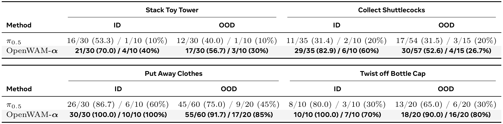

**Original:**

Table 8. **Evaluation Results on Dexterous-Hand Real-Robot Tasks.** Each cell reports Score / SR (%); the OOD column aggregates all variation settings of its task. Bold denotes best values.

|  | **Stack Toy Tower** | **Stack Toy Tower** | **Collect Shuttlecocks** | **Collect Shuttlecocks** |
| --- | --- | --- | --- | --- |
| **Method** | **ID** | **OOD** | **ID** | **OOD** |
| $\pi_{0.5}$ | 16/30 (53.3) / 1/10 (10%) | 12/30 (40.0) / 1/10 (10%) | 11/35 (31.4) / 2/10 (20%) | 17/54 (31.5) / 3/15 (20%) |
| OpenWAM-$\alpha$ | **21/30 (70.0) / 4/10 (40%)** | **17/30 (56.7) / 3/10 (30%)** | **29/35 (82.9) / 6/10 (60%)** | **30/57 (52.6) / 4/15 (26.7%)** |

|  | **Put Away Clothes** | **Put Away Clothes** | **Twist off Bottle Cap** | **Twist off Bottle Cap** |
| --- | --- | --- | --- | --- |
| **Method** | **ID** | **OOD** | **ID** | **OOD** |
| $\pi_{0.5}$ | 26/30 (86.7) / 6/10 (60%) | 45/60 (75.0) / 9/20 (45%) | 8/10 (80.0) / 3/10 (30%) | 13/20 (65.0) / 6/20 (30%) |
| OpenWAM-$\alpha$ | **30/30 (100.0) / 10/10 (100%)** | **55/60 (91.7) / 17/20 (85%)** | **10/10 (100.0) / 7/10 (70%)** | **18/20 (90.0) / 16/20 (80%)** |

**中文:**

表 8：**真实机器人灵巧手任务评估结果。** 每格报告 Score / SR（%）；OOD 列汇总该任务全部变化设置。粗体表示最佳值。

|  | **堆叠玩具塔** | **堆叠玩具塔** | **收集羽毛球** | **收集羽毛球** |
| --- | --- | --- | --- | --- |
| **方法** | **ID** | **OOD** | **ID** | **OOD** |
| $\pi_{0.5}$ | 16/30 (53.3) / 1/10 (10%) | 12/30 (40.0) / 1/10 (10%) | 11/35 (31.4) / 2/10 (20%) | 17/54 (31.5) / 3/15 (20%) |
| OpenWAM-$\alpha$ | **21/30 (70.0) / 4/10 (40%)** | **17/30 (56.7) / 3/10 (30%)** | **29/35 (82.9) / 6/10 (60%)** | **30/57 (52.6) / 4/15 (26.7%)** |

|  | **收纳衣物** | **收纳衣物** | **拧下瓶盖** | **拧下瓶盖** |
| --- | --- | --- | --- | --- |
| **方法** | **ID** | **OOD** | **ID** | **OOD** |
| $\pi_{0.5}$ | 26/30 (86.7) / 6/10 (60%) | 45/60 (75.0) / 9/20 (45%) | 8/10 (80.0) / 3/10 (30%) | 13/20 (65.0) / 6/20 (30%) |
| OpenWAM-$\alpha$ | **30/30 (100.0) / 10/10 (100%)** | **55/60 (91.7) / 17/20 (85%)** | **10/10 (100.0) / 7/10 (70%)** | **18/20 (90.0) / 16/20 (80%)** |

**Original:**

To further probe the extensibility and generalization of OpenWAM-$\alpha$, we fine-tune the pretrained model on four dexterous manipulation tasks built on the Wuji-hand and Tianji-arm platform and test it under both in-domain and out-of-domain setups (Table 8). Neither the platform nor its action space — a 9-D end-effector pose combined with 21 dexterous-hand degrees of freedom — ever appears in the OpenWAM-$\alpha$ pretraining mixture; nevertheless, OpenWAM-$\alpha$ outperforms $\pi_{0.5}$ by a clear margin across all tasks and setups, demonstrating that the model adapts reliably and stably to an entirely unseen embodiment.

**中文:**

为进一步考察 OpenWAM-$\alpha$ 的可扩展性与泛化，我们在 Wuji 灵巧手和 Tianji 机械臂平台的四项灵巧操作任务上微调预训练模型，并分别测试域内和域外设置，见表 8。该平台及其动作空间——9 维末端位姿加上 21 个灵巧手自由度——都从未出现在 OpenWAM-$\alpha$ 的预训练数据中。尽管如此，OpenWAM-$\alpha$ 在所有任务和设置上仍明显优于 $\pi_{0.5}$，说明模型能够可靠、稳定地适应完全未见的机器人形态。

**Original:**

Together, these experiments assess OpenWAM-$\alpha$ across three embodiment types and a broad spectrum of real-world manipulation tasks. The results show that OpenWAM-$\alpha$ performs strongly in every setting and stands on par with today’s leading models, indicating that it can serve as a strong baseline for further development and comparison by the community.

**中文:**

这些实验在三类机器人形态和广泛的真实操作任务中评估 OpenWAM-$\alpha$。结果显示，OpenWAM-$\alpha$ 在各设置中表现较强，与当前领先模型处于同一水平，可作为社区进一步开发和比较的强基线。

## 结论

**Original:**

Conclusions

**中文:**

结论

**Original:**

This work introduced **OpenWAM**, an open research stack that turns world–action modeling from a set of tightly coupled implementation choices into a controlled experimental program. **OpenWAM-Infra** factorizes the WAM design space into composable modules assembled into three architecture families, served by a single trainer, policy server, and evaluation protocol spanning eight simulation benchmarks and real robots. On this substrate, **OpenWAM-Study** examined what world knowledge a WAM should inherit, how world and action learning create synergy, and how that synergy consolidates across domains, distilling the answers into a concrete recipe. **OpenWAM-$\alpha$** then instantiated this recipe at scale on egocentric human and robot data through a unified action space, delivering consistently strong results across the simulation benchmarks and real-robot experiments on single-arm, bimanual, and dexterous-hand platforms.

**中文:**

本文提出 **OpenWAM**，一个开放研究体系，将世界—动作建模从一组紧密耦合的实现选择，转化为可进行受控实验的研究框架。**OpenWAM-Infra** 将 WAM 设计空间拆分为可组合模块，组装成三类架构，共用一个训练器、策略服务器和评估协议，覆盖八个仿真基准及真实机器人。在此基础上，**OpenWAM-Study** 研究 WAM 应继承什么世界知识、世界学习与动作学习如何协同，以及这种协同如何跨领域得到巩固，并将结论提炼为具体方案。随后，**OpenWAM-$\alpha$** 通过统一动作空间，在大规模第一视角人类与机器人数据上实现该方案，在仿真基准以及单臂、双臂、灵巧手平台的真实实验中持续取得较强结果。

**Original:**

We release the full stack, including the infrastructure, evaluation protocols, pretrained weights, and data recipes, as a shared and reproducible foundation for world–action research, with OpenWAM-$\alpha$ serving as a strong baseline for further development and comparison. Looking ahead, these findings point to larger and more diverse embodied data with precise action annotation, visual representations that are both compact and robust to environmental variation, and end-to-end designs that combine the complementary strengths of WAMs and VLAs as the most promising directions for WAMs. A more detailed discussion of limitations and future work is provided in Section A.

**中文:**

我们开放完整研究体系，包括基础设施、评估协议、预训练权重和数据方案，为世界—动作研究提供共享、可复现的基础；OpenWAM-$\alpha$ 则作为后续开发与比较的强基线。未来，这些发现指向几条最有前景的 WAM 研究路线：带有精确动作标注、规模更大且更多样的具身数据；同时紧凑、又能适应环境变化的视觉表示；以及融合 WAM 与 VLA 互补优势的端到端设计。更详细的局限与未来工作讨论见第 A 节。

## 致谢

**Original:**

Acknowledgements

**中文:**

致谢

**Original:**

We thank Nilaksh and Chuning Zhu for their helpful discussions. We thank Wuji Technology for providing compute resources, which are crucial for the completion of this project.

**中文:**

感谢 Nilaksh 和 Chuning Zhu 提供有益讨论。感谢 Wuji Technology 提供计算资源，这些资源对完成本项目至关重要。

## 参考文献

**Original:**

References

**中文:**

参考文献（保留原始书目信息）

**Original:**

[1] Ali, A., Bai, J., Bala, M., Balaji, Y., Blakeman, A., Cai, T., Cao, J., Cao, T., Cha, E., Chao, Y.-W., et al. World simulation with video foundation models for physical ai. arXiv preprint arXiv:2511.00062, 2025.

**中文:**

原始参考文献条目（作者、题名与出版信息保留原文，便于检索）：

[1] Ali, A., Bai, J., Bala, M., Balaji, Y., Blakeman, A., Cai, T., Cao, J., Cao, T., Cha, E., Chao, Y.-W., et al. World simulation with video foundation models for physical ai. arXiv preprint arXiv:2511.00062, 2025.

**Original:**

[2] Allen-Zhu, Z. Physics of language models: Part 4.1, architecture design and the magic of canon layers. Advances in Neural Information Processing Systems, 38:42349–42369, 2026.

**中文:**

原始参考文献条目（作者、题名与出版信息保留原文，便于检索）：

[2] Allen-Zhu, Z. Physics of language models: Part 4.1, architecture design and the magic of canon layers. Advances in Neural Information Processing Systems, 38:42349–42369, 2026.

**Original:**

[3] Baade, A., Chan, E. R., Sargent, K., Chen, C., Johnson, J., Adeli, E., and Fei-Fei, L. Latent forcing: Reordering the diffusion trajectory for pixel-space image generation. arXiv preprint arXiv:2602.11401, 2026.

**中文:**

原始参考文献条目（作者、题名与出版信息保留原文，便于检索）：

[3] Baade, A., Chan, E. R., Sargent, K., Chen, C., Johnson, J., Adeli, E., and Fei-Fei, L. Latent forcing: Reordering the diffusion trajectory for pixel-space image generation. arXiv preprint arXiv:2602.11401, 2026.

**Original:**

[4] Bai, S., Cai, Y., Chen, R., Chen, K., Chen, X., Cheng, Z., Deng, L., Ding, W., Gao, C., Ge, C., Ge, W., Guo, Z., Huang, Q., Huang, J., Huang, F., Hui, B., Jiang, S., Li, Z., Li, M., Li, M., Li, K., Lin, Z., Lin, J., Liu, X., Liu, J., Liu, C., Liu, Y., Liu, D., Liu, S., Lu, D., Luo, R., Lv, C., Men, R., Meng, L., Ren, X., Ren, X., Song, S., Sun, Y., Tang, J., Tu, J., Wan, J., Wang, P., Wang, P., Wang, Q., Wang, Y., Xie, T., Xu, Y., Xu, H., Xu, J., Yang, Z., Yang, M., Yang, J., Yang, A., Yu, B., Zhang, F., Zhang, H., Zhang, X., Zheng, B., Zhong, H., Zhou, J., Zhou, F., Zhou, J., Zhu, Y., and Zhu, K. Qwen3-vl technical report, 2025. URL https://arxiv.org/abs/2511.21631.

**中文:**

原始参考文献条目（作者、题名与出版信息保留原文，便于检索）：

[4] Bai, S., Cai, Y., Chen, R., Chen, K., Chen, X., Cheng, Z., Deng, L., Ding, W., Gao, C., Ge, C., Ge, W., Guo, Z., Huang, Q., Huang, J., Huang, F., Hui, B., Jiang, S., Li, Z., Li, M., Li, M., Li, K., Lin, Z., Lin, J., Liu, X., Liu, J., Liu, C., Liu, Y., Liu, D., Liu, S., Lu, D., Luo, R., Lv, C., Men, R., Meng, L., Ren, X., Ren, X., Song, S., Sun, Y., Tang, J., Tu, J., Wan, J., Wang, P., Wang, P., Wang, Q., Wang, Y., Xie, T., Xu, Y., Xu, H., Xu, J., Yang, Z., Yang, M., Yang, J., Yang, A., Yu, B., Zhang, F., Zhang, H., Zhang, X., Zheng, B., Zhong, H., Zhou, J., Zhou, F., Zhou, J., Zhu, Y., and Zhu, K. Qwen3-vl technical report, 2025. URL https://arxiv.org/abs/2511.21631.

**Original:**

[5] Bai, Y., Wang, H., Dai, M., Zhong, Q., Liu, Y., and Lin, L. Bridge-wa: Predicting where and how the world changes for robotic action. arXiv preprint arXiv:2607.02195, 2026.

**中文:**

原始参考文献条目（作者、题名与出版信息保留原文，便于检索）：

[5] Bai, Y., Wang, H., Dai, M., Zhong, Q., Liu, Y., and Lin, L. Bridge-wa: Predicting where and how the world changes for robotic action. arXiv preprint arXiv:2607.02195, 2026.

**Original:**

[6] Barreiros, J., Beaulieu, A., Bhat, A., Cory, R., Cousineau, E., Dai, H., Fang, C.-H., Hashimoto, K., Irshad, M. Z., Itkina, M., et al. A careful examination of large behavior models for multitask dexterous manipulation. Science Robotics, 11(113):eaea6201, 2026.

**中文:**

原始参考文献条目（作者、题名与出版信息保留原文，便于检索）：

[6] Barreiros, J., Beaulieu, A., Bhat, A., Cory, R., Cousineau, E., Dai, H., Fang, C.-H., Hashimoto, K., Irshad, M. Z., Itkina, M., et al. A careful examination of large behavior models for multitask dexterous manipulation. Science Robotics, 11(113):eaea6201, 2026.

**Original:**

[7] Beyer, L., Steiner, A., Pinto, A. S., Kolesnikov, A., Wang, X., Salz, D., Neumann, M., Alabdulmohsin, I., Tschannen, M., Bugliarello, E., et al. Paligemma: A versatile 3b vlm for transfer. arXiv preprint arXiv:2407.07726, 2024.

**中文:**

原始参考文献条目（作者、题名与出版信息保留原文，便于检索）：

[7] Beyer, L., Steiner, A., Pinto, A. S., Kolesnikov, A., Wang, X., Salz, D., Neumann, M., Alabdulmohsin, I., Tschannen, M., Bugliarello, E., et al. Paligemma: A versatile 3b vlm for transfer. arXiv preprint arXiv:2407.07726, 2024.

**Original:**

[8] Bi, H., Tan, H., Xie, S., Wang, Z., Huang, S., Liu, H., Zhao, R., Feng, Y., Xiang, C., Rong, Y., et al. Motus: A unified latent action world model. In Proceedings of the IEEE/CVF Conference on Computer Vision and Pattern Recognition, pp. 35101–35113, 2026.

**中文:**

原始参考文献条目（作者、题名与出版信息保留原文，便于检索）：

[8] Bi, H., Tan, H., Xie, S., Wang, Z., Huang, S., Liu, H., Zhao, R., Feng, Y., Xiang, C., Rong, Y., et al. Motus: A unified latent action world model. In Proceedings of the IEEE/CVF Conference on Computer Vision and Pattern Recognition, pp. 35101–35113, 2026.

**Original:**

[9] Black, K., Brown, N., Driess, D., Esmail, A., Equi, M., Finn, C., Fusai, N., Groom, L., Hausman, K., Ichter, B., et al. π0: A vision-language-action flow model for general robot control. arXiv preprint arXiv:2410.24164, 2024.

**中文:**

原始参考文献条目（作者、题名与出版信息保留原文，便于检索）：

[9] Black, K., Brown, N., Driess, D., Esmail, A., Equi, M., Finn, C., Fusai, N., Groom, L., Hausman, K., Ichter, B., et al. π0: A vision-language-action flow model for general robot control. arXiv preprint arXiv:2410.24164, 2024.

**Original:**

[10] Black Forest Labs. FLUX.2: Analyzing and enhancing the latent space of FLUX. Technical blog, 2025. URL https://bfl.ai/research/representation-comparison.

**中文:**

原始参考文献条目（作者、题名与出版信息保留原文，便于检索）：

[10] Black Forest Labs. FLUX.2: Analyzing and enhancing the latent space of FLUX. Technical blog, 2025. URL https://bfl.ai/research/representation-comparison.

**Original:**

[11] Brohan, A., Brown, N., Carbajal, J., Chebotar, Y., Chen, X., Choromanski, K., Ding, T., Driess, D., Dubey, A., Finn, C., et al. Rt-2: Vision-language-action models transfer web knowledge to robotic control. arXiv preprint arXiv:2307.15818, 2023.

**中文:**

原始参考文献条目（作者、题名与出版信息保留原文，便于检索）：

[11] Brohan, A., Brown, N., Carbajal, J., Chebotar, Y., Chen, X., Choromanski, K., Ding, T., Driess, D., Dubey, A., Finn, C., et al. Rt-2: Vision-language-action models transfer web knowledge to robotic control. arXiv preprint arXiv:2307.15818, 2023.

**Original:**

[12] Brooks, T., Peebles, B., Holmes, C., DePue, W., Guo, Y., Jing, L., Schnurr, D., Taylor, J., Luhman, T., Luhman, E., Ng, C., Wang, R., and Ramesh, A. Video generation models as world simulators, 2024. URL https://openai.com/research/video-generation-models-as-world-simulators.

**中文:**

原始参考文献条目（作者、题名与出版信息保留原文，便于检索）：

[12] Brooks, T., Peebles, B., Holmes, C., DePue, W., Guo, Y., Jing, L., Schnurr, D., Taylor, J., Luhman, T., Luhman, E., Ng, C., Wang, R., and Ramesh, A. Video generation models as world simulators, 2024. URL https://openai.com/research/video-generation-models-as-world-simulators.

**Original:**

[13] Bu, Q., Cai, J., Chen, L., Cui, X., Ding, Y., Feng, S., Gao, S., He, X., Huang, X., Jiang, S., et al. Agibot world colosseo: A large-scale manipulation platform for scalable and intelligent embodied systems. arXiv preprint arXiv:2503.06669, 2025.

**中文:**

原始参考文献条目（作者、题名与出版信息保留原文，便于检索）：

[13] Bu, Q., Cai, J., Chen, L., Cui, X., Ding, Y., Feng, S., Gao, S., He, X., Huang, X., Jiang, S., et al. Agibot world colosseo: A large-scale manipulation platform for scalable and intelligent embodied systems. arXiv preprint arXiv:2503.06669, 2025.

**Original:**

[14] Cai, J., Cai, Z., Cao, J., Chen, Y., He, Z., Jiang, L., Li, H., Li, H., Li, Y., Liu, Y., et al. Internvla-a1: Unifying understanding, generation and action for robotic manipulation. arXiv preprint arXiv:2601.02456, 2026a.

**中文:**

原始参考文献条目（作者、题名与出版信息保留原文，便于检索）：

[14] Cai, J., Cai, Z., Cao, J., Chen, Y., He, Z., Jiang, L., Li, H., Li, H., Li, Y., Liu, Y., et al. Internvla-a1: Unifying understanding, generation and action for robotic manipulation. arXiv preprint arXiv:2601.02456, 2026a.

**Original:**

[15] Cai, J., Ling, L., Chu, S., Liu, Z., Kang, J., Liang, Z., Xu, W., Mao, Y., Zhang, W., Yang, X., et al. Aha-wam: Asynchronous horizon-adaptive world-action modeling with observation-guided context routing. arXiv preprint arXiv:2606.09811, 2026b.

**中文:**

原始参考文献条目（作者、题名与出版信息保留原文，便于检索）：

[15] Cai, J., Ling, L., Chu, S., Liu, Z., Kang, J., Liang, Z., Xu, W., Mao, Y., Zhang, W., Yang, X., et al. Aha-wam: Asynchronous horizon-adaptive world-action modeling with observation-guided context routing. arXiv preprint arXiv:2606.09811, 2026b.

**Original:**

[16] Cai, R., Guo, J., He, X., Jin, P., Li, J., Lin, B., Liu, F., Liu, W., Ma, F., Ma, K., et al. Xiaomi-robotics-0: An open-sourced vision-language-action model with real-time execution. arXiv preprint arXiv:2602.12684, 2026c.

**中文:**

原始参考文献条目（作者、题名与出版信息保留原文，便于检索）：

[16] Cai, R., Guo, J., He, X., Jin, P., Li, J., Lin, B., Liu, F., Liu, W., Ma, F., Ma, K., et al. Xiaomi-robotics-0: An open-sourced vision-language-action model with real-time execution. arXiv preprint arXiv:2602.12684, 2026c.

**Original:**

[17] Caron, M., Touvron, H., Misra, I., Jégou, H., Mairal, J., Bojanowski, P., and Joulin, A. Emerging properties in self-supervised vision transformers. In 2021 IEEE/CVF international conference on computer vision (ICCV), pp. 9630–9640. IEEE, 2021.

**中文:**

原始参考文献条目（作者、题名与出版信息保留原文，便于检索）：

[17] Caron, M., Touvron, H., Misra, I., Jégou, H., Mairal, J., Bojanowski, P., and Joulin, A. Emerging properties in self-supervised vision transformers. In 2021 IEEE/CVF international conference on computer vision (ICCV), pp. 9630–9640. IEEE, 2021.

**Original:**

[18] Chen, R., Yang, Y., Tang, Z., Huo, D., Lin, T., Wu, H., Liu, H., Chen, Y., Zheng, L., Yuan, B., et al. Abot-m0.5: Unified mobility-and-manipulation world action model. arXiv preprint arXiv:2607.00678, 2026a.

**中文:**

原始参考文献条目（作者、题名与出版信息保留原文，便于检索）：

[18] Chen, R., Yang, Y., Tang, Z., Huo, D., Lin, T., Wu, H., Liu, H., Chen, Y., Zheng, L., Yuan, B., et al. Abot-m0.5: Unified mobility-and-manipulation world action model. arXiv preprint arXiv:2607.00678, 2026a.

**Original:**

[19] Chen, T., Chen, Z., Chen, B., Cai, Z., Liu, Y., Li, Z., Liang, Q., Lin, X., Ge, Y., Gu, Z., et al. Robotwin 2.0: A scalable data generator and benchmark with strong domain randomization for robust bimanual robotic manipulation. arXiv preprint arXiv:2506.18088, 2025.

**中文:**

原始参考文献条目（作者、题名与出版信息保留原文，便于检索）：

[19] Chen, T., Chen, Z., Chen, B., Cai, Z., Liu, Y., Li, Z., Liang, Q., Lin, X., Ge, Y., Gu, Z., et al. Robotwin 2.0: A scalable data generator and benchmark with strong domain randomization for robust bimanual robotic manipulation. arXiv preprint arXiv:2506.18088, 2025.

**Original:**

[20] Chen, T., Chen, Y., Li, Z., Tang, J., Su, K., Lu, H., Wan, W., Chen, B., Liu, S., Yan, H., Su, H., Dou, Z., Wang, K., Zhang, D., Liu, Y., Qin, Y., Liang, Q., Wu, Q., Lin, Z., Lin, W., Wang, Y., He, M., Wu, T., Wu, R., Zhou, J., Lei, K.-C., Yu, H., Ji, Y., Jin, W., Lin, G., Li, X., Xiong, Q., Xu, R., Li, Z., Chai, W., Xie, E., Wang, Z., Mu, Y., Dong, H., Matusik, W., Ding, M., Ding, W., Luo, P., and Tomizuka, M. Robodojo: A unified sim-and-real benchmark for comprehensive evaluation of generalist robot manipulation policies, 2026b. URL https://arxiv.org/abs/2607.04434.

**中文:**

原始参考文献条目（作者、题名与出版信息保留原文，便于检索）：

[20] Chen, T., Chen, Y., Li, Z., Tang, J., Su, K., Lu, H., Wan, W., Chen, B., Liu, S., Yan, H., Su, H., Dou, Z., Wang, K., Zhang, D., Liu, Y., Qin, Y., Liang, Q., Wu, Q., Lin, Z., Lin, W., Wang, Y., He, M., Wu, T., Wu, R., Zhou, J., Lei, K.-C., Yu, H., Ji, Y., Jin, W., Lin, G., Li, X., Xiong, Q., Xu, R., Li, Z., Chai, W., Xie, E., Wang, Z., Mu, Y., Dong, H., Matusik, W., Ding, M., Ding, W., Luo, P., and Tomizuka, M. Robodojo: A unified sim-and-real benchmark for comprehensive evaluation of generalist robot manipulation policies, 2026b. URL https://arxiv.org/abs/2607.04434.

**Original:**

[21] Chi, C., Xu, Z., Pan, C., Cousineau, E., Burchfiel, B., Feng, S., Tedrake, R., and Song, S. Universal manipulation interface: In-the-wild robot teaching without in-the-wild robots. arXiv preprint arXiv:2402.10329, 2024.

**中文:**

原始参考文献条目（作者、题名与出版信息保留原文，便于检索）：

[21] Chi, C., Xu, Z., Pan, C., Cousineau, E., Burchfiel, B., Feng, S., Tedrake, R., and Song, S. Universal manipulation interface: In-the-wild robot teaching without in-the-wild robots. arXiv preprint arXiv:2402.10329, 2024.

**Original:**

[22] Chi, C., Xu, Z., Feng, S., Cousineau, E., Du, Y., Burchfiel, B., Tedrake, R., and Song, S. Diffusion policy: Visuomotor policy learning via action diffusion. The International Journal of Robotics Research, 44(10-11):1684–1704, 2025.

**中文:**

原始参考文献条目（作者、题名与出版信息保留原文，便于检索）：

[22] Chi, C., Xu, Z., Feng, S., Cousineau, E., Du, Y., Burchfiel, B., Tedrake, R., and Song, S. Diffusion policy: Visuomotor policy learning via action diffusion. The International Journal of Robotics Research, 44(10-11):1684–1704, 2025.

**Original:**

[23] Community, S. Starvla: A lego-like codebase for vision-language-action model developing. arXiv preprint arXiv:2604.05014, 2026.

**中文:**

原始参考文献条目（作者、题名与出版信息保留原文，便于检索）：

[23] Community, S. Starvla: A lego-like codebase for vision-language-action model developing. arXiv preprint arXiv:2604.05014, 2026.

**Original:**

[24] Community, X., Chen, T., Chen, Y., Nian, T., Cai, Z., Chen, G., Lin, W., Liang, Q., Xiang, P., Su, K., et al. XPolicyLab: A unified standard and open ecosystem for robot policy evaluation and deployment. arXiv preprint arXiv:2608.09892, 2026.

**中文:**

原始参考文献条目（作者、题名与出版信息保留原文，便于检索）：

[24] Community, X., Chen, T., Chen, Y., Nian, T., Cai, Z., Chen, G., Lin, W., Liang, Q., Xiang, P., Su, K., et al. XPolicyLab: A unified standard and open ecosystem for robot policy evaluation and deployment. arXiv preprint arXiv:2608.09892, 2026.

**Original:**

[25] Dexmal. DM0.5. Technical blog, 2026. URL https://www.dexmal.com/blog/dm0.5.

**中文:**

原始参考文献条目（作者、题名与出版信息保留原文，便于检索）：

[25] Dexmal. DM0.5. Technical blog, 2026. URL https://www.dexmal.com/blog/dm0.5.

**Original:**

[26] Fei, S., Wang, S., Shi, J., Dai, Z., Cai, J., Qian, P., Ji, L., He, X., Zhang, S., Fei, Z., Fu, J., Gong, J., and Qiu, X. Libero-plus: In-depth robustness analysis of vision-language-action models. arXiv preprint arXiv:2510.13626, 2025.

**中文:**

原始参考文献条目（作者、题名与出版信息保留原文，便于检索）：

[26] Fei, S., Wang, S., Shi, J., Dai, Z., Cai, J., Qian, P., Ji, L., He, X., Zhang, S., Fei, Z., Fu, J., Gong, J., and Qiu, X. Libero-plus: In-depth robustness analysis of vision-language-action models. arXiv preprint arXiv:2510.13626, 2025.

**Original:**

[27] Gao, N., Zheng, J., Gao, X., Ma, H., Wang, H., Wang, Y., Chen, J., Chen, Z., Zhang, S., Jia, M., Jiang, X., Zhu, Z., Li, X., Wang, S., Li, H., Cai, W., Yang, Y., Xu, X., Lyu, Z., Mu, Y., Wang, T., Pang, J., Zeng, J., Zhang, W., and Shen, C. Ebench: Elemental diagnosis of generalist mobile manipulation policies. arXiv preprint arXiv:2606.18239, 2026.

**中文:**

原始参考文献条目（作者、题名与出版信息保留原文，便于检索）：

[27] Gao, N., Zheng, J., Gao, X., Ma, H., Wang, H., Wang, Y., Chen, J., Chen, Z., Zhang, S., Jia, M., Jiang, X., Zhu, Z., Li, X., Wang, S., Li, H., Cai, W., Yang, Y., Xu, X., Lyu, Z., Mu, Y., Wang, T., Pang, J., Zeng, J., Zhang, W., and Shen, C. Ebench: Elemental diagnosis of generalist mobile manipulation policies. arXiv preprint arXiv:2606.18239, 2026.

**Original:**

[28] Guo, J., Li, Q., Li, P., Chen, Z., Sun, N., Su, Y., Wang, H., Zhang, Y., Li, X., and Liu, H. Unified 4d world action modeling from video priors with asynchronous denoising. arXiv preprint arXiv:2604.26694, 2026.

**中文:**

原始参考文献条目（作者、题名与出版信息保留原文，便于检索）：

[28] Guo, J., Li, Q., Li, P., Chen, Z., Sun, N., Su, Y., Wang, H., Zhang, Y., Li, X., and Liu, H. Unified 4d world action modeling from video priors with asynchronous denoising. arXiv preprint arXiv:2604.26694, 2026.

**Original:**

[29] Ha, D. and Schmidhuber, J. World models. arXiv preprint arXiv:1803.10122, 2(3):440, 2018.

**中文:**

原始参考文献条目（作者、题名与出版信息保留原文，便于检索）：

[29] Ha, D. and Schmidhuber, J. World models. arXiv preprint arXiv:1803.10122, 2(3):440, 2018.

**Original:**

[30] Hafner, D., Lillicrap, T., Ba, J., and Norouzi, M. Dream to control: Learning behaviors by latent imagination. arXiv preprint arXiv:1912.01603, 2019.

**中文:**

原始参考文献条目（作者、题名与出版信息保留原文，便于检索）：

[30] Hafner, D., Lillicrap, T., Ba, J., and Norouzi, M. Dream to control: Learning behaviors by latent imagination. arXiv preprint arXiv:1912.01603, 2019.

**Original:**

[31] Han, J., Tong, S., Fan, D., Chen, M., Torr, P., Kokkinos, F., and Lewis, M. Towards physics of multimodal pretraining: Knowledge flow, modality synergy, early unification, and recipes. arXiv preprint arXiv:2608.05000, 2026.

**中文:**

原始参考文献条目（作者、题名与出版信息保留原文，便于检索）：

[31] Han, J., Tong, S., Fan, D., Chen, M., Torr, P., Kokkinos, F., and Lewis, M. Towards physics of multimodal pretraining: Knowledge flow, modality synergy, early unification, and recipes. arXiv preprint arXiv:2608.05000, 2026.

**Original:**

[32] Ho, J., Salimans, T., Gritsenko, A., Chan, W., Norouzi, M., and Fleet, D. J. Video diffusion models. Advances in neural information processing systems, 35:8633–8646, 2022.

**中文:**

原始参考文献条目（作者、题名与出版信息保留原文，便于检索）：

[32] Ho, J., Salimans, T., Gritsenko, A., Chan, W., Norouzi, M., and Fleet, D. J. Video diffusion models. Advances in neural information processing systems, 35:8633–8646, 2022.

**Original:**

[33] Hoque, R., Huang, P., Yoon, D. J., Sivapurapu, M., and Zhang, J. Egodex: Learning dexterous manipulation from large-scale egocentric video. arXiv preprint arXiv:2505.11709, 2025.

**中文:**

原始参考文献条目（作者、题名与出版信息保留原文，便于检索）：

[33] Hoque, R., Huang, P., Yoon, D. J., Sivapurapu, M., and Zhang, J. Egodex: Learning dexterous manipulation from large-scale egocentric video. arXiv preprint arXiv:2505.11709, 2025.

**Original:**

[34] Hu, Y., Zhu, H., Zheng, B., Hu, Y., Zhang, T., Chen, Z., Zhao, J., Nai, R., and Gao, Y. Openhlm: An empirical recipe for whole-body humanoid loco-manipulation. arXiv preprint arXiv:2606.22174, 2026.

**中文:**

原始参考文献条目（作者、题名与出版信息保留原文，便于检索）：

[34] Hu, Y., Zhu, H., Zheng, B., Hu, Y., Zhang, T., Chen, Z., Zhao, J., Nai, R., and Gao, Y. Openhlm: An empirical recipe for whole-body humanoid loco-manipulation. arXiv preprint arXiv:2606.22174, 2026.

**Original:**

[35] Huang, S., Wu, J., Zhou, Q., Miao, S., and Long, M. Vid2world: Crafting video diffusion models to interactive world models. arXiv preprint arXiv:2505.14357, 2025.

**中文:**

原始参考文献条目（作者、题名与出版信息保留原文，便于检索）：

[35] Huang, S., Wu, J., Zhou, Q., Miao, S., and Long, M. Vid2world: Crafting video diffusion models to interactive world models. arXiv preprint arXiv:2505.14357, 2025.

**Original:**

[36] Huang, S., Kaushik, P., Chen, M., Pan, H., Geng, K., Chehab, O., Moreno-Pino, F., and Simchowitz, M. Nano world models: A minimalist implementation of future video prediction. arXiv preprint arXiv:2605.23993, 2026.

**中文:**

原始参考文献条目（作者、题名与出版信息保留原文，便于检索）：

[36] Huang, S., Kaushik, P., Chen, M., Pan, H., Geng, K., Chehab, O., Moreno-Pino, F., and Simchowitz, M. Nano world models: A minimalist implementation of future video prediction. arXiv preprint arXiv:2605.23993, 2026.

**Original:**

[37] Jha, S., Zholus, A., Chandar, S., et al. Reconstruction or semantics? what makes a latent space useful for robotic world models. arXiv preprint arXiv:2605.06388, 2026.

**中文:**

原始参考文献条目（作者、题名与出版信息保留原文，便于检索）：

[37] Jha, S., Zholus, A., Chandar, S., et al. Reconstruction or semantics? what makes a latent space useful for robotic world models. arXiv preprint arXiv:2605.06388, 2026.

**Original:**

[38] Jiang, T., Yuan, T., Liu, Y., Lu, C., Cui, J., Liu, X., Cheng, S., Gao, J., Xu, H., and Zhao, H. Galaxea open-world dataset and g0 dual-system vla model. arXiv preprint arXiv:2509.00576, 2025.

**中文:**

原始参考文献条目（作者、题名与出版信息保留原文，便于检索）：

[38] Jiang, T., Yuan, T., Liu, Y., Lu, C., Cui, J., Liu, X., Cheng, S., Gao, J., Xu, H., and Zhao, H. Galaxea open-world dataset and g0 dual-system vla model. arXiv preprint arXiv:2509.00576, 2025.

**Original:**

[39] Karras, T., Aittala, M., Aila, T., and Laine, S. Elucidating the design space of diffusion-based generative models. Advances in neural information processing systems, 35:26565–26577, 2022.

**中文:**

原始参考文献条目（作者、题名与出版信息保留原文，便于检索）：

[39] Karras, T., Aittala, M., Aila, T., and Laine, S. Elucidating the design space of diffusion-based generative models. Advances in neural information processing systems, 35:26565–26577, 2022.

**Original:**

[40] Khazatsky, A., Pertsch, K., Nair, S., Balakrishna, A., Dasari, S., Karamcheti, S., Nasiriany, S., Srirama, M. K., Chen, L. Y., Ellis, K., et al. Droid: A large-scale in-the-wild robot manipulation dataset. arXiv preprint arXiv:2403.12945, 2024.

**中文:**

原始参考文献条目（作者、题名与出版信息保留原文，便于检索）：

[40] Khazatsky, A., Pertsch, K., Nair, S., Balakrishna, A., Dasari, S., Karamcheti, S., Nasiriany, S., Srirama, M. K., Chen, L. Y., Ellis, K., et al. Droid: A large-scale in-the-wild robot manipulation dataset. arXiv preprint arXiv:2403.12945, 2024.

**Original:**

[41] Kim, D., Jang, H., Koo, M., Jang, S., Kim, T., Kim, B., Yoon, B., Jang, C., Choi, D., Han, D., et al. Rldx-1 technical report. arXiv preprint arXiv:2605.03269, 2026a.

**中文:**

原始参考文献条目（作者、题名与出版信息保留原文，便于检索）：

[41] Kim, D., Jang, H., Koo, M., Jang, S., Kim, T., Kim, B., Yoon, B., Jang, C., Choi, D., Han, D., et al. Rldx-1 technical report. arXiv preprint arXiv:2605.03269, 2026a.

**Original:**

[42] Kim, M. J., Pertsch, K., Karamcheti, S., Xiao, T., Balakrishna, A., Nair, S., Rafailov, R., Foster, E., Lam, G., Sanketi, P., et al. Openvla: An open-source vision-language-action model. arXiv preprint arXiv:2406.09246, 2024.

**中文:**

原始参考文献条目（作者、题名与出版信息保留原文，便于检索）：

[42] Kim, M. J., Pertsch, K., Karamcheti, S., Xiao, T., Balakrishna, A., Nair, S., Rafailov, R., Foster, E., Lam, G., Sanketi, P., et al. Openvla: An open-source vision-language-action model. arXiv preprint arXiv:2406.09246, 2024.

**Original:**

[43] Kim, M. J., Finn, C., and Liang, P. Fine-tuning vision-language-action models: Optimizing speed and success. arXiv preprint arXiv:2502.19645, 2025.

**中文:**

原始参考文献条目（作者、题名与出版信息保留原文，便于检索）：

[43] Kim, M. J., Finn, C., and Liang, P. Fine-tuning vision-language-action models: Optimizing speed and success. arXiv preprint arXiv:2502.19645, 2025.

**Original:**

[44] Kim, M. J., Gao, Y., Lin, T.-Y., Lin, Y.-C., Ge, Y., Lam, G., Liang, P., Song, S., Liu, M.-Y., Finn, C., et al. Cosmos policy: Fine-tuning video models for visuomotor control and planning. arXiv preprint arXiv:2601.16163, 2026b.

**中文:**

原始参考文献条目（作者、题名与出版信息保留原文，便于检索）：

[44] Kim, M. J., Gao, Y., Lin, T.-Y., Lin, Y.-C., Ge, Y., Lam, G., Liang, P., Song, S., Liu, M.-Y., Finn, C., et al. Cosmos policy: Fine-tuning video models for visuomotor control and planning. arXiv preprint arXiv:2601.16163, 2026b.

**Original:**

[45] Lazzati, F., Stachowicz, K., Chen, W., Metelli, A. M., Wagenmaker, A., and Levine, S. Why does action chunking improve behavioral cloning performance in robotic control? arXiv preprint arXiv:2608.02547, 2026.

**中文:**

原始参考文献条目（作者、题名与出版信息保留原文，便于检索）：

[45] Lazzati, F., Stachowicz, K., Chen, W., Metelli, A. M., Wagenmaker, A., and Levine, S. Why does action chunking improve behavioral cloning performance in robotic control? arXiv preprint arXiv:2608.02547, 2026.

**Original:**

[46] LeCun, Y. et al. A path towards autonomous machine intelligence version 0.9. 2, 2022-06-27. Open Review, 62(1): 1–62, 2022.

**中文:**

原始参考文献条目（作者、题名与出版信息保留原文，便于检索）：

[46] LeCun, Y. et al. A path towards autonomous machine intelligence version 0.9. 2, 2022-06-27. Open Review, 62(1): 1–62, 2022.

**Original:**

[47] Li, F., Song, W., Zhao, H., Wang, J., Ding, P., Wang, D., Zeng, L., and Li, H. Spatial forcing: Implicit spatial representation alignment for vision-language-action model. In International Conference on Learning Representations, 2026a.

**中文:**

原始参考文献条目（作者、题名与出版信息保留原文，便于检索）：

[47] Li, F., Song, W., Zhao, H., Wang, J., Ding, P., Wang, D., Zeng, L., and Li, H. Spatial forcing: Implicit spatial representation alignment for vision-language-action model. In International Conference on Learning Representations, 2026a.

**Original:**

[48] Li, L., Zhang, Q., Luo, Y., Yang, S., Wang, R., Han, F., Yu, M., Gao, Z., Xue, N., Zhu, X., et al. Causal world modeling for robot control. arXiv preprint arXiv:2601.21998, 2026b.

**中文:**

原始参考文献条目（作者、题名与出版信息保留原文，便于检索）：

[48] Li, L., Zhang, Q., Luo, Y., Yang, S., Wang, R., Han, F., Yu, M., Gao, Z., Xue, N., Zhu, X., et al. Causal world modeling for robot control. arXiv preprint arXiv:2601.21998, 2026b.

**Original:**

[49] Lin, F., Arora, K., Mercat, J., Nishimura, H., Shah, P., Xu, C., Zhang, M., Zolotas, M., Angeles, M., Pfannenstiehl, O., et al. A systematic study of data modalities and strategies for co-training large behavior models for robot manipulation. arXiv preprint arXiv:2602.01067, 2026a.

**中文:**

原始参考文献条目（作者、题名与出版信息保留原文，便于检索）：

[49] Lin, F., Arora, K., Mercat, J., Nishimura, H., Shah, P., Xu, C., Zhang, M., Zolotas, M., Angeles, M., Pfannenstiehl, O., et al. A systematic study of data modalities and strategies for co-training large behavior models for robot manipulation. arXiv preprint arXiv:2602.01067, 2026a.

**Original:**

[50] Lin, X., Lian, S., Yu, B., Yang, R., Shen, Z., Wu, C., Miao, Y., Jin, Y., Shi, Y., He, J., Huang, C., Cheng, B., and Chen, K. Physbrain: Human egocentric data as a bridge from vision language models to physical intelligence, 2026b. URL https://arxiv.org/abs/2512.16793.

**中文:**

原始参考文献条目（作者、题名与出版信息保留原文，便于检索）：

[50] Lin, X., Lian, S., Yu, B., Yang, R., Shen, Z., Wu, C., Miao, Y., Jin, Y., Shi, Y., He, J., Huang, C., Cheng, B., and Chen, K. Physbrain: Human egocentric data as a bridge from vision language models to physical intelligence, 2026b. URL https://arxiv.org/abs/2512.16793.

**Original:**

[51] Liu, B., Zhu, Y., Gao, C., Feng, Y., Liu, Q., Zhu, Y., and Stone, P. LIBERO: Benchmarking knowledge transfer for lifelong robot learning. arXiv preprint arXiv:2306.03310, 2023.

**中文:**

原始参考文献条目（作者、题名与出版信息保留原文，便于检索）：

[51] Liu, B., Zhu, Y., Gao, C., Feng, Y., Liu, Q., Zhu, Y., and Stone, P. LIBERO: Benchmarking knowledge transfer for lifelong robot learning. arXiv preprint arXiv:2306.03310, 2023.

**Original:**

[52] Liu, I., Cheng, A.-C., Yan, R., Chen, G., Qiu, R.-Z., Zou, X., Yi, S., Yin, H., Wang, X., and Liu, S. Long-horizon manipulation via trace-conditioned vla planning. arXiv preprint arXiv:2604.21924, 2026a.

**中文:**

原始参考文献条目（作者、题名与出版信息保留原文，便于检索）：

[52] Liu, I., Cheng, A.-C., Yan, R., Chen, G., Qiu, R.-Z., Zou, X., Yi, S., Yin, H., Wang, X., and Liu, S. Long-horizon manipulation via trace-conditioned vla planning. arXiv preprint arXiv:2604.21924, 2026a.

**Original:**

[53] Liu, Y., Dong, Z., Ye, B., Yuan, T., Jiang, T., Yang, A., Cao, S., Liu, H., Sun, Y., Guo, Z., et al. G0.5: One autoregressive stream for robot reasoning and action. arXiv preprint arXiv:2608.11739, 2026b.

**中文:**

原始参考文献条目（作者、题名与出版信息保留原文，便于检索）：

[53] Liu, Y., Dong, Z., Ye, B., Yuan, T., Jiang, T., Yang, A., Cao, S., Liu, H., Sun, Y., Guo, Z., et al. G0.5: One autoregressive stream for robot reasoning and action. arXiv preprint arXiv:2608.11739, 2026b.

**Original:**

[54] Liu, Z., Mao, H., Wu, C., Feichtenhofer, C., Darrell, T., and Xie, S. A convnet for the 2020s. CoRR, abs/2201.03545, 2022. URL https://arxiv.org/abs/2201.03545.

**中文:**

原始参考文献条目（作者、题名与出版信息保留原文，便于检索）：

[54] Liu, Z., Mao, H., Wu, C., Feichtenhofer, C., Darrell, T., and Xie, S. A convnet for the 2020s. CoRR, abs/2201.03545, 2022. URL https://arxiv.org/abs/2201.03545.

**Original:**

[55] Luo, H., Wang, Y., Zhang, W., Zheng, S., Xi, Z., Xu, C., Xu, H., Yuan, H., Zhang, C., Wang, Y., et al. Being-h0.5: Scaling human-centric robot learning for cross-embodiment generalization. arXiv preprint arXiv:2601.12993, 2026a.

**中文:**

原始参考文献条目（作者、题名与出版信息保留原文，便于检索）：

[55] Luo, H., Wang, Y., Zhang, W., Zheng, S., Xi, Z., Xu, C., Xu, H., Yuan, H., Zhang, C., Wang, Y., et al. Being-h0.5: Scaling human-centric robot learning for cross-embodiment generalization. arXiv preprint arXiv:2601.12993, 2026a.

**Original:**

[56] Luo, H., Zhang, W., Feng, Y., Zheng, S., Xu, H., Xu, C., Xi, Z., Fu, Y., and Lu, Z. Being-h0.7: A latent world-action model from egocentric videos. arXiv preprint arXiv:2605.00078, 2026b.

**中文:**

原始参考文献条目（作者、题名与出版信息保留原文，便于检索）：

[56] Luo, H., Zhang, W., Feng, Y., Zheng, S., Xu, H., Xu, C., Xi, Z., Fu, Y., and Lu, Z. Being-h0.7: A latent world-action model from egocentric videos. arXiv preprint arXiv:2605.00078, 2026b.

**Original:**

[57] Lyu, J., Liu, K., Zhang, X., Liao, H., Feng, Y., Zhu, W., Shen, T., Chen, J., Zhang, J., Dong, Y., et al. Lda-1b: Scaling latent dynamics action model via universal embodied data ingestion. arXiv preprint arXiv:2602.12215, 2026.

**中文:**

原始参考文献条目（作者、题名与出版信息保留原文，便于检索）：

[57] Lyu, J., Liu, K., Zhang, X., Liao, H., Feng, Y., Zhu, W., Shen, T., Chen, J., Zhang, J., Dong, Y., et al. Lda-1b: Scaling latent dynamics action model via universal embodied data ingestion. arXiv preprint arXiv:2602.12215, 2026.

**Original:**

[58] M. Moerland, T., Broekens, J., Plaat, A., and M. Jonker, C. Model-based reinforcement learning: A survey. Foundations and Trends in Machine Learning, 16(1):1–118, 2023.

**中文:**

原始参考文献条目（作者、题名与出版信息保留原文，便于检索）：

[58] M. Moerland, T., Broekens, J., Plaat, A., and M. Jonker, C. Model-based reinforcement learning: A survey. Foundations and Trends in Machine Learning, 16(1):1–118, 2023.

**Original:**

[59] Ma, T., Zheng, J., Wang, Z., Jiang, C., Cui, A., Liang, J., and Yang, S. Dit4dit: Jointly modeling video dynamics and actions for generalizable robot control. arXiv preprint arXiv:2603.10448, 2026.

**中文:**

原始参考文献条目（作者、题名与出版信息保留原文，便于检索）：

[59] Ma, T., Zheng, J., Wang, Z., Jiang, C., Cui, A., Liang, J., and Yang, S. Dit4dit: Jointly modeling video dynamics and actions for generalizable robot control. arXiv preprint arXiv:2603.10448, 2026.

**Original:**

[60] Maes, L., Lidec, Q. L., Scieur, D., LeCun, Y., and Balestriero, R. Leworldmodel: Stable end-to-end joint-embedding predictive architecture from pixels. arXiv preprint arXiv:2603.19312, 2026.

**中文:**

原始参考文献条目（作者、题名与出版信息保留原文，便于检索）：

[60] Maes, L., Lidec, Q. L., Scieur, D., LeCun, Y., and Balestriero, R. Leworldmodel: Stable end-to-end joint-embedding predictive architecture from pixels. arXiv preprint arXiv:2603.19312, 2026.

**Original:**

[61] McKinzie, B., Gan, Z., Fauconnier, J.-P., Dodge, S., Zhang, B., Dufter, P., Shah, D., Du, X., Peng, F., Belyi, A., et al. Mm1: methods, analysis and insights from multimodal llm pre-training. In European Conference on Computer Vision, pp. 304–323. Springer, 2024.

**中文:**

原始参考文献条目（作者、题名与出版信息保留原文，便于检索）：

[61] McKinzie, B., Gan, Z., Fauconnier, J.-P., Dodge, S., Zhang, B., Dufter, P., Shah, D., Du, X., Peng, F., Belyi, A., et al. Mm1: methods, analysis and insights from multimodal llm pre-training. In European Conference on Computer Vision, pp. 304–323. Springer, 2024.

**Original:**

[62] Mu, S. and Lin, S. A comprehensive survey of mixture-of-experts: Algorithms, theory, and applications. arXiv preprint arXiv:2503.07137, 2025.

**中文:**

原始参考文献条目（作者、题名与出版信息保留原文，便于检索）：

[62] Mu, S. and Lin, S. A comprehensive survey of mixture-of-experts: Algorithms, theory, and applications. arXiv preprint arXiv:2503.07137, 2025.

**Original:**

[63] Mur-Labadia, L., Muckley, M., Bar, A., Assran, M., Sinha, K., Rabbat, M., LeCun, Y., Ballas, N., and Bardes, A. V-jepa 2.1: Unlocking dense features in video self-supervised learning. arXiv preprint arXiv:2603.14482, 2026.

**中文:**

原始参考文献条目（作者、题名与出版信息保留原文，便于检索）：

[63] Mur-Labadia, L., Muckley, M., Bar, A., Assran, M., Sinha, K., Rabbat, M., LeCun, Y., Ballas, N., and Bardes, A. V-jepa 2.1: Unlocking dense features in video self-supervised learning. arXiv preprint arXiv:2603.14482, 2026.

**Original:**

[64] Nasiriany, S., Maddukuri, A., Zhang, L., Parikh, A., Lo, A., Joshi, A., Mandlekar, A., and Zhu, Y. Robocasa: Large-scale simulation of everyday tasks for generalist robots. In Robotics: Science and Systems (RSS), 2024.

**中文:**

原始参考文献条目（作者、题名与出版信息保留原文，便于检索）：

[64] Nasiriany, S., Maddukuri, A., Zhang, L., Parikh, A., Lo, A., Joshi, A., Mandlekar, A., and Zhu, Y. Robocasa: Large-scale simulation of everyday tasks for generalist robots. In Robotics: Science and Systems (RSS), 2024.

**Original:**

[65] Nasiriany, S., Nasiriany, S., Maddukuri, A., and Zhu, Y. Robocasa365: A large-scale simulation framework for training and benchmarking generalist robots. In International Conference on Learning Representations (ICLR), 2026.

**中文:**

原始参考文献条目（作者、题名与出版信息保留原文，便于检索）：

[65] Nasiriany, S., Nasiriany, S., Maddukuri, A., and Zhu, Y. Robocasa365: A large-scale simulation framework for training and benchmarking generalist robots. In International Conference on Learning Representations (ICLR), 2026.

**Original:**

[66] NVIDIA, Bjorck, J., Castañeda, F., Cherniadev, N., et al. GR00T N1: An open foundation model for generalist humanoid robots. arXiv preprint arXiv:2503.14734, 2025.

**中文:**

原始参考文献条目（作者、题名与出版信息保留原文，便于检索）：

[66] NVIDIA, Bjorck, J., Castañeda, F., Cherniadev, N., et al. GR00T N1: An open foundation model for generalist humanoid robots. arXiv preprint arXiv:2503.14734, 2025.

**Original:**

[67] Pai, J., Achenbach, L., Montesinos, V., Forrai, B., Mees, O., and Nava, E. mimic-video: Video-action models for generalizable robot control beyond vlas. arXiv preprint arXiv:2512.15692, 2025.

**中文:**

原始参考文献条目（作者、题名与出版信息保留原文，便于检索）：

[67] Pai, J., Achenbach, L., Montesinos, V., Forrai, B., Mees, O., and Nava, E. mimic-video: Video-action models for generalizable robot control beyond vlas. arXiv preprint arXiv:2512.15692, 2025.

**Original:**

[68] Pan, C., Anantharaman, G., Huang, N.-C., Jin, C., Pfrommer, D., Yuan, C., Permenter, F., Qu, G., Boffi, N., Shi, G., et al. Much ado about noising: Dispelling the myths of generative robotic control. In International Conference on Learning Representations, volume 2026, pp. 90575–90614, 2026.

**中文:**

原始参考文献条目（作者、题名与出版信息保留原文，便于检索）：

[68] Pan, C., Anantharaman, G., Huang, N.-C., Jin, C., Pfrommer, D., Yuan, C., Permenter, F., Qu, G., Boffi, N., Shi, G., et al. Much ado about noising: Dispelling the myths of generative robotic control. In International Conference on Learning Representations, volume 2026, pp. 90575–90614, 2026.

**Original:**

[69] Peebles, W. and Xie, S. Scalable diffusion models with transformers. In 2023 IEEE/CVF International Conference on Computer Vision (ICCV), pp. 4172–4182. IEEE, 2023.

**中文:**

原始参考文献条目（作者、题名与出版信息保留原文，便于检索）：

[69] Peebles, W. and Xie, S. Scalable diffusion models with transformers. In 2023 IEEE/CVF International Conference on Computer Vision (ICCV), pp. 4172–4182. IEEE, 2023.

**Original:**

[70] Physical Intelligence, Black, K., Brown, N., Darpinian, J., Dhabalia, K., Driess, D., Esmail, A., Equi, M., Finn, C., Fusai, N., et al. π0.5: A vision-language-action model with open-world generalization. arXiv preprint arXiv:2504.16054, 2025.

**中文:**

原始参考文献条目（作者、题名与出版信息保留原文，便于检索）：

[70] Physical Intelligence, Black, K., Brown, N., Darpinian, J., Dhabalia, K., Driess, D., Esmail, A., Equi, M., Finn, C., Fusai, N., et al. π0.5: A vision-language-action model with open-world generalization. arXiv preprint arXiv:2504.16054, 2025.

**Original:**

[71] Radford, A., Kim, J. W., Hallacy, C., Ramesh, A., Goh, G., Agarwal, S., Sastry, G., Askell, A., Mishkin, P., Clark, J., et al. Learning transferable visual models from natural language supervision. In International conference on machine learning, pp. 8748–8763. PmLR, 2021.

**中文:**

原始参考文献条目（作者、题名与出版信息保留原文，便于检索）：

[71] Radford, A., Kim, J. W., Hallacy, C., Ramesh, A., Goh, G., Agarwal, S., Sastry, G., Askell, A., Mishkin, P., Clark, J., et al. Learning transferable visual models from natural language supervision. In International conference on machine learning, pp. 8748–8763. PmLR, 2021.

**Original:**

[72] Simchowitz, M., Pfrommer, D., and Jadbabaie, A. The pitfalls of imitation learning when actions are continuous. arXiv preprint arXiv:2503.09722, 2025.

**中文:**

原始参考文献条目（作者、题名与出版信息保留原文，便于检索）：

[72] Simchowitz, M., Pfrommer, D., and Jadbabaie, A. The pitfalls of imitation learning when actions are continuous. arXiv preprint arXiv:2503.09722, 2025.

**Original:**

[73] Siméoni, O., Vo, H. V., Seitzer, M., Baldassarre, F., Oquab, M., et al. Dinov3. arXiv preprint arXiv:2508.10104, 2025.

**中文:**

原始参考文献条目（作者、题名与出版信息保留原文，便于检索）：

[73] Siméoni, O., Vo, H. V., Seitzer, M., Baldassarre, F., Oquab, M., et al. Dinov3. arXiv preprint arXiv:2508.10104, 2025.

**Original:**

[74] Singh, J., Zheng, B., Wu, Z., Zhang, R., Shechtman, E., and Xie, S. Improved baselines with representation autoencoders. arXiv preprint arXiv:2605.18324, 2026.

**中文:**

原始参考文献条目（作者、题名与出版信息保留原文，便于检索）：

[74] Singh, J., Zheng, B., Wu, Z., Zhang, R., Shechtman, E., and Xie, S. Improved baselines with representation autoencoders. arXiv preprint arXiv:2605.18324, 2026.

**Original:**

[75] Sun, N., Zhang, Y., Yang, Y., Zhao, W., Li, P., Guo, J., Song, W., Ding, P., Suo, R., Su, Y., et al. Revisiting embodied chain-of-thought for generalizable robot manipulation. arXiv preprint arXiv:2606.03784, 2026.

**中文:**

原始参考文献条目（作者、题名与出版信息保留原文，便于检索）：

[75] Sun, N., Zhang, Y., Yang, Y., Zhao, W., Li, P., Guo, J., Song, W., Ding, P., Suo, R., Su, Y., et al. Revisiting embodied chain-of-thought for generalizable robot manipulation. arXiv preprint arXiv:2606.03784, 2026.

**Original:**

[76] Team, G., Ye, A., Sun, A., Jin, C., Cheng, C., Shi, C., Shang, D., Zhang, D., Huang, G., Wang, G., et al. Gigabrain-0.7: Scaling embodied foundation models to emergent capabilities with a three-system architecture. arXiv preprint arXiv:2608.15875, 2026a.

**中文:**

原始参考文献条目（作者、题名与出版信息保留原文，便于检索）：

[76] Team, G., Ye, A., Sun, A., Jin, C., Cheng, C., Shi, C., Shang, D., Zhang, D., Huang, G., Wang, G., et al. Gigabrain-0.7: Scaling embodied foundation models to emergent capabilities with a three-system architecture. arXiv preprint arXiv:2608.15875, 2026a.

**Original:**

[77] Team, X. R., Guo, J., Jin, P., Li, J., Li, P., Li, Y., Liu, F., Peng, W., Qin, O., Su, Y., et al. Xiaomi-robotics-1: Scaling vision-language-action models with over 100k hours of real-world trajectories. arXiv preprint arXiv:2607.15330, 2026b.

**中文:**

原始参考文献条目（作者、题名与出版信息保留原文，便于检索）：

[77] Team, X. R., Guo, J., Jin, P., Li, J., Li, P., Li, Y., Liu, F., Peng, W., Qin, O., Su, Y., et al. Xiaomi-robotics-1: Scaling vision-language-action models with over 100k hours of real-world trajectories. arXiv preprint arXiv:2607.15330, 2026b.

**Original:**

[78] Tian, Y., Yang, Y., Xie, Y., Cai, Z., Shi, X., Gao, N., Liu, H., Jiang, X., Qiu, Z., Yuan, F., et al. Interndata-a1: Pioneering high-fidelity synthetic data for pre-training generalist policy. arXiv preprint arXiv:2511.16651, 2025.

**中文:**

原始参考文献条目（作者、题名与出版信息保留原文，便于检索）：

[78] Tian, Y., Yang, Y., Xie, Y., Cai, Z., Shi, X., Gao, N., Liu, H., Jiang, X., Qiu, Z., Yuan, F., et al. Interndata-a1: Pioneering high-fidelity synthetic data for pre-training generalist policy. arXiv preprint arXiv:2511.16651, 2025.

**Original:**

[79] Tong, S., Brown, E., Wu, P., Woo, S., Middepogu, M., Akula, S. C., Yang, J., Yang, S., Iyer, A., Pan, X., et al. Cambrian-1: A fully open, vision-centric exploration of multimodal llms. Advances in Neural Information Processing Systems, 37:87310–87356, 2024.

**中文:**

原始参考文献条目（作者、题名与出版信息保留原文，便于检索）：

[79] Tong, S., Brown, E., Wu, P., Woo, S., Middepogu, M., Akula, S. C., Yang, J., Yang, S., Iyer, A., Pan, X., et al. Cambrian-1: A fully open, vision-centric exploration of multimodal llms. Advances in Neural Information Processing Systems, 37:87310–87356, 2024.

**Original:**

[80] Tong, S., Fan, D., Nguyen, J., Brown, E., Zhou, G., Qian, S., Zheng, B., Vallaeys, T., Han, J., Fergus, R., et al. Beyond language modeling: An exploration of multimodal pretraining. arXiv preprint arXiv:2603.03276, 2026.

**中文:**

原始参考文献条目（作者、题名与出版信息保留原文，便于检索）：

[80] Tong, S., Fan, D., Nguyen, J., Brown, E., Zhou, G., Qian, S., Zheng, B., Vallaeys, T., Han, J., Fergus, R., et al. Beyond language modeling: An exploration of multimodal pretraining. arXiv preprint arXiv:2603.03276, 2026.

**Original:**

[81] Wan, T., Wang, A., Ai, B., Wen, B., Mao, C., Xie, C.-W., Chen, D., Yu, F., Zhao, H., Yang, J., et al. Wan: Open and advanced large-scale video generative models. arXiv preprint arXiv:2503.20314, 2025.

**中文:**

原始参考文献条目（作者、题名与出版信息保留原文，便于检索）：

[81] Wan, T., Wang, A., Ai, B., Wen, B., Mao, C., Xie, C.-W., Chen, D., Yu, F., Zhao, H., Yang, J., et al. Wan: Open and advanced large-scale video generative models. arXiv preprint arXiv:2503.20314, 2025.

**Original:**

[82] Wang, Q., Li, M., Guan, J., Ye, J., Xie, S., Liu, Y., Chen, J., Liang, Z., Zhang, J., Hu, X., et al. Qwen-vla: Unifying vision-language-action modeling across tasks, environments, and robot embodiments. arXiv preprint arXiv:2605.30280, 2026a.

**中文:**

原始参考文献条目（作者、题名与出版信息保留原文，便于检索）：

[82] Wang, Q., Li, M., Guan, J., Ye, J., Xie, S., Liu, Y., Chen, J., Liang, Z., Zhang, J., Hu, X., et al. Qwen-vla: Unifying vision-language-action modeling across tasks, environments, and robot embodiments. arXiv preprint arXiv:2605.30280, 2026a.

**Original:**

[83] Wang, Y. Instructions for Practical Living, and Other Neo-Confucian Writing. Columbia University Press, New York„ 1963.

**中文:**

原始参考文献条目（作者、题名与出版信息保留原文，便于检索）：

[83] Wang, Y. Instructions for Practical Living, and Other Neo-Confucian Writing. Columbia University Press, New York„ 1963.

**Original:**

[84] Wang, Y., Syed, R., Wu, F., Zhang, M., Onol, A., Barreiros, J., Nayyeri, H., Dear, T., Zhang, H., and Li, Y. Interactive world simulator for robot policy training and evaluation. arXiv preprint arXiv:2603.08546, 2026b.

**中文:**

原始参考文献条目（作者、题名与出版信息保留原文，便于检索）：

[84] Wang, Y., Syed, R., Wu, F., Zhang, M., Onol, A., Barreiros, J., Nayyeri, H., Dear, T., Zhang, H., and Li, Y. Interactive world simulator for robot policy training and evaluation. arXiv preprint arXiv:2603.08546, 2026b.

**Original:**

[85] Wang, Z., Chen, Y., Liu, Y., Ye, J., Chen, P., Lu, C., Liu, S., Yu, B., and Jia, J. Vp-vla: Visual prompting as an interface for vision-language-action models. arXiv preprint arXiv:2603.22003, 2026c.

**中文:**

原始参考文献条目（作者、题名与出版信息保留原文，便于检索）：

[85] Wang, Z., Chen, Y., Liu, Y., Ye, J., Chen, P., Lu, C., Liu, S., Yu, B., and Jia, J. Vp-vla: Visual prompting as an interface for vision-language-action models. arXiv preprint arXiv:2603.22003, 2026c.

**Original:**

[86] Wen, K., Hall, D., Ma, T., and Liang, P. Fantastic pretraining optimizers and where to find them. In International Conference on Learning Representations, volume 2026, pp. 144731–144838, 2026.

**中文:**

原始参考文献条目（作者、题名与出版信息保留原文，便于检索）：

[86] Wen, K., Hall, D., Ma, T., and Liang, P. Fantastic pretraining optimizers and where to find them. In International Conference on Learning Representations, volume 2026, pp. 144731–144838, 2026.

**Original:**

[87] Wu, S., Liu, X., Xie, S., Wang, P., Li, X., Yang, B., Li, Z., Zhu, K., Wu, H., Liu, Y., et al. Robocoin: An open-sourced bimanual robotic data collection for integrated manipulation. arXiv preprint arXiv:2511.17441, 2025.

**中文:**

原始参考文献条目（作者、题名与出版信息保留原文，便于检索）：

[87] Wu, S., Liu, X., Xie, S., Wang, P., Li, X., Yang, B., Li, Z., Zhu, K., Wu, H., Liu, Y., et al. Robocoin: An open-sourced bimanual robotic data collection for integrated manipulation. arXiv preprint arXiv:2511.17441, 2025.

**Original:**

[88] Xu, M., Zhang, H., Hou, Y., Xu, Z., Fan, L., Veloso, M., and Song, S. Dexumi: Using human hand as the universal manipulation interface for dexterous manipulation. In Conference on Robot Learning, pp. 437–459. PMLR, 2025.

**中文:**

原始参考文献条目（作者、题名与出版信息保留原文，便于检索）：

[88] Xu, M., Zhang, H., Hou, Y., Xu, Z., Fan, L., Veloso, M., and Song, S. Dexumi: Using human hand as the universal manipulation interface for dexterous manipulation. In Conference on Robot Learning, pp. 437–459. PMLR, 2025.

**Original:**

[89] Yang, L., Song, W., Wang, X., Sheng, P., Fang, Z., Zhou, Z., He, J., Yan, H., Chen, J., Sun, N., Sun, Q., Wang, P., Liu, L., Wang, Y., Gao, Y., Dayoub, F., and Li, H. 4d-wam: Infusing spatiotemporal awareness into world action models through trajectory fields, 2026a. URL https://arxiv.org/abs/2608.08023.

**中文:**

原始参考文献条目（作者、题名与出版信息保留原文，便于检索）：

[89] Yang, L., Song, W., Wang, X., Sheng, P., Fang, Z., Zhou, Z., He, J., Yan, H., Chen, J., Sun, N., Sun, Q., Wang, P., Liu, L., Wang, Y., Gao, Y., Dayoub, F., and Li, H. 4d-wam: Infusing spatiotemporal awareness into world action models through trajectory fields, 2026a. URL https://arxiv.org/abs/2608.08023.

**Original:**

[90] Yang, Y., Zeng, S., Lin, T., Chang, X., Qi, D., Xiao, J., Liu, H., Chen, R., Chen, Y., Huo, D., et al. Abot-m0: Vla foundation model for robotic manipulation with action manifold learning. arXiv preprint arXiv:2602.11236, 2026b.

**中文:**

原始参考文献条目（作者、题名与出版信息保留原文，便于检索）：

[90] Yang, Y., Zeng, S., Lin, T., Chang, X., Qi, D., Xiao, J., Liu, H., Chen, R., Chen, Y., Huo, D., et al. Abot-m0: Vla foundation model for robotic manipulation with action manifold learning. arXiv preprint arXiv:2602.11236, 2026b.

**Original:**

[91] Ye, A., Wang, B., Ni, C., Huang, G., Zhao, G., Li, H., Li, H., Li, J., Lv, J., Liu, J., et al. Gigaworld-policy: An efficient action-centered world–action model. arXiv preprint arXiv:2603.17240, 2026a.

**中文:**

原始参考文献条目（作者、题名与出版信息保留原文，便于检索）：

[91] Ye, A., Wang, B., Ni, C., Huang, G., Zhao, G., Li, H., Li, H., Li, J., Lv, J., Liu, J., et al. Gigaworld-policy: An efficient action-centered world–action model. arXiv preprint arXiv:2603.17240, 2026a.

**Original:**

[92] Ye, J., Gao, N., Yang, S., Zheng, J., Wang, Z., Chen, Y., Chen, P., Chen, Y., Liu, S., and Jia, J. Starvla-α: Reducing complexity in vision-language-action systems. arXiv preprint arXiv:2604.11757, 2026b.

**中文:**

原始参考文献条目（作者、题名与出版信息保留原文，便于检索）：

[92] Ye, J., Gao, N., Yang, S., Zheng, J., Wang, Z., Chen, Y., Chen, P., Chen, Y., Liu, S., and Jia, J. Starvla-α: Reducing complexity in vision-language-action systems. arXiv preprint arXiv:2604.11757, 2026b.

**Original:**

[93] Ye, S., Ge, Y., Zheng, K., Gao, S., Yu, S., Kurian, G., Indupuru, S., Tan, Y. L., Zhu, C., Xiang, J., et al. World action models are zero-shot policies. arXiv preprint arXiv:2602.15922, 2026c.

**中文:**

原始参考文献条目（作者、题名与出版信息保留原文，便于检索）：

[93] Ye, S., Ge, Y., Zheng, K., Gao, S., Yu, S., Kurian, G., Indupuru, S., Tan, Y. L., Zhu, C., Xiang, J., et al. World action models are zero-shot policies. arXiv preprint arXiv:2602.15922, 2026c.

**Original:**

[94] Ye, Y., Fu, Y., Lv, Y., Hou, B., Cen, J., Kong, L., Zheng, D., Chen, T., Liu, J., Cao, Z., et al. Data pyramid for embodied manipulation. arXiv preprint arXiv:2607.24744, 2026d.

**中文:**

原始参考文献条目（作者、题名与出版信息保留原文，便于检索）：

[94] Ye, Y., Fu, Y., Lv, Y., Hou, B., Cen, J., Kong, L., Zheng, D., Chen, T., Liu, J., Cao, Z., et al. Data pyramid for embodied manipulation. arXiv preprint arXiv:2607.24744, 2026d.

**Original:**

[95] Yuan, H., Liang, Z., Chen, A., Wang, Y., Li, H., Lin, P., Huang, Y., Lei, Z., Zhang, T., Zhang, J., et al. Qwen-robotmanip technical report: Alignment unlocks scale for robotic manipulation foundation models. arXiv preprint arXiv:2606.17846, 2026a.

**中文:**

原始参考文献条目（作者、题名与出版信息保留原文，便于检索）：

[95] Yuan, H., Liang, Z., Chen, A., Wang, Y., Li, H., Lin, P., Huang, Y., Lei, Z., Zhang, T., Zhang, J., et al. Qwen-robotmanip technical report: Alignment unlocks scale for robotic manipulation foundation models. arXiv preprint arXiv:2606.17846, 2026a.

**Original:**

[96] Yuan, T., Dong, Z., Liu, Y., and Zhao, H. Fast-wam: Do world action models need test-time future imagination? arXiv preprint arXiv:2603.16666, 2026b.

**中文:**

原始参考文献条目（作者、题名与出版信息保留原文，便于检索）：

[96] Yuan, T., Dong, Z., Liu, Y., and Zhao, H. Fast-wam: Do world action models need test-time future imagination? arXiv preprint arXiv:2603.16666, 2026b.

**Original:**

[97] Zhang, H., Xiang, L., Lin, H., Huang, Z., Wang, M., Zhong, D., Dong, Y., Wu, Y., Rao, Y., Zhang, D., et al. Hy-embodied-0.5-vla: From vision-language-action models to a real-world robot learning stack. arXiv preprint arXiv:2606.14409, 2026a.

**中文:**

原始参考文献条目（作者、题名与出版信息保留原文，便于检索）：

[97] Zhang, H., Xiang, L., Lin, H., Huang, Z., Wang, M., Zhong, D., Dong, Y., Wu, Y., Rao, Y., Zhang, D., et al. Hy-embodied-0.5-vla: From vision-language-action models to a real-world robot learning stack. arXiv preprint arXiv:2606.14409, 2026a.

**Original:**

[98] Zhang, Q., Li, L., Zhang, L., Yang, S., Luo, Y., Li, S., Wang, R., Wang, J., Shao, J., Xu, G., et al. Native video-action pretraining for generalizable robot control. arXiv preprint arXiv:2607.08639, 2026b.

**中文:**

原始参考文献条目（作者、题名与出版信息保留原文，便于检索）：

[98] Zhang, Q., Li, L., Zhang, L., Yang, S., Luo, Y., Li, S., Wang, R., Wang, J., Shao, J., Xu, G., et al. Native video-action pretraining for generalizable robot control. arXiv preprint arXiv:2607.08639, 2026b.

**Original:**

[99] Zhang, S., Xu, Z., Liu, P., Yu, X., Li, Y., Gao, Q., Fei, Z., Yin, Z., Wu, Z., Jiang, Y.-G., and Qiu, X. Vlabench: A large-scale benchmark for language-conditioned robotics manipulation with long-horizon reasoning tasks. arXiv preprint arXiv:2412.18194, 2024.

**中文:**

原始参考文献条目（作者、题名与出版信息保留原文，便于检索）：

[99] Zhang, S., Xu, Z., Liu, P., Yu, X., Li, Y., Gao, Q., Fei, Z., Yin, Z., Wu, Z., Jiang, Y.-G., and Qiu, X. Vlabench: A large-scale benchmark for language-conditioned robotics manipulation with long-horizon reasoning tasks. arXiv preprint arXiv:2412.18194, 2024.

**Original:**

[100] Zhang, S., Zhang, H., Zhang, Z., Ge, C., Xue, S., Liu, S., Ren, M., Kim, S. Y., Zhou, Y., Liu, Q., et al. Both semantics and reconstruction matter: Making representation encoders ready for text-to-image generation and editing. arXiv preprint arXiv:2512.17909, 2025a.

**中文:**

原始参考文献条目（作者、题名与出版信息保留原文，便于检索）：

[100] Zhang, S., Zhang, H., Zhang, Z., Ge, C., Xue, S., Liu, S., Ren, M., Kim, S. Y., Zhou, Y., Liu, Q., et al. Both semantics and reconstruction matter: Making representation encoders ready for text-to-image generation and editing. arXiv preprint arXiv:2512.17909, 2025a.

**Original:**

[101] Zhang, T. T., Pfrommer, D., Pan, C., Matni, N., and Simchowitz, M. Action chunking and exploratory data collection yield exponential improvements in behavior cloning for continuous control. arXiv preprint arXiv:2507.09061, 2025b.

**中文:**

原始参考文献条目（作者、题名与出版信息保留原文，便于检索）：

[101] Zhang, T. T., Pfrommer, D., Pan, C., Matni, N., and Simchowitz, M. Action chunking and exploratory data collection yield exponential improvements in behavior cloning for continuous control. arXiv preprint arXiv:2507.09061, 2025b.

**Original:**

[102] Zhang, Y., Zhang, W., Qi, Z., Zhang, H., Lin, H., Zhang, J., Mu, Y., Yang, X., Zeng, W., and Jin, X. Imagewam: Do world action models really need video generation, or just image editing? arXiv preprint arXiv:2606.19531, 2026c.

**中文:**

原始参考文献条目（作者、题名与出版信息保留原文，便于检索）：

[102] Zhang, Y., Zhang, W., Qi, Z., Zhang, H., Lin, H., Zhang, J., Mu, Y., Yang, X., Zeng, W., and Jin, X. Imagewam: Do world action models really need video generation, or just image editing? arXiv preprint arXiv:2606.19531, 2026c.

**Original:**

[103] Zhao, T. Z., Kumar, V., Levine, S., and Finn, C. Learning fine-grained bimanual manipulation with low-cost hardware. arXiv preprint arXiv:2304.13705, 2023.

**中文:**

原始参考文献条目（作者、题名与出版信息保留原文，便于检索）：

[103] Zhao, T. Z., Kumar, V., Levine, S., and Finn, C. Learning fine-grained bimanual manipulation with low-cost hardware. arXiv preprint arXiv:2304.13705, 2023.

**Original:**

[104] Zheng, B., Ma, N., Tong, S., and Xie, S. Diffusion transformers with representation autoencoders. In International Conference on Learning Representations, volume 2026, pp. 35791–35820, 2026a.

**中文:**

原始参考文献条目（作者、题名与出版信息保留原文，便于检索）：

[104] Zheng, B., Ma, N., Tong, S., and Xie, S. Diffusion transformers with representation autoencoders. In International Conference on Learning Representations, volume 2026, pp. 35791–35820, 2026a.

**Original:**

[105] Zheng, J., Li, J., Wang, Z., Liu, D., Kang, X., Feng, Y., Zheng, Y., Zou, J., Chen, Y., Zeng, J., et al. X-vla: Soft-prompted transformer as scalable cross-embodiment vision-language-action model. In International Conference on Learning Representations, 2026b.

**中文:**

原始参考文献条目（作者、题名与出版信息保留原文，便于检索）：

[105] Zheng, J., Li, J., Wang, Z., Liu, D., Kang, X., Feng, Y., Zheng, Y., Zou, J., Chen, Y., Zeng, J., et al. X-vla: Soft-prompted transformer as scalable cross-embodiment vision-language-action model. In International Conference on Learning Representations, 2026b.

**Original:**

[106] Zhong, L., Liu, Y., Wei, Y., Xiong, Z., Liu, S., and Ren, G. Acot-vla: Action chain-of-thought for vision-language- action models. In Proceedings of the IEEE/CVF Conference on Computer Vision and Pattern Recognition, pp. 8152–8162, 2026.

**中文:**

原始参考文献条目（作者、题名与出版信息保留原文，便于检索）：

[106] Zhong, L., Liu, Y., Wei, Y., Xiong, Z., Liu, S., and Ren, G. Acot-vla: Action chain-of-thought for vision-language- action models. In Proceedings of the IEEE/CVF Conference on Computer Vision and Pattern Recognition, pp. 8152–8162, 2026.

**Original:**

[107] Zhou, G., Pan, H., LeCun, Y., and Pinto, L. Dino-wm: World models on pre-trained visual features enable zero-shot planning. arXiv preprint arXiv:2411.04983, 2024.

**中文:**

原始参考文献条目（作者、题名与出版信息保留原文，便于检索）：

[107] Zhou, G., Pan, H., LeCun, Y., and Pinto, L. Dino-wm: World models on pre-trained visual features enable zero-shot planning. arXiv preprint arXiv:2411.04983, 2024.

**Original:**

[108] Zhu, C., Yu, R., Feng, S., Burchfiel, B., Shah, P., and Gupta, A. Unified world models: Coupling video and action diffusion for pretraining on large robotic datasets. arXiv preprint arXiv:2504.02792, 2025.

**中文:**

原始参考文献条目（作者、题名与出版信息保留原文，便于检索）：

[108] Zhu, C., Yu, R., Feng, S., Burchfiel, B., Shah, P., and Gupta, A. Unified world models: Coupling video and action diffusion for pretraining on large robotic datasets. arXiv preprint arXiv:2504.02792, 2025.

## 附录导读

**Original:**

Appendix

**中文:**

附录

**Original:**

This appendix provides supplementary analyses and implementation details supporting the main paper:

**中文:**

本附录提供支持正文的补充分析与实现细节：

**Original:**

A discusses limitations of our work and directions for future research.

**中文:**

附录 A 讨论本研究的局限与后续研究方向。

**Original:**

B documents the pretraining configuration and the dataset-specific SFT configurations used during post-training.

**中文:**

附录 B 记录预训练配置，以及后训练阶段针对不同数据集使用的 SFT 配置。

**Original:**

C details the task setups and evaluation protocols of the real-world experiments.

**中文:**

附录 C 详细说明真机实验的任务设置与评测协议。

**Original:**

D reports the full per-benchmark simulation scores behind Figure 13.

**中文:**

附录 D 给出图 13 所汇总的各仿真基准完整结果。

## 局限与未来工作

**Original:**

Limitations and Future Work

**中文:**

局限与后续工作

**Original:**

While OpenWAM provides a fully-open, systematic exploration towards world–action model pretraining, it has several limitations and opens up interesting future directions worth exploring.

**中文:**

OpenWAM 以完全开放的方式系统探索了世界—动作模型预训练，但仍存在一些局限，也由此提出了值得继续研究的问题。

**Original:**

**Training phases.** We mostly focus on the embodied pretraining phase of world–action modeling. Post-training and adaptation methods can lead to significant improvements for embodied foundation models, and the empirical recipe as well as underlying mechanisms for these methods remain open questions.

**中文:**

**训练阶段。** 我们主要关注世界—动作建模的具身预训练阶段。后训练与适配方法能够显著提升具身基础模型的能力；这类方法的有效实践方案及其背后机制，仍有待研究。

**Original:**

**Architecture.** Across the six architecture variants currently supported by OpenWAM, we mostly explore modality fusion through cross-modality attention or hard-routed MoE. Drawing experience from the Unified Multimodal Model (UMM) community, we encourage future work to explore more native modality-fusion techniques, such as tokenization-phase early fusion and soft-routed MoE.

**中文:**

**架构。** 在 OpenWAM 目前支持的六种架构变体中，我们主要通过跨模态注意力或硬路由 MoE 探索模态融合。借鉴统一多模态模型（UMM）领域的经验，我们鼓励后续工作探索更原生的融合方式，例如在 token 化阶段进行早期融合，以及采用软路由 MoE。

**Original:**

**Pretraining data mixture.** We did not include UMI-style (e.g., UMI (Chi et al., 2024), DexUMI (Xu et al., 2025)) collected data. In theory, UMI-style data offers task and scene diversity comparable to human egocentric videos, which is a crucial component for out-of-domain generalization capabilities. Co-training with data that contain robot-executable actions but are diverse in scene and task level, which can either be collected through UMI-style interfaces or post-processing pipelines, may offer a more data-efficient path towards autonomous embodied machine intelligence. In addition, we look forward to further breakthroughs in simulation for embodied AI: simulation can natively generate robot manipulation data with diverse scenes and realistic motion trajectories, unconstrained by the time and labor costs of the physical world, and thus holds unbounded potential for scaling robot data by orders of magnitude.

**中文:**

**预训练数据混合。** 我们没有使用 UMI 类接口采集的数据，例如 UMI (Chi et al., 2024) 和 DexUMI (Xu et al., 2025)。理论上，UMI 类数据能提供接近人类第一视角视频的任务与场景多样性，而这正是域外泛化能力的重要来源。无论通过 UMI 类接口采集，还是经后处理获得，若数据既具有丰富的任务和场景变化，又包含机器人可执行的动作，用其共同训练可能为自主具身机器智能提供一条更节省数据的路径。此外，我们期待具身智能仿真取得进一步突破：仿真能够直接生成场景多样、运动轨迹逼真的机器人操作数据，不受真实世界采集时间和人力成本的限制，因此有潜力将机器人数据规模提高多个数量级。

**Original:**

**Visual encoder.** Weighing the compression of candidate encoders in both the temporal and the token dimension, we ultimately adopt Wan2.2-VAE as the final encoder of OpenWAM — a choice that reflects the best trade-off currently available rather than an optimal solution: our evaluations reveal that pixel-reconstruction encoders such as Wan2.2-VAE are not sufficiently robust to viewpoint, noise, and scene variations. A latent representation that is compact while carrying sufficient environment information is still needed to push WAM performance further, and merits deeper exploration.

**中文:**

**视觉编码器。** 综合比较各编码器在时间和 token 维度上的压缩能力后，我们最终为 OpenWAM 选择了 Wan2.2-VAE。这反映的是当前条件下的最佳折中，而不是最优解：评测表明，Wan2.2-VAE 这类像素重建编码器对视角、噪声和场景变化仍不够稳健。要进一步提升 WAM，还需要既紧凑又保留充分环境信息的潜在表示，这值得深入探索。

## 训练细节

**Original:**

Training Details

**中文:**

训练细节

**Original:**

This section documents the optimization and data-loading configurations used to train and adapt OpenWAM-$\alpha$. We organize the details into two stages: multi-domain pretraining and dataset-specific supervised fine-tuning (SFT) during post-training.

**中文:**

本节记录训练和适配 OpenWAM-$\alpha$ 所采用的优化与数据加载配置。我们将其分为两个阶段：多域预训练，以及后训练阶段针对具体数据集进行的监督微调（SFT）。

**Original:**

Pretraining Configuration

**中文:**

预训练配置

**Original:**

The key hyperparameters used for multi-domain pretraining are summarized in Table 9. Pretraining uses 16 nodes with eight NVIDIA H200 GPUs per node (128 GPUs in total) and takes approximately seven days. With 24 clips per GPU and no gradient accumulation, the global batch size is 3,072 clips per optimizer step. The source-level data budgets and realized mixture proportions are reported separately in Table 4.

**中文:**

多域预训练的主要超参数汇总于表 9。预训练使用 16 个节点，每节点配备八张 NVIDIA H200，共 128 张 GPU，耗时约七天。每张 GPU 处理 24 个片段，不使用梯度累积，因此每次优化器更新的全局批量为 3,072 个片段。各数据来源的预算和实际混合比例另见表 4。

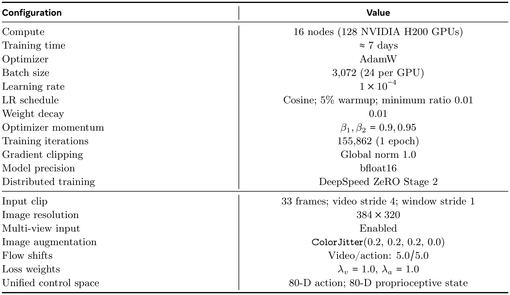

**Original:**

Table 9. **Pretraining configuration for OpenWAM-$\alpha$.**

| **Configuration** | **Value** |
| --- | --- |
| Compute | 16 nodes (128 NVIDIA H200 GPUs) |
| Training time | $\approx 7$ days |
| Optimizer | AdamW |
| Batch size | 3,072 (24 per GPU) |
| Learning rate | $1\times10^{-4}$ |
| LR schedule | Cosine; 5% warmup; minimum ratio $0.01$ |
| Weight decay | $0.01$ |
| Optimizer momentum | $\beta_1,\beta_2=0.9,0.95$ |
| Training iterations | 155,862 (1 epoch) |
| Gradient clipping | Global norm $1.0$ |
| Model precision | bfloat16 |
| Distributed training | DeepSpeed ZeRO Stage 2 |
| Input clip | 33 frames; video stride 4; window stride 1 |
| Image resolution | $384\times320$ |
| Multi-view input | Enabled |
| Image augmentation | `ColorJitter`(0.2, 0.2, 0.2, 0.0) |
| Flow shifts | Video/action: $5.0/5.0$ |
| Loss weights | $\lambda_v=1.0$, $\lambda_a=1.0$ |
| Unified control space | 80-D action; 80-D proprioceptive state |

**中文:**

表 9：**OpenWAM-$\alpha$ 的预训练配置。**

| **配置项** | **取值** |
| --- | --- |
| 计算资源 | 16 个节点（128 张 NVIDIA H200 GPU） |
| 训练时间 | $\approx 7$ 天 |
| 优化器 | AdamW |
| 批量大小 | 3,072（每张 GPU 24） |
| 学习率 | $1\times10^{-4}$ |
| 学习率调度 | 余弦调度；5% 预热；最低比例 $0.01$ |
| 权重衰减 | $0.01$ |
| 优化器动量 | $\beta_1,\beta_2=0.9,0.95$ |
| 训练迭代数 | 155,862（1 轮） |
| 梯度裁剪 | 全局范数 $1.0$ |
| 模型数值精度 | bfloat16 |
| 分布式训练 | DeepSpeed ZeRO Stage 2 |
| 输入片段 | 33 帧；视频采样步长 4；窗口步长 1 |
| 图像分辨率 | $384\times320$ |
| 多视角输入 | 启用 |
| 图像增强 | `ColorJitter`(0.2, 0.2, 0.2, 0.0) |
| 流时间步偏移 | 视频/动作：$5.0/5.0$ |
| 损失权重 | $\lambda_v=1.0$, $\lambda_a=1.0$ |
| 统一控制空间 | 80 维动作；80 维本体状态 |

**Original:**

Dataset-Specific SFT Configuration

**中文:**

各数据集的 SFT 配置

**Original:**

All downstream models are initialized from the same pretrained OpenWAM-$\alpha$ checkpoint. Supervised fine-tuning keeps the pretraining configuration of Table 9 unchanged and differs only in the three benchmark-dependent settings summarized in Table 10: the global batch size, the number of training epochs or steps, and whether image augmentation is applied. Training length is given in epochs over the fine-tuning set, with the corresponding number of optimizer steps in parentheses, or directly in optimizer steps where no epoch-based schedule was used. Image augmentation, where enabled, is the same `ColorJitter`(0.2, 0.2, 0.2, 0.0) used in pretraining. LIBERO-Plus is evaluated with the LIBERO checkpoint without further fine-tuning.

**中文:**

所有下游模型都从同一个预训练 OpenWAM-$\alpha$ 检查点初始化。监督微调沿用表 9 的预训练配置，仅调整表 10 中与具体基准有关的三个设置：全局批量、训练轮数或步数，以及是否使用图像增强。训练长度通常以遍历微调集的轮数表示，并在括号中给出对应的优化器更新步数；未采用按轮数制定的日程时，直接给出更新步数。启用图像增强时，使用与预训练相同的 `ColorJitter`(0.2, 0.2, 0.2, 0.0)。LIBERO-Plus 直接使用 LIBERO 检查点评测，不另行微调。

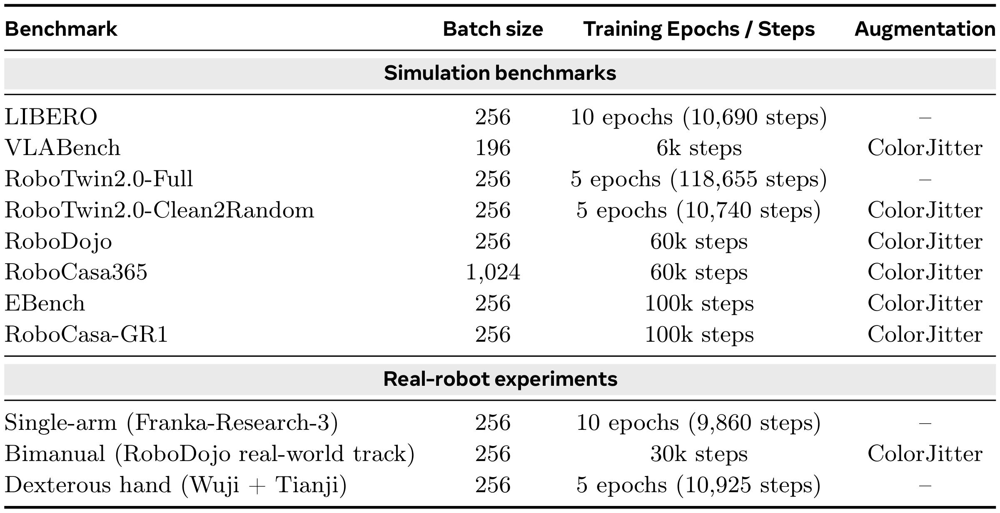

**Original:**

Table 10. **Dataset-specific SFT configuration for OpenWAM-$\alpha$.** Settings not listed are identical to pretraining (Table 9); “–” denotes no image augmentation.

| **Benchmark** | **Batch size** | **Training Epochs / Steps** | **Augmentation** |
| --- | --- | --- | --- |
| ***Simulation benchmarks*** | ***Simulation benchmarks*** | ***Simulation benchmarks*** | ***Simulation benchmarks*** |
| LIBERO | 256 | 10 epochs (10,690 steps) | – |
| VLABench | 196 | 6k steps | ColorJitter |
| RoboTwin2.0-Full | 256 | 5 epochs (118,655 steps) | – |
| RoboTwin2.0-Clean2Random | 256 | 5 epochs (10,740 steps) | ColorJitter |
| RoboDojo | 256 | 60k steps | ColorJitter |
| RoboCasa365 | 1,024 | 60k steps | ColorJitter |
| EBench | 256 | 100k steps | ColorJitter |
| RoboCasa-GR1 | 256 | 100k steps | ColorJitter |
| ***Real-robot experiments*** | ***Real-robot experiments*** | ***Real-robot experiments*** | ***Real-robot experiments*** |
| Single-arm (Franka-Research-3) | 256 | 10 epochs (9,860 steps) | – |
| Bimanual (RoboDojo real-world track) | 256 | 30k steps | ColorJitter |
| Dexterous hand (Wuji + Tianji) | 256 | 5 epochs (10,925 steps) | – |

**中文:**

表 10：**OpenWAM-$\alpha$ 在各数据集上的监督微调（SFT）配置。** 未列出的设置与预训练相同（表 9）；“–”表示不使用图像增强。

| **基准** | **批量大小** | **训练轮数 / 步数** | **数据增强** |
| --- | --- | --- | --- |
| ***仿真基准*** | ***仿真基准*** | ***仿真基准*** | ***仿真基准*** |
| LIBERO | 256 | 10 轮（10,690 步） | – |
| VLABench | 196 | 6k 步 | ColorJitter |
| RoboTwin2.0-Full | 256 | 5 轮（118,655 步） | – |
| RoboTwin2.0-Clean2Random | 256 | 5 轮（10,740 步） | ColorJitter |
| RoboDojo | 256 | 60k 步 | ColorJitter |
| RoboCasa365 | 1,024 | 60k 步 | ColorJitter |
| EBench | 256 | 100k 步 | ColorJitter |
| RoboCasa-GR1 | 256 | 100k 步 | ColorJitter |
| ***真实机器人实验*** | ***真实机器人实验*** | ***真实机器人实验*** | ***真实机器人实验*** |
| 单臂（Franka-Research-3） | 256 | 10 轮（9,860 步） | – |
| 双臂（RoboDojo 真实环境赛道） | 256 | 30k 步 | ColorJitter |
| 灵巧手（Wuji + Tianji） | 256 | 5 轮（10,925 步） | – |

## 真机评测协议

**Original:**

Real-World Evaluation Protocols

**中文:**

真机评测协议

**Original:**

This section details the real-world evaluation of Section 5.4: for each embodiment, we document the task setup and the corresponding evaluation protocol.

**中文:**

本节补充第 5.4 节的真机评测细节，逐一说明每种具身形态的任务设置及其评测协议。

**Original:**

Single-Arm Real-Robot Experiments

**中文:**

单臂真机实验

**Original:**

Task Setup.

**中文:**

任务设置。

**Original:**

We evaluate single-arm policies on the Franka-Research-3 platform using six real-world tabletop tasks, covering stacking, hanging, and drawer manipulation. The tasks use a Franka-Research-3 arm with a parallel gripper and RGB observation cameras, as shown in Figure 18. Each task is specified by a natural-language instruction and instantiated with a fixed physical scene: stacking tasks place two target objects on the tabletop, hanging tasks place the object and shelf in the workspace, and drawer tasks place the object on the table next to an upper drawer.

**中文:**

我们在 Franka-Research-3 平台上，使用六个真实桌面任务评估单臂策略，涵盖堆叠、悬挂和抽屉操作。如图 18 所示，平台配备 Franka-Research-3 机械臂、平行夹爪与 RGB 观测相机。每个任务由自然语言指令指定，并使用固定的物理场景：堆叠任务在桌面放置两个目标物体；悬挂任务在工作区放置待挂物体和架子；抽屉任务则把物体放在上层抽屉旁的桌面上。

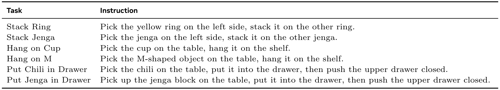

**Original:**

Table 11. Task instructions used in the single-arm real-robot evaluation.

| **Task** | **Instruction** |
| --- | --- |
| Stack Ring | Pick the yellow ring on the left side, stack it on the other ring. |
| Stack Jenga | Pick the jenga on the left side, stack it on the other jenga. |
| Hang on Cup | Pick the cup on the table, hang it on the shelf. |
| Hang on M | Pick the M-shaped object on the table, hang it on the shelf. |
| Put Chili in Drawer | Pick the chili on the table, put it into the drawer, then push the upper drawer closed. |
| Put Jenga in Drawer | Pick up the jenga block on the table, put it into the drawer, then push the upper drawer closed. |

**中文:**

表 11：真实机器人单臂评估所用的任务指令。

| **任务** | **指令** |
| --- | --- |
| 堆叠圆环 | 拿起左边的黄色圆环，叠到另一个圆环上。 |
| 堆叠 Jenga 积木 | 拿起左边的 Jenga 积木，叠到另一块 Jenga 积木上。 |
| 悬挂杯子 | 拿起桌上的杯子，挂到架子上。 |
| 悬挂 M 形物体 | 拿起桌上的 M 形物体，挂到架子上。 |
| 将辣椒放入抽屉 | 拿起桌上的辣椒，放进抽屉，再推上方的抽屉将其关好。 |
| 将 Jenga 积木放入抽屉 | 拿起桌上的 Jenga 积木，放进抽屉，再推上方的抽屉将其关好。 |

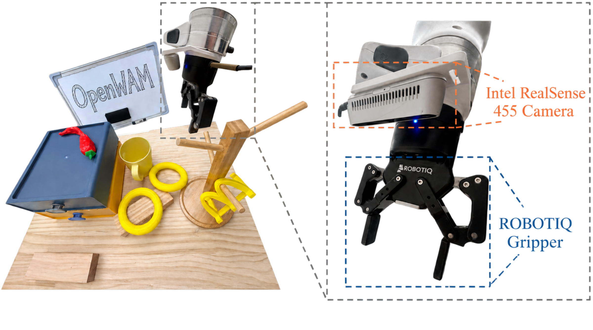

**Original:**

Figure 18. Single-arm real-robot setup on the Franka-Research-3 platform. The workspace contains the drawer, stacking objects, and hanging fixtures used across the six tasks, while the robot is equipped with an Intel RealSense camera and a Robotiq parallel gripper for closed-loop execution.

**中文:**

图 18：Franka-Research-3 平台上的单臂真机设置。工作区放有六个任务所需的抽屉、堆叠物体和悬挂装置；机器人配备 Intel RealSense 相机与 Robotiq 平行夹爪，用于闭环执行。

**Original:**

The corresponding execution sequences are visualized in Figure 19, where each row contains six frames uniformly sampled from one rollout video of the task.

**中文:**

相应的执行序列见图 19。每行包含六帧，均从该任务的一次执行视频中等间隔抽取。

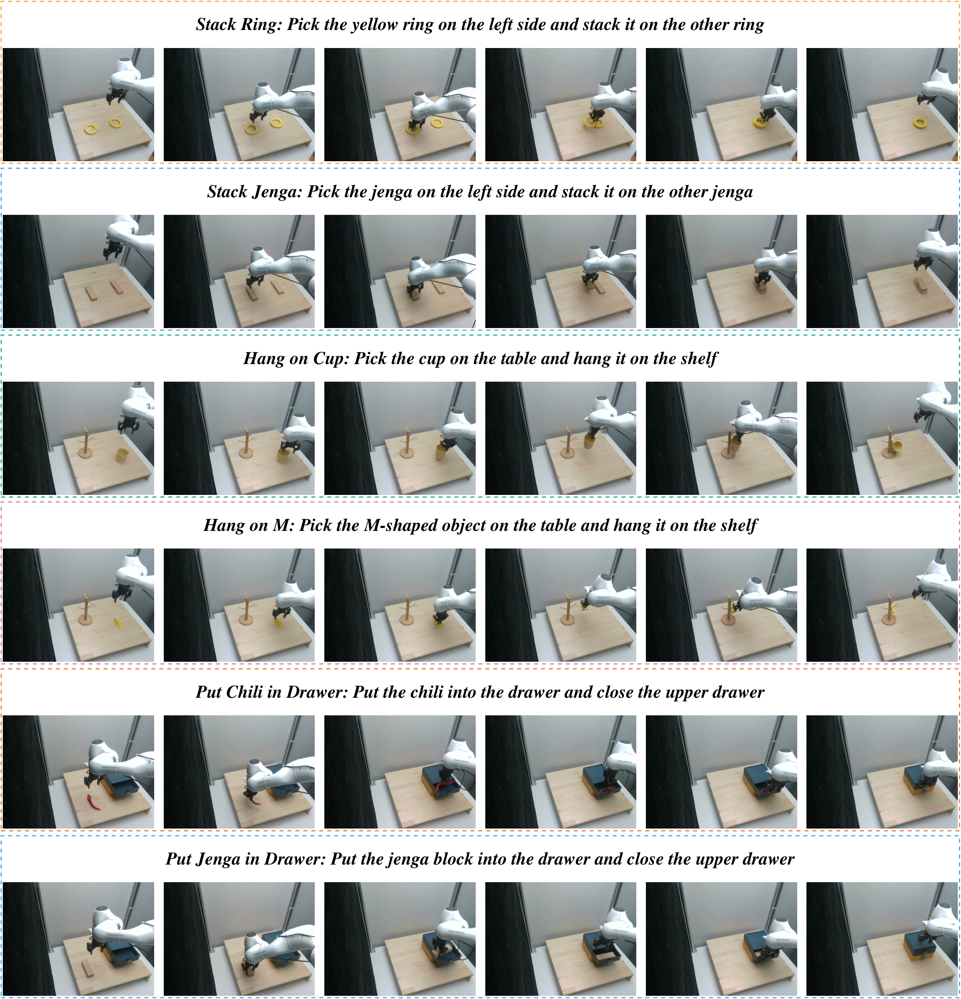

**Original:**

Figure 19. Single-arm task execution sequences on the Franka-Research-3 platform. Each row shows one task, with six frames uniformly sampled from the corresponding left-view rollout video.

**中文:**

图 19：Franka-Research-3 平台上的单臂任务执行序列。每行对应一个任务，展示从相应左侧视角执行视频中等间隔抽取的六帧。

**Original:**

Evaluation Protocol.

**中文:**

评测协议。

**Original:**

For each single-arm task, we fine-tune the policy with 100 task-specific real-robot demonstrations. After fine-tuning, each task is evaluated over 20 independent real-world trials, and we report the success rate as the number of successful trials out of 20 in Table 6. A stacking trial succeeds only if the left object is picked and stably stacked on the target object. A hanging trial succeeds only if the object is picked and remains hanging on the shelf. A drawer trial succeeds only if the object is placed inside the drawer and the upper drawer is pushed closed.

**中文:**

对于每个单臂任务，我们使用 100 条该任务的真机示范微调策略。微调后，每个任务进行 20 次独立真机试验，表 6 以 20 次中的成功次数报告成功率。堆叠试验只有在左侧物体被拿起并稳定叠放到目标物体上时才算成功；悬挂试验要求物体被拿起后保持挂在架子上；抽屉试验要求物体放入抽屉且上层抽屉被推关。

**Original:**

Dexterous-Hand Real-Robot Experiments

**中文:**

灵巧手真机实验

**Original:**

Task Setup.

**中文:**

任务设置。

**Original:**

We evaluate dexterous-hand policies on four real-world manipulation tasks: Stack Toy Tower, Collect Shuttlecocks, Twist off Bottle Cap, and Put Away Clothes. Each task is specified by a natural-language instruction that defines the desired manipulation objective. The task instructions are summarized in Table 12.

**中文:**

我们通过四个真机操作任务评估灵巧手策略：堆叠玩具塔、收集羽毛球、拧开瓶盖和收拾衣物。每个任务都由自然语言指令说明操作目标。各任务指令汇总于表 12。

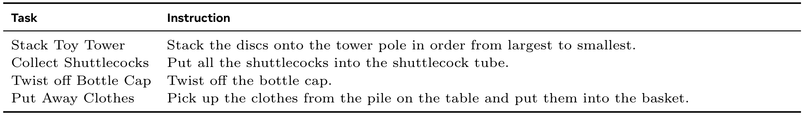

**Original:**

Table 12. Task instructions used in the real-world evaluation.

| **Task** | **Instruction** |
| --- | --- |
| Stack Toy Tower | Stack the discs onto the tower pole in order from largest to smallest. |
| Collect Shuttlecocks | Put all the shuttlecocks into the shuttlecock tube. |
| Twist off Bottle Cap | Twist off the bottle cap. |
| Put Away Clothes | Pick up the clothes from the pile on the table and put them into the basket. |

**中文:**

表 12：真实环境评估所用的任务指令。

| **任务** | **指令** |
| --- | --- |
| 堆叠玩具塔 | 按从大到小的顺序，将圆盘叠放到玩具塔的立杆上。 |
| 收集羽毛球 | 把所有羽毛球装进羽毛球筒。 |
| 拧下瓶盖 | 将瓶盖拧下。 |
| 收纳衣物 | 从桌上的衣物堆中拿起衣物，放进篮子。 |

**Original:**

All experiments are conducted on a physical dexterous-hand platform. The robot receives the task instruction and executes the manipulation autonomously in the corresponding scene. Figure 20 shows the physical robot, dexterous hand, workspace, camera viewpoint, and representative objects used in the evaluation.

**中文:**

所有实验均在真实灵巧手平台上进行。机器人接收任务指令后，在相应场景中自主执行操作。图 20 展示了实体机器人、灵巧手、工作区、相机视角，以及评测使用的代表性物体。

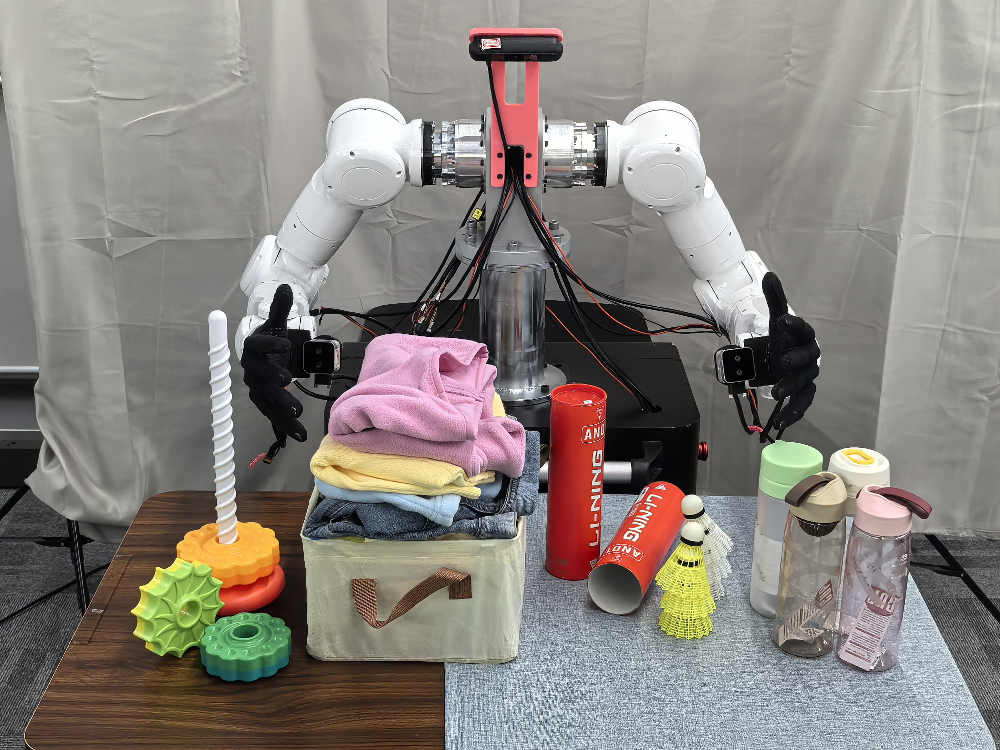

**Original:**

Figure 20. Real-world experimental setup. The figure shows the physical dexterous-hand platform, the workspace, the observation camera, and representative objects for the four manipulation tasks.

**中文:**

图 20：真机实验设置。图中展示实体灵巧手平台、工作区、观测相机，以及四个操作任务所用的代表性物体。

**Original:**

For each task, we evaluate the policy under an in-distribution (ID) condition and several out-of-distribution (OOD) conditions. The OOD conditions modify one factor at a time, including object identity, object layout, illumination, or background appearance, while preserving the task instruction and the overall manipulation objective. The task execution sequence and the corresponding ID/OOD configurations are illustrated in Figure 21.

**中文:**

每个任务均在一种分布内（ID）条件和若干分布外（OOD）条件下评估。OOD 条件每次只改变一个因素，包括物体身份、物体布局、照明或背景外观，而任务指令与总体操作目标保持不变。任务执行序列及相应的 ID/OOD 设置见图 21。

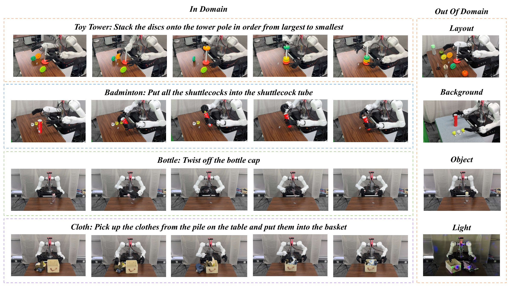

**Original:**

Figure 21. Task execution sequences and evaluation conditions. Each row illustrates the main manipulation stages of one task, while the columns show the corresponding ID scene and OOD variations. OOD conditions include changes in object identity, object layout, illumination, and background appearance.

**中文:**

图 21：任务执行序列与评测条件。每行展示一个任务的主要操作阶段，各列则展示相应的 ID 场景与 OOD 变化。OOD 条件包括改变物体身份、物体布局、照明和背景外观。

**Original:**

Evaluation Protocol.

**中文:**

评测协议。

**Original:**

Each task is evaluated over multiple independent trials under both ID and OOD conditions. We report two complementary metrics: the progress score (Score) and the final success rate (SR).

**中文:**

每个任务在 ID 和 OOD 条件下均进行多次独立试验。我们报告两个互补指标：进度分数（Score）与最终成功率（SR）。

**Original:**

Final Success Rate.

**中文:**

最终成功率。

**Original:**

A trial is counted as a final success only when the complete task objective is achieved. The final success rate is computed as

$$
S_{\mathrm{final}}
=
\frac{N_{\mathrm{success}}}{N_{\mathrm{trial}}}
\times 100\%,
$$

 where $N_{\mathrm{success}}$ is the number of trials satisfying the complete task criterion and $N_{\mathrm{trial}}$ is the total number of valid trials.

**中文:**

只有完整实现任务目标，才将一次试验记为最终成功。最终成功率计算如下：

$$
S_{\mathrm{final}}
=
\frac{N_{\mathrm{success}}}{N_{\mathrm{trial}}}
\times 100\%,
$$

其中，$N_{\mathrm{success}}$ 是满足完整任务判据的试验数，$N_{\mathrm{trial}}$ 是有效试验总数。

**Original:**

Progress Score.

**中文:**

进度分数。

**Original:**

The progress score measures the fraction of required manipulation elements that are successfully completed, regardless of whether the final task state is achieved. For trial $i$, let $n_i$ denote the number of successfully completed elements and $m_i$ denote the total number of elements present in that trial. The progress score is computed as

$$
S_{\mathrm{process}}
=
\frac{\sum_i n_i}{\sum_i m_i}
\times 100\%.
$$

**中文:**

进度分数衡量所需操作元素中已成功完成的比例，不要求最终任务状态已经达成。对于试验 $i$，令 $n_i$ 表示成功完成的元素数，$m_i$ 表示该试验的元素总数。进度分数计算如下：

$$
S_{\mathrm{process}}
=
\frac{\sum_i n_i}{\sum_i m_i}
\times 100\%.
$$

**Original:**

Task-Specific Criteria.

**中文:**

各任务的判定标准。

**Original:**

**Collect Shuttlecocks.** Each trial contains two to four shuttlecocks on the tabletop. A trial is counted as a final success only when all shuttlecocks are placed into the shuttlecock tube. The progress score is the fraction of shuttlecocks successfully placed into the tube.

**中文:**

**收集羽毛球。** 每次试验在桌面放置两到四只羽毛球。只有全部羽毛球均被放入球筒，才算最终成功。进度分数为已成功放入球筒的羽毛球所占比例。

**Original:**

**Stack Toy Tower.** Each trial contains three discs. A trial is counted as a final success only when all three discs are successfully inserted onto the tower pole in descending order of size. The progress score is the fraction of discs successfully inserted.

**中文:**

**堆叠玩具塔。** 每次试验包含三个圆盘。只有三个圆盘全部按从大到小的顺序套到塔杆上，才算最终成功。进度分数为成功套入的圆盘所占比例。

**Original:**

**Put Away Clothes.** Each trial contains three to four pieces of clothing. A trial is counted as a final success only when all pieces of clothing are placed into the basket. The progress score is the fraction of clothing items successfully placed into the basket.

**中文:**

**收拾衣物。** 每次试验包含三到四件衣物。只有所有衣物均被放进篮子，才算最终成功。进度分数为成功放入篮子的衣物所占比例。

**Original:**

**Twist off Bottle Cap.** A trial is counted as a final success when the bottle cap is fully twisted off and the robot maintains a stable grasp of the bottle or cap. The progress score records whether the cap is successfully twisted off, regardless of whether the final stable grasp is achieved.

**中文:**

**拧开瓶盖。** 当瓶盖完全拧下，且机器人能够稳定抓住瓶子或瓶盖时，才算最终成功。进度分数只记录瓶盖是否成功拧下，不要求最后保持稳定抓持。

**Original:**

Bimanual Real-Robot Experiments

**中文:**

双臂真机实验

**Original:**

We conduct a comprehensive evaluation on all 18 tasks of RoboDojo-Real, using the official real-robot evaluation platform provided by the RoboDojo team and covering its three bimanual embodiments: ARX X5, Piper, and Piper X. The evaluation strictly follows the unified protocol defined by the official evaluation team; detailed documentation of the platform and its task specifications is available on the RoboDojo website ([https://robodojo-benchmark.com/](https://robodojo-benchmark.com/)) and in the accompanying official documentation ([https://robodojo-benchmark.com/doc/real-tasks/](https://robodojo-benchmark.com/doc/real-tasks/)).

**中文:**

我们使用 RoboDojo 团队提供的官方真机评测平台，对 RoboDojo-Real 的全部 18 个任务进行全面评估，覆盖 ARX X5、Piper 和 Piper X 三种双臂具身形态。评测严格遵循官方评测团队制定的统一协议；平台与任务规范的详细说明见 [RoboDojo 网站](https://robodojo-benchmark.com/) 及其[官方文档](https://robodojo-benchmark.com/doc/real-tasks/)。

## 各仿真基准完整结果

**Original:**

Per-Benchmark Simulation Results

**中文:**

各仿真基准的完整结果

**Original:**

The tables below report the full per-benchmark scores summarized in Figure 13, except for LIBERO-Plus, whose scores are already reported in Table 5 of the main text. Within each table the baselines are grouped as VLA or WAM; bold denotes the best value and underline the second best.

**中文:**

以下各表给出图 13 汇总的逐基准完整分数；LIBERO-Plus 除外，其结果已列于正文表 5。每张表将基线分为 VLA 和 WAM 两组，粗体表示最佳值，下划线表示次佳值。

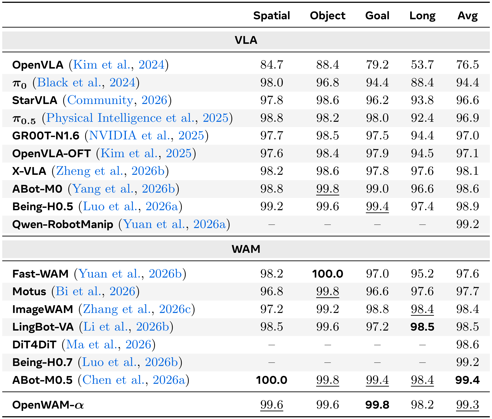

**Original:**

Table 13. **Evaluation Results on LIBERO.** Bold denotes best values, underline second best.

|  | **Spatial** | **Object** | **Goal** | **Long** | **Avg** |
| --- | --- | --- | --- | --- | --- |
| ***VLA*** | ***VLA*** | ***VLA*** | ***VLA*** | ***VLA*** | ***VLA*** |
| **OpenVLA**  (Kim et al., 2024) | 84.7 | 88.4 | 79.2 | 53.7 | 76.5 |
| **$\pi_0$**  (Black et al., 2024) | 98.0 | 96.8 | 94.4 | 88.4 | 94.4 |
| **StarVLA**  (Community, 2026) | 97.8 | 98.6 | 96.2 | 93.8 | 96.6 |
| **$\pi_{0.5}$**  (Physical Intelligence et al., 2025) | 98.8 | 98.2 | 98.0 | 92.4 | 96.9 |
| **GR00T-N1.6**  (NVIDIA et al., 2025) | 97.7 | 98.5 | 97.5 | 94.4 | 97.0 |
| **OpenVLA-OFT**  (Kim et al., 2025) | 97.6 | 98.4 | 97.9 | 94.5 | 97.1 |
| **X-VLA**  (Zheng et al., 2026b) | 98.2 | 98.6 | 97.8 | 97.6 | 98.1 |
| **ABot-M0**  (Yang et al., 2026b) | 98.8 | 99.8 | 99.0 | 96.6 | 98.6 |
| **Being-H0.5**  (Luo et al., 2026a) | 99.2 | 99.6 | 99.4 | 97.4 | 98.9 |
| **Qwen-RobotManip**  (Yuan et al., 2026a) | – | – | – | – | 99.2 |
| ***WAM*** | ***WAM*** | ***WAM*** | ***WAM*** | ***WAM*** | ***WAM*** |
| **Fast-WAM**  (Yuan et al., 2026b) | 98.2 | **100.0** | 97.0 | 95.2 | 97.6 |
| **Motus**  (Bi et al., 2026) | 96.8 | 99.8 | 96.6 | 97.6 | 97.7 |
| **ImageWAM**  (Zhang et al., 2026c) | 97.2 | 99.2 | 98.8 | 98.4 | 98.4 |
| **LingBot-VA**  (Li et al., 2026b) | 98.5 | 99.6 | 97.2 | **98.5** | 98.5 |
| **DiT4DiT**  (Ma et al., 2026) | – | – | – | – | 98.6 |
| **Being-H0.7**  (Luo et al., 2026b) | – | – | – | – | 99.2 |
| **ABot-M0.5**  (Chen et al., 2026a) | **100.0** | 99.8 | 99.4 | 98.4 | **99.4** |
| **OpenWAM-$\alpha$** | 99.6 | 99.6 | **99.8** | 98.2 | 99.3 |

**中文:**

表 13：**LIBERO 评估结果。** 粗体表示最佳值，下划线表示次佳值。

|  | **Spatial（空间）** | **Object（物体）** | **Goal（目标）** | **Long（长时域）** | **平均** |
| --- | --- | --- | --- | --- | --- |
| ***VLA*** | ***VLA*** | ***VLA*** | ***VLA*** | ***VLA*** | ***VLA*** |
| **OpenVLA**  (Kim et al., 2024) | 84.7 | 88.4 | 79.2 | 53.7 | 76.5 |
| **$\pi_0$**  (Black et al., 2024) | 98.0 | 96.8 | 94.4 | 88.4 | 94.4 |
| **StarVLA**  (Community, 2026) | 97.8 | 98.6 | 96.2 | 93.8 | 96.6 |
| **$\pi_{0.5}$**  (Physical Intelligence et al., 2025) | 98.8 | 98.2 | 98.0 | 92.4 | 96.9 |
| **GR00T-N1.6**  (NVIDIA et al., 2025) | 97.7 | 98.5 | 97.5 | 94.4 | 97.0 |
| **OpenVLA-OFT**  (Kim et al., 2025) | 97.6 | 98.4 | 97.9 | 94.5 | 97.1 |
| **X-VLA**  (Zheng et al., 2026b) | 98.2 | 98.6 | 97.8 | 97.6 | 98.1 |
| **ABot-M0**  (Yang et al., 2026b) | 98.8 | 99.8 | 99.0 | 96.6 | 98.6 |
| **Being-H0.5**  (Luo et al., 2026a) | 99.2 | 99.6 | 99.4 | 97.4 | 98.9 |
| **Qwen-RobotManip**  (Yuan et al., 2026a) | – | – | – | – | 99.2 |
| ***WAM*** | ***WAM*** | ***WAM*** | ***WAM*** | ***WAM*** | ***WAM*** |
| **Fast-WAM**  (Yuan et al., 2026b) | 98.2 | **100.0** | 97.0 | 95.2 | 97.6 |
| **Motus**  (Bi et al., 2026) | 96.8 | 99.8 | 96.6 | 97.6 | 97.7 |
| **ImageWAM**  (Zhang et al., 2026c) | 97.2 | 99.2 | 98.8 | 98.4 | 98.4 |
| **LingBot-VA**  (Li et al., 2026b) | 98.5 | 99.6 | 97.2 | **98.5** | 98.5 |
| **DiT4DiT**  (Ma et al., 2026) | – | – | – | – | 98.6 |
| **Being-H0.7**  (Luo et al., 2026b) | – | – | – | – | 99.2 |
| **ABot-M0.5**  (Chen et al., 2026a) | **100.0** | 99.8 | 99.4 | 98.4 | **99.4** |
| **OpenWAM-$\alpha$** | 99.6 | 99.6 | **99.8** | 98.2 | 99.3 |

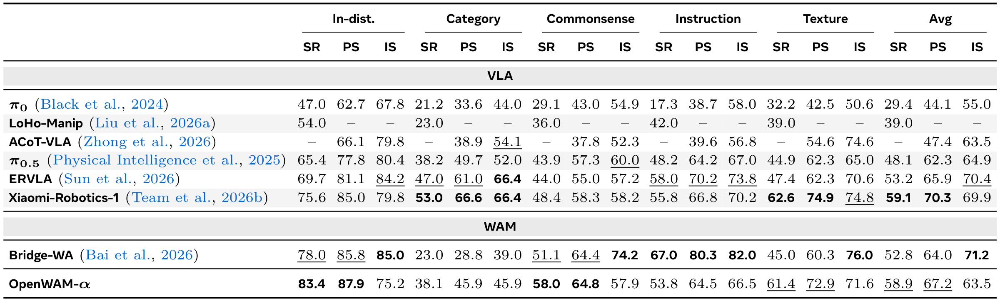

**Original:**

Table 14. **Evaluation Results on VLABench.** Bold denotes best values, underline second best.

|  | **In-dist.** | **In-dist.** | **In-dist.** | **Category** | **Category** | **Category** | **Commonsense** | **Commonsense** | **Commonsense** | **Instruction** | **Instruction** | **Instruction** | **Texture** | **Texture** | **Texture** | **Avg** | **Avg** | **Avg** |
| --- | --- | --- | --- | --- | --- | --- | --- | --- | --- | --- | --- | --- | --- | --- | --- | --- | --- | --- |
|  | **SR** | **PS** | **IS** | **SR** | **PS** | **IS** | **SR** | **PS** | **IS** | **SR** | **PS** | **IS** | **SR** | **PS** | **IS** | **SR** | **PS** | **IS** |
| ***VLA*** | ***VLA*** | ***VLA*** | ***VLA*** | ***VLA*** | ***VLA*** | ***VLA*** | ***VLA*** | ***VLA*** | ***VLA*** | ***VLA*** | ***VLA*** | ***VLA*** | ***VLA*** | ***VLA*** | ***VLA*** | ***VLA*** | ***VLA*** | ***VLA*** |
| **$\pi_0$**  (Black et al., 2024) | 47.0 | 62.7 | 67.8 | 21.2 | 33.6 | 44.0 | 29.1 | 43.0 | 54.9 | 17.3 | 38.7 | 58.0 | 32.2 | 42.5 | 50.6 | 29.4 | 44.1 | 55.0 |
| **LoHo-Manip**  (Liu et al., 2026a) | 54.0 | – | – | 23.0 | – | – | 36.0 | – | – | 42.0 | – | – | 39.0 | – | – | 39.0 | – | – |
| **ACoT-VLA**  (Zhong et al., 2026) | – | 66.1 | 79.8 | – | 38.9 | 54.1 | – | 37.8 | 52.3 | – | 39.6 | 56.8 | – | 54.6 | 74.6 | – | 47.4 | 63.5 |
| **$\pi_{0.5}$**  (Physical Intelligence et al., 2025) | 65.4 | 77.8 | 80.4 | 38.2 | 49.7 | 52.0 | 43.9 | 57.3 | 60.0 | 48.2 | 64.2 | 67.0 | 44.9 | 62.3 | 65.0 | 48.1 | 62.3 | 64.9 |
| **ERVLA**  (Sun et al., 2026) | 69.7 | 81.1 | 84.2 | 47.0 | 61.0 | **66.4** | 44.0 | 55.0 | 57.2 | 58.0 | 70.2 | 73.8 | 47.4 | 62.3 | 70.6 | 53.2 | 65.9 | 70.4 |
| **Xiaomi-Robotics-1**  (Team et al., 2026b) | 75.6 | 85.0 | 79.8 | **53.0** | **66.6** | **66.4** | 48.4 | 58.3 | 58.2 | 55.8 | 66.8 | 70.2 | **62.6** | **74.9** | 74.8 | **59.1** | **70.3** | 69.9 |
| ***WAM*** | ***WAM*** | ***WAM*** | ***WAM*** | ***WAM*** | ***WAM*** | ***WAM*** | ***WAM*** | ***WAM*** | ***WAM*** | ***WAM*** | ***WAM*** | ***WAM*** | ***WAM*** | ***WAM*** | ***WAM*** | ***WAM*** | ***WAM*** | ***WAM*** |
| **Bridge-WA**  (Bai et al., 2026) | 78.0 | 85.8 | **85.0** | 23.0 | 28.8 | 39.0 | 51.1 | 64.4 | **74.2** | **67.0** | **80.3** | **82.0** | 45.0 | 60.3 | **76.0** | 52.8 | 64.0 | **71.2** |
| **OpenWAM-$\alpha$** | **83.4** | **87.9** | 75.2 | 38.1 | 45.9 | 45.9 | **58.0** | **64.8** | 57.9 | 53.8 | 64.5 | 66.5 | 61.4 | 72.9 | 71.6 | 58.9 | 67.2 | 63.5 |

**中文:**

表 14：**VLABench 评估结果。** 粗体表示最佳值，下划线表示次佳值。

|  | **In-dist.（分布内）** | **In-dist.（分布内）** | **In-dist.（分布内）** | **类别** | **类别** | **类别** | **常识** | **常识** | **常识** | **指令** | **指令** | **指令** | **纹理** | **纹理** | **纹理** | **平均** | **平均** | **平均** |
| --- | --- | --- | --- | --- | --- | --- | --- | --- | --- | --- | --- | --- | --- | --- | --- | --- | --- | --- |
|  | **SR** | **PS** | **IS** | **SR** | **PS** | **IS** | **SR** | **PS** | **IS** | **SR** | **PS** | **IS** | **SR** | **PS** | **IS** | **SR** | **PS** | **IS** |
| ***VLA*** | ***VLA*** | ***VLA*** | ***VLA*** | ***VLA*** | ***VLA*** | ***VLA*** | ***VLA*** | ***VLA*** | ***VLA*** | ***VLA*** | ***VLA*** | ***VLA*** | ***VLA*** | ***VLA*** | ***VLA*** | ***VLA*** | ***VLA*** | ***VLA*** |
| **$\pi_0$**  (Black et al., 2024) | 47.0 | 62.7 | 67.8 | 21.2 | 33.6 | 44.0 | 29.1 | 43.0 | 54.9 | 17.3 | 38.7 | 58.0 | 32.2 | 42.5 | 50.6 | 29.4 | 44.1 | 55.0 |
| **LoHo-Manip**  (Liu et al., 2026a) | 54.0 | – | – | 23.0 | – | – | 36.0 | – | – | 42.0 | – | – | 39.0 | – | – | 39.0 | – | – |
| **ACoT-VLA**  (Zhong et al., 2026) | – | 66.1 | 79.8 | – | 38.9 | 54.1 | – | 37.8 | 52.3 | – | 39.6 | 56.8 | – | 54.6 | 74.6 | – | 47.4 | 63.5 |
| **$\pi_{0.5}$**  (Physical Intelligence et al., 2025) | 65.4 | 77.8 | 80.4 | 38.2 | 49.7 | 52.0 | 43.9 | 57.3 | 60.0 | 48.2 | 64.2 | 67.0 | 44.9 | 62.3 | 65.0 | 48.1 | 62.3 | 64.9 |
| **ERVLA**  (Sun et al., 2026) | 69.7 | 81.1 | 84.2 | 47.0 | 61.0 | **66.4** | 44.0 | 55.0 | 57.2 | 58.0 | 70.2 | 73.8 | 47.4 | 62.3 | 70.6 | 53.2 | 65.9 | 70.4 |
| **Xiaomi-Robotics-1**  (Team et al., 2026b) | 75.6 | 85.0 | 79.8 | **53.0** | **66.6** | **66.4** | 48.4 | 58.3 | 58.2 | 55.8 | 66.8 | 70.2 | **62.6** | **74.9** | 74.8 | **59.1** | **70.3** | 69.9 |
| ***WAM*** | ***WAM*** | ***WAM*** | ***WAM*** | ***WAM*** | ***WAM*** | ***WAM*** | ***WAM*** | ***WAM*** | ***WAM*** | ***WAM*** | ***WAM*** | ***WAM*** | ***WAM*** | ***WAM*** | ***WAM*** | ***WAM*** | ***WAM*** | ***WAM*** |
| **Bridge-WA**  (Bai et al., 2026) | 78.0 | 85.8 | **85.0** | 23.0 | 28.8 | 39.0 | 51.1 | 64.4 | **74.2** | **67.0** | **80.3** | **82.0** | 45.0 | 60.3 | **76.0** | 52.8 | 64.0 | **71.2** |
| **OpenWAM-$\alpha$** | **83.4** | **87.9** | 75.2 | 38.1 | 45.9 | 45.9 | **58.0** | **64.8** | 57.9 | 53.8 | 64.5 | 66.5 | 61.4 | 72.9 | 71.6 | 58.9 | 67.2 | 63.5 |

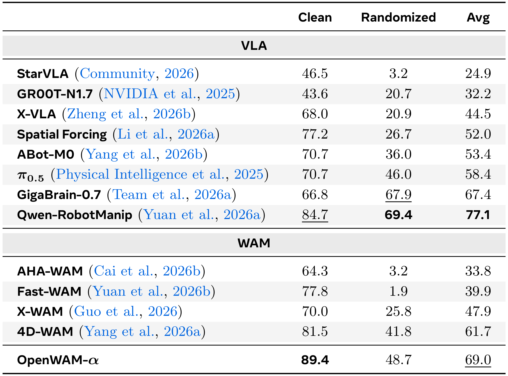

**Original:**

Table 15. **Evaluation Results on RoboTwin2.0-Clean2Random.** Bold denotes best values, underline second best.

|  | **Clean** | **Randomized** | **Avg** |
| --- | --- | --- | --- |
| ***VLA*** | ***VLA*** | ***VLA*** | ***VLA*** |
| **StarVLA**  (Community, 2026) | 46.5 | 3.2 | 24.9 |
| **GR00T-N1.7**  (NVIDIA et al., 2025) | 43.6 | 20.7 | 32.2 |
| **X-VLA**  (Zheng et al., 2026b) | 68.0 | 20.9 | 44.5 |
| **Spatial Forcing**  (Li et al., 2026a) | 77.2 | 26.7 | 52.0 |
| **ABot-M0**  (Yang et al., 2026b) | 70.7 | 36.0 | 53.4 |
| **$\pi_{0.5}$**  (Physical Intelligence et al., 2025) | 70.7 | 46.0 | 58.4 |
| **GigaBrain-0.7**  (Team et al., 2026a) | 66.8 | 67.9 | 67.4 |
| **Qwen-RobotManip**  (Yuan et al., 2026a) | 84.7 | **69.4** | **77.1** |
| ***WAM*** | ***WAM*** | ***WAM*** | ***WAM*** |
| **AHA-WAM**  (Cai et al., 2026b) | 64.3 | 3.2 | 33.8 |
| **Fast-WAM**  (Yuan et al., 2026b) | 77.8 | 1.9 | 39.9 |
| **X-WAM**  (Guo et al., 2026) | 70.0 | 25.8 | 47.9 |
| **4D-WAM**  (Yang et al., 2026a) | 81.5 | 41.8 | 61.7 |
| **OpenWAM-$\alpha$** | **89.4** | 48.7 | 69.0 |

**中文:**

表 15：**RoboTwin2.0-Clean2Random 评估结果。** 粗体表示最佳值，下划线表示次佳值。

|  | **Clean（常规）** | **Randomized（随机化）** | **平均** |
| --- | --- | --- | --- |
| ***VLA*** | ***VLA*** | ***VLA*** | ***VLA*** |
| **StarVLA**  (Community, 2026) | 46.5 | 3.2 | 24.9 |
| **GR00T-N1.7**  (NVIDIA et al., 2025) | 43.6 | 20.7 | 32.2 |
| **X-VLA**  (Zheng et al., 2026b) | 68.0 | 20.9 | 44.5 |
| **Spatial Forcing**  (Li et al., 2026a) | 77.2 | 26.7 | 52.0 |
| **ABot-M0**  (Yang et al., 2026b) | 70.7 | 36.0 | 53.4 |
| **$\pi_{0.5}$**  (Physical Intelligence et al., 2025) | 70.7 | 46.0 | 58.4 |
| **GigaBrain-0.7**  (Team et al., 2026a) | 66.8 | 67.9 | 67.4 |
| **Qwen-RobotManip**  (Yuan et al., 2026a) | 84.7 | **69.4** | **77.1** |
| ***WAM*** | ***WAM*** | ***WAM*** | ***WAM*** |
| **AHA-WAM**  (Cai et al., 2026b) | 64.3 | 3.2 | 33.8 |
| **Fast-WAM**  (Yuan et al., 2026b) | 77.8 | 1.9 | 39.9 |
| **X-WAM**  (Guo et al., 2026) | 70.0 | 25.8 | 47.9 |
| **4D-WAM**  (Yang et al., 2026a) | 81.5 | 41.8 | 61.7 |
| **OpenWAM-$\alpha$** | **89.4** | 48.7 | 69.0 |

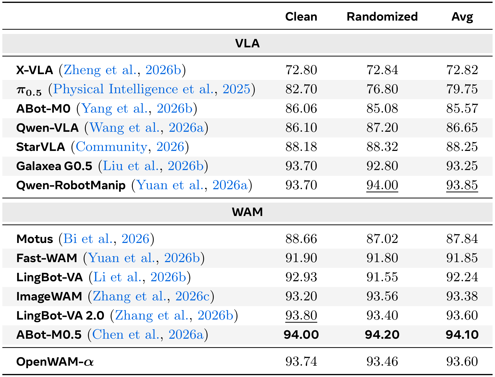

**Original:**

Table 16. **Evaluation Results on RoboTwin2.0-Full.** Bold denotes best values, underline second best.

|  | **Clean** | **Randomized** | **Avg** |
| --- | --- | --- | --- |
| ***VLA*** | ***VLA*** | ***VLA*** | ***VLA*** |
| **X-VLA**  (Zheng et al., 2026b) | 72.80 | 72.84 | 72.82 |
| **$\pi_{0.5}$**  (Physical Intelligence et al., 2025) | 82.70 | 76.80 | 79.75 |
| **ABot-M0**  (Yang et al., 2026b) | 86.06 | 85.08 | 85.57 |
| **Qwen-VLA**  (Wang et al., 2026a) | 86.10 | 87.20 | 86.65 |
| **StarVLA**  (Community, 2026) | 88.18 | 88.32 | 88.25 |
| **Galaxea G0.5**  (Liu et al., 2026b) | 93.70 | 92.80 | 93.25 |
| **Qwen-RobotManip**  (Yuan et al., 2026a) | 93.70 | 94.00 | 93.85 |
| ***WAM*** | ***WAM*** | ***WAM*** | ***WAM*** |
| **Motus**  (Bi et al., 2026) | 88.66 | 87.02 | 87.84 |
| **Fast-WAM**  (Yuan et al., 2026b) | 91.90 | 91.80 | 91.85 |
| **LingBot-VA**  (Li et al., 2026b) | 92.93 | 91.55 | 92.24 |
| **ImageWAM**  (Zhang et al., 2026c) | 93.20 | 93.56 | 93.38 |
| **LingBot-VA 2.0**  (Zhang et al., 2026b) | 93.80 | 93.40 | 93.60 |
| **ABot-M0.5**  (Chen et al., 2026a) | **94.00** | **94.20** | **94.10** |
| **OpenWAM-$\alpha$** | 93.74 | 93.46 | 93.60 |

**中文:**

表 16：**RoboTwin2.0-Full 评估结果。** 粗体表示最佳值，下划线表示次佳值。

|  | **Clean（常规）** | **Randomized（随机化）** | **平均** |
| --- | --- | --- | --- |
| ***VLA*** | ***VLA*** | ***VLA*** | ***VLA*** |
| **X-VLA**  (Zheng et al., 2026b) | 72.80 | 72.84 | 72.82 |
| **$\pi_{0.5}$**  (Physical Intelligence et al., 2025) | 82.70 | 76.80 | 79.75 |
| **ABot-M0**  (Yang et al., 2026b) | 86.06 | 85.08 | 85.57 |
| **Qwen-VLA**  (Wang et al., 2026a) | 86.10 | 87.20 | 86.65 |
| **StarVLA**  (Community, 2026) | 88.18 | 88.32 | 88.25 |
| **Galaxea G0.5**  (Liu et al., 2026b) | 93.70 | 92.80 | 93.25 |
| **Qwen-RobotManip**  (Yuan et al., 2026a) | 93.70 | 94.00 | 93.85 |
| ***WAM*** | ***WAM*** | ***WAM*** | ***WAM*** |
| **Motus**  (Bi et al., 2026) | 88.66 | 87.02 | 87.84 |
| **Fast-WAM**  (Yuan et al., 2026b) | 91.90 | 91.80 | 91.85 |
| **LingBot-VA**  (Li et al., 2026b) | 92.93 | 91.55 | 92.24 |
| **ImageWAM**  (Zhang et al., 2026c) | 93.20 | 93.56 | 93.38 |
| **LingBot-VA 2.0**  (Zhang et al., 2026b) | 93.80 | 93.40 | 93.60 |
| **ABot-M0.5**  (Chen et al., 2026a) | **94.00** | **94.20** | **94.10** |
| **OpenWAM-$\alpha$** | 93.74 | 93.46 | 93.60 |

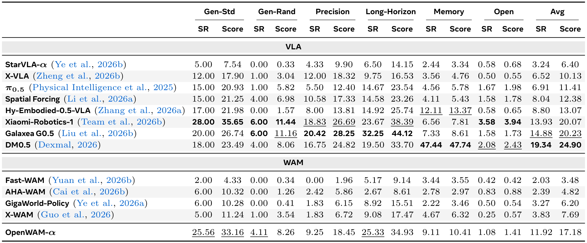

**Original:**

Table 17. **Evaluation Results on RoboDojo.** Bold denotes best values, underline second best.

|  | **Gen-Std** | **Gen-Std** | **Gen-Rand** | **Gen-Rand** | **Precision** | **Precision** | **Long-Horizon** | **Long-Horizon** | **Memory** | **Memory** | **Open** | **Open** | **Avg** | **Avg** |
| --- | --- | --- | --- | --- | --- | --- | --- | --- | --- | --- | --- | --- | --- | --- |
|  | **SR** | **Score** | **SR** | **Score** | **SR** | **Score** | **SR** | **Score** | **SR** | **Score** | **SR** | **Score** | **SR** | **Score** |
| ***VLA*** | ***VLA*** | ***VLA*** | ***VLA*** | ***VLA*** | ***VLA*** | ***VLA*** | ***VLA*** | ***VLA*** | ***VLA*** | ***VLA*** | ***VLA*** | ***VLA*** | ***VLA*** | ***VLA*** |
| **StarVLA-$\alpha$**  (Ye et al., 2026b) | 5.00 | 7.54 | 0.00 | 0.33 | 4.33 | 9.90 | 6.50 | 14.15 | 2.44 | 3.34 | 0.58 | 0.68 | 3.24 | 6.40 |
| **X-VLA**  (Zheng et al., 2026b) | 12.00 | 17.90 | 1.00 | 3.04 | 12.00 | 18.32 | 9.75 | 16.53 | 3.56 | 4.76 | 0.50 | 0.55 | 6.52 | 10.13 |
| **$\pi_{0.5}$**  (Physical Intelligence et al., 2025) | 15.00 | 20.93 | 1.00 | 5.82 | 5.50 | 12.40 | 14.67 | 23.54 | 4.56 | 5.78 | 1.67 | 1.98 | 6.91 | 11.41 |
| **Spatial Forcing**  (Li et al., 2026a) | 15.00 | 21.25 | 4.00 | 6.98 | 10.58 | 17.33 | 14.58 | 23.26 | 4.11 | 5.43 | 1.58 | 1.78 | 8.04 | 12.38 |
| **Hy-Embodied-0.5-VLA**  (Zhang et al., 2026a) | 17.00 | 21.98 | 0.00 | 1.57 | 8.00 | 13.81 | 14.92 | 25.74 | 12.11 | 13.37 | 0.58 | 0.65 | 8.80 | 13.07 |
| **Xiaomi-Robotics-1**  (Team et al., 2026b) | **28.00** | **35.65** | **6.00** | **11.44** | 18.83 | 26.69 | 23.67 | 38.39 | 6.56 | 7.81 | **3.58** | **3.94** | 13.93 | 20.07 |
| **Galaxea G0.5**  (Liu et al., 2026b) | 20.00 | 26.74 | **6.00** | 11.16 | **20.42** | **28.25** | **32.25** | **44.12** | 7.33 | 8.61 | 1.58 | 1.73 | 14.88 | 20.23 |
| **DM0.5**  (Dexmal, 2026) | 18.00 | 23.49 | 4.00 | 8.06 | 16.75 | 24.82 | 19.50 | 33.70 | **47.44** | **47.74** | 2.08 | 2.43 | **19.34** | **24.90** |
| ***WAM*** | ***WAM*** | ***WAM*** | ***WAM*** | ***WAM*** | ***WAM*** | ***WAM*** | ***WAM*** | ***WAM*** | ***WAM*** | ***WAM*** | ***WAM*** | ***WAM*** | ***WAM*** | ***WAM*** |
| **Fast-WAM**  (Yuan et al., 2026b) | 2.00 | 4.33 | 0.00 | 0.34 | 0.00 | 1.96 | 5.17 | 9.14 | 3.44 | 3.55 | 0.42 | 0.42 | 2.03 | 3.48 |
| **AHA-WAM**  (Cai et al., 2026b) | 6.00 | 10.32 | 0.00 | 1.26 | 2.42 | 5.86 | 2.67 | 8.61 | 2.78 | 2.97 | 0.83 | 0.88 | 2.39 | 4.82 |
| **GigaWorld-Policy**  (Ye et al., 2026a) | 6.00 | 10.28 | 0.00 | 0.41 | 1.83 | 6.15 | 8.92 | 15.51 | 2.22 | 3.46 | 0.50 | 0.54 | 3.27 | 6.20 |
| **X-WAM**  (Guo et al., 2026) | 5.00 | 11.24 | 1.00 | 3.54 | 1.83 | 6.72 | 9.08 | 17.47 | 4.67 | 6.32 | 0.25 | 0.57 | 3.83 | 7.69 |
| **OpenWAM-$\alpha$** | 25.56 | 33.16 | 4.11 | 8.26 | 9.25 | 18.45 | 25.33 | 34.93 | 9.11 | 10.41 | 1.08 | 1.41 | 11.92 | 17.18 |

**中文:**

表 17：**RoboDojo 评估结果。** 粗体表示最佳值，下划线表示次佳值。

|  | **Gen-Std** | **Gen-Std** | **Gen-Rand** | **Gen-Rand** | **精度** | **精度** | **长时域** | **长时域** | **记忆** | **记忆** | **开放任务** | **开放任务** | **平均** | **平均** |
| --- | --- | --- | --- | --- | --- | --- | --- | --- | --- | --- | --- | --- | --- | --- |
|  | **SR** | **得分** | **SR** | **得分** | **SR** | **得分** | **SR** | **得分** | **SR** | **得分** | **SR** | **得分** | **SR** | **得分** |
| ***VLA*** | ***VLA*** | ***VLA*** | ***VLA*** | ***VLA*** | ***VLA*** | ***VLA*** | ***VLA*** | ***VLA*** | ***VLA*** | ***VLA*** | ***VLA*** | ***VLA*** | ***VLA*** | ***VLA*** |
| **StarVLA-$\alpha$**  (Ye et al., 2026b) | 5.00 | 7.54 | 0.00 | 0.33 | 4.33 | 9.90 | 6.50 | 14.15 | 2.44 | 3.34 | 0.58 | 0.68 | 3.24 | 6.40 |
| **X-VLA**  (Zheng et al., 2026b) | 12.00 | 17.90 | 1.00 | 3.04 | 12.00 | 18.32 | 9.75 | 16.53 | 3.56 | 4.76 | 0.50 | 0.55 | 6.52 | 10.13 |
| **$\pi_{0.5}$**  (Physical Intelligence et al., 2025) | 15.00 | 20.93 | 1.00 | 5.82 | 5.50 | 12.40 | 14.67 | 23.54 | 4.56 | 5.78 | 1.67 | 1.98 | 6.91 | 11.41 |
| **Spatial Forcing**  (Li et al., 2026a) | 15.00 | 21.25 | 4.00 | 6.98 | 10.58 | 17.33 | 14.58 | 23.26 | 4.11 | 5.43 | 1.58 | 1.78 | 8.04 | 12.38 |
| **Hy-Embodied-0.5-VLA**  (Zhang et al., 2026a) | 17.00 | 21.98 | 0.00 | 1.57 | 8.00 | 13.81 | 14.92 | 25.74 | 12.11 | 13.37 | 0.58 | 0.65 | 8.80 | 13.07 |
| **Xiaomi-Robotics-1**  (Team et al., 2026b) | **28.00** | **35.65** | **6.00** | **11.44** | 18.83 | 26.69 | 23.67 | 38.39 | 6.56 | 7.81 | **3.58** | **3.94** | 13.93 | 20.07 |
| **Galaxea G0.5**  (Liu et al., 2026b) | 20.00 | 26.74 | **6.00** | 11.16 | **20.42** | **28.25** | **32.25** | **44.12** | 7.33 | 8.61 | 1.58 | 1.73 | 14.88 | 20.23 |
| **DM0.5**  (Dexmal, 2026) | 18.00 | 23.49 | 4.00 | 8.06 | 16.75 | 24.82 | 19.50 | 33.70 | **47.44** | **47.74** | 2.08 | 2.43 | **19.34** | **24.90** |
| ***WAM*** | ***WAM*** | ***WAM*** | ***WAM*** | ***WAM*** | ***WAM*** | ***WAM*** | ***WAM*** | ***WAM*** | ***WAM*** | ***WAM*** | ***WAM*** | ***WAM*** | ***WAM*** | ***WAM*** |
| **Fast-WAM**  (Yuan et al., 2026b) | 2.00 | 4.33 | 0.00 | 0.34 | 0.00 | 1.96 | 5.17 | 9.14 | 3.44 | 3.55 | 0.42 | 0.42 | 2.03 | 3.48 |
| **AHA-WAM**  (Cai et al., 2026b) | 6.00 | 10.32 | 0.00 | 1.26 | 2.42 | 5.86 | 2.67 | 8.61 | 2.78 | 2.97 | 0.83 | 0.88 | 2.39 | 4.82 |
| **GigaWorld-Policy**  (Ye et al., 2026a) | 6.00 | 10.28 | 0.00 | 0.41 | 1.83 | 6.15 | 8.92 | 15.51 | 2.22 | 3.46 | 0.50 | 0.54 | 3.27 | 6.20 |
| **X-WAM**  (Guo et al., 2026) | 5.00 | 11.24 | 1.00 | 3.54 | 1.83 | 6.72 | 9.08 | 17.47 | 4.67 | 6.32 | 0.25 | 0.57 | 3.83 | 7.69 |
| **OpenWAM-$\alpha$** | 25.56 | 33.16 | 4.11 | 8.26 | 9.25 | 18.45 | 25.33 | 34.93 | 9.11 | 10.41 | 1.08 | 1.41 | 11.92 | 17.18 |

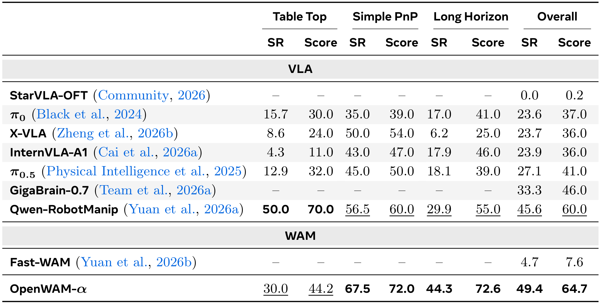

**Original:**

Table 18. **Evaluation Results on EBench.** Bold denotes best values, underline second best.

|  | **Table Top** | **Table Top** | **Simple PnP** | **Simple PnP** | **Long Horizon** | **Long Horizon** | **Overall** | **Overall** |
| --- | --- | --- | --- | --- | --- | --- | --- | --- |
|  | **SR** | **Score** | **SR** | **Score** | **SR** | **Score** | **SR** | **Score** |
| ***VLA*** | ***VLA*** | ***VLA*** | ***VLA*** | ***VLA*** | ***VLA*** | ***VLA*** | ***VLA*** | ***VLA*** |
| **StarVLA-OFT**  (Community, 2026) | – | – | – | – | – | – | 0.0 | 0.2 |
| **$\pi_0$**  (Black et al., 2024) | 15.7 | 30.0 | 35.0 | 39.0 | 17.0 | 41.0 | 23.6 | 37.0 |
| **X-VLA**  (Zheng et al., 2026b) | 8.6 | 24.0 | 50.0 | 54.0 | 6.2 | 25.0 | 23.7 | 36.0 |
| **InternVLA-A1**  (Cai et al., 2026a) | 4.3 | 11.0 | 43.0 | 47.0 | 17.9 | 46.0 | 23.9 | 36.0 |
| **$\pi_{0.5}$**  (Physical Intelligence et al., 2025) | 12.9 | 32.0 | 45.0 | 50.0 | 18.1 | 39.0 | 27.1 | 41.0 |
| **GigaBrain-0.7**  (Team et al., 2026a) | – | – | – | – | – | – | 33.3 | 46.0 |
| **Qwen-RobotManip**  (Yuan et al., 2026a) | **50.0** | **70.0** | 56.5 | 60.0 | 29.9 | 55.0 | 45.6 | 60.0 |
| ***WAM*** | ***WAM*** | ***WAM*** | ***WAM*** | ***WAM*** | ***WAM*** | ***WAM*** | ***WAM*** | ***WAM*** |
| **Fast-WAM**  (Yuan et al., 2026b) | – | – | – | – | – | – | 4.7 | 7.6 |
| **OpenWAM-$\alpha$** | 30.0 | 44.2 | **67.5** | **72.0** | **44.3** | **72.6** | **49.4** | **64.7** |

**中文:**

表 18：**EBench 评估结果。** 粗体表示最佳值，下划线表示次佳值。

|  | **桌面任务** | **桌面任务** | **简单抓放** | **简单抓放** | **长时域** | **长时域** | **总体** | **总体** |
| --- | --- | --- | --- | --- | --- | --- | --- | --- |
|  | **SR** | **得分** | **SR** | **得分** | **SR** | **得分** | **SR** | **得分** |
| ***VLA*** | ***VLA*** | ***VLA*** | ***VLA*** | ***VLA*** | ***VLA*** | ***VLA*** | ***VLA*** | ***VLA*** |
| **StarVLA-OFT**  (Community, 2026) | – | – | – | – | – | – | 0.0 | 0.2 |
| **$\pi_0$**  (Black et al., 2024) | 15.7 | 30.0 | 35.0 | 39.0 | 17.0 | 41.0 | 23.6 | 37.0 |
| **X-VLA**  (Zheng et al., 2026b) | 8.6 | 24.0 | 50.0 | 54.0 | 6.2 | 25.0 | 23.7 | 36.0 |
| **InternVLA-A1**  (Cai et al., 2026a) | 4.3 | 11.0 | 43.0 | 47.0 | 17.9 | 46.0 | 23.9 | 36.0 |
| **$\pi_{0.5}$**  (Physical Intelligence et al., 2025) | 12.9 | 32.0 | 45.0 | 50.0 | 18.1 | 39.0 | 27.1 | 41.0 |
| **GigaBrain-0.7**  (Team et al., 2026a) | – | – | – | – | – | – | 33.3 | 46.0 |
| **Qwen-RobotManip**  (Yuan et al., 2026a) | **50.0** | **70.0** | 56.5 | 60.0 | 29.9 | 55.0 | 45.6 | 60.0 |
| ***WAM*** | ***WAM*** | ***WAM*** | ***WAM*** | ***WAM*** | ***WAM*** | ***WAM*** | ***WAM*** | ***WAM*** |
| **Fast-WAM**  (Yuan et al., 2026b) | – | – | – | – | – | – | 4.7 | 7.6 |
| **OpenWAM-$\alpha$** | 30.0 | 44.2 | **67.5** | **72.0** | **44.3** | **72.6** | **49.4** | **64.7** |

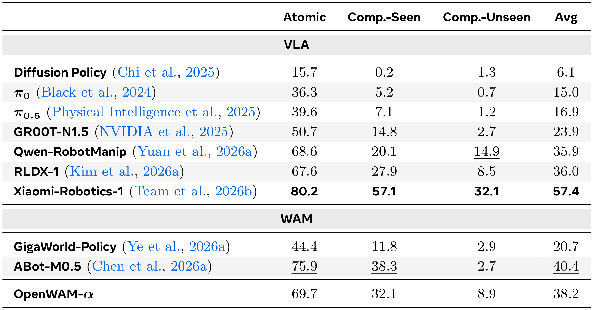

**Original:**

Table 19. **Evaluation Results on RoboCasa365.** Bold denotes best values, underline second best.

|  | **Atomic** | **Comp.-Seen** | **Comp.-Unseen** | **Avg** |
| --- | --- | --- | --- | --- |
| ***VLA*** | ***VLA*** | ***VLA*** | ***VLA*** | ***VLA*** |
| **Diffusion Policy**  (Chi et al., 2025) | 15.7 | 0.2 | 1.3 | 6.1 |
| **$\pi_0$**  (Black et al., 2024) | 36.3 | 5.2 | 0.7 | 15.0 |
| **$\pi_{0.5}$**  (Physical Intelligence et al., 2025) | 39.6 | 7.1 | 1.2 | 16.9 |
| **GR00T-N1.5**  (NVIDIA et al., 2025) | 50.7 | 14.8 | 2.7 | 23.9 |
| **Qwen-RobotManip**  (Yuan et al., 2026a) | 68.6 | 20.1 | 14.9 | 35.9 |
| **RLDX-1**  (Kim et al., 2026a) | 67.6 | 27.9 | 8.5 | 36.0 |
| **Xiaomi-Robotics-1**  (Team et al., 2026b) | **80.2** | **57.1** | **32.1** | **57.4** |
| ***WAM*** | ***WAM*** | ***WAM*** | ***WAM*** | ***WAM*** |
| **GigaWorld-Policy**  (Ye et al., 2026a) | 44.4 | 11.8 | 2.9 | 20.7 |
| **ABot-M0.5**  (Chen et al., 2026a) | 75.9 | 38.3 | 2.7 | 40.4 |
| **OpenWAM-$\alpha$** | 69.7 | 32.1 | 8.9 | 38.2 |

**中文:**

表 19：**RoboCasa365 评估结果。** 粗体表示最佳值，下划线表示次佳值。

|  | **原子任务** | **已见组合任务** | **未见组合任务** | **平均** |
| --- | --- | --- | --- | --- |
| ***VLA*** | ***VLA*** | ***VLA*** | ***VLA*** | ***VLA*** |
| **Diffusion Policy**  (Chi et al., 2025) | 15.7 | 0.2 | 1.3 | 6.1 |
| **$\pi_0$**  (Black et al., 2024) | 36.3 | 5.2 | 0.7 | 15.0 |
| **$\pi_{0.5}$**  (Physical Intelligence et al., 2025) | 39.6 | 7.1 | 1.2 | 16.9 |
| **GR00T-N1.5**  (NVIDIA et al., 2025) | 50.7 | 14.8 | 2.7 | 23.9 |
| **Qwen-RobotManip**  (Yuan et al., 2026a) | 68.6 | 20.1 | 14.9 | 35.9 |
| **RLDX-1**  (Kim et al., 2026a) | 67.6 | 27.9 | 8.5 | 36.0 |
| **Xiaomi-Robotics-1**  (Team et al., 2026b) | **80.2** | **57.1** | **32.1** | **57.4** |
| ***WAM*** | ***WAM*** | ***WAM*** | ***WAM*** | ***WAM*** |
| **GigaWorld-Policy**  (Ye et al., 2026a) | 44.4 | 11.8 | 2.9 | 20.7 |
| **ABot-M0.5**  (Chen et al., 2026a) | 75.9 | 38.3 | 2.7 | 40.4 |
| **OpenWAM-$\alpha$** | 69.7 | 32.1 | 8.9 | 38.2 |

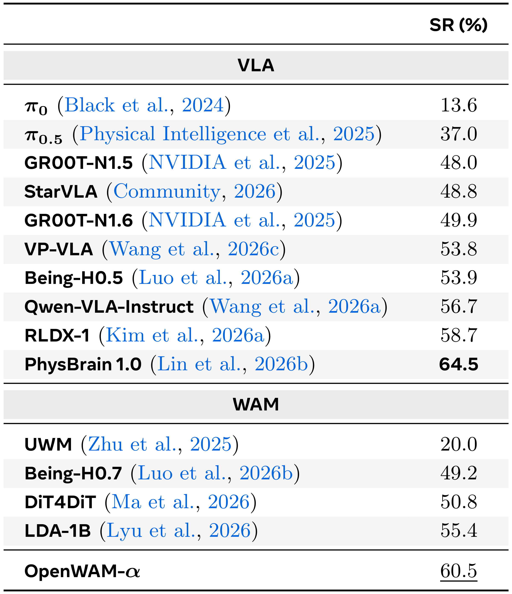

**Original:**

Table 20. **Evaluation Results on RoboCasa-GR1.** Bold denotes best values, underline second best.

|  | **SR (%)** |
| --- | --- |
| ***VLA*** | ***VLA*** |
| **$\pi_0$**  (Black et al., 2024) | 13.6 |
| **$\pi_{0.5}$**  (Physical Intelligence et al., 2025) | 37.0 |
| **GR00T-N1.5**  (NVIDIA et al., 2025) | 48.0 |
| **StarVLA**  (Community, 2026) | 48.8 |
| **GR00T-N1.6**  (NVIDIA et al., 2025) | 49.9 |
| **VP-VLA**  (Wang et al., 2026c) | 53.8 |
| **Being-H0.5**  (Luo et al., 2026a) | 53.9 |
| **Qwen-VLA-Instruct**  (Wang et al., 2026a) | 56.7 |
| **RLDX-1**  (Kim et al., 2026a) | 58.7 |
| **PhysBrain 1.0**  (Lin et al., 2026b) | **64.5** |
| ***WAM*** | ***WAM*** |
| **UWM**  (Zhu et al., 2025) | 20.0 |
| **Being-H0.7**  (Luo et al., 2026b) | 49.2 |
| **DiT4DiT**  (Ma et al., 2026) | 50.8 |
| **LDA-1B**  (Lyu et al., 2026) | 55.4 |
| **OpenWAM-$\alpha$** | 60.5 |

**中文:**

表 20：**RoboCasa-GR1 评估结果。** 粗体表示最佳值，下划线表示次佳值。

|  | **成功率 SR（%）** |
| --- | --- |
| ***VLA*** | ***VLA*** |
| **$\pi_0$**  (Black et al., 2024) | 13.6 |
| **$\pi_{0.5}$**  (Physical Intelligence et al., 2025) | 37.0 |
| **GR00T-N1.5**  (NVIDIA et al., 2025) | 48.0 |
| **StarVLA**  (Community, 2026) | 48.8 |
| **GR00T-N1.6**  (NVIDIA et al., 2025) | 49.9 |
| **VP-VLA**  (Wang et al., 2026c) | 53.8 |
| **Being-H0.5**  (Luo et al., 2026a) | 53.9 |
| **Qwen-VLA-Instruct**  (Wang et al., 2026a) | 56.7 |
| **RLDX-1**  (Kim et al., 2026a) | 58.7 |
| **PhysBrain 1.0**  (Lin et al., 2026b) | **64.5** |
| ***WAM*** | ***WAM*** |
| **UWM**  (Zhu et al., 2025) | 20.0 |
| **Being-H0.7**  (Luo et al., 2026b) | 49.2 |
| **DiT4DiT**  (Ma et al., 2026) | 50.8 |
| **LDA-1B**  (Lyu et al., 2026) | 55.4 |
| **OpenWAM-$\alpha$** | 60.5 |
