# RoboMemory: A Brain-inspired Multi-memory Agentic Framework for Interactive Environmental Learning in Physical Embodied Systems

> RoboMemory: A Brain-inspired Multi-memory Agentic Framework for Interactive Environmental Learning in Physical Embodied Systems — Lei et al. (2025). Source: https://arxiv.org/abs/2508.01415v7. License: CC-BY-NC-SA-4.0 (https://creativecommons.org/licenses/by-nc-sa/4.0/). Chinese translations and figure/table extraction are adaptations; no author endorsement is implied.

## 论文信息

**Original:**

Embodied intelligence aims to enable robots to learn, reason, and generalize robustly across complex real-world environments. However, existing approaches often struggle with partial observability, fragmented spatial reasoning, and inefficient integration of heterogeneous memories, limiting their capacity for long-horizon adaptation. To address this, we introduce RoboMemory, a brain-inspired framework that unifies Spatial, Temporal, Episodic, and Semantic memory within a parallelized architecture for efficient long-horizon planning and interactive learning. Its core innovations are a dynamic spatial knowledge graph for scalable, consistent memory updates and a closed-loop planner with a critic module for adaptive decision-making. Extensive experiments on EmbodiedBench show that RoboMemory, instantiated with Qwen2.5-VL-72B-Ins, improves the average success rate by 26.5% over its strong baseline and even surpasses the closed-source SOTA, Claude-3.5-Sonnet. Real-world trials further confirm its capability for cumulative learning, with performance consistently improving over repeated tasks. Our results position RoboMemory as a scalable foundation for memory-augmented embodied agents, bridging insights from cognitive neuroscience with practical robotic autonomy.

**中文:**

具身智能旨在让机器人能够在复杂的真实环境中稳健地学习、推理和泛化。然而，现有方法常受到部分可观测性、碎片化的空间推理，以及异构记忆难以高效整合等问题的限制，因而难以适应长时域任务。为此，我们提出受大脑启发的 RoboMemory 框架，在并行架构中统一空间、时间、情景和语义记忆，以支持高效的长时域规划与交互式学习。核心创新包括：用于可扩展、一致性记忆更新的动态空间知识图谱，以及配备评判模块、支持自适应决策的闭环规划器。在 EmbodiedBench 上的大量实验表明，以 Qwen2.5-VL-72B-Ins 为基础的 RoboMemory 相比强基线将平均成功率提高了 26.5%，甚至超过闭源先进模型 Claude-3.5-Sonnet。真实环境试验进一步证实了其累积学习能力：随着任务反复执行，性能持续改善。这些结果表明，RoboMemory 可为记忆增强型具身智能体提供可扩展的基础，将认知神经科学的启发与实际机器人自主能力联系起来。

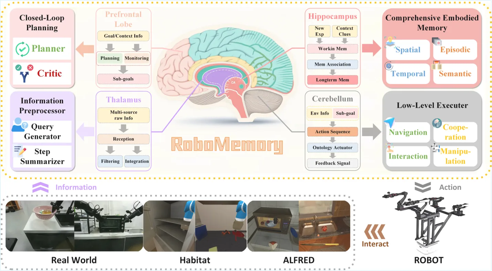

**Original:**

Figure 1: RoboMemory adopts a brain-inspired architecture that maps neural components to agent modules, enabling long-term planning and interactive learning across real-world, Habitat, and ALFRED environments and robotic hardware.

**中文:**

图 1：RoboMemory 采用受大脑启发的架构，将神经系统组成部分对应为智能体模块，支持在真实环境、Habitat、ALFRED 及机器人硬件上进行长期规划和交互式学习。

## 引言

**Original:**

Recent advances in Vision-Language Models (VLMs) [23, 6] have enabled their growing use in embodied tasks [33, 22]. VLM-based embodied agents can process multimodal inputs and generate high-level textual commands (e.g., “Pick up the cup”), which require translation via tool APIs to become executable robot actions. In contrast, Vision-Language-Action models (VLAs) [24, 8, 7, 13] produce low-level control signals directly but generally rely only on the latest observation. This limits their ability to perform long-horizon, multi-step tasks that require reasoning over task history. In summary, VLA models enable direct robot control but lack high-level planning capabilities, and VLM-based embodied agents support strategic planning but struggle with direct motor control. This highlights a key gap inherent in two distinct technical approaches to embodied intelligence.

**中文:**

视觉语言模型（VLM）的近期进展 [23, 6] 推动了其在具身任务中的应用 [33, 22]。基于 VLM 的具身智能体能够处理多模态输入，生成“拿起杯子”等高层文本命令；这些命令还需要经工具 API 转换，才能成为机器人可执行的动作。视觉语言动作模型（VLA）[24, 8, 7, 13] 则直接输出底层控制信号，但通常只依赖最近一次观测，因而难以完成需要结合任务历史推理的长时域、多步骤任务。也就是说，VLA 能直接控制机器人，却缺乏高层规划能力；基于 VLM 的具身智能体能够制定策略，却难以直接完成运动控制。这揭示了具身智能两条不同技术路线之间的关键缺口。

**Original:**

To bridge this gap, recent work [50, 34, 38] proposes a “VLM planner + VLA executor” paradigm. Here, VLM-based embodied agents serve as high-level planners that decompose complex tasks (e.g., “make a coffee”) into executable sub-instructions (e.g., “grasp the cup”) that VLAs can complete. Although this paradigm improves performance on multi-step tasks, prior work suffers from two key limitations in real-world settings. First, real-world tasks (e.g., kitchen operations) require navigating across multiple locations to gather objects and tools, but the environment remains only partially observable at any time due to robots’ limited field of view and dynamic occlusions. This necessitates a planner with robust spatial awareness and long-term memory to maintain a consistent spatial awareness across viewpoints. However, most VLM-based agents rely on chat-style context windows (e.g., logging instruction – feedback pairs [49]), which lack mechanisms for maintaining an overview of the environment’s spatial layout. Consequently, agents cannot reliably track object locations or recognize previously visited states. Second, pretrained VLMs are rarely trained on embodied planning trajectories, especially long-horizon, spatially grounded ones. So VLM-based agents often struggle to generalize to real-world settings [47]. To overcome these challenges, VLM-based planners must support interactive environmental learning — the ability to acquire, integrate, and retrieve spatial, episodic, and semantic knowledge during task execution, thereby enabling adaptation through experience. In summary, the current VLM–VLA paradigm still lacks (1) a robust spatial and long-term memory mechanism to maintain a consistent view of the environment, and (2) an effective way to acquire and leverage embodied planning experience for generalization.

**中文:**

为弥合这一缺口，近期工作 [50, 34, 38] 提出“VLM 规划器 + VLA 执行器”范式。基于 VLM 的具身智能体充当高层规划器，把“煮咖啡”等复杂任务分解为“抓起杯子”等 VLA 能执行的子指令。虽然这一范式改善了多步骤任务的表现，但在真实环境中仍有两个主要局限。第一，厨房操作等真实任务需要在多个位置之间移动，收集物体和工具；由于机器人视野有限且存在动态遮挡，任一时刻都只能观察到环境的一部分。因此，规划器需要稳健的空间感知能力和长期记忆，才能在视角变化时保持一致的空间认知。然而，多数 VLM 智能体依赖类似聊天记录的上下文窗口，例如保存“指令—反馈”对 [49]，缺少维护整体空间布局的机制，因而无法可靠跟踪物体位置或识别已访问过的状态。第二，预训练 VLM 很少使用具身规划轨迹训练，尤其缺少长时域、与空间情境紧密相关的轨迹，因此往往难以泛化到真实环境 [47]。要解决这些问题，VLM 规划器必须支持交互式环境学习，即在任务执行中获取、整合和检索空间、情景与语义知识，通过经验实现适应。当前 VLM–VLA 范式仍缺少：(1) 用于维持一致环境认知的稳健空间记忆与长期记忆机制；(2) 获取和利用具身规划经验以实现泛化的有效方法。

**Original:**

To address these challenges, we propose RoboMemory, a brain-inspired memory framework designed to bridge the gap between biological cognitive mechanisms and robotic embodied intelligence. Drawing on foundational cognitive theories, we recognize that human memory is inherently organized into a tiered architecture rather than a flat buffer: sensory memory captures transient perceptual inputs [37], short-term working memory handles immediate information manipulation [4, 5], and long-term memory provides persistent storage for episodic events and semantic facts [3, 43]. Neuroscientific research further reveals that specialized brain regions underpin these functions: the thalamus integrates multimodal sensory inputs, the hippocampus consolidates spatial and episodic experiences into long-term storage [29], the prefrontal cortex regulates high-level planning based on retrieval, and the cerebellum coordinates low-level motor execution. Mimicking this biological hierarchy to ensure layered information processing, our recipe for this generalist memory system consists of four key stages (Figure 1): 1) Information Preprocessing (Thalamus-inspired), which integrates multimodal sensory inputs for downstream processing; 2) Comprehensive Embodied Memory (Hippocampus-inspired), which organizes experiential and spatial knowledge through a three-tier structure (sensory, short-term, and long-term). Crucially, we design four parallel-update modules (Spatial, Temporal, Episodic, and Semantic) to minimize latency while ensuring data consistency; 3) Closed-Loop Planning (Prefrontal Cortex-inspired), where the planner utilizes retrieved memory to generate high-level action sequences; 4) Low-level Execution (Cerebellum-inspired), which translates plans into precise robot actions using VLA models and SLAM-based navigation.

**中文:**

针对这些问题，我们提出受大脑启发的记忆框架 RoboMemory，旨在联系生物认知机制与机器人具身智能。基础认知理论指出，人类记忆具有分层结构，而不是一个平铺的缓冲区：感觉记忆捕获短暂的感知输入 [37]，短期工作记忆处理当下的信息操作 [4, 5]，长期记忆则持久保存情景事件和语义事实 [3, 43]。神经科学研究进一步表明，这些功能由不同脑区支持：丘脑整合多模态感觉输入，海马将空间和情景经验巩固到长期存储中 [29]，前额叶皮层利用检索结果调控高层规划，小脑协调底层运动执行。我们仿照这一生物层级进行分层信息处理，将通用记忆系统设计为四个阶段（图 1）：1）信息预处理，受丘脑启发，整合多模态感知输入供后续模块使用；2）综合具身记忆，受海马启发，通过感觉、短期和长期三层结构组织经验与空间知识。其中，空间、时间、情景和语义四个模块并行更新，在保证数据一致性的同时降低延迟；3）闭环规划，受前额叶皮层启发，利用检索记忆生成高层动作序列；4）底层执行，受小脑启发，通过 VLA 模型和基于 SLAM 的导航，将计划转化为精确的机器人动作。

**Original:**

While recent frameworks [39, 18, 45, 1, 16, 54, 10] have integrated Retrieval-Augmented Generation (RAG) to enhance planning, they suffer from a critical limitation: most are tailored for simulated environments or rely on flat, text-based retrieval that fails to capture the spatial complexity of the physical world. These approaches often lack a hierarchical structure, leading to inefficiencies in long-term knowledge accumulation. Moreover, existing multi-module systems [38, 1] typically incur significant inference latency due to sequential memory updates. In contrast, our framework leverages a parallel-update paradigm and a hierarchical organization, enabling the agent to maintain a dynamic, spatially-aware worldview in real-time, which is essential for robust interaction in dynamic environments.

**中文:**

近期框架 [39, 18, 45, 1, 16, 54, 10] 虽然引入检索增强生成（RAG）来改善规划，却存在一个关键局限：多数专门面向仿真环境，或依赖平铺的文本检索，无法表达物理世界复杂的空间结构。这些方法往往缺少层级组织，长期知识积累的效率因此受限。此外，现有多模块系统 [38, 1] 通常按顺序更新记忆，造成较大的推理延迟。我们的框架结合并行更新与分层组织，让智能体实时维护动态的空间环境认知，这对于在动态环境中稳健交互十分重要。

**Original:**

We evaluate RoboMemory on EmbodiedBench, a challenging long-horizon planning benchmark [47]. Using Qwen2.5-VL-72B as the base model, RoboMemory achieves state-of-the-art results, improving average success rates by 26.5% over the baseline and outperforming the closed-source Claude3.5-Sonnet [2]. In real-world deployments, our system demonstrates the capacity for continuous improvement: by executing diverse tasks sequentially without memory resets, the agent effectively learns from environmental familiarization.

**中文:**

我们在具有挑战性的长时域规划基准 EmbodiedBench 上评估 RoboMemory [47]。采用 Qwen2.5-VL-72B 作为基础模型时，RoboMemory 达到当前先进水平：平均成功率相比基线提高 26.5%，并超过闭源 Claude3.5-Sonnet [2]。真实环境部署也展现出持续改进能力：系统连续执行不同任务而不重置记忆，使智能体能够在逐渐熟悉环境的过程中有效学习。

**Original:**

Our main contributions are three-fold:

**中文:**

本文的主要贡献包括三个方面：

**Original:**

We propose RoboMemory, a brain-inspired, unified embodied memory system that integrates four parallel update modules into a single framework. It enables efficient, comprehensive memory operations and coherent knowledge integration, which are critical for interactive environmental learning in real-world embodied scenarios.

**中文:**

我们提出 RoboMemory，将四个并行更新模块整合为受大脑启发的统一具身记忆系统。该系统支持高效、全面的记忆操作以及相互一致的知识整合，为真实具身场景中的交互式环境学习提供关键能力。

**Original:**

We design a retrieval-based incremental update algorithm for the real-time evolution of Spatial Knowledge Graphs (KGs). This algorithm bridges the gap between static knowledge representation and dynamic embodied interaction, establishing KGs as a practical and scalable modality for Spatial Memory. By retrieving relevant subgraphs, detecting local inconsistencies, and merging new observations, our method ensures efficient maintenance and overcomes the scalability bottlenecks that previously hindered KG-based approaches.

**中文:**

我们设计了基于检索的增量更新算法，使空间知识图谱（KG）能够实时演化。该算法连接了静态知识表示与动态具身交互，让知识图谱成为实用、可扩展的空间记忆形式。通过检索相关子图、检测局部不一致并合并新观测，我们的方法高效维护知识图谱，克服以往基于 KG 的方法所面临的可扩展性瓶颈。

**Original:**

RoboMemory supports interactive environmental learning in real-world environments. It enables sequential diverse tasks without memory reset, with experience accumulation driving steady performance improvements, demonstrating practical long-term autonomous learning in physical scenarios.

**中文:**

RoboMemory 支持真实环境中的交互式环境学习，可以连续执行多种任务而不重置记忆。经验积累推动性能稳步提高，体现了物理场景中具有实用性的长期自主学习能力。

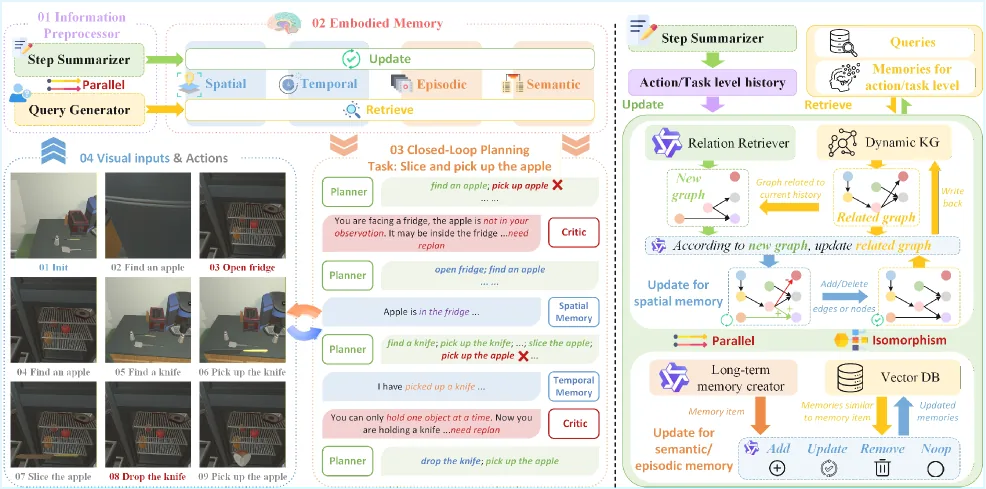

**Original:**

Figure 2: (a) Left: The loop where the Planner, Critic, and Comprehensive Embodied Memory interact to adjust plans based on real-time visual inputs. Colored text denotes the execution status of actions (success/rejected/replanned). (b) Right: Spatial memory maintains a relevance/similarity-updated KG, and Semantic/Episodic memory manages a Vector DB with analogous logic. Besides, Temporal memory is implemented as a linear FIFO buffer that stores step-wise summaries generated by the Step Summarizer.

**中文:**

图 2：(a) 左侧：规划器、评判器和综合具身记忆相互协作，根据实时视觉输入调整计划。彩色文字表示动作执行状态：成功、被否决或重新规划。(b) 右侧：空间记忆维护一个依据相关性与相似性更新的知识图谱；语义记忆和情景记忆采用类似逻辑管理向量数据库。时间记忆则是一个线性的先进先出（FIFO）缓冲区，保存步骤摘要器生成的逐步摘要。

## 相关工作

**Original:**

The rapid advancement of VLMs/LLMs has led to diverse agent frameworks in embodied environments [49, 36, 26]. Embodied tasks involve partial observability and long-horizon planning, requiring memory systems to retain context. Some use time-ordered context buffers for short-term memory (due to VLMs/LLMs’ limited long-context processing) [49, 32]; others adopt experience buffers as long-term semantic memory [16, 35]. For long-duration tasks, skill libraries serve as procedural memory, with agents accumulating skills via interaction [45, 39]. However, in real-world settings, the low-level executor may fail to complete the task, making it challenging to construct a reusable, code-based skill library. So, explicit procedural memory still needs to be improved in real-world settings. Moreover, Recent efforts integrate diverse memories [51, 39, 1] but focus on virtual/GUI environments, leaving real-world multi-modal memory support for long-term planning under-explored.

**中文:**

VLM/LLM 的快速发展催生了多种面向具身环境的智能体框架 [49, 36, 26]。具身任务具有部分可观测性，并需要长时域规划，因此必须用记忆系统保留情境信息。一些方法使用按时间排序的上下文缓冲区作为短期记忆，以应对 VLM/LLM 长上下文处理能力有限的问题 [49, 32]；另一些采用经验缓冲区作为长期语义记忆 [16, 35]。对于持续时间较长的任务，技能库可以充当程序性记忆，智能体通过交互不断积累技能 [45, 39]。但在真实环境中，底层执行器可能无法完成任务，因此很难构建可复用的代码技能库，显式程序性记忆仍有改进空间。此外，近期虽然已有工作整合多种记忆 [51, 39, 1]，却主要关注虚拟环境或图形界面；如何以真实环境中的多模态记忆支持长期规划，仍缺乏充分研究。

**Original:**

Spatial information is critical for embodied agents. Prior work has explored three main representations, each with inherent limitations that motivate our high-level abstractions: 2D Semantic Maps encode environments as pixel grids [51]. As the semantic maps are flattened, they discard 3D relationships (e.g., “above/beneath”) and precise geometry, limiting expressiveness for manipulation tasks requiring fine-grained spatial reasoning. 3D Point Clouds preserve accurate 3D information [52]. However, a 3D point cloud only encodes low-level spatial information. We need to put in extra effort to help agents understand 3D Point Clouds. Semantic Scene Graphs [38, 28, 19, 48, 20] offering a compact, high-level representation directly amenable to planning. However, existing methods suffer from two key drawbacks: (1) Most previous methods adopt rigid tree-like structures, which are easy to update with new information, but cannot model non-hierarchical or cyclic spatial configurations. (2) Some previous methods try to use general graphs to store various spatial information. [20] However, their design often lacks efficient dynamic update mechanisms—adding or modifying relations typically requires expensive full-graph recomputation, creating a scalability bottleneck for real-time embodied interaction.

**中文:**

空间信息对具身智能体至关重要。已有工作主要探索三类表示，它们各自的局限促使我们采用更高层次的抽象。二维语义地图把环境编码为像素网格 [51]，但平面化表示丢失了“上方/下方”等三维关系及精确几何信息，限制了它对需要细粒度空间推理的操作任务的表达能力。三维点云能够保留准确的三维信息 [52]，却只编码底层空间信息，还需要额外设计才能让智能体理解。语义场景图 [38, 28, 19, 48, 20] 提供精简的高层表示，可直接用于规划，但现有方法有两个主要不足：(1) 多数采用固定的树状结构，虽便于加入新信息，却无法表示非层级或带环的空间结构；(2) 一些方法尝试用一般图保存多种空间信息 [20]，但常缺少高效动态更新机制，增加或修改关系通常需要代价较高的全图重算，成为实时具身交互中的可扩展性瓶颈。

**Original:**

For clarity, we summarize the differences among different memory systems in the previous work. The comparison is shown in Table III in the appendix. Additionally, we provide more ablation studies in Appendix -A.

**中文:**

为便于比较，我们总结了既有工作中不同记忆系统的差异，见附录表 III。此外，附录 -A 给出了更多消融研究。

## RoboMemory

**Original:**

RoboMemory is a hierarchical embodied agent system that equips robots with three core memory capabilities: historical interaction logs, dynamically updated spatial layouts, and accumulated task knowledge. As illustrated in Figure 2, in each iteration, RoboMemory follows a process of “Perception – Memory – Retrieval – Planning – Execution” process, ensuring that the agent continuously calibrates its memory and behavior in dynamic environments.

**中文:**

RoboMemory 是一个分层的具身智能体系统，为机器人提供三项核心记忆能力：记录历史交互、动态更新空间布局，以及积累任务知识。如图 2 所示，每次迭代依次经历“感知—记忆—检索—规划—执行”，使智能体能在动态环境中持续校准记忆和行为。

**Original:**

First, the information preprocessor converts multimodal sensor inputs into a textual summary of the current scene, which serves as the primary input to the Comprehensive Embodied Memory. Next, the Comprehensive Embodied Memory updates its internal representations, including action histories, object locations, and experiential knowledge. After updating the information, the memory system retrieves contextually relevant entries to inform the Closed-Loop Planning Module. Then, leveraging this contextual memory, the Closed-Loop Planning Module generates high-level, text-based action instructions. Finally, these commands are dispatched to low-level executors, which directly control the robot and complete the instructions. The execution process is demonstrated in Algorithm 1 in the appendix.

**中文:**

首先，信息预处理器将多模态传感器输入转化为当前场景的文字摘要，作为综合具身记忆的主要输入。接着，综合具身记忆更新动作历史、物体位置和经验知识等内部表示，并检索与当前情境相关的条目，提供给闭环规划模块。规划模块利用这些记忆，生成高层文本动作指令。最后，指令被发送给底层执行器，由其直接控制机器人完成动作。执行过程见附录算法 1。

**Original:**

At each time step $t$, RoboMemory receives a visual observation $\mathcal{O}_{t}$: an RGB frame (in simulation) or a short video clip (on physical robots), representing the agent’s observations. Since raw visual data is unsuitable for direct use in memory construction and retrieval, RoboMemory first employs an information preprocessor to convert multimodal observations into textual representations, thereby providing a semantic interface for subsequent memory and planning modules. The information preprocessor executes two Vision-Language Models (VLMs) in parallel: (1) Step summarizer $\mathcal{S}$: It transforms $\mathcal{O}_{t}$ into a concise textual description $s_{t}$ of the just-executed action. The string $s_{t}$ is stored in the system’s working memory. (2) Query generator $\mathcal{Q}$: It derives a list of queries $q_{t}=[q_{t}^{(1)},q_{t}^{(2)},\dots,q_{t}^{(N)}]$ from the same observation $\mathcal{O}_{t}$. Each query $q^{(i)}_{t}$ is a natural language-based query. These queries are used to query information from the memory system that may be useful.

**中文:**

在每个时间步 $t$，RoboMemory 接收视觉观测 $\mathcal{O}_{t}$：仿真中为一帧 RGB 图像，真实机器人上则为一段短视频。原始视觉数据不适合直接用于记忆构建和检索，因此系统先通过信息预处理器将多模态观测转换为文本表示，为后续记忆与规划模块提供语义接口。预处理器并行运行两个视觉语言模型（VLM）：(1) 步骤摘要器 $\mathcal{S}$，将 $\mathcal{O}_{t}$ 转换为对刚执行动作的简短文字描述 $s_{t}$，并把字符串 $s_{t}$ 存入系统工作记忆；(2) 查询生成器 $\mathcal{Q}$，根据同一观测 $\mathcal{O}_{t}$ 生成查询列表 $q_{t}=[q_{t}^{(1)},q_{t}^{(2)},\dots,q_{t}^{(N)}]$。每个 $q^{(i)}_{t}$ 都是一条自然语言查询，用于从记忆系统中查找可能有用的信息。

**Original:**

Together, $\mathcal{S}$ and $\mathcal{Q}$ provide a swift, text-based interface between raw sensory data and provide basic information in each iteration for RoboMemory’s Comprehensive Embodied Memory System.

**中文:**

$\mathcal{S}$ 与 $\mathcal{Q}$ 共同提供一个快速的文本接口，将原始感知数据连接到记忆系统，并在每次迭代中为 RoboMemory 的综合具身记忆系统提供基本信息。

**Original:**

To address the long-term memory limitations in current embodied agent frameworks, we propose the Comprehensive Embodied Memory System. This system consists of multiple memory modules. We denote the memory system containing $L$ distinct modules as $M_{t}=[M_{t}^{(1)},M_{t}^{(2)},...,M_{t}^{(L)}]$, where $M_{t}$ represents the memory stored at step $t$, and $M_{t}^{(l)}$ denotes the $l$-th memory module. Generally, the update and retrieval process at iteration $t$ of a general memory is shown below:

**中文:**

为解决现有具身智能体框架的长期记忆局限，我们提出综合具身记忆系统，由多个记忆模块组成。将包含 $L$ 个不同模块的系统记为 $M_{t}=[M_{t}^{(1)},M_{t}^{(2)},...,M_{t}^{(L)}]$，其中 $M_{t}$ 是第 $t$ 步保存的记忆，$M_{t}^{(l)}$ 是第 $l$ 个记忆模块。一般而言，第 $t$ 次迭代的记忆更新与检索过程如下：

**Original:**

$$
M_{t}=\mathcal{U}(M_{t-1},s_{t})
$$

 (1)

**中文:**

公式（符号保持不变）：

$$
M_{t}=\mathcal{U}(M_{t-1},s_{t})
$$

 (1)

**Original:**

$$
r_{t}=\mathcal{R}(M_{t},q_{t})
$$

 (2)

**中文:**

公式（符号保持不变）：

$$
r_{t}=\mathcal{R}(M_{t},q_{t})
$$

 (2)

**Original:**

First, we update memory modules with memory update algorithm $\mathcal{U}$, where we update the previous memory $M_{t-1}$ using the latest summarization $s_{t}$. Then, with updated $M_{t}$, we use memory retrieve algorithm $\mathcal{R}$ to retrieve the information that is useful for the planning module. In $\mathcal{R}$, we use queries $q_{t}$ to query $M_{t}$, yielding retrieval results from each module: $r_{t}=[r_{t}^{(1)},r_{t}^{(2)},...,r_{t}^{(L)}]$. These results are then passed to the planning module, which helps it plan future movements. However, sequentially updating and retrieving from $L$ modules would be a slow process. Therefore, we parallelize these steps across all modules, which significantly enhance the efficiency of the memory system.

**中文:**

首先，记忆更新算法 $\mathcal{U}$ 利用最新摘要 $s_{t}$ 更新上一时刻的记忆 $M_{t-1}$。然后，记忆检索算法 $\mathcal{R}$ 从更新后的 $M_{t}$ 中获取对规划模块有用的信息：在 $\mathcal{R}$ 中，以 $q_{t}$ 查询 $M_{t}$，得到各模块的检索结果 $r_{t}=[r_{t}^{(1)},r_{t}^{(2)},...,r_{t}^{(L)}]$，再将这些结果交给规划模块，辅助规划后续动作。如果依次更新和检索 $L$ 个模块，整个过程会很慢。因此，我们在不同模块之间并行执行这些步骤，显著提高记忆系统的效率。

**Original:**

The memory system consists of four distinct modules ($L=4$): Temporal Memory, Spatial Memory, Semantic Memory, and Episodic Memory. For efficiency, all memory modules are updated and retrieved in parallel. Thus, even with multiple modules, the system remains highly efficient. Functionally, inspired by cognitive psychology [27], our modules handle memory at different levels. In cognitive psychology, memory is divided into Sensory Memory, Short-term Memory, and Long-term Memory. Mirroring this hierarchy, our modules are organized as follows. First of all, the step summarizer $\mathcal{S}$ summarizes the agent’s interactions with the environment at each iteration. It acts as Sensory Memory. Secondly, Temporal Memory and Spatial Memory function as short-term memory. These two memories will be updated at each iteration. They are designed to store the information of sensory memory in every iteration. For Temporal Memory, we record the agent’s action history sequentially, while for Spatial Memory, we dynamically record the spatial relationships between different objects in the environment based on Sensory Memory. These memories can provide a relatively long and detailed history of the current task for the Closed-Loop Planner to make a future plan. Thirdly, Semantic Memory and Episodic Memory serve as Long-term Memory. They are updated only when meaningful information arises (e.g., after task completion). These memories store highly abstract knowledge, not limited to the current task, but synthesized from past experiences. This knowledge—factual, event-based, and experiential—improves the agent’s future task performance. It is the source of RoboMemory’s interactive learning capability. We now detail each module.

**中文:**

记忆系统由四个不同模块组成（$L=4$）：时间记忆、空间记忆、语义记忆和情景记忆。各模块并行更新与检索，因此即使包含多个模块，系统仍可保持高效。从功能上看，这些模块借鉴认知心理学 [27]，处理不同层次的记忆。认知心理学将记忆分为感觉记忆、短期记忆和长期记忆，我们据此组织模块。首先，步骤摘要器 $\mathcal{S}$ 在每次迭代中概括智能体与环境的交互，承担感觉记忆的作用。其次，时间记忆和空间记忆承担短期记忆的作用，每次迭代都会更新，保存当次感觉记忆提供的信息。时间记忆按顺序记录智能体的动作历史；空间记忆则根据感觉记忆，动态记录环境中不同物体之间的空间关系。这两种记忆为闭环规划器提供当前任务较长且详细的历史，供其制定后续计划。最后，语义记忆和情景记忆承担长期记忆的作用，仅在出现有意义的信息时更新，例如任务完成后。它们保存从过去经验中综合提炼的高度抽象知识，而不限于当前任务。这些关于事实、事件和经验的知识能够改善后续任务表现，也是 RoboMemory 交互式学习能力的来源。下面分别介绍各模块。

**Original:**

Temporal Memory. In the Temporal Memory, we record interactions between the robot and the environment (i.e., Sensory Memory) of each iteration sequentially. This information can provide the embodied agent with simple awareness of “What I have done”. For such temporally sequential memory, a simple structure is sufficient: a sequential buffer with automatic summarization triggered when the record sequence reaches its capacity. In a specific design, temporal memory can store up to $N$ interaction summaries, each generated by an information preprocessor. When the buffer is full, we compress the oldest $N$ steps into a single summarized entry using a VLM, which is then reinserted at the front of the buffer, ensuring continuous context retention without unbounded growth. However, the information from previous memories will gradually be lost as we summarize it multiple times. For retrieval, we provide all existing memory in text to downstream modules.

**中文:**

时间记忆。该模块按顺序记录每次迭代中机器人与环境的交互，也就是感觉记忆所提供的内容，使具身智能体知道“自己已经做过什么”。对于这种按时间排列的记忆，只需使用顺序缓冲区，并在记录达到容量上限时自动概括即可。具体而言，时间记忆最多保存 $N$ 条由信息预处理器生成的交互摘要。缓冲区满后，VLM 将最早的 $N$ 个步骤压缩为一条摘要，再放回缓冲区开头，从而持续保留上下文，同时避免容量无限增长。不过，多次概括会使较早记忆中的信息逐渐丢失。检索时，系统将当前保留的全部记忆以文本形式交给后续模块。

**Original:**

Spatial Memory. The spatial memory is designed to dynamically record the high-level spatial relationships of different entities in the environment. However, current spatial memory approaches often rely on RGB-D cameras to reconstruct 3D point clouds [51, 9]. These representations are too detailed for high-level planning in embodied agents. For example, precise geometric relationships (e.g., exact distances between objects) are unnecessary.

**中文:**

空间记忆。该模块动态记录环境中不同实体之间的高层空间关系。现有空间记忆方法常依赖 RGB-D 相机重建三维点云 [51, 9]，但对具身智能体的高层规划而言，这些表示过于细致。例如，物体间准确距离这类精确几何关系并非必要。

**Original:**

To address these problems, we use a dynamic KG to store high-level spatial information: objects and positions in the environment become vertices of the KG, and spatial relations between objects or positions are encoded as edges. The KG focuses on high-level spatial relations (e.g., “cup on table”, “key left of drawer”). By these settings, spatial KG focuses on semantically meaningful, task-relevant relations. This spatial information enhances the agent’s spatial reasoning capability in dynamic environments.

**中文:**

为此，我们用动态知识图谱保存高层空间信息：环境中的物体和位置表示为顶点，物体或位置之间的空间关系表示为边。知识图谱重点记录“杯子在桌上”“钥匙在抽屉左侧”等高层空间关系，因此关注的是具有语义意义、与任务相关的关系。这些空间信息能增强智能体在动态环境中的空间推理能力。

**Original:**

However, as related work shows, most KG construction algorithms are designed for static long content. This does not meet the demand of using KG as spatial memory for the agent. The KG needs to update efficiently in response to new information. To address this issue, we introduce a retrieval-driven, incremental KG update algorithm that maintains a locally modifiable, globally consistent, and dynamically adaptive spatial memory. As illustrated in the right panel of Figure 2, the update process proceeds in four steps: (1) retrieves the most relevant sub-KG around new observations. (2) Injects new relations from the current observation by a VLM-based Relation Retriever. (3) Detects and resolves conflicts between newly extracted relations and existing ones (e.g., “cup on table” vs. “cup in drawer”) using a VLM-based resolver, which decides whether to add, delete, or modify edges. (4) Merges back and prunes isolated vertices. Moreover, our retrieval-based incremental update algorithm is accompanied by provable efficiency guarantees. For a KG with $n$ vertices and maximum degree $D$, the number of vertices processed per update is bounded by $O(D^{K})$, where $K$ is the retrieval hop distance (see Appendix -D for analysis). Further implementation details are provided in Appendix -C1.

**中文:**

不过，如相关工作所示，多数知识图谱构建算法面向静态长文本，不能满足智能体将知识图谱作为空间记忆的需求：知识图谱需要随新信息高效更新。我们因此提出检索驱动的增量更新算法，维护可局部修改、全局一致且能动态适应的空间记忆。如图 2 右侧所示，更新分为四步：(1) 检索与新观测最相关的局部子图；(2) 通过基于 VLM 的关系检索器，从当前观测中加入新关系；(3) 利用基于 VLM 的冲突解决器，检测并处理新旧关系间的冲突，例如“杯子在桌上”与“杯子在抽屉里”，决定增加、删除还是修改边；(4) 将结果合并回原图，并删除孤立顶点。此外，该增量更新算法具有可证明的效率保证：对于含 $n$ 个顶点、最大度数为 $D$ 的知识图谱，每次更新处理的顶点数量上界为 $O(D^{K})$，其中 $K$ 是检索的跳数范围，分析见附录 -D。更多实现细节见附录 -C1。

**Original:**

Semantic Memory. In cognitive psychology, semantic memory stores time-independent facts. These facts are stable, update slowly, and require long-term retention. In RoboMemory, semantic memory records task-relevant experiences and environmental knowledge during execution. This information can help RoboMemory adapt to new environments or tasks. This information is highly abstract and does not need to be updated frequently. In RoboMemory, semantic memory updates when new information is encountered during execution, for example, after completing a subtask or encountering important information. To store and update memory efficiently, we design a memory management system based on a vector database (DB). In the vector DB, each experience/fact is described in natural language (denoted as a memory item). Each memory item is converted into a semantic vector for querying. For dynamic updates, we adapt a basic method from prior work [12]. However, we adopt it into the embodied environment. As shown in the bottom-right of Figure 2, the semantic memory update algorithm involves two VLM-based modules. Firstly, the Long-term Memory Creator generates new memory items based on short-term memory. We retrieve the top-$S$ most similar existing memory items from existing memory via cosine similarity. A VLM-based updater then compares new and existing items to decide whether to: add the new item, update an existing item, remove an outdated item, or perform Noop (if redundant). Since updates only involve a maximum of $S$ previous memory items and the update process is parallelized across all memory modules, this update method ensures that semantic memory remains efficient even as the database grows. For retrieval, we use the same process as a traditional vector DB. We use queries to extract top-$N$ relevant information for downstream modules.

**中文:**

语义记忆。在认知心理学中，语义记忆保存不依赖特定时间的事实。这些事实较稳定、更新较慢，需要长期保留。RoboMemory 的语义记忆记录执行中与任务有关的经验和环境知识，帮助系统适应新任务或新环境。这些信息高度抽象，无须频繁更新；当执行中遇到新信息，例如完成一个子任务或发现重要信息时，语义记忆才会更新。为高效存储和更新记忆，我们设计了基于向量数据库（DB）的管理系统。每条经验或事实以自然语言描述，称为一个记忆项，并转换为语义向量以供查询。动态更新借鉴已有工作 [12] 的基础方法，并将其适配到具身环境。如图 2 右下角所示，更新涉及两个基于 VLM 的模块。长期记忆创建器首先依据短期记忆生成新记忆项；系统再按余弦相似度检索最相似的 $S$ 条已有记忆。随后，VLM 更新器比较新旧条目，决定添加新条目、修改已有条目、删除过时条目，或在信息重复时不做操作（Noop）。每次更新最多涉及 $S$ 条已有记忆，且各记忆模块并行更新，因此数据库增长后仍能保持效率。检索采用传统向量数据库的方式，按查询返回最相关的 $N$ 条信息，供后续模块使用。

**Original:**

Episodic Memory. In cognitive psychology, Episodic Memory is another important part of long-term memory. It can store task-specific execution summaries (i.e., “autobiographical” records of past attempts). In RoboMemory, the Episodic Memory module is responsible for recording every interaction trajectory it has gone through, including the sequence of actions the robot did and the feedback from the environment. The trajectory information can help to improve the planning ability of RoboMemory. For example, if a trajectory for completing a similar task is stored in episodic memory, it can guide the agent in completing the current task. As the agent only needs to follow the successful trajectory in the memory, it can reduce hallucinations or errors in the VLM planner. Technically, Episodic Memory shares the same storage and VLM-driven vector DB update mechanism as Semantic Memory, ensuring consistent architectural design.

**中文:**

情景记忆。在认知心理学中，情景记忆是长期记忆的另一重要组成部分，保存具体任务的执行摘要，即对过去尝试的“自传式”记录。在 RoboMemory 中，该模块记录经历过的每条交互轨迹，包括机器人的动作顺序和环境反馈。这些轨迹有助于提高规划能力。例如，若情景记忆保存了一个类似任务的完成轨迹，就能指导当前任务；智能体沿用记忆中的成功轨迹，可以减少 VLM 规划器的幻觉或错误。实现上，情景记忆与语义记忆采用相同的存储方式和由 VLM 驱动的向量数据库更新机制，使架构保持一致。

**Original:**

The Closed-Loop Planning Module integrates information about the current task provided by the Spatial-Temporal Memory, Semantic and Episodic information recorded in long-term memory, and current observations to perform action planning. Each action is planned and passed on to the low-level executor for execution.

**中文:**

闭环规划模块结合空间与时间记忆提供的当前任务信息、长期记忆中的语义与情景信息，以及当前观测来规划动作。每个规划好的动作都会交给底层执行器执行。

**Original:**

To enable closed-loop control in embodied environments, the Closed-Loop Planning Module adopts the Planner-Critic mechanism [25], which consists of the planner and the critic module which is powerd by same VLM model with different prompts. We denote the planner module as $\mathcal{P}$, while the critic module as $\mathcal{C}$. For each planning step, the planner generates a long-term plan consisting of multiple steps. However, due to the dynamics of embodied environments, the action sequence in the long-term plan may become outdated during the execution of the plan. Thus, before executing each step, we use the Critic model to evaluate whether the proposed action in this step remains appropriate under the latest environment. If not, the planner will re-plan based on the latest information. The demonstration of this process is shown in Figure 2.

**中文:**

为实现具身环境中的闭环控制，规划模块采用 Planner-Critic 机制 [25]。规划器与评判器使用同一个 VLM，但提示不同，分别记为 $\mathcal{P}$ 和 $\mathcal{C}$。每次规划时，规划器生成由多个步骤构成的长期计划。然而，具身环境会动态变化，计划执行过程中原定动作序列可能已经不再适用。因此，每一步执行前，评判器都会判断该动作在最新环境中是否仍然合适；若不合适，规划器便依据最新信息重新规划。图 2 展示了这一过程。

**Original:**

However, our experiments reveal that the original Planner-Critic mechanism may suffer from infinite loops. In the original mechanism, the first step of the action sequence output by the Planner is evaluated by the Critic before execution, which can lead to an infinite loop: if the Critic always demands replanning, no action will ever be executed. To address this, we modify the Planner-Critic mechanism so that the first step is not evaluated by the Critic. This ensures that even if the Critic persistently demands replanning, the RoboMemory will still execute actions. The detailed algorithm is shown in Algorithm 1 in the appendix.

**中文:**

实验发现，原始 Planner-Critic 机制可能陷入无限循环：规划器输出的动作序列连第一步也要先交评判器检查，如果评判器总要求重新规划，就始终不会执行任何动作。为解决这一问题，我们修改了该机制，使每次生成计划的第一步不接受评判器检查。即便评判器持续要求重新规划，RoboMemory 也仍能执行动作。详细流程见附录算法 1。

**Original:**

The RoboMemory is a two-layer hierarchical agent framework that accomplishes longer-term tasks in the real world. The upper layer is responsible only for high-level planning, while the Low-level Executor carries out the actions planned by the upper layer in the real environment.

**中文:**

RoboMemory 采用两层智能体架构，在真实环境中完成较长时域的任务。上层只负责高层规划，底层执行器则在真实环境中执行上层规划的动作。

**Original:**

We employ a LoRA-finetuned VLA model, $\pi_{0}$ [21, 8], to generate manipulation actions, and a SLAM-based navigation model for locomotion. The low-level executor then translates high-level actions planned by RoboMemory into concrete arm and chassis movements in the real world.

**中文:**

我们使用经 LoRA 微调的 VLA 模型 $\pi_{0}$ [21, 8] 生成操作动作，使用基于 SLAM 的导航模型控制移动。底层执行器据此把 RoboMemory 规划的高层动作，转化为真实环境中的机械臂和底盘运动。

**Original:**

**TABLE I: Comparison of Success Rates (SR) and Goal Condition Success Rates (GC) across difficulty levels (Base/Long) on EB-ALFRED and EB-Habitat benchmarks. Values are reported in percentages (%).**

| Method | Type |  | EB-ALFRED | EB-Habitat |  |  |  |  |  |  |  |
| --- | --- | --- | --- | --- | --- | --- | --- | --- | --- | --- | --- |
| Average | Base | Long | Base | Long |  |  |  |  |  |  |  |
| SR | GC | SR | GC | SR | GC | SR | GC | SR | GC |  |  |
| Single VLM-Agents |  |  |  |  |  |  |  |  |  |  |  |
| GPT-4o | Closed-source | 67.0 | 74.9 | 64.0 | 74.0 | 54.0 | 62.5 | 86.0 | 90.7 | 64.0 | 72.2 |
| GPT-4o-mini | 30.5 | 40.9 | 34.0 | 47.8 | 0.0 | 17.0 | 74.0 | 77.5 | 14.0 | 21.3 |  |
| Claude-3.7-Sonnet | 68.5 | - | 68.0 | - | 70.0 | - | 90.0 | - | 46.0 | - |  |
| Claude-3.5-Sonnet | 69.5 | 71.8 | 72.0 | 72.0 | 52.0 | 54.5 | 96.0 | 97.5 | 58.0 | 63.3 |  |
| Gemini-1.5-Pro | 68.0 | 73.3 | 70.0 | 74.3 | 58.0 | 65.0 | 92.0 | 92.5 | 52.0 | 61.2 |  |
| Gemini-2.0-flash | 57.0 | 61.5 | 62.0 | 65.7 | 58.0 | 62.0 | 82.0 | 82.0 | 26.0 | 36.2 |  |
| Llama-3.2-90B-Vision-Ins | Open-source | 40.5 | 46.6 | 38.0 | 43.7 | 16.0 | 24.0 | 94.0 | 94.5 | 14.0 | 24.3 |
| InternVL2.5-78B | 47.0 | 52.9 | 38.0 | 42.3 | 42.0 | 49.0 | 80.0 | 82.0 | 28.0 | 38.2 |  |
| InternVL2.5-38B | 37.5 | 42.6 | 36.0 | 37.3 | 26.0 | 36.5 | 60.0 | 61.5 | 28.0 | 35.0 |  |
| InternVL3-78B | 49.5 | - | 38.0 | - | 36.0 | - | 84.0 | - | 40.0 | - |  |
| Qwen2.5-VL-72B-Ins | 44.0 | - | 50.0 | - | 34.0 | - | 74.0 | - | 18.0 | - |  |
| VLM-Agent Frameworks |  |  |  |  |  |  |  |  |  |  |  |
| Voyager (Qwen2.5-VL-72B-Ins) | Baselines | 46.5 | 66.4 | 56.0 | 73.2 | 32.0 | 54.2 | 76.0 | 87.0 | 22.0 | 51.0 |
| Reflexion (Qwen2.5-VL-72B-Ins) | 38.3 | 51.1 | 48.0 | 54.0 | 10.0 | 33.0 | 80.0 | 84.2 | 15.0 | 33.0 |  |
| Cradle (Qwen2.5-VL-72B-Ins) | 44.5 | 57.0 | 54.0 | 67.9 | 32.0 | 41.0 | 62.0 | 67.0 | 30.0 | 52.1 |  |
| RoboOS (Qwen2.5-VL-72B-Ins) | 25.5 | 33.0 | 32.0 | 38.4 | 12.0 | 17.6 | 38.0 | 47.8 | 20.0 | 28.2 |  |
| RoboOS (RoboBrain2-32B) | 20.0 | 25.7 | 32.0 | 37.2 | 8.0 | 13.2 | 28.0 | 34.8 | 12.0 | 17.4 |  |
| RoboMemory (Qwen2.5-VL-72B-Ins) | Ours | 70.5 | 79.7 | 68.0 | 75.5 | 66.0 | 81.3 | 86.0 | 88.0 | 62.0 | 74.0 |

**中文:**

**表 I：在 EB-ALFRED 和 EB-Habitat 的 Base（基础）与 Long（长时域）难度下，比较成功率（SR）和目标条件成功率（GC）。所有数值均为百分比（%）。**

| 方法 | 类型 | 平均 SR | 平均 GC | EB-ALFRED Base：SR | EB-ALFRED Base：GC | EB-ALFRED Long：SR | EB-ALFRED Long：GC | EB-Habitat Base：SR | EB-Habitat Base：GC | EB-Habitat Long：SR | EB-Habitat Long：GC |
| --- | --- | --- | --- | --- | --- | --- | --- | --- | --- | --- | --- |
| 单一 VLM 智能体 |  |  |  |  |  |  |  |  |  |  |  |
| GPT-4o | 闭源 | 67.0 | 74.9 | 64.0 | 74.0 | 54.0 | 62.5 | 86.0 | 90.7 | 64.0 | 72.2 |
| GPT-4o-mini | 闭源 | 30.5 | 40.9 | 34.0 | 47.8 | 0.0 | 17.0 | 74.0 | 77.5 | 14.0 | 21.3 |
| Claude-3.7-Sonnet | 闭源 | 68.5 | - | 68.0 | - | 70.0 | - | 90.0 | - | 46.0 | - |
| Claude-3.5-Sonnet | 闭源 | 69.5 | 71.8 | 72.0 | 72.0 | 52.0 | 54.5 | 96.0 | 97.5 | 58.0 | 63.3 |
| Gemini-1.5-Pro | 闭源 | 68.0 | 73.3 | 70.0 | 74.3 | 58.0 | 65.0 | 92.0 | 92.5 | 52.0 | 61.2 |
| Gemini-2.0-flash | 闭源 | 57.0 | 61.5 | 62.0 | 65.7 | 58.0 | 62.0 | 82.0 | 82.0 | 26.0 | 36.2 |
| Llama-3.2-90B-Vision-Ins | 开源 | 40.5 | 46.6 | 38.0 | 43.7 | 16.0 | 24.0 | 94.0 | 94.5 | 14.0 | 24.3 |
| InternVL2.5-78B | 开源 | 47.0 | 52.9 | 38.0 | 42.3 | 42.0 | 49.0 | 80.0 | 82.0 | 28.0 | 38.2 |
| InternVL2.5-38B | 开源 | 37.5 | 42.6 | 36.0 | 37.3 | 26.0 | 36.5 | 60.0 | 61.5 | 28.0 | 35.0 |
| InternVL3-78B | 开源 | 49.5 | - | 38.0 | - | 36.0 | - | 84.0 | - | 40.0 | - |
| Qwen2.5-VL-72B-Ins | 开源 | 44.0 | - | 50.0 | - | 34.0 | - | 74.0 | - | 18.0 | - |
| VLM 智能体框架 |  |  |  |  |  |  |  |  |  |  |  |
| Voyager (Qwen2.5-VL-72B-Ins) | 基线 | 46.5 | 66.4 | 56.0 | 73.2 | 32.0 | 54.2 | 76.0 | 87.0 | 22.0 | 51.0 |
| Reflexion (Qwen2.5-VL-72B-Ins) | 基线 | 38.3 | 51.1 | 48.0 | 54.0 | 10.0 | 33.0 | 80.0 | 84.2 | 15.0 | 33.0 |
| Cradle (Qwen2.5-VL-72B-Ins) | 基线 | 44.5 | 57.0 | 54.0 | 67.9 | 32.0 | 41.0 | 62.0 | 67.0 | 30.0 | 52.1 |
| RoboOS (Qwen2.5-VL-72B-Ins) | 基线 | 25.5 | 33.0 | 32.0 | 38.4 | 12.0 | 17.6 | 38.0 | 47.8 | 20.0 | 28.2 |
| RoboOS (RoboBrain2-32B) | 基线 | 20.0 | 25.7 | 32.0 | 37.2 | 8.0 | 13.2 | 28.0 | 34.8 | 12.0 | 17.4 |
| RoboMemory (Qwen2.5-VL-72B-Ins) | 本文方法 | 70.5 | 79.7 | 68.0 | 75.5 | 66.0 | 81.3 | 86.0 | 88.0 | 62.0 | 74.0 |

## 实验

**Original:**

To evaluate RoboMemory’s task planning ability, we select a subset of the EmbodiedBench EB-ALFRED and EB-Habitat benchmark [47]. We select the Base and Long subsets because they aim to test the agent’s planning ability. The Base and Long subsets of the two benchmarks comprise 200 tasks for complex embodied tasks. The EB-ALFRED and EB-Habitat benchmarks provide a visually grounded operational setting that closely mimics real-world conditions (see Appendix -E for environment details), enabling direct comparison with established baselines. We set temperature = 0 to avoid randomness during the experiment, aligning with the EmbodiedBench setting. Each task is executed once. Moreover, we set up an environment to test the interactive environmental learning ability of RoboMemory in the real world.

**中文:**

为评估 RoboMemory 的任务规划能力，我们选用 EmbodiedBench 中 EB-ALFRED 和 EB-Habitat 的部分子集 [47]。其中 Base 和 Long 子集旨在考察规划能力，因此作为本实验对象；两个基准的这两类子集共包含 200 个复杂具身任务。EB-ALFRED 和 EB-Habitat 提供与真实条件较接近、以视觉感知为基础的操作环境，详见附录 -E，因此可直接与既有基线比较。沿用 EmbodiedBench 设置，我们将温度设为 0，以避免实验随机性，每个任务执行一次。此外，我们还搭建了真实环境，检验 RoboMemory 的交互式环境学习能力。

**Original:**

To facilitate comparisons, we consider two types of baselines. First, we choose the advanced closed-source and open-source VLMs as a single agent. We compare their performance with RoboMemory. For closed source VLMs, we choose GPT-4o and GPT-4o-mini [31, 23], Claude3.5-Sonnet and Claude-3.7-Sonnet [2], Gemini-1.5-Pro and Gemini-2.0-flash [41, 15]. For open source VLMs, we choose Llama-3.2-90B-Vision-Ins [30], InternVL-2.5-78B/28B [11], InternVL-3-72B [55], and Qwen2.5-VL-72B-Ins [6]. Secondly, we choose three agent frameworks: (1) Reflexion [35], which introduces a simple long-term memory and a self-reflection module. Reflexion uses the self-reflection module to summarize experiences as long-term memory, thereby enhancing the model’s capabilities. (2) Voyager [45], which utilizes a skill library as its procedural memory, is a widely used baseline for embodied agent planning. (3) Cradle [39], which proposes a general agent framework with episodic and procedural memory and gains good performances at various multi-model agent tasks. (4) RoboOS [38], which proposes an embodied agent framework that consists of a Hierarchy Scene-Graph based Spatial Memory.

**中文:**

我们设置两类基线。第一类是将先进的闭源或开源 VLM 直接用作单一智能体，与 RoboMemory 比较。闭源模型包括 GPT-4o、GPT-4o-mini [31, 23]、Claude3.5-Sonnet、Claude-3.7-Sonnet [2]、Gemini-1.5-Pro 和 Gemini-2.0-flash [41, 15]；开源模型包括 Llama-3.2-90B-Vision-Ins [30]、InternVL-2.5-78B/28B [11]、InternVL-3-72B [55] 和 Qwen2.5-VL-72B-Ins [6]。第二类是智能体框架：(1) Reflexion [35]，引入简单的长期记忆和自我反思模块，通过反思将经验概括为长期记忆，增强模型能力；(2) Voyager [45]，用技能库作为程序性记忆，是具身智能体规划中常用的基线；(3) Cradle [39]，提供包含情景记忆和程序性记忆的通用框架，在多种多模态智能体任务上表现较好；(4) RoboOS [38]，其具身智能体框架包含基于层级场景图的空间记忆。

**Original:**

In our experiments, each agent framework is tested using Qwen2.5-VL-72b-Ins [42] with temperature set as 0. For the RoboOS framework, we test it on RoboBrain2-32B [40], where the RoboBrain2-32B model is designed for the RoboOS framework.

**中文:**

实验中，各智能体框架均使用 Qwen2.5-VL-72b-Ins [42] 测试，温度设为 0。对于 RoboOS，我们还使用专为该框架设计的 RoboBrain2-32B [40] 进行测试。

**Original:**

The Qwen2.5-VL-72b-Ins represents a high-performing open-source alternative. Notably, the Qwen2.5-VL-72b-Ins demonstrates performance comparable to advanced closed-source VLMs in several benchmark tasks [46]. We use the Qwen3-Embedding model [53] to create embedding vectors for RAGs in RoboMemory. For the Low-level Executor, since EB-ALFRED provides high-level action APIs, we use the Low-level executor provided by EmbodiedBench instead of the VLA-based method.

**中文:**

Qwen2.5-VL-72b-Ins 是性能较强的开源选择。Qwen2.5-VL-72b-Ins 在若干基准任务上可达到与先进闭源 VLM 相近的水平 [46]。RoboMemory 中用于 RAG 的嵌入向量由 Qwen3-Embedding [53] 生成。底层执行方面，由于 EB-ALFRED 提供高层动作 API，我们使用 EmbodiedBench 自带的执行器，而不采用基于 VLA 的执行方式。

**Original:**

We define two evaluation metrics to assess the performance: (1) Success Rate (SR), which is the ratio of completed tasks to the total number of tasks in each difficulty level. This metric reflects the agent’s ability to complete tasks across randomly generated scenarios. (2) Goal Condition Success Rate (GC), which is the ratio of intermediate conditions achieved to the maximum possible score in each scenario. An GC of 100% indicates that the task is completed in the given scenario. These two metrics can be computed as:

**中文:**

我们使用两个指标评估性能：(1) 成功率（SR），即每个难度等级中完成的任务数占总任务数的比例，反映智能体在随机生成场景中完成任务的能力；(2) 目标条件成功率（GC），即每个场景中已经满足的中间条件数占可达到的总条件数的比例，GC 为 100% 表示该场景中的任务已完成。两项指标计算如下：

**Original:**

$$
SR=\mathbb{E}_{x\in\mathcal{X}}\left[\mathds{1}_{SCN_{x}=GCN_{x}}\right]
$$

 (3)

**中文:**

公式（符号保持不变）：

$$
SR=\mathbb{E}_{x\in\mathcal{X}}\left[\mathds{1}_{SCN_{x}=GCN_{x}}\right]
$$

 (3)

**Original:**

$$
GC=\mathbb{E}_{x\in\mathcal{X}}\left[\frac{SCN_{x}}{GCN_{x}}\right]
$$

 (4)

**中文:**

公式（符号保持不变）：

$$
GC=\mathbb{E}_{x\in\mathcal{X}}\left[\frac{SCN_{x}}{GCN_{x}}\right]
$$

 (4)

**Original:**

In above formulas, $\mathcal{X}$ denotes the test subset, and $x$ represents a test task. The success condition number ($SCN_{x}$) refers to the number of conditions the agent has accomplished, while the global condition number ($GCN_{x}$) indicates the total number of conditions required for task completion. The task is considered successful if $SCN_{x}=GCN_{x}$.

**中文:**

以上公式中，$\mathcal{X}$ 表示测试子集，$x$ 表示一个测试任务。成功条件数 $SCN_{x}$ 是智能体已经满足的条件数量，全局条件数 $GCN_{x}$ 是完成任务所需的条件总数。当 $SCN_{x}=GCN_{x}$ 时，任务判为成功。

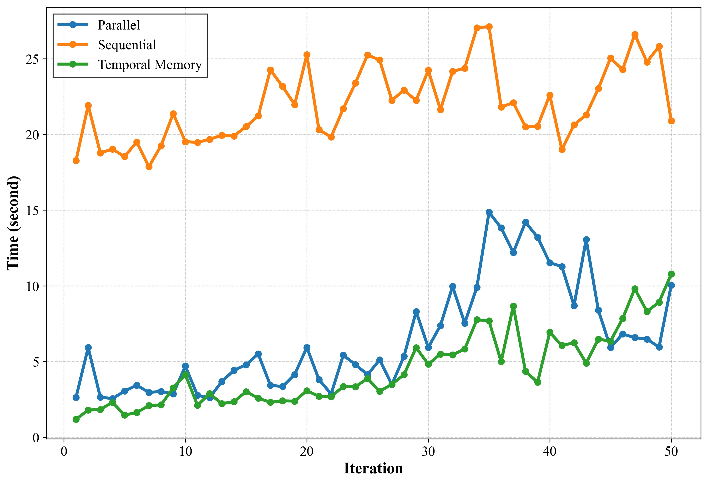

**Original:**

Figure 3: Efficiency improvement of Comprehensive Embodied Memory System.

**中文:**

图 3：综合具身记忆系统的效率提升。

**Original:**

As shown in Table I, our model achieves significant improvements over both single VLM agents and Agent frameworks on the EB-ALFRED and EB-Habitat. Compared to the SOTA Single VLM-Agent model, Claude3.5-Sonnet, RoboMemory with Qwen2.5-VL-72B-Ins backbone improves the average SR by 1% and GC by 7.9%. This demonstrates RoboMemory’s superiority over single VLM-Agents, proving that an Agent framework with open-source models can outperform closed-source SOTA models. Furthermore, when tested against other VLM-Agent frameworks, RoboMemory also shows substantial gains. This is because, unlike other agent frameworks, RoboMemory’s brain-like memory system provides embodied models with more accurate and persistent contextual information. Additionally, the Planner-Critic mechanism provides a closed-loop planning ability, which helps the RoboMemory gain better performance in long-term tasks. Because the RoboMemory can detect and try to overcome possible failures. And it is more robust when encountering unexpected situations.

**中文:**

如表 I 所示，在 EB-ALFRED 和 EB-Habitat 上，我们的模型相比单一 VLM 智能体及其他智能体框架均取得显著提升。相对当前先进的单一 VLM 智能体 Claude3.5-Sonnet，采用 Qwen2.5-VL-72B-Ins 骨干的 RoboMemory 平均 SR 提高 1%、GC 提高 7.9%。这说明 RoboMemory 优于单一 VLM 智能体，也证明由开源模型构建的智能体框架可以超过先进闭源模型。与其他 VLM 智能体框架比较时，RoboMemory 同样有较大提升。原因在于，其类脑记忆系统为具身模型提供了更准确、保存更持久的情境信息。此外，Planner-Critic 机制赋予系统闭环规划能力，使它能够发现并尝试克服潜在失败，更稳健地处理意外情况，从而改善长时域任务的表现。

**Original:**

To evaluate the efficiency of the Comprehensive Embodied Memory module, we tested RoboMemory with executing 10 long-horizon tasks, each comprising approximately 50 steps. All testing is under the same hardware and software settings. We exclusively measured the wall-clock time consumed by memory update and retrieval operations. We analyzed the scaling behavior of memory update latency across three distinct configurations: (1) fully parallel update and retrieval across all memory modules; (2) sequential update of each memory module without parallelism; and (3) update of only the most fundamental memory component: the Temporal Memory. Results are presented in Figure 3. As shown, our parallel update strategy enables updating a multi-module memory system with latency comparable to that of updating a single base memory module. This demonstrates the critical efficiency gains afforded by parallelization across the memory architecture.

**中文:**

为评估综合具身记忆模块的效率，我们让 RoboMemory 执行 10 个长时域任务，每个约 50 步。所有测试采用相同的软硬件条件，只测量记忆更新与检索操作的实际耗时。我们比较三种配置下记忆更新延迟随规模变化的情况：(1) 所有模块完全并行更新和检索；(2) 无并行，各模块依次更新；(3) 只更新时间记忆这一最基础模块。图 3 的结果表明，并行更新使多模块记忆系统的延迟接近单个基础记忆模块，体现了记忆架构并行化带来的重要效率收益。

**Original:**

**TABLE II: Ablation study of RoboMemory’s Success Rate (SR) on EB-ALFERD subset.**

| Method (EB-ALFRED) | Avg. | Base | Long |
| --- | --- | --- | --- |
| RoboMemory | 67% | 68% | 66% |
| - w/o critic | 55 % | 60 % | 50% |
| - w/o spatial memory | 47 % | 52 % | 42 % |
| - w/o episodic memory | 62% | 68% | 56% |
| - w/o semantic memory | 58% | 66% | 50% |
| - w/o long-term memory | 57% | 66% | 48% |

**中文:**

**表 II：RoboMemory 在 EB-ALFERD 子集上的成功率（SR）消融实验。**

| 方法（EB-ALFRED） | 平均 | Base（基础） | Long（长时域） |
| --- | --- | --- | --- |
| RoboMemory | 67% | 68% | 66% |
| - 移除评判模块 | 55 % | 60 % | 50% |
| - 移除空间记忆 | 47 % | 52 % | 42 % |
| - 移除情景记忆 | 62% | 68% | 56% |
| - 移除语义记忆 | 58% | 66% | 50% |
| - 移除长期记忆 | 57% | 66% | 48% |

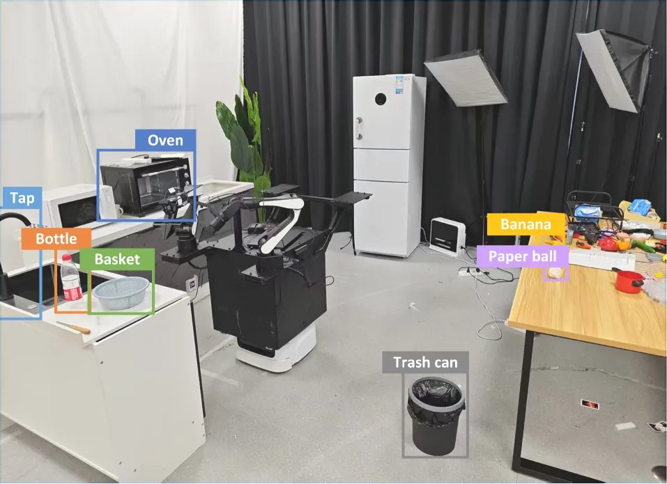

**Original:**

Figure 4: Visualization of the experimental environment.

**中文:**

图 4：实验环境示意。

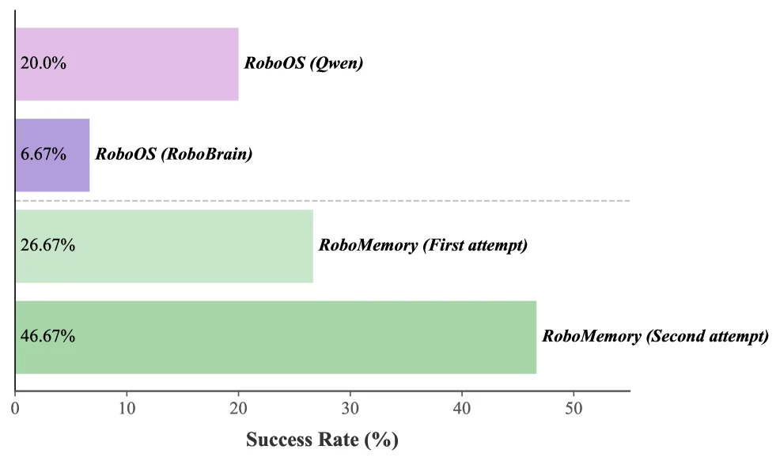

**Original:**

Figure 5: Real-world experiment results. “Qwen” denotes Qwen2.5-VL-72B-Ins; “RoboBrain” denotes RoboBrain2.0-32B.

**中文:**

图 5：真实环境实验结果。“Qwen”指 Qwen2.5-VL-72B-Ins，“RoboBrain”指 RoboBrain2.0-32B。

**Original:**

We used the full Base and Long Subset from EB-ALFRED to validate RoboMemory’s effectiveness. We removed each component systematically and observed performance changes across task categories. We use the success rate as our metric. Results are shown in Table II.

**中文:**

我们使用 EB-ALFRED 完整的 Base 和 Long 子集验证 RoboMemory 的有效性，依次移除各个组件，观察不同任务类别中的性能变化。评价指标为成功率，结果见表 II。

**Original:**

Long-term Memory: Adding long-term memory significantly improves RoboMemory’s success rate. The experiment shows that it enables interactive environmental learning while attempting to complete tasks. Semantic memory learns the properties of low-level skills, such as in what circumstances an action may fail. The episodic memory records all task attempts (successful/failed), providing valuable experience at the task level and giving insight into how to complete a task successfully. This helps the RoboMemory predict the outcomes of actions and avoid ineffective attempts. This ability indicates that the RoboMemory has an interactive environmental learning capability. Additionally, we do ablations for semantic memory and episodic memory solely. The result shows that those memory modules significantly improve the capability of the performance of RoboMemory.

**中文:**

长期记忆：加入长期记忆后，RoboMemory 的成功率显著提高。实验表明，它可以在尝试完成任务的过程中开展交互式环境学习。语义记忆学习底层技能的特性，例如某动作可能在什么情况下失败；情景记忆记录所有成功或失败的任务尝试，提供任务层面的经验，帮助理解如何成功完成任务。这些信息使 RoboMemory 能预测动作结果，避免无效尝试，体现了其交互式环境学习能力。我们还分别对语义记忆和情景记忆进行消融，结果表明，两者均能显著改善 RoboMemory 的表现。

**Original:**

Spatial Memory: Spatial memory is crucial for embodied agents, especially given that current pretrained VLMs have limited spatial understanding ability. Our novel dynamic KG update algorithm enables KG-based spatial memory in dynamic environments. This spatial reasoning helps RoboMemory handle partially observable embodied settings.

**中文:**

空间记忆：当前预训练 VLM 的空间理解能力有限，因此空间记忆对具身智能体尤其重要。我们提出的动态知识图谱更新算法，使基于知识图谱的空间记忆能够用于动态环境。它提供的空间推理能力，帮助 RoboMemory 应对部分可观测的具身场景。

**Original:**

Critic Module: Table II shows performance without the critic module (55% vs 67% with full system). This drop highlights how the critic’s closed-loop planning adapts to dynamic environments. It helps RoboMemory recover from failures faster and handle unexpected situations better.

**中文:**

评判模块：表 II 显示，移除评判模块后成功率为 55%，完整系统为 67%。这一下降体现了评判模块通过闭环规划适应动态环境的作用：它帮助 RoboMemory 更快从失败中恢复，并更好地处理意外情况。

**Original:**

To evaluate RoboMemory’s interactive environmental learning capability in the real world, we designed a kitchen environment inspired by EB-ALFRED and EB-Habitat. The scene contains 5 navigable points, 8 interactive objects, and over 10 non-interactive (but potentially distracting) items. The environment is shown in Figure 5. In the real world, we use interactive environmental video recordings captured during action execution (rather than static snapshots taken after action completion) as RoboMemory’s input. This provides a more temporally coherent perception. We created three task categories (5 tasks each). Tasks are matched to EB-ALFRED’s Base subset (avg. oracle: 10–20 steps), though actual executions often exceed 20 steps due to search and error recovery. Due to search and error recovery, the robot often exceeds 20 steps per task. Additional hardware experiment details are in Appendix -E.

**中文:**

为评估 RoboMemory 在真实环境中的交互式环境学习能力，我们参考 EB-ALFRED 和 EB-Habitat 搭建了厨房场景，其中包含 5 个可导航点、8 个可交互物体，以及超过 10 个不可交互但可能造成干扰的物品。环境见图 5。真实机器人使用动作执行期间录制的交互视频作为输入，而不是动作完成后的静态照片，以获得时间上更连贯的感知。我们设计了三个任务类别，每类 5 个任务，难度对齐 EB-ALFRED 的 Base 子集，参考最优执行通常需要 10–20 步；但由于搜索和错误恢复，实际执行往往超过 20 步。机器人每个任务经常需要超过 20 步，正是因为这些搜索和恢复操作。更多硬件实验细节见附录 -E。

**Original:**

To test the interactive environmental learning ability of RoboMemory, we ran each task twice without clearing long-term memory between attempts. Meanwhile, we compared RoboMemory against previous SOTA on real-world experiments RoboOS as baselines. The success rates for first and second attempts and different settings of RoboOS are shown in Figure 5.

**中文:**

为测试交互式环境学习能力，每个任务执行两次，两次尝试之间不清空长期记忆。同时，我们将 RoboMemory 与此前在真实环境实验中表现领先的 RoboOS 比较。RoboMemory 第一次、第二次尝试的成功率，以及 RoboOS 不同配置的结果见图 5。

**Original:**

The second attempt showed significantly higher success rates. This proves RoboMemory’s long-term memory effectively guides subsequent tasks in real embodied environments. Key observations include: (1) Closed-loop error recovery: RoboMemory retries failed actions when possible, even if the low-level executor (VLA model) fails. (2) Spatial reasoning: RoboMemory remembers object locations and spatial relationships using its memory. (3) Interactive environmental learning: RoboMemory analyzes failure causes reasonably. These analyses guide future decisions. Detailed examples demonstrating these capabilities and further discussions are provided in Appendix -F.

**中文:**

第二次尝试的成功率显著更高，证明 RoboMemory 的长期记忆能够有效指导真实具身环境中的后续任务。主要观察包括：(1) 闭环错误恢复：即使底层 VLA 执行器失败，系统也会在条件允许时重试失败动作；(2) 空间推理：借助记忆保存物体位置及其空间关系；(3) 交互式环境学习：合理分析失败原因，并以此指导后续决策。展示这些能力的详细案例和进一步讨论见附录 -F。

**Original:**

Moreover, we observe a significant drop in task success rates when deploying the agent with the Low-level Executor in real-world environments. This performance degradation primarily stems from the executor’s inherent limitations: (1) The VLA model exhibits unreliable instruction-following capabilities, frequently failing during grasping actions or selecting incorrect objects; (2) Pre-trained VLM models demonstrate inadequate video understanding capability. They are struggle to interpret dynamic visual information such as action failures or state changes. These limitations collectively contribute to the reduced performance compared to simulated environments.

**中文:**

我们还观察到，当智能体配合底层执行器部署到真实环境时，任务成功率明显下降。主要原因是执行环节的固有限制：(1) VLA 的指令遵循能力不够可靠，经常抓取失败或选错物体；(2) 预训练 VLM 的视频理解能力不足，难以理解动作失败、状态变化等动态视觉信息。这些局限共同导致真实环境中的性能低于仿真环境。

## 结论

**Original:**

This paper propose RoboMemory, a brain-inspired multi-memory framework, facilitating long-horizon planning and interactive environmental learning in real-world embodied systems by addressing key challenges such as memory latency, task correlation capture, and planning loops. Experiments on EmbodiedBench demonstrate that RoboMemory outperforms state-of-the-art closed-source VLMs and agent frameworks, with ablation studies confirming the critical roles of the Critic module and spatial/long-term memory. Real-world deployment further validates its interactive learning capability through improved success rates in repeated tasks. Despite limitations arising from reasoning errors and executor dependence, RoboMemory provides a foundation for generalizable, memory-augmented agents, with future work aimed at refining reasoning and enhancing execution robustness.

**中文:**

本文提出受大脑启发的多记忆框架 RoboMemory，通过解决记忆延迟、任务关联识别和规划循环等关键问题，支持真实具身系统中的长时域规划与交互式环境学习。EmbodiedBench 实验表明，RoboMemory 优于先进闭源 VLM 和其他智能体框架；消融实验验证了评判模块、空间记忆与长期记忆的重要作用。真实环境中重复任务成功率的提高，进一步验证了其交互式学习能力。尽管仍受到推理错误和底层执行器的限制，RoboMemory 为可泛化的记忆增强型智能体提供了基础；未来将继续改善推理，并增强执行的稳健性。

**Original:**

**TABLE III: Comparison of Memory-Related Methods in Embodied Agent**

| Method | Multimodal | Episodic | Semantic | Spatial | Temporal | Procedural | Memory Implementation | Real Robot |
| --- | --- | --- | --- | --- | --- | --- | --- | --- |
| NeSyC [14] | ✓ |  | ✓ |  | ✓ |  | Symbolic logic rules | ✓ |
| Reflexion [35] |  |  | ✓ |  | ✓ |  | Buffer |  |
| Voyager [45] |  |  |  |  |  | ✓ | RAG |  |
| MSI-Agent [16] |  |  | ✓ |  | ✓ |  | Database, RAG |  |
| CoELA [51] | ✓ | ✓ | ✓ |  |  | ✓ | Top-down semantic map |  |
| Cradle [39] | ✓ | ✓ |  |  | ✓ | ✓ | RAG |  |
| Agent-S [1] | ✓ | ✓ | ✓ |  | ✓ |  | RAG |  |
| Expel [54] |  |  | ✓ |  | ✓ |  | Buffer |  |
| AutoManual [10] |  | ✓ | ✓ |  |  | ✓ | Buffer |  |
| HiRobot [34] | ✓ |  |  |  |  |  | / | ✓ |
| Being-0 [50] | ✓ | ✓ |  |  | ✓ |  | Buffer | ✓ |
| RoboOS [38] | ✓ |  |  | ✓ | ✓ |  | Scene graph, database | ✓ |
| RoboMemory (Ours) | ✓ | ✓ | ✓ | ✓ | ✓ |  | RAG,KG | ✓ |

**中文:**

**表 III：具身智能体中不同记忆方法的比较。**

| 方法 | 多模态 | 情景记忆 | 语义记忆 | 空间记忆 | 时间记忆 | 程序性记忆 | 记忆实现方式 | 真实机器人 |
| --- | --- | --- | --- | --- | --- | --- | --- | --- |
| NeSyC [14] | ✓ |  | ✓ |  | ✓ |  | 符号逻辑规则 | ✓ |
| Reflexion [35] |  |  | ✓ |  | ✓ |  | 缓冲区 |  |
| Voyager [45] |  |  |  |  |  | ✓ | RAG |  |
| MSI-Agent [16] |  |  | ✓ |  | ✓ |  | 数据库、RAG |  |
| CoELA [51] | ✓ | ✓ | ✓ |  |  | ✓ | 俯视语义地图 |  |
| Cradle [39] | ✓ | ✓ |  |  | ✓ | ✓ | RAG |  |
| Agent-S [1] | ✓ | ✓ | ✓ |  | ✓ |  | RAG |  |
| Expel [54] |  |  | ✓ |  | ✓ |  | 缓冲区 |  |
| AutoManual [10] |  | ✓ | ✓ |  |  | ✓ | 缓冲区 |  |
| HiRobot [34] | ✓ |  |  |  |  |  | / | ✓ |
| Being-0 [50] | ✓ | ✓ |  |  | ✓ |  | 缓冲区 | ✓ |
| RoboOS [38] | ✓ |  |  | ✓ | ✓ |  | 场景图、数据库 | ✓ |
| RoboMemory（本文） | ✓ | ✓ | ✓ | ✓ | ✓ |  | RAG,KG | ✓ |

## 参考文献

**Original:**

[1] S. Agashe, J. Han, S. Gan, J. Yang, A. Li, and X. E. Wang (2024) Agent s: an open agentic framework that uses computers like a human. arXiv preprint arXiv:2410.08164. Cited by: §-A1, §-A1, §I, §II-A, TABLE III.

**中文:**

[1] S. Agashe, J. Han, S. Gan, J. Yang, A. Li, and X. E. Wang (2024) Agent s: an open agentic framework that uses computers like a human. arXiv preprint arXiv:2410.08164. Cited by: §-A1, §-A1, §I, §II-A, TABLE III.

**Original:**

[2] Anthropic (2024) Claude 3.5 sonnet. External Links: Link Cited by: §I, §IV-B.

**中文:**

[2] Anthropic (2024) Claude 3.5 sonnet. External Links: Link Cited by: §I, §IV-B.

**Original:**

[3] R. C. Atkinson and R. M. Shiffrin (1968) Human memory: a proposed system and its control processes. In Psychology of learning and motivation, Vol. 2, pp. 89–195. Cited by: §-A1, §I.

**中文:**

[3] R. C. Atkinson and R. M. Shiffrin (1968) Human memory: a proposed system and its control processes. In Psychology of learning and motivation, Vol. 2, pp. 89–195. Cited by: §-A1, §I.

**Original:**

[4] A. Baddeley and G. Hitch (2007) Working memory: past, present… and future. The cognitive neuroscience of working memory, pp. 1–20. Cited by: §I.

**中文:**

[4] A. Baddeley and G. Hitch (2007) Working memory: past, present… and future. The cognitive neuroscience of working memory, pp. 1–20. Cited by: §I.

**Original:**

[5] A. Baddeley (2020) Working memory. Memory, pp. 71–111. Cited by: §-A1, §I.

**中文:**

[5] A. Baddeley (2020) Working memory. Memory, pp. 71–111. Cited by: §-A1, §I.

**Original:**

[6] S. Bai, K. Chen, X. Liu, J. Wang, W. Ge, S. Song, K. Dang, P. Wang, S. Wang, J. Tang, et al. (2025) Qwen2. 5-vl technical report. arXiv preprint arXiv:2502.13923. Cited by: §I, §IV-B.

**中文:**

[6] S. Bai, K. Chen, X. Liu, J. Wang, W. Ge, S. Song, K. Dang, P. Wang, S. Wang, J. Tang, et al. (2025) Qwen2. 5-vl technical report. arXiv preprint arXiv:2502.13923. Cited by: §I, §IV-B.

**Original:**

[7] J. Bjorck, F. Castañeda, N. Cherniadev, X. Da, R. Ding, L. Fan, Y. Fang, D. Fox, F. Hu, S. Huang, et al. (2025) Gr00t n1: an open foundation model for generalist humanoid robots. arXiv preprint arXiv:2503.14734. Cited by: §I.

**中文:**

[7] J. Bjorck, F. Castañeda, N. Cherniadev, X. Da, R. Ding, L. Fan, Y. Fang, D. Fox, F. Hu, S. Huang, et al. (2025) Gr00t n1: an open foundation model for generalist humanoid robots. arXiv preprint arXiv:2503.14734. Cited by: §I.

**Original:**

[8] K. Black, N. Brown, D. Driess, A. Esmail, M. Equi, C. Finn, N. Fusai, L. Groom, K. Hausman, B. Ichter, et al. (2024) $\pi_{0}$: a vision-language-action flow model for general robot control. arXiv preprint arXiv:2410.24164. Cited by: §I, §III-D.

**中文:**

[8] K. Black, N. Brown, D. Driess, A. Esmail, M. Equi, C. Finn, N. Fusai, L. Groom, K. Hausman, B. Ichter, et al. (2024) $\pi_{0}$: a vision-language-action flow model for general robot control. arXiv preprint arXiv:2410.24164. Cited by: §I, §III-D.

**Original:**

[9] M. Chang, T. Gervet, M. Khanna, S. Yenamandra, D. Shah, S. Y. Min, K. Shah, C. Paxton, S. Gupta, D. Batra, et al. (2023) Goat: go to any thing. arXiv preprint arXiv:2311.06430. Cited by: §III-B.

**中文:**

[9] M. Chang, T. Gervet, M. Khanna, S. Yenamandra, D. Shah, S. Y. Min, K. Shah, C. Paxton, S. Gupta, D. Batra, et al. (2023) Goat: go to any thing. arXiv preprint arXiv:2311.06430. Cited by: §III-B.

**Original:**

[10] M. Chen, Y. Li, Y. Yang, S. Yu, B. Lin, and X. He (2024) Automanual: constructing instruction manuals by llm agents via interactive environmental learning. Advances in Neural Information Processing Systems 37, pp. 589–631. Cited by: §-A1, §I, TABLE III.

**中文:**

[10] M. Chen, Y. Li, Y. Yang, S. Yu, B. Lin, and X. He (2024) Automanual: constructing instruction manuals by llm agents via interactive environmental learning. Advances in Neural Information Processing Systems 37, pp. 589–631. Cited by: §-A1, §I, TABLE III.

**Original:**

[11] Z. Chen, W. Wang, Y. Cao, Y. Liu, Z. Gao, E. Cui, J. Zhu, S. Ye, H. Tian, Z. Liu, et al. (2024) Expanding performance boundaries of open-source multimodal models with model, data, and test-time scaling. arXiv preprint arXiv:2412.05271. Cited by: §IV-B.

**中文:**

[11] Z. Chen, W. Wang, Y. Cao, Y. Liu, Z. Gao, E. Cui, J. Zhu, S. Ye, H. Tian, Z. Liu, et al. (2024) Expanding performance boundaries of open-source multimodal models with model, data, and test-time scaling. arXiv preprint arXiv:2412.05271. Cited by: §IV-B.

**Original:**

[12] P. Chhikara, D. Khant, S. Aryan, T. Singh, and D. Yadav (2025) Mem0: building production-ready ai agents with scalable long-term memory. arXiv preprint arXiv:2504.19413. Cited by: §III-B.

**中文:**

[12] P. Chhikara, D. Khant, S. Aryan, T. Singh, and D. Yadav (2025) Mem0: building production-ready ai agents with scalable long-term memory. arXiv preprint arXiv:2504.19413. Cited by: §III-B.

**Original:**

[13] C. Chi, Z. Xu, S. Feng, E. Cousineau, Y. Du, B. Burchfiel, R. Tedrake, and S. Song (2023) Diffusion policy: visuomotor policy learning via action diffusion. The International Journal of Robotics Research, pp. 02783649241273668. Cited by: §I.

**中文:**

[13] C. Chi, Z. Xu, S. Feng, E. Cousineau, Y. Du, B. Burchfiel, R. Tedrake, and S. Song (2023) Diffusion policy: visuomotor policy learning via action diffusion. The International Journal of Robotics Research, pp. 02783649241273668. Cited by: §I.

**Original:**

[14] W. Choi, J. Park, S. Ahn, D. Lee, and H. Woo (2025) NeSyC: a neuro-symbolic continual learner for complex embodied tasks in open domains. arXiv preprint arXiv:2503.00870. Cited by: §-A1, TABLE III.

**中文:**

[14] W. Choi, J. Park, S. Ahn, D. Lee, and H. Woo (2025) NeSyC: a neuro-symbolic continual learner for complex embodied tasks in open domains. arXiv preprint arXiv:2503.00870. Cited by: §-A1, TABLE III.

**Original:**

[15] G. DeepMind (2024) Introducing gemini 2.0: our new ai model for the agentic era. External Links: Link Cited by: §IV-B.

**中文:**

[15] G. DeepMind (2024) Introducing gemini 2.0: our new ai model for the agentic era. External Links: Link Cited by: §IV-B.

**Original:**

[16] D. Fu, B. Qi, Y. Gao, C. Jiang, G. Dong, and B. Zhou (2024) MSI-agent: incorporating multi-scale insight into embodied agents for superior planning and decision-making. arXiv preprint arXiv:2409.16686. Cited by: §-A1, §I, §II-A, TABLE III.

**中文:**

[16] D. Fu, B. Qi, Y. Gao, C. Jiang, G. Dong, and B. Zhou (2024) MSI-agent: incorporating multi-scale insight into embodied agents for superior planning and decision-making. arXiv preprint arXiv:2409.16686. Cited by: §-A1, §I, §II-A, TABLE III.

**Original:**

[17] Z. Fu, T. Z. Zhao, and C. Finn (2024) Mobile aloha: learning bimanual mobile manipulation with low-cost whole-body teleoperation. arXiv preprint arXiv:2401.02117. Cited by: §-E3.

**中文:**

[17] Z. Fu, T. Z. Zhao, and C. Finn (2024) Mobile aloha: learning bimanual mobile manipulation with low-cost whole-body teleoperation. arXiv preprint arXiv:2401.02117. Cited by: §-E3.

**Original:**

[18] M. Glocker, P. Hönig, M. Hirschmanner, and M. Vincze (2025) Llm-empowered embodied agent for memory-augmented task planning in household robotics. arXiv preprint arXiv:2504.21716. Cited by: §I.

**中文:**

[18] M. Glocker, P. Hönig, M. Hirschmanner, and M. Vincze (2025) Llm-empowered embodied agent for memory-augmented task planning in household robotics. arXiv preprint arXiv:2504.21716. Cited by: §I.

**Original:**

[19] Q. Gu, A. Kuwajerwala, S. Morin, K. M. Jatavallabhula, B. Sen, A. Agarwal, C. Rivera, W. Paul, K. Ellis, R. Chellappa, et al. (2024) Conceptgraphs: open-vocabulary 3d scene graphs for perception and planning. In 2024 IEEE International Conference on Robotics and Automation (ICRA), pp. 5021–5028. Cited by: §II-B.

**中文:**

[19] Q. Gu, A. Kuwajerwala, S. Morin, K. M. Jatavallabhula, B. Sen, A. Agarwal, C. Rivera, W. Paul, K. Ellis, R. Chellappa, et al. (2024) Conceptgraphs: open-vocabulary 3d scene graphs for perception and planning. In 2024 IEEE International Conference on Robotics and Automation (ICRA), pp. 5021–5028. Cited by: §II-B.

**Original:**

[20] B. J. Gutiérrez, Y. Shu, Y. Gu, M. Yasunaga, and Y. Su (2024) HippoRAG: neurobiologically inspired long-term memory for large language models. arXiv preprint arXiv:2405.14831. Cited by: §II-B.

**中文:**

[20] B. J. Gutiérrez, Y. Shu, Y. Gu, M. Yasunaga, and Y. Su (2024) HippoRAG: neurobiologically inspired long-term memory for large language models. arXiv preprint arXiv:2405.14831. Cited by: §II-B.

**Original:**

[21] E. J. Hu, Y. Shen, P. Wallis, Z. Allen-Zhu, Y. Li, S. Wang, L. Wang, W. Chen, et al. (2022) Lora: low-rank adaptation of large language models.. ICLR 1 (2), pp. 3. Cited by: §III-D.

**中文:**

[21] E. J. Hu, Y. Shen, P. Wallis, Z. Allen-Zhu, Y. Li, S. Wang, L. Wang, W. Chen, et al. (2022) Lora: low-rank adaptation of large language models.. ICLR 1 (2), pp. 3. Cited by: §III-D.

**Original:**

[22] Y. Hu, Q. Xie, V. Jain, J. Francis, J. Patrikar, N. Keetha, S. Kim, Y. Xie, T. Zhang, H. Fang, et al. (2023) Toward general-purpose robots via foundation models: a survey and meta-analysis. arXiv preprint arXiv:2312.08782. Cited by: §I.

**中文:**

[22] Y. Hu, Q. Xie, V. Jain, J. Francis, J. Patrikar, N. Keetha, S. Kim, Y. Xie, T. Zhang, H. Fang, et al. (2023) Toward general-purpose robots via foundation models: a survey and meta-analysis. arXiv preprint arXiv:2312.08782. Cited by: §I.

**Original:**

[23] A. Hurst, A. Lerer, A. P. Goucher, A. Perelman, A. Ramesh, A. Clark, A. Ostrow, A. Welihinda, A. Hayes, A. Radford, et al. (2024) Gpt-4o system card. arXiv preprint arXiv:2410.21276. Cited by: §I, §IV-B.

**中文:**

[23] A. Hurst, A. Lerer, A. P. Goucher, A. Perelman, A. Ramesh, A. Clark, A. Ostrow, A. Welihinda, A. Hayes, A. Radford, et al. (2024) Gpt-4o system card. arXiv preprint arXiv:2410.21276. Cited by: §I, §IV-B.

**Original:**

[24] M. J. Kim, K. Pertsch, S. Karamcheti, T. Xiao, A. Balakrishna, S. Nair, R. Rafailov, E. Foster, G. Lam, P. Sanketi, et al. (2024) Openvla: an open-source vision-language-action model. arXiv preprint arXiv:2406.09246. Cited by: §I.

**中文:**

[24] M. J. Kim, K. Pertsch, S. Karamcheti, T. Xiao, A. Balakrishna, S. Nair, R. Rafailov, E. Foster, G. Lam, P. Sanketi, et al. (2024) Openvla: an open-source vision-language-action model. arXiv preprint arXiv:2406.09246. Cited by: §I.

**Original:**

[25] M. Lei, G. Wang, Y. Zhao, Z. Mai, Q. Zhao, Y. Guo, Z. Li, S. Cui, Y. Han, and J. Ren (2025) CLEA: closed-loop embodied agent for enhancing task execution in dynamic environments. arXiv preprint arXiv:2503.00729. Cited by: §III-C.

**中文:**

[25] M. Lei, G. Wang, Y. Zhao, Z. Mai, Q. Zhao, Y. Guo, Z. Li, S. Cui, Y. Han, and J. Ren (2025) CLEA: closed-loop embodied agent for enhancing task execution in dynamic environments. arXiv preprint arXiv:2503.00729. Cited by: §III-C.

**Original:**

[26] B. Y. Lin, Y. Fu, K. Yang, F. Brahman, S. Huang, C. Bhagavatula, P. Ammanabrolu, Y. Choi, and X. Ren (2024) Swiftsage: a generative agent with fast and slow thinking for complex interactive tasks. Advances in Neural Information Processing Systems 36. Cited by: §II-A.

**中文:**

[26] B. Y. Lin, Y. Fu, K. Yang, F. Brahman, S. Huang, C. Bhagavatula, P. Ammanabrolu, Y. Choi, and X. Ren (2024) Swiftsage: a generative agent with fast and slow thinking for complex interactive tasks. Advances in Neural Information Processing Systems 36. Cited by: §II-A.

**Original:**

[27] B. Liu, X. Li, J. Zhang, J. Wang, T. He, S. Hong, H. Liu, S. Zhang, K. Song, K. Zhu, et al. (2025) Advances and challenges in foundation agents: from brain-inspired intelligence to evolutionary, collaborative, and safe systems. arXiv preprint arXiv:2504.01990. Cited by: §III-B.

**中文:**

[27] B. Liu, X. Li, J. Zhang, J. Wang, T. He, S. Hong, H. Liu, S. Zhang, K. Song, K. Zhu, et al. (2025) Advances and challenges in foundation agents: from brain-inspired intelligence to evolutionary, collaborative, and safe systems. arXiv preprint arXiv:2504.01990. Cited by: §III-B.

**Original:**

[28] J. Loo, Z. Wu, and D. Hsu (2025) Open scene graphs for open-world object-goal navigation. The International Journal of Robotics Research, pp. 02783649251369549. Cited by: §II-B.

**中文:**

[28] J. Loo, Z. Wu, and D. Hsu (2025) Open scene graphs for open-world object-goal navigation. The International Journal of Robotics Research, pp. 02783649251369549. Cited by: §II-B.

**Original:**

[29] J. L. McClelland, B. L. McNaughton, and R. C. O’Reilly (1995) Why there are complementary learning systems in the hippocampus and neocortex: insights from the successes and failures of connectionist models of learning and memory.. Psychological review 102 (3), pp. 419. Cited by: §-A1, §I.

**中文:**

[29] J. L. McClelland, B. L. McNaughton, and R. C. O’Reilly (1995) Why there are complementary learning systems in the hippocampus and neocortex: insights from the successes and failures of connectionist models of learning and memory.. Psychological review 102 (3), pp. 419. Cited by: §-A1, §I.

**Original:**

[30] Meta (2024) Llama 3.2: revolutionizing edge ai and vision with open, customizable models. External Links: Link Cited by: §IV-B.

**中文:**

[30] Meta (2024) Llama 3.2: revolutionizing edge ai and vision with open, customizable models. External Links: Link Cited by: §IV-B.

**Original:**

[31] OpenAI (2024) GPT-4o mini: advancing cost-efficient intelligence. External Links: Link Cited by: §IV-B.

**中文:**

[31] OpenAI (2024) GPT-4o mini: advancing cost-efficient intelligence. External Links: Link Cited by: §IV-B.

**Original:**

[32] C. Packer, S. Wooders, K. Lin, V. Fang, S. G. Patil, I. Stoica, and J. E. Gonzalez (2023) MemGPT: towards llms as operating systems. arXiv preprint arXiv:2310.08560. Cited by: §II-A.

**中文:**

[32] C. Packer, S. Wooders, K. Lin, V. Fang, S. G. Patil, I. Stoica, and J. E. Gonzalez (2023) MemGPT: towards llms as operating systems. arXiv preprint arXiv:2310.08560. Cited by: §II-A.

**Original:**

[33] J. S. Park, J. O’Brien, C. J. Cai, M. R. Morris, P. Liang, and M. S. Bernstein (2023) Generative agents: interactive simulacra of human behavior. In Proceedings of the 36th annual acm symposium on user interface software and technology, pp. 1–22. Cited by: §I.

**中文:**

[33] J. S. Park, J. O’Brien, C. J. Cai, M. R. Morris, P. Liang, and M. S. Bernstein (2023) Generative agents: interactive simulacra of human behavior. In Proceedings of the 36th annual acm symposium on user interface software and technology, pp. 1–22. Cited by: §I.

**Original:**

[34] L. X. Shi, B. Ichter, M. Equi, L. Ke, K. Pertsch, Q. Vuong, J. Tanner, A. Walling, H. Wang, N. Fusai, et al. (2025) Hi robot: open-ended instruction following with hierarchical vision-language-action models. arXiv preprint arXiv:2502.19417. Cited by: §I, TABLE III.

**中文:**

[34] L. X. Shi, B. Ichter, M. Equi, L. Ke, K. Pertsch, Q. Vuong, J. Tanner, A. Walling, H. Wang, N. Fusai, et al. (2025) Hi robot: open-ended instruction following with hierarchical vision-language-action models. arXiv preprint arXiv:2502.19417. Cited by: §I, TABLE III.

**Original:**

[35] N. Shinn, F. Cassano, A. Gopinath, K. Narasimhan, and S. Yao (2024) Reflexion: language agents with verbal reinforcement learning. Advances in Neural Information Processing Systems 36. Cited by: §-A1, §II-A, §IV-B, TABLE III.

**中文:**

[35] N. Shinn, F. Cassano, A. Gopinath, K. Narasimhan, and S. Yao (2024) Reflexion: language agents with verbal reinforcement learning. Advances in Neural Information Processing Systems 36. Cited by: §-A1, §II-A, §IV-B, TABLE III.

**Original:**

[36] C. H. Song, J. Wu, C. Washington, B. M. Sadler, W. Chao, and Y. Su (2023) Llm-planner: few-shot grounded planning for embodied agents with large language models. In Proceedings of the IEEE/CVF international conference on computer vision, pp. 2998–3009. Cited by: §II-A.

**中文:**

[36] C. H. Song, J. Wu, C. Washington, B. M. Sadler, W. Chao, and Y. Su (2023) Llm-planner: few-shot grounded planning for embodied agents with large language models. In Proceedings of the IEEE/CVF international conference on computer vision, pp. 2998–3009. Cited by: §II-A.

**Original:**

[37] G. Sperling (1960) The information available in brief visual presentations.. Psychological monographs: General and applied 74 (11), pp. 1. Cited by: §-A1, §I.

**中文:**

[37] G. Sperling (1960) The information available in brief visual presentations.. Psychological monographs: General and applied 74 (11), pp. 1. Cited by: §-A1, §I.

**Original:**

[38] H. Tan, X. Hao, C. Chi, M. Lin, Y. Lyu, M. Cao, D. Liang, Z. Chen, M. Lyu, C. Peng, et al. (2025) Roboos: a hierarchical embodied framework for cross-embodiment and multi-agent collaboration. arXiv preprint arXiv:2505.03673. Cited by: §-A1, §I, §I, §II-B, §IV-B, TABLE III.

**中文:**

[38] H. Tan, X. Hao, C. Chi, M. Lin, Y. Lyu, M. Cao, D. Liang, Z. Chen, M. Lyu, C. Peng, et al. (2025) Roboos: a hierarchical embodied framework for cross-embodiment and multi-agent collaboration. arXiv preprint arXiv:2505.03673. Cited by: §-A1, §I, §I, §II-B, §IV-B, TABLE III.

**Original:**

[39] W. Tan, W. Zhang, X. Xu, H. Xia, Z. Ding, B. Li, B. Zhou, J. Yue, J. Jiang, Y. Li, et al. (2024) Cradle: empowering foundation agents towards general computer control. arXiv preprint arXiv:2403.03186. Cited by: §-A1, §-A1, §I, §II-A, §IV-B, TABLE III.

**中文:**

[39] W. Tan, W. Zhang, X. Xu, H. Xia, Z. Ding, B. Li, B. Zhou, J. Yue, J. Jiang, Y. Li, et al. (2024) Cradle: empowering foundation agents towards general computer control. arXiv preprint arXiv:2403.03186. Cited by: §-A1, §-A1, §I, §II-A, §IV-B, TABLE III.

**Original:**

[40] B. R. Team, M. Cao, H. Tan, Y. Ji, X. Chen, M. Lin, Z. Li, Z. Cao, P. Wang, E. Zhou, et al. (2025) Robobrain 2.0 technical report. arXiv preprint arXiv:2507.02029. Cited by: §IV-B.

**中文:**

[40] B. R. Team, M. Cao, H. Tan, Y. Ji, X. Chen, M. Lin, Z. Li, Z. Cao, P. Wang, E. Zhou, et al. (2025) Robobrain 2.0 technical report. arXiv preprint arXiv:2507.02029. Cited by: §IV-B.

**Original:**

[41] G. Team, P. Georgiev, V. I. Lei, R. Burnell, L. Bai, A. Gulati, G. Tanzer, D. Vincent, Z. Pan, S. Wang, et al. (2024) Gemini 1.5: unlocking multimodal understanding across millions of tokens of context. arXiv preprint arXiv:2403.05530. Cited by: §IV-B.

**中文:**

[41] G. Team, P. Georgiev, V. I. Lei, R. Burnell, L. Bai, A. Gulati, G. Tanzer, D. Vincent, Z. Pan, S. Wang, et al. (2024) Gemini 1.5: unlocking multimodal understanding across millions of tokens of context. arXiv preprint arXiv:2403.05530. Cited by: §IV-B.

**Original:**

[42] Q. Team (2024-09) Qwen2.5: a party of foundation models. External Links: Link Cited by: §IV-B.

**中文:**

[42] Q. Team (2024-09) Qwen2.5: a party of foundation models. External Links: Link Cited by: §IV-B.

**Original:**

[43] E. Tulving et al. (1972) Episodic and semantic memory. Organization of memory 1 (381-403), pp. 1. Cited by: §-A1, §I.

**中文:**

[43] E. Tulving et al. (1972) Episodic and semantic memory. Organization of memory 1 (381-403), pp. 1. Cited by: §-A1, §I.

**Original:**

[44] E. Tulving (1983) Elements of episodic memory. Oxford University Press, Oxford, GB. Cited by: §-A1.

**中文:**

[44] E. Tulving (1983) Elements of episodic memory. Oxford University Press, Oxford, GB. Cited by: §-A1.

**Original:**

[45] G. Wang, Y. Xie, Y. Jiang, A. Mandlekar, C. Xiao, Y. Zhu, L. Fan, and A. Anandkumar (2023) Voyager: an open-ended embodied agent with large language models. arXiv preprint arXiv:2305.16291. Cited by: §-A1, §I, §II-A, §IV-B, TABLE III.

**中文:**

[45] G. Wang, Y. Xie, Y. Jiang, A. Mandlekar, C. Xiao, Y. Zhu, L. Fan, and A. Anandkumar (2023) Voyager: an open-ended embodied agent with large language models. arXiv preprint arXiv:2305.16291. Cited by: §-A1, §I, §II-A, §IV-B, TABLE III.

**Original:**

[46] C. White, S. Dooley, M. Roberts, A. Pal, B. Feuer, S. Jain, R. Shwartz-Ziv, N. Jain, K. Saifullah, S. Naidu, et al. (2024) Livebench: a challenging, contamination-free llm benchmark. arXiv preprint arXiv:2406.19314. Cited by: §IV-B.

**中文:**

[46] C. White, S. Dooley, M. Roberts, A. Pal, B. Feuer, S. Jain, R. Shwartz-Ziv, N. Jain, K. Saifullah, S. Naidu, et al. (2024) Livebench: a challenging, contamination-free llm benchmark. arXiv preprint arXiv:2406.19314. Cited by: §IV-B.

**Original:**

[47] R. Yang, H. Chen, J. Zhang, M. Zhao, C. Qian, K. Wang, Q. Wang, T. V. Koripella, M. Movahedi, M. Li, et al. (2025) EmbodiedBench: comprehensive benchmarking multi-modal large language models for vision-driven embodied agents. arXiv preprint arXiv:2502.09560. Cited by: §I, §I, §IV-A.

**中文:**

[47] R. Yang, H. Chen, J. Zhang, M. Zhao, C. Qian, K. Wang, Q. Wang, T. V. Koripella, M. Movahedi, M. Li, et al. (2025) EmbodiedBench: comprehensive benchmarking multi-modal large language models for vision-driven embodied agents. arXiv preprint arXiv:2502.09560. Cited by: §I, §I, §IV-A.

**Original:**

[48] Y. Yang, H. Yang, J. Zhou, P. Chen, H. Zhang, Y. Du, and C. Gan (2025) 3D-mem: 3d scene memory for embodied exploration and reasoning. In Proceedings of the Computer Vision and Pattern Recognition Conference, pp. 17294–17303. Cited by: §II-B.

**中文:**

[48] Y. Yang, H. Yang, J. Zhou, P. Chen, H. Zhang, Y. Du, and C. Gan (2025) 3D-mem: 3d scene memory for embodied exploration and reasoning. In Proceedings of the Computer Vision and Pattern Recognition Conference, pp. 17294–17303. Cited by: §II-B.

**Original:**

[49] S. Yao, J. Zhao, D. Yu, N. Du, I. Shafran, K. Narasimhan, and Y. Cao (2022) React: synergizing reasoning and acting in language models. arXiv preprint arXiv:2210.03629. Cited by: §I, §II-A.

**中文:**

[49] S. Yao, J. Zhao, D. Yu, N. Du, I. Shafran, K. Narasimhan, and Y. Cao (2022) React: synergizing reasoning and acting in language models. arXiv preprint arXiv:2210.03629. Cited by: §I, §II-A.

**Original:**

[50] H. Yuan, Y. Bai, Y. Fu, B. Zhou, Y. Feng, X. Xu, Y. Zhan, B. F. Karlsson, and Z. Lu (2025) Being-0: a humanoid robotic agent with vision-language models and modular skills. arXiv preprint arXiv:2503.12533. Cited by: §I, TABLE III.

**中文:**

[50] H. Yuan, Y. Bai, Y. Fu, B. Zhou, Y. Feng, X. Xu, Y. Zhan, B. F. Karlsson, and Z. Lu (2025) Being-0: a humanoid robotic agent with vision-language models and modular skills. arXiv preprint arXiv:2503.12533. Cited by: §I, TABLE III.

**Original:**

[51] H. Zhang, W. Du, J. Shan, Q. Zhou, Y. Du, J. B. Tenenbaum, T. Shu, and C. Gan (2023) Building cooperative embodied agents modularly with large language models. arXiv preprint arXiv:2307.02485. Cited by: §II-A, §II-B, §III-B, TABLE III.

**中文:**

[51] H. Zhang, W. Du, J. Shan, Q. Zhou, Y. Du, J. B. Tenenbaum, T. Shu, and C. Gan (2023) Building cooperative embodied agents modularly with large language models. arXiv preprint arXiv:2307.02485. Cited by: §II-A, §II-B, §III-B, TABLE III.

**Original:**

[52] L. Zhang, X. Hao, Y. Tang, H. Fu, X. Zheng, P. Wang, Z. Wang, W. Ding, and S. Zhang (2025) $NavA^{3}$: Understanding any instruction, navigating anywhere, finding anything. arXiv preprint arXiv:2508.04598. Cited by: §II-B.

**中文:**

[52] L. Zhang, X. Hao, Y. Tang, H. Fu, X. Zheng, P. Wang, Z. Wang, W. Ding, and S. Zhang (2025) $NavA^{3}$: Understanding any instruction, navigating anywhere, finding anything. arXiv preprint arXiv:2508.04598. Cited by: §II-B.

**Original:**

[53] Y. Zhang, M. Li, D. Long, X. Zhang, H. Lin, B. Yang, P. Xie, A. Yang, D. Liu, J. Lin, et al. (2025) Qwen3 embedding: advancing text embedding and reranking through foundation models. arXiv preprint arXiv:2506.05176. Cited by: §-C1, §IV-B.

**中文:**

[53] Y. Zhang, M. Li, D. Long, X. Zhang, H. Lin, B. Yang, P. Xie, A. Yang, D. Liu, J. Lin, et al. (2025) Qwen3 embedding: advancing text embedding and reranking through foundation models. arXiv preprint arXiv:2506.05176. Cited by: §-C1, §IV-B.

**Original:**

[54] A. Zhao, D. Huang, Q. Xu, M. Lin, Y. Liu, and G. Huang (2024) Expel: llm agents are experiential learners. In Proceedings of the AAAI Conference on Artificial Intelligence, Vol. 38, pp. 19632–19642. Cited by: §-A1, §I, TABLE III.

**中文:**

[54] A. Zhao, D. Huang, Q. Xu, M. Lin, Y. Liu, and G. Huang (2024) Expel: llm agents are experiential learners. In Proceedings of the AAAI Conference on Artificial Intelligence, Vol. 38, pp. 19632–19642. Cited by: §-A1, §I, TABLE III.

**Original:**

[55] J. Zhu, W. Wang, Z. Chen, Z. Liu, S. Ye, L. Gu, H. Tian, Y. Duan, W. Su, J. Shao, et al. (2025) Internvl3: exploring advanced training and test-time recipes for open-source multimodal models. arXiv preprint arXiv:2504.10479. Cited by: §IV-B.

**中文:**

[55] J. Zhu, W. Wang, Z. Chen, Z. Liu, S. Ye, L. Gu, H. Tian, Y. Duan, W. Su, J. Shao, et al. (2025) Internvl3: exploring advanced training and test-time recipes for open-source multimodal models. arXiv preprint arXiv:2504.10479. Cited by: §IV-B.

## 补充相关工作

**Original:**

Embodied agents depend on memory to integrate experiences, resolve partial observability, and support long-horizon planning—capabilities rooted in cognitive psychology. This section links foundational memory theories to robotic implementations, highlighting gaps addressed by subsequent work.

**中文:**

具身智能体依靠记忆整合经验、应对部分可观测性并支持长时域规划，这些能力具有认知心理学基础。本节将基础记忆理论与机器人实现联系起来，指出后续研究所针对的缺口。

**Original:**

Cognitive Psychology-Inspired Memory Frameworks. Cognitive psychology provides hierarchical memory models for agent design. The multi-store model [3] formalizes sensory, short-term, and long-term memory tiers. Tulving [43, 44] refined long-term memory into episodic (event-specific) and semantic (factual) subtypes. The working memory model [5] extends short-term memory with specialized subcomponents for active information manipulation. Most robotic frameworks only partially adopt these hierarchies. Early works [14, 54] lacked full sensory-short-long-term structures, leading to inefficient knowledge accumulation. Recent frameworks [1, 39] incorporated episodic and semantic memory but treated them as independent buffers, ignoring dynamic tier interactions [29] observed in human memory. This disconnect between cognitive theories and robotic implementations limits agents’ ability to adapt to real-world dynamic environments.

**中文:**

认知心理学启发的记忆框架。认知心理学为智能体设计提供了分层记忆模型。多重存储模型 [3] 明确区分感觉记忆、短期记忆和长期记忆；Tulving [43, 44] 进一步将长期记忆分为针对具体事件的情景记忆和保存事实的语义记忆；工作记忆模型 [5] 则为短期记忆加入专门子系统，用于主动处理信息。多数机器人框架只采用了其中部分层级。早期工作 [14, 54] 缺少完整的感觉—短期—长期结构，知识积累效率因此受限。近期框架 [1, 39] 虽加入情景和语义记忆，却把它们当作独立缓冲区，忽略了人类记忆中观察到的层级间动态交互 [29]。认知理论与机器人实现之间的这一脱节，限制了智能体对真实动态环境的适应能力。

**Original:**

Multi-Modal Memory in Embodied Agents. Contemporary frameworks face real-world limitations. Voyager [45] used code-based skill libraries that fail to generalize to executor errors. Reflexion [35] lacked spatial memory and relied on sequential updates, incurring high latency. RoboOS [38] integrated scene-graph spatial memory but omitted episodic memory and suffered from rigid graph structures. Existing multi-module memory systems [16, 10] process updates sequentially, leading to inference delays incompatible with real-time interaction. This contrasts with human memory efficiency, where sensory inputs are parsed and stored in parallel across specialized neural pathways [37]. Additionally, most frameworks [39, 1] are limited to simulated environments, lacking support for real-world multi-modal memory integration.

**中文:**

具身智能体中的多模态记忆。现有框架在真实环境中仍有局限。Voyager [45] 使用代码技能库，无法泛化应对执行器错误；Reflexion [35] 缺少空间记忆，依赖顺序更新，延迟较高；RoboOS [38] 整合了场景图空间记忆，但没有情景记忆，且图结构较为固定。现有多模块记忆系统 [16, 10] 依次处理更新，造成不适合实时交互的推理延迟。人类记忆则不同，感觉输入沿不同的专门神经通路并行解析与保存，效率较高 [37]。此外，多数框架 [39, 1] 仍限于仿真环境，缺少整合真实环境多模态记忆的能力。

**Original:**

**Algorithm 1: RoboMemory Execution Process**

Require: Task description $\mathcal{T}$, Initial observation $\mathcal{O}_0$, Max steps $T_{max}$.
Require: Modules: Step Summarizer $\mathcal{S}$, Query Generator $\mathcal{Q}$; Memory $\mathcal{U},\mathcal{R}$; Planner $\mathcal{P}$; Critic $\mathcal{C}$; Executor $\mathcal{E}$.

1. Initialize: Global step $t\leftarrow0$, Memory $M_t\leftarrow\emptyset$.
2. Initial Perception: $s_t,q_t\leftarrow\mathcal{SQ}(\mathcal{O}_t)$ (call the step summarizer and query generator in parallel).
3. $M_t\leftarrow\mathcal{U}(M_t,s_t)$ (initialize memory with first observation).
4. While $t<T_{max}$ and task $\mathcal{T}$ not completed:
   - Retrieval: $r_t\leftarrow\mathcal{R}(M_t,q_t)$ (parallel retrieval from $L$ memory modules).
   - Planning: $\mathbf{A}\leftarrow\mathcal{P}(r_t,\mathcal{O}_t,\mathcal{T})$ (generate action sequence $\mathbf{A}=[a_1,a_2,\dots,a_K]$).
   - For $k=1$ to $|\mathbf{A}|$: let $a_k$ be the current action; set execute_flag to False.
   - If $k=1$, set execute_flag to True (skip Critic for the first step to avoid infinite loops).
   - Else, re-evaluate context: $r_{curr}\leftarrow\mathcal{R}(M_t,q_{curr})$. If $\mathcal{C}(a_k,r_{curr},\mathcal{O}_t,\mathcal{T})$ is True, set execute_flag to True; otherwise break (Critic rejects action; trigger re-planning).
   - If execute_flag is True: $\mathcal{O}_{t+1}\leftarrow\mathcal{E}(a_k)$; $t\leftarrow t+1$.
   - Memory update: $s_t,q_t\leftarrow\mathcal{SQ}(\mathcal{O}_t)$ (generate query and summary in parallel); $M_t\leftarrow\mathcal{U}(M_{t-1},s_t)$ (parallel update of all modules).
   - End for.
5. End while.

**中文:**

**算法 1：RoboMemory 执行流程。**

输入：任务描述 $\mathcal{T}$、初始观测 $\mathcal{O}_0$、最大步数 $T_{max}$。所需模块：步骤摘要器 $\mathcal{S}$、查询生成器 $\mathcal{Q}$、记忆更新与检索模块 $\mathcal{U},\mathcal{R}$、规划器 $\mathcal{P}$、评议器 $\mathcal{C}$ 和执行器 $\mathcal{E}$。

1. 初始化全局步数 $t\leftarrow0$、记忆 $M_t\leftarrow\emptyset$。
2. 初始感知：并行调用摘要器和查询生成器，得到 $s_t,q_t\leftarrow\mathcal{SQ}(\mathcal{O}_t)$。
3. 用首个观测初始化记忆：$M_t\leftarrow\mathcal{U}(M_t,s_t)$。
4. 当 $t<T_{max}$ 且任务 $\mathcal{T}$ 未完成时，循环执行：
   - 并行从 $L$ 个记忆模块检索：$r_t\leftarrow\mathcal{R}(M_t,q_t)$。
   - 规划：$\mathbf{A}\leftarrow\mathcal{P}(r_t,\mathcal{O}_t,\mathcal{T})$，生成动作序列 $\mathbf{A}=[a_1,a_2,\dots,a_K]$。
   - 依次处理 $k=1$ 至 $|\mathbf{A}|$ 的动作 $a_k$，先将 execute_flag 设为 False。
   - 若 $k=1$，直接设 execute_flag 为 True；首步跳过 Critic，以避免始终要求重新规划而无法执行的循环。
   - 否则，重新读取上下文 $r_{curr}\leftarrow\mathcal{R}(M_t,q_{curr})$。若 $\mathcal{C}(a_k,r_{curr},\mathcal{O}_t,\mathcal{T})$ 为 True，就允许执行；否则退出当前动作序列，触发重新规划。
   - 允许执行时，调用低层执行器获得 $\mathcal{O}_{t+1}\leftarrow\mathcal{E}(a_k)$，并更新 $t\leftarrow t+1$。
   - 并行生成新的摘要与查询：$s_t,q_t\leftarrow\mathcal{SQ}(\mathcal{O}_t)$；并行更新全部记忆模块：$M_t\leftarrow\mathcal{U}(M_{t-1},s_t)$。
   - 结束动作序列循环。
5. 结束外层循环。

译注：本算法从原始 LaTeX/HTML 补回，保留其中的 $q_{curr}$ 写法；原算法未另行定义它与 $q_t$ 的关系，最大步数条件也只写在外层循环中。复现时需明确处理，不能把这些未写明细节视为已给出的实现。

## 补充实验

**Original:**

We summarize the common errors of RoboMemory in the previous experiments. We classify errors into three main types: planning errors, reasoning errors, and perception errors.

**中文:**

我们总结前述实验中 RoboMemory 的常见错误，将其分为规划错误、推理错误和感知错误三类。

**Original:**

The planning errors occur when the planner fails to generate correct actions. The reasoning errors occur when the planner and critic cannot properly process input information (including current observations and memory), even when the input is correct. Perception errors occur when incorrect information is provided to the planner-critic module.

**中文:**

规划错误指规划器未能生成正确动作。推理错误指即使输入信息正确，规划器与评判器仍无法妥善处理这些信息，包括当前观测和记忆。感知错误则指传入规划器—评判器模块的信息本身不正确。

**Original:**

We analyze RoboMemory trajectories for failed tasks. We identify error types based on the above definitions. A single task may contain multiple errors. We calculate the occurrence probability of each error type to show RoboMemory’s strengths and weaknesses. The results are shown in Figure 6.

**中文:**

我们检查失败任务的执行轨迹，按上述定义识别错误类型。同一任务可能出现多个错误。随后统计各类错误的发生概率，用以展示 RoboMemory 的优势与不足，结果见图 6。

**Original:**

We can observe that among all error types, the planning errors are the most common. This means that even though the memory modules can provide comprehensive information about the RoboMemory agent’s previous experience and spatial and temporal memory for the current task, the planner module may still not provide good action plans. This may be due to the capability of the pretrained base model.

**中文:**

所有错误中，规划错误最常见。这说明，即便记忆模块已提供较全面的历史经验及当前任务的空间、时间信息，规划器仍可能无法生成良好的动作计划。原因可能在于预训练基础模型自身的能力限制。

**Original:**

The most common perception error is the hallucination error. We can observe that although some hallucinations can be handled by the critic module or memory information, there are still some cases in which the planner ignores all insights from memory and critic and fails to complete the task.

**中文:**

最常见的感知错误是幻觉。虽然评判模块或记忆信息可以纠正部分幻觉，但仍有一些案例中，规划器忽略了记忆和评判器提供的全部意见，最终未能完成任务。

**Original:**

The detailed examples and discussions are provided in Appendix -F.

**中文:**

详细案例与讨论见附录 -F。

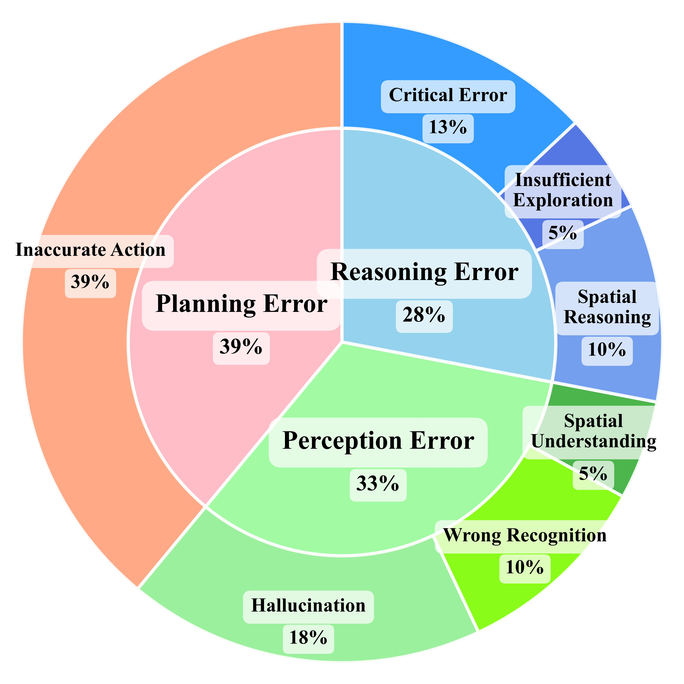

**Original:**

Figure 6: The reason why RoboMemory failed to complete the task

**中文:**

图 6：RoboMemory 未能完成任务的原因。

**Original:**

We analyze the evolution of the spatial KG during long trajectories in EB-ALFRED, focusing on the first 20 iterations (with 95% confidence intervals). As shown in Figure 7, the total number of spatial relationships in the KG (red line) increases gradually over iterations as RoboMemory is exploring the environment. In contrast, the number of relationships retrieved for update at each iteration (blue line) remains relatively stable, typically ranging around 10 edges per iteration. This stability is achieved because our method only updates a local subgraph relevant to the current observation.

**中文:**

我们分析 EB-ALFRED 长轨迹中空间知识图谱的变化，重点考察前 20 次迭代，并给出 95% 置信区间。如图 7 所示，随着 RoboMemory 探索环境，图谱中的空间关系总数（红线）逐渐增加。相比之下，每次迭代检索出来参与更新的关系数（蓝线）较稳定，通常约为 10 条边。这是因为我们只更新与当前观测有关的局部子图。

**Original:**

We define the retrieval ratio as the proportion of relationships updated at each iteration relative to the total number of relationships in the KG. As shown in Figure 7, this ratio (illustrated by gray bars) decreases steadily from 76% initially to 28% at iteration 20. This trend indicates that, as the KG grows, each update affects a progressively smaller fraction of the entire graph. This demonstrates that our spatial KG update mechanism effectively localizes modifications, ensuring computational efficiency and mitigating interference through context-aware incremental updates.

**中文:**

我们把检索比例定义为每次迭代参与更新的关系数占知识图谱总关系数的比例。如图 7 的灰色柱所示，该比例从最初的 76% 稳步降至第 20 次迭代的 28%。这说明图谱越大，每次更新所涉及的比例越小。空间知识图谱更新机制由此将修改限制在局部，通过结合当前情境的增量更新保持计算效率，并减少相互干扰。

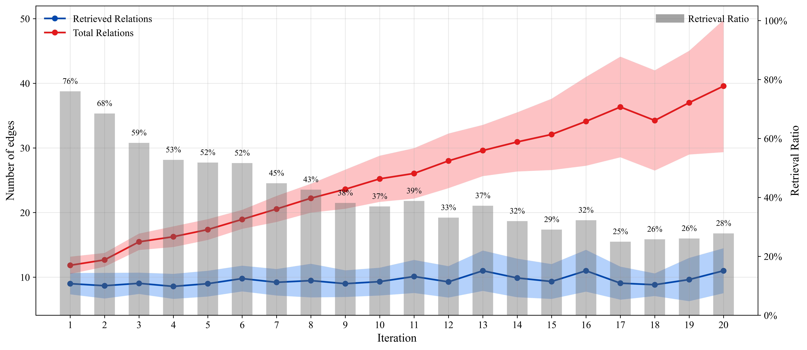

**Original:**

Figure 7: Average relationships related to update in spatial memory in each step.

**中文:**

图 7：每一步空间记忆更新所涉及的平均关系数量。

## 动态空间记忆更新算法

**Original:**

**Algorithm 2: Retrieval-based Incremental Knowledge Graph Update Algorithm**

Require: New spatial knowledge graph $G_{\text{new}}=(V_{\text{new}},E_{\text{new}})$, main spatial knowledge graph $G=(V,E)$, queries $q\in Q$, entity and query embeddings $\mathcal{E}:V\cup Q\rightarrow\mathbb{R}^d$, maximum number of retrieved vertices $n$, maximum k hops $k$, VLM-based conflict resolver $\text{ResolveConflict}(\cdot)$. Ensure: Updated consistent knowledge graph $G'$.

1. $V_{\text{similar}}\leftarrow\bigcup_{q\in Q}\operatorname{TopK}_n(\{v\in V\mid\text{cosine\_sim}(\mathcal{E}(q),\mathcal{E}(v))\})$. For each query entity, retrieve top-$n$ vertices by embedding cosine similarity; take the union over all queries.
2. $V_{\text{expand}}\leftarrow\text{K-hop}_k(V_{\text{similar}},G)$: all nodes within $k$ hops from any node in $V_{\text{similar}}$.
3. $V_{\text{retrieved}}\leftarrow V_{\text{similar}}\cup V_{\text{expand}}$.
4. $V_{\text{merged}}\leftarrow V_{\text{retrieved}}\cup V_{\text{new}}$.
5. $G_{\text{union}}\leftarrow(V\cup V_{\text{new}},E\cup E_{\text{new}})$: combine the main graph and new observations.
6. $G_{\text{local}}\leftarrow\text{InducedSubgraph}(V_{\text{merged}},G_{\text{union}})$: extract all old and new edges among these nodes.
7. $G_{\text{updated}}\leftarrow\text{ResolveConflict}(G_{\text{local}},G_{\text{new}})$: update local relationships based on new observations.
8. $G'\leftarrow(G\setminus G_{\text{local}})\cup G_{\text{updated}}$: replace the old subgraph with the conflict-resolved subgraph.
9. Remove isolated vertices from $G'$.
10. Return $G'$.

**中文:**

**算法 2：基于检索的增量知识图谱更新。**

输入：新空间图谱 $G_{\text{new}}=(V_{\text{new}},E_{\text{new}})$、主图谱 $G=(V,E)$、查询 $q\in Q$、实体与查询嵌入 $\mathcal{E}:V\cup Q\rightarrow\mathbb{R}^d$、检索顶点数量上限 $n$、最大扩展跳数 $k$、VLM 冲突解决器 $\text{ResolveConflict}(\cdot)$。输出：更新后关系一致的图谱 $G'$。

1. $V_{\text{similar}}\leftarrow\bigcup_{q\in Q}\operatorname{TopK}_n(\{v\in V\mid\text{cosine\_sim}(\mathcal{E}(q),\mathcal{E}(v))\})$。对每个查询实体，按嵌入余弦相似度取 top-$n$ 顶点，再合并各查询结果。
2. $V_{\text{expand}}\leftarrow\text{K-hop}_k(V_{\text{similar}},G)$：取得距检索顶点不超过 $k$ 跳的全部顶点。
3. $V_{\text{retrieved}}\leftarrow V_{\text{similar}}\cup V_{\text{expand}}$，合并直接检索与邻域扩展结果。
4. $V_{\text{merged}}\leftarrow V_{\text{retrieved}}\cup V_{\text{new}}$，加入新观测中的顶点。
5. $G_{\text{union}}\leftarrow(V\cup V_{\text{new}},E\cup E_{\text{new}})$，暂时合并主图谱与新观测图谱。
6. $G_{\text{local}}\leftarrow\text{InducedSubgraph}(V_{\text{merged}},G_{\text{union}})$，提取这些顶点的诱导子图，包含它们之间的新旧关系。
7. $G_{\text{updated}}\leftarrow\text{ResolveConflict}(G_{\text{local}},G_{\text{new}})$，根据新观测解决局部关系冲突。
8. $G'\leftarrow(G\setminus G_{\text{local}})\cup G_{\text{updated}}$，用修正后的子图替换主图中的旧子图。
9. 删除 $G'$ 中的孤立顶点。
10. 返回 $G'$。

**Original:**

Spatial Memory is a dynamically updated KG-based module designed to overcome agents’ limitations in spatial reasoning. Specifically, our Spatial Memory is formulated as a directed KG $G=(V,E)$, where $V$ denotes the set of all objects in the environment. Each object is a vertex in the KG. Each object’s name is encoded into a single semantic embedding vector via a pretrained embedding model [53]. The edge set $E$ captures spatial relationships between objects, each represented as a triple (e.g., $[obj_{1},\text{relationship},obj_{2}]$). To update the Spatial KG, we need to continuously extract new relationships from current observations and update the old relationships in the Spatial KG. We use a VLM-based conflict resolver to address this problem. However, the more relationships provided to the conflict resolver, the more time it needs to update the KG. So we need to update relationships that are only related to the current situation. We design an algorithm that retrieves a sub-graph of KG that includes all vertices related to the current situation and both old and new relationships among them. We provide the sub-graph and new relationships to the conflict resolver. We need the conflict resolver to update the sub-graph based on information from the new relationships. The algorithm is shown in Algorithm 2.

**中文:**

空间记忆是一个动态更新的知识图谱模块，用于弥补智能体空间推理能力的不足。具体而言，将空间记忆表示为有向图 $G=(V,E)$，$V$ 为环境中所有物体的集合，每个物体对应一个顶点。物体名称经预训练嵌入模型 [53] 编码为一个语义向量。边集合 $E$ 保存物体之间的空间关系，每条关系表示为三元组，例如 $[obj_{1},\text{relationship},obj_{2}]$。更新时，系统需要持续从当前观测提取新关系，并修改图谱中的旧关系。我们使用基于 VLM 的冲突解决器完成这一过程，但输入的关系越多，更新耗时就越长，因此应只更新与当前情境相关的关系。为此，我们设计子图检索算法，找出与当前情境有关的顶点及它们之间的新旧关系，将子图连同新关系交给冲突解决器，再依据新信息更新子图。算法见算法 2。

**Original:**

To update $G$, we make use of the information provided by the step summarizer and query generator from the information preprocessor introduced in Section III-A. First, a pretrained VLM-based Relation Retriever extracts the latest spatial relationships $G_{\text{new}}=(V_{\text{new}},E_{\text{new}})$ from the information provided by the step summarizer, which records high-level information in the current observation. Next, natural language queries (represented as $q\in Q$) (provided by the query generator) are used to retrieve relevant object vertices from $G$ via cosine similarity search. We select the top $n$ similar vertices compared with the query. These vertices are represent by $V_{\text{similar}}$.

**中文:**

更新 $G$ 时，我们使用第 III-A 节信息预处理器中的步骤摘要器和查询生成器所提供的信息。首先，基于预训练 VLM 的关系检索器，从步骤摘要器记录的当前观测高层信息中提取最新空间关系，形成 $G_{\text{new}}=(V_{\text{new}},E_{\text{new}})$。随后，以查询生成器提供的自然语言查询 $q\in Q$，通过余弦相似度在 $G$ 中检索相关物体顶点。选取与查询最相似的前 $n$ 个顶点，记为 $V_{\text{similar}}$。

**Original:**

Spatial KG maintains the relationships among different objects, so if we want to retrieve spatial information from spatial KG, we need to search for other objects that are related to the objects we observed in the current observation. In this way, we not only remember objects we can see, but also know the spatial information of the objects we cannot see. So we choose the k-hop algorithm to expand $V_{\text{similar}}$ using a K-hop neighborhood algorithm to capture contextually related objects. The K-hop algorithm is represented as $\text{K-hop}_{k}(V,G)$, which returns all vertices reachable within $\leq k$ hops from any vertices in $V$. The retrieved vertices are $V_{\text{expand}}$. We combine the vertices retrieved by cosine similarity and their K-hop neighbors to $V_{\text{retrieved}}$.

**中文:**

空间知识图谱保存不同物体之间的关系。因此，检索空间信息时，还需要查找与当前可见物体有关的其他物体。这样，系统不仅记得看得见的物体，还能获知暂时不可见物体的空间信息。我们采用 K 跳邻域算法扩展 $V_{\text{similar}}$，找出在当前情境中相关的物体。将该算法记为 $\text{K-hop}_{k}(V,G)$，它返回从 $V$ 中任意顶点出发、经不超过 k 跳（$\leq k$）可达的所有顶点。扩展结果记为 $V_{\text{expand}}$。把余弦相似度检索结果与其 K 跳邻居合并，得到 $V_{\text{retrieved}}$。

**Original:**

However, we need to resolve the conflict between new and old relationships. So $V_{\text{retrieved}}$ and the relationships among $V_{\text{retrieved}}$ is not enough. We need new vertices and relationships involved in the graph we provided to the VLM-based conflict resolver. To extract all vertices and relationships for the VLM-based conflict resolver and relationships, we not only need the relationships from KG (old information) and $G_{\text{new}}$, which represent new information. We need to connect old information and new information. To achieve this goal, we merge $G_{\text{new}}$ to $G$, which add new edges and vertices to $G$. We denote the merged KG as $G_{\text{union}}$. In $G_{\text{union}}$, we mix out-of-date and latest information. Then, we extract an induced sub-graph of $V_{\text{merged}}=V_{\text{retrieved}}\cup V_{\text{new}}$ from $G_{\text{union}}$. As both vertices from old graph $G$ and new graph is mixed in $V_{\text{merged}}$ and both edges from old and new graph is in $G_{\text{union}}$, the retrieved induced sub-graph $G_{\text{local}}$ contains all out-of-date and latest relationships among vertices that is related to current situation.

**中文:**

但要解决新旧关系冲突，仅有 $V_{\text{retrieved}}$ 及 $V_{\text{retrieved}}$ 内部关系还不够，提供给 VLM 冲突解决器的图中还必须包括新顶点和新关系。系统既需要原知识图谱中的旧关系，也需要 $G_{\text{new}}$ 中的新信息，并将两者连接起来。为此，先把 $G_{\text{new}}$ 合并到 $G$，将新顶点和新边加入 $G$，所得图谱记为 $G_{\text{union}}$，在 $G_{\text{union}}$ 中暂时同时保存过时和最新的信息。随后，从 $G_{\text{union}}$ 中提取顶点集合 $V_{\text{merged}}=V_{\text{retrieved}}\cup V_{\text{new}}$ 的诱导子图。由于 $V_{\text{merged}}$ 同时包含原图 $G$ 和新图中的顶点，$G_{\text{union}}$ 同时包含新旧边，得到的局部子图 $G_{\text{local}}$ 就包含与当前情境相关顶点之间的全部旧关系和最新关系。

**Original:**

As $G_{\text{local}}$ contains all out-of-date and latest relationships and those relationships may have conflicts, a VLM-based conflict resolver (represent as $\text{ResolveConflict}(\cdot)$) is designed to resolve conflicts in $G_{\text{local}}$, and make sure that the relationship is the latest. The conflict resolver will take in $G_{\text{new}}$ and $G_{\text{local}}$, where $G_{\text{local}}$ is the graph waiting for update and $G_{\text{new}}$ provide update signal. The VLM-based conflict resolver will perform necessary updates such as adding vertices or inserting, deleting, or modifying relationships in $G_{\text{local}}$ based on $G_{\text{new}}$. The reconciled subgraph is then merged back into $G$, and any vertices that have lost all connections to other vertices during the update are pruned.

**中文:**

$G_{\text{local}}$ 同时包含可能相互冲突的新旧关系，因此我们设计基于 VLM 的冲突解决器 $\text{ResolveConflict}(\cdot)$，处理 $G_{\text{local}}$ 中的冲突，确保关系反映最新状态。它接收 $G_{\text{new}}$ 和 $G_{\text{local}}$：$G_{\text{new}}$ 提供更新依据，$G_{\text{local}}$ 是待更新的图。冲突解决器根据 $G_{\text{new}}$，对 $G_{\text{local}}$ 执行必要操作，如添加顶点、插入关系、删除关系或修改关系。消解冲突后的子图被合并回 $G$，更新过程中失去全部连接的顶点则被删除。

**Original:**

This design offers two key advantages: (1) Efficiency via localized updates: By restricting modifications to a context-relevant subgraph, we significantly reduce the number of relationships processed per update. Since VLMs struggle with reasoning over large sets of relationships, this constraint substantially improves both the efficiency and effectiveness of VLM-based KG updates. (2) Dynamic adaptability: The system continuously maintains up-to-date spatial knowledge, enabling agents to operate robustly in dynamic real-world environments.

**中文:**

该设计有两个主要优点：(1) 局部更新提高效率。把修改范围限制在与当前情境有关的子图中，能够显著减少每次处理的关系数量。VLM 难以对大量关系进行推理，因此这一限制同时改善了知识图谱更新的效率和效果；(2) 动态适应。系统持续维护最新空间知识，使智能体能够在真实动态环境中稳健运行。

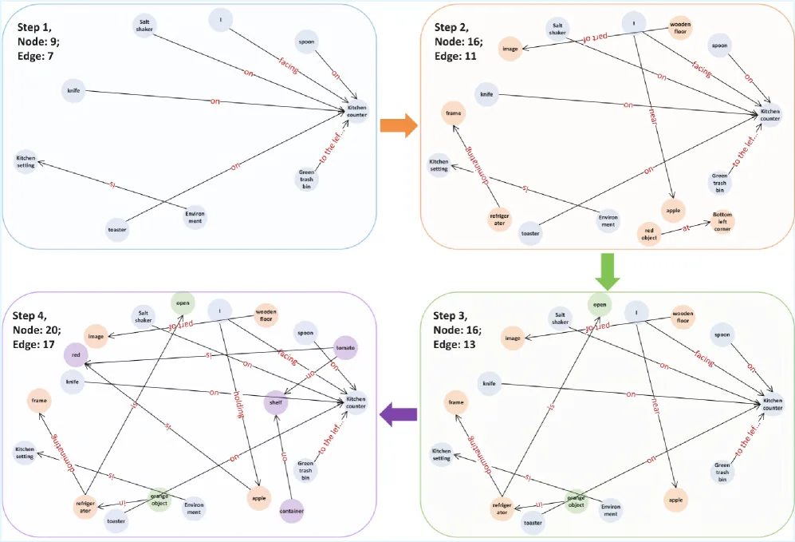

**Original:**

Figure 8: Visualization of Spatial Memory’s dynamic update process.

**中文:**

图 8：空间记忆动态更新过程示意。

**Original:**

In RoboMemory’s Spatial Memory, the KG is dynamically constructed during environment exploration. As illustrated in Figure 8, we demonstrate the progressive expansion of the KG in Spatial Memory as the agent navigates through the environment. The figure indicates a continuous growth in the number of both vertices and edges of the KG as exploration progresses.

**中文:**

RoboMemory 的空间知识图谱在探索环境的过程中动态构建。图 8 展示了智能体导航时图谱逐步扩展的过程：随着探索推进，顶点数和边数都持续增加。

**Original:**

Notably, the KG undergoes dynamic updates through RoboMemory’s environmental interactions. For example, the initial KG state displays the relation “I am near the apple. But as the agent picks up the apple in the third step, in the fourth KG, the relationship becomes “I hold the apple”. This demonstrates RoboMemory’s capability for dynamic KG maintenance and expansion.

**中文:**

知识图谱还会随 RoboMemory 与环境的交互动态更新。例如，最初图谱中的关系是“我在苹果附近”；智能体在第 3 步拿起苹果后，第 4 个图谱中的关系就变为“我拿着苹果”。这一变化体现了 RoboMemory 动态维护和扩展图谱的能力。

**Original:**

By querying this KG, the Planner-Critic module gains access to rich spatial information, empowering RoboMemory with robust spatial memory capabilities that significantly enhance its performance in EmbodiedBench environments.

**中文:**

通过查询知识图谱，Planner-Critic 模块获得丰富的空间信息，为 RoboMemory 提供稳健的空间记忆能力，显著改善其在 EmbodiedBench 环境中的表现。

## 动态空间记忆更新算法的证明

**Original:**

Let $G=(V,E)$ be a finite directed graph with maximum out-degree $D\geq 1$, and let $\mathcal{S}\subseteq V$ be a set of $M$ source vertices. Define the K-hop neighborhood $\mathcal{N}_{K}(s)$ of a vertex $s\in\mathcal{S}$ as the set of vertices reachable from $s$ via directed paths of length at most $K$. Then the total number of distinct vertices in the union of all K-hop neighborhoods,

**中文:**

设 $G=(V,E)$ 是有限有向图，最大出度为 $D\geq 1$；$\mathcal{S}\subseteq V$ 是由 $M$ 个源顶点构成的集合。对任意 $s\in\mathcal{S}$，其 K 跳邻域 $\mathcal{N}_{K}(s)$ 定义为：从 $s$ 出发，沿长度至多为 $K$ 的有向路径可达的顶点集合。所有这些 K 跳邻域的并集为：

**Original:**

$$
\mathcal{N}_{K}(\mathcal{S})=\bigcup_{s\in\mathcal{S}}\mathcal{N}_{K}(s),
$$

**中文:**

公式（符号保持不变）：

$$
\mathcal{N}_{K}(\mathcal{S})=\bigcup_{s\in\mathcal{S}}\mathcal{N}_{K}(s),
$$

**Original:**

Satisfies the following upper bound:

**中文:**

其中不同顶点的总数满足以下上界：

**Original:**

$$
|\mathcal{N}_{K}(\mathcal{S})|\leq\begin{cases}M\cdot\dfrac{D^{K+1}-1}{D-1},&\text{if }D>1,\\
M\cdot(K+1),&\text{if }D=1.\end{cases}
$$

**中文:**

公式（符号保持不变）：

$$
|\mathcal{N}_{K}(\mathcal{S})|\leq\begin{cases}M\cdot\dfrac{D^{K+1}-1}{D-1},&\text{if }D>1,\\
M\cdot(K+1),&\text{if }D=1.\end{cases}
$$

**Original:**

For any vertex $s\in\mathcal{S}$, the number of distinct vertices reachable from $s$ within $i$ hops is at most $D^{i}$, assuming the worst-case scenario where each vertex encountered has the maximum out-degree $D$, and all neighbors are distinct and non-overlapping.

**中文:**

对于任意顶点 $s\in\mathcal{S}$，考虑最坏情况：遇到的每个顶点出度均为最大值 $D$，且所有邻居互不相同、不发生重叠。此时，从 $s$ 出发在 $i$ 跳内可达的不同顶点数至多为 $D^{i}$。

**Original:**

Thus, the size of the K-hop neighborhood of a single vertex satisfies:

**中文:**

因此，单个顶点的 K 跳邻域大小满足：

**Original:**

$$
|\mathcal{N}_{K}(s)|\leq\sum_{i=0}^{K}D^{i}=\begin{cases}\dfrac{D^{K+1}-1}{D-1},&\text{if }D>1,\\
K+1,&\text{if }D=1.\end{cases}
$$

**中文:**

公式（符号保持不变）：

$$
|\mathcal{N}_{K}(s)|\leq\sum_{i=0}^{K}D^{i}=\begin{cases}\dfrac{D^{K+1}-1}{D-1},&\text{if }D>1,\\
K+1,&\text{if }D=1.\end{cases}
$$

**Original:**

Since there are $M$ such source vertices and assuming no overlaps between their K-hop neighborhoods (worst case), the union size satisfies:

**中文:**

共有 $M$ 个这样的源顶点。假设它们的 K 跳邻域互不重叠，即最坏情况，则并集大小满足：

**Original:**

$$
|\mathcal{N}_{K}(\mathcal{S})|\leq M\cdot|\mathcal{N}_{K}(s)|.
$$

**中文:**

公式（符号保持不变）：

$$
|\mathcal{N}_{K}(\mathcal{S})|\leq M\cdot|\mathcal{N}_{K}(s)|.
$$

**Original:**

Substituting the bound on $|\mathcal{N}_{K}(s)|$ gives the result. ∎

**中文:**

代入 $|\mathcal{N}_{K}(s)|$ 的上界，即得结论。∎

**Original:**

Let $G=(V,E)$ be a finite directed graph with $|V|=n$ vertices. Assume the maximum out-degree is at most $D_{\max}=Dn$, and the maximum in-degree is at most $N_{\max}=Nn$, where $D,N\in(0,1]$ are constants. Let $\mathcal{S}\subseteq V$ be a set of $M$ source vertices. Define $\mathcal{N}_{K}(\mathcal{S})$ as the union of all vertices reachable from $\mathcal{S}$ via paths of length at most $K$, using only outgoing edges. Then the number of extracted vertices satisfies:

**中文:**

设 $G=(V,E)$ 是有限有向图，顶点数为 $|V|=n$。假设最大出度不超过 $D_{\max}=Dn$，最大入度不超过 $N_{\max}=Nn$，其中 $D,N\in(0,1]$ 为常数。设 $\mathcal{S}\subseteq V$ 为包含 $M$ 个源顶点的集合。定义 $\mathcal{N}_{K}(\mathcal{S})$ 为从 $\mathcal{S}$ 出发、仅沿出边、经过长度至多为 $K$ 的路径可达的全部顶点之并集。则提取的顶点数满足：

**Original:**

$$
|\mathcal{N}_{K}(\mathcal{S})|\leq\min\left\{n,\;M\cdot\frac{(Dn)^{K+1}-1}{Dn-1}\right\}.
$$

**中文:**

公式（符号保持不变）：

$$
|\mathcal{N}_{K}(\mathcal{S})|\leq\min\left\{n,\;M\cdot\frac{(Dn)^{K+1}-1}{Dn-1}\right\}.
$$

**Original:**

In particular, when $Dn\gg 1$, we have the approximation:

**中文:**

特别地，当 $Dn\gg 1$ 时，有如下近似：

**Original:**

$$
|\mathcal{N}_{K}(\mathcal{S})|\lessapprox M\cdot(Dn)^{K}.
$$

**中文:**

公式（符号保持不变）：

$$
|\mathcal{N}_{K}(\mathcal{S})|\lessapprox M\cdot(Dn)^{K}.
$$

**Original:**

For each vertex $s\in\mathcal{S}$, the maximum number of reachable vertices within $i$-hops is at most $(Dn)^{i}$ under the assumption of maximum out-degree and no overlap.

**中文:**

对每个顶点 $s\in\mathcal{S}$，在最大出度且邻域不重叠的假设下，$i$ 跳内可达顶点数至多为 $(Dn)^{i}$。

**Original:**

Summing over hops from 0 to $K$, we get for each root:

**中文:**

将跳数从 0 到 $K$ 的各项相加，对于每个源顶点有：

**Original:**

$$
|\mathcal{N}_{K}(s)|\leq\sum_{i=0}^{K}(Dn)^{i}=\frac{(Dn)^{K+1}-1}{Dn-1}.
$$

**中文:**

公式（符号保持不变）：

$$
|\mathcal{N}_{K}(s)|\leq\sum_{i=0}^{K}(Dn)^{i}=\frac{(Dn)^{K+1}-1}{Dn-1}.
$$

**Original:**

Assuming no overlap among the $M$ source vertex expansions (worst case), we have:

**中文:**

假设 $M$ 个源顶点的扩展结果互不重叠，即最坏情况，则：

**Original:**

$$
|\mathcal{N}_{K}(\mathcal{S})|\leq M\cdot\frac{(Dn)^{K+1}-1}{Dn-1}.
$$

**中文:**

公式（符号保持不变）：

$$
|\mathcal{N}_{K}(\mathcal{S})|\leq M\cdot\frac{(Dn)^{K+1}-1}{Dn-1}.
$$

**Original:**

Since the total number of vertices in the graph is $n$, this quantity is also trivially bounded above by $n$, yielding the result. ∎

**中文:**

由于全图只有 $n$ 个顶点，这个数量显然也不超过 $n$，由此得到结论。∎

## 补充环境设置

**Original:**

We adopt the same environment parameters as in EmbodiedBench. The maximum steps per task are set to 30, with image inputs of size 500 $\times$ 500. The temporal memory buffer length is set to 3. In addition, we rewrite the action APIs to a Python function format, where each action takes an object parameter indicating its target. We extract all possible objects from the environment as inputs to the Agent. The Agent must select appropriate actions and object parameters based on task requirements. Compared to the original interaction method in EmbodiedBench (which enumerates all possible actions, including both action names and target objects, and requires the Agent to choose), our approach offers greater flexibility. The detailed action APIs are presented in Table IV.

**中文:**

我们沿用 EmbodiedBench 的环境参数：每个任务最多 30 步，图像输入为 500 $\times$ 500，时间记忆缓冲区长度为 3。动作 API 改写为 Python 函数，每个动作接收一个表示目标物体的参数。我们提取环境中所有可能的物体，作为智能体输入；智能体根据任务要求选择合适的动作及物体参数。EmbodiedBench 原本列出所有“动作名称 + 目标物体”组合供智能体选择，相比之下，我们的方式更灵活。详细动作 API 见表 IV。

**Original:**

Since EB-ALFRED and EB-Habitat provide comprehensive high-level action APIs, we do not employ the VLA-Based Low-Level Executor in these environments. Instead, we utilize the built-in low-level controllers from EmbodiedBench.

**中文:**

EB-ALFRED 和 EB-Habitat 已提供完整的高层动作 API，因此在这两个环境中，我们不使用基于 VLA 的底层执行器，而使用 EmbodiedBench 内置的底层控制器。

**Original:**

EB-ALFRED and EB-Habitat. For our single VLM-Agent baseline, we utilized the reported results from the EmbodiedBench paper to establish a consistent benchmark, where the agent relies on a basic interaction history as its memory module. For other VLM frameworks, we replicated the experimental setups as described in both EmbodiedBench and the respective original papers. Crucially, to familiarize all baseline agents with the EmbodiedBench environment, we supplemented them with a few-shot example and a comprehensive catalog of actionable objects—applying the exact same conditions as those used for the single VLM-Agent benchmark.

**中文:**

EB-ALFRED 与 EB-Habitat。单一 VLM 智能体基线采用 EmbodiedBench 论文报告的结果，以保持统一的比较基准；其中智能体仅用基本交互历史作为记忆。对于其他 VLM 框架，我们按 EmbodiedBench 及相应原论文复现实验设置。为让所有基线智能体熟悉 EmbodiedBench 环境，我们还提供少样本示例和完整的可操作物体目录，与单一 VLM 智能体基线使用的条件完全一致。

**Original:**

For VLM-Agent Frameworks, we use the same VLMs (listed in Table I) to power all modules that require VLM control.

**中文:**

在每个 VLM 智能体框架内，所有需要 VLM 的模块均使用表 I 所列的同一模型。

**Original:**

**TABLE IV: Robot Action Command For different environments**

| Action Type | EB-ALFRED | EB-Habitat | Real World |
| --- | --- | --- | --- |
| Navigation | find(obj) | navigate(point) | navigate_to(point) |
| Pick Up Object | pick_up(obj) | pick(obj) | pick_up(obj) |
| Drop to Ground | drop() | – | – |
| Place to Receptacle | put_down() | place(rec) | put_down_to(rec) |
| Open Object | open(obj) | open(obj) | open(obj) |
| Close Object | close(obj) | close(obj) | close(obj) |
| Turn On | turn_on(obj) | – | turn_on(obj) |
| Turn Off | turn_off(obj) | – | turn_off(obj) |
| Slice Object | slice(obj) | – | – |
| Task Complete | – | – | task_complete() |

**中文:**

**表 IV：不同环境中的机器人动作命令。**

| 动作类型 | EB-ALFRED | EB-Habitat | 真实环境 |
| --- | --- | --- | --- |
| 导航 | find(obj) | navigate(point) | navigate_to(point) |
| 拿起物体 | pick_up(obj) | pick(obj) | pick_up(obj) |
| 丢到地上 | drop() | – | – |
| 放入容器 | put_down() | place(rec) | put_down_to(rec) |
| 打开物体 | open(obj) | open(obj) | open(obj) |
| 合上物体 | close(obj) | close(obj) | close(obj) |
| 开启设备 | turn_on(obj) | – | turn_on(obj) |
| 关闭设备 | turn_off(obj) | – | turn_off(obj) |
| 切片 | slice(obj) | – | – |
| 完成任务 | – | – | task_complete() |

**Original:**

We construct a common kitchen scenario to evaluate the RoboMemory framework’s interactive environmental learning capabilities in real-world settings. Using Mobile ALOHA [17] as our physical robotic platform, we design three categories of tasks: (1) Pick up & put down: The agent must locate a specified object among all possible positions and place it at a designated location. This task tests the model’s basic object-searching and planning abilities. (2) Pick up, operate & put down: Building upon the first task, the agent must additionally perform operations such as heating or cleaning the object. This task requires longer-term planning, which is crucial in embodied environments. (3) Pick up, gather & put down: The agent must place specified objects into a movable container and then move the container to a target location. This task evaluates the agent’s understanding of object relationships, requiring it to remember the positions of at least two objects (the container and the target item) and their spatial relationship. For each type of task, we design 5 tasks. So our experiments include 15 long-term real-world tasks.

**中文:**

我们搭建常见的厨房场景，评估 RoboMemory 在真实环境中的交互式环境学习能力。物理机器人平台采用 Mobile ALOHA [17]，任务分三类：(1) 拿起并放下：在所有可能位置中找到指定物体，将其放到指定地点，测试基本的物体搜索与规划能力；(2) 拿起、操作并放下：在第一类任务上增加加热或清洁等操作，需要具身环境中十分重要的较长时域规划能力；(3) 拿起、收集并放下：将指定物体放进可移动容器，再把容器移至目标地点，考察物体关系理解能力。智能体至少要记住容器和目标物体这两个对象的位置及其空间关系。每类设计 5 个任务，共 15 个真实环境长时域任务。

**Original:**

To adapt to the real-world setup, we define high-level action APIs similar to those in EB-ALFRED and EB-Habitat. Additionally, we train a VLA-based model to execute tasks according to our action APIs. The detailed action APIs are presented in Table IV.

**中文:**

针对真实环境，我们定义了与 EB-ALFRED 和 EB-Habitat 类似的高层动作 API，并训练一个 VLA 模型来执行这些 API 对应的任务。具体接口见表 IV。

**Original:**

For the low-level executor, we use one main camera and two arm-mounted cameras as input, each with a resolution of 640 $\times$ 480. The temporal memory buffer length is set to 3.

**中文:**

底层执行器使用一个主相机和两个安装在机械臂上的相机作为输入，每个相机分辨率均为 640 $\times$ 480。时间记忆缓冲区长度设为 3。

**Original:**

In our experiments, we set the maximum steps per task to 25. We also provide an API for actively terminating tasks. Since real-world environments lack direct success/failure feedback, RoboMemory must autonomously determine task completion. To prevent excessively long task execution, we enforce termination after 25 steps if no success is achieved. A single main camera (640 $\times$ 480 resolution) records video during action execution as input for RoboMemory’s higher-level processing.

**中文:**

真实实验中，每个任务最多执行 25 步，并提供主动结束任务的 API。真实环境没有直接的成功或失败反馈，因此 RoboMemory 必须自行判断任务是否完成。为避免执行时间过长，若 25 步后仍未成功，则强制结束。一个分辨率为 640 $\times$ 480 的主相机在动作执行期间录制视频，作为 RoboMemory 高层处理模块的输入。

**Original:**

We use the $\pi_{0}$ model as our foundation model. We collected 1,040 data samples over 10 types of tasks for fine-tuning. We use LoRA fine-tuning to save resources during fine-tuning. The specific fine-tuning parameters and action types are given in Table V. For tasks involving both pick-up and place actions, we split these tasks into separate pick-up and place actions. These are then treated as two distinct data samples during training. The separation of pick-up and place action allows the VLA to carry an object in its hand. For training, we used a server with six A100-80GB GPUs. The total training time was 12 hours.

**中文:**

我们以 $\pi_{0}$ 为基础模型，收集了 10 类任务共 1,040 个数据样本进行微调，并采用 LoRA 降低资源消耗。具体微调参数和动作类型见表 V。对于同时包含抓取与放置的任务，我们将其拆成独立的抓取动作和放置动作，训练时作为两个样本处理。这样的拆分让 VLA 可以在抓取后保持手持物体的状态。训练使用一台配备 6 张 A100-80GB GPU 的服务器，总耗时 12 小时。

**Original:**

Besides, we use the built-in LiDAR SLAM system of the Mobile ALOHA robot base as the navigation action actuator. We define five typical navigation points, similar to EB-Habitat. We used SLAM to navigate between these navigation points.

**中文:**

导航动作由 Mobile ALOHA 底盘内置的 LiDAR SLAM 系统执行。我们参考 EB-Habitat 设置 5 个典型导航点，使用 SLAM 在这些点之间导航。

**Original:**

**TABLE V: Dataset statistics and training hyperparameters for robotic manipulation tasks.**

| Dataset Statistics | Training Configuration |  |  |
| --- | --- | --- | --- |
| Action Type | #Episodes | Parameter | Value |
| Turning on/off faucet | 142 | Optimizer | AdamW |
| Picking up & Placing basket on counter | 63 | Batch size | $32\times 6$ |
| Picking up & Placing basket in sink | 72 | Training steps | 10,000 |
| Picking up & Placing banana into basket | 114 | Learning rate | $6.12\times 10^{-5}$ |
| Throwing bottle into trash bin | 132 | warm up step | 500 |
| Placing gum box on dish | 120 | LoRA Configuration |  |
| Picking up & Placing cup on plate | 51 | rank | 16 |
| Picking up & Placing dish into sink | 69 | $\alpha$ | 16 |
| Throwing paper ball into trash bin | 135 | Resource Usage |  |
| Open/close oven | 142 | GPU | A100-80GB $\times$ 6 |
| Total episodes | 1040 | Training time | 12 hours |

**中文:**

**表 V：机器人操作任务的数据集统计与训练超参数。**

| 数据集统计 | 训练配置 |  |  |
| --- | --- | --- | --- |
| 动作类型 | 回合数 | 参数 | 取值 |
| 开启/关闭水龙头 | 142 | 优化器 | AdamW |
| 拿起篮子并放到台面 | 63 | 批量大小 | $32\times 6$ |
| 拿起篮子并放进水槽 | 72 | 训练步数 | 10,000 |
| 拿起香蕉并放进篮子 | 114 | 学习率 | $6.12\times 10^{-5}$ |
| 将瓶子扔进垃圾桶 | 132 | 学习率预热步数 | 500 |
| 将口香糖盒放到盘子上 | 120 | LoRA 配置 |  |
| 拿起杯子并放到盘子上 | 51 | 秩 | 16 |
| 拿起盘子并放进水槽 | 69 | $\alpha$ | 16 |
| 将纸团扔进垃圾桶 | 135 | 资源用量 |  |
| 打开/合上烤箱 | 142 | GPU | A100-80GB $\times$ 6 |
| 总回合数 | 1040 | 训练时间 | 12 小时 |

**Original:**

In this section, we describe the hyperparameter settings for the upper brain of RoboMemory: the information preprocessor and the Comprehensive Embodied Memory. Importantly, we use a unified set of hyperparameters across all experimental settings, including EB-ALFRED, EB-Habitat, and real-world deployments.

**中文:**

本节介绍 RoboMemory 高层部分——信息预处理器和综合具身记忆——的超参数。EB-ALFRED、EB-Habitat 和真实环境部署使用同一套超参数。

**Original:**

The information preprocessor consists of two components: a step summarizer and a query generator. Given multimodal inputs at each step, the step summarizer produces a single natural language description, while the query generator concurrently formulates $4-5$ distinct natural language queries.

**中文:**

信息预处理器包含步骤摘要器和查询生成器。每一步接收多模态输入后，步骤摘要器生成一条自然语言描述，查询生成器则同时生成 $4-5$ 条不同的自然语言查询。

**Original:**

The Comprehensive Embodied Memory integrates four memory modules: Temporal, Spatial, Semantic, and Episodic Memory. The Temporal Memory is implemented as a fixed-size buffer with a maximum capacity of $4$ entries. For Spatial Memory, during similarity-based retrieval, we first identify the top $N=3$ most relevant vertices and then perform a K-hop graph traversal with $K=2$. The Episodic Memory retrieves the top $N=5$ most relevant past experiences for each query. The Semantic Memory maintains hierarchical summaries at both the action and task levels; during retrieval, it returns $N_{s}=2$ action-level and $N_{t}=2$ task-level summaries. Furthermore, memory updates (e.g., insertion, modification, or deletion) are applied only to the top $N_{\text{update}}=10$ most relevant entries in the Semantic Memory to ensure efficiency and coherence.

**中文:**

综合具身记忆包括时间、空间、语义和情景四个模块。时间记忆采用固定大小缓冲区，最多保存 $4$ 条记录。空间记忆先根据相似度检索最相关的 $N=3$ 个顶点，再进行 $K=2$ 的 K 跳图遍历。情景记忆为每个查询返回最相关的 $N=5$ 条历史经验。语义记忆同时维护动作级与任务级的分层摘要，检索时分别返回 $N_{s}=2$ 条动作级摘要和 $N_{t}=2$ 条任务级摘要。为保证效率和一致性，语义记忆的插入、修改或删除等更新，只涉及最相关的 $N_{\text{update}}=10$ 条记录。

## 定性分析的补充示例

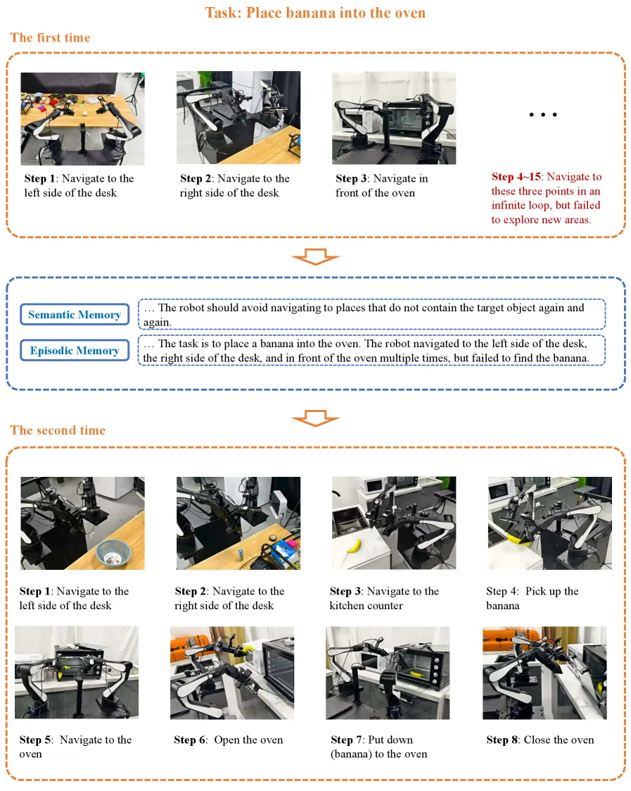

**Original:**

Figure 9: Case that a task is failed, but the experience can help RoboMemory to succeed in the next try.

**中文:**

图 9：一次任务虽然失败，但所得经验帮助 RoboMemory 在下一次尝试中成功。

**Original:**

In Figure 9, we demonstrate an example of RoboMemory learning through trial and error in a real-world environment. Our task is “place a banana into the oven.” This task required RoboMemory to complete the objectives of finding the banana, picking it up, and transporting it to the oven. We observed that RoboMemory became stuck in an infinite loop during the first attempt. The banana was randomly placed on the “kitchen counter,” but RoboMemory overlooked this navigation target and remained trapped, exploring other navigation targets instead.

**中文:**

图 9 展示 RoboMemory 在真实环境中通过试错学习的案例。任务是“把香蕉放进烤箱”，需要找到香蕉、拿起香蕉并将其送到烤箱。第一次尝试中，系统陷入无限循环。香蕉随机放在“厨房台面”上，但 RoboMemory 忽略了这个导航目标，一直在其他导航目标之间搜索，无法脱困。

**Original:**

However, based on this bad attempt, the semantic memory summarized that the robot should not repeatedly search in locations where the “banana” could not be found. Meanwhile, the episodic memory recorded what RoboMemory had done and the outcomes during the first attempt. Based on the information provided by semantic and episodic memory, in the second attempt, RoboMemory recognized that it had not previously tried navigating to the “kitchen counter.” After attempting this, it successfully completed the task. This example illustrates the role of RoboMemory’s long-term memory.

**中文:**

根据这次失败尝试，语义记忆总结出：不应反复搜索已经找不到香蕉的位置；情景记忆则记录第一次尝试中的行为及结果。第二次尝试时，RoboMemory 利用这两类信息，意识到此前从未尝试导航到“厨房台面”。前往该位置后，它成功完成了任务，体现了长期记忆的作用。

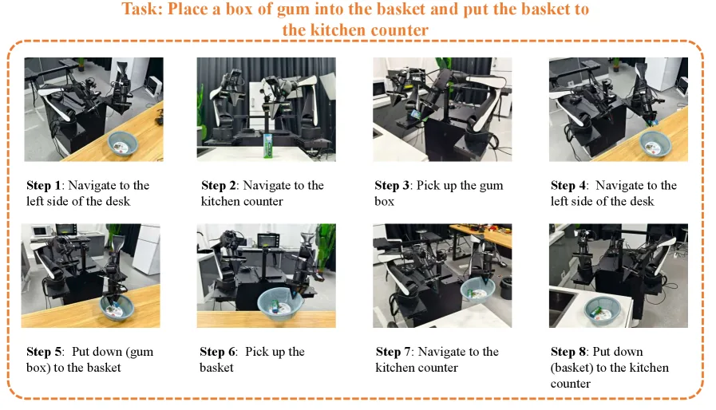

**Original:**

Figure 10: Case that a task is successful.

**中文:**

图 10：任务成功完成的案例。

**Original:**

We also provide an example that completes the task in the first attempt. The example is shown in Figure 10. This example demonstrates that the RoboMemory has the ability to handle some relatively complex tasks in the real world. The task in this example is “Place a box of gum into the basket and put the basket on the kitchen counter”. Because two objects in different positions are involved in this task, RoboMemory has to memorize the position of at least one object to achieve the goal. With the help of the spatial memory, RoboMemory completes the task successfully.

**中文:**

图 10 给出一个首次尝试即成功的案例，说明 RoboMemory 能处理真实环境中相对复杂的任务。任务是“把一盒口香糖放进篮子，再把篮子放到厨房台面”。两个物体位于不同位置，系统至少要记住其中一个物体的位置才能完成目标。借助空间记忆，RoboMemory 成功完成了任务。

**Original:**

We select three examples in EB-ALFRED to show the errors that RoboMemory may encounter and the reasons why or why not RoboMemory can achieve the goal.

**中文:**

我们从 EB-ALFRED 中选取三个案例，展示 RoboMemory 可能遇到的错误，以及它能够或无法完成目标的原因。

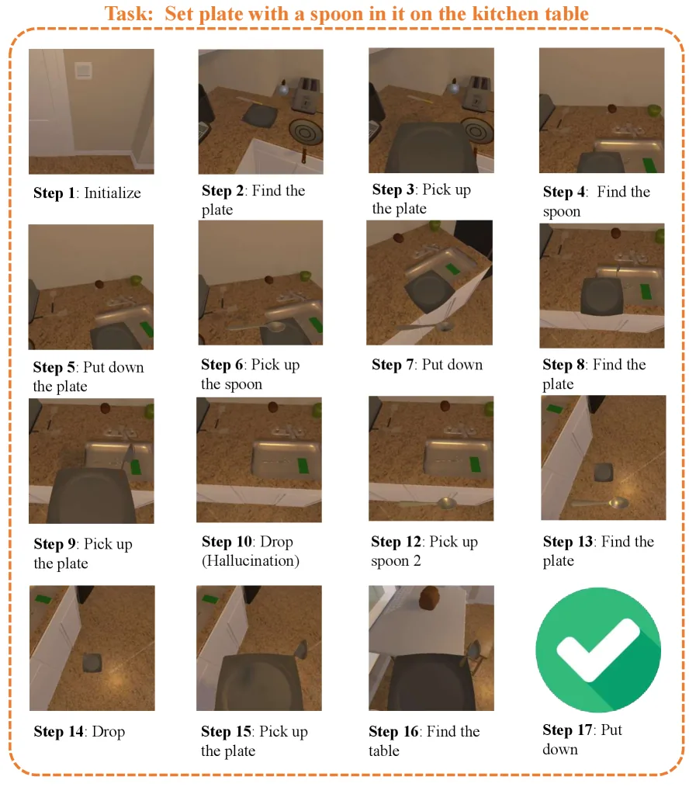

**Original:**

Figure 11: Case that a task is successful with the help of the critic and spatial memory modules.

**中文:**

图 11：在评判模块和空间记忆帮助下成功完成任务的案例。

**Original:**

Successful example. We select a successful example to show how RoboMemory performed in the EB-ALFRED environment. The example trajectory is shown in Figure 11.

**中文:**

成功案例。我们选取一个成功任务展示 RoboMemory 在 EB-ALFRED 中的表现，执行轨迹见图 11。

**Original:**

The task of this example is “set a plate with a spoon on it on the kitchen table”. However, in step 10, the Planner seems to ignore the temporal information from memory modules. RoboMemory thinks that it still needs to pick up the spoon (even though it has already placed a spoon in the plate). However, with the help of the critic, it finally becomes aware that picking up another spoon is redundant, so RoboMemory goes back to the current trajectory and successfully completes the task at the end.

**中文:**

该案例的任务是“把装有勺子的盘子放到厨房桌上”。但第 10 步时，规划器似乎忽略了记忆中的时间顺序信息：明明已经把勺子放进盘子，系统却仍认为需要再拿一把勺子。评判器帮助它意识到这一动作多余，于是回到当前任务应有的执行流程，最终完成任务。

**Original:**

In this example, RoboMemory successfully overcame the hallucination and eventually achieved the goal. This example demonstrates that the critic module can help RoboMemory to overcome error cases.

**中文:**

在该案例中，RoboMemory 成功纠正幻觉并完成目标，说明评判模块能够帮助系统克服错误。

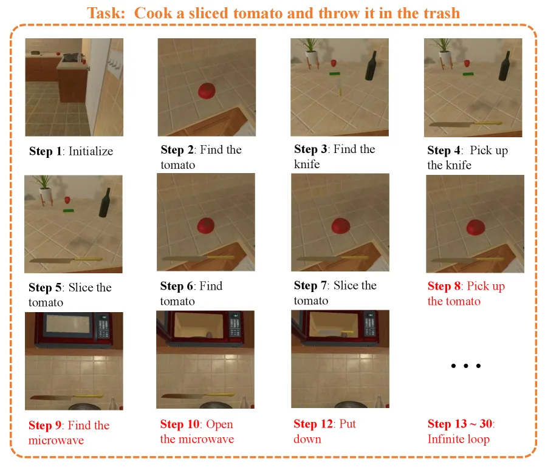

**Original:**

Figure 12: Case that a task fails in an infinite loop because the critic module failed to stop the agent when its planned action is no longer suitable.

**中文:**

图 12：计划动作已不再适用，但评判模块未及时阻止智能体，导致任务陷入无限循环并失败。

**Original:**

Failed example. We demonstrate a representative example of the Critical Error. The example trajectory is shown in Figure 12. In this example, the task involves slicing and heating a tomato and moving the heated tomato slice to the trash can. Initially, RoboMemory successfully sliced the tomato with a knife. But when the planner plans the whole sequence, it forgets to drop the knife before picking up the tomato (this is necessary because in EB-ALFRED, the robot can only hold one object at a time). The critic and the planner should notice this situation and ask the critic to replan, as RoboMemory failed to pick up a tomato slice. However, the critic module ignores this issue, and thus, after it heats the knife instead of a tomato slice, it stacks in an infinite loop.

**中文:**

失败案例。图 12 展示一个典型的评判相关错误案例。任务是切开并加热番茄，再将加热后的番茄片移到垃圾桶。系统最初成功用刀切开番茄，但规划完整动作序列时，忘了先放下刀再拿番茄片；而在 EB-ALFRED 中，机器人一次只能拿一个物体，因此必须先放刀。由于抓取番茄片失败，评判器和规划器本应察觉并触发重新规划。但评判模块忽略了这一问题，系统随后加热了刀而非番茄片，并陷入无限循环。

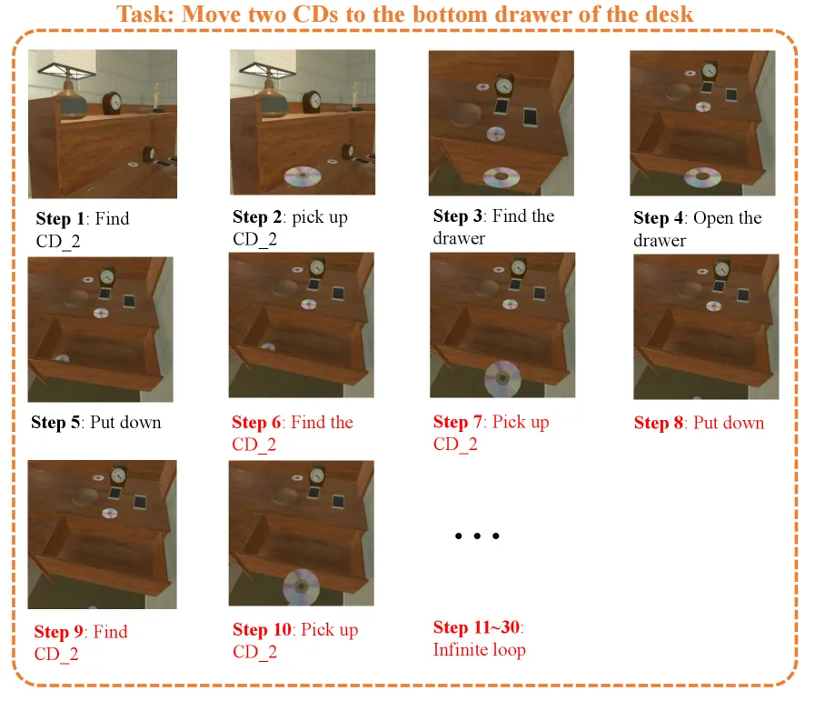

**Original:**

Figure 13: Case that a task fails in an infinite loop because of inaccurate action planning.

**中文:**

图 13：动作规划不准确，使任务陷入无限循环并失败的案例。

**Original:**

Besides, we provide another example demonstrating a representative failure caused by inaccurate action planning. The example trajectory is shown in Figure 13. In the trajectory, RoboMemory is asked to place two CDs into the drawer. However, at step 6, the robot failed to select correct CD object. In this experiment, RoboMemory has already put CD_2 into the drawer, but it keeps picking up CD_2 even though the memory has clearly indicated that CD_2 has already been put down. So we classify this as inaccurate action error. This indicates that the planner failed to comprehensively integrate information from both the memory and information-gathering modules, resulting in inaccurate action planning.

**中文:**

图 13 进一步展示因动作规划不准确而失败的典型案例。任务要求将两张 CD 放进抽屉，但第 6 步时机器人未选中正确的 CD。它已经把 CD_2 放进抽屉，记忆也明确记录了这一点，却仍反复去拿 CD_2。我们将其归为动作选择不准确的错误，说明规划器未能充分整合记忆模块和信息获取模块提供的信息，导致动作规划有误。
