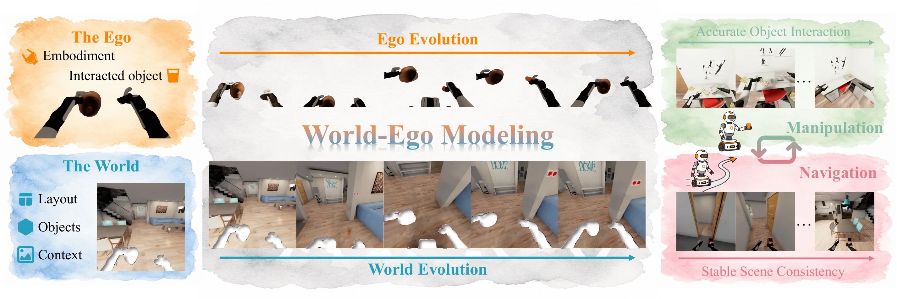
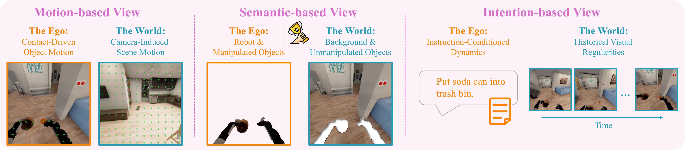
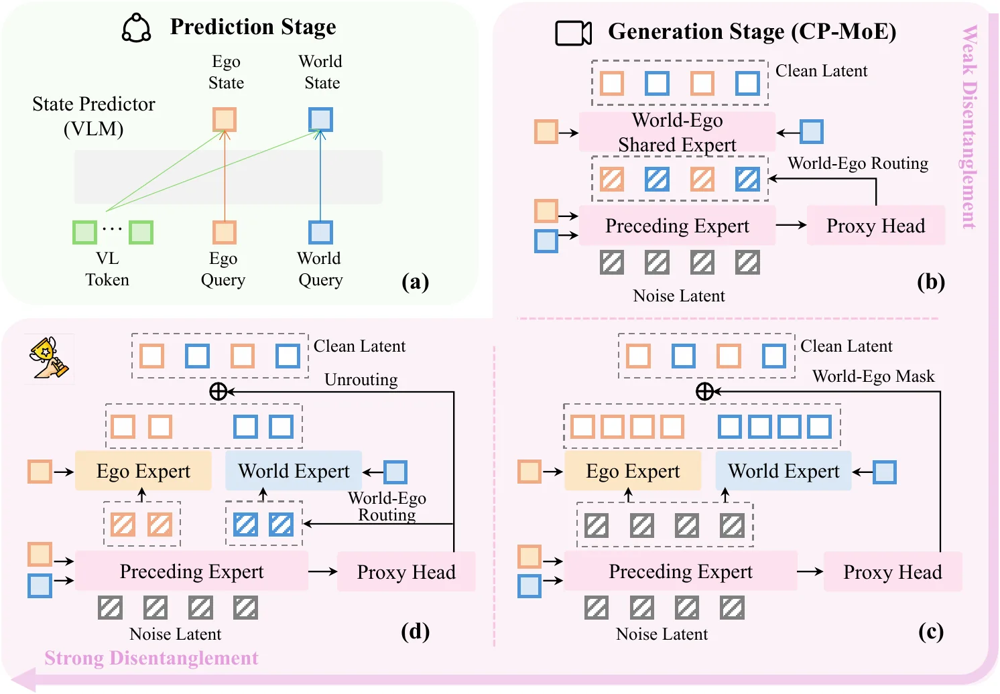
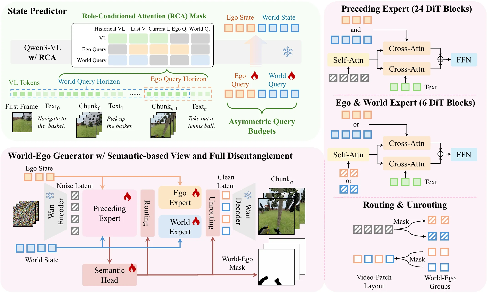
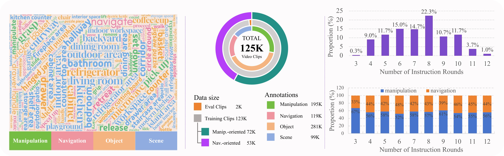
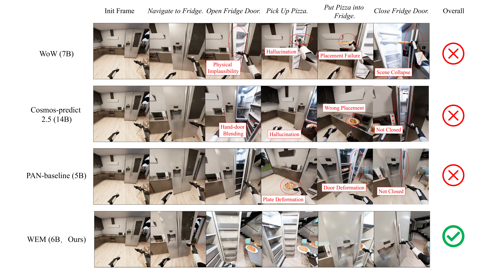
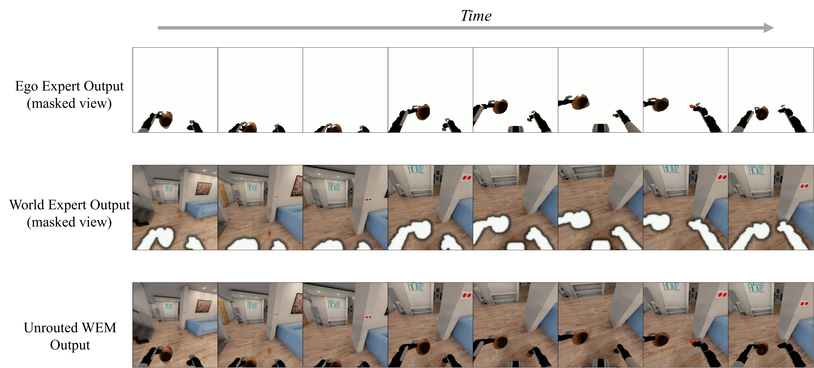

# World-Ego Modeling for Long-Horizon Evolution in Hybrid Embodied Tasks

> World-Ego Modeling for Long-Horizon Evolution in Hybrid Embodied Tasks — Lin et al. (2026). Source: https://arxiv.org/abs/2605.19957v1. License: CC-BY-NC-SA-4.0 (https://creativecommons.org/licenses/by-nc-sa/4.0/). Chinese translations and figure/table extraction are adaptations; no author endorsement is implied.

## 摘要

**Original:**

World models are widely explored in embodied intelligence, yet they typically predict distinct evolutions of the world and the ego within a single stream, where the world captures persistent instruction-agnostic scene regularities and the ego captures robot-centric instruction-conditioned dynamics. This world-ego entanglement leads to a degradation in long-horizon embodied scenarios, particularly in hybrid tasks with interleaved navigation and manipulation behaviors. In this paper, we introduce *World-Ego Modeling*, a new conceptual paradigm that decomposes future evolution into world and ego components. We define the world-ego boundary from three perspectives, i.e., motion-, semantic-, and intention-based views, and analyze three disentanglement strategies with post-, pre-, and full disentanglement. Further, we instantiate this paradigm as the World-Ego Model (WEM), a unified embodied world model that couples an implicit separate world-ego planner with a cascade-parallel mixture-of-experts (CP-MoE) diffusion generator. To enable rigorous evaluation, we further construct HTEWorld, the first benchmark for long-horizon world modeling with hybrid navigation-manipulation tasks, providing 125K video clips (over 4.5M frames) with fine-grained action annotations and 300 multi-turn evaluation trajectories (over 2K instructions). Extensive experiments show that WEM achieves state-of-the-art performance on HTEWorld while remaining competitive on existing manipulation-only benchmarks.

**中文:**

世界模型已被广泛用于具身智能，但通常在同一预测流中处理两类不同的演化：world 表示长期存在、与指令无关的场景规律；ego 表示以机器人为中心、由指令条件决定的动态。两者相互纠缠，会使长时程具身预测退化，尤其是在导航与操作交替出现的混合任务中。本文提出 World-Ego Modeling，将未来演化分解为 world 与 ego 两部分。作者从运动、语义和意图三个角度定义两者边界，并分析后解耦、前解耦和完全解耦三种策略。随后，作者将这一范式实现为统一具身世界模型 WEM，把隐式分开的 world/ego 规划器与级联—并行混合专家（CP-MoE）扩散生成器结合起来。为开展严格评估，还构建了 HTEWorld，作者称其为首个面向导航—操作混合任务的长时程世界建模基准；其中包含带细粒度动作标注的 125K 视频片段（超过 4.5M 帧），以及 300 条多轮评测轨迹（超过 2K 条指令）。实验表明，WEM 在 HTEWorld 上取得当前最佳结果，并在已有的纯操作基准上保持竞争力。

**Original:**

The conceptual illustration of world-ego modeling. The world and the ego evolve through different dynamics. We focus on a novel paradigm of world-ego modeling to enable a general embodied world model for hybrid navigation and manipulation tasks.

**中文:**

世界—自我建模概念图。world 与 ego 遵循不同动态规律演化。论文研究这一建模范式，以支持能够处理导航与操作混合任务的通用具身世界模型。

## 引言

**Original:**

World models are essential to embodied AI, as they learn the physical dynamics to predict future consequences, generate synthetic data, and serve as policy simulators. Recent video-based world models have shown strong capabilities in generating realistic future rollouts. In general, an embodied world model needs to simultaneously predict the world and the ego (i.e., embodiment), while recent efforts usually ignore the distinction between them.

**中文:**

世界模型通过学习物理动态预测未来后果，能够生成合成数据，并充当策略模拟器，因此是具身 AI 的重要组成部分。近期基于视频的世界模型已经展示出生成逼真未来轨迹的能力。不过，具身世界模型需要同时预测外部世界和具身主体自身，而现有研究往往忽略两者的区别。

**Original:**

The *world* captures persistent, instruction-agnostic scene regularities such as layout and object permanence, while the *ego* captures instruction-conditioned dynamics such as robot behavior and object interactions. Separating the world and the ego avoids overloading a single predictive stream with two heterogeneous responsibilities. In terms of embodied prediction, the world and the ego correspond to fundamentally different aspects of the embodied world (i.e., intention-agnostic change vs. intention-driven behavior), so modeling them separately aligns the predictive structure with the underlying physical reality.

**中文:**

world 表示场景布局、物体恒存等持续存在且与指令无关的规律；ego 表示机器人行为、物体交互等由指令决定的动态。将二者分开，可以避免让同一预测流同时承担两种不同职责。从具身预测角度看，它们分别对应不依赖意图的变化和受意图驱动的行为；分开建模使预测结构更贴合这些物理差异。

**Original:**

Conventional world models degrade in long-horizon embodied evolution, especially for hybrid navigation-manipulation tasks. We believe this challenge can be effectively handled by the paradigm of world-ego modeling, since long-horizon scene consistency required by navigation aligns with the world's persistent evolution, and the contact-rich physical dynamics required by manipulation align with the ego's instruction-driven behavior.

**中文:**

常规世界模型在长时程具身演化中表现会退化，导航与操作混合任务尤其如此。作者认为世界—自我建模有助于应对这一问题：导航所需的长期场景一致性对应 world 的持续演化，操作所需的复杂接触动态则对应 ego 中受指令驱动的行为。

**Original:**

This paper introduces **World-Ego Model (WEM)** to investigate an essential question: *How should we define the “world” and the “ego”, and does embodied world modeling require world-ego disentanglement?*

**中文:**

本文提出 World-Ego Model（WEM），研究一个基本问题：应当如何定义 world 与 ego，以及具身世界建模是否需要将两者解耦？

**Original:**

The contributions are: (1) a World-Ego Modeling paradigm with motion-, semantic-, and intention-based boundaries and an analysis of disentanglement; (2) WEM, with an RCA-based planner and CP-MoE generator for long-horizon multi-turn hybrid rollouts; and (3) HTEWorld, a training dataset, benchmark, and metric protocol for hybrid navigation-manipulation world evolution.

**中文:**

本文贡献包括：（1）提出 World-Ego Modeling，从运动、语义、意图三个角度定义边界，并分析解耦方式；（2）构建 WEM，使用基于 RCA 的规划器和 CP-MoE 生成器，生成长时程、多轮导航—操作混合轨迹；（3）构建 HTEWorld，为混合任务的世界演化提供训练数据、基准和评测指标协议。

## 相关工作

**Original:**

World models predict future states from historical observations, actions, or instructions, serving as internal simulators for planning, data generation, and policy learning. Early methods learn compact latent dynamics for latent imagination. With diffusion models and video generation, future prediction has moved from low-dimensional state transitions to pixel-level visual rollouts. Recent works further advance interactive video world models toward real-time controllable interaction, open-ended exploration, and long-horizon simulation.

**中文:**

世界模型根据历史观测、动作或指令预测未来状态，充当规划、数据生成和策略学习的内部模拟器。早期方法学习紧凑的潜空间动态，在潜空间内推演未来。随着扩散模型和视频生成发展，未来预测从低维状态转移扩展到了像素级视频轨迹。近期交互式视频世界模型进一步追求实时可控交互、开放式探索和长时程模拟。

**Original:**

Most methods couple scene evolution, robot motion, task intent, and contact dynamics in a single generative stream. Without separating persistent, instruction-agnostic world regularities from robot-centric, instruction-conditioned ego dynamics, they can suffer from temporal inconsistency and weak instruction alignment in long-horizon composite tasks. JEPA-style architectures and GEM explore related decompositions, but mainly target action conditioning, viewpoint motion, or local object dynamics, without systematically studying the world-ego boundary or disentanglement level.

**中文:**

多数方法在同一生成流中耦合场景变化、机器人运动、任务意图和接触动态。若不区分持久且与指令无关的 world 规律，与机器人相关、以指令为条件的 ego 动态，模型在长时程复合任务中可能出现时间不一致和指令对齐不足。JEPA 类架构和 GEM 也探索了相关分解，但主要围绕动作条件、视角运动或局部物体动态展开，没有系统研究 world/ego 的边界及解耦程度。

## 问题形式化

**Original:**

Let $\mathbf{O}_0$ be the initial egocentric observation, $\mathbf{V}_{<k}=\{\mathbf{V}_1,\ldots,\mathbf{V}_{k-1}\}$ the visual history before step $k$, and $a_{\leq k}=\{a_1,\ldots,a_k\}$ the instruction sequence up to step $k$. A monolithic embodied video world model predicts the next video chunk as $\hat{\mathbf{V}}_k = \mathcal{M}_\theta(\mathbf{O}_0, \mathbf{V}_{<k}, a_{\leq k})$.

**中文:**

令 $\mathbf{O}_0$ 为初始第一视角观测，$\mathbf{V}_{<k}=\{\mathbf{V}_1,\ldots,\mathbf{V}_{k-1}\}$ 为第 $k$ 步之前的视觉历史，$a_{\leq k}=\{a_1,\ldots,a_k\}$ 为截至第 $k$ 步的指令序列。单体具身视频世界模型按 $\hat{\mathbf{V}}_k = \mathcal{M}_\theta(\mathbf{O}_0, \mathbf{V}_{<k}, a_{\leq k})$ 预测下一视频块。

**Original:**

$$
\mathbf{S}^w_k, \mathbf{S}^e_k = \Phi_\phi(\mathbf{O}_0, \mathbf{V}_{<k}, a_{\leq k}), \qquad
\hat{\mathbf{V}}_k = \mathcal{D}_\theta(\mathbf{C}_k, a_k, \mathbf{S}^w_k, \mathbf{S}^e_k).
$$

$\Phi_\phi$ is a vision-language state predictor, $\mathcal{D}_\theta$ is the video generator, and $\mathbf{C}_k$ is the local visual condition for the current generation window.

**中文:**

$$
\mathbf{S}^w_k, \mathbf{S}^e_k = \Phi_\phi(\mathbf{O}_0, \mathbf{V}_{<k}, a_{\leq k}), \qquad
\hat{\mathbf{V}}_k = \mathcal{D}_\theta(\mathbf{C}_k, a_k, \mathbf{S}^w_k, \mathbf{S}^e_k).
$$

其中，$\Phi_\phi$ 是视觉语言状态预测器，$\mathcal{D}_\theta$ 是视频生成器，$\mathbf{C}_k$ 是当前生成窗口的局部视觉条件。

**Original:**

$\mathbf{S}^w_k$ and $\mathbf{S}^e_k$ are not independent factors of the world; rather, they assign different predictive responsibilities—one for the *world*, one for the *ego*—to different aspects of embodied evolution. We treat world and ego as *predictive roles* whose boundary must be specified before any disentanglement can be designed.

**中文:**

$\mathbf{S}^w_k$ 与 $\mathbf{S}^e_k$ 不是世界中相互独立的因素，而是为具身演化的不同方面分配预测职责：一组负责 world，另一组负责 ego。作者将二者视作“预测角色”；在设计任何解耦机制前，必须先明确这两个角色的边界。

## 三种边界定义

**Original:**

Three perspectives of the world-ego definition. The motion-based view separates the world and ego by the source of visual motion; the semantic-based view separates them by the embodied role of scene entities; and the intention-based view separates them by the source of conditioning information. WEM adopts the semantic-based view.

**中文:**

world/ego 定义的三个视角。运动视角按视觉运动来源划分；语义视角按场景实体在具身交互中的角色划分；意图视角按条件信息来源划分。WEM 采用语义视角。

**Original:**

Under a static-scene assumption, the camera's egomotion induces a predictable scene flow over the background. Pixels whose motion matches this scene flow are assigned to the world. Pixels whose motion deviates from the scene flow reflect contact-driven object dynamics induced by the embodiment and are assigned to the ego. The object residual flow serves as the natural proxy.

**中文:**

在场景静态的假设下，相机自身运动会在背景上引起可预测的场景光流。运动与该光流一致的像素归入 world；偏离该光流的像素则反映具身主体接触物体后引起的动态，归入 ego。物体残差光流因此可作为这条边界的代理信号。

**Original:**

The robot itself and any object currently being manipulated jointly constitute the *ego region*. The remaining scene with background and unmanipulated objects constitutes the *world region*. The world-ego boundary is interaction-dependent: a movable object belongs to the world before interaction, becomes ego-related once acted upon, and is absorbed back after the interaction completes. A semantic mask serves as the natural proxy.

**中文:**

机器人自身及当前被操作的物体共同构成 ego 区域；背景与未被操作的物体构成 world 区域。边界取决于当前交互：一个可移动物体在交互前属于 world，被操作后转为 ego 相关区域，交互完成后再归回 world。语义掩码可作为这一边界的代理信号。

**Original:**

The intention-based view draws the boundary at the source of conditioning information. The world reflects what is established by visual history; the ego reflects what is induced by the current instruction. Unlike the motion and semantic views, this view does not partition the future video in pixel space, but instead partitions the conditioning sources.

**中文:**

意图视角从条件信息来源划定边界：world 描述视觉历史已经确定的信息，ego 描述当前指令引出的变化。与运动和语义视角不同，它不在像素空间切分未来视频，而是划分生成所依据的条件信息。

## 通用框架与三种解耦

**Original:**

The prediction stage uses a vision-language state predictor to infer separate ego and world states. The generation stage instantiates different degrees of disentanglement with CP-MoE: pre-disentanglement routes tokens before the rear stage; post-disentanglement fuses outputs of separate experts; full disentanglement combines routing, expert specialization, and unrouting.

**中文:**

预测阶段用视觉语言状态预测器分别推断 ego 和 world 状态；生成阶段通过 CP-MoE 实现不同程度的解耦。前解耦在后续网络处理前路由 token；后解耦融合不同专家输出；完全解耦则结合 token 路由、专家分工以及输出还原。

**Original:**

A vision-language state predictor $\Phi_\phi$ takes the visual-language tokens encoding $(\mathbf{O}_0, \mathbf{V}_{<k}, a_{\leq k})$ together with learnable ego query and world query to produce $\mathbf{S}^e_k$ and $\mathbf{S}^w_k$, providing the generator with two independent conditioning signals.

**中文:**

视觉语言状态预测器 $\Phi_\phi$ 接收编码 $(\mathbf{O}_0, \mathbf{V}_{<k}, a_{\leq k})$ 的视觉语言 token，以及可学习的 ego 查询和 world 查询，输出 $\mathbf{S}^e_k$、$\mathbf{S}^w_k$，为生成器提供两路独立的条件信号。

**Original:**

In pre-disentanglement, the proxy partitions tokens into world and ego groups that pass through a single rear module with restricted cross-attention. In post-disentanglement, World and Ego Experts both process the full sequence under their respective states and the proxy soft-fuses their outputs. In full disentanglement, the proxy first routes tokens to specialized experts and then unroutes their outputs back into a single sequence.

**中文:**

前解耦先用代理信号将 token 分成 world 与 ego 两组，再交给同一个后续模块处理，并限制交叉注意力。后解耦中，World Expert 和 Ego Expert 在各自状态条件下处理完整序列，随后由代理信号软融合输出。完全解耦先按代理信号将 token 分发到专门专家，再把专家输出还原为一条完整序列。

## WEM 具体实现

**Original:**

WEM uses a semantic-based world-ego view and full disentanglement. The state predictor augments a pretrained VLM with RCA and asymmetric ego/world queries. The generator restructures a pretrained video DiT into CP-MoE: a preceding expert predicts a semantic mask, which routes tokens to specialized ego and world experts and unroutes their outputs into the next clean video latent.

**中文:**

WEM 采用语义边界与完全解耦。状态预测器在预训练 VLM 中加入 RCA 及非对称的 world/ego 查询；生成器把预训练视频 DiT 改造成 CP-MoE。前置专家预测语义掩码，以此将 token 分发到 world 与 ego 专家，再将两路输出还原为下一步的去噪视频潜变量。

**Original:**

The input sequence interleaves multimodal history in temporal order: the initial frame is followed by alternating instruction texts and previously generated video chunks, ending with the current instruction and the two query groups. Hidden states at ego- and world-query positions are extracted as $\mathbf{S}^e_k$ and $\mathbf{S}^w_k$.

**中文:**

输入按时间顺序交错组织多模态历史：初始帧之后，依次排列指令文本和此前生成的视频块，最后追加当前指令及两组查询。从 ego 查询与 world 查询位置提取隐藏状态，分别形成 $\mathbf{S}^e_k$ 和 $\mathbf{S}^w_k$。

**Original:**

Forcing equal capacity would assume that the two roles carry comparable amounts of information, but they differ in scope: the world encodes persistent scene structure accumulated across long histories, while the ego encodes instruction-conditioned dynamics local to the current step. WEM uses 256 learnable queries, split into 192 world and 64 ego queries.

**中文:**

为两个角色分配相同容量，意味着假定二者承载的信息量相近，但它们的范围不同：world 编码长历史中积累的持久场景结构，ego 编码当前步骤局部、受指令驱动的动态。因此 WEM 使用 256 个可学习查询，其中 192 个分给 world，64 个分给 ego。

**Original:**

World queries attend to the entire visual history and all past instructions, but are blocked from the current instruction and ego-query tokens. Ego queries attend to one another, the current instruction, and the most recent $K$ instruction-video pairs; distant history and world-query tokens are masked out. This pattern is called **Role-Conditioned Attention (RCA)**.

**中文:**

world 查询可以关注全部视觉历史和所有过去指令，但不能访问当前指令或 ego 查询 token。ego 查询可以相互关注，也能访问当前指令和最近 $K$ 对指令—视频；更久远的历史及 world 查询 token 被屏蔽。作者把这一注意力模式称为角色条件注意力（Role-Conditioned Attention，RCA）。

**Original:**

The video DiT blocks are split into an early shared group forming the preceding expert and a later group duplicated into the world and ego experts. Unlike standard sparse MoE, all three experts are always active, and specialization arises from predefined role assignment rather than learned routing.

**中文:**

视频 DiT 的较早层作为共享的前置专家，较后层复制成 world 专家与 ego 专家。与标准稀疏 MoE 不同，这三个专家始终启用；专家分工来自预先定义的预测角色，而不是学习得到的路由。

**Original:**

The semantic head is a lightweight dense prediction transformer that fuses multiple intermediate features from the preceding expert together with $\mathbf{S}^e_k$ and outputs a world-ego mask $\mathbf{M}$ over video patches. World-assigned tokens are dispatched to the world expert and ego-assigned tokens to the ego expert, with each active token set expanded to spatial neighbors to avoid seam artifacts. Unrouting recomposes the outputs under the same mask.

**中文:**

语义头是一个轻量密集预测 Transformer，融合前置专家的多个中间特征及 $\mathbf{S}^e_k$，为视频 patch 输出 world/ego 掩码 $\mathbf{M}$。world token 发给 world 专家，ego token 发给 ego 专家；两组 token 都扩展到空间邻域，以减轻边界接缝伪影。最后按同一掩码将专家输出还原并组合。

**Original:**

$$
\mathcal{L}_{\text{mask}} = \mathcal{L}_{\text{BCE}} + \mathcal{L}_{\text{Dice}}, \qquad
\mathcal{L}=\mathcal{L}_{\text{flow}}+\lambda\mathcal{L}_{\text{mask}}.
$$

The mask is supervised against the ground-truth world-ego mask derived from simulator segmentation labels.

**中文:**

$$
\mathcal{L}_{\text{mask}} = \mathcal{L}_{\text{BCE}} + \mathcal{L}_{\text{Dice}}, \qquad
\mathcal{L}=\mathcal{L}_{\text{flow}}+\lambda\mathcal{L}_{\text{mask}}.
$$

掩码监督的真实 world/ego 标签由模拟器分割标注生成。

## 实验

**Original:**

HTEWorld is constructed on BEHAVIOR-1K, providing 125K video clips (over 4.5M frames) with fine-grained annotations and 300 multi-turn evaluation trajectories spanning over 2K instructions. It adopts the 16-metric EWMScore from WorldArena and introduces six HTEWorld-specific metrics for continuous multi-turn and navigation-manipulation generation.

**中文:**

HTEWorld 基于 BEHAVIOR-1K 构建，提供 125K 带细粒度标注的视频片段（超过 4.5M 帧），以及包含超过 2K 条指令的 300 条多轮评测轨迹。评测沿用 WorldArena 的 EWMScore（含 16 项指标），另增加六项 HTEWorld 专用指标，衡量连续多轮视频以及导航—操作混合生成。

**Original:**

HTEWorld provides large-scale training clips and multi-turn evaluation trajectories for hybrid embodied world modeling, spanning manipulation, navigation, objects, scenes, action-oriented clip types, annotation categories, instruction-round distributions, and navigation/manipulation proportions.

**中文:**

HTEWorld 为混合具身世界建模提供大规模训练片段和多轮评测轨迹。图中统计了操作与导航、物体、场景、按动作分类的片段类型、标注类别、指令轮数分布，以及导航和操作所占比例。

**Original:**

WEM uses a frozen Qwen3-VL-2B-Instruct state predictor with 256 learnable queries (192 world, 64 ego) and a Wan2.2-TI2V-5B generator. Baselines include Cosmos-Predict 2.5 (2B/14B), WoW-7B, and a PAN-style baseline. Models are fine-tuned on HTEWorld for 4 epochs on 16 NVIDIA A100 80GB GPUs with learning rate $10^{-5}$.

**中文:**

WEM 采用参数冻结的 Qwen3-VL-2B-Instruct 状态预测器，配备 256 个可学习查询（192 个 world、64 个 ego），视频生成器为 Wan2.2-TI2V-5B。基线包括 Cosmos-Predict 2.5 的 2B/14B 版本、WoW-7B 及 PAN 风格基线。模型在 16 张 NVIDIA A100 80GB 上，以学习率 $10^{-5}$ 在 HTEWorld 微调 4 个 epoch。

**Original:**

| World-ego definition | EWMScore |
|---|---:|
| Intention-based | 58.69 |
| Motion-based | 59.36 |
| **Semantic-based** | **61.48** |

| Disentanglement variant | EWMScore |
|---|---:|
| w/o Disent. | 58.40 |
| Pre-Disent. | 58.85 |
| Post-Disent. w/o proxy | 58.59 |
| Post-Disent. w/ proxy | 61.09 |
| **Full Disent. (WEM)** | **61.48** |

**中文:**

| world/ego 边界定义 | EWMScore |
|---|---:|
| 基于意图 | 58.69 |
| 基于运动 | 59.36 |
| **基于语义** | **61.48** |

| 解耦变体 | EWMScore |
|---|---:|
| 不解耦 | 58.40 |
| 前解耦 | 58.85 |
| 后解耦，不使用代理信号 | 58.59 |
| 后解耦，使用代理信号 | 61.09 |
| **完全解耦（WEM）** | **61.48** |

**Original:**

| Model | HTEWorld EWMScore | RCBD | LPSA | CISR | PMPA | CPDM | FPHS |
|---|---:|---:|---:|---:|---:|---:|---:|
| WoW-7B | 53.44 | 0.23 | 0.83 | 0.49 | 0.45 | 0.47 | 0.85 |
| Cosmos-2B | 54.83 | 0.24 | 0.83 | 0.50 | 0.47 | 0.48 | 0.86 |
| Cosmos-14B | 55.41 | 0.26 | 0.83 | 0.51 | 0.48 | 0.49 | 0.85 |
| PAN-style | 58.40 | 0.27 | 0.86 | 0.49 | 0.50 | 0.46 | 0.88 |
| **WEM** | **61.48** | **0.31** | **0.87** | **0.57** | **0.54** | **0.52** | **0.89** |

Original WorldArena EWMScore: WEM 58.10; IRASim 58.12; CtrlWorld **59.70**.

**中文:**

| 模型 | HTEWorld EWMScore | RCBD | LPSA | CISR | PMPA | CPDM | FPHS |
|---|---:|---:|---:|---:|---:|---:|---:|
| WoW-7B | 53.44 | 0.23 | 0.83 | 0.49 | 0.45 | 0.47 | 0.85 |
| Cosmos-2B | 54.83 | 0.24 | 0.83 | 0.50 | 0.47 | 0.48 | 0.86 |
| Cosmos-14B | 55.41 | 0.26 | 0.83 | 0.51 | 0.48 | 0.49 | 0.85 |
| PAN-style | 58.40 | 0.27 | 0.86 | 0.49 | 0.50 | 0.46 | 0.88 |
| **WEM** | **61.48** | **0.31** | **0.87** | **0.57** | **0.54** | **0.52** | **0.89** |

原版 WorldArena 的 EWMScore：WEM 为 58.10，IRASim 为 58.12，CtrlWorld 为 **59.70**。

**Original:**

| Variant | EWMScore |
|---|---:|
| w/o Asymmetric Query Budget | 60.50 |
| w/o Role-Conditioned Attention | 60.64 |
| w/o Neighbor-Expanded Routing | 59.57 |
| **WEM** | **61.48** |

**中文:**

| 变体 | EWMScore |
|---|---:|
| 移除非对称查询数量分配 | 60.50 |
| 移除角色条件注意力 | 60.64 |
| 移除邻域扩展路由 | 59.57 |
| **WEM** | **61.48** |

**Original:**

Given the same initial observation and five-step instruction sequence, each model autoregressively generates a long-horizon hybrid navigation-manipulation rollout. WEM better preserves scene geometry, object consistency, and instruction alignment across the trajectory.

**中文:**

给定相同初始观测和五步指令序列，各模型自回归生成长时程导航—操作混合轨迹。WEM 在整条轨迹中更好地保持场景几何、物体一致性及指令对齐。

**Original:**

Mask-guided visualization of role expert specialization. The ego expert output is shown in ego-assigned regions, while the world expert output is shown in world-assigned regions; complementary regions are filled with light gray. The last row shows the final WEM output obtained by unrouting both role-expert outputs under the same semantic mask. This masking is used only for visualization and does not affect quantitative evaluation.

**中文:**

由掩码辅助的角色专家分工可视化：ego 专家输出只显示在分配给 ego 的区域，world 专家输出只显示在 world 区域，其余部分填为浅灰色。最后一行是按同一语义掩码将两路专家输出还原组合后的 WEM 结果。此处遮罩仅用于可视化，不影响定量评测。

## 附录：六个专用指标

**Original:**

**RCBD** compares generated and ground-truth appearance and motion gaps at each chunk boundary using the symmetric ratio score $\mathcal{S}(x,y)=\exp(-|\log(x/y)|)$ and a geometric mean. **LPSA** encodes the last $W=4$ frames of each chunk and computes a linearly late-weighted cosine similarity $\sum_k k r_k / \sum_k k$. **CISR** retrieves the matching ground-truth step among all steps in the same trajectory and reports mean reciprocal rank.

**中文:**

RCBD 比较生成视频与真实视频在各视频块边界处的外观、运动差异，使用对称比值分数 $\mathcal{S}(x,y)=\exp(-|\log(x/y)|)$ 并取几何平均。LPSA 编码每块末尾 $W=4$ 帧，计算对较晚视频块赋予更大线性权重的余弦相似度 $\sum_k k r_k / \sum_k k$。CISR 在同一轨迹的全部真实步骤中检索匹配步骤，报告平均倒数排名。

**Original:**

**PMPA** compares 4-D motion profiles built from median flow, top-20% mean flow, their ratio, and flow entropy after resampling to 16 steps. **CPDM** uses $\sigma((r^+-r^-)/\tau)$ with $\tau=0.05$ to compare the matched phase against the hardest opposite-phase negative. **FPHS** evaluates feature similarity in the top-20% ground-truth motion region within $R=4$ frames on both sides of each navigation-manipulation phase switch.

**中文:**

PMPA 将运动序列重采样为 16 步，比较由光流中位数、最大 20% 光流的均值、二者比值和光流熵组成的四维运动轮廓。CPDM 用 $\sigma((r^+-r^-)/\tau)$ 比较匹配阶段与最难区分的相反阶段负例，其中 $\tau=0.05$。FPHS 在每次导航—操作阶段切换前后各 $R=4$ 帧内，针对真实运动幅值最大的 20% 区域，评估特征相似性。

## 附录：标注、训练与变体

**Original:**

Each training clip is annotated with a semantic world-ego mask, decomposed optical flow, and a language caption. Masks come from simulator instance segmentation. RAFT estimates dense flow $\mathbf{F}$; a RANSAC-fitted homography yields camera flow $\mathbf{F}_{cam}$; object residual flow is $\mathbf{F}_{obj}=\mathbf{F}-\mathbf{F}_{cam}$. One action-centric caption per clip is generated using google/gemini-3-flash-preview with dynamic prompts.

**中文:**

每个训练视频片段都包含 world/ego 语义掩码、分解光流和语言描述。掩码来自模拟器实例分割。RAFT 估计密集光流 $\mathbf{F}$；经 RANSAC 拟合的单应变换得到相机光流 $\mathbf{F}_{cam}$；物体残差光流为 $\mathbf{F}_{obj}=\mathbf{F}-\mathbf{F}_{cam}$。每个片段还通过动态提示调用 google/gemini-3-flash-preview，生成一条以动作为中心的描述。

**Original:**

The motion view uses post-disentanglement. A flow head predicts object residual flow and converts its magnitude to $\alpha=\sigma((\tau-\|\hat{\mathbf{F}}_{obj}\|)/\delta)$. The final output is $\alpha\mathbf{X}^w+(1-\alpha)\mathbf{X}^e$. The flow head is supervised by ground-truth residual flow with an L1 loss.

**中文:**

运动视角采用后解耦。光流头预测物体残差光流，将其幅值转换为 $\alpha=\sigma((\tau-\|\hat{\mathbf{F}}_{obj}\|)/\delta)$；最终输出为 $\alpha\mathbf{X}^w+(1-\alpha)\mathbf{X}^e$。光流头以真实残差光流为监督，使用 L1 损失。

**Original:**

The intention view uses one unified decoder. $\mathbf{S}^w_k$ enters each layer as cross-attention memory; mean-pooled $\mathbf{S}^e_k$ enters through AdaLN. A GRU-style updater maintains the world state: $\mathbf{S}^w_k=\mathbf{G}_k\odot\mathbf{S}^w_{k-1}+(1-\mathbf{G}_k)\odot\tilde{\mathbf{S}}^w_k$. It uses no proxy loss.

**中文:**

意图视角使用统一解码器。$\mathbf{S}^w_k$ 作为交叉注意力记忆输入各层；$\mathbf{S}^e_k$ 经均值池化后通过 AdaLN 注入。GRU 风格更新器维护 world 状态：$\mathbf{S}^w_k=\mathbf{G}_k\odot\mathbf{S}^w_{k-1}+(1-\mathbf{G}_k)\odot\tilde{\mathbf{S}}^w_k$。该变体不使用代理信号损失。

**Original:**

WEM is natively chunk-autoregressive. Cosmos uses image2world for the first chunk and video2world with the last 10 latent frames thereafter. WoW repeats the first frame 41 times initially, then conditions on the last 41 frames; it generates 82 frames, discards 41 conditioning frames, and subsamples to 37. All models output 37 frames per chunk at 480×480, 16 FPS, and 35 diffusion steps.

**中文:**

WEM 原生以视频块为单位自回归生成。Cosmos 首块采用 image2world，后续用最近 10 个潜变量帧作为 video2world 条件。WoW 开始时将首帧重复 41 次，此后使用最近 41 帧作为条件；每次生成 82 帧，去掉其中 41 帧条件帧，再下采样至 37 帧。各模型每块均输出 37 帧，分辨率 480×480，帧率 16 FPS，扩散步数 35。

## 局限与未来工作

**Original:**

Experiments are conducted on simulator-based embodied datasets. Simulated environments cannot fully capture real-world visual diversity, sensing noise, object variability, and contact dynamics. The sim-to-real generalization of World-Ego Modeling remains an open question.

**中文:**

实验使用基于模拟器的具身数据集。仿真无法完整呈现真实世界的视觉多样性、传感器噪声、物体差异和接触动态，因此 World-Ego Modeling 的 sim-to-real 泛化能力仍是待解问题。

**Original:**

The default WEM constructs semantic masks from instance segmentation. This gives a clear and interpretable routing signal, but introduces preprocessing when instance annotations are unavailable. Motion-based boundaries still require optical-flow preprocessing, while intention-based separation is weaker in the experiments.

**中文:**

默认 WEM 从实例分割标注构造语义掩码。这样能得到明确、可解释的路由信号，但没有实例标注时就需要额外预处理。运动边界同样依赖光流预处理，而意图分解在实验中的表现较弱。

**Original:**

The autoregressive rollout still accumulates errors across chunks. World-ego disentanglement alone is not sufficient to fully solve long-horizon generation. Future work may combine it with hierarchical planning, explicit memory refresh, uncertainty-aware rollout, or periodic anchoring to stable observations.

**中文:**

自回归生成仍会在视频块之间积累误差，仅靠 world/ego 解耦不足以完全解决长时程生成问题。未来可以结合分层规划、显式记忆刷新、不确定性感知的轨迹生成，或定期用稳定观测重新校正。

**Original:**

The three boundary views and CP-MoE are an initial study rather than an exhaustive design. Alternatives include boundaries based on 3D geometry, affordances, controllability, causal interaction, or task progress, and architectures with adaptive routing, recurrent memory, or structured latent states. A general-purpose VLM may also introduce unnecessary computation for state extraction.

**中文:**

三种边界定义与 CP-MoE 只是初步探索，尚未覆盖所有设计可能。其他选择包括根据三维几何、可供性、可控性、因果交互或任务进度定义边界，以及引入自适应路由、循环记忆或结构化潜状态的架构。另外，使用通用 VLM 提取状态也可能带来不必要的计算。
