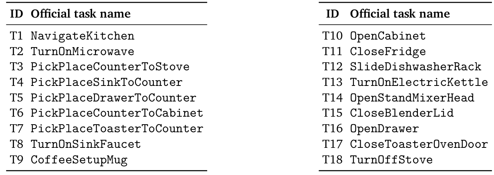
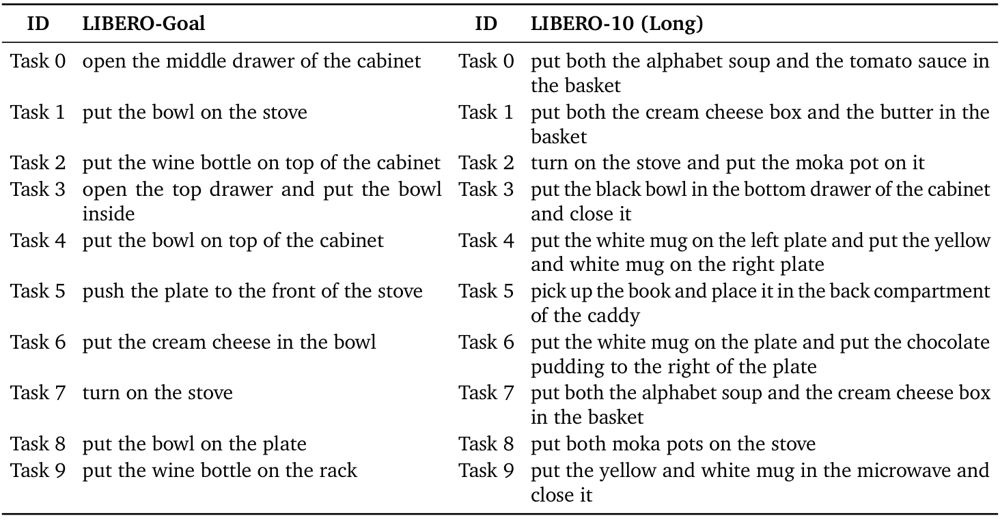

# Zetta ζ: An Efficient Closed-Loop Embodied Harness for Self-Evolving Physical Intelligence

> Zetta ζ: An Efficient Closed-Loop Embodied Harness for Self-Evolving Physical Intelligence — Xin Ding et al. (2026). Source: https://arxiv.org/abs/2608.16590v1. License: CC-BY-4.0 (https://creativecommons.org/licenses/by/4.0/). Chinese translations and figure/table extraction are adaptations; no author endorsement is implied.


## 摘要

<a id="zetta-h001"></a>

**Original:**

Abstract

**中文:**

摘要

<a id="zetta-s001"></a>

**Original:**

Embodied agents are increasingly used to close the gap left by end-to-end policy models. Yet the agentic path has not realized closed-loop learning in physical execution: existing harnesses remain largely open-loop, following fixed skills during rollout and reflecting only after an episode completes. Such post-hoc reflection cannot govern execution as it unfolds, because physical interaction requires decisions to track rapidly changing robot-environment states at a frequency beyond today’s large agentic models. We present Zetta, a closed-loop embodied harness that evolves code-based runtime critics and recovery skills online while keeping the base policy frozen. Through three timescale-separated loops, Zetta provides action-frequency governance, rollout-level critic-recovery proposal, and validation-gated skill updates. Together with Z-Infra, a rollout infrastructure decoupling agent logic from heterogeneous execution resources, Zetta achieves state-of-the-art success on LIBERO-Pro and RoboCasa under our current rollout budget, reaching 90.8% and 93.6%, with a $11.1\times$ inference speedup; success continues to scale with self-exploration experience; learned skills transfer zero-shot, and clear robotic “Aha Moments” emerge. These results show that closed-loop harness self-evolution opens a scaling path for reliable physical intelligence.

**中文:**

具身智能体越来越多地被用于弥补端到端策略模型的不足。然而，智能体路线尚未在物理执行中实现闭环学习：现有执行框架大多仍是开环的，在一次环境执行中遵循固定技能，直到整个回合结束后才反思。这种事后反思无法在执行进行时加以调控，因为物理交互要求决策以足够高的频率跟踪快速变化的机器人—环境状态，而当前大型智能体模型无法达到这一频率。本文提出 Zetta：一个闭环具身执行框架，在保持基础策略冻结的同时，在线演化代码形式的运行时检查器与恢复技能。通过三个处于不同时间尺度的循环，Zetta 在动作频率上调控执行，在执行轨迹层面提出检查器—恢复方案，并根据验证结果决定是否更新技能。配合将智能体逻辑与异构执行资源解耦的基础设施 Z-Infra，在本文当前的环境执行预算下，Zetta 在 LIBERO-Pro 和 RoboCasa 上达到最先进的成功率，分别为 90.8% 和 93.6%，同时实现 $11.1\times$ 的推理加速；成功率随自主探索经验继续提高，学得技能能够零样本迁移，并出现明显的机器人“顿悟时刻”。结果表明，闭环执行框架的自演化为可靠物理智能开辟了一条规模扩展路径。

<a id="zetta-f001"></a>


**Original:**

Figure 1: Zetta closes the loop for embodied self-evolution. Frequent runtime critics trigger recoveries during execution, while verified failures are distilled into reusable critic and recovery skills across rollouts. A hardware-decoupled rollout layer scales this process across heterogeneous environments, models, CPUs, and GPUs. Zetta enables sustained same-task improvement, zero-shot skill transfer, robotic "Aha moment", and accelerated agent execution.

**中文:**

图 1：Zetta 为具身自演化建立闭环。高频运行的检查器在执行中触发恢复，经过验证的失败经验则跨执行轨迹提炼为可复用检查器与恢复技能。与硬件解耦的环境执行层，使这一过程能够扩展到异构环境、模型、CPU 和 GPU。Zetta 支持同一任务上的持续改善、技能零样本迁移、机器人“顿悟时刻”，并加快智能体执行。

## 1 引言

<a id="zetta-h002"></a>

**Original:**

1 Introduction

**中文:**

1 引言

<a id="zetta-s002"></a>

**Original:**

Physical intelligence is advancing along two complementary paths for effective scaling. The first scales end-to-end policy models, including vision-language-action models (VLAs) and world-action models (WAMs) [7, 8, 9, 10, 3, 4, 11, 12, 13, 14, 15, 16, 17, 18, 19, 20, 21, 22, 23, 24, 25, 26], trained on large-scale demonstration corpora such as DROID and Open X-Embodiment [27, 28]. However, embodied data remain scarce, and models trained on limited data distributions are brittle under the changing dynamics of real-world deployment [29, 30, 31, 32, 33, 34]; the gap from demonstration to reliable real-world execution therefore remains open.

**中文:**

物理智能正沿两条互补路线推进有效的规模扩展。第一条扩展端到端策略模型，包括视觉—语言—动作模型（VLA）和世界—动作模型（WAM）[7, 8, 9, 10, 3, 4, 11, 12, 13, 14, 15, 16, 17, 18, 19, 20, 21, 22, 23, 24, 25, 26]，使用 DROID、Open X-Embodiment 等大规模示范数据训练 [27, 28]。但具身数据仍然稀缺，在有限数据分布上训练的模型，面对真实部署中不断变化的动力学时十分脆弱 [29, 30, 31, 32, 33, 34]；从示范到可靠真实执行的差距依然存在。

<a id="zetta-s003"></a>

**Original:**

The second path uses large language models as embodied agents to orchestrate policy models, code, tools, and control primitives [35, 36, 37, 38, 5], with the aim of learning from self-exploration in environments. Though these systems alleviate limitations of end-to-end policies, existing embodied agent harnesses do not actually realize this learning. Existing embodied agent harnesses therefore remain largely open-loop: once execution begins, the agent does not continuously condition its decisions on the evolving robot-environment state, but instead follows fixed skills or preplanned trajectories and reflects only after the episode is completed. This work enables a closed-loop embodied agent harness, learning from self-exploration and demonstrating self-evolution: as rollout experience increases, the success rate continues to improve.

**中文:**

第二条路线将大语言模型用作具身智能体，组织策略模型、代码、工具和控制原语 [35, 36, 37, 38, 5]，目标是从环境中的自主探索学习。虽然这些系统缓解了端到端策略的局限，现有具身智能体执行框架却没有真正实现这种学习。它们因此大多仍是开环的：一旦开始执行，智能体便不会持续依据变化中的机器人—环境状态决策，而是遵循固定技能或预先规划的轨迹，直到回合结束后才反思。本文实现闭环具身智能体执行框架，使其从自主探索中学习并展现自演化：随着执行经验增加，成功率持续提高。

<a id="zetta-s004"></a>

**Original:**

Realizing closed-loop execution for embodied agents is fundamentally bottlenecked by the high-frequency interaction between robots and changing environments. Physical tasks require decisions to be coupled to the current robot and environment state, often changing within a millisecond-level latency budget [39, 40]. Large agentic models cannot make decisions at this frequency in real-world systems [41, 42, 43]. Existing methods therefore perform reflection mainly at the episode or trajectory level, which can diagnose a completed failure but cannot govern the physical execution while it unfolds [44, 45, 46, 47, 48]. Such post-hoc reflection has inherent limitations: agents cannot online test alternative actions to verify whether a reflection is correct, credit assignment over an entire trajectory is difficult, and retrospective analysis often lacks access to the precise state at the moment of failure. As a result, the experiences summarized after execution are difficult to reuse and provide limited support for effective learning. The experience adapts poorly to the changing real-world dynamics [49, 50, 51].

**中文:**

具身智能体实现闭环执行的根本瓶颈，在于机器人与变化环境之间的高频交互。物理任务要求决策紧密跟随机器人和环境的当前状态，往往必须在毫秒级延迟预算内响应变化 [39, 40]。大型智能体模型在真实系统中无法以这样的频率决策 [41, 42, 43]。因此，现有方法主要在回合或轨迹层面反思，能够诊断已经发生的失败，却无法在物理执行进行时加以调控 [44, 45, 46, 47, 48]。这种事后反思具有内在局限：智能体无法在线尝试其他动作来验证反思是否正确，难以对整条轨迹进行贡献归因，回溯分析也常无法访问失败瞬间的精确状态。因此，执行后总结的经验难以复用，对有效学习的帮助有限，也难以适应不断变化的真实动力学 [49, 50, 51]。

<a id="zetta-s005"></a>

**Original:**

To address this challenge, the key idea of this work is to introduce code-based critics that evolve online for closed-loop execution, governing physical execution and triggering agentic intervention according to the changing dynamics of actions and environments. Building on this idea, we present Zetta, a closed-loop embodied harness that self-evolves to scale physical intelligence (Figure 1). The base policy models are frozen while evolving a harness $H=\{C,R,T\}$ of runtime critics, corresponding recovery skills from the rollouts. Specifically, we propose three different time-scale loops to enable self-evolution. First, a Critic-Governed Action Loop executes learned critics at action frequency and invokes the corresponding recovery skills when necessary. Second, a Rollout-Batch Candidate Optimization Loop clusters and diagnoses failures from each iteration, then proposes candidate critics and recoveries. Because skills and code provide no gradients, we draw on SkillOpt and EmbodiSkill [52, 46] to construct an SGD-like optimization process that makes bounded, stable updates in code space. Third, a Validation-Gated Skill Update Loop admits only critic and recovery candidates that improve success rate and generalize across rollouts, and then adds them to the skill memory. The first loop enables closed-loop execution, while the second and third loops realize self-evolution.

**中文:**

为解决这一挑战，本文的关键思路是引入可在线演化的代码检查器，用于闭环执行：依据动作和环境动态的变化来调控物理执行，并触发智能体介入。在此基础上，本文提出 Zetta，一个通过自演化扩展物理智能的闭环具身执行框架（图 1）。基础策略模型保持冻结，系统则从执行轨迹中演化由运行时检查器及对应恢复技能等组成的框架 $H=\{C,R,T\}$。具体来说，本文提出三个不同时间尺度的循环。第一，检查器调控的动作循环以动作频率运行学得检查器，并在必要时调用对应恢复技能。第二，执行批次级候选优化循环对每次迭代中的失败进行聚类、诊断，提出候选检查器与恢复方案。由于技能和代码没有梯度，本文借鉴 SkillOpt 与 EmbodiSkill [52, 46]，构建类似 SGD 的优化过程，在代码空间中进行范围受限、稳定的更新。第三，验证门控的技能更新循环只接纳能够提高成功率并跨执行轨迹泛化的检查器、恢复候选，再将其加入技能记忆。第一个循环实现闭环执行，后两个循环实现自演化。

<a id="zetta-s006"></a>

**Original:**

The closed-loop enables the harness learning from self-exploration. This learning process also makes rollout throughput the rate limiter of intelligence scaling: the environment is the source of learning data, so faster rollouts produce faster evolution. We therefore propose and realize Z-Infra, to our knowledge the first rollout infrastructure designed specifically for self-evolving embodied agents. It decouples agent logic from heterogeneous execution resources through independent environment and model worker pools, batched inference, model partitioning, and asynchronous scheduling. This design scales the same agent across machines, accelerators, models, and environments without binding its logic to a particular hardware configuration.

**中文:**

闭环让执行框架能够从自主探索中学习。环境是学习数据的来源，因此这一学习过程也使环境执行吞吐量成为智能扩展的速度瓶颈：执行越快，演化就越快。为此，本文提出并实现 Z-Infra；据作者所知，这是首个专为自演化具身智能体设计的环境执行基础设施。它通过独立的环境与模型工作进程池、批量推理、模型切分和异步调度，将智能体逻辑与异构执行资源解耦。同一智能体因此可以跨机器、加速器、模型和环境扩展，无需将逻辑绑定到特定硬件配置。

<a id="zetta-s007"></a>

**Original:**

Our main results are:

**中文:**

主要结果如下：

<a id="zetta-s008"></a>

**Original:**

- Under our current rollout budget, Zetta achieves state-of-the-art task success, substantially improving over current policy models and embodied-agent baselines: 90.8% on LIBERO-Pro and 93.6% on RoboCasa. Since performance continues to improve across evolution rounds, further rollout experience is expected to yield additional gains.

**中文:**

- 在本文当前的环境执行预算下，Zetta 的任务成功率达到最先进水平，显著优于现有策略模型及具身智能体基线：LIBERO-Pro 为 90.8%，RoboCasa 为 93.6%。由于性能仍随演化轮次提高，预计增加执行经验还会带来进一步收益。

<a id="zetta-s009"></a>

**Original:**

- Success scales with evolution iterations: success increases from 34.5% to 90.8% on LIBERO-Pro and from 73.6% to 93.6% on RoboCasa within several evolution iterations.

**中文:**

- 成功率随演化迭代提高：经过若干轮演化，LIBERO-Pro 从 34.5% 提升至 90.8%，RoboCasa 从 73.6% 提升至 93.6%。

<a id="zetta-s010"></a>

**Original:**

- The learned skills demonstrate zero-shot transfer capability to similar tasks. Take the PnP-Stove task in RoboCasa as an example, the pregrasp, regrasp, and stable-placement skills learned during the evolution of transfer zero-shot to three related PnP tasks without target-specific optimization: success improves from 58% to 82% on PnP-Sink, from 62% to 80% on PnP-Cabinet, and from 72% to 90% on PnP-Toaster.

**中文:**

- 学得技能能够向相似任务零样本迁移。以 RoboCasa 的 PnP-Stove 为例，演化中学得的预抓取、重新抓取和稳定放置技能，无需针对目标任务优化，便可迁移到三个相关 PnP 任务：PnP-Sink 成功率从 58% 提升至 82%，PnP-Cabinet 从 62% 提升至 80%，PnP-Toaster 从 72% 提升至 90%。

<a id="zetta-s011"></a>

**Original:**

- We observe clear “aha moments” in which success remains low during early evolution rounds but rises abruptly once the agent discovers the key critic–recovery mechanism: for example, from 15% to 95% on Wine Bottle in Bowl and from 5% to 90% on Put Cream Cheese on Bowl.

**中文:**

- 实验观察到明显的“顿悟时刻”：早期演化轮次的成功率一直较低，但智能体一旦发现关键的检查器—恢复机制，成功率便突然跃升。例如，Wine Bottle in Bowl 从 15% 升至 95%，Put Cream Cheese on Bowl 从 5% 升至 90%。

<a id="zetta-s012"></a>

**Original:**

- The Zetta inference latency decreases by 91% compared to RPent, i.e., an $11.1\times$ speedup.

**中文:**

- 相较 RPent，Zetta 推理延迟降低 91%，即实现 $11.1\times$ 加速。

<a id="zetta-s013"></a>

**Original:**

- Z-Infra increases valid rollout throughput from 1.7 to 35.1 episodes/min, a 20.6$\times$ improvement, directly accelerating the harness evolution loop.

**中文:**

- Z-Infra 将有效环境执行吞吐量从每分钟 1.7 个回合提高到 35.1 个回合，提升 20.6$\times$，直接加快执行框架的演化循环。

<a id="zetta-s014"></a>

**Original:**

Our contributions are:

**中文:**

本文贡献如下：

<a id="zetta-s015"></a>

**Original:**

- The first to realize a self-evolving embodied agent through learnable code-based critics and three coordinated evolution loops operating at action, rollout-batch, and iteration timescales.

**中文:**

- 首次通过可学习的代码检查器，以及分别在动作、执行批次和迭代时间尺度上协调运行的三个演化循环，实现自演化具身智能体。

<a id="zetta-s016"></a>

**Original:**

- The first infrastructure designed to support embodied-agent self-evolution, decoupling agent logic from heterogeneous hardware resources for scalable rollout generation and execution.

**中文:**

- 提出首个支持具身智能体自演化的基础设施，将智能体逻辑与异构硬件资源解耦，支持可扩展的轨迹生成与环境执行。

<a id="zetta-s017"></a>

**Original:**

- We demonstrate the scaling capability of the embodied harness: with increasing rollout and evolution iterations, it progressively improves task success to SOTA among existing models or embodied agents.

**中文:**

- 展示具身执行框架的规模扩展能力：随着环境执行和演化迭代增加，任务成功率逐步提高，达到现有模型或具身智能体中的最先进水平。

## 2 实现具身智能体在部署期间的演化

<a id="zetta-h003"></a>

**Original:**

2 Enabling Deployment-Time Evolution of Embodied Agents

**中文:**

2 实现具身智能体在部署期间的演化

<a id="zetta-h004"></a>

**Original:**

2.1 Problem Formulation: Dual-Agent Governance and Evolutionary Architecture

**中文:**

2.1 问题定义：双智能体调控与演化架构

<a id="zetta-s018"></a>

**Original:**

We formalize the long-horizon robotic manipulation task as an authority-constrained governance and evolution process. The framework incorporates an online Orchestrator Agent for adjudication and offline Evolutionary Agents for optimization, enabling closed-loop capability evolution without altering the underlying policy parameters.

**中文:**

本文将长时程机器人操作任务形式化为受权限约束的执行调控与演化过程。框架由负责在线裁决的编排智能体和负责离线优化的演化智能体组成，在不改变底层策略参数的情况下，实现能力的闭环演化。

<a id="zetta-h005"></a>

**Original:**

2.1.1 Fixed Runtime Components

**中文:**

2.1.1 固定的运行时组件

<a id="zetta-s019"></a>

**Original:**

The execution is driven by two core entities whose internal parameters and logic remain invariant throughout the evolution:

**中文:**

执行由两个核心主体驱动，它们的内部参数和逻辑在整个演化过程中保持不变：

<a id="zetta-s020"></a>

**Original:**

- Action Policy ($\pi$): Given observation $s_{t}$ and goal $g$, it generates low-level actions $a_{t}=\pi(s_{t},g;\theta)$, where parameters $\theta$ satisfy the constraint $\nabla\theta=0$.

**中文:**

- 动作策略（$\pi$）：给定观测 $s_{t}$ 和目标 $g$，生成低层动作 $a_{t}=\pi(s_{t},g;\theta)$，其中参数 $\theta$ 满足约束 $\nabla\theta=0$。

<a id="zetta-s021"></a>

**Original:**

- Orchestrator Agent ($\mathcal{A}_{orch}$): Acting as a fixed multimodal reasoning operator [72, 73, 74], $\mathcal{A}_{orch}$ functions as a high-level commander responsible for auditing real-time evidence and approving mode transitions. Its decision logic remains constant during evolution.

**中文:**

- 编排智能体（$\mathcal{A}_{orch}$）：作为固定的多模态推理算子 [72, 73, 74]，$\mathcal{A}_{orch}$ 承担高层指挥职责，审核实时证据并批准执行模式切换。其决策逻辑在演化期间保持不变。

<a id="zetta-h006"></a>

**Original:**

2.1.2 Evolvable Harness ($\mathcal{H}$)

**中文:**

2.1.2 可演化的执行框架（$\mathcal{H}$）

<a id="zetta-s022"></a>

**Original:**

The Harness $\mathcal{H}$ is the target of the evolutionary process, providing $\mathcal{A}_{orch}$ with means to perceive and intervene in the environment. We define it as:

**中文:**

执行框架 $\mathcal{H}$ 是演化的对象，为 $\mathcal{A}_{orch}$ 提供感知和干预环境的手段。定义为：

<a id="zetta-e001"></a>

**Original:**

$$
\mathcal{H}=\{C,R,\mathcal{T}\}
$$

**中文:**

$$
\mathcal{H}=\{C,R,\mathcal{T}\}
$$

<a id="zetta-s023"></a>

**Original:**

- Runtime Critic ($C$): A set of high-frequency monitoring functions that persistently scan the trajectory $\tau_{0:t}$ to generate a structured proposal $P_{t}$:

**中文:**

- 运行时检查器（$C$）：一组高频监测函数，持续检查轨迹 $\tau_{0:t}$，生成结构化提议 $P_{t}$：

<a id="zetta-e002"></a>

**Original:**

$$
P_{t}=C(\tau_{0:t})=\langle e_{t},\hat{\sigma}_{t}\rangle
$$

**中文:**

$$
P_{t}=C(\tau_{0:t})=\langle e_{t},\hat{\sigma}_{t}\rangle
$$

<a id="zetta-s024"></a>

**Original:**

- where $e_{t}$ represents auditable evidence of failure (e.g., collisions, stalled progress) and $\hat{\sigma}_{t}$ is the suggested execution mode.

**中文:**

- 其中，$e_{t}$ 表示可审查的失败证据，例如碰撞或进展停滞；$\hat{\sigma}_{t}$ 表示建议的执行模式。

<a id="zetta-s025"></a>

**Original:**

- Recovery Playbook ($R$): A structured library of strategies mapped to specific causal failure mechanisms, providing actionable options for adjudication.

**中文:**

- 恢复方案库（$R$）：一个结构化策略库，将策略对应到具体的失败因果机制，为裁决提供可执行选项。

<a id="zetta-s026"></a>

**Original:**

- Heterogeneous Toolset ($\mathcal{T}$): A collection of executable tools and operators (e.g., planners, grasp detectors, recovery modules)[75, 76, 77] that can be generated, instantiated, selected, and refined during evolution. The toolset evolves to satisfy the monitoring requirements of $C$ and the recovery logic of $R$, enabling the harness to acquire and adapt its execution capabilities rather than merely tuning parameters of predefined tools.

**中文:**

- 异构工具集（$\mathcal{T}$）：由可执行工具和算子组成，例如规划器、抓取检测器和恢复模块 [75, 76, 77]。这些工具可在演化中生成、实例化、选择和改进。工具集随 $C$ 的监测需求及 $R$ 的恢复逻辑一起演化，使执行框架能够获得并调整自身执行能力，而不只是调节预定义工具的参数。

<a id="zetta-h007"></a>

**Original:**

2.1.3 Authority Hierarchy: Online Adjudication Logic

**中文:**

2.1.3 权限层级：在线裁决逻辑

<a id="zetta-s027"></a>

**Original:**

During execution, the final operational mode $\sigma_{t}$ ($\sigma_{t}=0$ for VLA or WAM, $\sigma_{t}>0$ for specialized tools) is determined by the adjudication function:

**中文:**

执行期间，最终运行模式 $\sigma_{t}$ 由裁决函数确定；$\sigma_{t}=0$ 表示使用 VLA 或 WAM，$\sigma_{t}>0$ 表示使用专用工具：

<a id="zetta-e003"></a>

**Original:**

$$
\sigma_{t}=\mathcal{A}_{orch}(P_{t},R,\mathcal{T},\mathcal{K})
$$

**中文:**

$$
\sigma_{t}=\mathcal{A}_{orch}(P_{t},R,\mathcal{T},\mathcal{K})
$$

<a id="zetta-s028"></a>

**Original:**

where $P_{t}$ is the real-time proposal from $C$, and $\mathcal{K}$ represents the task knowledge context, including pre-defined milestones, success criteria, and environmental constraints. This protocol enforces evidence-driven decision-making: although $C$ operates at a high frequency, an intervention is only permitted if the evidence $e_{t}$ is validated and accepted by $\mathcal{A}_{orch}$.

**中文:**

其中，$P_{t}$ 是 $C$ 提出的实时建议，$\mathcal{K}$ 是任务知识上下文，包含预定义里程碑、成功标准和环境约束。该协议要求决策有证据依据：即便 $C$ 高频运行，也只有当证据 $e_{t}$ 经过 $\mathcal{A}_{orch}$ 验证并接纳后，才允许介入。

<a id="zetta-h008"></a>

**Original:**

2.1.4 Offline Optimization: Evolutionary Agents

**中文:**

2.1.4 离线优化：演化智能体

<a id="zetta-s029"></a>

**Original:**

To optimize $\mathcal{H}$, we introduce Evolutionary Agents $\mathcal{A}_{evo}$ as the driving force for offline refinement. $\mathcal{A}_{evo}$ iteratively improves the harness components by analyzing the failed rollout data $\mathcal{D}_{fail}$:

**中文:**

为优化 $\mathcal{H}$，本文引入演化智能体 $\mathcal{A}_{evo}$，推动离线改进。$\mathcal{A}_{evo}$ 分析失败执行数据 $\mathcal{D}_{fail}$，迭代改善执行框架组件：

<a id="zetta-e004"></a>

**Original:**

$$
\mathcal{H}^{(k+1)}\leftarrow\mathcal{A}_{evo}(\mathcal{D}_{fail}^{(k)},\mathcal{H}^{(k)})
$$

**中文:**

$$
\mathcal{H}^{(k+1)}\leftarrow\mathcal{A}_{evo}(\mathcal{D}_{fail}^{(k)},\mathcal{H}^{(k)})
$$

<a id="zetta-s030"></a>

**Original:**

$\mathcal{A}_{evo}$ extracts causal mechanisms from failure evidence, generates repair patches, and abstracts local experiences into versioned harness. It modifies the runtime behavior of $\mathcal{A}_{orch}$ by restructuring its available sensing ($C$) and action ($R,\mathcal{T}$) space.

**中文:**

$\mathcal{A}_{evo}$ 从失败证据中提取因果机制，生成修复补丁，并将局部经验抽象成带版本的执行框架。它通过重组 $\mathcal{A}_{orch}$ 可用的感知空间（$C$）与动作空间（$R,\mathcal{T}$），改变其运行时行为。

<a id="zetta-h009"></a>

**Original:**

Optimization Objective

**中文:**

优化目标

<a id="zetta-s031"></a>

**Original:**

The ultimate goal of Zetta is to find the optimal configuration $\mathcal{H}^{*}$ that maximizes the expected task success rate $J$ while keeping $\pi_{VLA}$ and $\mathcal{A}_{orch}$ invariant:

**中文:**

Zetta 的最终目标是在保持 $\pi_{VLA}$ 与 $\mathcal{A}_{orch}$ 不变的条件下，找到使期望任务成功率 $J$ 最大的执行框架配置 $\mathcal{H}^{*}$：

<a id="zetta-e005"></a>

**Original:**

$$
\max_{\mathcal{H}}J(\mathcal{H})=\mathbb{E}_{g,s_{0}\sim\mathcal{D}}\left[\text{Success}(\tau)\mid\pi,\mathcal{A}_{orch},\mathcal{H}\right]
$$

**中文:**

$$
\max_{\mathcal{H}}J(\mathcal{H})=\mathbb{E}_{g,s_{0}\sim\mathcal{D}}\left[\text{Success}(\tau)\mid\pi,\mathcal{A}_{orch},\mathcal{H}\right]
$$

<a id="zetta-f002"></a>


**Original:**

Figure 2: Overview of the Zetta evolutionary framework. The system operates in a continuous loop between online execution and offline evolution. (Left) Parallel Rollouts: Action policy executes tasks, monitored by an Evolvable Harness ($\mathcal{H}$) composed of Critics ($C$), Recovery ($R$), and Tools ($T$), all under the high-level adjudication of an Orchestrator Agent. Rollouts are categorized into success and failure trajectories. (Right) Reflection & Evolve: Failed trajectories trigger a three-phase offline evolution cycle. Phase I profiles failures by clustering them against successful reference baselines. Phase II performs causal diagnosis to locate the root failure layer ($L^{*}$), followed by minimal harness repair to update $C$, $R$, and $T$. Phase III generalizes seed-specific repairs into a unified, versioned Harness Package ($\mathcal{H}_{merged}$), which is then fed back into the execution loop.

**中文:**

图 2：Zetta 演化框架总览。系统在在线执行与离线演化之间持续循环。左侧为并行环境执行：动作策略执行任务，由可演化框架 $\mathcal{H}$ 监测；框架包含检查器 $C$、恢复机制 $R$ 和工具 $T$，均由编排智能体在高层裁决。执行轨迹分为成功与失败两类。右侧为反思与演化：失败轨迹触发三阶段离线演化。阶段 I 对照成功参考基线，将失败聚类并建立失败概况；阶段 II 进行因果诊断，定位失败根因所在层 $L^{*}$，再以最小修改修复执行框架，更新 $C$、$R$、$T$；阶段 III 将特定种子的修复方案泛化为统一、带版本的执行框架包 $\mathcal{H}_{merged}$，随后送回执行循环。

<a id="zetta-h010"></a>

**Original:**

2.2 System Challenges and Design Principles

**中文:**

2.2 系统挑战与设计原则

<a id="zetta-s032"></a>

**Original:**

To address the limitations of current embodied AI systems based on frozen Vision-Language-Action (VLA) policies, we identify three core challenges that motivate the design of the Zetta framework.

**中文:**

针对当前基于冻结视觉—语言—动作（VLA）策略的具身 AI 系统，本文归纳出三个核心挑战，作为 Zetta 的设计出发点。

<a id="zetta-h011"></a>

**Original:**

Challenge 1: The Open-Loop Semantics-Physics Gap in Frozen Foundation Models.

**中文:**

挑战 1：冻结基础模型中开环执行造成的语义—物理落差

<a id="zetta-s033"></a>

**Original:**

SOTA VLA/WAM models possess strong semantic understanding but operate as open-loop feedforward policies during inference [3, 4, 78, 16]. They lack closed-loop sensory-motor perception to correct physical execution errors (e.g., object slippage, minor collisions) in real-time. Consequently, minor disturbances often cascade into total task failure because the policy cannot monitor or adjust to its own physical state.

**中文:**

最先进的 VLA/WAM 模型有很强的语义理解能力，但推理时作为开环前馈策略运行 [3, 4, 78, 16]。它们缺少闭环感知—运动能力，无法实时纠正物体滑落、轻微碰撞等物理执行错误。因此，由于策略无法监测或调整自身物理状态，小扰动往往逐步扩大为整个任务的失败。

<a id="zetta-s034"></a>

**Original:**

Zetta Design Principle: High-Frequency State Governance. We augment the frozen VLA/WAM with decoupled, high-frequency runtime critics ($C$). Operating above the action policy’s inference rate, these critics continuously monitor the physical execution state and trigger interventions at the earliest signs of deviation from the nominal distribution, transforming the system into a closed-loop governance paradigm.

**中文:**

Zetta 设计原则：高频状态调控。本文为冻结 VLA/WAM 增加解耦、高频的运行时检查器 $C$。检查器以高于动作策略推理的频率运行，持续监测物理执行状态，一旦出现偏离正常分布的早期迹象便触发介入，将系统转化为闭环调控模式。

<a id="zetta-h012"></a>

**Original:**

Challenge 2: The Generalization Pitfall of Over-Parameterized Repair.

**中文:**

挑战 2：过度修改参数的修复方案容易损害泛化

<a id="zetta-s035"></a>

**Original:**

Determining the root cause of physical failures is complex. Ad-hoc debugging often leads to "overfitting" repairs—adjusting low-level control parameters to force success on a specific failure instance [79, 80, 81]. While resolving the immediate fault, such modifications corrupt the action distribution essential for the VLA’s semantic generalization, causing severe performance degradation on unseen held-out seeds, thus sacrificing global generalizability.

**中文:**

确定物理失败的根因十分复杂。临时性的调试往往产生“过拟合”修复：调整低层控制参数，强行让某个具体失败实例成功 [79, 80, 81]。这种修改虽然解决眼前故障，却破坏了支撑 VLA 语义泛化的动作分布，导致未见留出种子上的表现严重下降，牺牲整体泛化能力。

<a id="zetta-s036"></a>

**Original:**

Zetta Design Principle: Hierarchical Causal Diagnosis for Minimal Intervention. We implement a strict Top-Down Hierarchical Causal Diagnosis logic. The Diagnosis Agent $\mathcal{A}_{diag}$ traverses layers in priority order: from $Evaluation\to Critic\to State\to Planning\to Recovery\to Parameter$.[82, 83, 84] Adhering to the principle that “if high-level logic resolves the failure, never modify low-level parameters,” ensures patches are applied at the minimal effective layer, preserving the foundation model’s integrity.

**中文:**

Zetta 设计原则：通过分层因果诊断实现最小干预。本文采用严格的自上而下分层因果诊断逻辑。诊断智能体 $\mathcal{A}_{diag}$ 按优先级依次检查：$Evaluation\to Critic\to State\to Planning\to Recovery\to Parameter$ [82, 83, 84]。遵循“如果高层逻辑能够解决失败，就绝不修改低层参数”的原则，将补丁应用到能奏效的最小层级，保持基础模型的完整性。

<a id="zetta-h013"></a>

**Original:**

Challenge 3: The Scalability of Expert-in-the-Loop Debugging.

**中文:**

挑战 3：专家参与调试难以规模化

<a id="zetta-s037"></a>

**Original:**

Relying on human experts to manually analyze and patch every individual failure instance across long-tail task distributions is expensive and fundamentally unscalable [85, 86, 87, 88]. This approach cannot keep up with the infinite variations of initial conditions inherent in general-purpose manipulation.

**中文:**

在长尾任务分布中，依靠专家逐一分析并修复每个失败实例，成本高，也从根本上难以扩展 [85, 86, 87, 88]。这种做法无法跟上通用操作任务中初始条件无穷无尽的变化。

<a id="zetta-s038"></a>

**Original:**

Zetta Design Principle: Automated Evolutionary Generalization. We replace manual debugging with a fully automated evolutionary learning loop (Loop 1-3). The Evolutionary Agent $\mathcal{A}_{evo}$ autonomously abstracts seed-specific failures into generalized harness based on task invariants. Furthermore, an enforced Held-out Generalization Protocol validates consolidated harness on strictly isolated test sets, enabling automated scaling of robust governance strategies.

**中文:**

Zetta 设计原则：自动演化与泛化。本文用全自动演化学习循环（循环 1–3）替代人工调试。演化智能体 $\mathcal{A}_{evo}$ 依据任务不变量，将特定种子的失败自主抽象为可泛化的执行框架。此外，系统强制实施留出泛化协议，在严格隔离的测试集上验证整合后的执行框架，使稳健的执行调控策略能够自动规模扩展。

<a id="zetta-h014"></a>

**Original:**

2.3 Phase I: Empirical Failure Profiling and Baseline Establishment (Loop 1)

**中文:**

2.3 阶段 I：基于实际执行建立失败概况与基线（循环 1）

<a id="zetta-s039"></a>

**Original:**

At the onset of the evolutionary cycle, we conduct large-scale sampling of the Action policy $\pi$ across a predefined development seed set $\mathcal{D}_{dev}$. The objective is to establish a performance baseline through pure VLA closed-loop execution without governance intervention. The resulting raw corpus is defined as $\mathcal{B}_{raw}=\{\tau^{(j)}\mid seed_{j}\in\mathcal{D}_{dev}\}$.

**中文:**

演化循环开始时，本文在预定义开发种子集 $\mathcal{D}_{dev}$ 上对动作策略 $\pi$ 进行大规模采样。目的是在没有执行调控介入的条件下，通过纯 VLA 闭环执行建立性能基线。所得原始数据集定义为 $\mathcal{B}_{raw}=\{\tau^{(j)}\mid seed_{j}\in\mathcal{D}_{dev}\}$。

<a id="zetta-h015"></a>

**Original:**

Deterministic Scheduling and Execution Protocol

**中文:**

确定性调度与执行协议

<a id="zetta-s040"></a>

**Original:**

To ensure empirical rigor and reproducibility, Loop 1 enforces strict infrastructure management through two deterministic dimensions:

**中文:**

为保证实验严谨且可复现，循环 1 从两个确定性维度严格管理基础设施：

<a id="zetta-s041"></a>

**Original:**

- Deterministic Routing: All rollout tasks are dispatched via a centralized resource scheduler. The scheduler routes tasks based on real-time loads and memory thresholds of computation nodes (e.g., 4090 GPU pools). This mechanism ensures that all rollouts within a batch run under identical software containers, simulator versions, and hardware configurations, eliminating observational noise from environmental heterogeneity.

**中文:**

- 确定性路由：所有环境执行任务都由集中式资源调度器分发。调度器依据计算节点的实时负载和显存阈值选择运行位置，例如 4090 GPU 池。该机制保证同一批次的全部执行采用相同软件容器、模拟器版本和硬件配置，消除环境异构性带来的观测噪声。

<a id="zetta-s042"></a>

**Original:**

- Validity Determination and Isolation: The system explicitly distinguishes between infrastructure failure and policy failure. We define a validity function $\text{Valid}(seed_{j})\in\{True,False\}$. A rollout is included in the valid rollout set $\mathcal{V}$ only if it completes with a full trace of sensor data and video evidence:

**中文:**

- 有效性判定与隔离：系统明确区分基础设施失败与策略失败。定义有效性函数 $\text{Valid}(seed_{j})\in\{True,False\}$。只有一次环境执行完成且传感数据与视频证据完整时，才将其纳入有效执行集合 $\mathcal{V}$：

<a id="zetta-e006"></a>

**Original:**

$$
\mathcal{V}=\{seed_{j}\in\mathcal{D}_{dev}\mid\text{Valid}(seed_{j})=True\}
$$

**中文:**

$$
\mathcal{V}=\{seed_{j}\in\mathcal{D}_{dev}\mid\text{Valid}(seed_{j})=True\}
$$

<a id="zetta-s043"></a>

**Original:**

- For infrastructure-invalid attempts (e.g., network fluctuations, simulator crashes), a mandatory rerun policy is enforced using the original logical seeds until a valid trajectory is produced, ensuring the statistical distribution of $\mathcal{V}$ does not drift due to non-policy factors.

**中文:**

- 对网络波动、模拟器崩溃等基础设施原因造成的无效尝试，强制使用原逻辑种子重跑，直到产生有效轨迹，以保证 $\mathcal{V}$ 的统计分布不因策略之外的因素偏移。

<a id="zetta-h016"></a>

**Original:**

Multi-dimensional Evidence Acquisition

**中文:**

多维证据采集

<a id="zetta-s044"></a>

**Original:**

For each valid rollout $\tau^{(j)}\in\mathcal{V}$, the system employs an append-only mode to preserve a comprehensive observational stream. A complete trajectory instance $\tau^{(j)}$ is represented as a multimodal time series:

**中文:**

对于每条有效轨迹 $\tau^{(j)}\in\mathcal{V}$，系统以只追加、不覆盖的方式保存完整观测流。完整轨迹实例 $\tau^{(j)}$ 表示为多模态时间序列：

<a id="zetta-e007"></a>

**Original:**

$$
\tau^{(j)}=\{(s_{t},a_{t},\mu_{t},\phi_{t})\}_{t=0}^{T}
$$

**中文:**

$$
\tau^{(j)}=\{(s_{t},a_{t},\mu_{t},\phi_{t})\}_{t=0}^{T}
$$

<a id="zetta-s045"></a>

**Original:**

where $\mu_{t}$ denotes the completion status of task-specific semantic milestones, and $\phi_{t}$ captures physio-auxiliary signals such as collision intensities and contact force vectors.

**中文:**

其中，$\mu_{t}$ 表示任务专属语义里程碑的完成状态；$\phi_{t}$ 记录碰撞强度、接触力向量等辅助物理信号。

<a id="zetta-h017"></a>

**Original:**

Categorization and Indexing

**中文:**

分类与索引

<a id="zetta-s046"></a>

**Original:**

The resulting corpus is processed into two core repositories for the Evolutionary Agents $\mathcal{A}_{evo}$:

**中文:**

所得数据整理为两个核心库，供演化智能体 $\mathcal{A}_{evo}$ 使用：

<a id="zetta-s047"></a>

**Original:**

- Successful Reference Index ($I_{succ}$): Successful trajectories $\mathcal{V}_{succ}\subset\mathcal{V}$ are aggregated by milestones:

**中文:**

- 成功参考索引（$I_{succ}$）：按里程碑整理成功轨迹 $\mathcal{V}_{succ}\subset\mathcal{V}$：

<a id="zetta-e008"></a>

**Original:**

$$
I_{succ}(\mu)=\{s_{t}\mid\tau\in\mathcal{V}_{succ},\mu_{t}=\mu\}
$$

**中文:**

$$
I_{succ}(\mu)=\{s_{t}\mid\tau\in\mathcal{V}_{succ},\mu_{t}=\mu\}
$$

<a id="zetta-s048"></a>

**Original:**

- This index reveals the “nominal distribution” of task success, serving as a benchmark for identifying deviations.

**中文:**

- 该索引揭示任务成功时的“正常分布”，作为识别偏离的参照。

<a id="zetta-s049"></a>

**Original:**

- Failed-Seed Manifest ($\mathcal{M}_{fail}$) and First Missing Milestone ($m^{*}$): All unsuccessful samples and their evidence chains are compiled into a manifest. To localize the task stage where failure occurred, we introduce the First Missing Milestone ($m^{*}$).

**中文:**

- 失败种子清单（$\mathcal{M}_{fail}$）与首个缺失里程碑（$m^{*}$）：将全部失败样本及其证据链汇总为清单。为定位失败发生的任务阶段，本文引入首个缺失里程碑 $m^{*}$。

<a id="zetta-s050"></a>

**Original:**

- Given an ordered sequence of semantic milestones $M=\langle m_{1},m_{2},\dots,m_{goal}\rangle$, $m^{*}$ is defined as the first element in the sequence that was not observed in the trajectory history:

**中文:**

- 给定有序语义里程碑序列 $M=\langle m_{1},m_{2},\dots,m_{goal}\rangle$，$m^{*}$ 定义为其中第一个未在轨迹历史中出现的元素：

<a id="zetta-e009"></a>

**Original:**

$$
m^{*}=\min\{m_{k}\in M\mid m_{k}\notin\{\mu_{t}\}_{t=0}^{T}\}
$$

**中文:**

$$
m^{*}=\min\{m_{k}\in M\mid m_{k}\notin\{\mu_{t}\}_{t=0}^{T}\}
$$

<a id="zetta-s051"></a>

**Original:**

- The introduction of $m^{*}$ serves two purposes: providing a coarse-grained clustering criterion for failures and narrowing the search space for causal diagnosis by focusing $\mathcal{A}_{diag}$ on the evidence during the transition from $m^{*}-1$ to $m^{*}$.

**中文:**

- 引入 $m^{*}$ 有两个用途：为失败提供粗粒度聚类标准；让 $\mathcal{A}_{diag}$ 聚焦从 $m^{*}-1$ 到 $m^{*}$ 的转换过程中的证据，缩小因果诊断的搜索范围。

<a id="zetta-s052"></a>

**Original:**

The Evolution Cycle: From Data to Harness. Based on the formalization of the Evolutionary Agent $\mathcal{A}_{evo}$ in Section 2.1, the operational logic is realized through a tripartite pipeline: Diagnosis ($\mathcal{A}_{diag}$), Repair ($\mathcal{A}_{repr}$), and Generalization ($\mathcal{A}_{gen}$). This structure ensures the systematic extraction of causal knowledge from the raw failure corpus $\mathcal{M}_{fail}$. As the pipeline’s starting point, the primary mission of $\mathcal{A}_{diag}$ is to identify the root causal mechanisms of failures.

**中文:**

演化循环：从数据到执行框架。根据 2.1 节对演化智能体 $\mathcal{A}_{evo}$ 的形式化定义，具体流程由三个部分组成：诊断（$\mathcal{A}_{diag}$）、修复（$\mathcal{A}_{repr}$）和泛化（$\mathcal{A}_{gen}$）。这一结构确保系统能从原始失败数据 $\mathcal{M}_{fail}$ 中系统地提取因果知识。作为流程起点，$\mathcal{A}_{diag}$ 的主要任务是识别失败的根本因果机制。

<a id="zetta-h018"></a>

**Original:**

2.4 Phase II Stage 1: Failure Clustering and Causal Diagnosis

**中文:**

2.4 阶段 II 的第 1 步：失败聚类与因果诊断

<a id="zetta-h019"></a>

**Original:**

2.4.1 Mechanism-Level Failure Clustering and Medoid Seed Selection

**中文:**

2.4.1 按失败机制聚类并选择代表种子

<a id="zetta-s053"></a>

**Original:**

The diagnosis begins with a structural analysis of the Failed-Seed Manifest $\mathcal{M}_{fail}$ produced in Loop 1. Instead of superficial categorization based on final outcomes, $\mathcal{A}_{diag}$ clusters seeds based on the Earliest Observable Divergence (EOD). We define $t_{EOD}$ as the first time step in a trajectory $\tau\in\mathcal{M}_{fail}$ where the state distribution deviates from the “healthy” distribution described by $I_{succ}$:

**中文:**

诊断首先分析循环 1 产生的失败种子清单 $\mathcal{M}_{fail}$ 的结构。$\mathcal{A}_{diag}$ 不按最终结果做表层分类，而是依据最早可观测偏离（EOD）对种子聚类。将 $t_{EOD}$ 定义为轨迹 $\tau\in\mathcal{M}_{fail}$ 中，状态分布首次偏离 $I_{succ}$ 所描述的“正常”分布的时间步：

<a id="zetta-e010"></a>

**Original:**

$$
t_{EOD}=\min\{t\mid\text{dist}(s_{t},s_{t}^{ref})>\epsilon,s_{t}^{ref}\in I_{succ}(\mu_{t})\}
$$

**中文:**

$$
t_{EOD}=\min\{t\mid\text{dist}(s_{t},s_{t}^{ref})>\epsilon,s_{t}^{ref}\in I_{succ}(\mu_{t})\}
$$

<a id="zetta-s054"></a>

**Original:**

where $\text{dist}(\cdot)$ is a state-space distance metric and $\epsilon$ is a predefined threshold.

**中文:**

其中，$\text{dist}(\cdot)$ 是状态空间距离度量，$\epsilon$ 为预设阈值。

<a id="zetta-s055"></a>

**Original:**

Utilizing $t_{EOD}$ and its context—including the first missing milestone $m^{*}$, robot-object relative poses, and active tool IDs—$\mathcal{A}_{diag}$ partitions $\mathcal{M}_{fail}$ into mutually exclusive clusters $\mathcal{K}=\{K_{1},K_{2},\dots,K_{n}\}$, where each $K_{i}\subseteq\mathcal{M}_{fail}$ contains seeds sharing similar failure signatures. To reduce computational overhead and extract mechanism invariants, a medoid seed $seed_{med}\in K_{i}$ is selected for each cluster. Defined as the sample closest to the cluster center in the feature space, $seed_{med}$ serves as the primary subject for in-depth causal diagnosis.

**中文:**

利用 $t_{EOD}$ 及其上下文，包括首个缺失里程碑 $m^{*}$、机器人与物体的相对位姿和当前工具 ID，$\mathcal{A}_{diag}$ 将 $\mathcal{M}_{fail}$ 划分为互不重叠的簇 $\mathcal{K}=\{K_{1},K_{2},\dots,K_{n}\}$。每个 $K_{i}\subseteq\mathcal{M}_{fail}$ 包含失败特征相近的种子。为减少计算并提取机制中的不变量，每簇选择一个代表种子 $seed_{med}\in K_{i}$。$seed_{med}$ 定义为特征空间中最接近簇中心的样本，是深入因果诊断的主要对象。

<a id="zetta-h020"></a>

**Original:**

Single-View Grounded Observation Protocol

**中文:**

以单一视角为依据的观察协议

<a id="zetta-s056"></a>

**Original:**

To eliminate spatial reasoning inconsistencies and multiview hallucinations [89, 90, 91] in multimodal models, $\mathcal{A}_{diag}$ adheres to a strict single-view grounded protocol:

**中文:**

为消除多模态模型中的空间推理不一致和多视角幻觉 [89, 90, 91]，$\mathcal{A}_{diag}$ 遵循严格的单视角证据协议：

<a id="zetta-s057"></a>

**Original:**

- Primary View Selection: The agent must first designate a primary view from available video streams, defined as the angle that most clearly exhibits the end-effector, the target object, and the critical contact interface.

**中文:**

- 选择主视角：智能体必须先从可用视频流中指定一个主视角，即能够最清楚呈现末端执行器、目标物体和关键接触界面的视角。

<a id="zetta-s058"></a>

**Original:**

- Evidence Consistency: Once the primary view is established, all visual reasoning throughout the diagnosis must be anchored to it. If the primary view provides insufficient evidence, the system is mandated to revert to internal simulator states, sensor trajectories, and physical signals $\phi_{t}$ for cross-modal verification, rather than switching viewpoints, ensuring spatial-logical consistency.

**中文:**

- 保持证据一致：确定主视角后，诊断中的全部视觉推理都必须以它为依据。如果该视角证据不足，系统必须借助模拟器内部状态、传感器轨迹和物理信号 $\phi_{t}$ 进行跨模态验证，而不是切换视角，以保持空间逻辑一致。

<a id="zetta-h021"></a>

**Original:**

2.4.2 Top-Down Hierarchical Causal Diagnosis

**中文:**

2.4.2 自上而下的分层因果诊断

<a id="zetta-s059"></a>

**Original:**

For the selected $seed_{med}$, $\mathcal{A}_{diag}$ executes a systematic top-down inspection logic across the diagnostic layer space $\mathcal{L}=\{L_{eval},L_{crit},L_{state},L_{plan},L_{recv},L_{param}\}$. The task is to localize the root cause by finding the highest-priority layer $L^{*}$ such that:

**中文:**

对选定的 $seed_{med}$，$\mathcal{A}_{diag}$ 在诊断层集合 $\mathcal{L}=\{L_{eval},L_{crit},L_{state},L_{plan},L_{recv},L_{param}\}$ 上执行系统的自上而下检查。目标是找到满足以下条件、且优先级最高的层 $L^{*}$，从而定位根因：

<a id="zetta-e011"></a>

**Original:**

$$
L^{*}=\text{arg max}_{L\in\mathcal{L}}\{\text{IsRootCause}(L)\mid\text{Evidence from }\tau,\text{Primary View}\}
$$

**中文:**

$$
L^{*}=\text{arg max}_{L\in\mathcal{L}}\{\text{IsRootCause}(L)\mid\text{Evidence from }\tau,\text{Primary View}\}
$$

<a id="zetta-s060"></a>

**Original:**

The inspection order follows the hierarchical priority:

**中文:**

检查按以下层级优先顺序进行：

<a id="zetta-s061"></a>

**Original:**

- Evaluation Layer ($L_{eval}$): Check for errors in success criteria or milestone progress logic.

**中文:**

- 评估层（$L_{eval}$）：检查成功标准或里程碑进度逻辑是否有误。

<a id="zetta-s062"></a>

**Original:**

- Critic Layer ($L_{crit}$): Determine if runtime critics $C$ exhibit false negatives or false positives.

**中文:**

- 检查器层（$L_{crit}$）：判断运行时检查器 $C$ 是否出现漏报或误报。

<a id="zetta-s063"></a>

**Original:**

- State Representation Layer ($L_{state}$): Verify if object poses or contact information deviated from physical ground truth.

**中文:**

- 状态表示层（$L_{state}$）：检查物体位姿或接触信息是否偏离真实物理状态。

<a id="zetta-s064"></a>

**Original:**

- Planning/Control Layer ($L_{plan}$): Analyze if the VLA policy or tools failed to handle physical constraints despite correct states.

**中文:**

- 规划／控制层（$L_{plan}$）：分析在状态正确的情况下，VLA 策略或工具是否仍未能处理物理约束。

<a id="zetta-s065"></a>

**Original:**

- Recovery Layer ($L_{recv}$): If the failure occurred during recovery, check for flaws in the playbook logic.

**中文:**

- 恢复层（$L_{recv}$）：如果失败发生在恢复过程中，检查恢复方案的逻辑是否存在缺陷。

<a id="zetta-s066"></a>

**Original:**

- Parameter Layer ($L_{param}$): Inspect specific control gains or action thresholds.

**中文:**

- 参数层（$L_{param}$）：检查具体控制增益或动作阈值。

<a id="zetta-s067"></a>

**Original:**

Cluster Consistency and Repair Specification Upon determining $L^{*}$ for $seed_{med}$, $\mathcal{A}_{diag}$ verifies the mechanism’s consistency across other members of $K_{i}$. Finally, the agent outputs a Repair Candidate Specification for each validated mechanism, detailing the localized layer, the causal evidence chain, and functional requirements for updating the harness components ($C,R,\mathcal{T}$).

**中文:**

簇内一致性与修复规范。为 $seed_{med}$ 确定 $L^{*}$ 后，$\mathcal{A}_{diag}$ 会检查同一机制是否也适用于 $K_{i}$ 的其他成员。最后，为每个通过验证的机制输出修复候选规范，详细说明定位到的层级、因果证据链，以及更新执行框架组件（$C,R,\mathcal{T}$）需要满足的功能要求。

<a id="zetta-h022"></a>

**Original:**

2.5 Phase II Stage 2: Critic-Guided Harness Repair and Validation

**中文:**

2.5 阶段 II 的第 2 步：检查器引导的执行框架修复与验证

<a id="zetta-s068"></a>

**Original:**

This stage is led by the Repair Agent $\mathcal{A}_{repr}$, whose objective is to implement a minimal harness patch $\mathcal{H}_{patch}=\{C^{*},R^{*},\mathcal{T}^{*}\}$ that resolves the specific root layer $L^{*}$ identified during diagnosis, while strictly preserving the integrity of the base Action Policy $\pi$.

**中文:**

此阶段由修复智能体 $\mathcal{A}_{repr}$ 主导，目标是实现最小执行框架补丁 $\mathcal{H}_{patch}=\{C^{*},R^{*},\mathcal{T}^{*}\}$，解决诊断定位到的具体根因层 $L^{*}$，同时严格保持基础动作策略 $\pi$ 完整不变。

<a id="zetta-h023"></a>

**Original:**

2.5.1 Harness Component Instantiation and Re-entry Logic

**中文:**

2.5.1 实现执行框架组件与基础策略重新接入逻辑

<a id="zetta-s069"></a>

**Original:**

$\mathcal{A}_{repr}$ begins by instantiating the requisite governance components dictated by the diagnostic specification. This entails targeted updates across the harness:

**中文:**

$\mathcal{A}_{repr}$ 首先按诊断规范实现所需的执行调控组件，对执行框架进行针对性更新：

<a id="zetta-s070"></a>

**Original:**

- Critic Enhancement ($C^{*}$): Development or refinement of high-frequency monitoring functions designed to detect the specific precursor conditions of the failure, generating structured proposals $P_{t}$ upon deviation.

**中文:**

- 增强检查器（$C^{*}$）：开发或改进高频监测函数，检测该类失败的具体先兆；一旦出现偏离，就生成结构化提议 $P_{t}$。

<a id="zetta-s071"></a>

**Original:**

- Recovery Drafting ($R^{*}$) and Tool Adaptation ($\mathcal{T}^{*}$): Definition of actionable recovery playbooks and the adaptation or synthesis of executable tools to address the causal failure mechanism.

**中文:**

- 拟定恢复方案（$R^{*}$）与适配工具（$\mathcal{T}^{*}$）：定义可执行的恢复方案，并适配或合成执行工具，处理失败的因果机制。

<a id="zetta-s072"></a>

**Original:**

Crucially, to ensure safe and seamless integration, $\mathcal{A}_{repr}$ embeds a strict VLA Re-entry Contract within the recovery logic of $R^{*}$ and $\mathcal{T}^{*}$. This contract defines the logical predicate $\Psi(s_{t})$ that dictates when control is relinquished back to the base policy $\pi_{VLA}$. Control handover is permitted only if the original failure evidence $e_{t}$ is explicitly cleared and the physical state has reached equilibrium, as defined by stable contact forces. We define this predicate as:

**中文:**

为保证安全、顺畅地整合恢复能力，$\mathcal{A}_{repr}$ 在 $R^{*}$ 与 $\mathcal{T}^{*}$ 的恢复逻辑中嵌入严格的 VLA 重新接入约定。该约定定义逻辑谓词 $\Psi(s_{t})$，规定何时将控制权交回基础策略 $\pi_{VLA}$。只有原失败证据 $e_{t}$ 已明确消除，并且物理状态达到由稳定接触力定义的平衡状态时，才允许交接。谓词定义如下：

<a id="zetta-e012"></a>

**Original:**

$$
\Psi(s_{t})=\mathbb{1}(\text{FailureCleared})\land\mathbb{1}(\text{Stability}(s_{t})>\gamma)
$$

**中文:**

$$
\Psi(s_{t})=\mathbb{1}(\text{FailureCleared})\land\mathbb{1}(\text{Stability}(s_{t})>\gamma)
$$

<a id="zetta-s073"></a>

**Original:**

where the Failure Cleared term is a boolean function verifying that the specific conditions constituting evidence $e_{t}$ (e.g., collision risk or pose deviation) have been fully resolved by the recovery actions. Simultaneously, the Stable Contacts term evaluates physio-auxiliary signals $\phi_{t}$ to ensure the connection between the robot and the object has reached a physical equilibrium. Specifically, $\text{Stability}(s_{t})$ measures the magnitude of contact torque oscillations and grasp forces, while $\gamma$ is a stability threshold ensuring safe takeover by the VLA, preventing secondary failures due to transient dynamic effects. This contract acts as a crucial safeguard, preventing instability from triggering secondary failures upon policy resumption.

**中文:**

其中，Failure Cleared 是布尔函数，检查构成证据 $e_{t}$ 的具体条件，例如碰撞风险或位姿偏离，是否已被恢复动作完全消除。同时，Stable Contacts 项评估辅助物理信号 $\phi_{t}$，确认机器人与物体之间的接触已达到物理平衡。具体而言，$\text{Stability}(s_{t})$ 测量接触力矩振荡幅度和抓持力，$\gamma$ 则是保证 VLA 安全接管的稳定性阈值，避免瞬态动力学效应导致二次失败。这一约定是重要的保护机制，防止恢复策略执行后重新接入基础策略时，因状态不稳定而再次失败。

<a id="zetta-h024"></a>

**Original:**

2.5.2 Closed-Loop Validation Protocol and Success Criteria

**中文:**

2.5.2 闭环验证协议与成功标准

<a id="zetta-s074"></a>

**Original:**

Following implementation, the patch $\mathcal{H}_{patch}$ undergoes a rigorous two-step closed-loop validation on the original medoid seed. First, a diagnostic replay confirms that the enhanced critic $C^{*}$ now correctly identifies the divergence point $t_{EOD}$. Second, a fresh closed-loop rollout is executed from the initial state. A repair patch is only considered validated and successfully passed if the task reaches the goal milestone and all interventions are properly adjudicated by $\mathcal{A}_{orch}$ in compliance with the re-entry contract:

**中文:**

补丁实现后，$\mathcal{H}_{patch}$ 要在原代表种子上经过严格的两步闭环验证。首先，诊断回放确认增强后的检查器 $C^{*}$ 能正确识别偏离点 $t_{EOD}$。其次，从初始状态重新执行一次闭环任务。只有任务达到目标里程碑，且所有介入都由 $\mathcal{A}_{orch}$ 按重新接入约定正确裁决，修复补丁才算验证通过：

<a id="zetta-e013"></a>

**Original:**

$$
\text{Success}(\mathcal{H}_{patch})=\mathbb{1}(\mu_{T,new}=m_{goal}\land\forall t\in\text{Intv},\text{Adjudicated by }\mathcal{A}_{orch})
$$

**中文:**

$$
\text{Success}(\mathcal{H}_{patch})=\mathbb{1}(\mu_{T,new}=m_{goal}\land\forall t\in\text{Intv},\text{Adjudicated by }\mathcal{A}_{orch})
$$

<a id="zetta-s075"></a>

**Original:**

where $\mu_{T,new}$ is the final milestone of the new trajectory and Intv represents the intervention interval. Validated patches, along with their evidence, are then submitted to $\mathcal{A}_{gen}$ for multi-seed consolidation.

**中文:**

其中，$\mu_{T,new}$ 为新轨迹的最终里程碑，Intv 表示介入区间。通过验证的补丁连同证据一起提交给 $\mathcal{A}_{gen}$，进行跨种子整合。

<a id="zetta-h025"></a>

**Original:**

2.6 Phase III: Harness Consolidation, Packaging and Generalization

**中文:**

2.6 阶段 III：执行框架整合、打包与泛化

<a id="zetta-s076"></a>

**Original:**

In this final stage of the evolutionary cycle, the Generalization Agent $\mathcal{A}_{gen}$ transforms validated, seed-specific patches into a robust, unified governance harness. The objective is to abstract local repairs into mechanism-level invariants capable of resolving the entire failure cluster $K_{i}$, resulting in a versioned merged harness $\mathcal{H}_{merged}$.

**中文:**

在演化循环的最后阶段，泛化智能体 $\mathcal{A}_{gen}$ 将已验证、针对特定种子的补丁，转化为稳健、统一的执行调控框架。目标是将局部修复抽象为机制层面的不变量，使其能够解决整个失败簇 $K_{i}$，最终得到带版本的合并框架 $\mathcal{H}_{merged}$。

<a id="zetta-h026"></a>

**Original:**

2.6.1 Mechanism Consolidation and Harness Packaging

**中文:**

2.6.1 整合机制并打包执行框架

<a id="zetta-s077"></a>

**Original:**

$\mathcal{A}_{gen}$ performs a cross-seed analysis to consolidate heterogeneous patches $\mathcal{H}_{patch,j}$ (for $seed_{j}\in K_{i}$) into a single, coherent configuration $\mathcal{H}_{merged}=\{C_{merged},R_{merged},\mathcal{T}_{merged}\}$. This process elevates governance logic from specific instances to general mechanisms and encapsulates it into a portable, standardized file structure.

**中文:**

$\mathcal{A}_{gen}$ 通过跨种子分析，将不同补丁 $\mathcal{H}_{patch,j}$（对应 $seed_{j}\in K_{i}$）整合为一个内部一致的配置 $\mathcal{H}_{merged}=\{C_{merged},R_{merged},\mathcal{T}_{merged}\}$。这一过程将执行调控逻辑从具体实例提升为通用机制，再封装成可移植、标准化的文件结构。

<a id="zetta-s078"></a>

**Original:**

The consolidation operator abstracts local experiences into task invariants:

**中文:**

整合算子将局部经验抽象为任务不变量：

<a id="zetta-s079"></a>

**Original:**

- Critic Unification: Individual monitoring functions are abstracted into a unified Critic $C_{merged}$. By applying logical OR operations on triggering conditions and dynamically adjusting noise thresholds, $C_{merged}$ ensures reliable failure detection across the diverse initial conditions present within the cluster.

**中文:**

- 统一检查器：将各个监测函数抽象为统一检查器 $C_{merged}$。通过对触发条件做逻辑或运算，并动态调整噪声阈值，$C_{merged}$ 可以在簇内不同初始条件下可靠地检测失败。

<a id="zetta-s080"></a>

**Original:**

- Recovery Integration: Seed-specific Recovery Playbooks are abstracted into $R_{merged}$, which generalizes action sequences to handle morphological variations of the same failure mode and standardizes the VLA Re-entry Contract $\Psi(s_{t})$.

**中文:**

- 整合恢复方案：将特定种子的恢复方案抽象为 $R_{merged}$，使动作序列能处理同一失败模式的不同表现形态，并统一 VLA 重新接入约定 $\Psi(s_{t})$。

<a id="zetta-s081"></a>

**Original:**

- Toolset Expansion: The Heterogeneous Toolset $\mathcal{T}_{merged}$ is expanded to include not only tuned existing operators but also newly synthesized tools. These executable scripts encapsulate specialized physical skills (e.g., high-precision impedance control) generated during the repair phase to address constraints beyond the base VLA’s capabilities.

**中文:**

- 扩展工具集：异构工具集 $\mathcal{T}_{merged}$ 不仅包含调优后的已有算子，还纳入新合成工具。这些可执行脚本封装修复阶段产生的专门物理技能，例如高精度阻抗控制，以处理超出基础 VLA 能力的约束。

<a id="zetta-s082"></a>

**Original:**

Mathematically, this consolidation is defined as:

**中文:**

数学上，整合过程定义为：

<a id="zetta-e014"></a>

**Original:**

$$
\mathcal{H}_{merged}=\text{Consolidate}\left(\{\mathcal{H}_{patch,j}\mid seed_{j}\in K_{i}\}\right)
$$

**中文:**

$$
\mathcal{H}_{merged}=\text{Consolidate}\left(\{\mathcal{H}_{patch,j}\mid seed_{j}\in K_{i}\}\right)
$$

<a id="zetta-s083"></a>

**Original:**

To ensure the portability and version control of these evolved capabilities, $\mathcal{A}_{gen}$ externalizes the governance logic into a self-contained package, mapping components to distinct directories:

**中文:**

为保证演化能力可移植且可进行版本管理，$\mathcal{A}_{gen}$ 将执行调控逻辑写成一个自包含的软件包，把组件放入不同文件和目录：

<a id="zetta-s084"></a>

**Original:**

- $SKILL.md$: Declares the high-level governance logic, including defined milestones $M$, Orchestrator adjudication rules, and the generalized re-entry predicate $\Psi(s_{t})$.

**中文:**

- $SKILL.md$：声明高层执行调控逻辑，包括已定义的里程碑 $M$、编排智能体的裁决规则，以及泛化后的重新接入谓词 $\Psi(s_{t})$。

<a id="zetta-s085"></a>

**Original:**

- $tools/$: Contains the executable implementations and scripts for the evolved critics $C_{merged}$ and the toolset $\mathcal{T}_{merged}$.

**中文:**

- $tools/$：包含演化检查器 $C_{merged}$ 和工具集 $\mathcal{T}_{merged}$ 的可执行实现与脚本。

<a id="zetta-s086"></a>

**Original:**

- $plans/$: Stores the generalized recovery playbooks $R_{merged}$, mapping specific evidence to structured intervention strategies.

**中文:**

- $plans/$：保存泛化后的恢复方案 $R_{merged}$，将具体证据映射为结构化介入策略。

<a id="zetta-s087"></a>

**Original:**

- $params/$: Holds the configuration files defining generalized numeric boundaries and thresholds for runtime execution.

**中文:**

- $params/$：保存配置文件，定义运行时执行所需的通用数值边界和阈值。

<a id="zetta-h027"></a>

**Original:**

2.6.2 Rigorous Generalization Validation and Transition Protocol

**中文:**

2.6.2 严格的泛化验证与数据转入开发集协议

<a id="zetta-s088"></a>

**Original:**

The final validated harness $\mathcal{H}_{merged}$ must satisfy stringent performance criteria via a dual-evaluation protocol to confirm genuine generalization.

**中文:**

最终框架 $\mathcal{H}_{merged}$ 必须通过双重评估，满足严格的性能标准，才能确认它确实具备泛化能力。

<a id="zetta-h028"></a>

**Original:**

Historical Regression and Held-Out Evaluation

**中文:**

历史回归测试与留出评测

<a id="zetta-s089"></a>

**Original:**

First, the harness undergoes **Historical Regression** testing, requiring it to successfully resolve all failed rollouts within the originating cluster $K_{i}$ with a 100% success rate:

**中文:**

首先，执行框架接受**历史回归测试**：必须以 100% 成功率解决原始失败簇 $K_{i}$ 内的全部失败执行：

<a id="zetta-e015"></a>

**Original:**

$$
\forall seed_{j}\in K_{i},\text{Success}(seed_{j}\mid\mathcal{H}_{merged})=1
$$

**中文:**

$$
\forall seed_{j}\in K_{i},\text{Success}(seed_{j}\mid\mathcal{H}_{merged})=1
$$

<a id="zetta-s090"></a>

**Original:**

Second, to confirm broader applicability, the harness is subjected to **Held-out Evaluation** on a strictly isolated dataset $\mathcal{D}_{held-out}$. The effectiveness of the evolution is quantified by the success rate increment $\Delta SR$ over the baseline VLA policy:

**中文:**

其次，为确认更广泛的适用性，在严格隔离的数据集 $\mathcal{D}_{held-out}$ 上进行**留出评测**。以相对基础 VLA 策略的成功率增量 $\Delta SR$ 衡量演化效果：

<a id="zetta-e016"></a>

**Original:**

$$
\Delta SR=SR(\mathcal{D}_{held-out}\mid\mathcal{H}_{merged})-SR(\mathcal{D}_{held-out}\mid\pi_{VLA})
$$

**中文:**

$$
\Delta SR=SR(\mathcal{D}_{held-out}\mid\mathcal{H}_{merged})-SR(\mathcal{D}_{held-out}\mid\pi_{VLA})
$$

<a id="zetta-h029"></a>

**Original:**

Dynamic Transition Protocol

**中文:**

动态数据转换协议

<a id="zetta-s091"></a>

**Original:**

An evolutionary iteration is considered complete only when $\mathcal{H}_{merged}$ demonstrates robust performance on previously unseen data. If the evaluation on $\mathcal{D}_{held-out}$ reveals novel failure mechanisms that trigger modifications to $\mathcal{H}_{merged}$, the system enforces a strict data segregation policy. The original held-out seed is reclassified as a development seed ($\mathcal{D}_{dev}\leftarrow\mathcal{D}_{dev}\cup\{seed_{failed}\}$), and a fresh, previously unseen set must be selected for final validation before the iteration can be closed.

**中文:**

只有 $\mathcal{H}_{merged}$ 在此前未见数据上表现稳健，一轮演化才算完成。如果 $\mathcal{D}_{held-out}$ 上的评测揭示新的失败机制，并据此修改了 $\mathcal{H}_{merged}$，系统会严格隔离数据：原留出种子转为开发种子（$\mathcal{D}_{dev}\leftarrow\mathcal{D}_{dev}\cup\{seed_{failed}\}$），必须另选一组此前未见的新数据进行最终验证，这轮迭代才能结束。

## 3 Z-Infra：具身智能体的环境执行基础设施

<a id="zetta-h030"></a>

**Original:**

3 Z-Infra: Embodied Agent Rollout Infrastructure

**中文:**

3 Z-Infra：具身智能体的环境执行基础设施

<a id="zetta-h031"></a>

**Original:**

3.1 Overview

**中文:**

3.1 概览

<a id="zetta-s092"></a>

**Original:**

The rollout infrastructure serves as the execution backbone for the self-evolving embodied agent described above. Its primary responsibility is to efficiently execute large-scale parallel rollouts (complete episodes of agent-environment interaction) across heterogeneous compute resources while exposing a simple, unified interface to upper-layer agent logic.

**中文:**

上述自进化具身智能体以这套基础设施为执行底座。它的主要职责，是在异构计算资源上高效开展大规模并行 rollout，也就是智能体与环境从开始到结束的一次完整交互，同时为上层智能体逻辑提供简单、统一的接口。

<a id="zetta-s093"></a>

**Original:**

A single rollout proceeds as follows. The agent first requests a session, which provisions an isolated environment instance on an appropriate simulation environment, and then issues a `reset` call to initialize an episode. The main execution loop iterates: the agent observes the environment state and invokes `policy_step` to query a policy model for actions, or calls perception models and primitive operations as needed. This loop continues until termination (success, failure, or timeout), at which point the session is released.

**中文:**

一次环境执行的流程如下。智能体先申请一个会话，系统在合适的仿真环境中为它分配相互隔离的环境实例，再通过 `reset` 调用初始化一个回合。随后进入执行循环：智能体观察环境状态，调用 `policy_step` 向策略模型请求动作，或者按需调用感知模型和基础操作。循环持续到成功、失败或超时等终止条件出现，之后释放会话。

<a id="zetta-s094"></a>

**Original:**

The self-evolving agent runs many such rollouts concurrently, exploring different tasks, testing learned skills, and collecting experience for reflection, making efficient multiplexing of shared compute resources essential. Although this work primarily considers the CPU-centric MuJoCo [92]/robosuite [93] stack used by LIBERO [6] and RoboCasa [2], embodied simulation also includes GPU-parallel MuJoCo backends such as MJX [94] and MJLab [95], as well as PhysX-based stacks such as SAPIEN/ManiSkill [96, 97] and Isaac Sim/Isaac Lab [98, 99]. The rollout interface is designed to accommodate these backend differences while presenting the same session-level interaction model to the agent.

**中文:**

自进化智能体会同时开展许多这样的环境执行，用于探索不同任务、测试已学到的技能，以及收集供反思使用的经验，因此必须高效地复用共享计算资源。本文主要考虑 LIBERO [6] 和 RoboCasa [2] 所采用、以 CPU 计算为主的 MuJoCo [92]/robosuite [93] 软件栈。不过，具身仿真还包括 MJX [94]、MJLab [95] 等支持 GPU 并行的 MuJoCo 后端，以及基于 PhysX 的 SAPIEN/ManiSkill [96, 97] 和 Isaac Sim/Isaac Lab [98, 99]。环境执行接口在设计上兼容这些后端差异，但向智能体呈现相同的会话级交互方式。

<a id="zetta-h032"></a>

**Original:**

3.2 Challenges and Key Ideas

**中文:**

3.2 挑战与核心思路

<a id="zetta-s095"></a>

**Original:**

The agentic rollout workload described above poses two fundamental infrastructure challenges:

**中文:**

上述智能体环境执行负载给基础设施带来了两个根本挑战：

<a id="zetta-h033"></a>

**Original:**

Resource Heterogeneity.

**中文:**

资源异构性。

<a id="zetta-s096"></a>

**Original:**

A single rollout simultaneously demands diverse compute resources. For the CPU-centric simulations, MuJoCo/robosuite environments maintain per-session simulation state and consume host CPU and memory during environment stepping, while their conventional rendering pipelines commonly use GPUs. GPU-parallel simulation backends instead advance batches of environments on accelerators, with different requirements for state layout, reset semantics, rendering, and device memory. Policy models require GPU accelerators for autoregressive or diffusion-based action generation and GPU memory to store computing feature [100, 107, 125, 126]. Lightweight perception models [101, 77, 102, 103, 59, 60, 104, 76] can share GPU resources but have distinct latency requirements. Primitive operations (coordinate transforms, collision checks) are pure CPU computations with microsecond-scale latency expectations. These workloads lead to different worker and scheduling requirements, so no single resource pool or scheduling policy fits all these workload types.

**中文:**

一次环境执行会同时需要多种计算资源。对于以 CPU 计算为主的仿真，MuJoCo/robosuite 环境为每个会话维护独立仿真状态；环境步进占用主机 CPU 和内存，常规渲染流程则通常使用 GPU。GPU 并行仿真后端会在加速器上成批推进环境，对状态布局、重置语义、渲染和设备显存有不同要求。策略模型需要 GPU 加速器进行自回归或扩散式动作生成，还需要显存保存计算特征 [100, 107, 125, 126]。轻量感知模型 [101, 77, 102, 103, 59, 60, 104, 76] 可以共享 GPU，但各自的延迟要求不同。坐标变换、碰撞检查等基础操作则完全由 CPU 计算，预期延迟为微秒级。这些负载对工作进程和调度方式的要求各不相同，无法用一个资源池或一种调度策略统一处理。

<a id="zetta-h034"></a>

**Original:**

Execution Dynamism.

**中文:**

执行过程的动态性。

<a id="zetta-s097"></a>

**Original:**

Unlike training pipelines with predictable data-parallel patterns, agentic rollouts exhibit inherently unpredictable execution profiles. The agent dynamically selects which tools to invoke based on runtime observations, one timestep may require only a policy call, while the next may chain perception, planning, and multiple primitive operations. Sessions are created, paused, and destroyed at irregular intervals as the agent explores tasks, reflects on failures, and retries with modified strategies. This results in bursty GPU inference demands with high variance in batch sizes and inter-arrival times, making static resource allocation and request scheduling inefficient.

**中文:**

训练流水线通常具有可预测的数据并行模式，智能体环境执行的负载则天然难以预测。智能体根据运行时观测动态选择工具：某一步可能只调用一次策略，下一步却可能连续调用感知、规划和多项基础操作。随着智能体探索任务、反思失败，以及修改策略后重新尝试，会话会不定期地创建、暂停和销毁。这使 GPU 推理请求呈现突发性，批量大小和请求到达间隔的变化都很大，静态资源分配和请求调度因此效率不高。

<a id="zetta-h035"></a>

**Original:**

Key Idea: Decoupled Abstraction Layers.

**中文:**

核心思路：解耦的抽象层。

<a id="zetta-s098"></a>

**Original:**

We address these challenges by introducing an abstraction layer that fully decouples agent logic from hardware resource management. The agent interacts exclusively with a virtual rollout interface—specifying what to execute (which model, which environment, which operation) without concern for where or how execution occurs. The infrastructure independently handles worker allocation, request routing, batch formation, and hardware mapping, enabling transparent scaling across multi-node, multi-GPU clusters without requiring changes to agent code. This separation of concerns allows each layer to be optimized independently: agent developers focus on task logic and skill composition, while infrastructure engineers optimize scheduling, batching, and hardware utilization.

**中文:**

为应对这些挑战，我们引入一个抽象层，将智能体逻辑与硬件资源管理完全解耦。智能体只与虚拟的环境执行接口交互，指定要执行什么——使用哪个模型、哪个环境以及哪项操作——无须关心在哪里或如何执行。工作进程分配、请求路由、组批和硬件映射均由基础设施独立完成。因此，不必修改智能体代码，就能透明地扩展到多节点、多 GPU 集群。这种职责分离也让各层可以独立优化：智能体开发者专注于任务逻辑和技能组合，基础设施工程师则优化调度、组批和硬件利用率。

<a id="zetta-h036"></a>

**Original:**

3.3 System Architecture

**中文:**

3.3 系统架构

<a id="zetta-f003"></a>


**Original:**

Figure 3: Three-layer architecture of the rollout infrastructure. The Control Plane routes agent requests to specialized Env Workers and Rollout Workers, which manage environment simulation and model inference respectively.

**中文:**

图 3：环境执行基础设施的三层架构。控制平面将智能体请求路由给专门的环境工作进程和执行工作进程，二者分别管理环境仿真与模型推理。

<a id="zetta-s099"></a>

**Original:**

The infrastructure is organized into three layers (Figure 3), each addressing a distinct concern in the execution pipeline. The Control Plane serves as the single entry point for all agent interactions, exposing a unified API that abstracts over backend heterogeneity and handles request routing, resource management, and fault tolerance. The Environment Worker Layer manages the lifecycle and execution of simulation environments across diverse families, handling session provisioning, environment stepping, and observation capture. The Rollout Worker Layer provides GPU-resident model serving for VLA/WAM policies and perception models, implementing batched inference with dynamic scheduling to maximize throughput under variable request patterns. These layers communicate via bounded asynchronous channels that enforce backpressure and enable transparent scaling across multi-node GPU clusters.

**中文:**

基础设施分为三层（图 3），各自负责执行流水线中的一个方面。控制平面是所有智能体交互的统一入口，通过统一 API 屏蔽后端差异，处理请求路由、资源管理和容错。环境工作进程层管理不同类别仿真环境的生命周期和执行过程，负责会话分配、环境步进和观测采集。执行工作进程层在 GPU 上常驻运行 VLA/WAM 策略与感知模型，通过动态调度实现批量推理，在请求模式不断变化时尽可能提高吞吐量。各层通过容量受限的异步通道通信，用背压限制过量请求，并支持向多节点 GPU 集群透明扩展。

<a id="zetta-h037"></a>

**Original:**

3.3.1 Control Plane

**中文:**

3.3.1 控制平面

<a id="zetta-s100"></a>

**Original:**

The Control Plane serves as the infrastructure’s coordination hub, decoupling agent logic from distributed resource management. It exposes a unified API that routes each request to the appropriate worker pool based on request type (environment operation vs. model inference) and resource requirements (environment family, model type). The Gateway maintains a global session registry that tracks the binding between sessions and Env Worker ranks, enabling efficient request dispatch without requiring agents to manage worker topology. Worker health is monitored via periodic heartbeats: when an Env Worker fails, the Gateway detects the timeout, marks affected sessions as `LOST`, and returns failure notifications to agents, which can then recreate sessions on healthy workers.

**中文:**

控制平面是基础设施的协调中心，将智能体逻辑与分布式资源管理解耦。它提供统一 API，根据请求类型——环境操作或模型推理——以及环境类别、模型类型等资源要求，将请求送往相应的工作进程池。网关维护全局会话注册表，记录会话与环境工作进程序号之间的绑定关系，使请求可以高效分发，而不必让智能体管理工作进程拓扑。系统通过周期性心跳监测工作进程状态：环境工作进程失效时，网关检测到超时，将受影响的会话标记为 `LOST`，并向智能体返回失败通知；智能体随后可在健康的工作进程上重建会话。

<a id="zetta-h038"></a>

**Original:**

3.3.2 Environment Worker

**中文:**

3.3.2 环境工作进程

<a id="zetta-s101"></a>

**Original:**

The Environment Worker layer addresses the challenge of managing heterogeneous simulation environments at scale while maintaining session isolation and maximizing resource utilization. Each Env Worker is a distributed actor that hosts multiple environment slots, where each slot binds to an active session and maintains its own execution state. The layer must support diverse environment families with different APIs (reset signatures, observation structures, action formats) and execution models (CPU subprocesses vs. GPU-batched simulation), while exposing a uniform interface to the Control Plane.

**中文:**

环境工作进程层要解决的是：在大规模管理异构仿真环境的同时，保持会话隔离并尽可能提高资源利用率。每个环境工作进程都是一个分布式 actor，托管多个环境槽位；每个槽位绑定一个活跃会话，并维护自己的执行状态。不同环境类别的 API——包括重置参数、观测结构和动作格式——以及执行模式——CPU 子进程或 GPU 批量仿真——各不相同。这一层必须兼容这些差异，同时向控制平面提供统一接口。

<a id="zetta-h039"></a>

**Original:**

Session-based Lifecycle Management.

**中文:**

基于会话的生命周期管理。

<a id="zetta-s102"></a>

**Original:**

We introduce a session abstraction to support long-lived agent-environment interactions. Each session encapsulates an independent execution context, binding to a specific environment slot on an Env Worker and progressing through a well-defined lifecycle: `CREATE` $\rightarrow$ `RUNNING` $\rightarrow$ `TERMINATED`. Upon creation, the Gateway selects an appropriate Env Worker based on resource availability and environment family compatibility, allocates a slot, and returns a session handle to the agent.

**中文:**

我们引入会话抽象，以支持智能体与环境之间长时间持续的交互。每个会话封装独立的执行上下文，绑定环境工作进程中的特定槽位，并遵循明确定义的生命周期：`CREATE` $\rightarrow$ `RUNNING` $\rightarrow$ `TERMINATED`。创建会话时，网关根据资源可用性及环境类别的兼容性选择合适的环境工作进程，分配槽位，并向智能体返回会话句柄。

<a id="zetta-s103"></a>

**Original:**

The session registry maintained by the Gateway enables efficient resource accounting and admission control. At any point, the system knows exactly how many sessions of each environment family are active, their distribution across workers, and remaining lease durations. When workers are saturated, new session requests are rejected with backpressure signals, preventing cascading overload.

**中文:**

网关维护的会话注册表支持高效的资源统计和准入控制。系统在任意时刻都清楚每类环境有多少活跃会话、它们分布在哪些工作进程上，以及各自还剩多长租期。当工作进程已经满载时，新会话请求会被拒绝，并收到背压信号，以防过载逐级扩散。

<a id="zetta-s104"></a>

**Original:**

To onboard new environment families, developers implement four primitives through a declarative registration framework: (i) `init`—construct the environment from a configuration dictionary; (ii) `reset`—reset to an initial state given task-specific parameters; (iii) `step`—execute an action and return observation, reward, and termination flags; (iv) `obs_schema`—declare the structure and encoding of observations. A normalization layer translates family-specific observations into a canonical format (dictionaries of named tensors with declared shapes and dtypes), ensuring that upper-layer code remains family-agnostic.

**中文:**

要接入新的环境类别，开发者通过声明式注册框架实现四个基础接口即可：（i）`init`：依据配置字典创建环境；（ii）`reset`：根据任务专属参数重置到初始状态；（iii）`step`：执行动作，返回观测、奖励和终止标志；（iv）`obs_schema`：声明观测的结构与编码方式。规范化层会将各类环境的观测转换成统一格式，即由具名张量组成、并明确声明形状和数据类型的字典，从而让上层代码不依赖具体环境类别。

<a id="zetta-h040"></a>

**Original:**

Resource-Sharing Group.

**中文:**

资源共享组。

<a id="zetta-s105"></a>

**Original:**

For parallel benchmark rollouts using MuJoCo-based environments (e.g., LIBERO [6], RoboCasa [2]), we implement a resource-sharing optimization that amortizes model compilation and rendering context setup across multiple sessions. The resource-sharing group is the execution unit for sessions with identical environment structure and configuration. The group compiles the environment model once into a `ModelTemplate`, which retains the reusable read-only `mjModel` representation together with the initial simulation state. Each slot is initialized through a fork primitive from this template, allowing the group to reuse immutable model resources while each slot maintains its own `mjData` and episode state. This separates shared model structure from mutable simulation state: resetting or stepping one slot does not modify the state of any other slot in the group.

**中文:**

对于 MuJoCo 环境（如 LIBERO [6]、RoboCasa [2]）中的并行基准测试，我们实现了一种资源共享优化，让多个会话分摊模型编译与渲染上下文初始化的开销。资源共享组是环境结构及配置相同的会话的执行单元。每个组只将环境模型编译一次，得到 `ModelTemplate`，其中保留可复用、只读的 `mjModel` 表示及初始仿真状态。各槽位通过从模板派生的基础操作初始化，因此组内可复用不可变模型资源，而每个槽位仍保有独立的 `mjData` 和回合状态。共享模型结构与可变仿真状态由此分离：重置或推进一个槽位，不会改变同组其他槽位的状态。

<a id="zetta-s106"></a>

**Original:**

The group also owns the execution resources required by the slots. Each slot is assigned to a pinned worker thread with a thread-local render context, while the contexts belong to a shared render context group, allowing compatible GPU rendering resources to be reused across slots without cross-thread context conflicts. To make this resource sharing effective under multithreaded execution, the environment step routine is reimplemented with a high-performance C++ controller that combines control execution, action interpolation, physics substeps, and rendering, while minimizing Python-side overhead. With the GIL released during the critical path, multiple slots advance their physics and rendering workloads in parallel within the same worker process.

**中文:**

共享组也持有各槽位执行所需的资源。每个槽位固定分配给一个工作线程，并使用线程本地的渲染上下文；这些上下文又属于同一个共享渲染上下文组，使兼容的 GPU 渲染资源能够在槽位之间复用，同时避免跨线程上下文冲突。为了让资源共享在多线程执行中真正有效，我们用高性能 C++ 控制器重新实现环境步进，将控制执行、动作插值、物理子步和渲染整合起来，尽量减少 Python 侧开销。关键路径释放 Python 全局解释器锁（GIL）后，同一工作进程内的多个槽位就能并行推进物理计算和渲染。

<a id="zetta-h041"></a>

**Original:**

3.3.3 Rollout Worker

**中文:**

3.3.3 执行工作进程

<a id="zetta-s107"></a>

**Original:**

The Rollout Worker layer addresses the challenge of serving diverse neural models under dynamic, bursty request patterns while maximizing GPU utilization. Each Rollout Worker is a GPU-resident actor that executes batched inference and returns results asynchronously. Workers are organized into specialized pools: policy models occupy dedicated high-memory GPUs, while lightweight perception models are co-located on shared GPUs. The layer must balance throughput (larger batches amortize GPU kernel overhead) against latency (requests should not wait indefinitely), while handling compatibility constraints (only requests with matching model type, input modalities, and tensor shapes can be batched together).

**中文:**

执行工作进程层负责在动态、突发的请求模式下服务不同神经网络模型，同时尽可能提高 GPU 利用率。每个执行工作进程都是常驻 GPU 的 actor，进行批量推理并异步返回结果。工作进程按用途组成专门的资源池：策略模型使用独立的大显存 GPU，轻量感知模型则共同部署在共享 GPU 上。这一层需要在吞吐量与延迟之间取得平衡：较大的批量可以分摊 GPU 内核开销，但请求不能无限期等待。此外，还要满足兼容性约束，只有模型类型、输入模态和张量形状一致的请求才能放入同一批次。

<a id="zetta-h042"></a>

**Original:**

Scheduler.

**中文:**

调度器。

<a id="zetta-s108"></a>

**Original:**

The Rollout Worker Scheduler manages the full lifecycle of inference requests from arrival to result delivery across a pool of GPU-resident workers. Upon receiving an inference request, the scheduler first classifies it into a compatibility group based on model identity, input modalities, and tensor shapes, then enqueues it into the corresponding per-group request queue. The scheduler monitors worker load and dispatches batched requests to available workers in a first-come-first-served (FCFS) manner to ensure high overall resource utilization while maintaining low per-request latency. When a Rollout Worker completes a batch, it tags each result with its routing token and publishes it to a shared result channel; the originating Env Worker retrieves its results by token match, enabling fully asynchronous request-response patterns without blocking.

**中文:**

执行工作进程调度器管理推理请求的完整生命周期，从请求到达，一直到常驻 GPU 的工作进程池交付结果。收到请求后，调度器先按模型身份、输入模态和张量形状将其归入兼容组，再放入相应的分组请求队列。调度器监测工作进程负载，以先到先服务（FCFS）的方式向空闲工作进程派发批量请求，在保持较低单请求延迟的同时提高整体资源利用率。工作进程完成一批请求后，会给每个结果附上路由标记，并发布到共享结果通道；发起请求的环境工作进程根据标记匹配取回结果，从而实现完全异步、不阻塞的请求—响应流程。

<a id="zetta-h043"></a>

**Original:**

Model Partitioning.

**中文:**

模型拆分。

<a id="zetta-s109"></a>

**Original:**

Modern VLA/WAM architectures (e.g., $\pi_{0.5}$ [3]) consist of two functionally distinct stages: a Vision-Language Model (VLM) that encodes observations and instructions into latent representations, and an Action Expert (AE) that decodes these representations into motor commands via diffusion or autoregressive generation. These stages have markedly different computational characteristics. We exploit these different characteristics by deploying the VLM and AE as separate processes with independent scheduling policies. VLM’s intermediate activations are transferred between VLM and AE processes via CUDA IPC to avoid expensive transmission overhead. For the $\pi_{0.5}$ model implemented in PyTorch, this partitioning strategy reduces average inference latency by 53% and improves goodput (under 200ms SLO) by 2.4$\times$ compared to monolithic deployment.

**中文:**

现代 VLA/WAM 架构（如 $\pi_{0.5}$ [3]）由功能不同的两个阶段构成：视觉语言模型（VLM）将观测和指令编码为潜在表示，动作专家（AE）再通过扩散或自回归生成，将这些表示解码成运动指令。这两个阶段的计算特征差异明显。我们利用这一差异，把 VLM 和 AE 部署为独立进程，并分别调度。VLM 的中间激活通过 CUDA 进程间通信（IPC）传给 AE，以避免高昂的传输开销。对于 PyTorch 实现的 $\pi_{0.5}$，与整体部署相比，这种拆分使平均推理延迟降低 53%，并将满足 200ms 服务等级目标（SLO）的有效吞吐量提高到 2.4$\times$。

<a id="zetta-h044"></a>

**Original:**

Quantization Runtime.

**中文:**

量化运行时。

<a id="zetta-s110"></a>

**Original:**

To improve policy inference throughput and GPU memory efficiency, we introduce quantization (e.g., W8A8, W4A16, W4A8) as an optional plug-in to the Rollout Worker. Unlike model-level quantization in common LLM serving frameworks [105, 106], we quantize different modules inside a policy model separately, co-designed with model partitioning, as well as to balance policy success rates and inference efficiency. For $\pi_{0.5}$ on RTX 4090, we currently apply W8A8 quantization for the compute-intensive prefix MLP modules, while keeping other modules at BF16 to avoid additional overhead, achieving $1.18\times$–$1.32\times$ inference speedup without degrading success rates on LIBERO.

**中文:**

为提高策略推理吞吐量和显存使用效率，我们将量化（如 W8A8、W4A16、W4A8）作为可选插件加入执行工作进程。与常见大语言模型服务框架中的整模型量化 [105, 106] 不同，我们分别量化策略内部的不同模块，并与模型拆分协同设计，兼顾策略成功率和推理效率。对于运行在 RTX 4090 上的 $\pi_{0.5}$，目前只对计算密集的前缀 MLP 模块采用 W8A8 量化，其他模块保持 BF16，以免引入额外开销。这在不降低 LIBERO 成功率的情况下，实现了 $1.18\times$–$1.32\times$ 的推理加速。

<a id="zetta-h045"></a>

**Original:**

3.3.4 Implementation.

**中文:**

3.3.4 实现。

<a id="zetta-s111"></a>

**Original:**

The infrastructure is built on Ray [108] for distributed execution. Each Env Worker and Rollout Worker is a Ray actor wrapping the respective runtime logic, with resource annotations declared via placement strategies. We use Ray’s placement strategy to bind each worker to a dedicated GPU/CPU. For example, declaring `placement: "0-7"` provisions 8 ranks, each mapped to one GPU (e.g., 8 A100s on a single node, or distributed across nodes in multi-node setups). Each rollout rank loads an independent copy of the model, enabling data-parallel inference across the rank pool.

**中文:**

基础设施基于 Ray [108] 实现分布式执行。环境工作进程和执行工作进程分别由 Ray actor 封装运行逻辑，通过放置策略声明资源需求。我们用 Ray 的放置策略将每个工作进程绑定到指定 GPU/CPU。例如，声明 `placement: "0-7"` 会创建 8 个执行序号，每个映射到一张 GPU，可以是单节点上的 8 张 A100，也可以分布在多个节点上。每个执行序号加载一份独立模型，在整个进程池中实现数据并行推理。

<a id="zetta-s112"></a>

**Original:**

Communication across the three layers is structured around five bounded Ray Channels that partition control flow and data flow. Command and control channels route lifecycle operations and priority signals from Gateway to Env Workers, while result channels return step outcomes in the reverse direction. Inference requests flow from Env Workers to a shared channel consumed competitively by all Rollout Workers, enabling load-aware distribution; responses are routed back via embedded tokens.

**中文:**

三层之间通过五个容量受限的 Ray Channel 通信，将控制流与数据流分开。命令和控制通道把生命周期操作及优先级信号从网关送往环境工作进程；结果通道则沿相反方向返回单步执行结果。环境工作进程把推理请求放入共享通道，由所有执行工作进程竞争取走，实现负载感知的任务分配；响应则依据内嵌标记路由返回。

<a id="zetta-h046"></a>

**Original:**

3.4 Programming Support

**中文:**

3.4 编程支持

<a id="zetta-s113"></a>

**Original:**

The infrastructure exposes a layered programming model designed to minimize cognitive overhead for agent developers while retaining full flexibility for advanced use cases. The model is organized around three core abstractions: sessions represent long-lived environment instances with managed lifecycles, episodes run within sessions from reset to termination, and steps execute individual actions within episodes. Agents interact through a clean API that handles batching, asynchronous inference, and resource management transparently—developers specify what they want (e.g., “execute this policy in these environments”), and the infrastructure determines how to schedule workers, batch requests, and route results efficiently.

**中文:**

基础设施提供分层编程模型，既尽量降低智能体开发者的理解负担，也为高级用法保留充分灵活性。该模型围绕三个核心抽象组织：会话是生命周期受管理的长驻环境实例；回合在会话中运行，从重置开始，到终止结束；步骤是在回合内执行的单个动作。智能体通过简洁的 API 交互，组批、异步推理和资源管理都由底层透明处理。开发者只需指定需求，例如“在这些环境中执行这一策略”，基础设施就会决定怎样高效调度工作进程、组合请求批次并路由结果。

<a id="zetta-h047"></a>

**Original:**

API Overview.

**中文:**

API 概览。

<a id="zetta-s114"></a>

**Original:**

Table 1 summarizes the core API exposed to upper-layer agents, organized into five categories: Session Management handles environment lifecycle (create, renew, close); Observation & State provides environment introspection; Low-Level Control executes motor commands (Cartesian servoing, gripper control); Policy Execution integrates model serving (`policy_step` for atomic observe-infer-step operations, `run_episode` for autonomous execution); and Perception & Planning provides high-level services (segmentation, grasp generation, motion planning). All APIs support transparent batching across multiple sessions.

**中文:**

表 1 汇总了向上层智能体开放的核心 API，并按五类组织：会话管理负责环境生命周期，包括创建、续期和关闭；观测与状态提供环境内部信息查询；底层控制执行笛卡尔伺服、夹爪控制等运动指令；策略执行整合模型服务，其中 `policy_step` 将观测、推理和步进合为一个原子操作，`run_episode` 则自主执行完整回合；感知与规划提供分割、抓取生成和运动规划等高层服务。所有 API 都支持跨多个会话透明组批。

<a id="zetta-t001"></a>


**Original:**

Table 1: Core API primitives exposed to agents. All primitives support batching across sessions.

| API Primitive | Functionality |
| --- | --- |
| Session Management — create once, run many episodes, close when done |  |
| `create_sessions(requests)` | Batch create sessions with env_family, env_config, lease_seconds. Returns SessionHandle with session_id. |
| `renew_sessions(session_ids)` | Extend lease duration for active sessions. |
| `close_sessions(session_ids)` | Close sessions and release resources (idempotent). |
| Environment Control — direct interaction for custom control logic |  |
| `reset(session_ids, reset_spec)` | Start new episode with task_id, seed, instruction. Returns episode_id and initial observation. |
| `observe(session_ids)` | Read current observation without side effects. |
| `action_step(session_ids, actions)` | Execute actions, return observation, reward, terminated, truncated flags. |
| Policy Inference — integrated model serving and stepping |  |
| `policy_step(session_ids, policy_req)` | Atomic observe $\rightarrow$ inference $\rightarrow$ step. Returns step results with executed actions. |
| `policy_infer(session_ids, policy_req)` | Inference only (no stepping). Returns actions for agent post-processing. |
| `run_episode(session_ids, episode_req)` | Execute complete episodes in workers. Returns summary (steps, reward, stop_reason). |

**中文:**

表 1：向智能体开放的核心 API 基础接口。所有接口均支持跨会话组批。

| API 基础接口 | 功能 |
| --- | --- |
| 会话管理——创建一次、执行多个回合、结束后关闭 |  |
| `create_sessions(requests)` | 批量创建会话，参数为 env_family、env_config、lease_seconds；返回包含 session_id 的 SessionHandle。 |
| `renew_sessions(session_ids)` | 延长活跃会话的租期。 |
| `close_sessions(session_ids)` | 关闭会话并释放资源；重复调用的效果与调用一次相同（幂等）。 |
| 环境控制——为自定义控制逻辑提供直接交互 |  |
| `reset(session_ids, reset_spec)` | 依据 task_id、seed、instruction 开始新回合，返回 episode_id 及初始观测。 |
| `observe(session_ids)` | 读取当前观测，不改变环境状态。 |
| `action_step(session_ids, actions)` | 执行动作，返回观测、奖励以及 terminated、truncated 标志。 |
| 策略推理——整合模型服务与环境步进 |  |
| `policy_step(session_ids, policy_req)` | 原子式执行观测 $\rightarrow$ 推理 $\rightarrow$ 步进，返回包含实际执行动作的单步结果。 |
| `policy_infer(session_ids, policy_req)` | 只做推理，不推进环境；返回动作，供智能体后处理。 |
| `run_episode(session_ids, episode_req)` | 在工作进程内执行完整回合，返回摘要，包括 steps、reward、stop_reason。 |

<a id="zetta-a001"></a>

**Original:**

Listing 1: Simplified pseudocode for a `policy_step` call spanning the Agent, Gateway, EnvWorker, and RolloutWorker layers.

```python
# === Agent Side ===
sessions = await gateway.create_sessions(env_family="maniskill", n=16)
obs = await sessions.reset(task_id="pick_cube")
for _ in range(max_steps):
    result = await sessions.policy_step(instruction="pick_up_the_red_cube")
await sessions.close()

# === Gateway: policy_step dispatch ===
async def policy_step(session_id, instruction):
    worker_rank = registry.get_worker(session_id)
    return await send_command(worker_rank, "POLICY_STEP",
                               session_id=session_id, instruction=instruction)

# === EnvWorker: handle policy_step ===
async def handle_policy_step(session_id, instruction):
    token = make_routing_token(self.rank, session_id)
    await infer_req_ch.put(observation=session.obs, instruction=instruction,
                           routing_token=token)       # non-blocking, yield
    action = await infer_resp_ch.get(key=token)       # wake on response
    outcome = env.step(action)
    return StepResult(outcome)

# === RolloutWorker: batched inference ===
async def serve():
    while True:
        batch = await scheduler.next_batch()          # work-stealing
        actions = model.infer([r.obs for r in batch],
                              [r.inst for r in batch])
        for req, action in zip(batch, actions):
            await infer_resp_ch.put(key=req.routing_token, action=action)
```

**中文:**

代码清单 1：一次 `policy_step` 调用跨越 Agent、Gateway、EnvWorker 和 RolloutWorker 各层的简化伪代码。代码标识和注释保留原文。

```python
# === Agent Side ===
sessions = await gateway.create_sessions(env_family="maniskill", n=16)
obs = await sessions.reset(task_id="pick_cube")
for _ in range(max_steps):
    result = await sessions.policy_step(instruction="pick_up_the_red_cube")
await sessions.close()

# === Gateway: policy_step dispatch ===
async def policy_step(session_id, instruction):
    worker_rank = registry.get_worker(session_id)
    return await send_command(worker_rank, "POLICY_STEP",
                               session_id=session_id, instruction=instruction)

# === EnvWorker: handle policy_step ===
async def handle_policy_step(session_id, instruction):
    token = make_routing_token(self.rank, session_id)
    await infer_req_ch.put(observation=session.obs, instruction=instruction,
                           routing_token=token)       # non-blocking, yield
    action = await infer_resp_ch.get(key=token)       # wake on response
    outcome = env.step(action)
    return StepResult(outcome)

# === RolloutWorker: batched inference ===
async def serve():
    while True:
        batch = await scheduler.next_batch()          # work-stealing
        actions = model.infer([r.obs for r in batch],
                              [r.inst for r in batch])
        for req, action in zip(batch, actions):
            await infer_resp_ch.put(key=req.routing_token, action=action)
```

<a id="zetta-h048"></a>

**Original:**

Execution Flow.

**中文:**

执行流程。

<a id="zetta-s115"></a>

**Original:**

Listing 1 illustrates a `policy_step` call across the three infrastructure layers. From the agent’s perspective, the interaction is simple: create a session, reset the episode, and loop over `policy_step`. Internally, the Gateway routes each step to the session’s Env Worker, which packages an inference request with a routing token and submits it to the shared channel before yielding to serve other sessions. A Rollout Worker pulls the request, executes batched inference, and routes the result back via the token. The Env Worker then steps the environment and returns the outcome, completing the pipeline while other sessions on the same worker continue making progress.

**中文:**

代码清单 1 展示了 `policy_step` 调用如何跨越基础设施的三层。从智能体角度看，交互很简单：创建会话、重置回合，再循环调用 `policy_step`。在内部，网关将每一步请求路由到该会话的环境工作进程；后者把推理请求与路由标记一起打包，提交到共享通道，然后让出执行机会，服务其他会话。执行工作进程取走请求，进行批量推理，再按标记把结果发回。环境工作进程随后推进环境并返回结果，完成整条流水线；与此同时，同一工作进程上的其他会话仍可继续推进。

## 4 实验

<a id="zetta-h049"></a>

**Original:**

4 Experiments

**中文:**

4 实验

<a id="zetta-h050"></a>

**Original:**

4.1 Experimental Setup

**中文:**

4.1 实验设置

<a id="zetta-s116"></a>

**Original:**

We evaluate the framework on LIBERO-Pro [1] and RoboCasa [2] benchmarks using a high-performance cluster equipped with 8 NVIDIA GeForce RTX 4090 GPUs, enabling parallel rollouts and accelerated offline evolution.

**中文:**

我们在 LIBERO-Pro [1] 和 RoboCasa [2] 基准上评估该框架。实验使用配备 8 张 NVIDIA GeForce RTX 4090 GPU 的高性能集群，以并行执行环境交互，并加快离线演化。

<a id="zetta-s117"></a>

**Original:**

For these experiments, we utilize specific pre-trained models as the underlying frozen base policies:

**中文:**

各基准使用以下预训练模型作为底层冻结基础策略：

<a id="zetta-s118"></a>

**Original:**

- LIBERO-Pro Benchmark: Employs the $\pi_{0.5}$ [3] model as the base policy.

**中文:**

- LIBERO-Pro：基础策略采用 $\pi_{0.5}$ [3]。

<a id="zetta-s119"></a>

**Original:**

- RoboCasa Benchmark: Employs the GR00T N1.5 [4] model as the base policy.

**中文:**

- RoboCasa：基础策略采用 GR00T N1.5 [4]。

<a id="zetta-s120"></a>

**Original:**

Throughout all experiments, deployment-time evolution does not involve fine-tuning the weights of these base VLA models.

**中文:**

全部实验中，部署时演化均不微调这些基础 VLA 模型的权重。

<a id="zetta-s121"></a>

**Original:**

For both RoboCasa and LIBERO-Pro, we adhere to a strict generalization evaluation protocol: upon completion of the evolution, the final harness is evaluated on a separate, strictly isolated set of test seeds that were never seen by the Evolutionary Agent during the entire evolution and development process.

**中文:**

RoboCasa 和 LIBERO-Pro 都遵循严格的泛化评估协议：演化完成后，在单独且严格隔离的测试种子集上评估最终执行框架。这些种子在整个演化与开发过程中都未被演化智能体接触。

<a id="zetta-s122"></a>

**Original:**

Specific implementation details for each benchmark are as follows:

**中文:**

两个基准的具体实现如下。

<a id="zetta-h051"></a>

**Original:**

RoboCasa: Random-Distribution Generalization.

**中文:**

RoboCasa：对随机分布的泛化。

<a id="zetta-s123"></a>

**Original:**

This evaluates the framework’s generalization capabilities against challenging long-tail distributions, utilizing randomly sampled seeds for both development and testing.

**中文:**

该设置考察执行框架对具有挑战性的长尾分布的泛化能力，开发和测试种子均随机采样。

<a id="zetta-s124"></a>

**Original:**

- Setup: For each task, we randomly sample 50 environment seeds for development and evolution.

**中文:**

- 设置：每项任务随机采样 50 个环境种子，用于开发和演化。

<a id="zetta-s125"></a>

**Original:**

- Evolutionary and Repair Cycle: In each round, we collect failure trajectories from these 50 seeds and cluster them based on failure signatures. For each failure cluster, we select the representative medoid seed for diagnosis and repair development.

**中文:**

- 演化与修复循环：每轮收集这 50 个种子上的失败轨迹，按失败特征进行聚类。每个失败簇选择一个代表性的中心样本种子，用于诊断和开发修复方案。

<a id="zetta-s126"></a>

**Original:**

- Final Evaluation (Held-Out): Upon completion, the final evaluation is conducted on a separate, strictly isolated set of 50 RoboCasa environment seeds (disjoint from the development set) to report the definitive success rate.

**中文:**

- 最终留出评估：完成演化后，另用 50 个严格隔离的 RoboCasa 环境种子评估；它们与开发集不重叠，所得成功率作为最终报告结果。

<a id="zetta-h052"></a>

**Original:**

LIBERO-Pro: Development-Test Generalization.

**中文:**

LIBERO-Pro：从开发集向测试集泛化。

<a id="zetta-s127"></a>

**Original:**

This tests the framework’s ability to generalize from a development set to entirely unseen task environments.

**中文:**

该设置考察执行框架能否从开发集泛化到完全未见的任务环境。

<a id="zetta-s128"></a>

**Original:**

- Setup: For each task, we randomly sample 50 development seeds (Parent seeds, excluding seeds 1-20) for evolution.

**中文:**

- 设置：每项任务随机采样 50 个开发种子，即 Parent seeds，排除种子 1–20，用于演化。

<a id="zetta-s129"></a>

**Original:**

- Evolutionary Cycle and Repair: Based on clustering of trajectories from the 50 development seeds, we target the erroneous seeds from the maximum failure cluster for repair development. Iteration continues until the success rate on these specific development seeds reaches $\geq 50\%$.

**中文:**

- 演化与修复循环：对 50 个开发种子的轨迹聚类后，针对最大失败簇中的失败种子开发修复方案。持续迭代，直到这些特定开发种子上的成功率达到 $\geq 50\%$。

<a id="zetta-s130"></a>

**Original:**

- Final Evaluation (Held-Out): Upon completion, the final evaluation is conducted exclusively on the strictly isolated seeds 1 through 20 to report the SR.

**中文:**

- 最终留出评估：演化完成后，只在严格隔离的种子 1–20 上评估，并报告成功率（SR）。

<a id="zetta-h053"></a>

**Original:**

4.2 Physical Intelligence “Aha” Moments

**中文:**

4.2 物理智能的“顿悟”时刻

<a id="zetta-s131"></a>

**Original:**

To validate that Z-Harness enables discontinuous capability gains through physical intelligence rather than additional policy training, we analyze the fine-grained evolutionary trajectory within individual outer-loop cycles. We present “Aha” moments—instances where the system transitions from stagnant performance to high success rates by identifying and resolving the true physical bottleneck of a task.

**中文:**

为验证 Z-Harness 能够通过物理智能而非额外策略训练，实现能力的跃升，我们分析单次外层循环内部的细粒度演化轨迹。这里展示的“顿悟”时刻，是指系统识别并解决任务真正的物理瓶颈后，从性能停滞突然转向高成功率的情况。

<a id="zetta-s132"></a>

**Original:**

We define an “Aha” moment empirically by tracking success rates across selected cumulative internal versions within the evolution of a single failure cluster. These checkpoints (v0, v1, v2) represent intermediate refinements made by the Evolutionary Agent during offline diagnosis and repair, rather than separate outer-loop rollouts or additional VLA training. The base VLA policy remains frozen throughout.

**中文:**

我们以单个失败簇演化过程中选取的累积内部版本的成功率变化，来实证定义“顿悟”时刻。v0、v1、v2 这些检查点，是演化智能体在离线诊断与修复过程中形成的中间改进版本，并非单独的外层环境执行轮次，也不涉及额外 VLA 训练。基础 VLA 策略始终冻结。

<a id="zetta-s133"></a>

**Original:**

Through case studies on representative tasks from RoboCasa and LIBERO-Pro, we demonstrate that:

**中文:**

通过 RoboCasa 和 LIBERO-Pro 代表性任务的案例分析，我们展示以下现象：

<a id="zetta-s134"></a>

**Original:**

- Stagnant Early Repairs: Early revisions often yield marginal gains because they address local symptoms or overfit specific failure episodes, leading to performance plateaus.

**中文:**

- 早期修复停滞：初始修订常只带来很小收益，因为它们处理的是局部表象，或过拟合某些失败回合，导致性能进入平台期。

<a id="zetta-s135"></a>

**Original:**

- Bottleneck Identification: A true “Aha” moment occurs when the agent isolates the critical physical state variable (e.g., grasp retention, end-effector re-alignment, or semantic approach geometry) required to restore the VLA’s execution to its in-domain region.

**中文:**

- 识别瓶颈：真正的“顿悟”发生在智能体找出关键物理状态变量时，例如物体是否持续抓稳、末端执行器是否重新对齐，或接近目标的几何关系是否符合语义要求。恢复这些变量，才能让 VLA 的执行重新回到其分布内区域。

<a id="zetta-s136"></a>

**Original:**

- Discontinuous Scaling: Resolving this root bottleneck produces a sharp, discontinuous increase in success rate, demonstrating that the harness acquires reusable embodied intelligence rather than task-specific trajectory tweaks.

**中文:**

- 非连续的性能跃升：解决这一根本瓶颈后，成功率出现显著跃升，说明执行框架获得的是可复用的具身智能，而非针对某个任务的轨迹微调。

<a id="zetta-h054"></a>

**Original:**

4.2.1 “Aha” Moments on LIBERO-Pro

**中文:**

4.2.1 LIBERO-Pro 上的“顿悟”时刻

<a id="zetta-f004"></a>


**Original:**

Figure 4: Physical-intelligence “Aha” moments on LIBERO-Pro. Similar to RoboCasa, v0 denotes the Pure-VLA baseline and v1 represents early symptomatic repairs (e.g., staging or local gates) that yield stagnant performance. The “Aha” at v2 occurs when the agent identifies and resolves the decisive physical bottleneck (e.g., grasp retention or semantic approach), triggering a sharp increase in execution reliability.

**中文:**

图 4：LIBERO-Pro 上物理智能的“顿悟”时刻。与 RoboCasa 类似，v0 为 Pure-VLA 基线，v1 为早期针对表象的修复，例如调整预备位姿或增加局部触发条件，性能仍停滞。v2 中，智能体识别并解决抓持保持或语义接近方式等决定性物理瓶颈，由此出现“顿悟”，执行可靠性显著提高。

<a id="zetta-s137"></a>

**Original:**

Figure 4 shows representative “Aha” moments on LIBERO-Pro, where internal evolution progresses from symptomatic fixes to root-cause repairs. The checkpoints v0, v1, and v2 mirror the stagnant-to-breakthrough trajectory observed in RoboCasa.

**中文:**

图 4 展示 LIBERO-Pro 的代表性“顿悟”案例：内部演化从修补表象转向处理根因。v0、v1、v2 呈现的“停滞—突破”过程，与 RoboCasa 中的观察一致。

<a id="zetta-s138"></a>

**Original:**

For Goal-T2 (placing a bottle in a bowl), the v1 revision introduces pre-grasp staging to improve approach geometry. However, performance remains stagnant ($10\%\rightarrow 15\%$) because it fails to address object loss during transport. The “Aha” occurs at v2, when the agent identifies grasp retention as the decisive bottleneck. Implementing a retained-object critic that verifies stability before transport triggers a discontinuous jump to 95% success.

**中文:**

在 Goal-T2（把瓶子放进碗里）中，v1 增加抓取前的预备位姿，以改善接近几何关系。但它没有解决搬运时物体脱落的问题，成功率仍停滞在 $10\%\rightarrow 15\%$。到 v2，智能体识别出“持续抓稳物体”才是决定性瓶颈，并实现抓持保持检查器，在搬运前确认稳定性，从而使成功率跃升至 95%。

<a id="zetta-s139"></a>

**Original:**

A similar plateau appears in Goal-T8. The v1 revision improves success only marginally ($5\%\rightarrow 10\%$) as weak grasps during lifting remain unresolved. The v2 “Aha” moment involves implementing a recovery that monitors the full contact–grasp–retention sequence, ensuring stable retention before initiating transport. This raises success sharply to 60%, as the system finally masters the physical transition from acquisition to transport.

**中文:**

Goal-T8 也出现类似平台期。v1 未能解决抬起过程中抓持不牢的问题，成功率仅从 $5\%\rightarrow 10\%$。v2 的“顿悟”是实现一种覆盖完整“接触—抓取—保持”过程的恢复机制，确认物体稳定抓持后才开始搬运。系统最终掌握了从抓到物体向搬运过渡的物理条件，成功率因此跃升到 60%。

<a id="zetta-s140"></a>

**Original:**

In Goal-S6 (placing cream cheese), the early v1 revision focuses on a release gate to prevent premature dropping. Because this only repairs a late-stage symptom, success stays stagnant at 5%. The v2 “Aha” moment shifts the focus to the pre-contact phase: the agent recognizes that the primary bottleneck is a lack of semantic progress during approach. By implementing a calibrated semantic pick-and-place recovery, the system resolves approach, grasp, and transport failures simultaneously, resulting in a sharp rise to 90% success.

**中文:**

Goal-S6（放置奶油奶酪）中，v1 重点设置释放条件，防止过早松开物体。但这只处理了后期表象，成功率仍为 5%。v2 将关注点前移到接触之前：智能体发现，主要瓶颈是接近阶段没有取得符合任务语义的进展。通过实现经过校准的语义抓放恢复技能，系统同时解决了接近、抓取和搬运中的失败，使成功率显著升至 90%。

<a id="zetta-s141"></a>

**Original:**

Across both benchmarks, these “Aha” moments confirm that the scalable unit of physical intelligence is the identification of state variables—such as grasp stability or approach geometry—that must be restored for reliable VLA execution.

**中文:**

两个基准中的“顿悟”案例共同证实：物理智能得以不断扩展的基本单元，是识别出 VLA 可靠执行所必须恢复的状态变量，例如抓持稳定性或接近几何关系。

<a id="zetta-h055"></a>

**Original:**

4.2.2 “Aha” Moments on RoboCasa

**中文:**

4.2.2 RoboCasa 上的“顿悟”时刻

<a id="zetta-f005"></a>


**Original:**

Figure 5: Physical-intelligence “Aha” moments on RoboCasa. L2-v0 is the original Pure-VLA baseline, while L2-v1 is an intermediate internal version. The flat L2-v0–L2-v1 segments summarize a period where early candidate fixes overfit individual failures. Once the agent identifies the key physical bottleneck (e.g., EEF alignment or centered contact), L2-v2 produces a sharp success-rate increase.

**中文:**

图 5：RoboCasa 上物理智能的“顿悟”时刻。L2-v0 是原始 Pure-VLA 基线，L2-v1 是中间内部版本。L2-v0 到 L2-v1 的平坦段概括了早期候选修复过拟合个别失败的阶段。当智能体识别出末端执行器对齐、居中接触等关键物理瓶颈后，L2-v2 的成功率便明显跃升。

<a id="zetta-s142"></a>

**Original:**

Figure 5 illustrates this phenomenon on three representative RoboCasa tasks. We report success rates at three selected checkpoints within Loop-2 Stage-2. L2-v0 is the Pure-VLA baseline. L2-v1 represents an intermediate state where the agent is still analyzing failures and repeatedly revising the critic and recovery implementations. During this phase, most revisions produce only marginal gains or overfit observed failures, leaving success rates near the baseline.

**中文:**

图 5 在三个代表性 RoboCasa 任务上展示这一现象。我们报告 Loop-2 Stage-2 内三个选定检查点的成功率：L2-v0 为 Pure-VLA 基线；L2-v1 是智能体仍在分析失败、反复修改检查器和恢复实现的中间状态。这一阶段，多数修改只带来小幅提升，或只适用于已经观察到的失败，成功率因而仍接近基线。

<a id="zetta-s143"></a>

**Original:**

An “Aha” moment occurs at L2-v2, where the internal version finally isolates the actual physical bottleneck. Success rates rise sharply: from 88% to 94% on TurnOnElectricKettle, 76% to 94% on SlideDishwasherRack, and 82% to 96% on CloseToasterOvenDoor. For TurnOnElectricKettle, the “Aha” was recognizing that simple EEF re-alignment restores the geometry expected by the VLA. For SlideDishwasherRack, the key was re-establishing centered contact after contact loss. These discontinuous gains reflect the harness’s improved ability to restore the required physical state for the frozen VLA.

**中文:**

L2-v2 中，内部版本终于识别出真正的物理瓶颈，出现“顿悟”：TurnOnElectricKettle 的成功率从 88% 升至 94%，SlideDishwasherRack 从 76% 升至 94%，CloseToasterOvenDoor 从 82% 升至 96%。对 TurnOnElectricKettle，关键发现是只需重新对齐末端执行器（EEF），就能恢复 VLA 所预期的几何关系；对 SlideDishwasherRack，关键是在接触丢失后重新建立居中接触。这些跃升表明，执行框架更善于恢复冻结 VLA 所需的物理状态。

<a id="zetta-h056"></a>

**Original:**

4.3 Physical Intelligence Scaling and Zero-shot Capability

**中文:**

4.3 物理智能的扩展与零样本能力

<a id="zetta-s144"></a>

**Original:**

We investigate the scaling of physical intelligence along two complementary axes: (1) Intra-task scaling, which measures how performance improves as a task accumulates Critic–Recovery mechanisms through reflection-driven evolution; and (2) Cross-task zero-shot transfer, which examines whether mechanisms discovered on a source task can be applied to unevolved target tasks sharing similar physical failure modes. Throughout all experiments, the underlying VLA policy remains frozen.

**中文:**

我们沿两个互补方向研究物理智能如何扩展：(1) 任务内扩展，即通过反思驱动演化不断积累“检查器—恢复”机制时，任务表现如何改善；(2) 跨任务零样本迁移，即源任务中发现的机制，能否直接用于未经历演化、但具有相似物理失败模式的目标任务。全部实验中，底层 VLA 策略始终冻结。

<a id="zetta-h057"></a>

**Original:**

4.3.1 Scaling and Zero-shot Capability on LIBERO-Pro

**中文:**

4.3.1 LIBERO-Pro 上的扩展与零样本能力

<a id="zetta-h058"></a>

**Original:**

Scaling through cumulative evolution.

**中文:**

通过累积演化扩展能力。

<a id="zetta-f006"></a>


**Original:**

Figure 6: Cumulative physical-intelligence scaling on LIBERO-Pro Goal. Average performance across ten tasks under Goal-T and Goal-S perturbations. Each point denotes a selected cumulative harness version. The base VLA is frozen throughout evolution.

(a) Task/instruction-redirection (T). (b) Swap/position-swap (S).

**中文:**

图 6：LIBERO-Pro Goal 上物理智能随经验累积的扩展。报告 Goal-T 和 Goal-S 扰动下十项任务的平均表现，每个点代表一个选定的累积执行框架版本。演化过程中基础 VLA 始终冻结。

(a) 任务/指令重定向（T）。(b) 对象交换/位置交换（S）。

<a id="zetta-f007"></a>


**Original:**

Figure 7: Cross-task scaling from the Goal-T8 source task. Three cumulative Critic–Recovery capabilities discovered on Goal-T8 are transferred to Goal-T2, Goal-T6, and Goal-S3. Curves report complete fixed-seed evaluations of each cumulative stack. Shaded regions denote Wilson $95\%$ confidence intervals. The right-hand frames illustrate the corresponding failure and recovery mechanisms rather than additional transfer measurements.

**中文:**

图 7：以 Goal-T8 为源任务的跨任务能力扩展。在 Goal-T8 中逐步发现的三项“检查器—恢复”能力，被迁移到 Goal-T2、Goal-T6 和 Goal-S3。曲线展示每套累积组合在完整固定种子集上的评估结果，阴影为 Wilson $95\%$ 置信区间。右侧画面用于说明对应的失败与恢复机制，并非额外的迁移测量结果。

<a id="zetta-s145"></a>

**Original:**

Figure 6 reports the performance scaling on LIBERO-Pro Goal-T and Goal-S. As the harness accumulates Critic–Recovery mechanisms, the average success rate increases from $31.0\%$ to $92.5\%$ on Goal-T and from $38.0\%$ to $89.0\%$ on Goal-S. This improvement is achieved without increasing model capacity or fine-tuning weights. Instead, successive reflection rounds identify and repair recurring physical bottlenecks, such as incorrect approach geometry, unstable grasp retention, and incomplete task relations. These results suggest that physical execution reliability can scale through the cumulative acquisition of compact runtime mechanisms.

**中文:**

图 6 展示 LIBERO-Pro Goal-T 和 Goal-S 上的性能扩展。随着执行框架不断积累“检查器—恢复”机制，Goal-T 平均成功率从 $31.0\%$ 升至 $92.5\%$，Goal-S 从 $38.0\%$ 升至 $89.0\%$。这一提升既没有增加模型容量，也没有微调权重，而是通过连续多轮反思，识别并修复反复出现的物理瓶颈，例如接近几何关系错误、抓持不稳定，以及任务要求的物体关系尚未完成。这些结果提示，持续积累小型运行时机制，可以逐步提高物理执行的可靠性。

<a id="zetta-h059"></a>

**Original:**

Zero-shot Capability on Goal-T.

**中文:**

Goal-T 上的零样本能力。

<a id="zetta-s146"></a>

**Original:**

We evaluate whether mechanisms discovered during evolution encode reusable physical principles. Figure 7 uses Goal-T8 (placing a wine bottle) as the source task. Three cumulative capabilities were discovered: (1) pre-grasp staging, (2) a grasp-retention Critic, and (3) a failure-gated retry. When applied zero-shot to Goal-T2, Goal-T6, and Goal-S3, these mechanisms yield significant performance gains (e.g., $9/20\rightarrow 20/20$ on Goal-S3). The transfer succeeds because the mechanisms operate on task-independent physical variables—such as EEF alignment and contact stability—rather than memorizing source-task trajectories.

**中文:**

我们评估演化中发现的机制是否编码了可复用的物理原则。图 7 以 Goal-T8（放置葡萄酒瓶）为源任务，逐步得到三项能力：(1) 抓取前的预备位姿；(2) 抓持保持检查器；(3) 由失败条件触发的重试。将它们零样本用于 Goal-T2、Goal-T6 和 Goal-S3，均取得明显收益，例如 Goal-S3 从 $9/20\rightarrow 20/20$。迁移能够成功，是因为这些机制处理末端执行器对齐、接触稳定性等不依赖具体任务的物理变量，而不是记住源任务的轨迹。

<a id="zetta-f008"></a>


**Original:**

Figure 8: Cross-task scaling from the Goal-S5 source task. Cumulative Critic–Recovery capabilities discovered on Goal-S5 are transferred to Goal-S3, Goal-S4, and Goal-S9. Within each task, all four arms use the same fixed seeds, policy RNGs, checkpoint, and execution budget. Shaded regions denote Wilson $95\%$ confidence intervals.

**中文:**

图 8：以 Goal-S5 为源任务的跨任务能力扩展。在 Goal-S5 中逐步发现的“检查器—恢复”能力，被迁移到 Goal-S3、Goal-S4 和 Goal-S9。同一任务中的四个实验条件使用完全相同的固定种子、策略随机数生成器、模型检查点和执行预算。阴影为 Wilson $95\%$ 置信区间。

<a id="zetta-h060"></a>

**Original:**

Zero-shot Capability on Goal-S.

**中文:**

Goal-S 上的零样本能力。

<a id="zetta-f009"></a>


**Original:**

Figure 9: Cumulative reflection scaling across 18 RoboCasa tasks. The macro-average success rate increases from 73.56% for the frozen parent harness to 78.71%, 84.85%, 90.54%, and 93.56% after four cumulative global repair rounds. Each checkpoint retains the previously validated critic, recovery, and tool capabilities.

**中文:**

图 9：18 项 RoboCasa 任务上的累积反思扩展。冻结的初始执行框架宏平均成功率为 73.56%；经过四轮累积的全局修复后，依次达到 78.71%、84.85%、90.54% 和 93.56%。每个检查点都保留此前验证通过的检查器、恢复技能和工具能力。

<a id="zetta-s147"></a>

**Original:**

Figure 8 provides a complementary study using Goal-S5 as the source task. The evolved mechanisms include contact-qualified takeovers based on EEF–object proximity and a stalled-command carry gate for robust transport. Without changing the frozen policy, the same cumulative stack was evaluated zero-shot on Goal-S3, Goal-S4, and Goal-S9. The results show that mechanisms learned from a single task can successfully repair shared grasp, contact, and transport failures across multiple unevolved tasks, demonstrating that the scalable unit is a reusable mapping from physical failure states to recovery behaviors.

**中文:**

图 8 补充考察以 Goal-S5 为源任务的情况。演化得到的机制包括：依据末端执行器与物体的接近程度、确认接触条件满足后接管控制；以及在搬运动作命令停滞时触发的搬运控制条件。保持基础策略冻结，将同一套累积机制零样本用于 Goal-S3、Goal-S4 和 Goal-S9。结果表明，单个任务中学得的机制可以修复多个未经演化任务共有的抓取、接触和搬运失败，说明可持续扩展的基本单元，是从物理失败状态到恢复行为的可复用映射。

<a id="zetta-h061"></a>

**Original:**

4.3.2 Scaling and Zero-shot Capability on RoboCasa

**中文:**

4.3.2 RoboCasa 上的扩展与零样本能力

<a id="zetta-h062"></a>

**Original:**

Scaling through cumulative evolution.

**中文:**

通过累积演化扩展能力。

<a id="zetta-s148"></a>

**Original:**

The aggregate scaling trend on 18 RoboCasa tasks is shown in Figure 9. Through four rounds of global reflection and repair, the macro-average success rate increases from $73.56\%$ to $93.56\%$. Since the VLA is frozen, this $20.00$ percentage-point gain reflects the accumulation of validated execution knowledge within the harness. The scaling variable here is the cumulative reflection experience, which continuously improves the capability of a fixed policy by addressing deeper physical bottlenecks.

**中文:**

图 9 展示了 18 项 RoboCasa 任务的整体扩展趋势。经过四轮全局反思与修复，宏平均成功率从 $73.56\%$ 提高到 $93.56\%$。VLA 始终冻结，因此这 $20.00$ 个百分点的收益反映了执行框架中已验证执行知识的积累。这里推动性能扩展的是累积反思经验：它通过处理更深层物理瓶颈，不断改善固定策略的执行能力。

<a id="zetta-h063"></a>

**Original:**

Zero-shot transfer of Pick-and-Place capabilities.

**中文:**

抓取—放置能力的零样本迁移。

<a id="zetta-s149"></a>

**Original:**

We examine the zero-shot transferability of mechanisms discovered on PnP-Stove (Figure 10). Three cumulative rounds on the source task produced: (1) pre-grasp alignment, (2) re-grasp after grasp loss, and (3) stable placement. Without any additional training or evolution loops, we apply this cumulative stack to PnP-Sink, PnP-Cabinet, and PnP-Toaster. The macro-average success rate over these transfer tasks increases from $64\%$ to $84\%$. This $20$ percentage-point zero-shot gain demonstrates that the agent learns general pick-and-place principles that transcend specific object identities or furniture geometries.

**中文:**

我们考察在 PnP-Stove 上发现的机制能否零样本迁移，见图 10。源任务的三轮累积演化依次产生：(1) 抓取前对齐；(2) 物体抓持丢失后的重新抓取；(3) 稳定放置。无需额外训练或演化循环，将整套累积机制用于 PnP-Sink、PnP-Cabinet 和 PnP-Toaster，迁移任务的宏平均成功率从 $64\%$ 升至 $84\%$。这 $20$ 个百分点的零样本收益表明，智能体学到了超越具体物体身份或家具几何形状的通用抓放原则。

<a id="zetta-f010"></a>


**Original:**

Figure 10: Reflection-driven scaling and transfer on PnP tasks. On PnP-Stove, successive rounds add object-relative pregrasp alignment, bounded regrasp after grasp loss, and stable placement. The lower panels apply the cumulative checkpoints to PnP-Sink, PnP-Cabinet, and PnP-Toaster without an additional training or evolution loop. The right-hand panels show the failure signatures identified by the critic and the corresponding recoveries.

**中文:**

图 10：PnP 任务上由反思驱动的能力扩展与迁移。在 PnP-Stove 中，连续各轮依次加入相对物体的抓取前对齐、抓持丢失后的有界重新抓取，以及稳定放置。下方将累积检查点直接用于 PnP-Sink、PnP-Cabinet 和 PnP-Toaster，不再进行额外训练或演化。右侧展示检查器识别出的失败特征及对应恢复方式。

<a id="zetta-h064"></a>

**Original:**

Zero-shot transfer of Articulated interaction capabilities.

**中文:**

带关节物体交互能力的零样本迁移。

<a id="zetta-f011"></a>


**Original:**

Figure 11: Reflection-driven scaling and transfer on articulated interaction tasks. On TurnOffStove, successive rounds add target localization, collision-aware pre-contact approach, and stable EEF–target contact. The lower panels apply the cumulative checkpoints to TurnOnSinkFaucet, OpenCabinet, and TurnOnMicrowave without an additional training or evolution loop. The right-hand panels show the diagnosed target, approach, and contact failures together with the recovered states.

**中文:**

图 11：带关节物体交互任务上由反思驱动的能力扩展与迁移。在 TurnOffStove 中，连续各轮依次加入目标定位、考虑碰撞的接触前接近，以及稳定的末端执行器—目标接触。下方将累积检查点直接用于 TurnOnSinkFaucet、OpenCabinet 和 TurnOnMicrowave，不再训练或演化。右侧展示诊断出的定位、接近和接触失败，以及恢复后的状态。

<a id="zetta-s150"></a>

**Original:**

A second study focuses on TurnOffStove, where the agent evolves (1) target localization, (2) collision-aware approach, and (3) stable-contact skills (Figure 11). These skills describe physical invariants shared by many articulated-interaction tasks. We evaluate these source-task mechanisms zero-shot on TurnOnSinkFaucet, OpenCabinet, and TurnOnMicrowave. The transfer-task macro-average increases from $64\%$ to $80\%$, a $16$ percentage-point improvement without target-task adaptation. These results confirm that the scalable unit in our framework is not a task-specific trajectory, but a reusable mapping from observable physical failure states to robust recovery behaviors.

**中文:**

第二组研究以 TurnOffStove 为对象，智能体依次演化出：(1) 目标定位；(2) 考虑碰撞的接近；(3) 稳定接触技能，见图 11。这些技能描述了许多带关节物体交互任务共同遵循的物理约束。将源任务机制零样本用于 TurnOnSinkFaucet、OpenCabinet 和 TurnOnMicrowave，迁移任务宏平均成功率从 $64\%$ 升至 $80\%$，在未对目标任务适应的情况下提高 $16$ 个百分点。这再次证实，框架中可扩展的单元并非任务专属轨迹，而是将可观测物理失败状态映射为稳健恢复行为的可复用机制。

<a id="zetta-h065"></a>

**Original:**

4.4 Results on Simulation benchmark

**中文:**

4.4 仿真基准结果

<a id="zetta-h066"></a>

**Original:**

RoboCasa

**中文:**

RoboCasa

<a id="zetta-s151"></a>

**Original:**

Table 2 reports the success rate on all 18 RoboCasa Atomic-Seen tasks. We use compact task identifiers in the main text; their official RoboCasa names are listed in Appendix A. Compared with the frozen GR00T post-trained VLA, Zetta improves the macro-average success rate from 73.56% to 93.56%, an absolute gain of 20.00 percentage points. The improvement is consistent across all tasks and is especially large on contact-rich or long-horizon manipulation tasks such as T4, T5, and T15.

**中文:**

表 2 报告全部 18 项 RoboCasa Atomic-Seen 任务的成功率。正文使用简短任务编号，对应官方任务名见附录 A。相比冻结的、已完成后训练的 GR00T VLA，Zetta 将宏平均成功率从 73.56% 提高到 93.56%，绝对提升 20.00 个百分点。全部任务均有改善，T4、T5、T15 等接触密集或长时域操作任务的收益尤其大。

<a id="zetta-t002"></a>


**Original:**

Table 2: Success rates (%) on 18 RoboCasa Atomic-Seen tasks. Task identifiers follow Appendix A. The best result for each task is shown in bold. “Avg.” is the macro-average over all 18 tasks.

| Method | T1 | T2 | T3 | T4 | T5 | T6 | T7 | T8 | T9 | Avg. |
| --- | --- | --- | --- | --- | --- | --- | --- | --- | --- | --- |
| Pure VLA (GR00T) | 78 | 74 | 78 | 58 | 48 | 62 | 72 | 74 | 70 | 73.56 |
| Zetta | 96 | 92 | 94 | 96 | 86 | 80 | 96 | 96 | 86 | 93.56 |
| Method | T10 | T11 | T12 | T13 | T14 | T15 | T16 | T17 | T18 | Avg. |
| Pure VLA (GR00T) | 62 | 92 | 76 | 88 | 96 | 50 | 90 | 82 | 74 | 73.56 |
| Zetta | 94 | 98 | 94 | 94 | 100 | 100 | 94 | 96 | 92 | 93.56 |

**中文:**

表 2：18 项 RoboCasa Atomic-Seen 任务的成功率（%）。任务编号对应附录 A。每项任务的最佳结果以粗体标示；Avg. 为全部 18 项任务的宏平均。

| 方法 | T1 | T2 | T3 | T4 | T5 | T6 | T7 | T8 | T9 | Avg. |
| --- | --- | --- | --- | --- | --- | --- | --- | --- | --- | --- |
| Pure VLA (GR00T) | 78 | 74 | 78 | 58 | 48 | 62 | 72 | 74 | 70 | 73.56 |
| Zetta | 96 | 92 | 94 | 96 | 86 | 80 | 96 | 96 | 86 | 93.56 |
| 方法 | T10 | T11 | T12 | T13 | T14 | T15 | T16 | T17 | T18 | Avg. |
| Pure VLA (GR00T) | 62 | 92 | 76 | 88 | 96 | 50 | 90 | 82 | 74 | 73.56 |
| Zetta | 94 | 98 | 94 | 94 | 100 | 100 | 94 | 96 | 92 | 93.56 |

<a id="zetta-h067"></a>

**Original:**

Libero-Pro

**中文:**

LIBERO-Pro

<a id="zetta-s152"></a>

**Original:**

Table 3 reports results on 40 task-setting pairs across the Goal and LIBERO-10 suites. Compared with the frozen $\pi_{0.5}$ baseline, Zetta improves the overall macro-average from 32.00% to 71.13%, an absolute gain of 39.13 percentage points. The gains are largest on Goal (T) and Goal (S), whose averages increase from 31.0% to 92.5% and from 38.0% to 89.0%, respectively. On LIBERO-10, Zetta improves the T and S settings from 50.0% to 63.0% and from 9.0% to 40.0%. Overall, Zetta improves 32 task-setting pairs and matches the baseline on the remaining eight.

**中文:**

表 3 报告 Goal 和 LIBERO-10 套件共 40 个“任务—设置”组合的结果。相比冻结的 $\pi_{0.5}$ 基线，Zetta 将整体宏平均从 32.00% 提高到 71.13%，绝对提升 39.13 个百分点。Goal (T) 和 Goal (S) 获益最大，平均成功率分别从 31.0% 升至 92.5%、从 38.0% 升至 89.0%。LIBERO-10 的 T 和 S 设置则分别从 50.0% 升至 63.0%、从 9.0% 升至 40.0%。总计 32 个组合获得提升，其余 8 个与基线持平。

<a id="zetta-t003"></a>


**Original:**

Table 3: Success rates (%) on LIBERO-Pro. The best result for each task is shown in bold. “Average” is the macro-average over 10 tasks.

| Setting | Method | Task 0 | Task 1 | Task 2 | Task 3 | Task 4 | Task 5 | Task 6 | Task 7 | Task 8 | Task 9 | Average |
| --- | --- | --- | --- | --- | --- | --- | --- | --- | --- | --- | --- | --- |
| Goal (T) | $\pi_{0.5}$ | 0.0 | 95.0 | 10.0 | 0.0 | 100.0 | 0.0 | 20.0 | 80.0 | 5.0 | 0.0 | 31.0 |
| Goal (T) | Zetta | 80.0 | 100.0 | 95.0 | 80.0 | 100.0 | 100.0 | 95.0 | 95.0 | 80.0 | 100.0 | 92.5 |
| Goal (S) | $\pi_{0.5}$ | 0.0 | 60.0 | 0.0 | 45.0 | 0.0 | 0.0 | 0.0 | 100.0 | 100.0 | 75.0 | 38.0 |
| Goal (S) | Zetta | 90.0 | 65.0 | 80.0 | 85.0 | 95.0 | 95.0 | 100.0 | 100.0 | 100.0 | 80.0 | 89.0 |
| LIBERO-10 (T) | $\pi_{0.5}$ | 5.0 | 95.0 | 95.0 | 0.0 | 0.0 | 80.0 | 85.0 | 75.0 | 65.0 | 0.0 | 50.0 |
| LIBERO-10 (T) | Zetta | 35.0 | 95.0 | 100.0 | 0.0 | 25.0 | 100.0 | 95.0 | 80.0 | 100.0 | 0.0 | 63.0 |
| LIBERO-10 (S) | $\pi_{0.5}$ | 0.0 | 35.0 | 0.0 | 0.0 | 5.0 | 50.0 | 0.0 | 0.0 | 0.0 | 0.0 | 9.0 |
| LIBERO-10 (S) | Zetta | 90.0 | 50.0 | 95.0 | 75.0 | 15.0 | 65.0 | 5.0 | 0.0 | 0.0 | 5.0 | 40.0 |

**中文:**

表 3：LIBERO-Pro 上的成功率（%）。每项任务的最佳结果以粗体标示；Average 为 10 项任务的宏平均。

| 设置 | 方法 | Task 0 | Task 1 | Task 2 | Task 3 | Task 4 | Task 5 | Task 6 | Task 7 | Task 8 | Task 9 | Average |
| --- | --- | --- | --- | --- | --- | --- | --- | --- | --- | --- | --- | --- |
| Goal (T) | $\pi_{0.5}$ | 0.0 | 95.0 | 10.0 | 0.0 | 100.0 | 0.0 | 20.0 | 80.0 | 5.0 | 0.0 | 31.0 |
| Goal (T) | Zetta | 80.0 | 100.0 | 95.0 | 80.0 | 100.0 | 100.0 | 95.0 | 95.0 | 80.0 | 100.0 | 92.5 |
| Goal (S) | $\pi_{0.5}$ | 0.0 | 60.0 | 0.0 | 45.0 | 0.0 | 0.0 | 0.0 | 100.0 | 100.0 | 75.0 | 38.0 |
| Goal (S) | Zetta | 90.0 | 65.0 | 80.0 | 85.0 | 95.0 | 95.0 | 100.0 | 100.0 | 100.0 | 80.0 | 89.0 |
| LIBERO-10 (T) | $\pi_{0.5}$ | 5.0 | 95.0 | 95.0 | 0.0 | 0.0 | 80.0 | 85.0 | 75.0 | 65.0 | 0.0 | 50.0 |
| LIBERO-10 (T) | Zetta | 35.0 | 95.0 | 100.0 | 0.0 | 25.0 | 100.0 | 95.0 | 80.0 | 100.0 | 0.0 | 63.0 |
| LIBERO-10 (S) | $\pi_{0.5}$ | 0.0 | 35.0 | 0.0 | 0.0 | 5.0 | 50.0 | 0.0 | 0.0 | 0.0 | 0.0 | 9.0 |
| LIBERO-10 (S) | Zetta | 90.0 | 50.0 | 95.0 | 75.0 | 15.0 | 65.0 | 5.0 | 0.0 | 0.0 | 5.0 | 40.0 |

<a id="zetta-h068"></a>

**Original:**

Final best accuracy vs other SOTA.

**中文:**

最终最佳准确率与其他先进方法的比较。

<a id="zetta-s153"></a>

**Original:**

On LIBERO-Pro, the final Zetta configuration achieves 92.5% and 89.0% average success on Goal (T) and Goal (S), and 63.0% and 40.0% on the corresponding LIBERO-10 settings. Compared with the strong frozen $\pi_{0.5}$ VLA, this raises the overall average from 32.00% to 71.13%. Notably, these gains require no additional VLA training: Zetta improves or matches the baseline on every task-setting pair by detecting execution failures and applying targeted recovery at test time.

**中文:**

在 LIBERO-Pro 上，最终 Zetta 配置的 Goal (T) 和 Goal (S) 平均成功率分别为 92.5% 和 89.0%，对应 LIBERO-10 设置分别为 63.0% 和 40.0%。相对强大的冻结 $\pi_{0.5}$ VLA，整体平均从 32.00% 提高到 71.13%。这些收益不需要额外 VLA 训练：Zetta 在测试时检测执行失败并进行针对性恢复，在每个“任务—设置”组合上都优于或持平基线。

<a id="zetta-h069"></a>

**Original:**

4.5 Case Studies

**中文:**

4.5 案例分析

<a id="zetta-f012"></a>


**Original:**

Figure 12: A sequence of critic–recovery interventions during aPnP episode. The VLA first picks and transports the object. A critic detects a lost grasp and triggers a re-approach recovery; an invalid re-grasp pose then triggers GraspGen to synthesize a feasible grasp pose; near the goal, a final critic invokes stable CAP placement. After each local repair, control returns to the nominal VLA only after the recovery state is verified.

**中文:**

图 12：一次 PnP 回合中的连续“检查器—恢复”干预。VLA 首先抓起并搬运物体；检查器发现抓持丢失后，触发重新接近的恢复技能。随后重新抓取位姿无效，又触发 GraspGen 合成可行抓取位姿；接近目标时，最后一个检查器调用稳定的 CAP 放置技能。每次局部修复后，只有确认恢复状态通过验证，才将控制权交还原有 VLA。

<a id="zetta-h070"></a>

**Original:**

Repeated critic–recovery interventions in Robocasa

**中文:**

RoboCasa 中的多次“检查器—恢复”干预

<a id="zetta-s154"></a>

**Original:**

Figure 12 illustrates a representative PnP execution in which the harness resolves several distinct failures within a single episode. The base VLA first completes the pick and begins transporting the object. When the object slips from the gripper, the runtime critic detects the loss of grasp and interrupts the nominal trajectory. The corresponding recovery executes a controlled re-approach to the object and establishes a new grasp, after which control returns to the VLA for transport.

**中文:**

图 12 展示一次代表性的 PnP 执行，执行框架在同一回合内解决了多种不同失败。基础 VLA 先完成抓取并开始搬运；物体从夹爪滑落时，运行时检查器检测到抓持丢失，中断原有轨迹。对应恢复技能以受控方式重新接近物体并建立新抓持，然后将控制权交回 VLA，继续搬运。

<a id="zetta-s155"></a>

**Original:**

The second intervention is triggered when the initial re-grasp pose is infeasible. Rather than repeatedly issuing the same motion, the critic reports the invalid approach geometry and the recovery invokes GraspGen to generate a feasible end-effector pose. The generated pose is then executed to re-grasp the object, restoring the contact configuration required for stable transport. Finally, as the object approaches the destination, the critic detects near-goal placement risk and hands control to a stable placement recovery based on CAP. This recovery completes the final placement before the harness verifies the re-entry conditions and terminates the episode.

**中文:**

第二次干预发生在最初的重新抓取位姿不可行时。检查器报告接近几何关系无效，恢复技能调用 GraspGen 生成可行的末端执行器位姿，而不是反复发出同一动作。执行新位姿、重新抓起物体后，稳定搬运所需的接触配置得以恢复。最后，物体接近目的地时，检查器发现目标附近的放置风险，将控制权交给基于 CAP 的稳定放置恢复技能。该技能完成最终放置，执行框架随后验证重新接入条件，并结束回合。

<a id="zetta-s156"></a>

**Original:**

This example demonstrates that the harness is not limited to a single episode-level retry: critics can monitor the execution continuously, trigger different recoveries for different physical failure modes, and return control to the VLA after each local repair. The resulting behavior is a sequence of targeted interventions—re-approach, GraspGen-based re-grasp, and CAP-based placement—that preserves the nominal policy while making the long-horizon execution robust to contact and grasp failures.

**中文:**

这个案例表明，执行框架不局限于在整个回合层面重试一次：检查器可以持续监测执行，针对不同物理失败触发不同恢复技能，并在每次局部修复后将控制权交还 VLA。最终行为是一系列有针对性的干预——重新接近、基于 GraspGen 的重新抓取，以及基于 CAP 的放置——在保留原有策略的同时，使长时域执行更能应对接触与抓持失败。

<a id="zetta-h071"></a>

**Original:**

Moving the failure frontier across promotion rounds in Libero-Pro

**中文:**

LIBERO-Pro 中，晋级轮次逐步推后未解决失败出现的阶段

<a id="zetta-s157"></a>

**Original:**

Figure 13 presents the corresponding iterative behavior in LIBERO-Pro Goal-S5, where the robot must push the plate to the front of the stove. Unlike the RoboCasa example, the panels do not depict multiple independent critic activations within one episode. Instead, they summarize representative episodes from successive promotion rounds and show how each promoted critic–recovery skill moves the earliest unresolved failure to a later execution stage.

**中文:**

图 13 展示 LIBERO-Pro Goal-S5 中对应的迭代过程，任务要求机器人将盘子推到炉灶前方。与 RoboCasa 案例不同，各面板并不是同一回合中多次独立触发检查器的画面，而是连续晋级轮次中的代表性回合，展示每次晋级的“检查器—恢复”技能如何把最早尚未解决的失败推向更晚的执行阶段。

<a id="zetta-s158"></a>

**Original:**

In Round 0, the parent VLA continues executing without a timely handoff to a bounded recovery and eventually exhausts the episode budget. Round 1 introduces a retention-gated handoff. This resolves the absence of intervention, but the episode now stops because a stable grasp cannot be verified. Round 2 adds a closing-contact critic and a contact-gated grasp recovery. The plate is successfully acquired, exposing a new failure during transport: the retained grasp is lost while carrying the plate. Thus, the failure frontier has moved from recovery invocation, through grasp verification, to carry retention.

**中文:**

第 0 轮，初始 VLA 未能及时将控制权交给有界恢复技能，持续执行直到耗尽回合预算。第 1 轮引入以抓持保持状态为条件的控制权交接，解决了不触发干预的问题，但由于无法确认物体已被稳定抓住，回合仍会停止。第 2 轮加入闭合接触检查器和以接触状态为触发条件的抓取恢复技能，成功抓起盘子，却暴露了搬运阶段的新失败：盘子在运输中失去稳定抓持。至此，最早未解决的瓶颈从调用恢复技能，依次后移到抓持验证，再到搬运中的抓持保持。

<a id="zetta-f013"></a>


**Original:**

Figure 13: Critic–recovery promotion progressively moves the failure frontier in LIBERO-Pro Goal-S5. The parent VLA exhausts its execution budget without a timely recovery handoff. Successive promotion rounds introduce a retention-gated handoff, a contact-gated grasp recovery, and a bounded re-grasp retry. Each addition resolves the previously exposed failure and reveals a later-stage bottleneck, until retained transport resumes and the official stove-front relation is satisfied.

**中文:**

图 13：LIBERO-Pro Goal-S5 中，“检查器—恢复”技能的晋级逐步推后尚未解决的失败。初始 VLA 没有及时转交给恢复技能，最终耗尽执行预算。连续晋级轮次依次加入以抓持保持状态为条件的交接、以接触状态为条件的抓取恢复，以及有界的重新抓取重试。每一项新增能力解决此前暴露的问题，并揭示更晚阶段的瓶颈，直到系统恢复稳定抓持下的搬运，满足官方定义的炉灶前方关系。

<a id="zetta-s159"></a>

**Original:**

Round 3 addresses this later-stage failure with a bounded re-grasp retry. When the critic detects loss of the plate during carry, the recovery does not restart the entire episode or repeat the nominal action indefinitely. It performs a bounded re-grasp attempt, verifies the restored retention state, and resumes transport toward the stove-front region. The episode terminates only after the official LIBERO relation becomes true. Importantly, Rounds 2 and 3 use the same environment seed and policy RNG, directly isolating the contribution of the carry-retry mechanism. Separate same-seed adjacent-round comparisons similarly validate the retention-handoff and contact-gated grasp additions.

**中文:**

第 3 轮用有界重新抓取重试处理这一后期失败。检查器发现搬运中盘子丢失时，恢复技能不会重启整个回合，也不会无限重复原动作，而是执行一次有界的重新抓取尝试，确认抓持保持状态恢复，再继续向炉灶前方搬运。只有官方 LIBERO 关系判定为真时，回合才结束。第 2、3 轮使用相同环境种子和策略随机数生成器，因此能直接单独考察搬运重试机制的贡献。其他相邻轮次也分别通过同种子比较，验证了抓持条件交接和接触条件抓取的作用。

<a id="zetta-s160"></a>

**Original:**

Together, the two case studies expose complementary forms of compositionality. RoboCasa composes several specialized recoveries online within a single long-horizon episode, whereas LIBERO-Pro composes promoted critic–recovery skills across outer-loop iterations. In both cases, improvement arises from localizing the earliest unresolved failure, applying a bounded repair, and verifying the repaired state before allowing execution to advance.

**中文:**

这两个案例体现了互补的组合方式：RoboCasa 在一个长时域回合中在线组合多种专门恢复技能，LIBERO-Pro 则在外层迭代之间组合晋级后的“检查器—恢复”技能。两者的改进都来自同一过程：定位最早未解决的失败，执行有界修复，并验证修复后的状态，确认后才继续推进执行。

<a id="zetta-h072"></a>

**Original:**

4.6 Z-Infra Performance Evaluation

**中文:**

4.6 Z-Infra 性能评估

<a id="zetta-s161"></a>

**Original:**

Z-Infra enables effective throughput scaling under high concurrency with controlled latency growth, achieving 7.7$\times$ higher throughput than Ours without Z-Infra and 12.8$\times$ higher than RPent [5] under moderate concurrency, while reducing per-episode latency by 11.9$\times$ compared to RPent. We evaluate throughput scaling behavior across different concurrency levels (1, 8, 16, 32, 64) on LIBERO Goal [6]. All experiments run on 8$\times$A100 GPUs with identical model checkpoints and action budgets.

**中文:**

Z-Infra 在高并发下能够有效扩展吞吐量，同时控制延迟增长。中等并发时，其吞吐量分别为不使用 Z-Infra 的本文系统和 RPent [5] 的 7.7$\times$、12.8$\times$，单回合延迟相对 RPent 降低 11.9$\times$。我们在 LIBERO Goal [6] 上比较并发数为 1、8、16、32、64 时的吞吐量变化。所有实验使用 8$\times$A100 GPU，模型检查点和动作预算完全相同。

<a id="zetta-f014"></a>


**Original:**

Figure 14: Per-episode latency versus concurrency. Z-Infra maintains controlled growth while baselines exhibit explosive degradation or inherently high overhead. Both baselines encounter OOM beyond concurrency 16.

**中文:**

图 14：单回合延迟随并发数的变化。Z-Infra 的延迟增长可控，基线则出现急剧恶化或始终存在较高开销。两个基线在并发数超过 16 时均发生内存不足（OOM）。

<a id="zetta-h073"></a>

**Original:**

Latency Under Load.

**中文:**

负载下的延迟。

<a id="zetta-s162"></a>

**Original:**

Z-Infra maintains controlled latency growth under high concurrency, while baselines either exhibit explosive degradation or inherently high overhead. As shown in Figure 14, Z-Infra’s per-episode latency increases from 39s at concurrency 8 to 57s at concurrency 32 (46% increase), then to 95s at concurrency 64. In contrast, Ours w/o Z-Infra experiences explosive latency degradation—from 34s at concurrency 8 to 112s at concurrency 16 (3.3$\times$ increase). RPent exhibits inherently high latency (392s$\to$513s), as agent-in-the-loop design requires LLM API calls at every decision point. Our approach reduces agent overhead by invoking agents only during offline Reflection & Evolve phases, while online rollouts execute pure VLA policy under lightweight runtime critics. Z-Infra further ensures that latency growth remains sublinear even as concurrency scales, maintaining efficient resource utilization without cascading delays.

**中文:**

高并发下，Z-Infra 的延迟增长保持可控，而基线要么迅速恶化，要么本身开销就很高。如图 14 所示，Z-Infra 单回合延迟从并发 8 时的 39s 增至并发 32 时的 57s，增加 46%，并发 64 时为 95s。不使用 Z-Infra 的本文系统则从并发 8 时的 34s，骤增至并发 16 时的 112s，达到 3.3$\times$。RPent 始终延迟较高，为 392s$\to$513s，因为其在线智能体设计在每个决策点都需要调用 LLM API。我们仅在离线 Reflection & Evolve 阶段调用智能体，在线环境执行则由轻量运行时检查器监督纯 VLA 策略，从而降低智能体开销。Z-Infra 进一步使延迟随并发扩展保持次线性增长，避免延迟逐级放大，同时维持高效资源利用。

<a id="zetta-h074"></a>

**Original:**

Throughput Scaling.

**中文:**

吞吐量扩展。

<a id="zetta-s163"></a>

**Original:**

Z-Infra achieves effective throughput scaling up to hardware saturation, while baselines fail to scale beyond low concurrency levels due to resource contention. As shown in Figure 15, Z-Infra’s throughput increases from 12.18 ep/min at concurrency 8 to 32.8 ep/min at concurrency 32 (2.7$\times$ speedup), reaching 22.09 ep/min at concurrency 16—7.7$\times$ higher than Ours w/o Z-Infra (2.88 ep/min) and 12.8$\times$ higher than RPent (1.72 ep/min). Beyond concurrency 32, throughput plateaus at 35.1 ep/min (concurrency 64), indicating saturation of the 8-GPU configuration. The performance gap stems from Z-Infra’s persistent worker design with dynamic batching and asynchronous scheduling, which eliminates per-episode initialization overhead and maintains high GPU utilization under variable request patterns.

**中文:**

Z-Infra 的吞吐量可持续扩展直到硬件饱和，而基线因资源争用，在较低并发数后便无法继续扩展。如图 15 所示，Z-Infra 从并发 8 时的 12.18 ep/min，升至并发 32 时的 32.8 ep/min，达到 2.7$\times$；并发 16 时为 22.09 ep/min，分别是无 Z-Infra 系统 2.88 ep/min 的 7.7$\times$，以及 RPent 1.72 ep/min 的 12.8$\times$。超过并发 32 后，吞吐量趋于平台，并发 64 时为 35.1 ep/min，表明 8-GPU 配置接近饱和。差距来自 Z-Infra 的常驻工作进程、动态批处理和异步调度：它消除了每回合重新初始化的开销，并在请求模式变化时保持较高 GPU 利用率。

<a id="zetta-f015"></a>


**Original:**

Figure 15: Rollout throughput versus concurrency. Z-Infra scales to 35.1 ep/min at concurrency 64, achieving 7.7× and 12.8× higher throughput than baselines at concurrency 16. Baselines fail beyond concurrency 16 due to OOM.

**中文:**

图 15：环境执行吞吐量随并发数的变化。Z-Infra 在并发 64 时达到 35.1 ep/min；并发 16 时，吞吐量分别达到两个基线的 7.7× 和 12.8×。基线在并发超过 16 时因内存不足（OOM）失败。

## 5 相关工作

<a id="zetta-h075"></a>

**Original:**

5 Related Work

**中文:**

5 相关工作

<a id="zetta-s164"></a>

**Original:**

We organize related work around the motivation for closed-loop embodied learning. First, physical intelligence is scaling through both foundation models and agent harnesses, but the deployment gap remains. Second, self-evolving agents have shown strong progress in digital domains, yet embodied self-evolution is harder because the agent must interpret and act in a continuous physical world. Third, existing rollout systems are mostly designed for standard RL workloads, while embodied self-evolution requires heterogeneous model, tool, simulator, robot, memory, and critic execution.

**中文:**

我们围绕闭环具身学习的动机组织相关工作。首先，基础模型和智能体执行框架共同推动物理智能发展，但部署差距仍然存在。其次，自演化智能体在数字领域进展显著，具身自演化却更困难，因为智能体必须理解连续的物理世界并在其中行动。最后，现有环境执行系统主要面向标准强化学习工作负载，而具身自演化需要协调模型、工具、仿真器、机器人、记忆与检查器等异构执行组件。

<a id="zetta-h076"></a>

**Original:**

5.1 Embodied Foundation Model Gaps for Physical Intelligence Scaling

**中文:**

5.1 具身基础模型在物理智能扩展中的不足

<a id="zetta-s165"></a>

**Original:**

Recent physical intelligence research is advancing along two complementary paths. The first path trains end-to-end policy models for general robot control, including VLA models such as RT-1/RT-2, OpenVLA, $\pi_{0}$, $\pi_{0.5}$, GR00T, CogACT, UniVLA, and FAST, as well as world-action models such as DreamZero, Cosmos-Policy, and FAST-WAM [7, 8, 9, 10, 3, 4, 11, 12, 13, 14, 15, 16]. This line is promising, but real deployment still exposes a persistent gap: data are expensive, physical distributions shift, and small execution errors can cascade in long-horizon tasks, which limits end-to-end models from moving beyond demonstrations into real-world productivity.

**中文:**

物理智能研究正沿两条互补路线发展。第一条训练通用机器人控制的端到端策略，包括 RT-1/RT-2、OpenVLA、$\pi_{0}$、$\pi_{0.5}$、GR00T、CogACT、UniVLA、FAST 等 VLA，以及 DreamZero、Cosmos-Policy、FAST-WAM 等世界—动作模型 [7, 8, 9, 10, 3, 4, 11, 12, 13, 14, 15, 16]。这条路线前景可观，但真实部署持续暴露出差距：数据昂贵，物理环境分布会变化，长时域任务中的细小执行错误也可能逐级放大。这些问题限制了端到端模型从演示走向实际生产应用。

<a id="zetta-s166"></a>

**Original:**

The second path explores embodied agent capabilities by using LLMs, code, tools, memory, planning, verification, and recovery around foundation policies to fill this gap. Earlier systems such as PaLM-E and Code as Policies demonstrated the potential of language models for embodied reasoning and planning, while RoboCat showed that an agent can broaden its manipulation competence by collecting data from its own attempts across tasks and embodiments [64, 65, 109]. Recent systems and demonstrations, including Claude Plays Robotics, CaP-X, HarnessVLA, and Guava, further suggest that coding agents and execution scaffolds can make frozen or pretrained robot policies more reliable without waiting for a fully solved end-to-end policy [38, 35, 5, 110]. The state of the art is therefore shifting from relying only on a single end-to-end policy toward scaffolded systems that coordinate policies with planning, memory, tools, verification, and recovery.

**中文:**

第二条路线是在基础策略外围加入 LLM、代码、工具、记忆、规划、验证和恢复机制，探索具身智能体能力，以弥补上述差距。早期 PaLM-E、Code as Policies 展示了语言模型在具身推理与规划上的潜力；RoboCat 则说明，智能体可以从自身跨任务、跨机器人形态的尝试中收集数据，拓展操作能力 [64, 65, 109]。近期 Claude Plays Robotics、CaP-X、HarnessVLA、Guava 等系统和演示进一步提示，代码智能体与执行支撑结构能够提高冻结或预训练机器人策略的可靠性，不必等到端到端策略彻底成熟 [38, 35, 5, 110]。因此，前沿方法正从只依赖单个端到端策略，转向协调策略、规划、记忆、工具、验证和恢复的系统。

<a id="zetta-s167"></a>

**Original:**

However, many embodied agents remain episodic: they may recover within a trial, but they rarely convert execution traces into governed long-term improvements. Our work follows the embodied-agent path by studying a closed-loop harness that turns deployment feedback into reusable critics, recoveries, and future rollouts.

**中文:**

不过，许多具身智能体仍以独立回合运行：它们能在一次试验中恢复，却很少将执行记录转化为经过验证和管理的长期改进。本文沿具身智能体路线，研究如何用闭环执行框架，把部署反馈转化为可复用检查器、恢复技能，并用于后续环境执行。

<a id="zetta-h077"></a>

**Original:**

5.2 Live Harness Gaps for Embodied Self-Evolution

**中文:**

5.2 在线执行框架在具身自演化中的不足

<a id="zetta-s168"></a>

**Original:**

General agent self-evolution has mainly been studied in digital domains where execution is cheap, interfaces are discrete, APIs are explicit, logs are exact, and evaluation is relatively easy. Reflexion, Self-Refine, Voyager, and OPRO show that language or game agents can improve through verbal feedback, iterative revision, executable skill libraries, or search over prompts and programs [44, 69, 70, 71]. Recent surveys summarize this loop as generation, execution, evaluation, reflection, memory update, and sometimes model or prompt optimization [111, 112, 113].

**中文:**

通用智能体自演化主要在数字领域研究：执行便宜、接口离散、API 明确、日志精确，评估也相对容易。Reflexion、Self-Refine、Voyager、OPRO 表明，语言或游戏智能体可以通过自然语言反馈、迭代修订、可执行技能库，或搜索提示与程序来改进 [44, 69, 70, 71]。近期综述将这一循环概括为生成、执行、评估、反思、记忆更新，有时还包括模型或提示优化 [111, 112, 113]。

<a id="zetta-s169"></a>

**Original:**

Embodied agents face a harder version of this problem because they operate in a continuous world: the harness must evaluate both robot state and world state, decide when to call policies, tools, critics, or recovery modules, and prevent early errors from becoming hard-to-recover physical failures. Moreover, current VLAs are far weaker and less reliable than frontier LLMs in their native digital domains, so embodied agents need more external tools, verifiers, memories, and frequent critics to support robust execution. Real-world policy-improvement systems such as ENPIRE, Visual Verification/VERITAS, Learning While Deploying, and SOP show that robot deployment can be organized as a closed loop of execution, verification, data selection, and policy update rather than a one-time training pipeline [37, 66, 67, 114]. Skill-centric systems such as ASPIRE, ReSYNC, VASO, and EmbodiSkill instead emphasize discovering reusable programs, concepts, contracts, or skills from failures and reflections [36, 63, 115, 46]. Test-time and reasoning-oriented systems such as RoboTTT, R&B-EnCoRe, EEAgent, and SEEA-R1 further show that adaptation can happen through long context, richer feedback, reflection, or reinforcement tuning [68, 116, 62, 117, 118].

**中文:**

具身智能体面对的是更难的版本，因为它们在连续世界中运行：执行框架要同时评估机器人与环境状态，决定何时调用策略、工具、检查器或恢复模块，并防止早期错误发展为难以挽回的物理失败。此外，当前 VLA 在自身任务中的能力和可靠性，远低于前沿 LLM 在数字领域的表现，因此更需要外部工具、验证器、记忆和频繁检查来支持稳健执行。ENPIRE、Visual Verification/VERITAS、Learning While Deploying、SOP 等真实机器人策略改进系统表明，部署可以组织为执行、验证、数据选择和策略更新的闭环，而非一次性训练流水线 [37, 66, 67, 114]。ASPIRE、ReSYNC、VASO、EmbodiSkill 等以技能为中心的系统，则强调从失败与反思中发现可复用程序、概念、契约或技能 [36, 63, 115, 46]。RoboTTT、R&B-EnCoRe、EEAgent、SEEA-R1 等测试时或推理导向系统，进一步表明可以通过长上下文、更丰富的反馈、反思或强化学习微调实现适应 [68, 116, 62, 117, 118]。

<a id="zetta-s170"></a>

**Original:**

Existing systems usually improve one layer of the stack, such as code, prompts, verifiers, memories, or policy data, but few jointly address high-frequency runtime critics, recoverable failure traces, reusable recovery skills, and high-throughput rollout execution. Our design targets this combined gap by grounding reflection in runtime critics and recovery actions, then using rollout infrastructure to repeatedly evaluate, replay, and improve embodied agents.

**中文:**

现有系统通常只改进代码、提示、验证器、记忆或策略数据中的某一层，很少同时处理高频运行时检查器、可恢复的失败记录、可复用恢复技能，以及高吞吐环境执行。我们针对这一组合缺口，让反思以运行时检查器和恢复动作提供的证据为基础，再通过执行基础设施反复评估、重放和改进具身智能体。

<a id="zetta-h078"></a>

**Original:**

5.3 Rollout Infrastructure Gaps for Embodied Self-Evolution

**中文:**

5.3 环境执行基础设施在具身自演化中的不足

<a id="zetta-s171"></a>

**Original:**

There is still little infrastructure work designed specifically for self-evolving embodied agents. Most mature rollout systems come from general RL or distributed learning, such as A3C-style asynchronous actors, IMPALA, SEED RL, RLlib/Ray, Acme, and recent large-scale RL systems such as RLinf [119, 120, 121, 122, 123, 124]. These systems established important ideas such as actor-learner separation, scalable experience collection, centralized inference, and flexible execution graphs.

**中文:**

专门面向自演化具身智能体的基础设施研究仍然较少。成熟的环境执行系统大多来自通用强化学习或分布式学习，例如 A3C 式异步 actor、IMPALA、SEED RL、RLlib/Ray、Acme，以及近期 RLinf 等大规模强化学习系统 [119, 120, 121, 122, 123, 124]。它们建立了 actor 与 learner 分离、可扩展经验收集、集中推理和灵活执行图等重要设计。

<a id="zetta-s172"></a>

**Original:**

However, embodied rollouts add workloads that are not central in standard rollout runtimes: VLA inference, diffusion or flow action heads, perception encoders, tool calls, memory retrieval, simulators, real robot workers, resets, safety checks, and verifier/critic models. As a result, throughput is limited not only by environment stepping, but also by heterogeneous model serving and coordination across CPU, GPU, robot, and cloud resources. Another bottleneck is extensibility: adding a new simulator, tool, model backend, or agent variant often requires changing orchestration code instead of registering a new component behind a stable interface. These limits directly slow self-evolution because fewer failures can be discovered, diagnosed, replayed, and converted into reusable improvements per unit time. Our rollout infrastructure is designed for this embodied workload mix through decoupled execution, continuous batching, resource-sharing environments, and fine-grained processor control.

**中文:**

但具身环境执行加入了标准运行系统较少重点处理的负载：VLA 推理、扩散或流式动作头、感知编码器、工具调用、记忆检索、仿真器、真实机器人工作进程、重置、安全检查，以及验证器/检查器模型。因此，吞吐量不仅受环境步进限制，也受异构模型服务以及 CPU、GPU、机器人和云资源协调的影响。另一个瓶颈是可扩展性：添加仿真器、工具、模型后端或智能体变体时，常常必须修改编排代码，而不能仅通过稳定接口注册新组件。这直接拖慢自演化，因为单位时间内能够发现、诊断、重放并转化为可复用改进的失败更少。我们的基础设施通过执行解耦、连续批处理、共享资源的环境和细粒度处理器控制，面向这类混合具身负载设计。

## 6 结论

<a id="zetta-h079"></a>

**Original:**

6 Conclusion

**中文:**

6 结论

<a id="zetta-s173"></a>

**Original:**

We presented Zetta, a closed-loop embodied harness that closes the gap between static, open-loop agent harnesses and the high-frequency governance that physical execution demands, by evolving code-based runtime critics and recovery skills online while keeping the base policy model frozen. Through three coordinated loops operating at action, rollout-batch, and iteration timescales, Zetta turns accumulated rollout experience into validated, generalizable improvements in execution behavior. To sustain this evolution, we built Z-Infra, the first rollout infrastructure designed for self-evolving embodied agents, decoupling agent logic from heterogeneous execution resources. Our experiments on LIBERO and RoboCasa show that this self-evolution scales task success toward the frozen policy’s capability ceiling and transfers across tasks, demonstrating that harness self-evolution is a viable path toward reliable embodied intelligence.

**中文:**

本文提出闭环具身执行框架 Zetta。在保持基础策略模型冻结的同时，它在线演化代码形式的运行时检查器和恢复技能，弥合静态开环智能体框架与物理执行所需高频监督之间的差距。三个协作循环分别运行在动作、环境执行批次和迭代的时间尺度上，将积累的执行经验转化为经过验证、能够泛化的行为改进。为支撑这一过程，我们构建了首个专为自演化具身智能体设计的环境执行基础设施 Z-Infra，将智能体逻辑与异构执行资源解耦。LIBERO 和 RoboCasa 实验表明，这种自演化能使任务成功率逐步接近冻结策略的能力上限，并支持跨任务迁移，说明执行框架自演化是迈向可靠具身智能的一条可行路径。

<a id="zetta-s174"></a>

**Original:**

Looking ahead, we plan to extend Zetta and Z-Infra to real robots: enabling fast, massively parallel rollout collection and self-evolution directly for real machines by bridging the sim-to-real gap, and integrating real-robot environments as first-class workers within Z-Infra alongside simulated ones.

**中文:**

未来，我们计划将 Zetta 和 Z-Infra 扩展到真实机器人：弥合仿真到真实的差距，让真实机器也能直接进行快速、大规模并行的执行数据收集与自演化；同时，将真实机器人环境与仿真环境一样，作为 Z-Infra 原生支持的工作节点。

## 致谢

<a id="zetta-h080"></a>

**Original:**

Acknowledgment

**中文:**

致谢

<a id="zetta-s175"></a>

**Original:**

We thank Fucheng Jia, Mingju Wang, An Pan, Zexu Wang, Zijian Wang, Shuhao Wu, Wenhui Gu, Jiawei He, Yi Tao, Wei Sun for their contributions on engineering and real robot demos.

**中文:**

感谢 Fucheng Jia、Mingju Wang、An Pan、Zexu Wang、Zijian Wang、Shuhao Wu、Wenhui Gu、Jiawei He、Yi Tao 和 Wei Sun 对工程实现及真实机器人演示的贡献。

## 附录 A：RoboCasa 原子任务编号对应表

<a id="zetta-h081"></a>

**Original:**

Appendix A RoboCasa Atomic Task Mapping

**中文:**

附录 A：RoboCasa 原子任务编号对应表

<a id="zetta-s176"></a>

**Original:**

Table 4 maps the compact identifiers used in Table 2 to the official task names in the RoboCasa 1.0.1 Atomic Tasks documentation. These 18 tasks constitute the complete Atomic-Seen split.

**中文:**

表 4 给出表 2 中简短编号与 RoboCasa 1.0.1 Atomic Tasks 文档中官方任务名的对应关系。这 18 项任务构成完整的 Atomic-Seen 划分。

<a id="zetta-t004"></a>



**Original:**

Table 4: Mapping from compact identifiers to official RoboCasa task names.

| ID | Official task name |
| --- | --- |
| T1 | `NavigateKitchen` |
| T2 | `TurnOnMicrowave` |
| T3 | `PickPlaceCounterToStove` |
| T4 | `PickPlaceSinkToCounter` |
| T5 | `PickPlaceDrawerToCounter` |
| T6 | `PickPlaceCounterToCabinet` |
| T7 | `PickPlaceToasterToCounter` |
| T8 | `TurnOnSinkFaucet` |
| T9 | `CoffeeSetupMug` |

| ID | Official task name |
| --- | --- |
| T10 | `OpenCabinet` |
| T11 | `CloseFridge` |
| T12 | `SlideDishwasherRack` |
| T13 | `TurnOnElectricKettle` |
| T14 | `OpenStandMixerHead` |
| T15 | `CloseBlenderLid` |
| T16 | `OpenDrawer` |
| T17 | `CloseToasterOvenDoor` |
| T18 | `TurnOffStove` |

**中文:**

表 4：简短编号与 RoboCasa 官方任务名的对应关系。

| 编号 | 官方任务名 |
| --- | --- |
| T1 | `NavigateKitchen` |
| T2 | `TurnOnMicrowave` |
| T3 | `PickPlaceCounterToStove` |
| T4 | `PickPlaceSinkToCounter` |
| T5 | `PickPlaceDrawerToCounter` |
| T6 | `PickPlaceCounterToCabinet` |
| T7 | `PickPlaceToasterToCounter` |
| T8 | `TurnOnSinkFaucet` |
| T9 | `CoffeeSetupMug` |

| 编号 | 官方任务名 |
| --- | --- |
| T10 | `OpenCabinet` |
| T11 | `CloseFridge` |
| T12 | `SlideDishwasherRack` |
| T13 | `TurnOnElectricKettle` |
| T14 | `OpenStandMixerHead` |
| T15 | `CloseBlenderLid` |
| T16 | `OpenDrawer` |
| T17 | `CloseToasterOvenDoor` |
| T18 | `TurnOffStove` |

## 附录 B：LIBERO-Pro 任务编号对应表

<a id="zetta-h082"></a>

**Original:**

Appendix B LIBERO-Pro Task Mapping

**中文:**

附录 B：LIBERO-Pro 任务编号对应表

<a id="zetta-s177"></a>

**Original:**

LIBERO-Pro extends the original LIBERO benchmark with controlled perturbations for evaluating generalization under distribution shifts. In the main text, we evaluate the LIBERO-Goal and LIBERO-10 suites, where LIBERO-10 is denoted as “Long” for brevity. Each suite contains 10 tasks, indexed as Task 0–9.

**中文:**

LIBERO-Pro 在原 LIBERO 基准上加入受控扰动，以评估分布变化下的泛化。正文使用 LIBERO-Goal 和 LIBERO-10 两个套件；为简洁起见，LIBERO-10 也记作 Long。每个套件包含 10 项任务，编号为 Task 0–9。

<a id="zetta-s178"></a>

**Original:**

We consider two LIBERO-Pro perturbation settings. “T” denotes the task/instruction-redirection perturbation, where the instruction is redirected to another valid target object or goal condition. “S” denotes the swap/position-swap perturbation, where the initial positions of relevant objects are swapped or rearranged while the instruction remains fixed.

**中文:**

我们考察两种 LIBERO-Pro 扰动。T 为任务/指令重定向：将指令改为指向另一个合法目标物体或目标条件。S 为对象交换/位置交换：指令不变，但交换或重新排列相关物体的初始位置。

<a id="zetta-s179"></a>

**Original:**

Table 5 maps the compact task identifiers used in the main text to their underlying LIBERO task instructions. For the T setting, the table identifies the underlying task index; the evaluated instruction can differ because of instruction redirection.

**中文:**

表 5 给出正文简短任务编号与底层 LIBERO 任务指令的对应关系。对于 T 设置，表中标识的是底层任务索引；由于指令会被重定向，实际评估指令可能与表中不同。

<a id="zetta-t005"></a>



**Original:**

Table 5: Mapping of LIBERO-Pro task identifiers used in the main text to the underlying LIBERO tasks. “Goal” corresponds to LIBERO-Goal and “Long” corresponds to LIBERO-10. The same task indices are used for both T and S perturbation settings.

| ID | LIBERO-Goal | ID | LIBERO-10 (Long) |
| --- | --- | --- | --- |
| Task 0 | open the middle drawer of the cabinet | Task 0 | put both the alphabet soup and the tomato sauce in the basket |
| Task 1 | put the bowl on the stove | Task 1 | put both the cream cheese box and the butter in the basket |
| Task 2 | put the wine bottle on top of the cabinet | Task 2 | turn on the stove and put the moka pot on it |
| Task 3 | open the top drawer and put the bowl inside | Task 3 | put the black bowl in the bottom drawer of the cabinet and close it |
| Task 4 | put the bowl on top of the cabinet | Task 4 | put the white mug on the left plate and put the yellow and white mug on the right plate |
| Task 5 | push the plate to the front of the stove | Task 5 | pick up the book and place it in the back compartment of the caddy |
| Task 6 | put the cream cheese in the bowl | Task 6 | put the white mug on the plate and put the chocolate pudding to the right of the plate |
| Task 7 | turn on the stove | Task 7 | put both the alphabet soup and the cream cheese box in the basket |
| Task 8 | put the bowl on the plate | Task 8 | put both moka pots on the stove |
| Task 9 | put the wine bottle on the rack | Task 9 | put the yellow and white mug in the microwave and close it |

**中文:**

表 5：正文 LIBERO-Pro 任务编号与底层 LIBERO 任务的对应关系。Goal 对应 LIBERO-Goal，Long 对应 LIBERO-10。T 和 S 扰动设置使用相同任务索引。

| 编号 | LIBERO-Goal | 编号 | LIBERO-10 (Long) |
| --- | --- | --- | --- |
| Task 0 | 打开柜子中间的抽屉 | Task 0 | 把字母面汤和番茄酱都放进篮子 |
| Task 1 | 把碗放到炉灶上 | Task 1 | 把奶油奶酪盒和黄油都放进篮子 |
| Task 2 | 把葡萄酒瓶放到柜子顶部 | Task 2 | 打开炉灶，并把摩卡壶放到上面 |
| Task 3 | 打开最上层抽屉，并把碗放进去 | Task 3 | 把黑碗放进柜子最下层抽屉，再关上抽屉 |
| Task 4 | 把碗放到柜子顶部 | Task 4 | 把白色马克杯放到左边盘子上，把黄白相间的马克杯放到右边盘子上 |
| Task 5 | 把盘子推到炉灶前方 | Task 5 | 拿起书，放进收纳架后方的隔层 |
| Task 6 | 把奶油奶酪放进碗里 | Task 6 | 把白色马克杯放到盘子上，把巧克力布丁放到盘子右侧 |
| Task 7 | 打开炉灶 | Task 7 | 把字母面汤和奶油奶酪盒都放进篮子 |
| Task 8 | 把碗放到盘子上 | Task 8 | 把两个摩卡壶都放到炉灶上 |
| Task 9 | 把葡萄酒瓶放到架子上 | Task 9 | 把黄白相间的马克杯放进微波炉，再关上微波炉门 |

## 附录 C：PnP-Stove 中由检查器引导的恢复案例

<a id="zetta-h083"></a>

**Original:**

Appendix C Case Study: Critic-Guided Recovery for PnP-Stove

**中文:**

附录 C：PnP-Stove 中由检查器引导的恢复案例

<a id="zetta-s180"></a>

**Original:**

We use `PickPlaceCounterToStove` (PnP-Stove) as a representative example of an evolved skill. The VLA remains frozen and executes the nominal task policy. During execution, a lightweight critic monitors task progress and physical grasp state, including the official grasp predicate, bilateral finger contact, object–gripper drift, transport progress, placement, and post-release separation. The critic only produces a structured proposal; it does not execute an action or declare success. The Orchestrator decides whether to continue the VLA or invoke a recovery.

**中文:**

我们以 `PickPlaceCounterToStove`（PnP-Stove）为例，说明演化得到的技能。VLA 保持冻结，执行原有任务策略。轻量检查器持续监测任务进度及物理抓持状态，包括官方抓取判定、双侧手指接触、物体相对夹爪的漂移、搬运进展、放置状态，以及释放后的分离情况。检查器只输出结构化建议，不执行动作，也不宣布成功；由 Orchestrator（编排器）决定继续运行 VLA，还是调用恢复技能。

<a id="zetta-s181"></a>

**Original:**

The evolution adds three reusable capabilities. First, an object-relative pregrasp moves the gripper to a more reliable acquisition pose. Second, grasp failure triggers bounded regrasp: the robot releases, restages, and selects a new proposal that is different from previously failed grasps. Third, placement recovery lowers the object until support is detected, releases it, and retreats until the gripper is safely separated. Algorithm 1 summarizes the complete critic–recovery loop.

**中文:**

演化增加了三项可复用能力。第一，相对物体的抓取前调整，将夹爪移到更可靠的抓取准备位姿。第二，抓取失败触发有界的重新抓取：机器人先释放、重新就位，再选择一个不同于此前失败抓取的方案。第三，放置恢复将物体逐步降低，直到检测到支撑；随后释放并撤离，直至夹爪安全地与物体分离。算法 1 汇总了完整的“检查器—恢复”循环。

<a id="zetta-a002"></a>

**Original:**

Algorithm 1 Simplified critic-guided skill for PnP-Stove

Input: Frozen VLA $\pi$; runtime critic $C$; recovery library $R$; failed-grasp memory $\mathcal{M}$

Output: Official task success or a bounded failure record

1 while the episode is active do

2 execute one VLA or recovery action chunk and collect state window $W_{t}$

3 $P_{t}\leftarrow C(W_{t})$ `//``proposal only`

4 if the official task predicate is satisfied then

5 return success

6 if $P_{t}$ reports normal progress then

7 continue the frozen VLA

8 else if $P_{t}$ reports failed or unstable grasp then

9 freeze unsafe motion, release, and restage

10 obtain a fresh object-relative grasp not equivalent to $\mathcal{M}$

11 execute pregrasp, acquisition, and a short stability check

12 if the retry fails, add it to $\mathcal{M}$ and repeat within budget

13 else if $P_{t}$ reports stalled transport with a stable grasp then

14 preserve the grasp and switch from coarse base carry to fine arm alignment

15 else if $P_{t}$ reports supported placement then

16 release the object and retreat until the gripper-far predicate holds

17 the Orchestrator approves every intervention and any return to nominal execution

18 return bounded failure record

**中文:**

算法 1：PnP-Stove 的简化检查器引导技能

输入：冻结 VLA $\pi$；运行时检查器 $C$；恢复技能库 $R$；失败抓取记忆 $\mathcal{M}$

输出：由官方判定的任务成功，或有界执行的失败记录

1 当回合仍在进行时，循环执行：

2 执行一个 VLA 或恢复技能的动作块，并收集状态窗口 $W_{t}$

3 $P_{t}\leftarrow C(W_{t})$ `//` `仅提出建议`

4 若官方任务判定条件已满足：

5 返回成功

6 若 $P_{t}$ 报告进展正常：

7 继续执行冻结 VLA

8 否则，若 $P_{t}$ 报告抓取失败或抓持不稳定：

9 暂停不安全动作，释放物体，并重新就位

10 获取一个相对物体的新抓取方案，它不能等同于 $\mathcal{M}$ 中已有的失败方案

11 执行抓取前就位、抓取，以及短暂的稳定性检查

12 若重试失败，将其加入 $\mathcal{M}$，并在预算内再次尝试

13 否则，若 $P_{t}$ 报告抓持稳定但搬运停滞：

14 保持抓持，将粗粒度底盘搬运切换为精细机械臂对齐

15 否则，若 $P_{t}$ 报告物体已获得放置支撑：

16 释放物体并后撤，直至 gripper-far 判定条件成立

17 每次干预及每次返回原有执行，都必须获得 Orchestrator 批准

18 返回有界执行的失败记录

<a id="zetta-s182"></a>

**Original:**

This skill transfers because its critics and recoveries are defined by object-relative geometry and generic physical predicates rather than a stove-specific image template or a replayed source trajectory. Related pick-and-place tasks can therefore reuse the same grasp, transport, and placement recovery logic by rebinding the live object and target receptacle.

**中文:**

该技能能够迁移，是因为检查器和恢复逻辑依据相对物体的几何关系及通用物理判定条件定义，而不是依靠炉灶专属图像模板或重放源任务轨迹。因此，相关抓放任务只需重新绑定当前物体与目标容器，就能复用相同的抓取、搬运和放置恢复逻辑。

## 附录 D：LIBERO-Pro Goal-T2 中由检查器引导的恢复案例

<a id="zetta-h084"></a>

**Original:**

Appendix D Case Study: Critic-Guided Recovery for Libero-Pro Goal-T2

**中文:**

附录 D：LIBERO-Pro Goal-T2 中由检查器引导的恢复案例

<a id="zetta-s183"></a>

**Original:**

We use `Goal-T2: PutWineBottleInBowl` as a representative example of an evolved Libero-Pro skill. The VLA remains frozen and executes the nominal task policy. During execution, a lightweight critic monitors task progress and physical interaction state, including the requested action, realized end-effector motion, gripper aperture, finger–object contact, object–gripper drift, grasp retention, target-relative transport, and the official task predicate. The critic only produces a structured proposal; it does not execute an action or declare success. The Orchestrator decides whether to continue the VLA or invoke a recovery.

**中文:**

我们以 `Goal-T2: PutWineBottleInBowl` 为例，说明演化得到的 LIBERO-Pro 技能。VLA 保持冻结，执行原有任务策略。轻量检查器监测任务进度和物理交互状态，包括请求执行的动作、末端执行器的实际运动、夹爪开度、手指与物体接触、物体相对夹爪的漂移、抓持保持、相对目标的搬运进展，以及官方任务判定条件。检查器只生成结构化建议，不执行动作，也不宣布成功；由 Orchestrator 决定继续 VLA，还是调用恢复技能。

<a id="zetta-s184"></a>

**Original:**

The evolution adds three reusable capabilities. First, an object-relative pregrasp recovery moves the gripper to a collision-safe pose before re-attempting acquisition. Second, a retained-object critic distinguishes successful transport from motion with an empty or slipping gripper; grasp loss triggers bounded release, restaging, and regrasp from a different proposal. Third, placement recovery aligns the retained bottle with the live bowl, lowers it until containment is established, releases it, and retreats without disturbing the placed object. Algorithm 2 summarizes the complete critic–recovery loop.

**中文:**

演化增加三项可复用能力。第一，相对物体的抓取前恢复，将夹爪移到不会碰撞的准备位姿，再尝试抓取。第二，抓持保持检查器区分真正搬运成功与夹爪空抓或物体滑动的情况；抓持丢失时，触发有界的释放、重新就位，并用不同方案再次抓取。第三，放置恢复把仍被抓稳的瓶子与当前碗的位置对齐，降低瓶子直到形成容纳关系，再释放并撤离，避免扰动已放好的物体。完整循环见算法 2。

<a id="zetta-a003"></a>

**Original:**

Algorithm 2 Simplified critic-guided skill for Libero-Pro Goal-T2

Input: Frozen VLA $\pi$; runtime critic $C$; recovery library $R$; failed-grasp memory $\mathcal{M}$

Output: Official task success or a bounded failure record

1 while the episode is active do

2 execute one VLA or recovery action chunk and collect state window $W_{t}$

3 $P_{t}\leftarrow C(W_{t})$ `//``proposal only`

4 if the official task predicate is satisfied then

5 return success

6 if $P_{t}$ reports normal progress then

7 continue the frozen VLA

8 else if $P_{t}$ reports non-approach or failed acquisition then

9 freeze unsafe motion, open the gripper, and restage

10 obtain a fresh object-relative pregrasp not equivalent to $\mathcal{M}$

11 execute approach, acquisition, and a short lift check

12 if the retry fails, add it to $\mathcal{M}$ and repeat within budget

13 else if $P_{t}$ reports grasp loss or unstable retention then

14 stop transport before the empty gripper reaches the target

15 release residual contact, return to pregrasp, and reacquire the bottle

16 else if $P_{t}$ reports stable grasp near the bowl then

17 align the bottle with the live receptacle and lower it into containment

18 release and retreat until gripper--object separation is confirmed

19 the Orchestrator approves every intervention and any return to nominal execution

20 return bounded failure record

**中文:**

算法 2：LIBERO-Pro Goal-T2 的简化检查器引导技能

输入：冻结 VLA $\pi$；运行时检查器 $C$；恢复技能库 $R$；失败抓取记忆 $\mathcal{M}$

输出：由官方判定的任务成功，或有界执行的失败记录

1 当回合仍在进行时，循环执行：

2 执行一个 VLA 或恢复技能的动作块，并收集状态窗口 $W_{t}$

3 $P_{t}\leftarrow C(W_{t})$ `//` `仅提出建议`

4 若官方任务判定条件已满足：

5 返回成功

6 若 $P_{t}$ 报告进展正常：

7 继续执行冻结 VLA

8 否则，若 $P_{t}$ 报告没有接近目标，或抓取失败：

9 暂停不安全动作，打开夹爪，并重新就位

10 获取一个相对物体的新抓取前位姿方案，它不能等同于 $\mathcal{M}$ 中已有的失败方案

11 执行接近、抓取，以及短暂抬起检查

12 若重试失败，将其加入 $\mathcal{M}$，并在预算内再次尝试

13 否则，若 $P_{t}$ 报告抓持丢失或保持不稳定：

14 在空夹爪到达目标前停止搬运

15 解除残余接触，返回抓取前位姿，并重新抓取瓶子

16 否则，若 $P_{t}$ 报告已在碗附近稳定抓持：

17 将瓶子与当前容器对齐，并降低瓶子使其进入容器

18 释放并撤离，直至确认夹爪与物体已经分离

19 每次干预及每次返回原有执行，都必须获得 Orchestrator 批准

20 返回有界执行的失败记录

<a id="zetta-s185"></a>

**Original:**

This skill transfers because its critics and recoveries are defined by object-relative geometry, realized robot motion, and generic contact and grasp-retention predicates rather than a Goal-T2-specific image template or a replayed source trajectory. Related Libero-Pro pick-and-place tasks can therefore reuse the same pregrasp, retention, and placement recovery logic by rebinding the live object and target receptacle.

**中文:**

该技能能够迁移，是因为检查器和恢复逻辑依据相对物体的几何关系、机器人的实际运动，以及通用接触和抓持保持判定来定义，而不是采用 Goal-T2 专属图像模板或重放源任务轨迹。因此，相关 LIBERO-Pro 抓放任务只需重新绑定当前物体与目标容器，就能复用同一套抓取前调整、抓持保持和放置恢复逻辑。

## 参考文献（保留原始书目信息）

<a id="zetta-h085"></a>

**Original:**

References

**中文:**

参考文献（保留原始书目信息）

<a id="zetta-r001"></a>

**Original:**

[1] Xueyang Zhou, Yangming Xu, Guiyao Tie, Yongchao Chen, Guowen Zhang, Duanfeng Chu, Pan Zhou, and Lichao Sun. Libero-pro: Towards robust and fair evaluation of vision-language-action models beyond memorization. arXiv preprint arXiv:2510.03827, 2025.

**中文:**

参考文献原始条目（作者、题名和出版信息保留原文，便于检索）：

[1] Xueyang Zhou, Yangming Xu, Guiyao Tie, Yongchao Chen, Guowen Zhang, Duanfeng Chu, Pan Zhou, and Lichao Sun. Libero-pro: Towards robust and fair evaluation of vision-language-action models beyond memorization. arXiv preprint arXiv:2510.03827, 2025.

<a id="zetta-r002"></a>

**Original:**

[2] Soroush Nasiriany, Abhiram Maddukuri, Lance Zhang, Adeet Parikh, Aaron Lo, Abhishek Joshi, Ajay Mandlekar, and Yuke Zhu. RoboCasa: Large-scale simulation of everyday tasks for generalist robots. arXiv preprint arXiv:2406.02523, 2024.

**中文:**

参考文献原始条目（作者、题名和出版信息保留原文，便于检索）：

[2] Soroush Nasiriany, Abhiram Maddukuri, Lance Zhang, Adeet Parikh, Aaron Lo, Abhishek Joshi, Ajay Mandlekar, and Yuke Zhu. RoboCasa: Large-scale simulation of everyday tasks for generalist robots. arXiv preprint arXiv:2406.02523, 2024.

<a id="zetta-r003"></a>

**Original:**

[3] Physical Intelligence, Kevin Black, Noah Brown, James Darpinian, Karan Dhabalia, Danny Driess, Adnan Esmail, Michael Equi, Chelsea Finn, Niccolo Fusai, et al. $\pi_{0.5}$: A vision-language-action model with open-world generalization. arXiv preprint arXiv:2504.16054, 2025.

**中文:**

参考文献原始条目（作者、题名和出版信息保留原文，便于检索）：

[3] Physical Intelligence, Kevin Black, Noah Brown, James Darpinian, Karan Dhabalia, Danny Driess, Adnan Esmail, Michael Equi, Chelsea Finn, Niccolo Fusai, et al. $\pi_{0.5}$: A vision-language-action model with open-world generalization. arXiv preprint arXiv:2504.16054, 2025.

<a id="zetta-r004"></a>

**Original:**

[4] Johan Bjorck, Fernando Castañeda, Nikita Cherniadev, Xingye Da, Runyu Ding, Linxi Fan, Yu Fang, Dieter Fox, Fengyuan Hu, Spencer Huang, et al. Gr00t n1: An open foundation model for generalist humanoid robots. arXiv preprint arXiv:2503.14734, 2025.

**中文:**

参考文献原始条目（作者、题名和出版信息保留原文，便于检索）：

[4] Johan Bjorck, Fernando Castañeda, Nikita Cherniadev, Xingye Da, Runyu Ding, Linxi Fan, Yu Fang, Dieter Fox, Fengyuan Hu, Spencer Huang, et al. Gr00t n1: An open foundation model for generalist humanoid robots. arXiv preprint arXiv:2503.14734, 2025.

<a id="zetta-r005"></a>

**Original:**

[5] Yixian Zhang, Huanming Zhang, Feng Gao, Xiao Li, Zhihao Liu, Chunyang Zhu, Jiaxing Qiu, Yuchen Yan, Jiyuan Liu, Wenhao Tang, et al. Harness vla: Steering frozen vlas into reliable manipulation primitives via memory-guided agents. arXiv preprint arXiv:2607.08448, 2026.

**中文:**

参考文献原始条目（作者、题名和出版信息保留原文，便于检索）：

[5] Yixian Zhang, Huanming Zhang, Feng Gao, Xiao Li, Zhihao Liu, Chunyang Zhu, Jiaxing Qiu, Yuchen Yan, Jiyuan Liu, Wenhao Tang, et al. Harness vla: Steering frozen vlas into reliable manipulation primitives via memory-guided agents. arXiv preprint arXiv:2607.08448, 2026.

<a id="zetta-r006"></a>

**Original:**

[6] Bo Liu, Yifeng Zhu, Chongkai Gao, Yihao Feng, Qiang Liu, Yuke Zhu, and Peter Stone. LIBERO: Benchmarking knowledge transfer for lifelong robot learning. In Advances in Neural Information Processing Systems (NeurIPS), 2023a.

**中文:**

参考文献原始条目（作者、题名和出版信息保留原文，便于检索）：

[6] Bo Liu, Yifeng Zhu, Chongkai Gao, Yihao Feng, Qiang Liu, Yuke Zhu, and Peter Stone. LIBERO: Benchmarking knowledge transfer for lifelong robot learning. In Advances in Neural Information Processing Systems (NeurIPS), 2023a.

<a id="zetta-r007"></a>

**Original:**

[7] Anthony Brohan, Noah Brown, Justice Carbajal, Yevgen Chebotar, Joseph Dabis, Chelsea Finn, Keerthana Gopalakrishnan, Karol Hausman, Alex Herzog, Jasmine Hsu, et al. Rt-1: Robotics transformer for real-world control at scale. arXiv preprint arXiv:2212.06817, 2022.

**中文:**

参考文献原始条目（作者、题名和出版信息保留原文，便于检索）：

[7] Anthony Brohan, Noah Brown, Justice Carbajal, Yevgen Chebotar, Joseph Dabis, Chelsea Finn, Keerthana Gopalakrishnan, Karol Hausman, Alex Herzog, Jasmine Hsu, et al. Rt-1: Robotics transformer for real-world control at scale. arXiv preprint arXiv:2212.06817, 2022.

<a id="zetta-r008"></a>

**Original:**

[8] Anthony Brohan, Noah Brown, Justice Carbajal, Yevgen Chebotar, Xi Chen, Krzysztof Choromanski, Tianli Ding, Danny Driess, Avinava Dubey, Chelsea Finn, et al. Rt-2: Vision-language-action models transfer web knowledge to robotic control. arXiv preprint arXiv:2307.15818, 2023.

**中文:**

参考文献原始条目（作者、题名和出版信息保留原文，便于检索）：

[8] Anthony Brohan, Noah Brown, Justice Carbajal, Yevgen Chebotar, Xi Chen, Krzysztof Choromanski, Tianli Ding, Danny Driess, Avinava Dubey, Chelsea Finn, et al. Rt-2: Vision-language-action models transfer web knowledge to robotic control. arXiv preprint arXiv:2307.15818, 2023.

<a id="zetta-r009"></a>

**Original:**

[9] Moo Jin Kim, Karl Pertsch, Siddharth Karamcheti, Ted Xiao, Ashwin Balakrishna, Suraj Nair, Rafael Rafailov, Ethan Foster, Grace Lam, Pannag Sanketi, et al. OpenVLA: An open-source vision-language-action model. arXiv preprint arXiv:2406.09246, 2024.

**中文:**

参考文献原始条目（作者、题名和出版信息保留原文，便于检索）：

[9] Moo Jin Kim, Karl Pertsch, Siddharth Karamcheti, Ted Xiao, Ashwin Balakrishna, Suraj Nair, Rafael Rafailov, Ethan Foster, Grace Lam, Pannag Sanketi, et al. OpenVLA: An open-source vision-language-action model. arXiv preprint arXiv:2406.09246, 2024.

<a id="zetta-r010"></a>

**Original:**

[10] Kevin Black, Noah Brown, Danny Driess, Adnan Esmail, Michael Equi, Chelsea Finn, Niccolo Fusai, Lachy Groom, Karol Hausman, Brian Ichter, et al. $\pi_{0}$: A vision-language-action flow model for general robot control. arXiv preprint arXiv:2410.24164, 2024.

**中文:**

参考文献原始条目（作者、题名和出版信息保留原文，便于检索）：

[10] Kevin Black, Noah Brown, Danny Driess, Adnan Esmail, Michael Equi, Chelsea Finn, Niccolo Fusai, Lachy Groom, Karol Hausman, Brian Ichter, et al. $\pi_{0}$: A vision-language-action flow model for general robot control. arXiv preprint arXiv:2410.24164, 2024.

<a id="zetta-r011"></a>

**Original:**

[11] Qixiu Li, Yaobo Liang, Zeyu Wang, Lin Luo, Xi Chen, Mozheng Liao, Fangyun Wei, Yu Deng, Sicheng Xu, Yizhong Zhang, et al. CogACT: A foundational vision-language-action model for synergizing cognition and action in robotic manipulation. arXiv preprint arXiv:2411.19650, 2024.

**中文:**

参考文献原始条目（作者、题名和出版信息保留原文，便于检索）：

[11] Qixiu Li, Yaobo Liang, Zeyu Wang, Lin Luo, Xi Chen, Mozheng Liao, Fangyun Wei, Yu Deng, Sicheng Xu, Yizhong Zhang, et al. CogACT: A foundational vision-language-action model for synergizing cognition and action in robotic manipulation. arXiv preprint arXiv:2411.19650, 2024.

<a id="zetta-r012"></a>

**Original:**

[12] Qingwen Bu, Yanting Yang, Jisong Cai, Shenyuan Gao, Guanghui Ren, Maoqing Yao, Ping Luo, and Hongyang Li. UniVLA: Learning to act anywhere with task-centric latent actions. arXiv preprint arXiv:2505.06111, 2025.

**中文:**

参考文献原始条目（作者、题名和出版信息保留原文，便于检索）：

[12] Qingwen Bu, Yanting Yang, Jisong Cai, Shenyuan Gao, Guanghui Ren, Maoqing Yao, Ping Luo, and Hongyang Li. UniVLA: Learning to act anywhere with task-centric latent actions. arXiv preprint arXiv:2505.06111, 2025.

<a id="zetta-r013"></a>

**Original:**

[13] Karl Pertsch, Kyle Stachowicz, Brian Ichter, Danny Driess, Suraj Nair, Quan Vuong, Oier Mees, Chelsea Finn, and Sergey Levine. FAST: Efficient action tokenization for vision-language-action models. arXiv preprint arXiv:2501.09747, 2025.

**中文:**

参考文献原始条目（作者、题名和出版信息保留原文，便于检索）：

[13] Karl Pertsch, Kyle Stachowicz, Brian Ichter, Danny Driess, Suraj Nair, Quan Vuong, Oier Mees, Chelsea Finn, and Sergey Levine. FAST: Efficient action tokenization for vision-language-action models. arXiv preprint arXiv:2501.09747, 2025.

<a id="zetta-r014"></a>

**Original:**

[14] Seonghyeon Ye, Yunhao Ge, Kaiyuan Zheng, Shenyuan Gao, Sihyun Yu, et al. World action models are zero-shot policies. arXiv preprint arXiv:2602.15922, 2026.

**中文:**

参考文献原始条目（作者、题名和出版信息保留原文，便于检索）：

[14] Seonghyeon Ye, Yunhao Ge, Kaiyuan Zheng, Shenyuan Gao, Sihyun Yu, et al. World action models are zero-shot policies. arXiv preprint arXiv:2602.15922, 2026.

<a id="zetta-r015"></a>

**Original:**

[15] Moo Jin Kim, Yihuai Gao, Tsung-Yi Lin, Yen-Chen Lin, Yunhao Ge, Grace Lam, Percy Liang, Shuran Song, Ming-Yu Liu, Chelsea Finn, and Jinwei Gu. Cosmos policy: Fine-tuning video models for visuomotor control and planning. arXiv preprint arXiv:2601.16163, 2026a.

**中文:**

参考文献原始条目（作者、题名和出版信息保留原文，便于检索）：

[15] Moo Jin Kim, Yihuai Gao, Tsung-Yi Lin, Yen-Chen Lin, Yunhao Ge, Grace Lam, Percy Liang, Shuran Song, Ming-Yu Liu, Chelsea Finn, and Jinwei Gu. Cosmos policy: Fine-tuning video models for visuomotor control and planning. arXiv preprint arXiv:2601.16163, 2026a.

<a id="zetta-r016"></a>

**Original:**

[16] Tianyuan Yuan, Zibin Dong, Yicheng Liu, and Hang Zhao. Fast-WAM: Do world action models need test-time future imagination? arXiv preprint arXiv:2603.16666, 2026a.

**中文:**

参考文献原始条目（作者、题名和出版信息保留原文，便于检索）：

[16] Tianyuan Yuan, Zibin Dong, Yicheng Liu, and Hang Zhao. Fast-WAM: Do world action models need test-time future imagination? arXiv preprint arXiv:2603.16666, 2026a.

<a id="zetta-r017"></a>

**Original:**

[17] Ryan Yu, Pushi Zhang, Starrick Liu, Brae Liu, Miracle Kang, Shalfun Li, Lights Shi, Ellie Ma, Ping Yang, Chris Pan, et al. Wall-oss-0.5 technical report. arXiv preprint arXiv:2605.30877, 2026.

**中文:**

参考文献原始条目（作者、题名和出版信息保留原文，便于检索）：

[17] Ryan Yu, Pushi Zhang, Starrick Liu, Brae Liu, Miracle Kang, Shalfun Li, Lights Shi, Ellie Ma, Ping Yang, Chris Pan, et al. Wall-oss-0.5 technical report. arXiv preprint arXiv:2605.30877, 2026.

<a id="zetta-r018"></a>

**Original:**

[18] Xiaomi Robotics Team, Jun Guo, Piaopiao Jin, Jason Li, Peiyan Li, Yingyan Li, Futeng Liu, Wanli Peng, Optimus Qin, Yifei Su, et al. Xiaomi-robotics-1: Scaling vision-language-action models with over 100k hours of real-world trajectories. arXiv preprint arXiv:2607.15330, 2026.

**中文:**

参考文献原始条目（作者、题名和出版信息保留原文，便于检索）：

[18] Xiaomi Robotics Team, Jun Guo, Piaopiao Jin, Jason Li, Peiyan Li, Yingyan Li, Futeng Liu, Wanli Peng, Optimus Qin, Yifei Su, et al. Xiaomi-robotics-1: Scaling vision-language-action models with over 100k hours of real-world trajectories. arXiv preprint arXiv:2607.15330, 2026.

<a id="zetta-r019"></a>

**Original:**

[19] Lin Li, Qihang Zhang, Yiming Luo, Shuai Yang, Ruilin Wang, Fei Han, Mingrui Yu, Zelin Gao, Nan Xue, Xing Zhu, et al. Causal world modeling for robot control. arXiv preprint arXiv:2601.21998, 2026a.

**中文:**

参考文献原始条目（作者、题名和出版信息保留原文，便于检索）：

[19] Lin Li, Qihang Zhang, Yiming Luo, Shuai Yang, Ruilin Wang, Fei Han, Mingrui Yu, Zelin Gao, Nan Xue, Xing Zhu, et al. Causal world modeling for robot control. arXiv preprint arXiv:2601.21998, 2026a.

<a id="zetta-r020"></a>

**Original:**

[20] Wei Wu, Fan Lu, Yunnan Wang, Shuai Yang, Shi Liu, Fangjing Wang, Qian Zhu, He Sun, Yong Wang, Shuailei Ma, et al. A pragmatic vla foundation model. arXiv preprint arXiv:2601.18692, 2026a.

**中文:**

参考文献原始条目（作者、题名和出版信息保留原文，便于检索）：

[20] Wei Wu, Fan Lu, Yunnan Wang, Shuai Yang, Shi Liu, Fangjing Wang, Qian Zhu, He Sun, Yong Wang, Shuailei Ma, et al. A pragmatic vla foundation model. arXiv preprint arXiv:2601.18692, 2026a.

<a id="zetta-r021"></a>

**Original:**

[21] Qiuyue Wang, Mingsheng Li, Jian Guan, Jinhui Ye, Sicheng Xie, Yitao Liu, Junhao Chen, Zhixuan Liang, Jie Zhang, Xintong Hu, et al. Qwen-vla: Unifying vision-language-action modeling across tasks, environments, and robot embodiments. arXiv preprint arXiv:2605.30280, 2026a.

**中文:**

参考文献原始条目（作者、题名和出版信息保留原文，便于检索）：

[21] Qiuyue Wang, Mingsheng Li, Jian Guan, Jinhui Ye, Sicheng Xie, Yitao Liu, Junhao Chen, Zhixuan Liang, Jie Zhang, Xintong Hu, et al. Qwen-vla: Unifying vision-language-action modeling across tasks, environments, and robot embodiments. arXiv preprint arXiv:2605.30280, 2026a.

<a id="zetta-r022"></a>

**Original:**

[22] Haoqi Yuan, Zhixuan Liang, Anzhe Chen, Ye Wang, Haoyang Li, Pei Lin, Yiyang Huang, Zixing Lei, Tong Zhang, Jiazhao Zhang, et al. Qwen-robotmanip technical report: Alignment unlocks scale for robotic manipulation foundation models. arXiv preprint arXiv:2606.17846, 2026b.

**中文:**

参考文献原始条目（作者、题名和出版信息保留原文，便于检索）：

[22] Haoqi Yuan, Zhixuan Liang, Anzhe Chen, Ye Wang, Haoyang Li, Pei Lin, Yiyang Huang, Zixing Lei, Tong Zhang, Jiazhao Zhang, et al. Qwen-robotmanip technical report: Alignment unlocks scale for robotic manipulation foundation models. arXiv preprint arXiv:2606.17846, 2026b.

<a id="zetta-r023"></a>

**Original:**

[23] Dongyoung Kim, Huiwon Jang, Myungkyu Koo, Suhyeok Jang, Taeyoung Kim, et al. RLDX-1 technical report. arXiv preprint arXiv:2605.03269, 2026b.

**中文:**

参考文献原始条目（作者、题名和出版信息保留原文，便于检索）：

[23] Dongyoung Kim, Huiwon Jang, Myungkyu Koo, Suhyeok Jang, Taeyoung Kim, et al. RLDX-1 technical report. arXiv preprint arXiv:2605.03269, 2026b.

<a id="zetta-r024"></a>

**Original:**

[24] Tao Jiang, Tianyuan Yuan, Yicheng Liu, Chenhao Lu, Jianning Cui, Xiao Liu, Shuiqi Cheng, Jiyang Gao, Huazhe Xu, and Hang Zhao. Galaxea open-world dataset and G0 dual-system VLA model. arXiv preprint arXiv:2509.00576, 2025.

**中文:**

参考文献原始条目（作者、题名和出版信息保留原文，便于检索）：

[24] Tao Jiang, Tianyuan Yuan, Yicheng Liu, Chenhao Lu, Jianning Cui, Xiao Liu, Shuiqi Cheng, Jiyang Gao, Huazhe Xu, and Hang Zhao. Galaxea open-world dataset and G0 dual-system VLA model. arXiv preprint arXiv:2509.00576, 2025.

<a id="zetta-r025"></a>

**Original:**

[25] Jinliang Zheng, Jianxiong Li, Zhihao Wang, Dongxiu Liu, Xirui Kang, Yuchun Feng, Yinan Zheng, Jiayin Zou, Yilun Chen, Jia Zeng, et al. X-VLA: Soft-prompted transformer as scalable cross-embodiment vision-language-action model. arXiv preprint arXiv:2510.10274, 2025.

**中文:**

参考文献原始条目（作者、题名和出版信息保留原文，便于检索）：

[25] Jinliang Zheng, Jianxiong Li, Zhihao Wang, Dongxiu Liu, Xirui Kang, Yuchun Feng, Yinan Zheng, Jiayin Zou, Yilun Chen, Jia Zeng, et al. X-VLA: Soft-prompted transformer as scalable cross-embodiment vision-language-action model. arXiv preprint arXiv:2510.10274, 2025.

<a id="zetta-r026"></a>

**Original:**

[26] NVIDIA. Cosmos 3: Omnimodal world models for physical AI. arXiv preprint arXiv:2606.02800, 2026.

**中文:**

参考文献原始条目（作者、题名和出版信息保留原文，便于检索）：

[26] NVIDIA. Cosmos 3: Omnimodal world models for physical AI. arXiv preprint arXiv:2606.02800, 2026.

<a id="zetta-r027"></a>

**Original:**

[27] Alexander Khazatsky, Karl Pertsch, et al. DROID: A large-scale in-the-wild robot manipulation dataset. arXiv preprint arXiv:2403.12945, 2024.

**中文:**

参考文献原始条目（作者、题名和出版信息保留原文，便于检索）：

[27] Alexander Khazatsky, Karl Pertsch, et al. DROID: A large-scale in-the-wild robot manipulation dataset. arXiv preprint arXiv:2403.12945, 2024.

<a id="zetta-r028"></a>

**Original:**

[28] Open X-Embodiment Collaboration, Abby O’Neill, Abdul Rehman, Abhinav Gupta, et al. Open X-Embodiment: Robotic learning datasets and RT-X models. arXiv preprint arXiv:2310.08864, 2023.

**中文:**

参考文献原始条目（作者、题名和出版信息保留原文，便于检索）：

[28] Open X-Embodiment Collaboration, Abby O’Neill, Abdul Rehman, Abhinav Gupta, et al. Open X-Embodiment: Robotic learning datasets and RT-X models. arXiv preprint arXiv:2310.08864, 2023.

<a id="zetta-r029"></a>

**Original:**

[29] Suneel Belkhale, Yuchen Cui, and Dorsa Sadigh. Data quality in imitation learning. arXiv preprint arXiv:2306.02437, 2023.

**中文:**

参考文献原始条目（作者、题名和出版信息保留原文，便于检索）：

[29] Suneel Belkhale, Yuchen Cui, and Dorsa Sadigh. Data quality in imitation learning. arXiv preprint arXiv:2306.02437, 2023.

<a id="zetta-r030"></a>

**Original:**

[30] Stéphane Ross, Geoffrey J. Gordon, and J. Andrew Bagnell. A reduction of imitation learning and structured prediction to no-regret online learning. arXiv preprint arXiv:1011.0686, 2011.

**中文:**

参考文献原始条目（作者、题名和出版信息保留原文，便于检索）：

[30] Stéphane Ross, Geoffrey J. Gordon, and J. Andrew Bagnell. A reduction of imitation learning and structured prediction to no-regret online learning. arXiv preprint arXiv:1011.0686, 2011.

<a id="zetta-r031"></a>

**Original:**

[31] Anusha Nagabandi, Ignasi Clavera, Simin Liu, Ronald S. Fearing, Pieter Abbeel, Sergey Levine, and Chelsea Finn. Learning to adapt in dynamic, real-world environments through meta-reinforcement learning. arXiv preprint arXiv:1803.11347, 2018.

**中文:**

参考文献原始条目（作者、题名和出版信息保留原文，便于检索）：

[31] Anusha Nagabandi, Ignasi Clavera, Simin Liu, Ronald S. Fearing, Pieter Abbeel, Sergey Levine, and Chelsea Finn. Learning to adapt in dynamic, real-world environments through meta-reinforcement learning. arXiv preprint arXiv:1803.11347, 2018.

<a id="zetta-r032"></a>

**Original:**

[32] Ajay Mandlekar, Danfei Xu, Josiah Wong, Soroush Nasiriany, Chen Wang, Rohun Kulkarni, Li Fei-Fei, Silvio Savarese, Yuke Zhu, and Roberto Martín-Martín. What matters in learning from offline human demonstrations for robot manipulation. arXiv preprint arXiv:2108.03298, 2021.

**中文:**

参考文献原始条目（作者、题名和出版信息保留原文，便于检索）：

[32] Ajay Mandlekar, Danfei Xu, Josiah Wong, Soroush Nasiriany, Chen Wang, Rohun Kulkarni, Li Fei-Fei, Silvio Savarese, Yuke Zhu, and Roberto Martín-Martín. What matters in learning from offline human demonstrations for robot manipulation. arXiv preprint arXiv:2108.03298, 2021.

<a id="zetta-r033"></a>

**Original:**

[33] Max Simchowitz, Daniel Pfrommer, and Ali Jadbabaie. The pitfalls of imitation learning when actions are continuous. arXiv preprint arXiv:2503.09722, 2025.

**中文:**

参考文献原始条目（作者、题名和出版信息保留原文，便于检索）：

[33] Max Simchowitz, Daniel Pfrommer, and Ali Jadbabaie. The pitfalls of imitation learning when actions are continuous. arXiv preprint arXiv:2503.09722, 2025.

<a id="zetta-r034"></a>

**Original:**

[34] Annie Xie, Lisa Lee, Ted Xiao, and Chelsea Finn. Decomposing the generalization gap in imitation learning for visual robotic manipulation. arXiv preprint arXiv:2307.03659, 2023.

**中文:**

参考文献原始条目（作者、题名和出版信息保留原文，便于检索）：

[34] Annie Xie, Lisa Lee, Ted Xiao, and Chelsea Finn. Decomposing the generalization gap in imitation learning for visual robotic manipulation. arXiv preprint arXiv:2307.03659, 2023.

<a id="zetta-r035"></a>

**Original:**

[35] Letian Fu, Justin Yu, Karim El-Refai, Ethan Kou, Haoru Xue, Huang Huang, Wenli Xiao, Guanzhi Wang, Dantong Niu, Fei-Fei Li, et al. Cap-x: A framework for benchmarking and improving coding agents for robot manipulation. arXiv preprint arXiv:2603.22435, 2026.

**中文:**

参考文献原始条目（作者、题名和出版信息保留原文，便于检索）：

[35] Letian Fu, Justin Yu, Karim El-Refai, Ethan Kou, Haoru Xue, Huang Huang, Wenli Xiao, Guanzhi Wang, Dantong Niu, Fei-Fei Li, et al. Cap-x: A framework for benchmarking and improving coding agents for robot manipulation. arXiv preprint arXiv:2603.22435, 2026.

<a id="zetta-r036"></a>

**Original:**

[36] Runyu Lu, Yubo Wu, Ethan Kou, Letian Fu, Wenli Xiao, Ajay Mandlekar, Yinzhen Xu, Guanya Shi, Ken Goldberg, Ang Chen, et al. Aspire: Agentic/skills discovery for robotics. arXiv preprint arXiv:2607.00272, 2026.

**中文:**

参考文献原始条目（作者、题名和出版信息保留原文，便于检索）：

[36] Runyu Lu, Yubo Wu, Ethan Kou, Letian Fu, Wenli Xiao, Ajay Mandlekar, Yinzhen Xu, Guanya Shi, Ken Goldberg, Ang Chen, et al. Aspire: Agentic/skills discovery for robotics. arXiv preprint arXiv:2607.00272, 2026.

<a id="zetta-r037"></a>

**Original:**

[37] Wenli Xiao, Jia Xie, Tonghe Zhang, Haotian Lin, Letian Fu, Haoru Xue, Jalen Lu, Yi Yang, Cunxi Dai, Zi Wang, Jimmy Wu, Guanzhi Wang, S. Shankar Sastry, Ken Goldberg, Linxi Fan, Yuke Zhu, and Guanya Shi. ENPIRE: Agentic robot policy self-improvement in the real world. arXiv preprint arXiv:2606.19980, 2026.

**中文:**

参考文献原始条目（作者、题名和出版信息保留原文，便于检索）：

[37] Wenli Xiao, Jia Xie, Tonghe Zhang, Haotian Lin, Letian Fu, Haoru Xue, Jalen Lu, Yi Yang, Cunxi Dai, Zi Wang, Jimmy Wu, Guanzhi Wang, S. Shankar Sastry, Ken Goldberg, Linxi Fan, Yuke Zhu, and Guanya Shi. ENPIRE: Agentic robot policy self-improvement in the real world. arXiv preprint arXiv:2606.19980, 2026.

<a id="zetta-r038"></a>

**Original:**

[38] Anthropic. Claude plays robotics. `https://www.anthropic.com/research/claude-plays-robotics`, 2026.

**中文:**

参考文献原始条目（作者、题名和出版信息保留原文，便于检索）：

[38] Anthropic. Claude plays robotics. `https://www.anthropic.com/research/claude-plays-robotics`, 2026.

<a id="zetta-r039"></a>

**Original:**

[39] Yitang Li, Yuanhang Zhang, Wenli Xiao, Chaoyi Pan, Haoyang Weng, Guanqi He, Tairan He, and Guanya Shi. Hold my beer: Learning gentle humanoid locomotion and end-effector stabilization control. arXiv preprint arXiv:2505.24198, 2025a.

**中文:**

参考文献原始条目（作者、题名和出版信息保留原文，便于检索）：

[39] Yitang Li, Yuanhang Zhang, Wenli Xiao, Chaoyi Pan, Haoyang Weng, Guanqi He, Tairan He, and Guanya Shi. Hold my beer: Learning gentle humanoid locomotion and end-effector stabilization control. arXiv preprint arXiv:2505.24198, 2025a.

<a id="zetta-r040"></a>

**Original:**

[40] Jaemin Lee, Mingyo Seo, Andrew Bylard, Robert Sun, and Luis Sentis. Real-time model predictive control for industrial manipulators with singularity-tolerant hierarchical task control. arXiv preprint arXiv:2209.11880, 2022a.

**中文:**

参考文献原始条目（作者、题名和出版信息保留原文，便于检索）：

[40] Jaemin Lee, Mingyo Seo, Andrew Bylard, Robert Sun, and Luis Sentis. Real-time model predictive control for industrial manipulators with singularity-tolerant hierarchical task control. arXiv preprint arXiv:2209.11880, 2022a.

<a id="zetta-r041"></a>

**Original:**

[41] Jianke Zhang, Yanjiang Guo, Xiaoyu Chen, Yen-Jen Wang, Yucheng Hu, Chengming Shi, and Jianyu Chen. HiRT: Enhancing robotic control with hierarchical robot transformers. arXiv preprint arXiv:2410.05273, 2024.

**中文:**

参考文献原始条目（作者、题名和出版信息保留原文，便于检索）：

[41] Jianke Zhang, Yanjiang Guo, Xiaoyu Chen, Yen-Jen Wang, Yucheng Hu, Chengming Shi, and Jianyu Chen. HiRT: Enhancing robotic control with hierarchical robot transformers. arXiv preprint arXiv:2410.05273, 2024.

<a id="zetta-r042"></a>

**Original:**

[42] Shenhao Yan, Ge Wang, Qi Liu, Weilin Meng, Jiahao Yang, Chengsi Yao, Fan Feng, Xiaoguang Ma, Yiming Zhao, and Yatong Han. Acting while understanding: Asynchronous semantic-action decoupling for real-time vision-language-action models. arXiv preprint arXiv:2606.15285, 2026a.

**中文:**

参考文献原始条目（作者、题名和出版信息保留原文，便于检索）：

[42] Shenhao Yan, Ge Wang, Qi Liu, Weilin Meng, Jiahao Yang, Chengsi Yao, Fan Feng, Xiaoguang Ma, Yiming Zhao, and Yatong Han. Acting while understanding: Asynchronous semantic-action decoupling for real-time vision-language-action models. arXiv preprint arXiv:2606.15285, 2026a.

<a id="zetta-r043"></a>

**Original:**

[43] Hengkai Tan, Songming Liu, Kai Ma, Chengyang Ying, Xingxing Zhang, Hang Su, and Jun Zhu. Fourier controller networks for real-time decision-making in embodied learning. arXiv preprint arXiv:2405.19885, 2024a.

**中文:**

参考文献原始条目（作者、题名和出版信息保留原文，便于检索）：

[43] Hengkai Tan, Songming Liu, Kai Ma, Chengyang Ying, Xingxing Zhang, Hang Su, and Jun Zhu. Fourier controller networks for real-time decision-making in embodied learning. arXiv preprint arXiv:2405.19885, 2024a.

<a id="zetta-r044"></a>

**Original:**

[44] Noah Shinn, Federico Cassano, Ashwin Gopinath, Karthik Narasimhan, and Shunyu Yao. Reflexion: Language agents with verbal reinforcement learning. In Advances in Neural Information Processing Systems (NeurIPS), 2023.

**中文:**

参考文献原始条目（作者、题名和出版信息保留原文，便于检索）：

[44] Noah Shinn, Federico Cassano, Ashwin Gopinath, Karthik Narasimhan, and Shunyu Yao. Reflexion: Language agents with verbal reinforcement learning. In Advances in Neural Information Processing Systems (NeurIPS), 2023.

<a id="zetta-r045"></a>

**Original:**

[45] Zeyi Liu, Arpit Bahety, and Shuran Song. REFLECT: Summarizing robot experiences for failure explanation and correction. arXiv preprint arXiv:2306.15724, 2023b.

**中文:**

参考文献原始条目（作者、题名和出版信息保留原文，便于检索）：

[45] Zeyi Liu, Arpit Bahety, and Shuran Song. REFLECT: Summarizing robot experiences for failure explanation and correction. arXiv preprint arXiv:2306.15724, 2023b.

<a id="zetta-r046"></a>

**Original:**

[46] Ruofei Ju, Xinrui Wang, Xin Ding, Yifan Yang, Hao Wu, Shiqi Jiang, Qianxi Zhang, Hao Wen, Xiangyu Li, Weijun Wang, et al. Embodiskill: Skill-aware reflection for self-evolving embodied agents. arXiv preprint arXiv:2605.10332, 2026.

**中文:**

参考文献原始条目（作者、题名和出版信息保留原文，便于检索）：

[46] Ruofei Ju, Xinrui Wang, Xin Ding, Yifan Yang, Hao Wu, Shiqi Jiang, Qianxi Zhang, Hao Wen, Xiangyu Li, Weijun Wang, et al. Embodiskill: Skill-aware reflection for self-evolving embodied agents. arXiv preprint arXiv:2605.10332, 2026.

<a id="zetta-r047"></a>

**Original:**

[47] Yining Hong, Huang Huang, Manling Li, Li Fei-Fei, Leonidas Guibas, Jiajun Wu, and Yejin Choi. Learning from trials and errors: Reflective test-time planning for embodied LLMs. arXiv preprint arXiv:2602.21198, 2026.

**中文:**

参考文献原始条目（作者、题名和出版信息保留原文，便于检索）：

[47] Yining Hong, Huang Huang, Manling Li, Li Fei-Fei, Leonidas Guibas, Jiajun Wu, and Yejin Choi. Learning from trials and errors: Reflective test-time planning for embodied LLMs. arXiv preprint arXiv:2602.21198, 2026.

<a id="zetta-r048"></a>

**Original:**

[48] Youhe Feng, Hansen Shi, Haoyang Li, Xinlei Guo, Yang Wang, Chengyang Zhang, Jinkai Zhang, Xiaohan Zhang, Jie Tang, and Jing Zhang. ProcVLM: Learning procedure-grounded progress rewards for robotic manipulation. arXiv preprint arXiv:2605.08774, 2026.

**中文:**

参考文献原始条目（作者、题名和出版信息保留原文，便于检索）：

[48] Youhe Feng, Hansen Shi, Haoyang Li, Xinlei Guo, Yang Wang, Chengyang Zhang, Jinkai Zhang, Xiaohan Zhang, Jie Tang, and Jing Zhang. ProcVLM: Learning procedure-grounded progress rewards for robotic manipulation. arXiv preprint arXiv:2605.08774, 2026.

<a id="zetta-r049"></a>

**Original:**

[49] Yueyang Weng, Xiaopeng Zhang, Yongjin Mu, Yingcong Zhu, and Yanjie Li. Temporal action selection for action chunking. arXiv preprint arXiv:2511.04421, 2025.

**中文:**

参考文献原始条目（作者、题名和出版信息保留原文，便于检索）：

[49] Yueyang Weng, Xiaopeng Zhang, Yongjin Mu, Yingcong Zhu, and Yanjie Li. Temporal action selection for action chunking. arXiv preprint arXiv:2511.04421, 2025.

<a id="zetta-r050"></a>

**Original:**

[50] Ryan Julian, Benjamin Swanson, Gaurav S. Sukhatme, Sergey Levine, Chelsea Finn, and Karol Hausman. Never stop learning: The effectiveness of fine-tuning in robotic reinforcement learning. arXiv preprint arXiv:2004.10190, 2020.

**中文:**

参考文献原始条目（作者、题名和出版信息保留原文，便于检索）：

[50] Ryan Julian, Benjamin Swanson, Gaurav S. Sukhatme, Sergey Levine, Chelsea Finn, and Karol Hausman. Never stop learning: The effectiveness of fine-tuning in robotic reinforcement learning. arXiv preprint arXiv:2004.10190, 2020.

<a id="zetta-r051"></a>

**Original:**

[51] Annie S. Chen, Govind Chada, Laura Smith, Archit Sharma, Zipeng Fu, Sergey Levine, and Chelsea Finn. Adapt on-the-go: Behavior modulation for single-life robot deployment. arXiv preprint arXiv:2311.01059, 2023.

**中文:**

参考文献原始条目（作者、题名和出版信息保留原文，便于检索）：

[51] Annie S. Chen, Govind Chada, Laura Smith, Archit Sharma, Zipeng Fu, Sergey Levine, and Chelsea Finn. Adapt on-the-go: Behavior modulation for single-life robot deployment. arXiv preprint arXiv:2311.01059, 2023.

<a id="zetta-r052"></a>

**Original:**

[52] Yifan Yang, Ziyang Gong, Weiquan Huang, Qihao Yang, Ziwei Zhou, Zisu Huang, Yan Li, Xuemei Gao, Qi Dai, Bei Liu, et al. Skillopt: Executive strategy for self-evolving agent skills. arXiv preprint arXiv:2605.23904, 2026a.

**中文:**

参考文献原始条目（作者、题名和出版信息保留原文，便于检索）：

[52] Yifan Yang, Ziyang Gong, Weiquan Huang, Qihao Yang, Ziwei Zhou, Zisu Huang, Yan Li, Xuemei Gao, Qi Dai, Bei Liu, et al. Skillopt: Executive strategy for self-evolving agent skills. arXiv preprint arXiv:2605.23904, 2026a.

<a id="zetta-r053"></a>

**Original:**

[53] Yitang Li, Yuanhang Zhang, Wenli Xiao, Chaoyi Pan, Haoyang Weng, Guanqi He, Tairan He, and Guanya Shi. Hold my beer: Learning gentle humanoid locomotion and end-effector stabilization control, 2025b. URL `https://arxiv.org/abs/2505.24198`.

**中文:**

参考文献原始条目（作者、题名和出版信息保留原文，便于检索）：

[53] Yitang Li, Yuanhang Zhang, Wenli Xiao, Chaoyi Pan, Haoyang Weng, Guanqi He, Tairan He, and Guanya Shi. Hold my beer: Learning gentle humanoid locomotion and end-effector stabilization control, 2025b. URL `https://arxiv.org/abs/2505.24198`.

<a id="zetta-r054"></a>

**Original:**

[54] Jaemin Lee, Mingyo Seo, Andrew Bylard, Robert Sun, and Luis Sentis. Real-time model predictive control for industrial manipulators with singularity-tolerant hierarchical task control, 2022b. URL `https://arxiv.org/abs/2209.11880`.

**中文:**

参考文献原始条目（作者、题名和出版信息保留原文，便于检索）：

[54] Jaemin Lee, Mingyo Seo, Andrew Bylard, Robert Sun, and Luis Sentis. Real-time model predictive control for industrial manipulators with singularity-tolerant hierarchical task control, 2022b. URL `https://arxiv.org/abs/2209.11880`.

<a id="zetta-r055"></a>

**Original:**

[55] Rohan Sinha, Amine Elhafsi, Christopher Agia, Matthew Foutter, Edward Schmerling, and Marco Pavone. Real-time anomaly detection and reactive planning with large language models. In Proceedings of Robotics: Science and Systems (RSS), 2024. arXiv:2407.08735.

**中文:**

参考文献原始条目（作者、题名和出版信息保留原文，便于检索）：

[55] Rohan Sinha, Amine Elhafsi, Christopher Agia, Matthew Foutter, Edward Schmerling, and Marco Pavone. Real-time anomaly detection and reactive planning with large language models. In Proceedings of Robotics: Science and Systems (RSS), 2024. arXiv:2407.08735.

<a id="zetta-r056"></a>

**Original:**

[56] Shenhao Yan, Ge Wang, Qi Liu, Weilin Meng, Jiahao Yang, Chengsi Yao, Fan Feng, Xiaoguang Ma, Yiming Zhao, and Yatong Han. Acting while understanding: Asynchronous semantic-action decoupling for real-time vision-language-action models, 2026b. URL `https://arxiv.org/abs/2606.15285`.

**中文:**

参考文献原始条目（作者、题名和出版信息保留原文，便于检索）：

[56] Shenhao Yan, Ge Wang, Qi Liu, Weilin Meng, Jiahao Yang, Chengsi Yao, Fan Feng, Xiaoguang Ma, Yiming Zhao, and Yatong Han. Acting while understanding: Asynchronous semantic-action decoupling for real-time vision-language-action models, 2026b. URL `https://arxiv.org/abs/2606.15285`.

<a id="zetta-r057"></a>

**Original:**

[57] Jianke Zhang, Yanjiang Guo, Xiaoyu Chen, Yen-Jen Wang, Yucheng Hu, Chengming Shi, and Jianyu Chen. Hirt: Enhancing robotic control with hierarchical robot transformers, 2025. URL `https://arxiv.org/abs/2410.05273`.

**中文:**

参考文献原始条目（作者、题名和出版信息保留原文，便于检索）：

[57] Jianke Zhang, Yanjiang Guo, Xiaoyu Chen, Yen-Jen Wang, Yucheng Hu, Chengming Shi, and Jianyu Chen. Hirt: Enhancing robotic control with hierarchical robot transformers, 2025. URL `https://arxiv.org/abs/2410.05273`.

<a id="zetta-r058"></a>

**Original:**

[58] Hengkai Tan, Songming Liu, Kai Ma, Chengyang Ying, Xingxing Zhang, Hang Su, and Jun Zhu. Fourier controller networks for real-time decision-making in embodied learning, 2024b. URL `https://arxiv.org/abs/2405.19885`.

**中文:**

参考文献原始条目（作者、题名和出版信息保留原文，便于检索）：

[58] Hengkai Tan, Songming Liu, Kai Ma, Chengyang Ying, Xingxing Zhang, Hang Su, and Jun Zhu. Fourier controller networks for real-time decision-making in embodied learning, 2024b. URL `https://arxiv.org/abs/2405.19885`.

<a id="zetta-r059"></a>

**Original:**

[59] Xin Ding, Hao Wu, Yifan Yang, Shiqi Jiang, Qianxi Zhang, Donglin Bai, Zhibo Chen, and Ting Cao. Streammind: Unlocking full frame rate streaming video dialogue through event-gated cognition. In 2025 IEEE/CVF International Conference on Computer Vision (ICCV), pages 13448–13459. IEEE, 2025a.

**中文:**

参考文献原始条目（作者、题名和出版信息保留原文，便于检索）：

[59] Xin Ding, Hao Wu, Yifan Yang, Shiqi Jiang, Qianxi Zhang, Donglin Bai, Zhibo Chen, and Ting Cao. Streammind: Unlocking full frame rate streaming video dialogue through event-gated cognition. In 2025 IEEE/CVF International Conference on Computer Vision (ICCV), pages 13448–13459. IEEE, 2025a.

<a id="zetta-r060"></a>

**Original:**

[60] Yikai Zheng, Xin Ding, Yifan Yang, Shiqi Jiang, Hao Wu, Qianxi Zhang, Weijun Wang, Ting Cao, and Yunxin Liu. Em-garde: A propose-match framework for proactive streaming video understanding, 2026. URL `https://arxiv.org/abs/2603.19054`.

**中文:**

参考文献原始条目（作者、题名和出版信息保留原文，便于检索）：

[60] Yikai Zheng, Xin Ding, Yifan Yang, Shiqi Jiang, Hao Wu, Qianxi Zhang, Weijun Wang, Ting Cao, and Yunxin Liu. Em-garde: A propose-match framework for proactive streaming video understanding, 2026. URL `https://arxiv.org/abs/2603.19054`.

<a id="zetta-r061"></a>

**Original:**

[61] Bingjia Huang, Xiangyu Li, Xiang Wang, Liang Mi, Zixu Hao, Weijun Wang, Hao Wu, Kun Li, Yunxin Liu, and Ting Cao. Actprobe: Action-space probe for early failure detection of generative robot policies, 2026. URL `https://arxiv.org/abs/2606.08508`.

**中文:**

参考文献原始条目（作者、题名和出版信息保留原文，便于检索）：

[61] Bingjia Huang, Xiangyu Li, Xiang Wang, Liang Mi, Zixu Hao, Weijun Wang, Hao Wu, Kun Li, Yunxin Liu, and Ting Cao. Actprobe: Action-space probe for early failure detection of generative robot policies, 2026. URL `https://arxiv.org/abs/2606.08508`.

<a id="zetta-r062"></a>

**Original:**

[62] Jianzong Wang, Botao Zhao, Yayun He, Junqing Peng, and Xulong Zhang. Evolvable embodied agent for robotic manipulation via long short-term reflection and optimization. arXiv preprint arXiv:2604.13533, 2026b.

**中文:**

参考文献原始条目（作者、题名和出版信息保留原文，便于检索）：

[62] Jianzong Wang, Botao Zhao, Yayun He, Junqing Peng, and Xulong Zhang. Evolvable embodied agent for robotic manipulation via long short-term reflection and optimization. arXiv preprint arXiv:2604.13533, 2026b.

<a id="zetta-r063"></a>

**Original:**

[63] Bowen Li, Mayank Mishra, Y Isabel Liu, Stone Tao, Nishanth Kumar, Alexander G Gray, Ruwan Wickramarachchi, Jonathan Francis, Sebastian Scherer, and Tom Silver. Recover, discover, plan: Learning skills and concepts from robot failures. arXiv preprint arXiv:2606.18328, 2026b.

**中文:**

参考文献原始条目（作者、题名和出版信息保留原文，便于检索）：

[63] Bowen Li, Mayank Mishra, Y Isabel Liu, Stone Tao, Nishanth Kumar, Alexander G Gray, Ruwan Wickramarachchi, Jonathan Francis, Sebastian Scherer, and Tom Silver. Recover, discover, plan: Learning skills and concepts from robot failures. arXiv preprint arXiv:2606.18328, 2026b.

<a id="zetta-r064"></a>

**Original:**

[64] Danny Driess, Fei Xia, Mehdi S. M. Sajjadi, Corey Lynch, Aakanksha Chowdhery, Brian Ichter, Ayzaan Wahid, Jonathan Tompson, Quan Vuong, Tianhe Yu, et al. PaLM-E: An embodied multimodal language model. In International Conference on Machine Learning (ICML), 2023.

**中文:**

参考文献原始条目（作者、题名和出版信息保留原文，便于检索）：

[64] Danny Driess, Fei Xia, Mehdi S. M. Sajjadi, Corey Lynch, Aakanksha Chowdhery, Brian Ichter, Ayzaan Wahid, Jonathan Tompson, Quan Vuong, Tianhe Yu, et al. PaLM-E: An embodied multimodal language model. In International Conference on Machine Learning (ICML), 2023.

<a id="zetta-r065"></a>

**Original:**

[65] Jacky Liang, Wenlong Huang, Fei Xia, Peng Xu, Karol Hausman, Brian Ichter, Pete Florence, and Andy Zeng. Code as policies: Language model programs for embodied control. In IEEE International Conference on Robotics and Automation (ICRA), 2023.

**中文:**

参考文献原始条目（作者、题名和出版信息保留原文，便于检索）：

[65] Jacky Liang, Wenlong Huang, Fei Xia, Peng Xu, Karol Hausman, Brian Ichter, Pete Florence, and Andy Zeng. Code as policies: Language model programs for embodied control. In IEEE International Conference on Robotics and Automation (ICRA), 2023.

<a id="zetta-r066"></a>

**Original:**

[66] Mingtong Zhang and Dhruv Shah. Visual verification enables inference-time steering and autonomous policy improvement. arXiv preprint arXiv:2606.18247, 2026.

**中文:**

参考文献原始条目（作者、题名和出版信息保留原文，便于检索）：

[66] Mingtong Zhang and Dhruv Shah. Visual verification enables inference-time steering and autonomous policy improvement. arXiv preprint arXiv:2606.18247, 2026.

<a id="zetta-r067"></a>

**Original:**

[67] Yi Wang, Xinchen Li, Pengwei Xie, Pu Yang, Buqing Nie, Yunuo Cai, Qinglin Zhang, Chendi Qu, Jeffrey Wu, Jianheng Song, et al. Learning while deploying: Fleet-scale reinforcement learning for generalist robot policies. arXiv preprint arXiv:2605.00416, 2026c.

**中文:**

参考文献原始条目（作者、题名和出版信息保留原文，便于检索）：

[67] Yi Wang, Xinchen Li, Pengwei Xie, Pu Yang, Buqing Nie, Yunuo Cai, Qinglin Zhang, Chendi Qu, Jeffrey Wu, Jianheng Song, et al. Learning while deploying: Fleet-scale reinforcement learning for generalist robot policies. arXiv preprint arXiv:2605.00416, 2026c.

<a id="zetta-r068"></a>

**Original:**

[68] NVIDIA GEAR Lab. RoboTTT: Context scaling for robot policies. `https://research.nvidia.com/labs/gear/robottt/`, 2026.

**中文:**

参考文献原始条目（作者、题名和出版信息保留原文，便于检索）：

[68] NVIDIA GEAR Lab. RoboTTT: Context scaling for robot policies. `https://research.nvidia.com/labs/gear/robottt/`, 2026.

<a id="zetta-r069"></a>

**Original:**

[69] Aman Madaan, Niket Tandon, Prakhar Gupta, Skyler Hallinan, Luyu Gao, Sarah Wiegreffe, Uri Alon, Nouha Dziri, Shrimai Prabhumoye, Yiming Yang, et al. Self-refine: Iterative refinement with self-feedback. In Advances in Neural Information Processing Systems (NeurIPS), 2023.

**中文:**

参考文献原始条目（作者、题名和出版信息保留原文，便于检索）：

[69] Aman Madaan, Niket Tandon, Prakhar Gupta, Skyler Hallinan, Luyu Gao, Sarah Wiegreffe, Uri Alon, Nouha Dziri, Shrimai Prabhumoye, Yiming Yang, et al. Self-refine: Iterative refinement with self-feedback. In Advances in Neural Information Processing Systems (NeurIPS), 2023.

<a id="zetta-r070"></a>

**Original:**

[70] Guanzhi Wang, Yuqi Xie, Yunfan Jiang, Ajay Mandlekar, Chaowei Xiao, Yuke Zhu, Linxi Fan, and Anima Anandkumar. Voyager: An open-ended embodied agent with large language models. arXiv preprint arXiv:2305.16291, 2023.

**中文:**

参考文献原始条目（作者、题名和出版信息保留原文，便于检索）：

[70] Guanzhi Wang, Yuqi Xie, Yunfan Jiang, Ajay Mandlekar, Chaowei Xiao, Yuke Zhu, Linxi Fan, and Anima Anandkumar. Voyager: An open-ended embodied agent with large language models. arXiv preprint arXiv:2305.16291, 2023.

<a id="zetta-r071"></a>

**Original:**

[71] Chengrun Yang, Xuezhi Wang, Yifeng Lu, Hanxiao Liu, Quoc V. Le, Denny Zhou, and Xinyun Chen. Large language models as optimizers. In International Conference on Learning Representations (ICLR), 2024.

**中文:**

参考文献原始条目（作者、题名和出版信息保留原文，便于检索）：

[71] Chengrun Yang, Xuezhi Wang, Yifeng Lu, Hanxiao Liu, Quoc V. Le, Denny Zhou, and Xinyun Chen. Large language models as optimizers. In International Conference on Learning Representations (ICLR), 2024.

<a id="zetta-r072"></a>

**Original:**

[72] Anthropic. Introducing claude sonnet 4.5. `https://www.anthropic.com/news/claude-sonnet-4-5`, September 2025. Accessed: 2026-08-16.

**中文:**

参考文献原始条目（作者、题名和出版信息保留原文，便于检索）：

[72] Anthropic. Introducing claude sonnet 4.5. `https://www.anthropic.com/news/claude-sonnet-4-5`, September 2025. Accessed: 2026-08-16.

<a id="zetta-r073"></a>

**Original:**

[73] OpenAI. Introducing gpt-5.5, April 2026a. URL `https://openai.com/index/introducing-gpt-5-5/`.

**中文:**

参考文献原始条目（作者、题名和出版信息保留原文，便于检索）：

[73] OpenAI. Introducing gpt-5.5, April 2026a. URL `https://openai.com/index/introducing-gpt-5-5/`.

<a id="zetta-r074"></a>

**Original:**

[74] OpenAI. Gpt-5.6: Frontier intelligence that scales with your ambition, July 2026b. URL `https://openai.com/index/gpt-5-6/`.

**中文:**

参考文献原始条目（作者、题名和出版信息保留原文，便于检索）：

[74] OpenAI. Gpt-5.6: Frontier intelligence that scales with your ambition, July 2026b. URL `https://openai.com/index/gpt-5-6/`.

<a id="zetta-r075"></a>

**Original:**

[75] Matt Zucker, Nathan Ratliff, Anca D Dragan, Mihail Pivtoraiko, Matthew Klingensmith, Christopher M Dellin, J Andrew Bagnell, and Siddhartha S Srinivasa. Chomp: Covariant hamiltonian optimization for motion planning. The International journal of robotics research, 32(9-10):1164–1193, 2013.

**中文:**

参考文献原始条目（作者、题名和出版信息保留原文，便于检索）：

[75] Matt Zucker, Nathan Ratliff, Anca D Dragan, Mihail Pivtoraiko, Matthew Klingensmith, Christopher M Dellin, J Andrew Bagnell, and Siddhartha S Srinivasa. Chomp: Covariant hamiltonian optimization for motion planning. The International journal of robotics research, 32(9-10):1164–1193, 2013.

<a id="zetta-r076"></a>

**Original:**

[76] Martin Sundermeyer, Arsalan Mousavian, Rudolph Triebel, and Dieter Fox. Contact-graspnet: Efficient 6-dof grasp generation in cluttered scenes. In 2021 IEEE international conference on robotics and automation (ICRA), pages 13438–13444. IEEE, 2021.

**中文:**

参考文献原始条目（作者、题名和出版信息保留原文，便于检索）：

[76] Martin Sundermeyer, Arsalan Mousavian, Rudolph Triebel, and Dieter Fox. Contact-graspnet: Efficient 6-dof grasp generation in cluttered scenes. In 2021 IEEE international conference on robotics and automation (ICRA), pages 13438–13444. IEEE, 2021.

<a id="zetta-r077"></a>

**Original:**

[77] Alexander Kirillov, Eric Mintun, Nikhila Ravi, Hanzi Mao, Chloe Rolland, Laura Gustafson, Tete Xiao, Spencer Whitehead, Alexander C Berg, Wan-Yen Lo, et al. Segment anything. In 2023 IEEE/CVF international conference on computer vision (ICCV), pages 3992–4003. IEEE, 2023.

**中文:**

参考文献原始条目（作者、题名和出版信息保留原文，便于检索）：

[77] Alexander Kirillov, Eric Mintun, Nikhila Ravi, Hanzi Mao, Chloe Rolland, Laura Gustafson, Tete Xiao, Spencer Whitehead, Alexander C Berg, Wan-Yen Lo, et al. Segment anything. In 2023 IEEE/CVF international conference on computer vision (ICCV), pages 3992–4003. IEEE, 2023.

<a id="zetta-r078"></a>

**Original:**

[78] Lin Li, Qihang Zhang, Yiming Luo, Shuai Yang, Ruilin Wang, Fei Han, Mingrui Yu, Zelin Gao, Nan Xue, Xing Zhu, et al. Causal world modeling for robot control. arXiv preprint arXiv:2601.21998, 2026c.

**中文:**

参考文献原始条目（作者、题名和出版信息保留原文，便于检索）：

[78] Lin Li, Qihang Zhang, Yiming Luo, Shuai Yang, Ruilin Wang, Fei Han, Mingrui Yu, Zelin Gao, Nan Xue, Xing Zhu, et al. Causal world modeling for robot control. arXiv preprint arXiv:2601.21998, 2026c.

<a id="zetta-r079"></a>

**Original:**

[79] Fabio Muratore, Fabio Ramos, Greg Turk, Wenhao Yu, Michael Gienger, and Jan Peters. Robot learning from randomized simulations: A review. Frontiers in Robotics and AI, 9:799893, 2022.

**中文:**

参考文献原始条目（作者、题名和出版信息保留原文，便于检索）：

[79] Fabio Muratore, Fabio Ramos, Greg Turk, Wenhao Yu, Michael Gienger, and Jan Peters. Robot learning from randomized simulations: A review. Frontiers in Robotics and AI, 9:799893, 2022.

<a id="zetta-r080"></a>

**Original:**

[80] Jie Tan, Tingnan Zhang, Erwin Coumans, Atil Iscen, Yunfei Bai, Danijar Hafner, Steven Bohez, and Vincent Vanhoucke. Sim-to-real: Learning agile locomotion for quadruped robots. arXiv preprint arXiv:1804.10332, 2018.

**中文:**

参考文献原始条目（作者、题名和出版信息保留原文，便于检索）：

[80] Jie Tan, Tingnan Zhang, Erwin Coumans, Atil Iscen, Yunfei Bai, Danijar Hafner, Steven Bohez, and Vincent Vanhoucke. Sim-to-real: Learning agile locomotion for quadruped robots. arXiv preprint arXiv:1804.10332, 2018.

<a id="zetta-r081"></a>

**Original:**

[81] Krishan Rana, Vibhavari Dasagi, Jesse Haviland, Ben Talbot, Michael Milford, and Niko Sünderhauf. Bayesian controller fusion: Leveraging control priors in deep reinforcement learning for robotics. The International Journal of Robotics Research, 42(3):123–146, 2023.

**中文:**

参考文献原始条目（作者、题名和出版信息保留原文，便于检索）：

[81] Krishan Rana, Vibhavari Dasagi, Jesse Haviland, Ben Talbot, Michael Milford, and Niko Sünderhauf. Bayesian controller fusion: Leveraging control priors in deep reinforcement learning for robotics. The International Journal of Robotics Research, 42(3):123–146, 2023.

<a id="zetta-r082"></a>

**Original:**

[82] Ola Pettersson. Execution monitoring in robotics: A survey. Robotics and Autonomous Systems, 53(2):73–88, 2005.

**中文:**

参考文献原始条目（作者、题名和出版信息保留原文，便于检索）：

[82] Ola Pettersson. Execution monitoring in robotics: A survey. Robotics and Autonomous Systems, 53(2):73–88, 2005.

<a id="zetta-r083"></a>

**Original:**

[83] Bruce R Donald. A geometric approach to error detection and recovery for robot motion planning with uncertainty. Artificial Intelligence, 37(1-3):223–271, 1988.

**中文:**

参考文献原始条目（作者、题名和出版信息保留原文，便于检索）：

[83] Bruce R Donald. A geometric approach to error detection and recovery for robot motion planning with uncertainty. Artificial Intelligence, 37(1-3):223–271, 1988.

<a id="zetta-r084"></a>

**Original:**

[84] Qiao Gu, Yuanliang Ju, Shengxiang Sun, Igor Gilitschenski, Haruki Nishimura, Masha Itkina, and Florian Shkurti. Safe: Multitask failure detection for vision-language-action models. Advances in Neural Information Processing Systems, 38:40041–40076, 2026.

**中文:**

参考文献原始条目（作者、题名和出版信息保留原文，便于检索）：

[84] Qiao Gu, Yuanliang Ju, Shengxiang Sun, Igor Gilitschenski, Haruki Nishimura, Masha Itkina, and Florian Shkurti. Safe: Multitask failure detection for vision-language-action models. Advances in Neural Information Processing Systems, 38:40041–40076, 2026.

<a id="zetta-r085"></a>

**Original:**

[85] Zheyuan Hu, Robyn Wu, Naveen Enock, Jasmine Li, Riya Kadakia, Zackory Erickson, and Aviral Kumar. Rac: Robot learning for long-horizon tasks by scaling recovery and correction. IEEE Transactions on Robotics, 2026.

**中文:**

参考文献原始条目（作者、题名和出版信息保留原文，便于检索）：

[85] Zheyuan Hu, Robyn Wu, Naveen Enock, Jasmine Li, Riya Kadakia, Zackory Erickson, and Aviral Kumar. Rac: Robot learning for long-horizon tasks by scaling recovery and correction. IEEE Transactions on Robotics, 2026.

<a id="zetta-r086"></a>

**Original:**

[86] Junhong Zhu, Ji Zhang, Jingkuan Song, Lianli Gao, and Heng Tao Shen. Beyond the majority: Long-tail imitation learning for robotic manipulation. arXiv preprint arXiv:2602.06512, 2026.

**中文:**

参考文献原始条目（作者、题名和出版信息保留原文，便于检索）：

[86] Junhong Zhu, Ji Zhang, Jingkuan Song, Lianli Gao, and Heng Tao Shen. Beyond the majority: Long-tail imitation learning for robotic manipulation. arXiv preprint arXiv:2602.06512, 2026.

<a id="zetta-r087"></a>

**Original:**

[87] Yi Li, Yuquan Deng, Jesse Zhang, Joel Jang, Marius Memmel, Caelan Garrett, Fabio Ramos, Dieter Fox, Anqi Li, Abhishek Gupta, et al. Hamster: Hierarchical action models for open-world robot manipulation. In International Conference on Learning Representations, volume 2025, pages 24040–24068, 2025c.

**中文:**

参考文献原始条目（作者、题名和出版信息保留原文，便于检索）：

[87] Yi Li, Yuquan Deng, Jesse Zhang, Joel Jang, Marius Memmel, Caelan Garrett, Fabio Ramos, Dieter Fox, Anqi Li, Abhishek Gupta, et al. Hamster: Hierarchical action models for open-world robot manipulation. In International Conference on Learning Representations, volume 2025, pages 24040–24068, 2025c.

<a id="zetta-r088"></a>

**Original:**

[88] Fangchen Liu, Kuan Fang, Pieter Abbeel, and Sergey Levine. Moka: Open-world robotic manipulation through mark-based visual prompting. arXiv preprint arXiv:2403.03174, 2024.

**中文:**

参考文献原始条目（作者、题名和出版信息保留原文，便于检索）：

[88] Fangchen Liu, Kuan Fang, Pieter Abbeel, and Sergey Levine. Moka: Open-world robotic manipulation through mark-based visual prompting. arXiv preprint arXiv:2403.03174, 2024.

<a id="zetta-r089"></a>

**Original:**

[89] Qiong Wu, Xiangcong Yang, Yiyi Zhou, Chenxin Fang, Baiyang Song, Xiaoshuai Sun, and Rongrong Ji. Grounded chain-of-thought for multimodal large language models. In Proceedings of the IEEE/CVF Conference on Computer Vision and Pattern Recognition, pages 33577–33587, 2026b.

**中文:**

参考文献原始条目（作者、题名和出版信息保留原文，便于检索）：

[89] Qiong Wu, Xiangcong Yang, Yiyi Zhou, Chenxin Fang, Baiyang Song, Xiaoshuai Sun, and Rongrong Ji. Grounded chain-of-thought for multimodal large language models. In Proceedings of the IEEE/CVF Conference on Computer Vision and Pattern Recognition, pages 33577–33587, 2026b.

<a id="zetta-r090"></a>

**Original:**

[90] Zihao Dongfang, Xu Zheng, Ziqiao Weng, Yuanhuiyi Lyu, Danda Pani Paudel, Luc Van Gool, Kailun Yang, and Xuming Hu. Are multimodal large language models ready for omnidirectional spatial reasoning? In Proceedings of the IEEE/CVF Conference on Computer Vision and Pattern Recognition, pages 9759–9769, 2026.

**中文:**

参考文献原始条目（作者、题名和出版信息保留原文，便于检索）：

[90] Zihao Dongfang, Xu Zheng, Ziqiao Weng, Yuanhuiyi Lyu, Danda Pani Paudel, Luc Van Gool, Kailun Yang, and Xuming Hu. Are multimodal large language models ready for omnidirectional spatial reasoning? In Proceedings of the IEEE/CVF Conference on Computer Vision and Pattern Recognition, pages 9759–9769, 2026.

<a id="zetta-r091"></a>

**Original:**

[91] Wenlong Huang, Fei Xia, Ted Xiao, Harris Chan, Jacky Liang, Pete Florence, Andy Zeng, Jonathan Tompson, Igor Mordatch, Yevgen Chebotar, et al. Inner monologue: Embodied reasoning through planning with language models. arXiv preprint arXiv:2207.05608, 2022.

**中文:**

参考文献原始条目（作者、题名和出版信息保留原文，便于检索）：

[91] Wenlong Huang, Fei Xia, Ted Xiao, Harris Chan, Jacky Liang, Pete Florence, Andy Zeng, Jonathan Tompson, Igor Mordatch, Yevgen Chebotar, et al. Inner monologue: Embodied reasoning through planning with language models. arXiv preprint arXiv:2207.05608, 2022.

<a id="zetta-r092"></a>

**Original:**

[92] Emanuel Todorov, Tom Erez, and Yuval Tassa. Mujoco: A physics engine for model-based control. In 2012 IEEE/RSJ international conference on intelligent robots and systems, pages 5026–5033. IEEE, 2012.

**中文:**

参考文献原始条目（作者、题名和出版信息保留原文，便于检索）：

[92] Emanuel Todorov, Tom Erez, and Yuval Tassa. Mujoco: A physics engine for model-based control. In 2012 IEEE/RSJ international conference on intelligent robots and systems, pages 5026–5033. IEEE, 2012.

<a id="zetta-r093"></a>

**Original:**

[93] Yuke Zhu, Josiah Wong, Ajay Mandlekar, Roberto Martín-Martín, Abhishek Joshi, Kevin Lin, Abhiram Maddukuri, Soroush Nasiriany, and Yifeng Zhu. robosuite: A modular simulation framework and benchmark for robot learning. arXiv preprint arXiv:2009.12293, 2020.

**中文:**

参考文献原始条目（作者、题名和出版信息保留原文，便于检索）：

[93] Yuke Zhu, Josiah Wong, Ajay Mandlekar, Roberto Martín-Martín, Abhishek Joshi, Kevin Lin, Abhiram Maddukuri, Soroush Nasiriany, and Yifeng Zhu. robosuite: A modular simulation framework and benchmark for robot learning. arXiv preprint arXiv:2009.12293, 2020.

<a id="zetta-r094"></a>

**Original:**

[94] MuJoCo Developers. MJX: Mujoco XLA. `https://mujoco.readthedocs.io/en/stable/mjx.html`. Accessed: 2026-08-16.

**中文:**

参考文献原始条目（作者、题名和出版信息保留原文，便于检索）：

[94] MuJoCo Developers. MJX: Mujoco XLA. `https://mujoco.readthedocs.io/en/stable/mjx.html`. Accessed: 2026-08-16.

<a id="zetta-r095"></a>

**Original:**

[95] Kevin Zakka, Qiayuan Liao, Brent Yi, Louis Le Lay, Koushil Sreenath, and Pieter Abbeel. mjlab: A lightweight framework for gpu-accelerated robot learning. arXiv preprint arXiv:2601.22074, 2026.

**中文:**

参考文献原始条目（作者、题名和出版信息保留原文，便于检索）：

[95] Kevin Zakka, Qiayuan Liao, Brent Yi, Louis Le Lay, Koushil Sreenath, and Pieter Abbeel. mjlab: A lightweight framework for gpu-accelerated robot learning. arXiv preprint arXiv:2601.22074, 2026.

<a id="zetta-r096"></a>

**Original:**

[96] Fanbo Xiang, Yuzhe Qin, Kaichun Mo, Yikuan Xia, Hao Zhu, Fangchen Liu, Minghua Liu, Hanxiao Jiang, Yifu Yuan, He Wang, et al. Sapien: A simulated part-based interactive environment. In 2020 IEEE/CVF Conference on Computer Vision and Pattern Recognition (CVPR), pages 11094–11104. IEEE, 2020.

**中文:**

参考文献原始条目（作者、题名和出版信息保留原文，便于检索）：

[96] Fanbo Xiang, Yuzhe Qin, Kaichun Mo, Yikuan Xia, Hao Zhu, Fangchen Liu, Minghua Liu, Hanxiao Jiang, Yifu Yuan, He Wang, et al. Sapien: A simulated part-based interactive environment. In 2020 IEEE/CVF Conference on Computer Vision and Pattern Recognition (CVPR), pages 11094–11104. IEEE, 2020.

<a id="zetta-r097"></a>

**Original:**

[97] Jiayuan Gu, Fanbo Xiang, Xuanlin Li, Zhan Ling, Xiqiang Liu, Tongzhou Mu, Yihe Tang, Stone Tao, Xinyue Wei, Yunchao Yao, et al. Maniskill2: A unified benchmark for generalizable manipulation skills. arXiv preprint arXiv:2302.04659, 2023.

**中文:**

参考文献原始条目（作者、题名和出版信息保留原文，便于检索）：

[97] Jiayuan Gu, Fanbo Xiang, Xuanlin Li, Zhan Ling, Xiqiang Liu, Tongzhou Mu, Yihe Tang, Stone Tao, Xinyue Wei, Yunchao Yao, et al. Maniskill2: A unified benchmark for generalizable manipulation skills. arXiv preprint arXiv:2302.04659, 2023.

<a id="zetta-r098"></a>

**Original:**

[98] Sicong Gao, Maurice Pagnucco, Tomasz Bednarz, and Yang Song. Nvidia isaac sim: Enabling scalable, gpu-accelerated simulation for robotics. arXiv preprint arXiv:2606.03551, 2026.

**中文:**

参考文献原始条目（作者、题名和出版信息保留原文，便于检索）：

[98] Sicong Gao, Maurice Pagnucco, Tomasz Bednarz, and Yang Song. Nvidia isaac sim: Enabling scalable, gpu-accelerated simulation for robotics. arXiv preprint arXiv:2606.03551, 2026.

<a id="zetta-r099"></a>

**Original:**

[99] Mayank Mittal, Pascal Roth, James Tigue, Antoine Richard, Octi Zhang, Peter Du, Antonio Serrano-Munoz, Xinjie Yao, René Zurbrügg, Nikita Rudin, et al. Isaac lab: A gpu-accelerated simulation framework for multi-modal robot learning. arXiv preprint arXiv:2511.04831, 2025.

**中文:**

参考文献原始条目（作者、题名和出版信息保留原文，便于检索）：

[99] Mayank Mittal, Pascal Roth, James Tigue, Antoine Richard, Octi Zhang, Peter Du, Antonio Serrano-Munoz, Xinjie Yao, René Zurbrügg, Nikita Rudin, et al. Isaac lab: A gpu-accelerated simulation framework for multi-modal robot learning. arXiv preprint arXiv:2511.04831, 2025.

<a id="zetta-r100"></a>

**Original:**

[100] Xiangyu Li, Huaizhi Tang, Xin Ding, Weijun Wang, Ting Cao, and Yunxin Liu. Oxygen: Unified kv cache management for vla inference under multi-task parallelism. arXiv preprint arXiv:2603.14371, 2026d.

**中文:**

参考文献原始条目（作者、题名和出版信息保留原文，便于检索）：

[100] Xiangyu Li, Huaizhi Tang, Xin Ding, Weijun Wang, Ting Cao, and Yunxin Liu. Oxygen: Unified kv cache management for vla inference under multi-task parallelism. arXiv preprint arXiv:2603.14371, 2026d.

<a id="zetta-r101"></a>

**Original:**

[101] Nicolas Carion, Laura Gustafson, Yuan-Ting Hu, Shoubhik Debnath, Ronghang Hu, Didac Suris, Chaitanya Ryali, Kalyan Vasudev Alwala, Haitham Khedr, Andrew Huang, Jie Lei, Tengyu Ma, Baishan Guo, Arpit Kalla, Markus Marks, Joseph Greer, Meng Wang, Peize Sun, Roman Rädle, Triantafyllos Afouras, Effrosyni Mavroudi, Katherine Xu, Tsung-Han Wu, Yu Zhou, Liliane Momeni, Rishi Hazra, Shuangrui Ding, Sagar Vaze, Francois Porcher, Feng Li, Siyuan Li, Aishwarya Kamath, Ho Kei Cheng, Piotr Dollár, Nikhila Ravi, Kate Saenko, Pengchuan Zhang, and Christoph Feichtenhofer. Sam 3: Segment anything with concepts, 2025. URL `https://arxiv.org/abs/2511.16719`.

**中文:**

参考文献原始条目（作者、题名和出版信息保留原文，便于检索）：

[101] Nicolas Carion, Laura Gustafson, Yuan-Ting Hu, Shoubhik Debnath, Ronghang Hu, Didac Suris, Chaitanya Ryali, Kalyan Vasudev Alwala, Haitham Khedr, Andrew Huang, Jie Lei, Tengyu Ma, Baishan Guo, Arpit Kalla, Markus Marks, Joseph Greer, Meng Wang, Peize Sun, Roman Rädle, Triantafyllos Afouras, Effrosyni Mavroudi, Katherine Xu, Tsung-Han Wu, Yu Zhou, Liliane Momeni, Rishi Hazra, Shuangrui Ding, Sagar Vaze, Francois Porcher, Feng Li, Siyuan Li, Aishwarya Kamath, Ho Kei Cheng, Piotr Dollár, Nikhila Ravi, Kate Saenko, Pengchuan Zhang, and Christoph Feichtenhofer. Sam 3: Segment anything with concepts, 2025. URL `https://arxiv.org/abs/2511.16719`.

<a id="zetta-r102"></a>

**Original:**

[102] Glenn Jocher, Jing Qiu, Mengyu Liu, Shuai Lyu, Fatih Cagatay Akyon, and Muhammet Esat Kalfaoglu. Ultralytics YOLO26: Unified Real-Time End-to-End Vision Models. 2026. 10.48550/arXiv.2606.03748. URL `https://arxiv.org/abs/2606.03748`.

**中文:**

参考文献原始条目（作者、题名和出版信息保留原文，便于检索）：

[102] Glenn Jocher, Jing Qiu, Mengyu Liu, Shuai Lyu, Fatih Cagatay Akyon, and Muhammet Esat Kalfaoglu. Ultralytics YOLO26: Unified Real-Time End-to-End Vision Models. 2026. 10.48550/arXiv.2606.03748. URL `https://arxiv.org/abs/2606.03748`.

<a id="zetta-r103"></a>

**Original:**

[103] Joseph Redmon, Santosh Divvala, Ross Girshick, and Ali Farhadi. You only look once: Unified, real-time object detection. In Proceedings of the IEEE Conference on Computer Vision and Pattern Recognition (CVPR), pages 779–788, 2016.

**中文:**

参考文献原始条目（作者、题名和出版信息保留原文，便于检索）：

[103] Joseph Redmon, Santosh Divvala, Ross Girshick, and Ali Farhadi. You only look once: Unified, real-time object detection. In Proceedings of the IEEE Conference on Computer Vision and Pattern Recognition (CVPR), pages 779–788, 2016.

<a id="zetta-r104"></a>

**Original:**

[104] Hao-Shu Fang, Minghao Gou, Chenxi Wang, and Cewu Lu. Robust grasping across diverse sensor qualities: The graspnet-1billion dataset. The International Journal of Robotics Research, 2023.

**中文:**

参考文献原始条目（作者、题名和出版信息保留原文，便于检索）：

[104] Hao-Shu Fang, Minghao Gou, Chenxi Wang, and Cewu Lu. Robust grasping across diverse sensor qualities: The graspnet-1billion dataset. The International Journal of Robotics Research, 2023.

<a id="zetta-r105"></a>

**Original:**

[105] Woosuk Kwon, Zhuohan Li, Siyuan Zhuang, Ying Sheng, Lianmin Zheng, Cody Hao Yu, Joseph E. Gonzalez, Hao Zhang, and Ion Stoica. Efficient memory management for large language model serving with pagedattention. In Proceedings of the ACM SIGOPS 29th Symposium on Operating Systems Principles, 2023.

**中文:**

参考文献原始条目（作者、题名和出版信息保留原文，便于检索）：

[105] Woosuk Kwon, Zhuohan Li, Siyuan Zhuang, Ying Sheng, Lianmin Zheng, Cody Hao Yu, Joseph E. Gonzalez, Hao Zhang, and Ion Stoica. Efficient memory management for large language model serving with pagedattention. In Proceedings of the ACM SIGOPS 29th Symposium on Operating Systems Principles, 2023.

<a id="zetta-r106"></a>

**Original:**

[106] Lianmin Zheng, Liangsheng Yin, Zhiqiang Xie, Chuyue Sun, Jeff Huang, Cody H Yu, Shiyi Cao, Christos Kozyrakis, Ion Stoica, Joseph E Gonzalez, et al. Sglang: Efficient execution of structured language model programs. Advances in neural information processing systems, 37:62557–62583, 2024.

**中文:**

参考文献原始条目（作者、题名和出版信息保留原文，便于检索）：

[106] Lianmin Zheng, Liangsheng Yin, Zhiqiang Xie, Chuyue Sun, Jeff Huang, Cody H Yu, Shiyi Cao, Christos Kozyrakis, Ion Stoica, Joseph E Gonzalez, et al. Sglang: Efficient execution of structured language model programs. Advances in neural information processing systems, 37:62557–62583, 2024.

<a id="zetta-r107"></a>

**Original:**

[107] Ling Xu, Borui Li, Hao Wu, Chuyu Han, Xiangyu Li, Mohan Hua, Shiqi Jiang, Ting Cao, Chuanyou Li, Sheng Zhong, and Shuai Wang. Embodied.cpp: A portable inference runtime of embodied ai models on heterogeneous robots, 2026. URL `https://arxiv.org/abs/2607.02501`.

**中文:**

参考文献原始条目（作者、题名和出版信息保留原文，便于检索）：

[107] Ling Xu, Borui Li, Hao Wu, Chuyu Han, Xiangyu Li, Mohan Hua, Shiqi Jiang, Ting Cao, Chuanyou Li, Sheng Zhong, and Shuai Wang. Embodied.cpp: A portable inference runtime of embodied ai models on heterogeneous robots, 2026. URL `https://arxiv.org/abs/2607.02501`.

<a id="zetta-r108"></a>

**Original:**

[108] Philipp Moritz, Robert Nishihara, Stephanie Wang, Alexey Tumanov, Richard Liaw, Eric Liang, Melih Elibol, Zongheng Yang, William Paul, Michael I. Jordan, and Ion Stoica. Ray: A distributed framework for emerging AI applications. In 13th USENIX Symposium on Operating Systems Design and Implementation (OSDI 18), pages 561–577, Carlsbad, CA, October 2018. USENIX Association. ISBN 978-1-939133-08-3. URL `https://www.usenix.org/conference/osdi18/presentation/moritz`.

**中文:**

参考文献原始条目（作者、题名和出版信息保留原文，便于检索）：

[108] Philipp Moritz, Robert Nishihara, Stephanie Wang, Alexey Tumanov, Richard Liaw, Eric Liang, Melih Elibol, Zongheng Yang, William Paul, Michael I. Jordan, and Ion Stoica. Ray: A distributed framework for emerging AI applications. In 13th USENIX Symposium on Operating Systems Design and Implementation (OSDI 18), pages 561–577, Carlsbad, CA, October 2018. USENIX Association. ISBN 978-1-939133-08-3. URL `https://www.usenix.org/conference/osdi18/presentation/moritz`.

<a id="zetta-r109"></a>

**Original:**

[109] Konstantinos Bousmalis, Giulia Vezzani, Dushyant Rao, Coline Devin, Alex X Lee, Maria Bauzá, Todor Davchev, Yuxiang Zhou, Agrim Gupta, Akhil Raju, et al. Robocat: A self-improving generalist agent for robotic manipulation. arXiv preprint arXiv:2306.11706, 2023.

**中文:**

参考文献原始条目（作者、题名和出版信息保留原文，便于检索）：

[109] Konstantinos Bousmalis, Giulia Vezzani, Dushyant Rao, Coline Devin, Alex X Lee, Maria Bauzá, Todor Davchev, Yuxiang Zhou, Agrim Gupta, Akhil Raju, et al. Robocat: A self-improving generalist agent for robotic manipulation. arXiv preprint arXiv:2306.11706, 2023.

<a id="zetta-r110"></a>

**Original:**

[110] Haowen Liu, Xirui Li, Shaoxiong Yao, Peng Shi, Tianyi Zhou, Jia-Bin Huang, Furong Huang, and Jiayuan Mao. Guava: An effective and universal harness for embodied manipulation. arXiv preprint arXiv:2606.18363, 2026.

**中文:**

参考文献原始条目（作者、题名和出版信息保留原文，便于检索）：

[110] Haowen Liu, Xirui Li, Shaoxiong Yao, Peng Shi, Tianyi Zhou, Jia-Bin Huang, Furong Huang, and Jiayuan Mao. Guava: An effective and universal harness for embodied manipulation. arXiv preprint arXiv:2606.18363, 2026.

<a id="zetta-r111"></a>

**Original:**

[111] Huan-ang Gao, Jiayi Geng, Wenyue Hua, Mengkang Hu, Xinzhe Juan, Hongzhang Liu, Shilong Liu, Jiahao Qiu, Xuan Qi, Yiran Wu, et al. A survey of self-evolving agents: What, when, how, and where to evolve on the path to artificial super intelligence. arXiv preprint arXiv:2507.21046, 2025.

**中文:**

参考文献原始条目（作者、题名和出版信息保留原文，便于检索）：

[111] Huan-ang Gao, Jiayi Geng, Wenyue Hua, Mengkang Hu, Xinzhe Juan, Hongzhang Liu, Shilong Liu, Jiahao Qiu, Xuan Qi, Yiran Wu, et al. A survey of self-evolving agents: What, when, how, and where to evolve on the path to artificial super intelligence. arXiv preprint arXiv:2507.21046, 2025.

<a id="zetta-r112"></a>

**Original:**

[112] Zhe Ren, Yimeng Chen, Dandan Guo, Guowei Rong, Tonghui Li, RB Xiong, Qingfeng Lan, Wenyi Wang, Li Nanbo, Yibo Yang, et al. Self-improvements in modern agentic systems: A survey. arXiv preprint arXiv:2607.13104, 2026.

**中文:**

参考文献原始条目（作者、题名和出版信息保留原文，便于检索）：

[112] Zhe Ren, Yimeng Chen, Dandan Guo, Guowei Rong, Tonghui Li, RB Xiong, Qingfeng Lan, Wenyi Wang, Li Nanbo, Yibo Yang, et al. Self-improvements in modern agentic systems: A survey. arXiv preprint arXiv:2607.13104, 2026.

<a id="zetta-r113"></a>

**Original:**

[113] Xin Ding, Xinrui Wang, Yifan Yang, Hao Wu, Shiqi Jiang, Qianxi Zhang, Liang Mi, Hanxin Zhu, Kun Li, Yunxin Liu, et al. Memcompiler: Compile, don’t inject–state-conditioned memory for embodied agents. arXiv preprint arXiv:2605.07594, 2026.

**中文:**

参考文献原始条目（作者、题名和出版信息保留原文，便于检索）：

[113] Xin Ding, Xinrui Wang, Yifan Yang, Hao Wu, Shiqi Jiang, Qianxi Zhang, Liang Mi, Hanxin Zhu, Kun Li, Yunxin Liu, et al. Memcompiler: Compile, don’t inject–state-conditioned memory for embodied agents. arXiv preprint arXiv:2605.07594, 2026.

<a id="zetta-r114"></a>

**Original:**

[114] AgiBot Research. SOP: Scaling general-purpose robots in the real world. `https://www.agibot.com/research/sop`, 2026.

**中文:**

参考文献原始条目（作者、题名和出版信息保留原文，便于检索）：

[114] AgiBot Research. SOP: Scaling general-purpose robots in the real world. `https://www.agibot.com/research/sop`, 2026.

<a id="zetta-r115"></a>

**Original:**

[115] Yunhao Yang, Neel P Bhatt, Kevin Wang, Samuel Tetteh, Zhangyang Wang, and Ufuk Topcu. Vaso: Formally verifiable self-evolving skills for physical ai agents. arXiv preprint arXiv:2606.05395, 2026b.

**中文:**

参考文献原始条目（作者、题名和出版信息保留原文，便于检索）：

[115] Yunhao Yang, Neel P Bhatt, Kevin Wang, Samuel Tetteh, Zhangyang Wang, and Ufuk Topcu. Vaso: Formally verifiable self-evolving skills for physical ai agents. arXiv preprint arXiv:2606.05395, 2026b.

<a id="zetta-r116"></a>

**Original:**

[116] Stanford AI Lab and collaborators. R&B-EnCoRe: Self-improving pretraining of embodied reasoning vision-language-action models. `https://robotics.stanford.edu/blog/rnb-encore/`, 2026.

**中文:**

参考文献原始条目（作者、题名和出版信息保留原文，便于检索）：

[116] Stanford AI Lab and collaborators. R&B-EnCoRe: Self-improving pretraining of embodied reasoning vision-language-action models. `https://robotics.stanford.edu/blog/rnb-encore/`, 2026.

<a id="zetta-r117"></a>

**Original:**

[117] Wanxin Tian, Shijie Zhang, Kevin Zhang, Xiaowei Chi, Chun-Kai Fan, Junyu Lu, Yulin Luo, Qiang Zhou, Yiming Zhao, Ning Liu, et al. Seea-r1: Tree-structured reinforcement fine-tuning for self-evolving embodied agents. Advances in Neural Information Processing Systems, 38:78458–78499, 2026.

**中文:**

参考文献原始条目（作者、题名和出版信息保留原文，便于检索）：

[117] Wanxin Tian, Shijie Zhang, Kevin Zhang, Xiaowei Chi, Chun-Kai Fan, Junyu Lu, Yulin Luo, Qiang Zhou, Yiming Zhao, Ning Liu, et al. Seea-r1: Tree-structured reinforcement fine-tuning for self-evolving embodied agents. Advances in Neural Information Processing Systems, 38:78458–78499, 2026.

<a id="zetta-r118"></a>

**Original:**

[118] Xin Ding, Jianyu Wei, Yifan Yang, Shiqi Jiang, Qianxi Zhang, Hao Wu, Fucheng Jia, Liang Mi, Yuxuan Yan, Weijun Wang, et al. Adanav: Adaptive reasoning with uncertainty for vision-language navigation. arXiv preprint arXiv:2509.24387, 2025b.

**中文:**

参考文献原始条目（作者、题名和出版信息保留原文，便于检索）：

[118] Xin Ding, Jianyu Wei, Yifan Yang, Shiqi Jiang, Qianxi Zhang, Hao Wu, Fucheng Jia, Liang Mi, Yuxuan Yan, Weijun Wang, et al. Adanav: Adaptive reasoning with uncertainty for vision-language navigation. arXiv preprint arXiv:2509.24387, 2025b.

<a id="zetta-r119"></a>

**Original:**

[119] Volodymyr Mnih, Adrià Puigdomènech Badia, Mehdi Mirza, Alex Graves, Timothy Lillicrap, Tim Harley, David Silver, and Koray Kavukcuoglu. Asynchronous methods for deep reinforcement learning. In International Conference on Machine Learning (ICML), 2016.

**中文:**

参考文献原始条目（作者、题名和出版信息保留原文，便于检索）：

[119] Volodymyr Mnih, Adrià Puigdomènech Badia, Mehdi Mirza, Alex Graves, Timothy Lillicrap, Tim Harley, David Silver, and Koray Kavukcuoglu. Asynchronous methods for deep reinforcement learning. In International Conference on Machine Learning (ICML), 2016.

<a id="zetta-r120"></a>

**Original:**

[120] Lasse Espeholt, Hubert Soyer, Remi Munos, Karen Simonyan, Volodymyr Mnih, Tom Ward, Yotam Doron, Vlad Firoiu, Tim Harley, Iain Dunning, et al. IMPALA: Scalable distributed deep-RL with importance weighted actor-learner architectures. In International Conference on Machine Learning (ICML), 2018.

**中文:**

参考文献原始条目（作者、题名和出版信息保留原文，便于检索）：

[120] Lasse Espeholt, Hubert Soyer, Remi Munos, Karen Simonyan, Volodymyr Mnih, Tom Ward, Yotam Doron, Vlad Firoiu, Tim Harley, Iain Dunning, et al. IMPALA: Scalable distributed deep-RL with importance weighted actor-learner architectures. In International Conference on Machine Learning (ICML), 2018.

<a id="zetta-r121"></a>

**Original:**

[121] Lasse Espeholt, Raphael Marinier, Piotr Stanczyk, Ke Wang, and Marcin Michalski. SEED RL: Scalable and efficient deep-RL with accelerated central inference. In International Conference on Learning Representations (ICLR), 2020.

**中文:**

参考文献原始条目（作者、题名和出版信息保留原文，便于检索）：

[121] Lasse Espeholt, Raphael Marinier, Piotr Stanczyk, Ke Wang, and Marcin Michalski. SEED RL: Scalable and efficient deep-RL with accelerated central inference. In International Conference on Learning Representations (ICLR), 2020.

<a id="zetta-r122"></a>

**Original:**

[122] Eric Liang, Richard Liaw, Robert Nishihara, Philipp Moritz, Roy Fox, Joseph E. Gonzalez, Ken Goldberg, and Ion Stoica. RLlib: Abstractions for distributed reinforcement learning. In International Conference on Machine Learning (ICML), 2018.

**中文:**

参考文献原始条目（作者、题名和出版信息保留原文，便于检索）：

[122] Eric Liang, Richard Liaw, Robert Nishihara, Philipp Moritz, Roy Fox, Joseph E. Gonzalez, Ken Goldberg, and Ion Stoica. RLlib: Abstractions for distributed reinforcement learning. In International Conference on Machine Learning (ICML), 2018.

<a id="zetta-r123"></a>

**Original:**

[123] Matthew W. Hoffman, Bobak Shahriari, John Aslanides, Gabriel Barth-Maron, Nikola Momchev, Danila Sinopalnikov, Piotr Stańczyk, Sabela Ramos, Anton Raichuk, Damien Vincent, et al. Acme: A research framework for distributed reinforcement learning. arXiv preprint arXiv:2006.00979, 2020.

**中文:**

参考文献原始条目（作者、题名和出版信息保留原文，便于检索）：

[123] Matthew W. Hoffman, Bobak Shahriari, John Aslanides, Gabriel Barth-Maron, Nikola Momchev, Danila Sinopalnikov, Piotr Stańczyk, Sabela Ramos, Anton Raichuk, Damien Vincent, et al. Acme: A research framework for distributed reinforcement learning. arXiv preprint arXiv:2006.00979, 2020.

<a id="zetta-r124"></a>

**Original:**

[124] Chao Yu, Yuanqing Wang, Zhen Guo, Hao Lin, Si Xu, Hongzhi Zang, Quanlu Zhang, Yongji Wu, Chunyang Zhu, Junhao Hu, et al. RLinf: Flexible and efficient large-scale reinforcement learning via macro-to-micro flow transformation. arXiv preprint arXiv:2509.15965, 2025.

**中文:**

参考文献原始条目（作者、题名和出版信息保留原文，便于检索）：

[124] Chao Yu, Yuanqing Wang, Zhen Guo, Hao Lin, Si Xu, Hongzhi Zang, Quanlu Zhang, Yongji Wu, Chunyang Zhu, Junhao Hu, et al. RLinf: Flexible and efficient large-scale reinforcement learning via macro-to-micro flow transformation. arXiv preprint arXiv:2509.15965, 2025.

<a id="zetta-r125"></a>

**Original:**

[125] Yunchao Ma, Yizhuang Zhou, Yunhuan Yang, Tiancai Wang, and Haoqiang Fan. Running VLAs at real-time speed. arXiv preprint arXiv:2510.26742, 2025.

**中文:**

参考文献原始条目（作者、题名和出版信息保留原文，便于检索）：

[125] Yunchao Ma, Yizhuang Zhou, Yunhuan Yang, Tiancai Wang, and Haoqiang Fan. Running VLAs at real-time speed. arXiv preprint arXiv:2510.26742, 2025.

<a id="zetta-r126"></a>

**Original:**

[126] Jiaming Tang, Yufei Sun, Yilong Zhao, Shang Yang, Yujun Lin, Zhuoyang Zhang, James Hou, Yao Lu, Zhijian Liu, and Song Han. Vlash: Real-time VLAs via future-state-aware asynchronous inference. arXiv preprint arXiv:2512.01031, 2025.

**中文:**

参考文献原始条目（作者、题名和出版信息保留原文，便于检索）：

[126] Jiaming Tang, Yufei Sun, Yilong Zhao, Shang Yang, Yujun Lin, Zhuoyang Zhang, James Hou, Yao Lu, Zhijian Liu, and Song Han. Vlash: Real-time VLAs via future-state-aware asynchronous inference. arXiv preprint arXiv:2512.01031, 2025.
