> Zetta ζ: An Efficient Closed-Loop Embodied Harness for Self-Evolving Physical Intelligence — Xin Ding et al. (2026). Source: https://arxiv.org/abs/2608.16590v1. License: CC-BY-4.0 (https://creativecommons.org/licenses/by/4.0/). Chinese translations and figure/table extraction are adaptations; no author endorsement is implied.

# 《Zetta ζ》中文精读报告

> 论文：Xin Ding 等，*Zetta ζ: An Efficient Closed-Loop Embodied Harness for Self-Evolving Physical Intelligence*，arXiv:2608.16590v1，2026。本文依据 47 页 PDF、对应 HTML 和作者项目页核读；目前按预印本收录。
>
> 阅读约定：“论文事实”指原文明确陈述；“评价”指对证据强弱的判断；“这是推断”指复现建议或原文没有直接证明的推论；证据不足时写“不确定”。英文和中文对照保留作者原话含义，下面的报告另行指出原文内部的不一致。
>
> 先记住两个边界：Zetta 更新的是机器人策略外面的代码、检查器和恢复技能，不是策略权重；摘要中的 LIBERO-Pro 90.8% 是 Goal-T/S 的平均，不是包含 LIBERO-10 的完整 40 个设置平均。

下载：[全文中英对照 Markdown](/papers/zetta/paper.md) · [导师精读报告 Markdown](/papers/zetta/report.md) · [逐块原文定位](/papers/zetta/source_map.json) · [翻译与证据核验说明](/papers/zetta/translation_notes.md)。参考文献保留原始书目信息，正文与附录完整翻译。

## 1. 这篇论文一句话在做什么

机器人原本会拿、放、移动，但执行时可能抓空、打滑或卡住；Zetta 让一个冻结的机器人策略旁边运行轻量检查代码，在发现问题时调用恢复动作，再把多次失败中验证有效的检查—恢复办法存下来，供以后继续使用。

技术上，它优化的是外部执行框架 $\mathcal H=\{C,R,\mathcal T\}$：$C$ 是运行时检查器，$R$ 是恢复策略库，$\mathcal T$ 是可执行工具集；基础动作策略与编排智能体保持不变，跨轮次晋级的框架版本改变实际执行行为（§2.1，Eq. 1–5）。这不是新的视频生成世界模型，也不是训练一个更大 VLA 的方法。

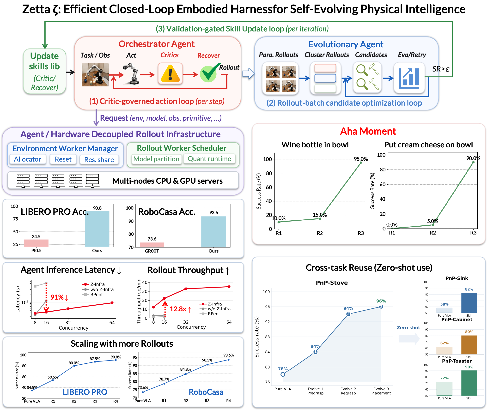

> **导师解读**：把基础策略想成“已经会开车的司机”，检查器负责发现“正在打滑”，恢复技能负责“怎样脱困”，演化智能体则在事后把一次有效脱困整理成以后能复用的规则。这里的学习不发生在司机的大脑参数里，而发生在随车保留的检查程序和操作办法里。这只是帮助理解的类比；对应的真实对象是代码与机器人控制接口。

## 2. 背景从 0 讲起

### 2.1 机器人策略、世界动作模型与执行框架

视觉—语言—动作模型（VLA）把图像、语言指令和机器人状态转成动作；世界动作模型（WAM）还把未来视觉动态与动作联系起来。它们解决“当前看到这个场景、接到这条指令，下一步怎么动”的问题。端到端模型通常依赖大量示范学习，部署分布变化后，小小的抓取误差就可能造成后续整段失败（§1、§5.1）。

执行框架（harness）是包在模型外面的系统：决定何时调用模型、何时查询工具、如何保存状态、何时检查结果及如何恢复。给模型配上这些接口，不等于改变模型权重，也不等于天然具备持续学习能力。

> **导师解读**：先把“模型会什么”和“整个机器人系统会什么”分开。一个模型可能不会自己判断瓶子已经掉了，但外部程序可以读到手指接触消失，再组织重新抓取。Zetta 的新增能力主要来自后一层，所以对比时必须统计它额外获得的状态、工具和重试预算。

### 2.2 为什么事后反思不够

论文将先前方法概括为：执行时沿用已有技能，整个回合结束后才反思。这样的反思来不及处理正在发生的碰撞或滑落，而且最终“失败”无法自动说明到底是看错、抓错、搬运掉落，还是成功判据出了问题。大模型推理又太慢，不能在每个物理控制步都完整思考一次（§1–2.2）。

作者提出让轻量代码高频检查，让大模型承担更慢的诊断与程序修改。需要保留一个措辞警告：§2.2 把 VLA 统称为开环，而 §2.3 又明确说基线是“pure VLA closed-loop execution”。因此，更准确的贡献是新增显式、可演化的失败监测与恢复闭环，不能说普通 VLA 完全不使用新观测。

> **导师解读**：这篇真正要补的，不是“以前机器人不看环境，现在终于看了”，而是“看到变化之后，谁负责发现失常、接管执行，以及把有效办法留到下次”。把问题这样重述，才能避免被论文的开环／闭环话术带偏。

### 2.3 为什么值得研究

物理环境的失败模式非常多，逐个请专家手写补丁难以扩展；但为每个失败都微调整个动作模型也很昂贵。Zetta 试图将“试错—定位—写补丁—验证—入库”自动化。与此同时，试错数据来自实际仿真执行，执行吞吐量会限制单位时间内能探索和验证多少候选（§2.2、§3）。

> **导师解读**：学习速度有两个瓶颈：能不能提出有用修改，以及一天能验证多少修改。Zetta 的执行框架解决前者，Z-Infra 解决后者。它们相互配合，但不能因为仿真跑快了，就直接断言学习机制更有效；这需要在相同经验预算下另做比较。

## 3. 论文的问题定义

### 3.1 输入、输出与优化目标

| 层次 | 输入 | 输出 |
| --- | --- | --- |
| 基础策略 | 当前观测 $s_t$、任务目标 $g$ | 低层动作 $a_t$ |
| 运行时检查器 | 轨迹历史或近期状态窗口，接触、进展等证据 | 提案 $P_t=\langle e_t,\hat\sigma_t\rangle$，不是动作或成功宣告 |
| 编排智能体 | 检查提案、恢复库、工具、任务知识 | 最终执行模式 $\sigma_t$：继续基础策略或调用专门工具 |
| 演化智能体 | 失败轨迹、成功参照、当前框架版本 | 新的检查器、恢复规则、工具及阈值配置 |
| 最终评估 | 冻结的新框架与隔离测试种子 | 官方成功判据下的任务成功率 |

目标是最大化任务分布上的期望成功率 $J(\mathcal H)$，不是最小化一个可微神经网络训练损失。论文将代码空间的有界修改类比于 SGD 式优化，但没有对代码执行反向传播（§1、§2.1，Eq. 5）。

> **导师解读**：输入输出表能帮助你检查“Agent 在哪里”：不是让 VLA 输出一段思维链，而是让编排者决定用哪个执行模式，让演化者根据失败证据修改可执行程序。最终优化的单位是框架版本，不是一组通过梯度下降得到的新策略参数。

### 3.2 训练、开发、运行与测试分别发生什么

论文使用已经预训练或后训练的基础策略：LIBERO-Pro 对应 $\pi_{0.5}$，RoboCasa 对应 GR00T N1.5。Zetta 的部署期演化不微调这些权重；编排智能体的内部参数与决策逻辑也被定义为固定。会变化的是 $C,R,\mathcal T$、配置阈值、失败清单、技能包和版本化经验（§2.1、§2.6、§4.1）。所以“training-free”只描述这段演化流程，不代表底座从未训练。

开发阶段使用可反复查看的轨迹来诊断和改写程序。部署执行阶段调用冻结策略及已经生成的检查／恢复逻辑。最终测试阶段将最后的框架冻结，用从未参与演化的种子报数。若检查留出样本后据此改了框架，原文要求将这些样本转入开发集，并换一批未见种子做最终验证（§2.6.2）。

有一处实现边界不清：§2.1 和两个附录算法要求在线编排者审核干预，但 §4.6 描述速度实验时说 Agent 只在离线反思阶段调用，在线是 VLA 加轻量检查器。在线审批究竟是每次远程大模型调用，还是编译好的固定规则，论文未充分统一说明；复现时不能把两种执行方式视作等价。

> **导师解读**：这里的“在线演化”不等于每个动作步都让大模型改代码。更接近的理解是：机器人运行时快速检查，积累一批执行记录后慢慢改程序，验证通过后再换新版本。审批是否仍需昂贵模型调用，会直接改变延迟和复现成本，因此这不是无关紧要的表述差异。

### 3.3 环境、奖励与反馈

环境是 LIBERO-Pro 与 RoboCasa 仿真。最终反馈使用官方任务成功判据；过程反馈还包括任务里程碑 $\mu_t$、碰撞／接触等辅助物理信号 $\phi_t$、物体相对位姿、动作与实际末端运动、视频和工具调用。接口可以返回 reward，但本文没有把这些反馈用于策略梯度训练（Eq. 7、Appendix C/D、Table 1）。

§2.4 明确允许视觉证据不足时查阅仿真内部状态和物理信号。**评价**：这比纯 RGB 加本体感知的现实机器人条件强；不能把仿真成功率直接等同于现实相机输入条件下的性能。论文结论将扩展到真实机器人作为后续工作。

> **导师解读**：系统之所以能判断“夹爪在动但没有带着物体走”，不只是因为语言模型聪明，而是因为它能获得可检查的状态证据。迁移到真机时，首先要问这些信号能否可靠测量；若接触和位姿估计本身出错，检查器也会犯错。

## 4. 方法总览

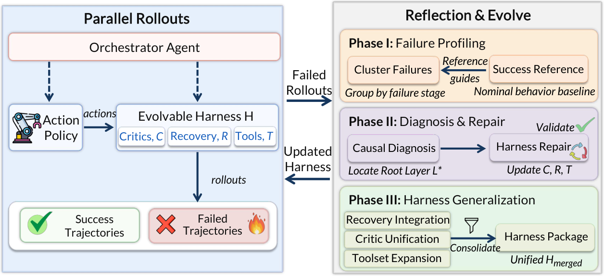

1. **先跑冻结策略，建立参照。** 在开发种子上执行，区分真实策略失败与基础设施故障，完整保存轨迹；成功轨迹按里程碑建立索引。
2. **找到第一次偏离。** 不是只看最后没成功，而是找最早缺失里程碑、最早可观察偏离及其接触／位姿证据，把相似失败分组。
3. **挑代表失败，逐层诊断。** 从每组选择代表种子，依次检查评估、检查器、状态、规划、恢复、参数层，优先处理上层能解释的问题。
4. **做最小修改。** 添加或修正检查条件、恢复程序及工具；同时规定什么条件下才可以重新交回基础策略。
5. **重放诊断，再从头执行。** 确认新检查器能发现原来的问题，然后重新跑完整闭环，避免把“成功检测到错误”当成“任务完成”。
6. **跨种子整合与验证。** 把个别坐标或例外条件抽象成相对物体几何、接触与进展规则；检查历史回归和留出泛化。
7. **通过后晋级、保存版本。** 下一轮沿用已验证能力，再去发现尚未解决的失败；Z-Infra 并行组织这些执行与模型推理。

```text
冻结策略 + 当前技能包 → 环境执行 → 高频检查 → 必要时恢复 → 回到策略
                           ↓ 轨迹与失败证据
                    聚类 → 诊断 → 最小补丁
                           ↓
                    回归 + 留出验证
                    通过才晋级、供下一轮使用
```

不要混淆两套“三”：**三个时间尺度循环**是动作级治理、批量轨迹候选优化、迭代级验证晋级；**三个工作阶段**是失败画像、诊断修复、整合泛化。后者是演化流程的组织方式，不能机械地把 Phase I/II/III 与三个循环一一画等号（§1、Figure 2、§2.3–2.6）。

> **导师解读**：这条流程最重要的顺序是“先拿证据、再改程序、最后重新试”。如果直接让大模型读失败视频后写一条经验，既没有确认失败根源，也没有证明建议真能执行成功。Zetta 的主要设计就是在每次把经验变成长期能力之前，插入可重复的执行检验。

## 5. 核心机制精读

### 5.1 运行时检查、审批与恢复接管

检查器扫描轨迹，产生失败证据和建议执行模式；编排者结合任务知识审核，决定是否使用恢复工具。恢复不是简单再试一次：它可以停止危险动作、重新定位、换一个抓取方案、维持夹持做精细对齐，或者接管最后的放置阶段（Eq. 2–3；Appendix C/D）。输入是实时状态，输出分别是提案、批准模式和实际动作。

检查器不能自己宣告任务成功；最终成功由官方谓词决定。恢复结束也不能立即交还策略，必须确认原失败已经清除，且状态满足稳定性条件（Eq. 12）。**这是推断**：移除检查器会失去及时发现问题的能力，移除重新接入条件则可能过早交接；论文案例支持这一设计动机，但没有完整的全任务模块移除消融。

> **导师解读**：先判断“哪里不对”，再决定“是否接管”，最后确认“可以交回去了吗”，是三个不同问题。只写一个“失败就重试”的 if 分支，会把诊断、授权和安全交接混在一起，容易出现工具与基础策略来回抢控制权。

### 5.2 失败画像与成功参照

系统以只追加不覆盖的方式保存状态、动作、里程碑和物理信号，按成功里程碑建立健康状态索引。失败清单记录第一个未完成的里程碑，再定位最早可观察偏离 EOD。聚类依据包括偏离时刻、机器人—物体相对位姿和活跃工具，随后选择靠近簇中心的实际样本，即 medoid，而不是凭空合成一个“平均失败”（§2.3–2.4）。

基础设施异常如仿真崩溃不算策略失败，必须用同一逻辑种子重跑。这是为了避免把跑不出来的样本随意丢弃而改变测试分布。输出是可供诊断的失败簇、代表种子及成功参照。**这是推断**：没有分组就会重复修同一类故障，没有成功参照则更难判断第一次偏离；原文没有量化这两个模块各自带来的增益。

> **导师解读**：最后都表现为“瓶子没放进碗”，原因却可能是从没抓住、半路掉落，或最后放偏。先把失败按发生过程分开，才能让补丁修到正确位置。成功参照提供的是“这一阶段正常时大致是什么状态”，不是一条必须原样模仿的成功轨迹。

### 5.3 分层诊断与最小修复

诊断顺序为 Evaluation → Critic → State → Planning → Recovery → Parameter。先确认判分逻辑没错，再查检查器是否误报／漏报，接着检查状态是否准确、规划能否处理约束、恢复逻辑是否有缺陷，最后才动控制增益与阈值。选定主视角后，视觉推理保持在该视角；证据不足时用仿真状态和传感器校验，而不是随意切视角补想象（§2.4，Eq. 11）。

修复者接收定位层、证据链和功能需求，输出最小框架补丁。它不仅能调旧工具参数，还能新增工具。**评价**：这里“因果诊断”主要是一套证据驱动的排查协议；没有给出独立的结构因果模型、可识别性证明或全面因果验证实验，不能仅因名称就把诊断结论当作已识别的真实因果关系。

> **导师解读**：如果失败其实是“已经放好了，但判据写错”，你去改机器人关节增益只会添乱。由上到下排查是在控制修改范围，让一次修复尽量少破坏已有能力。这与软件调试的逻辑相近，但物理状态和接触反馈让证据收集更难。

### 5.4 整合、验证与跨回合技能记忆

局部补丁通过后，泛化智能体将多个种子上的检查条件、恢复动作和工具整合成统一技能包。检查器可组合触发条件，恢复程序改用相对几何与物理谓词，阈值放进配置，代码与计划分别存入 `tools/`、`plans/`，总体规则写入 `SKILL.md`（§2.6，Eq. 14）。它保存的不是只有一段文字的经验，而是以后能执行的控制逻辑。

形式化要求是：原失败簇全部修复；隔离留出集上较基础策略有收益；如果查看留出失败后继续修改，则将该样本纳入开发集并更新最终留出集。§4.1 的 LIBERO 实际开发停止描述则是针对选中开发失败种子达到至少 50% 成功；这与 §2.6 的簇内 100% 要求如何对应，并未解释清楚。

> **导师解读**：跨回合记忆真正起效的时刻，是下一个新回合能调用上一个回合留下的检查代码与恢复方案。验证门控负责决定什么有资格成为长期记忆。但“论文写了严规则”和“每个实验真的满足同一规则”仍是两件事，要核对执行日志才能消除这里的口径疑点。

### 5.5 Z-Infra：把执行逻辑与算力分开

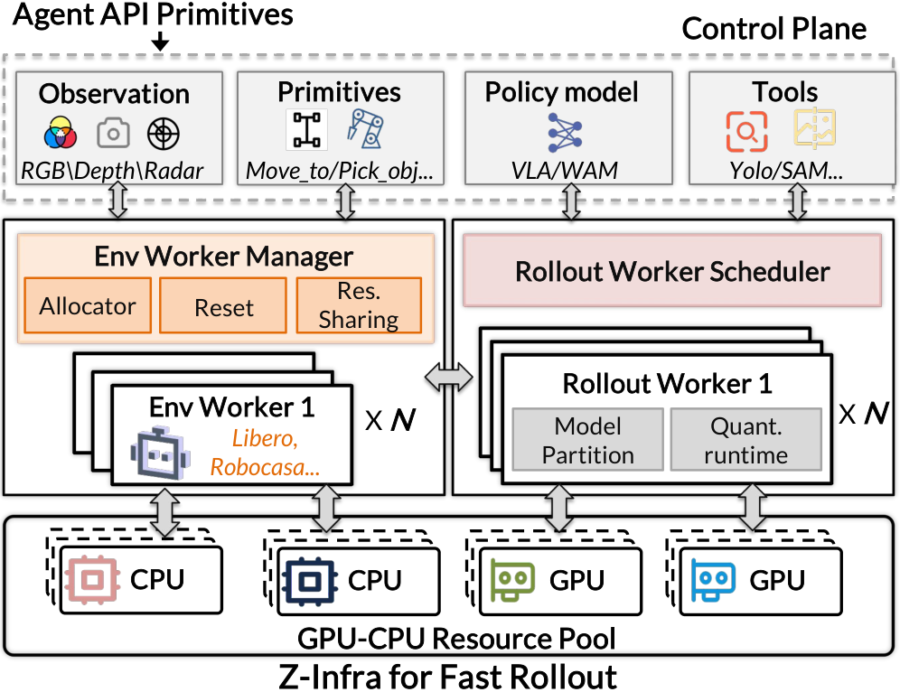

控制平面管理会话、路由和故障；环境工作进程维护仿真状态；模型执行工作进程在 GPU 上批量处理策略或感知请求。容量受限的异步通道提供背压，避免请求无限堆积。MuJoCo 的不可变模型结构可共享，但每个会话有独立 `mjData`，重置一个回合不能改变另一个。模型还可拆成视觉语言部分与动作专家，独立调度，通过 CUDA IPC 传中间激活（§3）。

输入是“某会话需要哪个模型／动作／环境操作”，输出是路由回该会话的结果及执行记录。移除 Z-Infra 有直接系统对照：并发 16 时吞吐从完整方案 22.09 ep/min 降为 2.88 ep/min，继续提高并发会遇到显存不足（§4.6）。这证明执行基础设施的重要性，不单独证明演化智能体的学习优势。

> **导师解读**：十几个机器人仿真会话并行，并不等于给每个会话都复制一整套大模型和渲染资源。这里先把“保存环境状态”和“做一次模型推理”拆开，才能把不同会话的请求凑成一批，又不串掉各自状态。你的多卡资源主要可以在这一层换取更多有效试验。

## 6. 公式／算法逐行解释

本章覆盖全部 16 个编号公式，以及代码清单 1、算法 1 和算法 2。原文不少公式是接口或判据的形式化，不是完整可实现的数值算法；未给出的距离、阈值和诊断打分不能自行补成“论文实现”。

### 6.1 Eq. 1–5：究竟在优化什么

**Eq. 1：**

$$\mathcal H=\{C,R,\mathcal T\}.$$

$\mathcal H$ 是执行框架，$C$ 是检查函数集合，$R$ 是恢复库，$\mathcal T$ 是工具集。这是组件定义，对应代码中的三个模块或版本化对象，并不是损失函数。

**Eq. 2：**

$$P_t=C(\tau_{0:t})=\langle e_t,\hat\sigma_t\rangle.$$

$t$ 是当前时刻；$\tau_{0:t}$ 是截至当前的执行历史；$e_t$ 是可审计证据；$\hat\sigma_t$ 是建议模式；$P_t$ 是二者组成的提案。对应 `proposal = critic(history)`，注意不在此调用机械臂。

**Eq. 3：**

$$\sigma_t=\mathcal A_{orch}(P_t,R,\mathcal T,\mathcal K).$$

$\mathcal A_{orch}$ 是固定编排者，$\mathcal K$ 是任务知识，包括里程碑、成功条件和环境约束；最终模式 $\sigma_t=0$ 表示基础策略，$\sigma_t>0$ 表示专门工具。对应 `mode = approve(proposal, task_rules, library)`。原文后续又用 $\mathcal K$ 表示失败簇集合，属于符号复用，读上下文时要分清。

**Eq. 4：**

$$\mathcal H^{(k+1)}\leftarrow\mathcal A_{evo}(\mathcal D_{fail}^{(k)},\mathcal H^{(k)}).$$

$k$ 是演化轮次，$\mathcal D_{fail}^{(k)}$ 是这一轮失败数据，$\mathcal A_{evo}$ 表示演化智能体流程。箭头表示产生新框架版本；并不意味着生成后直接上线，后续还要经过修复验证与晋级。

**Eq. 5：**

$$\max_{\mathcal H}J(\mathcal H)=\mathbb E_{g,s_0\sim\mathcal D}[\mathrm{Success}(\tau)\mid\pi,\mathcal A_{orch},\mathcal H].$$

$g$ 和 $s_0$ 是从任务分布 $\mathcal D$ 抽取的目标、初始状态；$\pi$ 为基础策略；Success 是完整轨迹是否完成任务的二元结果；期望表示在任务分布上平均。实际实现用留出执行估计成功率，不计算这个期望的解析梯度。原文 $\nabla\theta=0$ 用来表达参数冻结，更严谨的工程含义是禁止优化器更新 $\theta$，不是声称损失对参数的真实导数恒为零。

```python
proposal = critic(recent_history)
mode = orchestrator.approve(proposal, recovery_library, tools, task_rules)
action = base_policy(obs, goal) if mode == 0 else tools[mode](obs)
candidate = evolve(failure_records, current_harness)
# candidate 仍需后续验证，不能直接代替 current_harness
```

> **导师解读**：这五个式子在划定权责：谁只报告问题、谁决定动作、谁改框架，以及最后按什么指标选版本。它们不是在训练一个新网络，而是在规定一套可执行程序如何通过环境成败接受修改。

### 6.2 Eq. 6–9：哪些轨迹算数，失败发生在哪

**Eq. 6：**

$$\mathcal V=\{seed_j\in\mathcal D_{dev}\mid\mathrm{Valid}(seed_j)=True\}.$$

$\mathcal D_{dev}$ 为开发种子集；$j$ 标记样本；Valid 判断执行是否有完整有效的传感器和视频轨迹。$\mathcal V$ 是有效种子集合。文中有时又把其中元素当轨迹，代码实现宜显式区分种子 ID 与其轨迹记录。基础设施失败用同一 seed 重跑，任务失败仍计入有效数据。

**Eq. 7：**

$$\tau^{(j)}=\{(s_t,a_t,\mu_t,\phi_t)\}_{t=0}^{T}.$$

$T$ 是终止时间，$s_t,a_t$ 是状态和动作；$\mu_t$ 为语义里程碑完成状态；$\phi_t$ 包含碰撞强度、接触力等物理辅助信号。对应只追加的日志，而不是只保存最终一个 success 布尔值。

**Eq. 8：**

$$I_{succ}(\mu)=\{s_t\mid\tau\in\mathcal V_{succ},\mu_t=\mu\}.$$

$I_{succ}$ 按里程碑 $\mu$ 索引成功轨迹集合 $\mathcal V_{succ}$ 中的状态。目的是比较“同一任务阶段的正常状态”，而不是把不同阶段的状态混成一个参考均值。

**Eq. 9：**

$$m^*=\min\{m_k\in M\mid m_k\notin\{\mu_t\}_{t=0}^{T}\}.$$

$M=\langle m_1,\dots,m_{goal}\rangle$ 为有序里程碑，$m^*$ 是第一个在历史中没有出现的里程碑。这里的 min 按里程碑顺序理解，不是比较字符串。全完成时集合为空，代码应返回“无缺失”；原文未专门定义空集分支。

```python
record = run_with_same_seed_retry_on_infrastructure_error(seed)
append_trace(record.states, record.actions, record.milestones, record.contacts)
if record.official_success:
    index_success_by_milestone(record)
first_missing = next((m for m in ordered_milestones if not observed(m)), None)
```

> **导师解读**：这些式子把“失败了”拆成能调试的数据结构。先确保这次执行真的有效，再保存过程，最后找到第一步没做到的事。否则仿真崩溃可能被误学成策略缺陷，而末端的失败现象又可能掩盖前面更早的原因。

### 6.3 Eq. 10–11：最早偏离与诊断层级

**Eq. 10：**

$$t_{EOD}=\min\{t\mid\mathrm{dist}(s_t,s_t^{ref})>\epsilon,\ s_t^{ref}\in I_{succ}(\mu_t)\}.$$

$s_t^{ref}$ 为相同里程碑下的成功参照状态，dist 是状态距离，$\epsilon$ 为阈值。它找第一次偏离正常状态超过阈值的时刻。原文没有完整规定如何从多个参照状态中选取 $s_t^{ref}$、距离各维如何归一化、所有任务使用怎样的 $\epsilon$；因此它是检测原则，不能照一个未知默认值就宣布复现成功。

**Eq. 11：**

$$L^*=\operatorname{arg\ max}_{L\in\mathcal L}\{\mathrm{IsRootCause}(L)\mid\text{Evidence from }\tau,\text{Primary View}\}.$$

$\mathcal L$ 为六个诊断层，$L^*$ 为选中的根因层。论文紧接着规定了优先顺序，但没有给出数值化 IsRootCause 打分或优先级目标。**这是推断**：忠于文字流程的最小实现可以按顺序检查，选第一个有证据支持的层；不能把这个实现选择反写成原文给出的概率模型。

```python
# 以下是对文字协议的实现示意；距离和证据判定必须显式配置。
for layer in [evaluation, critic, state, planning, recovery, parameter]:
    if evidence_supports_failure_at(layer, representative_trace):
        repair_spec = minimal_patch_requirements(layer)
        break
```

> **导师解读**：EOD 问的是“从什么时候开始不对”，分层诊断问的是“应当改哪一层”。时间定位和模块定位不是一回事。最早偏离也不自动等于根因，仍要用同类失败和实际修复结果交叉验证。

### 6.4 Eq. 12–13：修复完了才能交回策略

**Eq. 12：**

$$\Psi(s_t)=\mathbb1(\mathrm{FailureCleared})\land\mathbb1(\mathrm{Stability}(s_t)>\gamma).$$

$\Psi$ 是重新接入条件；$\mathbb1$ 把条件变成真／假；$\land$ 要求同时满足；$\gamma$ 为稳定性阈值。原来的失败证据消失，而且物理状态稳定，才能交回策略。原文提到接触力矩振荡和抓取力，但没有完整定义 Stability 的标量化和方向；如果实现用“振荡幅度”作为原始量，通常应是越小越稳，不能未经转换就照抄大于号。

**Eq. 13：**

$$\mathrm{Success}(\mathcal H_{patch})=\mathbb1(\mu_{T,new}=m_{goal}\land\forall t\in\mathrm{Intv},\ \text{Adjudicated by }\mathcal A_{orch}).$$

$\mu_{T,new}$ 为新执行轨迹的最终里程碑，Intv 为干预时段。补丁要把完整任务做到终点，而且所有干预合规。实际流程先回放确认检测，再从初始状态重新执行，不能只在失败片段上演示恢复动作。Eq. 13 没显式写入 $\Psi$，但正文同时要求重新接入合规。

> **导师解读**：抓住瓶子并不等于抓稳瓶子，成功绕开一次碰撞也不等于完成整个任务。这两个判据分别限制“什么时候交接”和“怎样判补丁有效”，目的都是防止把局部看起来修好了误当作系统真的变可靠。

### 6.5 Eq. 14–16：局部补丁如何变成长期能力

**Eq. 14：**

$$\mathcal H_{merged}=\mathrm{Consolidate}(\{\mathcal H_{patch,j}\mid seed_j\in K_i\}).$$

$K_i$ 是一个失败簇；不同种子 $j$ 的补丁经 Consolidate 整合成统一框架。该运算包括统一检查器、恢复计划和工具，不是简单连接代码文件。论文没有给出唯一可执行的合并算法。

**Eq. 15：**

$$\forall seed_j\in K_i,\quad\mathrm{Success}(seed_j\mid\mathcal H_{merged})=1.$$

这是原失败簇的历史回归要求：不是只修好代表种子，而是簇内所有种子都成功。它是开发层面的验收标准，不能当作未见场景上 100% 成功的保证；还要结合 §4.1 的实际停止口径警告。

**Eq. 16：**

$$\Delta SR=SR(\mathcal D_{held-out}\mid\mathcal H_{merged})-SR(\mathcal D_{held-out}\mid\pi_{VLA}).$$

SR 为成功率，$\mathcal D_{held-out}$ 为隔离留出集；两项必须在相同评估条件下比较。差值是成功率增益，不是显著性检验，$\Delta SR>0$ 不能自动推出统计显著。

> **导师解读**：这一组是在回答“这份新记忆该不该留下”。只通过旧失败说明能修旧题，通过新种子才开始支持泛化；但有限测试集上的正增益仍可能来自随机波动。要把它用作新论文基线，应额外报告成对统计和多次独立演化，而不是把门控条件当成理论保证。

### 6.6 代码清单 1 与表 1：一次 policy_step 的去向

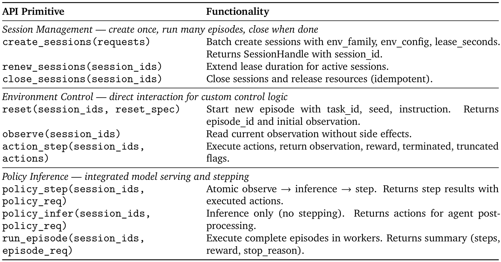

清单依次是四段：Agent 创建 16 个 `maniskill` 会话、reset、重复调用 `policy_step`、结束后关闭；Gateway 按会话 ID 查工作进程并派发请求；EnvWorker 附上路由标记，将观测和指令送进推理队列，等待对应结果后执行 `env.step`；RolloutWorker 不断从调度器取一批兼容请求，推理后逐个按标记发回。

表 1 每行是一个 API，不是模型成绩：`create/renew/close_sessions` 管生命周期；`reset/observe/action_step` 管直接环境交互；`policy_step/policy_infer/run_episode` 分别是推理并步进、只推理、完整回合执行。正文说接口分五类，但表中具体列的是三组，不能补造未列出的接口签名。清单中的 ManiSkill 是编程示例，不等于性能主实验另测了 ManiSkill。代码是简化伪代码，部分上下文变量和资源清理异常分支省略，不能直接运行。

> **导师解读**：这里没有改变“机器人想做什么”，只是保证每个会话得到自己的模型输出，而且等待模型时别把其他环境堵住。看懂 token 的往返路由，比记住 Ray 的名称更重要；一旦结果串到另一个会话，整个并行实验都会失效。

### 6.7 Algorithm 1：PnP-Stove 的 18 行

输入是冻结策略 $\pi$、检查器 $C$、恢复库 $R$、失败抓取记忆 $\mathcal M$；输出是官方任务成功或有界失败记录。$W_t$ 为近期状态窗口。

| 原文行号 | 做什么，为什么 |
| --- | --- |
| 1 | 在回合仍有效时循环；不是无限重试。 |
| 2 | 执行一个策略或恢复动作块，收集新状态窗口。 |
| 3 | 检查器生成提案；注释强调只有建议权。 |
| 4–5 | 先查官方任务谓词，满足才返回成功。 |
| 6–7 | 正常推进时沿用冻结 VLA。 |
| 8–9 | 抓取失败或不稳时停止不安全运动、松开并重新准备。 |
| 10 | 提出新的物体相对抓取，避免重复 $\mathcal M$ 中已失败的等价方案。 |
| 11 | 执行预抓取、获得物体，再短暂检查稳定性。 |
| 12 | 重试失败就写入 $\mathcal M$，只能在预算内继续。 |
| 13–14 | 已抓稳但运输停滞时，不松开重抓，而是由粗粒度底座搬运切到机械臂精细对齐。 |
| 15–16 | 检测物体已受支撑后松手并退开，直到满足夹爪远离条件。 |
| 17 | 每次干预和返回基础策略均须编排者批准；这是跨分支约束，不是先执行后补审批的授权。 |
| 18 | 未能成功时返回有界失败记录，留给后续诊断。 |

> **导师解读**：这段算法的关键不是“失败就再抓”，而是区分三种状态：没抓住、抓稳但运不动、已经放好但手还没离开。它们需要不同恢复方式。失败抓取记忆让系统少走回头路，预算限制则防止一个恢复动作永远占着控制权。

### 6.8 Algorithm 2：Goal-T2 的 20 行

输入输出与算法 1 相同，目标改为把酒瓶放进当前碗中。行 1–7 仍是执行、检查、官方判成功或继续 VLA。行 8–12 专门处理没有靠近目标或抓取失败：停止危险动作、张开夹爪、重新准备，选择不同于历史失败的预抓取，完成接近、抓取和短距离抬升检查，失败则记忆并在预算内重试。

行 13–15 处理已开始运输后失去抓持：在空夹爪到达目标前停止，解除残余接触、回到预抓取位置，再拿起瓶子。行 16–18 处理稳定抓住且已接近碗：对齐实时容器、下降直到满足容纳关系，然后松开并退离，确认夹爪与物体分离。行 19 是所有接管／交回的审批约束，行 20 返回有界失败记录（Appendix D）。

> **导师解读**：算法 2 与算法 1 相近，是因为可复用的单位正是“接近—获得—保持—搬运—放置”这些物理关系。区别是目标容器和故障证据不同，所以要重新绑定实时物体，而不是把源任务的一串绝对坐标复制过去。这也解释了作者所说的跨任务技能迁移。

## 7. 实验部分精读

### 7.1 环境、模型和评估单位

LIBERO-Pro 在 LIBERO 上增加扰动。本文测 Goal 与 LIBERO-10（也称 Long），每套 10 个任务，再分别测 T 和 S，共 40 个任务—设置组合。T 是改变指令指向的合法物体或目标；S 是保持指令不变，交换／重排相关物体初始位置。Table 5 列的是底层任务索引，T 的实际指令可能不同，因此底层“瓶子放柜顶”与实际“瓶子放碗里”不必然是记录错误（Appendix B）。

RoboCasa 使用 18 个 Atomic-Seen 任务；Table 4 对应官方任务名，不能把它叫作整个 RoboCasa 所有任务的平均。LIBERO-Pro 每任务取 50 个不含 1–20 的开发种子，最终测试用种子 1–20；RoboCasa 每任务 50 个开发种子，另取隔离的 50 个测试种子（§4.1）。环境种子重复执行不等于多次独立演化实验。

基础策略分别是冻结的 $\pi_{0.5}$ 和 GR00T N1.5，属于可部署的预训练机器人模型，不是把动作任务直接发给聊天 API。论文未明确列出支撑全部诊断、修复与编排实验的大模型精确版本和调用量。当前官方仓库示例列了 `gpt-5.6-sol`，但这是阅读时的代码示例，不能据此反推论文所有实验都用该版本。[官方仓库](https://github.com/air-embodied-brain/Zetta-Embodiment)

> **导师解读**：先固定分母，再讨论成绩。20 个测试种子意味着单任务每成功一个，成功率就变化 5 个百分点；50 个对应 2 个百分点。看到十几个百分点的差异时，要继续问这些成功是否来自相同种子、是否重复了完整演化过程，以及误差条反映哪一种随机性。

### 7.2 Table 2：RoboCasa 的 18 个任务

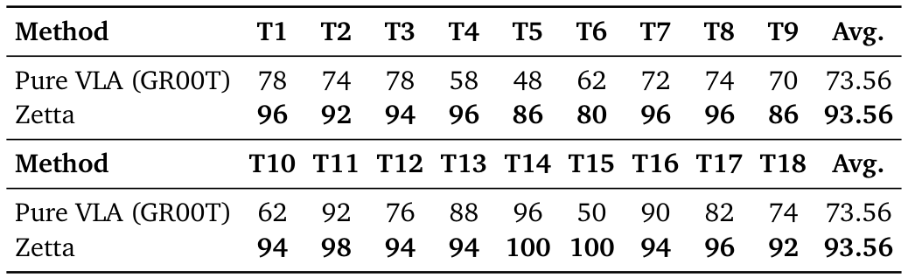

两行方法分别为 Pure VLA（GR00T）与 Zetta；T1–T18 是任务，不是训练轮次。为了排版，原表把前九项和后九项分开，Avg. 重复印了两次，但都是全部 18 任务的宏平均。下表给出每列含义和增益，数值来自 Table 2，名称来自 Table 4。

| 任务列 | 官方任务／中文含义 | 基础策略 → Zetta（%） | 增益（百分点） |
| --- | --- | --- | --- |
| T1 | NavigateKitchen／厨房导航 | 78 → 96 | 18 |
| T2 | TurnOnMicrowave／打开微波炉开关 | 74 → 92 | 18 |
| T3 | PickPlaceCounterToStove／台面到炉灶 | 78 → 94 | 16 |
| T4 | PickPlaceSinkToCounter／水槽到台面 | 58 → 96 | 38 |
| T5 | PickPlaceDrawerToCounter／抽屉到台面 | 48 → 86 | 38 |
| T6 | PickPlaceCounterToCabinet／台面到橱柜 | 62 → 80 | 18 |
| T7 | PickPlaceToasterToCounter／烤面包机到台面 | 72 → 96 | 24 |
| T8 | TurnOnSinkFaucet／打开水龙头 | 74 → 96 | 22 |
| T9 | CoffeeSetupMug／咖啡机处放好杯子 | 70 → 86 | 16 |
| T10 | OpenCabinet／打开橱柜 | 62 → 94 | 32 |
| T11 | CloseFridge／关闭冰箱 | 92 → 98 | 6 |
| T12 | SlideDishwasherRack／滑动洗碗机架 | 76 → 94 | 18 |
| T13 | TurnOnElectricKettle／打开电热水壶 | 88 → 94 | 6 |
| T14 | OpenStandMixerHead／抬起搅拌机头 | 96 → 100 | 4 |
| T15 | CloseBlenderLid／盖好搅拌杯盖 | 50 → 100 | 50 |
| T16 | OpenDrawer／拉开抽屉 | 90 → 94 | 4 |
| T17 | CloseToasterOvenDoor／关烤箱门 | 82 → 96 | 14 |
| T18 | TurnOffStove／关闭炉灶 | 74 → 92 | 18 |
| Avg. | 每个任务等权 | 73.56 → 93.56 | 20.00 |

**评价**：对同一冻结底座的提升是清楚的，18 项都改善；但表里只有这一个基础策略对照，并没有给出所有强 Agent 方法在同状态权限、同工具和同探索预算下的完整榜单。因此“优于所用冻结策略”比“全面超过所有 SOTA”更有直接证据。

> **导师解读**：不要只盯平均的 20 个百分点。盖搅拌杯盖提高 50 点，原本已达 96% 的任务只提高 4 点，说明不同故障的可修复空间很不一样。分析平均值时应同时看底座地板、任务类型和具体恢复机制，而不是认为每个任务都均匀学到了同等能力。

### 7.3 Table 3：90.8% 与 71.13% 分别是什么

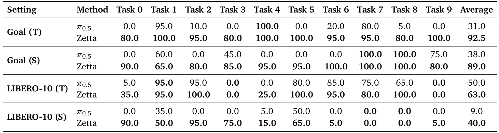

每两行固定一种设置，比 $\pi_{0.5}$ 与 Zetta；Task 0–9 是该套任务索引；最后一列是这十项的宏平均。

| 设置 | 冻结策略 | Zetta | 绝对增益 |
| --- | --- | --- | --- |
| Goal (T) | 31.0% | 92.5% | 61.5 个百分点 |
| Goal (S) | 38.0% | 89.0% | 51.0 个百分点 |
| LIBERO-10 (T) | 50.0% | 63.0% | 13.0 个百分点 |
| LIBERO-10 (S) | 9.0% | 40.0% | 31.0 个百分点 |
| 仅 Goal 两组平均 | 34.5% | 90.75% ≈ 90.8% | 56.25 个百分点 |
| 全部 40 个设置平均 | 32.00% | 71.125% ≈ 71.13% | 39.125 个百分点 |

论文说 32 个设置提升、8 个持平，与表格一致。但 LIBERO-10 (T) 的 Task 3、9 仍为 0%，LIBERO-10 (S) 的 Task 7、8 仍为 0%；后者多个任务也只有 5% 或 15%。这说明困难长程任务并未被普遍解决（§4.4）。

> **导师解读**：同一张表可以支持“对 Goal 很有效”，却不能支持“整个 LIBERO-Pro 已经达到九成成功”。把平均分母写清楚不是挑字眼，而是决定你能不能选它做尚有改进空间的基线。长程部分的低分，恰好是后续研究需要认真定位的边界。

### 7.4 “Aha moment”：局部突破，不是神秘涌现定律

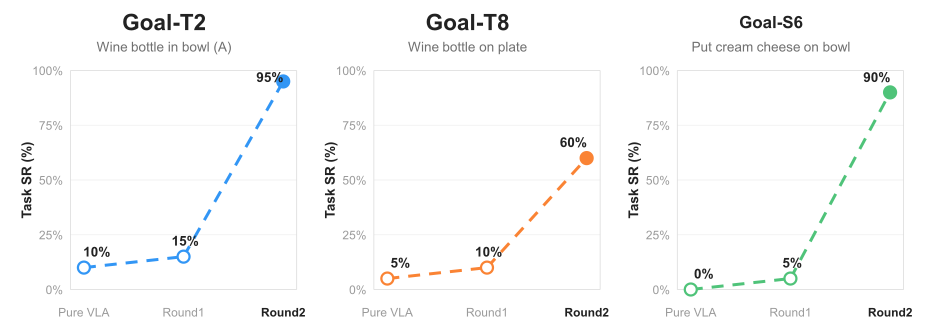

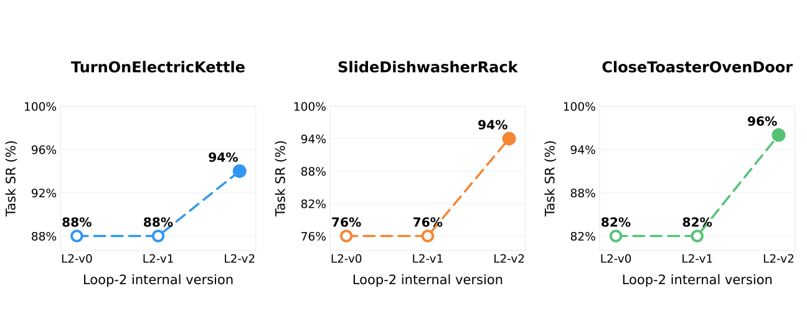

§4.2 明确定义这些 v0/v1/v2 是某个失败簇在离线诊断修复中的**选定内部版本**，不是三个等预算、独立的学习阶段。Goal-T2 从 10% 到 15% 再到 95%；早期只改接近位置，后来增加抓持保持检查。Goal-T8 案例为 5% → 10% → 60%，这个中间版本与最终 Table 3 的 80% 并不必然矛盾。RoboCasa 的水壶、洗碗机架、烤箱门例子分别由 88%、76%、82% 改善到 94%、94%、96%。

需要保留一处实际不一致：Goal-S6 的 Figure 4 基线图示为 0%，正文讨论早期平台时写 5%；不要悄悄把图改成正文，也不要混成“已确认的 5→90”。**评价**：选中版本的跃升支持“某些关键修复很有效”，不能仅凭三个点证明普遍的突现规律。

> **导师解读**：所谓“顿悟”可以理解为终于修对了问题：前几次只挡住末端症状，后一次找到了上游瓶颈，任务成功率因此跳升。应当研究的是哪条新检查／恢复规则起作用，而不是把曲线形状本身解释成智能突然产生。

### 7.5 累积曲线与迁移：哪些控制做了，哪些没做

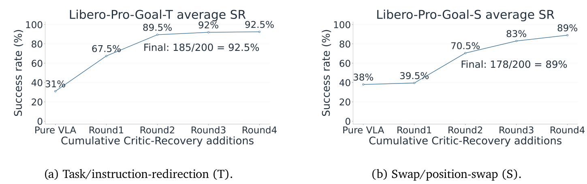

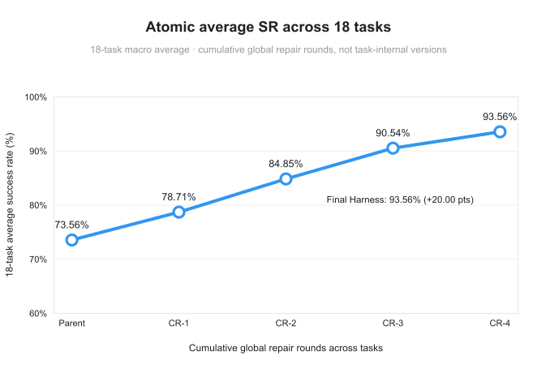

Figure 6 的横轴是累计检查—恢复版本，不是累计 episode 数。Goal-T 为 31、67.5、89.5、92、92.5%；Goal-S 为 38、39.5、70.5、83、89%。Figure 9 列出 73.56、78.71、84.85、90.54、93.56%，每轮保留此前验证的能力。

**评价**：这些是实际呈现的累计版本曲线，不能说作者“没有曲线”。但它们没有给出按总环境步数、失败候选数、API token 或算力归一化的完整学习轨迹，也没有报告多次独立演化的均值方差、顺序随机化及无持久记忆的等量重试对照。

另一个需要作者解释的统计口径：若 Figure 9 每点都严格使用 18 任务 × 50 个二元测试样本，平均值应落在约 0.1111 个百分点的网格上；中间的 78.71、84.85、90.54 无法仅由该固定分母经常规两位小数舍入得到。**不确定**：可能用了不同分母或额外汇总，但正文未说明；这不是认定数据造假的证据。

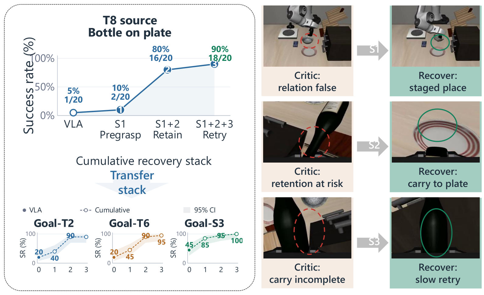

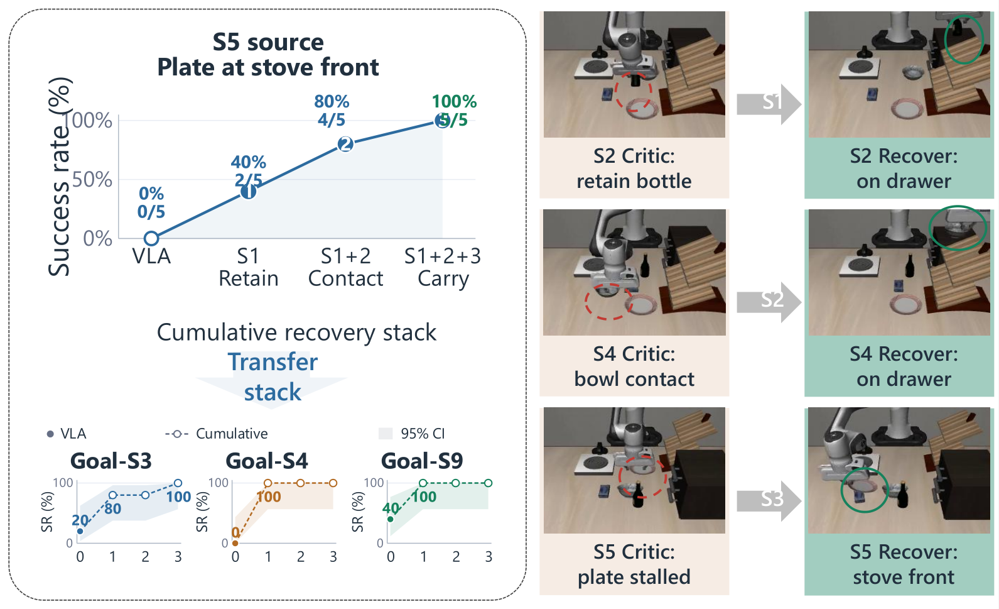

Figure 7/8 更接近受控技能栈比较：图注明确提到完整固定种子评估、Wilson 95% 置信区间；Figure 8 还明确固定策略随机数、checkpoint 和执行预算。Figure 7 的 Goal-S3 迁移示例是 9/20 → 20/20。Figure 8 的源任务上方则明示 0/5 → 2/5 → 4/5 → 5/5，不能把整张图都说成 20 例。Wilson 区间反映有限二元样本的不确定性，不等于不同演化种子的方差，也不代替成对差值检验。

> **导师解读**：这篇已经占据了“冻结策略、累计技能、画出上升曲线、做一部分匹配对照”的位置。你若沿这个方向继续做，不能再把“第一次画机器人累计曲线”当创新点。更稳的缺口是把技能内容、额外重试、选择偏差和经验顺序的作用分离，并公开完整纵向记录。

### 7.6 RoboCasa 迁移图的一个必须标注的疑点

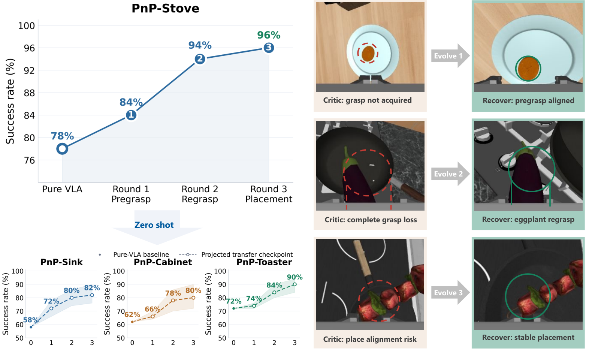

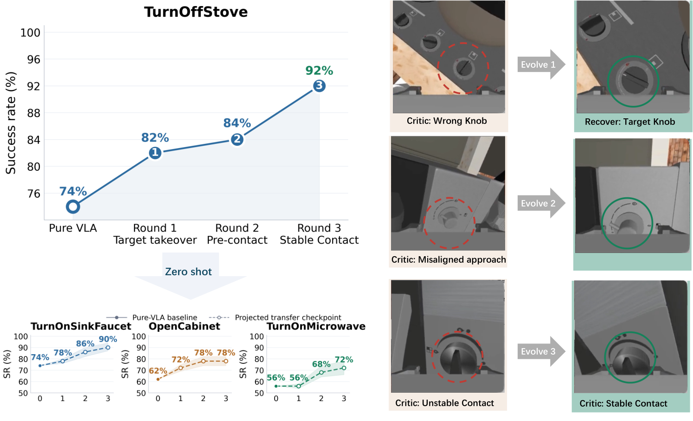

正文报告 PnP-Stove 得到预抓取、重抓与稳定放置后，向三项相关任务迁移，宏平均 64% → 84%；另一组关节／开关操作技能迁移是 64% → 80%。但 Figure 10/11 下方虚线图例写的是 **Projected transfer checkpoint**，正文没有解释 projected 在这里究竟指实测投射、估算，还是其他绘图含义。

因此，报告可以准确转述“作者报告了这些迁移收益”，却不能把每个虚线中间点都不加限定地当作已验证的完整实测纵向轨迹。应索取逐点 episode 记录、分母及图例定义；在此之前保持“不确定”。

> **导师解读**：看图不能只抄百分比，还要读图例。正文说评估了迁移，图却用了容易让人理解为投影／估计的词，两者之间缺少解释。严谨的阅读应把这个缝隙直接标出来，而不是替作者选择最有利或最不利的解释。

### 7.7 案例与消融分别证明什么

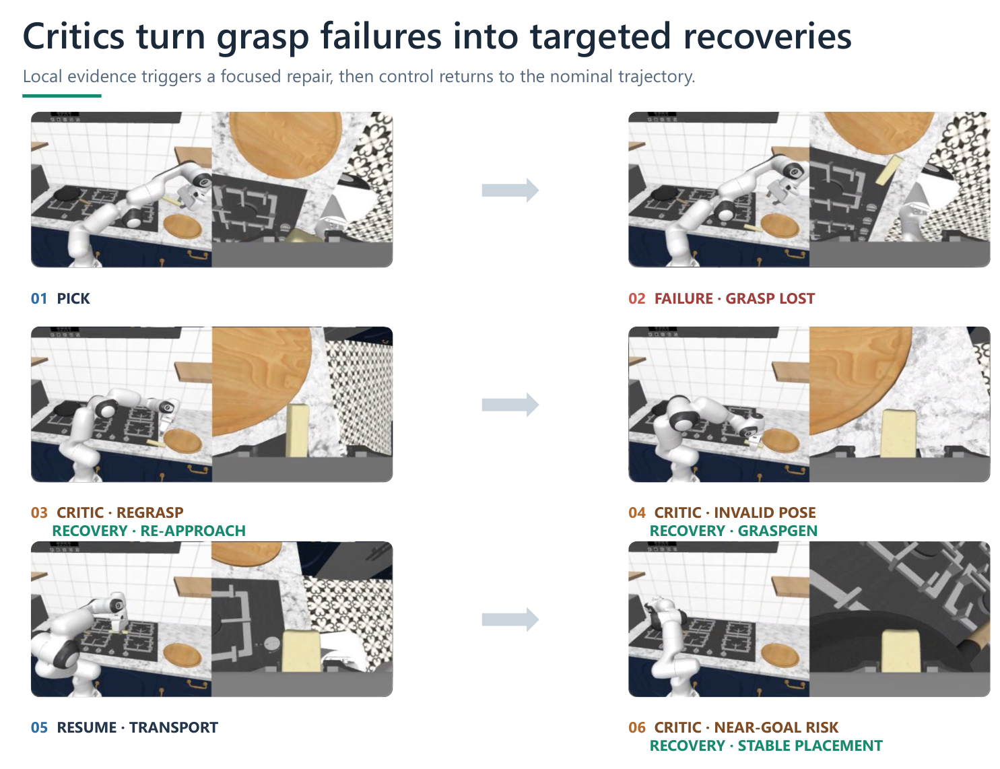

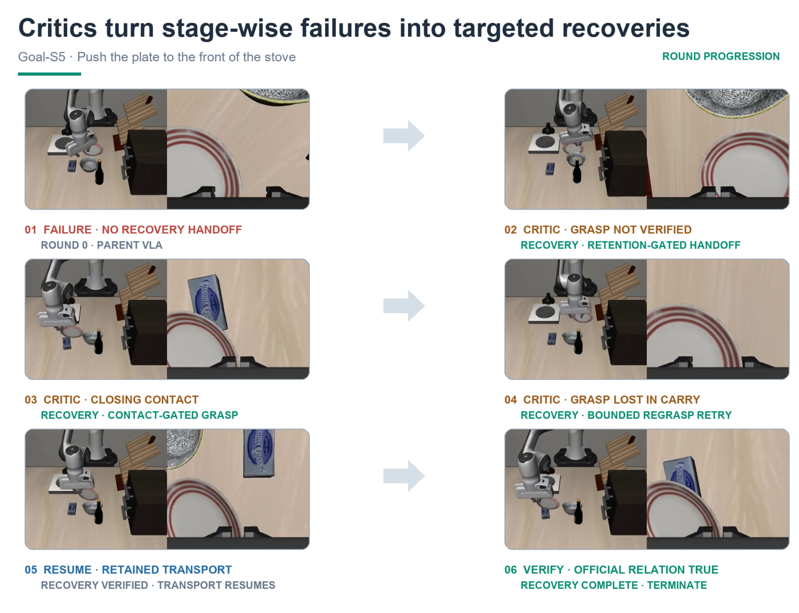

Figure 12 展示同一次执行内先重接近、再用 GraspGen 找可行抓姿、再用 CaP 式放置；Figure 13 展示的是**跨轮次的代表执行**，不是一个回合里的多个并列失败。后者依次解决未及时接管、抓持验证、搬运丢失，最终满足官方关系；相邻轮次有同 seed 和策略 RNG 的案例对比（§4.5）。

论文有累计组件增加、迁移和去掉 Z-Infra 的系统对照；但没有完整的 `无检查器／无诊断／无验证／无重新接入／无持久记忆` 全任务消融矩阵。因此不能声称每个复杂模块都已独立证明必不可少。

> **导师解读**：案例能让你理解机制怎样工作，消融才更接近回答“少了它会怎样”。一条漂亮的成功视频不能量化平均贡献；同种子相邻版本对比更有价值，但仍需要扩展到多个任务、多个独立演化过程。

### 7.8 系统性能：不要把四种加速混在一起

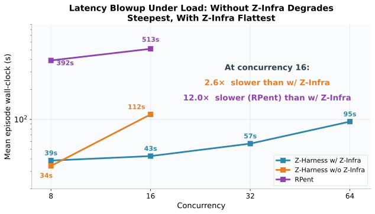

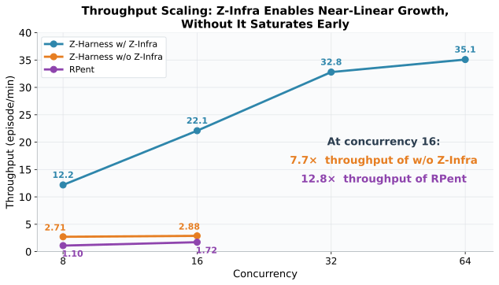

§4.6 在 8×A100 上固定模型 checkpoint 和动作预算，比较 Z-Infra、去掉 Z-Infra 的方法，以及 RPent。并发取 1、8、16、32、64；两种基线在超过 16 时显存不足。

| 指标／设置 | 论文结果 | 应怎样解释 |
| --- | --- | --- |
| 并发16的吞吐 | 22.09 vs 2.88 vs 1.72 ep/min | 对两基线分别约7.7×、12.8×，为同并发比较 |
| Z-Infra自身扩并发 | 12.18（8）→32.8（32）→35.1（64）ep/min | 高并发后逐渐饱和，不是无限线性扩展 |
| Z-Infra每回合延迟 | 39秒（8）→57秒（32）→95秒（64） | 吞吐提高时，单回合不一定更快 |
| 摘要/引言的11.1× | 相对RPent的推理加速，称延迟减少91% | §4.6另写11.9×每回合延迟改善，两者测量口径未统一 |
| 引言20.6× | 约1.7→35.1 ep/min | 端点并非同并发配置，不能替代上方匹配对照 |
| 模型拆分 | 延迟降53%，200ms SLO下有效吞吐2.4× | §3.3.3的模块服务测量，非全部学习流程 |
| 局部W8A8量化 | RTX4090上1.18–1.32× | 该硬件、该模块的结果，不能直接外推到A100 |

> **导师解读**：单回合延迟、每分钟完成数、模型调用延迟、完整演化花费是四个不同指标。Z-Infra 主要是让更多环境一起工作；它可以在单回合更慢的同时提高总吞吐。复现学习曲线时，还必须把离线生成补丁的成本加回来。

## 8. 训练和推理成本分析

### 8.1 更新什么，成本花在哪里

论文不训练基础策略参数，也没有给出另一套神经记忆模块的梯度训练；更新的是可执行代码、恢复技能、工具、配置和版本化经验，不只是把更多文字塞进 context/cache。主要开销包括基础策略推理、物理仿真与渲染、诊断和代码生成、候选重放、同种子回归、留出测试以及视频／轨迹存储（§2–4）。

论文没有报告总 GPU-hours、所有失败候选次数、整套实验 wall-clock 时间、API token 量和费用，也没有精确给出最小显存、CPU 核数和主机内存。不能仅凭“不微调”就说便宜，也不能给出可信的“总共多少元”估计。

> **导师解读**：这里节约的是反向传播和训练状态，不是所有计算。一份候选代码如果要在几十个种子上重新验证多次，环境执行费用仍然很高。预算表应分别记录生成候选的花费与检验候选的花费，才知道瓶颈在哪。

### 8.2 你的 8×80GB A100 是否合适

**论文事实**：§4.1 方法实验为 8×RTX4090；§4.6 吞吐实验为 8×A100，但未明确该 A100 的显存版本。**这是推断**：你的 GPU 型号和卡数与系统实验在这两项上相符，适合并行推理、仿真和多种子评估；80GB 显存也提供较大容量余量。但同样 8 卡不保证复现 35.1 ep/min，还取决于 CPU、内存、PCIe/NVLink、驱动、仿真栈、checkpoint 和调度配置。

模型执行进程按卡加载独立模型副本做数据并行，不是默认把八张卡合成一个 640GB 连续显存。也不能因为 GPU 充足就默认解决了演化智能体服务：本地动作策略与代码／多模态推理服务是两条资源链。论文没有提供一个已经验证的“完全不用外部模型服务”的等效配置。

> **导师解读**：对你而言，问题不是“显存够不够训练一个新大模型”，而是“能否用这些卡稳定地产生足够多、可复现的有效回合”。先跑小并发把分数和日志对齐，再扩到八卡；不要在单回合还不可靠时先追求最大吞吐。

### 8.3 最小配置应怎样理解

当前官方仓库将不需要仿真或模型的协议单元测试与真实硬件执行分开，后者还需要环境资产、策略权重和相应运行依赖。它也提醒 LIBERO-Pro 与 RoboCasa 的仿真依赖应隔离安装。代码和安装状态以读取时的官方记录为准，不是论文中额外报过成绩的新实验。[官方仓库](https://github.com/air-embodied-brain/Zetta-Embodiment)

**这是推断**：最小概念复现可以先用一个 LIBERO-Pro 任务、一份冻结策略、一个低并发环境、一种抓持检查和一种有界恢复；单 GPU 能否满足实际配置，要用真实 checkpoint 测峰值显存，不能从本文推出一个保证可行的卡型。它能验证流程，但不能冒充完整论文复现。

> **导师解读**：有三层“跑通”：协议测试通过、真实环境有一个完整执行闭环、论文级多任务统计重现。第一层可能不用 GPU，第三层则需要大量试验。把这三层分开，你才不会看到测试全绿就误以为复现出了论文成功率。

## 9. 这篇论文真正的贡献

### 9.1 作者主张与站得住的贡献

作者主张首次实现可学习代码检查器驱动的具身自进化、首次面向这类任务的基础设施，以及随探索扩展的 SOTA 表现（§1）。这些“首次”需要更完整的同期工作比较，本文的主表并未覆盖所有邻近方案。

更直接站得住的是：把高频检查、受限恢复、跨轨迹代码修改和验证晋级连接成可执行系统；在两个仿真基准上对相同冻结底座取得显著幅度的**数值提升**；提供累计版本、部分同种子技能栈比较及跨任务例子；用系统对照展示高并发执行的吞吐收益。“数值提升”在这里不等同于每项都通过统计显著性检验。

> **导师解读**：评价贡献不必在“全是新原理”和“只是拼系统”之间二选一。把许多组件连成可靠、可审计的物理执行闭环本身可以有价值。但方法有效到哪一步，应由匹配对照和公开记录说明，而不是由“首次”或“自进化”两个词决定。

### 9.2 工程组合与审稿人会追问的地方

Ray actor、批量推理、异步通道、模型拆分、代码技能库、失败聚类与回归测试都具有已有方法基础。创新重点应落在适合具身失败的组织方式和验证协议，不能将每个底层组件都当作新发明（§3、§5）。

审稿人可追问：状态权限是否公平；在线审批与离线 Agent 调用怎样兼容；为什么主表没有强 Agent 基线；每个生成与被拒绝候选是否公开；是否有等预算重试、无记忆、随机顺序对照；多次完整演化是否稳定；为什么存在 100%／50% 验收口径和 Projected 图例疑点；对长程失败和真机迁移有何边界。

> **导师解读**：最有用的质疑是能转成实验的质疑。例如“是不是多重试几次就能涨分”，对应等预算重试对照；“是不是挑中了一个好版本”，对应预注册检查点和完整失败版本日志。这样既能公平评价原文，也能找到真正能做的新工作。

## 10. 和相关论文的关系

### 10.1 六条路线的边界

| 路线 | 常见更新对象 | Zetta 的区别 |
| --- | --- | --- |
| RAG／memory agent | 检索的文本、事件或经验条目 | 记忆含可执行检查器和恢复程序，能直接改变何时接管控制 |
| Test-time adaptation | 测试阶段的参数、上下文或状态 | 它是部署期框架适应，基础策略权重不更新；不等于所有TTT都不训练 |
| Reinforcement learning | 策略／价值或其他可优化决策模块 | 用环境成败选择代码版本，但没有策略梯度、Q学习或神经actor-critic更新 |
| World model | 预测状态转移、潜在未来或视频 | Zetta不提出新的未来预测器；可包裹VLA/WAM，本文动作底座是两种VLA |
| Agent planning | 任务分解、工具选择、动作／程序规划 | 额外强调失败现场的检查与恢复、以及跨回合程序晋级 |
| Self-evolving agent | 从执行反馈修改记忆、工具、提示或模型 | 属于冻结模型、演化外部代码技能这一支，有累计版本和验证门控 |

> **导师解读**：这里的 critic 不是强化学习里的价值网络，“学习”也不只等于梯度训练。分类时看它读什么、改什么、什么时候影响动作。按这个标准，Zetta 是执行框架的程序级改进，不是另一个视频世界模型。

### 10.2 原文具体相关工作的比较

以下按 §5 的实际讨论深度归类；原文通常只做机制层定位，没有逐一重跑这些方法。不能把这种文献比较当作实验胜负。

| 原文提到的工作 | 原文如何定位；与Zetta的关系 |
| --- | --- |
| RT-1、RT-2、OpenVLA、$\pi_0$、$\pi_{0.5}$、GR00T、CogACT、UniVLA、FAST | 基础动作模型路线；提供已有控制能力，Zetta在其外增加治理，而不是替代这些模型的训练方法 |
| DreamZero、Cosmos-Policy、FAST-WAM | 世界动作模型路线；和Zetta的外层框架处于不同系统层级，不能将本文两种VLA结果当作已验证所有WAM |
| PaLM-E、Code as Policies | 语言推理／程序控制的先例；Zetta进一步围绕失败监控、恢复与验证组织跨轨迹演化 |
| RoboCat | 自采数据扩大机器人能力的路线；与本文冻结基础策略、修改外部技能的更新对象不同 |
| Claude Plays Robotics、CaP-X、HarnessVLA／RPent、Guava | 工具与执行脚手架增强策略的近邻；RPent参与本文系统速度比较，但主成功率表没有统一列出这组方法 |
| Reflexion | 语言反馈与反思；Zetta强调反馈要落实为可执行检查和恢复 |
| Self-Refine | 迭代修订输出；Zetta修改的是会在物理仿真中检验的程序 |
| Voyager | 可执行技能库；Zetta把高频物理检查、恢复条件与晋级规则结合起来 |
| OPRO、SkillOpt | 提示／程序优化思想；本文将代码迭代类比为有界优化，但没有可微SGD |
| ENPIRE、Visual Verification／VERITAS、Learning While Deploying、SOP | 执行、验证、数据选择及策略改进的部署闭环；本文固定策略参数，主要更新外部框架 |
| ASPIRE、ReSYNC、VASO、EmbodiSkill | 从失败中获得程序、概念、契约或技能的近邻；本文主张共同处理高频检查、可恢复轨迹和高吞吐执行，需强同预算对比才能量化独特贡献 |
| RoboTTT、R&B-EnCoRe、EEAgent、SEEA-R1 | 原文归为测试时上下文、反馈、反思或强化调整路线；本文不逐一给出统一实验，不能仅凭引用判定其不具备闭环 |
| A3C、IMPALA、SEED RL、RLlib/Ray、Acme、RLinf | 异步采样、执行者／学习器解耦和集中推理先例；Z-Infra将这些系统思想适配到异构仿真、动作模型、感知和工具负载 |

> **导师解读**：这个表不支持“这些工作都做不到”，而是说明系统层级的差异。最值得实测的近邻是同样冻结策略、使用代码或恢复技能的方案；拿一个训练底座的方法和一套外部框架只比论文摘要分数，无法归因。

### 10.3 与精读库中的 Teach-and-Grow、SHAPER、MemRL

这三项是帮助你定位的**库内延伸比较，不是 Zetta 原文中的统一实验**。[Teach-and-Grow](/papers/teach-and-grow) 重点在从示范与经验中归纳可复用技能及适用范围；[SHAPER](/papers/shaper) 属于冻结模型、演化外部技能／执行程序的近邻；[MemRL](/papers/memrl) 则为情景记忆学习效用并影响检索。Zetta 这里最突出的单位是“能在执行过程中触发的物理检查—恢复程序”，并给出部分累计版本的匹配对照。

**评价**：围绕机器人跨回合记忆做新论文时，Zetta 应列为强邻近工作；不能再简单主张“操作域没人画过冻结策略的累计改进曲线”。仍需检验的更窄问题包括经验顺序、独立演化方差、等量交互对照、未选择检查点曲线和无特权状态条件。

> **导师解读**：与导师讨论时可以这样说：“它已经做了冻结策略外的技能积累和部分匹配评估；我们若继续做，贡献必须是更严格的纵向归因，或一个解决它明确缺陷的新机制。”这比从标题上找‘memory’或‘self-evolving’的不同更有说服力。

## 11. 我应该怎么复现一个最小版本

### 11.1 最小环境、模型与数据结构

以下是**这是推断：建议的MVP设计，不是作者保证的最小配置**。先选 LIBERO-Pro Goal 的一个可复现抓取任务，使用冻结 $\pi_{0.5}$，限定一种运行时抓持检查和一种有界重抓；再扩展到 3 个任务。不要一开始复制整套 18+40 个设置。原文级复现仍需恢复完整任务、种子、权限、动作预算和模型版本。

| 必须保存 | 用途与来源 |
| --- | --- |
| manifest：任务、checkpoint哈希、代码版本、种子、步数预算、状态权限 | 固定实验条件；论文有确定性协议，哈希细节是复现加强项 |
| trajectory：$s_t,a_t,\mu_t,\phi_t$、官方success、视频索引 | Eq. 7的证据链 |
| failure_cluster：成员种子、EOD、首缺里程碑、代表种子 | §2.4诊断输入 |
| candidate：检查器代码、恢复代码、阈值、父版本、生成记录 | 审计“到底改了什么”；保存拒绝候选是加强项 |
| gate_result：原种子、回归、留出结果及每回合记录 | §2.5–2.6验证与晋级 |
| promoted_skill：适用对象、触发条件、恢复、重新接入条件、版本 | 可复用长期框架能力 |
| failed_grasp_memory：已经失败的抓取提案及等价判定 | Algorithm 1/2的回合内避免重复失败 |

> **导师解读**：MVP 不应该先把 UI、调度集群和所有工具堆满，而应先证明一条经验能改变下一次执行，并在未见种子上带来收益。表里的每种记录都对应一个可能的质疑：没有父版本就不知道改了什么，没有失败候选就不知道挑了多少次。

### 11.2 每一步伪代码

```python
# 复现建议：最终测试集不参与候选选择；开发验证集另设。
policy = load_frozen_policy(checkpoint)
harness = empty_or_fixed_initial_harness()
dev, validation, final_test = preregister_disjoint_seeds()
for round_id in range(fixed_round_budget):
    traces = rollout(policy, harness, dev, fixed_action_budget)
    valid = rerun_only_infrastructure_invalid_with_same_seed(traces)
    references = success_index(valid)
    clusters = cluster_by_first_missing_and_eod(valid, references)
    for cluster in clusters:
        evidence = diagnose_by_priority(cluster.medoid, references)
        candidate = write_minimal_bounded_patch(harness, evidence)
        log_candidate_even_if_rejected(candidate)
        if not shadow_replay_detects_failure_without_excess_false_triggers(candidate):
            continue
        if not paired_closed_loop_gate(candidate, harness, cluster):
            continue
        merged = consolidate(harness, candidate)
        if regression_passes(merged) and validation_gain_is_acceptable(merged):
            harness = freeze_and_version(merged)
    log_full_round_cost_and_unselected_checkpoints()
    save_checkpoint(harness)
final_result = evaluate_once(policy, harness, final_test)
```

其中分开 validation/final_test、记录全部拒绝版本和误触发阈值，是为避免选择偏差提出的加强项。原文自己的协议允许某留出样本被用于修改后转入开发，但必须更换最终未见测试集；两种方案不能在报告中悄悄混用。

> **导师解读**：这个循环应当做到“拒绝一个补丁也留下记录”。如果只保存晋级版本，你只能看到成功故事，无法计算探索成本或检验版本选择偏差。最终测试只负责回答结果，不负责教你改下一版。

### 11.3 日志与最小实验表

日志至少包括每个逻辑 seed 的真实尝试次数、基础设施无效原因、官方成败、总动作步数、干预次数、检查器误报／漏报、恢复成败、交接时刻、技能版本、API调用数／token（若使用）、GPU秒、仿真秒和墙钟时间。身份、提示和配置用可审计标识记录，凭证不进入日志。

| 对照组 | 是否跨回合保存 | 干预能力 | 要排除什么解释 |
| --- | --- | --- | --- |
| 冻结策略 | 否 | 无新增恢复 | 基础地板 |
| 等预算重试 | 否 | 同动作／尝试总预算 | 只是试得更多 |
| 固定人工检查与恢复 | 固定，不演化 | 有 | 全部收益其实来自静态工程 |
| 每轮生成后清空 | 否 | 有 | 即时补丁而非长期积累 |
| 完整累计框架 | 是 | 有 | 目标方法 |

建议按任务和独立演化重复，报告成功数／总数、配对增益置信区间、全部环境步数、总时间、负迁移率，并画 SR 对累计有效回合数的曲线。多次独立演化是建议，原文主结果没有给出这类方差；当前精读并未在你的服务器上运行任何复现实验。

> **导师解读**：最小表的价值在于每一行都回答一个竞争解释。如果完整框架只胜过裸模型，却不胜过等预算重试，你还不能把收益归因于长期记忆；如果只在一个演化顺序上有效，也还不能说持续学习稳定。

## 12. 如果我要基于它做新论文

本章全部是**这是推断：研究提案，不是原文结论**。下面五个方向都要先固定底座、环境、状态权限和总交互预算。

### 12.1 受控纵向评测：经验积累究竟贡献多少

**新想法**：把全部候选、失败、晋级和回访记录成预注册的纵向基准。**改动**：横轴从选择后的版本编号换成真实累计交互成本，加入等预算重试、清空记忆及任务顺序随机化。**可能有效的原因**：能分离工具增强、选择偏差与跨回合知识收益。**验证**：至少多个任务、多次独立演化，配对最终分数与曲线面积，报告所有检查点。**风险**：这可能主要是评测贡献；若没有明确发现或新机制，单靠更严实验不一定足以构成强方法论文。

> **导师解读**：原文已经画过曲线，你的新意必须从“画没画”升级到“这条上升能归因于什么”。先做这组对照还可能推翻你原来的假设，因此要接受结果不支持长期记忆独特收益的可能。

### 12.2 无特权状态的可校准检查器

**新想法**：把接触、抓持和物体相对位姿变成带不确定性的可观测估计，证据不充分时不直接接管。**改动**：减少对仿真真值的依赖，引入置信校准、时间一致性和拒绝判断。**原因**：现实部署中的主要风险可能是错误检测而非没有恢复程序。**验证**：真值输入、噪声输入、纯可观测输入三档比较，测检测误报／漏报、干预净收益和任务成功。**风险**：感知模块可能成为更大的研究范围；若训练新感知模型，需说明已超出零梯度约束。

> **导师解读**：不只是把检查器“做聪明一点”，而是让它知道什么时候证据不足。否则一句错误的“物体掉了”就可能打断本来成功的动作，这正是从仿真走向真机时应优先测试的负面情况。

### 12.3 带回滚和冲突检测的技能晋级

**新想法**：长期技能库保存适用范围、冲突和回退关系，而不是不断叠加触发条件。**改动**：候选晋级同时检查旧任务保持、触发竞争和恢复循环，必要时局部回滚。**原因**：更多检查器不必然更好，条件 OR 合并可能扩大误触发。**验证**：长任务流、旧任务回访、相冲突物体／场景，比较只追加与冲突感知库，测负迁移与库规模。**风险**：门控过严会阻碍有效技能入库，回归成本也会随库增长。

> **导师解读**：记忆越多不一定越聪明，可能只是越来越容易被某条旧规则打断。这个方向把“自进化”从一条只升不降的曲线，变成允许发现错误、撤销错误和保住旧能力的长期系统。

### 12.4 面向反馈延迟的执行安全契约

**新想法**：把在线审批、检查延迟与重新接入条件统一成可测量的时序契约。**改动**：明确哪些决定由快速代码执行，哪些必须等待慢速模型，超时采用什么有界保守动作。**原因**：原文两种 Agent 调用口径不清，真实控制又不能无限等待。**验证**：人为增加感知／API延迟，比较固定频率、事件触发和超时回退，测危险接管、重复切换、成功率和延迟。**风险**：仿真安全指标不必然代表真机安全；不能未经真实验证声称获得安全保证。

> **导师解读**：这不是只优化毫秒数，而是规定“谁有权在多长时间内做哪种决定”。速度测量和权限边界统一后，才能公平比较大模型在线治理与代码化治理的成本和可靠性。

### 12.5 从单技能迁移到长期组合与失败传播

**新想法**：研究已经成功的局部恢复如何在长程任务里组合，以及一次修复是否破坏后续子目标。**改动**：显式记录技能前置条件、后置条件和残余风险，在执行图中验证后续可达性。**原因**：Table 3 的 Long 明显弱于 Goal，局部修好不保证整段完成。**验证**：LIBERO-10低分任务、技能顺序变化和新组合，比较局部贪心恢复与契约组合，报告第一次未解决失败、总步数和末端成功。**风险**：如果靠额外规划模型或更多动作预算提升，就无法证明是组合记忆本身有效。

> **导师解读**：瓶子抓稳了但挡住后面要开的抽屉，局部恢复就可能制造下一次失败。这个方向把“当前恢复能成功”提升为“当前恢复不会破坏后面的任务”，与原文长程弱点直接对应。

## 13. 阅读检查题与参考答案

1. **Zetta的学习对象是什么？** 参考答案：外部执行框架中的检查器、恢复技能、工具与配置；基础策略和固定编排逻辑不做参数更新。不是训练一个新世界模型。

2. **为什么不能简单说基线完全开环？** 参考答案：原文一处称VLA开环，另一处明确称pure VLA closed-loop。合理边界是新增显式可演化的监测、接管和跨回合验证，不是否认基线读取新观测。

3. **三个循环和三个阶段有什么区别？** 参考答案：循环区分动作、批量轨迹和迭代的时间尺度；阶段区分失败画像、诊断修复、整合泛化的工作流程，不能直接一一等同。

4. **Eq. 2的检查器可以直接执行恢复吗？** 参考答案：不可以。它只输出证据和建议模式；Eq. 3由编排者审批，最终任务成功由官方谓词判定。

5. **Eq. 10与Eq. 11各定位什么，缺哪些实现细节？** 参考答案：前者找最早状态偏离时间，后者选应修复的诊断层；距离、阈值、参照选择及根因打分未完整规定，不能假称已给出唯一数值实现。

6. **恢复后为什么还要检查Eq. 12？** 参考答案：原失败清除不等于物理状态稳定。二者同时满足后才重新接入基础策略，避免瞬态振荡或不稳抓取造成二次失败。

7. **90.8%和71.13%为什么都对？** 参考答案：90.8%是Goal-T与Goal-S平均90.75%的舍入；71.13%包含Goal和LIBERO-10共40个任务设置。分母不同，不能混用。

8. **论文是否没有受控累计曲线？** 参考答案：不是。Figure 6/9展示累计版本；Figure 7/8有固定种子和区间，Figure 8明确匹配策略随机数、checkpoint、预算。但缺少完整成本归一化、多独立演化和顺序对照；源任务某面板只有5例。

9. **哪两类图表信息最需要作者澄清？** 参考答案：Figure 10/11的Projected transfer checkpoint图例与正文评估措辞如何对应；Figure 9中间均值的实际分母和汇总方式。另有Goal-S6基线和速度口径差异。疑点不等于造假结论。

10. **8×80GB A100是否意味着可无条件复现？** 参考答案：不。系统实验确实用8×A100，但显存版本、CPU/内存、软件、模型服务和总成本并未完全披露。应先跑低并发闭环，再做匹配种子评估；协议测试通过也不等于复现主表。

> **导师解读**：如果你能同时讲出“它新增了什么执行机制”“哪些对照已经做了”“还有哪些证据不够”，才算真正读懂。尤其不要为了自己的研究定位，把它已经有的累计曲线说成没有；也不要因为摘要分数高，就忽略长程弱点和统计口径疑问。

阅读来源：[arXiv记录](https://arxiv.org/abs/2608.16590v1)、[全文HTML](https://arxiv.org/html/2608.16590v1)、[原始PDF](https://arxiv.org/pdf/2608.16590v1)、[作者项目页](https://air-embodied-brain.github.io/zetta/)、[官方代码](https://github.com/air-embodied-brain/Zetta-Embodiment)。原图、公式和原始表格均保留；图例和口径疑点没有被译者擅自修改。

